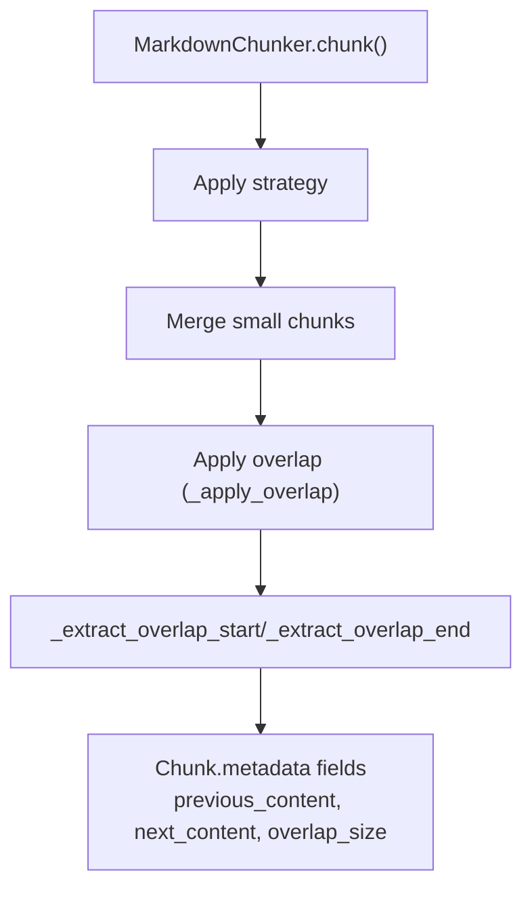
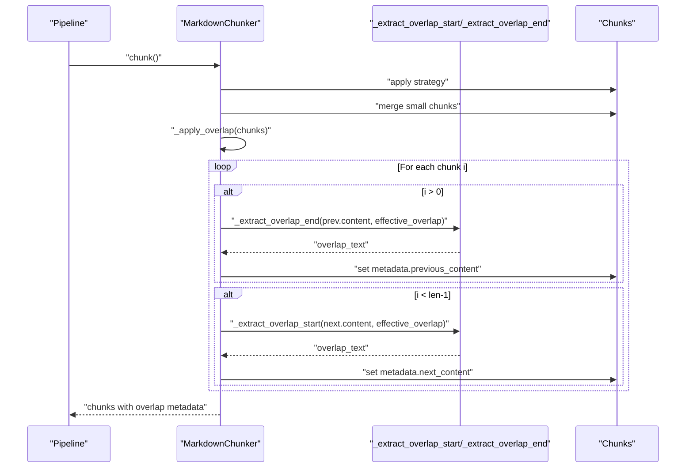
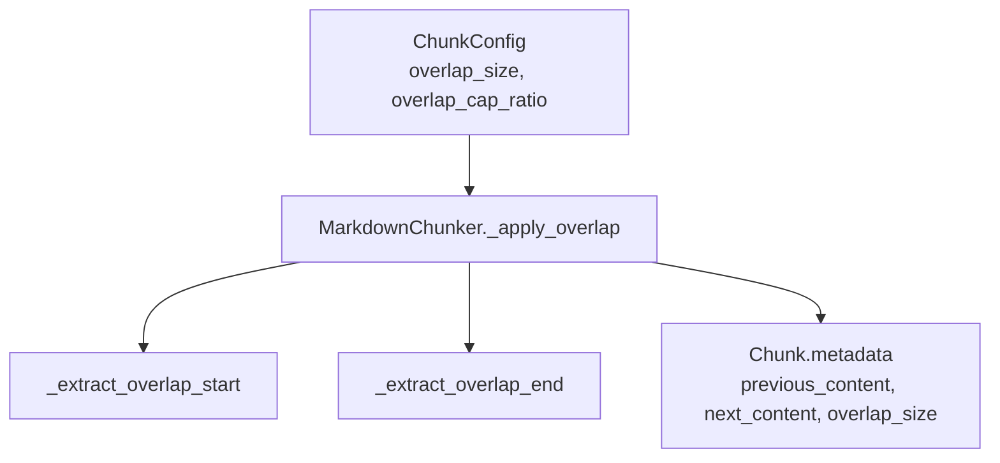

# Overlap Application

<cite>
**Referenced Files in This Document**
- [chunker.py](file://src/chunkana/chunker.py)
- [config.py](file://src/chunkana/config.py)
- [types.py](file://src/chunkana/types.py)
- [formatters.py](file://src/chunkana/renderers/formatters.py)
- [test_invariants.py](file://tests/property/test_invariants.py)
- [test_canonical.py](file://tests/baseline/test_canonical.py)
- [simple_text.jsonl](file://tests/baseline/golden_canonical/simple_text.jsonl)
</cite>

## Table of Contents
1. [Introduction](#introduction)
2. [Project Structure](#project-structure)
3. [Core Components](#core-components)
4. [Architecture Overview](#architecture-overview)
5. [Detailed Component Analysis](#detailed-component-analysis)
6. [Dependency Analysis](#dependency-analysis)
7. [Performance Considerations](#performance-considerations)
8. [Troubleshooting Guide](#troubleshooting-guide)
9. [Conclusion](#conclusion)
10. [Appendices](#appendices)

## Introduction
This document explains the overlap application phase in the chunking pipeline. It focuses on the metadata-only overlap model that augments chunks with contextual previews from neighboring chunks without duplicating text in chunk.content. The overlap mechanism:
- Adds previous_content and next_content metadata fields
- Respects word boundaries during extraction
- Adapts overlap size based on chunk size using overlap_cap_ratio
- Avoids index bloat by keeping context out of chunk.content
- Supports configuration via overlap_size and overlap_cap_ratio

## Project Structure
The overlap application lives in the main chunker and is integrated into the linear pipeline. Key locations:
- Overlap application logic: MarkdownChunker._apply_overlap and helper extraction methods
- Configuration: ChunkConfig with overlap_size and overlap_cap_ratio
- Types: Chunk metadata fields for overlap
- Rendering: Utilities to embed overlap into content views for compatibility



**Diagram sources**
- [chunker.py](file://src/chunkana/chunker.py#L158-L176)
- [chunker.py](file://src/chunkana/chunker.py#L301-L369)
- [chunker.py](file://src/chunkana/chunker.py#L371-L429)

**Section sources**
- [chunker.py](file://src/chunkana/chunker.py#L158-L176)
- [chunker.py](file://src/chunkana/chunker.py#L301-L369)

## Core Components
- Overlap application: Adds metadata-only context around each chunk
- Word-boundary-aware extraction: Ensures overlap starts/ends at word boundaries
- Adaptive overlap sizing: Caps overlap by overlap_size and by overlap_cap_ratio of adjacent chunk size
- Configuration: overlap_size and overlap_cap_ratio define base window and scaling factor
- Rendering helpers: Optional views that embed overlap into content for compatibility

Key responsibilities:
- Maintain chunk.content as non-overlapping text
- Populate previous_content and next_content metadata fields
- Record effective overlap_size in metadata for downstream consumers

**Section sources**
- [chunker.py](file://src/chunkana/chunker.py#L301-L369)
- [chunker.py](file://src/chunkana/chunker.py#L371-L429)
- [config.py](file://src/chunkana/config.py#L80-L81)
- [config.py](file://src/chunkana/config.py#L124-L126)
- [types.py](file://src/chunkana/types.py#L279-L289)

## Architecture Overview
The overlap phase runs after chunking and before final metadata enrichment. It iterates over the chunk list and for each chunk:
- Previous context: Take up to effective_overlap_size characters from the end of the previous chunk’s content, adjusted to a word boundary
- Next context: Take up to effective_overlap_size characters from the start of the next chunk’s content, adjusted to a word boundary
- Effective overlap is the minimum of overlap_size and the adaptive cap based on adjacent chunk size



**Diagram sources**
- [chunker.py](file://src/chunkana/chunker.py#L158-L176)
- [chunker.py](file://src/chunkana/chunker.py#L301-L369)
- [chunker.py](file://src/chunkana/chunker.py#L371-L429)

## Detailed Component Analysis

### Metadata-only overlap model
- Purpose: Provide language models with contextual previews without duplicating text in chunk.content
- Fields added:
  - previous_content: Preview from the end of the previous chunk
  - next_content: Preview from the start of the next chunk
  - overlap_size: Effective size of the context window used
- Behavior:
  - chunk.content remains distinct and non-overlapping
  - overlap metadata avoids index bloat and semantic search confusion
  - Both previews are metadata-only and not embedded in chunk.content

Evidence:
- Documentation comments in _apply_overlap describe metadata-only context
- Validation ensures overlap is metadata-only, not embedded in content
- Baseline golden outputs show previous_content/next_content in metadata

**Section sources**
- [chunker.py](file://src/chunkana/chunker.py#L301-L369)
- [chunker.py](file://src/chunkana/chunker.py#L309-L335)
- [test_invariants.py](file://tests/property/test_invariants.py#L387-L414)
- [simple_text.jsonl](file://tests/baseline/golden_canonical/simple_text.jsonl#L1-L4)

### Adaptive overlap sizing with overlap_cap_ratio
- Base cap: overlap_size (default 200)
- Adaptive cap: overlap_cap_ratio (default 0.35) of adjacent chunk size
- Effective overlap: min(overlap_size, adaptive_cap)
- Rationale: Larger chunks can afford larger overlap; prevents excessive bloat

Implementation highlights:
- For previous_content: compute max_overlap from previous chunk size and cap by overlap_size
- For next_content: compute max_overlap from next chunk size and cap by overlap_size
- Effective overlap is recorded in overlap_size metadata

**Section sources**
- [chunker.py](file://src/chunkana/chunker.py#L314-L335)
- [chunker.py](file://src/chunkana/chunker.py#L349-L355)
- [chunker.py](file://src/chunkana/chunker.py#L360-L367)
- [config.py](file://src/chunkana/config.py#L80-L81)
- [config.py](file://src/chunkana/config.py#L124-L126)

### Word-boundary-aware extraction
Extraction strategies:
- _extract_overlap_end (previous_content):
  - If content length <= size, return entire content
  - Otherwise, take last size characters and adjust to start at the first space in the first half
- _extract_overlap_start (next_content):
  - If content length <= size, return entire content
  - Otherwise, take first size characters and adjust to end at the last space in the second half

Benefits:
- Avoids cutting words mid-way
- Improves readability and LM understanding of boundaries

```mermaid
flowchart TD
Start(["Start overlap extraction"]) --> Mode{"Which direction?"}
Mode --> |End (previous_content)| EndSel["Select last 'size' chars"]
Mode --> |Start (next_content)| StartSel["Select first 'size' chars"]
EndSel --> CheckLen{"Content length <= size?"}
CheckLen --> |Yes| ReturnFull["Return full content"]
CheckLen --> |No| AdjustEnd["Find first space in first half<br/>and advance past it"]
AdjustEnd --> ReturnEnd["Return adjusted substring"]
StartSel --> CheckLen2{"Content length <= size?"}
CheckLen2 --> |Yes| ReturnFull2["Return full content"]
CheckLen2 --> |No| AdjustStart["Find last space in second half<br/>and truncate before it"]
AdjustStart --> ReturnStart["Return adjusted substring"]
ReturnFull --> End(["Done"])
ReturnEnd --> End
ReturnFull2 --> End
ReturnStart --> End
```

**Diagram sources**
- [chunker.py](file://src/chunkana/chunker.py#L371-L429)

**Section sources**
- [chunker.py](file://src/chunkana/chunker.py#L371-L429)

### Configuration parameters and their impact
- overlap_size:
  - Base context window size (default 200)
  - Larger values increase cross-chunk context but risk bloat for small chunks
- overlap_cap_ratio:
  - Fraction of adjacent chunk size to cap overlap (default 0.35)
  - Larger ratios allow proportionally larger overlap for larger chunks
  - Must be in (0, 1] per validation

Impact on retrieval quality:
- Too small overlap: models may miss boundary cues
- Too large overlap: increases index size and potential noise
- Adaptive scaling balances context vs. index size across chunk sizes

**Section sources**
- [config.py](file://src/chunkana/config.py#L80-L81)
- [config.py](file://src/chunkana/config.py#L124-L126)
- [config.py](file://src/chunkana/config.py#L138-L151)
- [config.py](file://src/chunkana/config.py#L222-L229)

### Examples: How overlap metadata enhances context
- Golden baseline example shows previous_content and next_content in metadata for middle chunk
- Demonstrates that chunk.content remains distinct and non-overlapping
- Embedding overlap into rendered content is supported via renderers for compatibility

Evidence:
- Baseline JSONL shows previous_content/next_content fields in metadata
- Renderers can embed overlap for compatibility modes

**Section sources**
- [simple_text.jsonl](file://tests/baseline/golden_canonical/simple_text.jsonl#L1-L4)
- [formatters.py](file://src/chunkana/renderers/formatters.py#L87-L116)

### Difference between physical text duplication and metadata-only context
- Physical duplication: Adding overlapping text directly into chunk.content
- Metadata-only: Storing previews in metadata fields only
- Benefits of metadata-only:
  - Avoids index bloat
  - Reduces semantic search confusion
  - Preserves clean, non-overlapping chunk.content
  - Validation enforces that chunk.content does not start with previous_content

**Section sources**
- [chunker.py](file://src/chunkana/chunker.py#L309-L335)
- [test_invariants.py](file://tests/property/test_invariants.py#L387-L414)

## Dependency Analysis
Overlap depends on:
- ChunkConfig for overlap_size and overlap_cap_ratio
- Chunk metadata fields for storing previews and effective size
- Extraction helpers for word-boundary-aware slicing



**Diagram sources**
- [config.py](file://src/chunkana/config.py#L80-L81)
- [config.py](file://src/chunkana/config.py#L124-L126)
- [chunker.py](file://src/chunkana/chunker.py#L301-L369)
- [chunker.py](file://src/chunkana/chunker.py#L371-L429)
- [types.py](file://src/chunkana/types.py#L279-L289)

**Section sources**
- [config.py](file://src/chunkana/config.py#L80-L81)
- [config.py](file://src/chunkana/config.py#L124-L126)
- [chunker.py](file://src/chunkana/chunker.py#L301-L369)
- [chunker.py](file://src/chunkana/chunker.py#L371-L429)
- [types.py](file://src/chunkana/types.py#L279-L289)

## Performance Considerations
- Complexity:
  - _apply_overlap iterates over chunks once and performs constant-time slicing plus word-boundary adjustments
  - Overall: O(n) over the number of chunks
- Memory:
  - Metadata-only approach avoids duplicating text; memory overhead is proportional to overlap_size and number of chunks
- Adaptive caps:
  - Smaller chunks incur smaller effective overlap, reducing memory footprint
- Rendering:
  - Embedding overlap into content is a view operation and does not mutate chunks

Recommendations:
- Tune overlap_size for your corpus size and retrieval goals
- Use overlap_cap_ratio to balance context vs. index size across chunk sizes
- For very large chunk lists, consider streaming chunkers if needed, though overlap itself is linear

**Section sources**
- [chunker.py](file://src/chunkana/chunker.py#L301-L369)
- [chunker.py](file://src/chunkana/chunker.py#L371-L429)

## Troubleshooting Guide
Common issues and checks:
- Overlap not appearing:
  - Ensure overlap_size > 0 and enable_overlap is True (computed from overlap_size)
  - Verify chunks.length > 1
- Unexpectedly small overlap:
  - Check overlap_cap_ratio and adjacent chunk sizes; effective overlap may be capped
- Overlap appears in chunk.content:
  - This is invalid; validation enforces metadata-only overlap
- Configuration errors:
  - overlap_cap_ratio must be in (0, 1]
  - overlap_size must be non-negative and less than max_chunk_size

**Section sources**
- [config.py](file://src/chunkana/config.py#L138-L151)
- [config.py](file://src/chunkana/config.py#L222-L229)
- [test_invariants.py](file://tests/property/test_invariants.py#L387-L414)

## Conclusion
The overlap application phase introduces metadata-only context that helps language models understand chunk boundaries without duplicating text. By combining a base overlap window with adaptive caps based on chunk size and respecting word boundaries, the system achieves balanced context while controlling index size. Configuration parameters overlap_size and overlap_cap_ratio allow tuning for retrieval quality and performance.

## Appendices

### Configuration Quick Reference
- overlap_size: Base context window size (default 200)
- overlap_cap_ratio: Fraction of adjacent chunk size to cap overlap (default 0.35)
- enable_overlap: Computed from overlap_size > 0

**Section sources**
- [config.py](file://src/chunkana/config.py#L80-L81)
- [config.py](file://src/chunkana/config.py#L124-L126)
- [config.py](file://src/chunkana/config.py#L249-L251)

### Rendering Compatibility Notes
- render_with_embedded_overlap produces a view that concatenates previous_content + content + next_content for compatibility with plugin expectations
- This is a view operation and does not modify chunk.content

**Section sources**
- [formatters.py](file://src/chunkana/renderers/formatters.py#L87-L116)