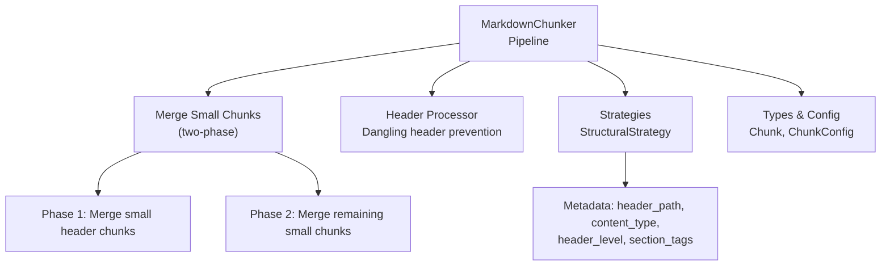
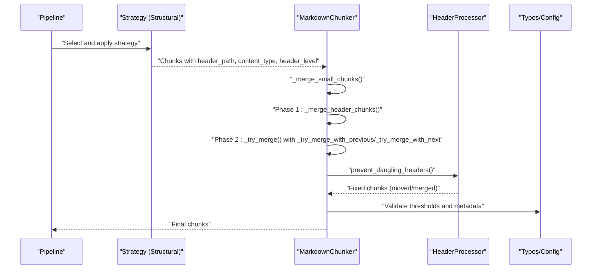
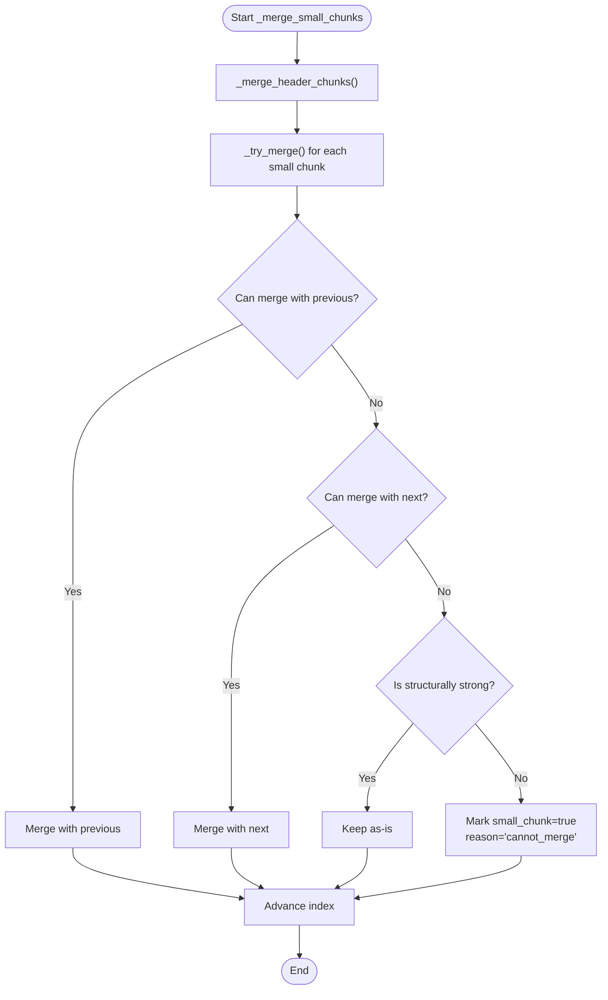
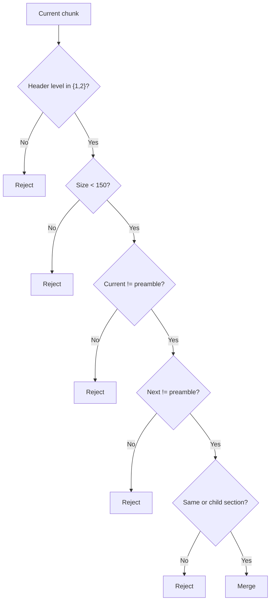
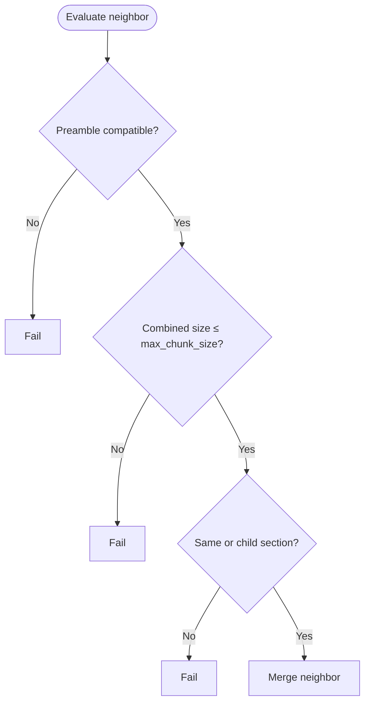
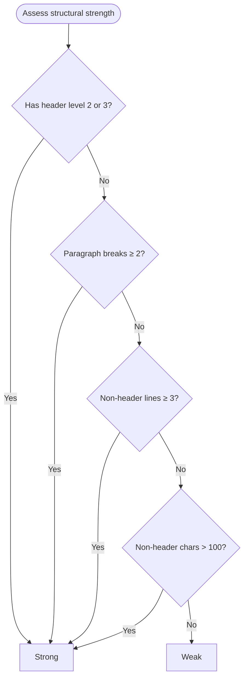
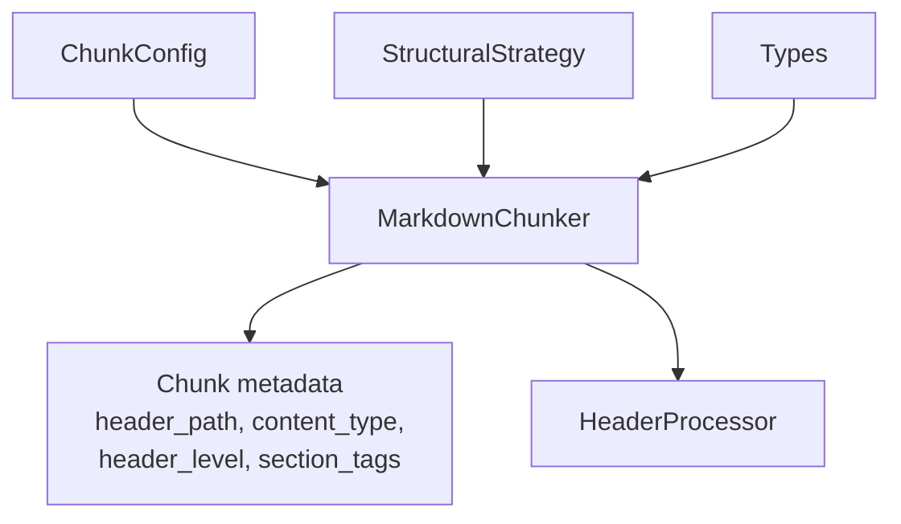

# Small Chunk Merging

<cite>
**Referenced Files in This Document**
- [chunker.py](file://src/chunkana/chunker.py)
- [header_processor.py](file://src/chunkana/header_processor.py)
- [structural.py](file://src/chunkana/strategies/structural.py)
- [types.py](file://src/chunkana/types.py)
- [config.py](file://src/chunkana/config.py)
- [test_micro_chunks.py](file://test_micro_chunks.py)
- [test_structural_strength.py](file://tests/unit/test_structural_strength.py)
</cite>

## Table of Contents
1. [Introduction](#introduction)
2. [Project Structure](#project-structure)
3. [Core Components](#core-components)
4. [Architecture Overview](#architecture-overview)
5. [Detailed Component Analysis](#detailed-component-analysis)
6. [Dependency Analysis](#dependency-analysis)
7. [Performance Considerations](#performance-considerations)
8. [Troubleshooting Guide](#troubleshooting-guide)
9. [Conclusion](#conclusion)
10. [Appendices](#appendices)

## Introduction
This document explains the small chunk merging phase in the pipeline. It covers the two-phase approach:
- Phase 1: Merge small header-only chunks with their section bodies.
- Phase 2: Merge remaining small chunks with adjacent chunks based on size and structural compatibility.

It also documents the conditions for header chunk merging (size threshold, header level, and section relationship), how merging decisions are evaluated, and how structural strength prevents mis-flagging small chunks. Finally, it describes configuration dependencies (notably min_chunk_size) and the impact on downstream processing.

## Project Structure
The small chunk merging logic is implemented in the main chunker class and integrated into the chunking pipeline. Supporting components include:
- Strategy selection and application (structural strategy populates metadata like header_path and content_type).
- Types and configuration that define chunk metadata and thresholds.
- Tests that validate merging behavior and structural strength detection.

**Diagram sources**
- [chunker.py](file://src/chunkana/chunker.py#L470-L514)
- [header_processor.py](file://src/chunkana/header_processor.py#L405-L451)
- [structural.py](file://src/chunkana/strategies/structural.py#L52-L150)
- [types.py](file://src/chunkana/types.py#L240-L320)
- [config.py](file://src/chunkana/config.py#L77-L81)

**Section sources**
- [chunker.py](file://src/chunkana/chunker.py#L85-L176)
- [structural.py](file://src/chunkana/strategies/structural.py#L52-L150)
- [types.py](file://src/chunkana/types.py#L240-L320)
- [config.py](file://src/chunkana/config.py#L77-L81)

## Core Components
- Two-phase merging in the chunker:
  - Phase 1 merges small header-only chunks (levels 1–2) with their immediate section body when appropriate.
  - Phase 2 merges remaining small chunks with adjacent neighbors based on size and structural compatibility.
- Structural strength evaluation prevents small chunks from being flagged when they contain meaningful content.
- Configuration parameters drive thresholds and behavior (min_chunk_size, max_chunk_size, overlap_size).

Key responsibilities:
- Merge small header chunks with section bodies.
- Merge remaining small chunks with left or right neighbors respecting size and section boundaries.
- Flag truly weak small chunks and record reasons.
- Maintain metadata correctness after merges.

**Section sources**
- [chunker.py](file://src/chunkana/chunker.py#L470-L514)
- [chunker.py](file://src/chunkana/chunker.py#L516-L579)
- [chunker.py](file://src/chunkana/chunker.py#L683-L776)
- [chunker.py](file://src/chunkana/chunker.py#L634-L682)
- [config.py](file://src/chunkana/config.py#L77-L81)

## Architecture Overview
The small chunk merging is part of the main pipeline and interacts with:
- Strategy selection and application (structural strategy sets header_path and content_type).
- Header processor (prevents dangling headers by moving or merging).
- Types and configuration (define metadata and thresholds).

**Diagram sources**
- [chunker.py](file://src/chunkana/chunker.py#L147-L176)
- [chunker.py](file://src/chunkana/chunker.py#L470-L514)
- [header_processor.py](file://src/chunkana/header_processor.py#L405-L451)
- [structural.py](file://src/chunkana/strategies/structural.py#L52-L150)
- [types.py](file://src/chunkana/types.py#L240-L320)
- [config.py](file://src/chunkana/config.py#L77-L81)

## Detailed Component Analysis

### Two-Phase Small Chunk Merging
- Phase 1: Merge small header-only chunks with their section body.
  - Conditions: header level 1 or 2, small size (heuristic threshold), not preamble, next chunk in same or child section, next chunk not preamble.
  - Updates metadata (e.g., section_tags) and content_type when needed.
- Phase 2: For remaining small chunks (< min_chunk_size), attempt to merge with previous or next neighbor.
  - Enforces max_chunk_size, preamble compatibility, and same logical section.
  - Left preference is applied when merging with previous neighbor.
  - If merging fails, mark small_chunk and small_chunk_reason if structurally weak.

**Diagram sources**
- [chunker.py](file://src/chunkana/chunker.py#L470-L514)
- [chunker.py](file://src/chunkana/chunker.py#L516-L579)
- [chunker.py](file://src/chunkana/chunker.py#L683-L776)
- [chunker.py](file://src/chunkana/chunker.py#L634-L682)

**Section sources**
- [chunker.py](file://src/chunkana/chunker.py#L470-L514)
- [chunker.py](file://src/chunkana/chunker.py#L516-L579)
- [chunker.py](file://src/chunkana/chunker.py#L683-L776)
- [chunker.py](file://src/chunkana/chunker.py#L634-L682)

### Header Chunk Merging Conditions
- Header level must be 1 or 2.
- Current chunk size must be below a threshold (150 characters heuristic).
- Current chunk must not be preamble.
- Next chunk must not be preamble.
- Next chunk must be in the same logical section or a child section.
- Logical section comparison uses header_path prefixes up to two levels.

**Diagram sources**
- [chunker.py](file://src/chunkana/chunker.py#L581-L633)

**Section sources**
- [chunker.py](file://src/chunkana/chunker.py#L516-L579)
- [chunker.py](file://src/chunkana/chunker.py#L581-L633)

### Evaluation of Adjacent Chunks for Merging
- Preamble compatibility: both chunks must be preamble or both must not be preamble.
- Combined size: total size must not exceed max_chunk_size.
- Logical section membership: header_path must match up to two levels (same or child).
- Preference: left (previous) neighbor is preferred over right (next) neighbor.

**Diagram sources**
- [chunker.py](file://src/chunkana/chunker.py#L708-L776)

**Section sources**
- [chunker.py](file://src/chunkana/chunker.py#L708-L776)

### Structural Strength Logic
A chunk is considered structurally strong if any of the following are true:
- Has a strong header (level 2 or 3).
- Has multiple paragraphs (≥2 paragraph breaks).
- Has sufficient non-header lines (≥3).
- Has meaningful content (>100 characters after header extraction).

If a chunk is structurally strong, it will not be flagged as small even if it is below min_chunk_size.

**Diagram sources**
- [chunker.py](file://src/chunkana/chunker.py#L634-L682)

**Section sources**
- [chunker.py](file://src/chunkana/chunker.py#L634-L682)
- [test_structural_strength.py](file://tests/unit/test_structural_strength.py#L1-L120)

### Configuration Dependencies
- min_chunk_size: Determines whether a chunk qualifies as “small” for merging and flagging.
- max_chunk_size: Enforces upper bound during merges.
- overlap_size: Impacts downstream overlap metadata but not merging logic directly.
- preserve_atomic_blocks, extract_preamble, and strategy selection influence metadata used by merging logic (e.g., content_type, header_path).

Impact on downstream processing:
- After merging, content_type may be re-detected for atomic blocks.
- section_tags may be combined or preserved depending on merge outcome.
- small_chunk metadata helps downstream consumers filter or handle tiny chunks.

**Section sources**
- [config.py](file://src/chunkana/config.py#L77-L81)
- [chunker.py](file://src/chunkana/chunker.py#L555-L573)
- [chunker.py](file://src/chunkana/chunker.py#L715-L733)

### Examples: Before/After States
Below are representative before/after examples derived from tests and merging logic. These illustrate typical scenarios without reproducing exact content.

- Example 1: Small header-only chunk (level 1 or 2) with minimal content merges with the next chunk’s body.
  - Before: A chunk with a short top-level header and little content, immediately followed by the section body.
  - After: A single chunk combining the header and body, with updated metadata (e.g., section_tags preserved).

- Example 2: Small chunk between sections that cannot be merged due to preamble or section boundary.
  - Before: A small chunk sized below min_chunk_size, with content_type indicating structural content and header_path pointing to a section.
  - After: The chunk remains separate, but if it is structurally weak, it is flagged as small_chunk with reason “cannot_merge”.

- Example 3: Small chunk with strong structural signals.
  - Before: A small chunk with a level-2 header and multiple paragraphs.
  - After: The chunk remains as-is and is not flagged as small.

These examples reflect the documented conditions and tests.

**Section sources**
- [test_micro_chunks.py](file://test_micro_chunks.py#L1-L120)
- [test_micro_chunks.py](file://test_micro_chunks.py#L166-L206)
- [test_micro_chunks.py](file://test_micro_chunks.py#L208-L246)
- [test_structural_strength.py](file://tests/unit/test_structural_strength.py#L1-L120)

## Dependency Analysis
- The chunker depends on:
  - Strategy outputs (header_path, content_type, header_level, section_tags).
  - Configuration thresholds (min_chunk_size, max_chunk_size).
  - Types for metadata fields and validation.
- The header processor runs after merging to prevent dangling headers by moving or merging chunks when necessary.

**Diagram sources**
- [chunker.py](file://src/chunkana/chunker.py#L470-L514)
- [structural.py](file://src/chunkana/strategies/structural.py#L52-L150)
- [types.py](file://src/chunkana/types.py#L240-L320)
- [config.py](file://src/chunkana/config.py#L77-L81)

**Section sources**
- [chunker.py](file://src/chunkana/chunker.py#L470-L514)
- [structural.py](file://src/chunkana/strategies/structural.py#L52-L150)
- [types.py](file://src/chunkana/types.py#L240-L320)
- [config.py](file://src/chunkana/config.py#L77-L81)

## Performance Considerations
- Two-phase merging avoids excessive scanning by first addressing header-only chunks and then focusing on remaining small chunks.
- Structural strength checks are lightweight and operate on content characteristics.
- Metadata updates (e.g., content_type re-detection for atomic blocks) occur only when necessary.

[No sources needed since this section provides general guidance]

## Troubleshooting Guide
Common issues and resolutions:
- Small chunk remains unmerged:
  - Verify that combined size does not exceed max_chunk_size.
  - Confirm preamble compatibility and logical section membership.
  - Ensure the chunk is structurally weak; otherwise, it is intentionally kept separate.
- Unexpected small_chunk flag:
  - Check structural strength indicators (strong header, multiple paragraphs, sufficient non-header lines, meaningful content).
- Section boundaries violated:
  - Confirm header_path semantics and that merging respects same or child section relationships.

**Section sources**
- [chunker.py](file://src/chunkana/chunker.py#L683-L776)
- [chunker.py](file://src/chunkana/chunker.py#L634-L682)
- [test_micro_chunks.py](file://test_micro_chunks.py#L122-L163)
- [test_micro_chunks.py](file://test_micro_chunks.py#L166-L206)

## Conclusion
The small chunk merging phase improves chunk quality by:
- Merging small header-only chunks with their section bodies under defined conditions.
- Merging remaining small chunks with adjacent neighbors while enforcing size and structural constraints.
- Preventing mis-flagging by recognizing structurally strong small chunks.

Configuration parameters (min_chunk_size, max_chunk_size) and metadata (header_path, content_type, section_tags) are central to correct behavior and downstream processing.

[No sources needed since this section summarizes without analyzing specific files]

## Appendices

### Appendix A: Configuration Reference
- min_chunk_size: Threshold for small chunk detection and merging.
- max_chunk_size: Upper bound for merged chunks.
- overlap_size: Impacts downstream overlap metadata; not directly used in merging logic.

**Section sources**
- [config.py](file://src/chunkana/config.py#L77-L81)

### Appendix B: Metadata Fields Used by Merging
- content_type: Indicates preamble, section, code, table, or mixed.
- header_path: Logical section path used to enforce same or child section merging.
- header_level: Header level of the first header in a chunk.
- section_tags: Local section headers inside a chunk.

**Section sources**
- [types.py](file://src/chunkana/types.py#L240-L320)
- [structural.py](file://src/chunkana/strategies/structural.py#L120-L200)