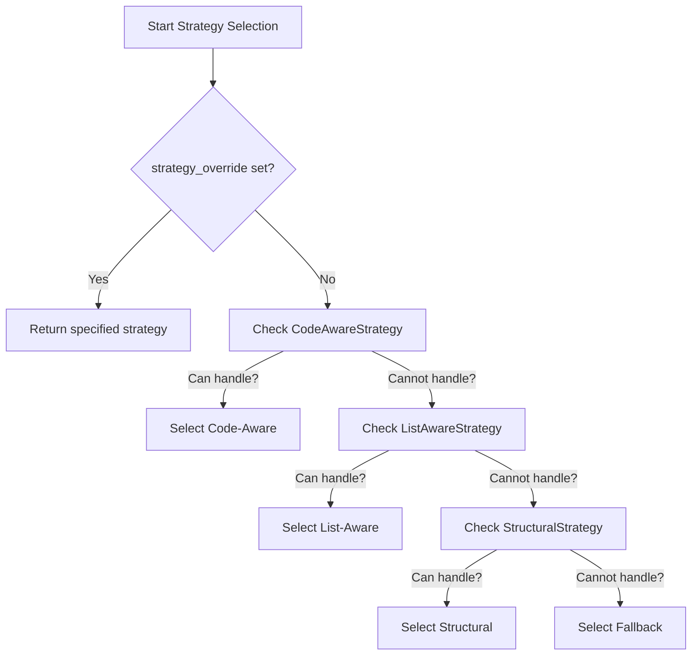
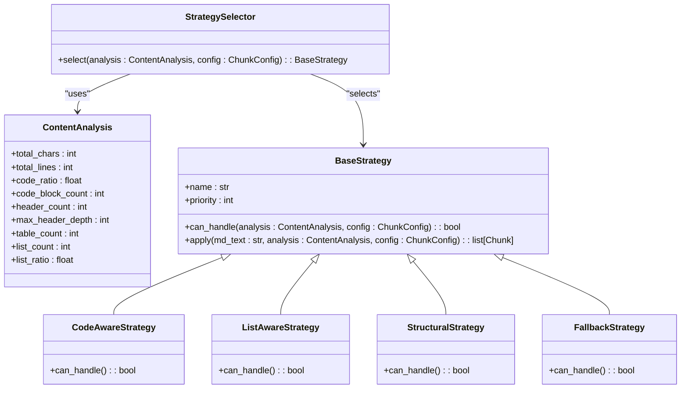
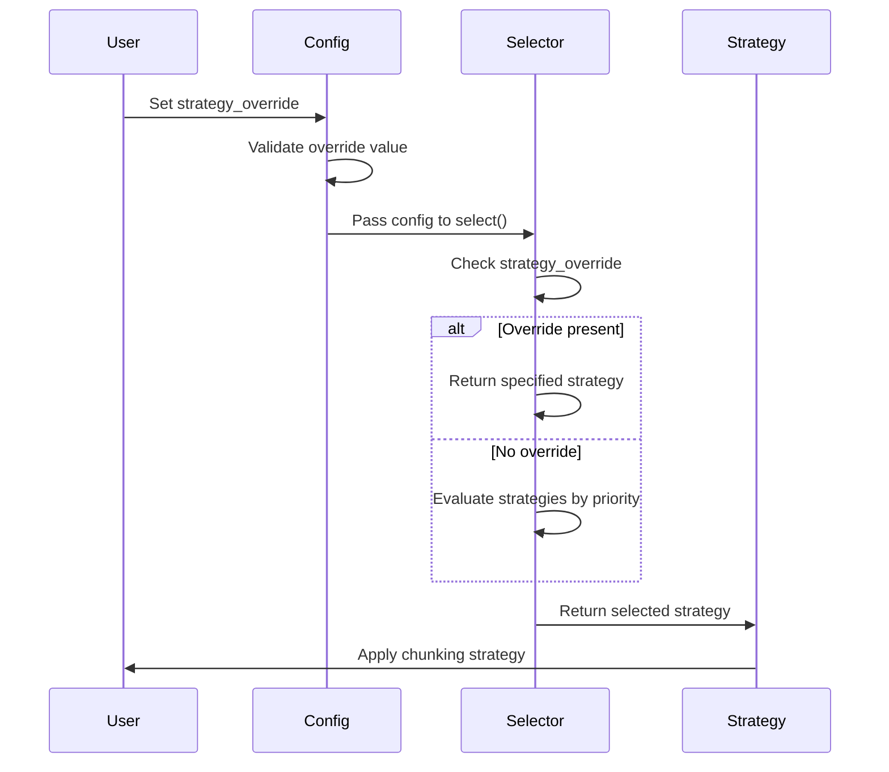
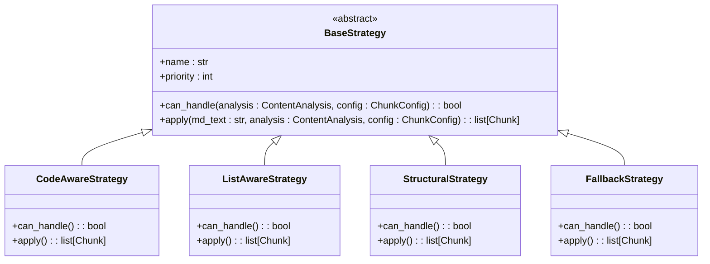

# Strategy Selection

<cite>
**Referenced Files in This Document**   
- [chunker.py](file://src/chunkana/chunker.py)
- [strategies/__init__.py](file://src/chunkana/strategies/__init__.py)
- [strategies/base.py](file://src/chunkana/strategies/base.py)
- [strategies/code_aware.py](file://src/chunkana/strategies/code_aware.py)
- [strategies/list_aware.py](file://src/chunkana/strategies/list_aware.py)
- [strategies/structural.py](file://src/chunkana/strategies/structural.py)
- [strategies/fallback.py](file://src/chunkana/strategies/fallback.py)
- [config.py](file://src/chunkana/config.py)
- [types.py](file://src/chunkana/types.py)
- [docs/strategies.md](file://docs/strategies.md)
- [tests/unit/test_strategies.py](file://tests/unit/test_strategies.py)
</cite>

## Table of Contents
1. [Introduction](#introduction)
2. [Strategy Selection Process](#strategy-selection-process)
3. [Decision Criteria for Each Strategy](#decision-criteria-for-each-strategy)
4. [Strategy Override Mechanism](#strategy-override-mechanism)
5. [Strategy Interface and Implementation](#strategy-interface-and-implementation)
6. [Fallback Mechanisms](#fallback-mechanisms)
7. [Performance Considerations](#performance-considerations)
8. [Examples of Strategy Selection](#examples-of-strategy-selection)

## Introduction
The chunking pipeline in Chunkana employs a sophisticated strategy selection mechanism to determine the most appropriate chunking approach based on document characteristics. This system analyzes content through the ContentAnalysis class and selects from four specialized strategies: Code-Aware, List-Aware, Structural, or Fallback. The selection process follows a priority-based approach, with each strategy designed to handle specific document types and structures. This document details the strategy selection mechanism, including decision criteria, override capabilities, interface design, and performance considerations.

**Section sources**
- [chunker.py](file://src/chunkana/chunker.py#L1-L176)
- [strategies/__init__.py](file://src/chunkana/strategies/__init__.py#L1-L29)

## Strategy Selection Process
The strategy selection process begins with content analysis performed by the parser, which extracts structural elements and calculates metrics used for decision-making. The StrategySelector class implements a priority-based selection algorithm that evaluates each strategy in order of importance. The process follows a strict hierarchy: Code-Aware (priority 1), List-Aware (priority 2), Structural (priority 3), and Fallback (priority 4). The first strategy that meets its activation criteria is selected, ensuring optimal handling of document characteristics. This approach prevents conflicts between strategies and guarantees consistent behavior across different document types.

**Diagram sources**
- [strategies/__init__.py](file://src/chunkana/strategies/__init__.py#L19-L60)

**Section sources**
- [strategies/__init__.py](file://src/chunkana/strategies/__init__.py#L19-L60)
- [chunker.py](file://src/chunkana/chunker.py#L146-L147)

## Decision Criteria for Each Strategy
Each chunking strategy employs specific criteria based on document characteristics extracted during content analysis. The Code-Aware strategy activates when a document contains code blocks, tables, or exceeds the code_ratio threshold (default 0.3). The List-Aware strategy triggers when a document is list-heavy, determined by list_ratio exceeding 0.4 or having at least 5 list blocks. For documents with strong structural hierarchy (many headers), both conditions must be met to avoid interfering with the Structural strategy. The Structural strategy requires at least 3 headers with a maximum depth greater than 1, ensuring the document has sufficient hierarchical structure. The Fallback strategy serves as the universal option, always available when no other strategy applies.

**Diagram sources**
- [types.py](file://src/chunkana/types.py#L181-L238)
- [strategies/base.py](file://src/chunkana/strategies/base.py#L15-L24)
- [strategies/__init__.py](file://src/chunkana/strategies/__init__.py#L20-L37)

**Section sources**
- [strategies/code_aware.py](file://src/chunkana/strategies/code_aware.py#L32-L40)
- [strategies/list_aware.py](file://src/chunkana/strategies/list_aware.py#L48-L89)
- [strategies/structural.py](file://src/chunkana/strategies/structural.py#L52-L56)
- [config.py](file://src/chunkana/config.py#L36-L43)

## Strategy Override Mechanism
The strategy_override configuration parameter allows users to bypass automatic strategy selection and force a specific approach. This feature is particularly useful when the automatic selection does not align with specific use cases or when testing different strategies. The override is implemented in the StrategySelector class, which checks for the presence of strategy_override in the ChunkConfig before evaluating the standard selection criteria. Valid override values include "code_aware", "list_aware", "structural", and "fallback". The configuration validates the override value during initialization, ensuring only valid strategy names are accepted. This mechanism provides flexibility while maintaining the integrity of the chunking process.

**Diagram sources**
- [config.py](file://src/chunkana/config.py#L93-L183)
- [strategies/__init__.py](file://src/chunkana/strategies/__init__.py#L50-L52)

**Section sources**
- [config.py](file://src/chunkana/config.py#L93-L183)
- [strategies/__init__.py](file://src/chunkana/strategies/__init__.py#L50-L52)
- [docs/strategies.md](file://docs/strategies.md#L61-L71)

## Strategy Interface and Implementation
All chunking strategies implement the BaseStrategy abstract base class, ensuring a consistent interface across different approaches. The interface defines four key components: name (strategy identifier), priority (selection priority), can_handle (eligibility check), and apply (chunking implementation). This design enables the StrategySelector to interact uniformly with all strategies while allowing each to implement specialized behavior. The inheritance hierarchy includes CodeAwareStrategy, ListAwareStrategy, StructuralStrategy, and FallbackStrategy, each extending the base functionality to address specific document characteristics. This object-oriented design promotes code reuse and simplifies the addition of new strategies.

**Diagram sources**
- [strategies/base.py](file://src/chunkana/strategies/base.py#L15-L24)
- [strategies/code_aware.py](file://src/chunkana/strategies/code_aware.py#L14-L22)
- [strategies/list_aware.py](file://src/chunkana/strategies/list_aware.py#L15-L37)
- [strategies/structural.py](file://src/chunkana/strategies/structural.py#L15-L21)
- [strategies/fallback.py](file://src/chunkana/strategies/fallback.py#L13-L20)

**Section sources**
- [strategies/base.py](file://src/chunkana/strategies/base.py#L15-L65)
- [strategies/code_aware.py](file://src/chunkana/strategies/code_aware.py#L14-L22)
- [strategies/list_aware.py](file://src/chunkana/strategies/list_aware.py#L15-L37)
- [strategies/structural.py](file://src/chunkana/strategies/structural.py#L15-L21)
- [strategies/fallback.py](file://src/chunkana/strategies/fallback.py#L13-L20)

## Fallback Mechanisms
The Fallback strategy serves as the universal safety net when no specialized strategy applies to a document. It implements a robust paragraph-based splitting approach that groups text to fit within size limits while preserving atomic blocks like code and tables when present. This strategy ensures that every document can be chunked successfully, regardless of its structure or content type. The fallback mechanism is designed to handle edge cases such as plain text documents, malformed Markdown, or documents with insufficient structural elements to trigger specialized strategies. Its universal applicability makes it the final option in the selection hierarchy, guaranteeing that the chunking process always completes successfully.

**Section sources**
- [strategies/fallback.py](file://src/chunkana/strategies/fallback.py#L31-L33)
- [strategies/__init__.py](file://src/chunkana/strategies/__init__.py#L28-L29)

## Performance Considerations
The strategy selection process is optimized for efficiency through several mechanisms. The ContentAnalysis class caches line arrays to avoid redundant text splitting operations across strategies. The StrategySelector evaluates strategies in priority order, stopping at the first match to minimize unnecessary checks. Configuration validation occurs during initialization, preventing repeated validation during selection. The system also employs early termination in eligibility checks, such as quickly determining if a document has sufficient headers for the Structural strategy. These optimizations ensure that strategy selection adds minimal overhead to the overall chunking pipeline, maintaining high performance even with complex documents.

**Section sources**
- [types.py](file://src/chunkana/types.py#L221-L237)
- [strategies/structural.py](file://src/chunkana/strategies/structural.py#L41-L42)
- [config.py](file://src/chunkana/config.py#L127-L136)

## Examples of Strategy Selection
The strategy selection mechanism responds to different document types as demonstrated by test cases. A code-heavy document with multiple code blocks triggers the Code-Aware strategy, preserving code integrity. A list-heavy document with numerous bullet and numbered lists activates the List-Aware strategy, maintaining list hierarchies. A document with deep header nesting selects the Structural strategy, creating chunks based on header boundaries. A plain text document without structural elements defaults to the Fallback strategy, splitting on paragraph boundaries. When strategy_override is set, the specified strategy is used regardless of document characteristics, allowing for consistent behavior across different content types.

**Section sources**
- [tests/unit/test_strategies.py](file://tests/unit/test_strategies.py#L15-L137)
- [tests/baseline/fixtures/code_heavy.md](file://tests/baseline/fixtures/code_heavy.md)
- [tests/baseline/fixtures/list_heavy.md](file://tests/baseline/fixtures/list_heavy.md)
- [tests/baseline/fixtures/headers_deep.md](file://tests/baseline/fixtures/headers_deep.md)
- [tests/baseline/fixtures/mixed_content.md](file://tests/baseline/fixtures/mixed_content.md)