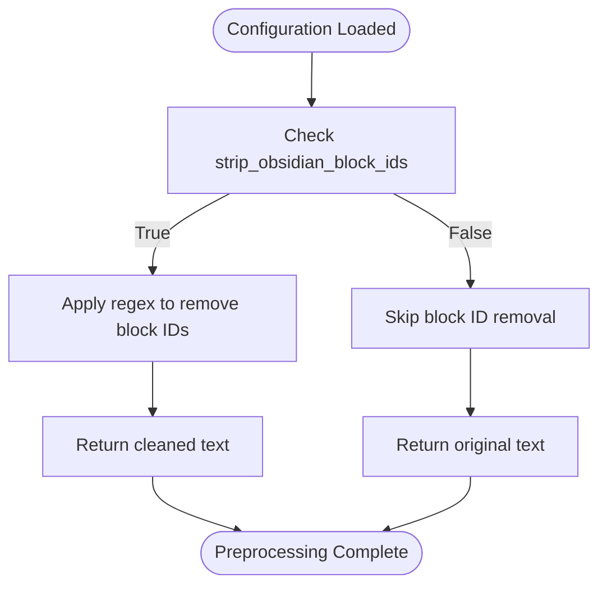
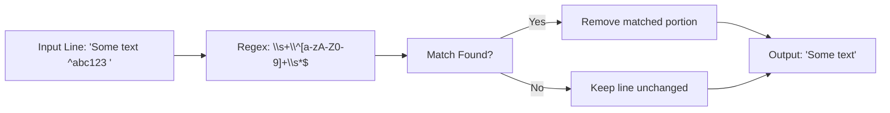
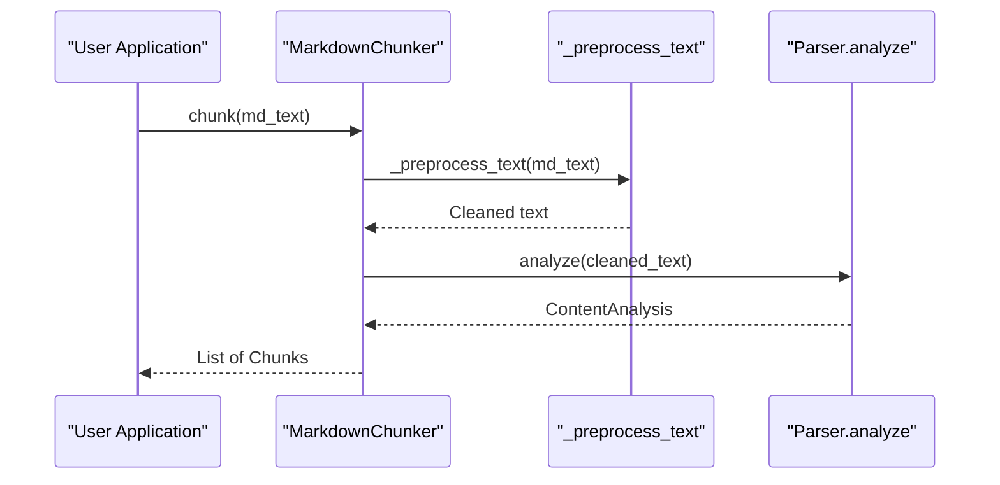

# Text Preprocessing

<cite>
**Referenced Files in This Document**   
- [chunker.py](file://src/chunkana/chunker.py)
- [config.py](file://src/chunkana/config.py)
</cite>

## Table of Contents
1. [Introduction](#introduction)
2. [Purpose of Text Preprocessing](#purpose-of-text-preprocessing)
3. [Obsidian Block ID Removal](#obsidian-block-id-removal)
4. [Configuration Dependency](#configuration-dependency)
5. [Regex Pattern and Multiline Processing](#regex-pattern-and-multiline-processing)
6. [Input-Output Examples](#input-output-examples)
7. [Impact on Semantic Chunking](#impact-on-semantic-chunking)
8. [Integration with Parsing Phase](#integration-with-parsing-phase)
9. [Performance Implications](#performance-implications)
10. [Error Handling and Malformed Input](#error-handling-and-malformed-input)

## Introduction
The text preprocessing stage is a critical component of the core chunking pipeline in Chunkana. It ensures that raw Markdown input is cleaned and normalized before being passed to subsequent stages such as parsing and chunking. This document focuses specifically on the `_preprocess_text` method, which handles the removal of Obsidian-style block IDs when enabled via configuration. The preprocessing step enhances the quality of semantic chunks by eliminating non-essential syntax elements that could interfere with downstream processing.

## Purpose of Text Preprocessing
The primary purpose of the `_preprocess_text` method is to clean raw Markdown content prior to parsing. This method currently supports one key transformation: the removal of Obsidian block reference IDs (e.g., `^block-id`) from the document content. These block IDs are metadata used by the Obsidian note-taking application for internal linking but do not contribute to the semantic meaning of the text. By removing them during preprocessing, the system ensures that chunks are based solely on meaningful content rather than auxiliary syntax. This results in cleaner, more semantically coherent chunks that improve retrieval performance in RAG systems.

**Section sources**
- [chunker.py](file://src/chunkana/chunker.py#L66-L83)

## Obsidian Block ID Removal
Obsidian block ID removal is an optional preprocessing step controlled by the `strip_obsidian_block_ids` configuration parameter. When enabled, this feature strips out block identifiers that appear at the end of lines in the format `^[a-zA-Z0-9]+`. These identifiers are typically used in Obsidian for creating bidirectional links between notes and blocks within notes. Since these IDs serve no purpose outside the Obsidian ecosystem and can disrupt text analysis, their removal leads to cleaner content representation. The preprocessing occurs before any structural analysis, ensuring that parsers and chunking strategies operate on purified text.

**Section sources**
- [chunker.py](file://src/chunkana/chunker.py#L79-L82)
- [config.py](file://src/chunkana/config.py#L63-L64)

## Configuration Dependency
The behavior of the `_preprocess_text` method is directly dependent on the `strip_obsidian_block_ids` flag in the `ChunkConfig` object. By default, this option is disabled (`False`), preserving all original content including Obsidian block IDs. Users must explicitly enable it by setting `strip_obsidian_block_ids=True` in the configuration. This design allows flexibility for users who may want to retain block IDs for specific use cases while providing a clean-slate option for general-purpose chunking. The configuration-driven approach ensures that preprocessing remains non-invasive and opt-in, aligning with the principle of minimal interference unless explicitly requested.



**Diagram sources**
- [chunker.py](file://src/chunkana/chunker.py#L79-L82)
- [config.py](file://src/chunkana/config.py#L112)

**Section sources**
- [config.py](file://src/chunkana/config.py#L112)

## Regex Pattern and Multiline Processing
The regex pattern used for removing Obsidian block IDs is `\s+\^[a-zA-Z0-9]+\s*$`, applied with the `re.MULTILINE` flag. This pattern matches:
- One or more whitespace characters (`\s+`)
- Followed by a caret (`^`)
- Followed by one or more alphanumeric characters (`[a-zA-Z0-9]+`)
- Optionally followed by trailing whitespace (`\s*`)
- Anchored to the end of the line (`$`)

The use of `re.MULTILINE` ensures that the `$` anchor matches the end of each line rather than just the end of the entire string, enabling line-by-line processing across multi-line documents. This approach efficiently targets block IDs wherever they appear in the document without requiring line-by-line iteration. The substitution replaces matched patterns with an empty string, effectively removing them from the text.



**Diagram sources**
- [chunker.py](file://src/chunkana/chunker.py#L82)

**Section sources**
- [chunker.py](file://src/chunkana/chunker.py#L82)

## Input-Output Examples
The following examples illustrate how the `_preprocess_text` method transforms input Markdown when `strip_obsidian_block_ids` is enabled:

**Example 1: Simple Block ID**
- Input: `This is a sentence ^block1`
- Output: `This is a sentence`

**Example 2: Multiple Block IDs**
- Input: 
```
# Introduction ^intro
This section provides background ^bg-info.
See example below ^ex1.
```
- Output:
```
# Introduction
This section provides background.
See example below.
```

**Example 3: Mixed Content with Code Blocks**
- Input:
```
```python ^code-example
def hello():
    print("Hello, world!")
```

For more details, see ^ref-section.
```
- Output:
```
```python
def hello():
    print("Hello, world!")
```

For more details, see.
```

These examples demonstrate that only block IDs at line endings are removed, preserving all other content including code blocks and formatting.

**Section sources**
- [chunker.py](file://src/chunkana/chunker.py#L82)

## Impact on Semantic Chunking
Removing Obsidian block IDs significantly improves the quality of semantic chunks by eliminating noise from the text. Block IDs, while useful for linking within Obsidian, add no semantic value and can interfere with natural language processing tasks such as embedding generation and similarity search. Their removal ensures that vector representations are based purely on meaningful content, leading to better clustering and retrieval accuracy. Additionally, cleaner text reduces token usage in downstream LLM applications, improving efficiency and reducing costs. The preprocessing step thus acts as a signal enhancer, amplifying the relevance of actual content while suppressing irrelevant metadata.

**Section sources**
- [chunker.py](file://src/chunkana/chunker.py#L66-L83)

## Integration with Parsing Phase
The `_preprocess_text` method serves as the first step in the chunking pipeline, directly feeding into the parsing phase. After preprocessing, the cleaned text is passed to the parser for structural analysis, where headers, code blocks, tables, and other elements are identified. This sequential integration ensures that all subsequent stages operate on normalized content. The preprocessing step also normalizes line endings (converting `\r\n` and `\r` to `\n`) as part of the cleaning process, further standardizing input for consistent parsing. Because preprocessing occurs before any structural analysis, it prevents block IDs from being misinterpreted as part of content or metadata.



**Diagram sources**
- [chunker.py](file://src/chunkana/chunker.py#L108-L112)

**Section sources**
- [chunker.py](file://src/chunkana/chunker.py#L108-L112)

## Performance Implications
The preprocessing step has minimal performance overhead due to its implementation using Python's built-in `re.sub` function with compiled patterns. The operation runs in linear time relative to the input size, making it efficient even for large documents. Since the regex is applied once across the entire text, there are no nested loops or repeated scans. The `re.MULTILINE` flag does not significantly impact performance, as it only changes the behavior of the `$` anchor. For documents without Obsidian block IDs, the operation still executes quickly because the regex engine efficiently determines non-matches. Overall, the performance cost is negligible compared to subsequent parsing and chunking operations, especially considering the benefits of cleaner input.

**Section sources**
- [chunker.py](file://src/chunkana/chunker.py#L82)

## Error Handling and Malformed Input
The `_preprocess_text` method is designed to handle malformed input gracefully. It accepts any string input, including empty strings, whitespace-only content, and text with invalid syntax. In cases where no valid block IDs are present, the method returns the original text unchanged. The regex pattern is constructed to avoid catastrophic backtracking, ensuring robustness against pathological inputs. No exceptions are raised during preprocessing, making it a safe operation that won't disrupt the chunking pipeline. This fault-tolerant design aligns with the principle of progressive enhancement—cleaning what can be cleaned while preserving the rest intact.

**Section sources**
- [chunker.py](file://src/chunkana/chunker.py#L66-L83)