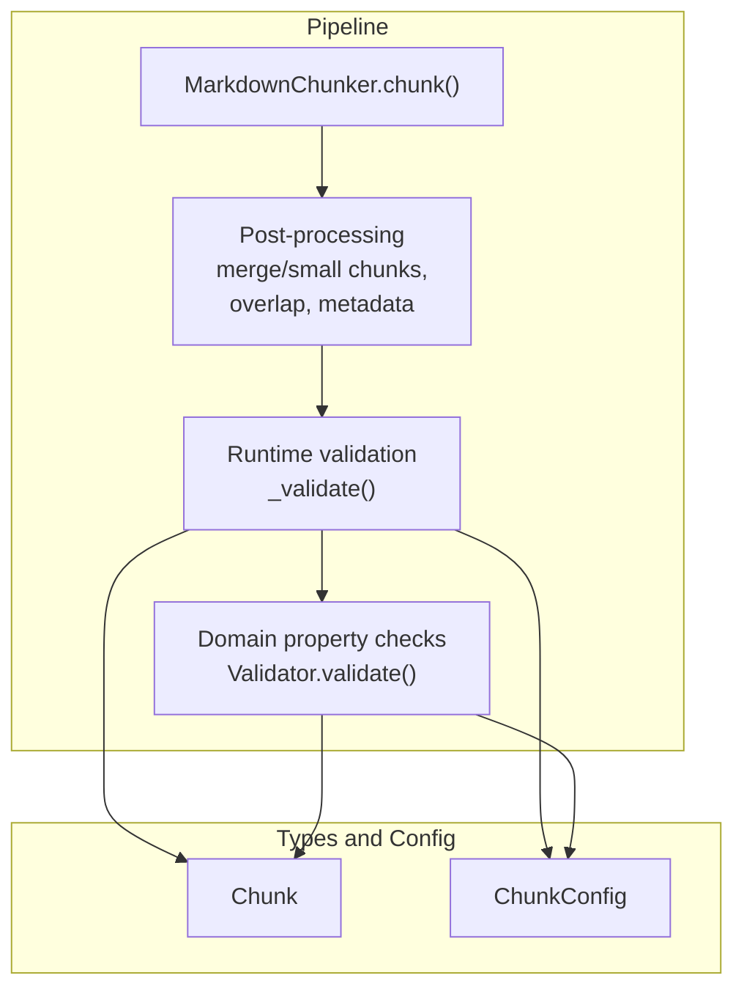
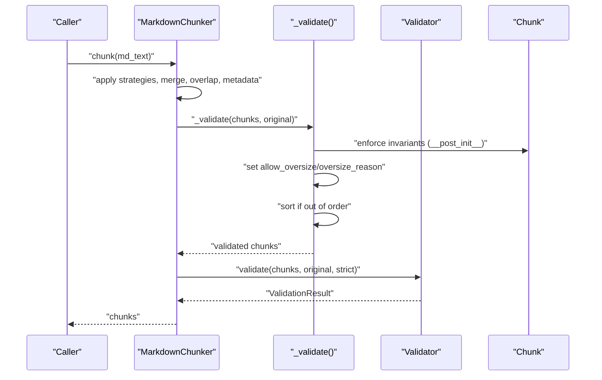
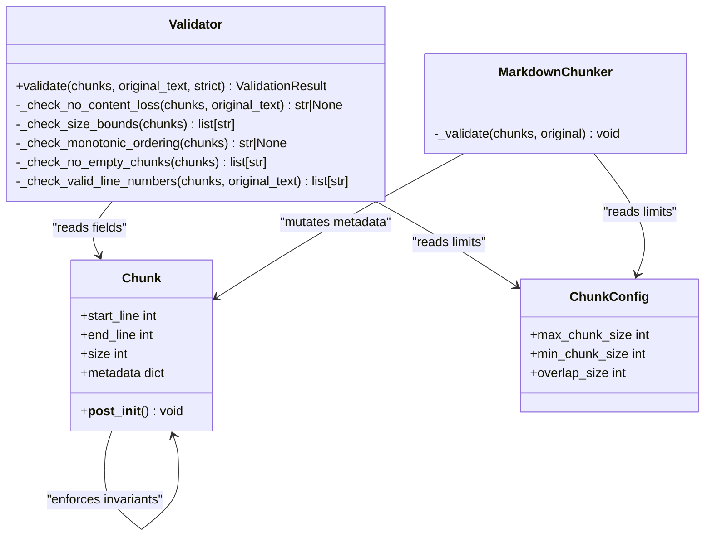

# Validation

<cite>
**Referenced Files in This Document**
- [validator.py](file://src/chunkana/validator.py)
- [chunker.py](file://src/chunkana/chunker.py)
- [types.py](file://src/chunkana/types.py)
- [config.py](file://src/chunkana/config.py)
- [test_validator.py](file://tests/unit/test_validator.py)
- [test_domain_properties.py](file://tests/property/test_domain_properties.py)
- [base.py](file://src/chunkana/strategies/base.py)
</cite>

## Table of Contents
1. [Introduction](#introduction)
2. [Project Structure](#project-structure)
3. [Core Components](#core-components)
4. [Architecture Overview](#architecture-overview)
5. [Detailed Component Analysis](#detailed-component-analysis)
6. [Dependency Analysis](#dependency-analysis)
7. [Performance Considerations](#performance-considerations)
8. [Troubleshooting Guide](#troubleshooting-guide)
9. [Conclusion](#conclusion)

## Introduction
This document explains the validation phase at the end of the chunking pipeline. It focuses on how domain properties (PROP-1 through PROP-5) are checked and enforced, how oversized chunks are handled with metadata flags, how ordering violations are corrected, and how strict_mode influences validation behavior. It also provides examples of common validation issues and practical guidance for balancing thoroughness and speed in production.

## Project Structure
The validation logic is implemented in two complementary places:
- A dedicated validator module that performs domain property checks and returns a structured result.
- The chunker’s runtime validation that enforces size bounds, sets oversize metadata, and fixes ordering automatically.

**Diagram sources**
- [chunker.py](file://src/chunkana/chunker.py#L85-L176)
- [validator.py](file://src/chunkana/validator.py#L47-L91)
- [types.py](file://src/chunkana/types.py#L240-L320)
- [config.py](file://src/chunkana/config.py#L17-L126)

**Section sources**
- [chunker.py](file://src/chunkana/chunker.py#L85-L176)
- [validator.py](file://src/chunkana/validator.py#L47-L91)
- [types.py](file://src/chunkana/types.py#L240-L320)
- [config.py](file://src/chunkana/config.py#L17-L126)

## Core Components
- Validator.validate(): Runs all domain property checks and aggregates errors/warnings. Honors strict mode to convert warnings into errors.
- MarkdownChunker._validate(): Enforces size bounds, sets allow_oversize and oversize_reason metadata, and auto-corrects monotonic ordering.
- Chunk: Enforces basic invariants at construction time (no empty content, valid line ranges).
- ChunkConfig: Holds max_chunk_size and other parameters influencing validation.

Key behaviors:
- Oversized chunks without allow_oversize are flagged by Validator; the chunker auto-sets allow_oversize and oversize_reason when appropriate.
- Monotonic ordering is enforced by the chunker; Validator also checks it.
- Line number validity is enforced by Chunk.__post_init__ and Validator.
- Empty chunks are prevented by Chunk.__post_init__ and Validator.

**Section sources**
- [validator.py](file://src/chunkana/validator.py#L47-L91)
- [chunker.py](file://src/chunkana/chunker.py#L431-L470)
- [types.py](file://src/chunkana/types.py#L297-L307)
- [config.py](file://src/chunkana/config.py#L77-L81)

## Architecture Overview
The validation architecture separates concerns:
- Domain property checks (Validator) are independent and reusable.
- Runtime enforcement (MarkdownChunker._validate) adapts the output to meet constraints and enriches metadata.

**Diagram sources**
- [chunker.py](file://src/chunkana/chunker.py#L85-L176)
- [chunker.py](file://src/chunkana/chunker.py#L431-L470)
- [validator.py](file://src/chunkana/validator.py#L47-L91)
- [types.py](file://src/chunkana/types.py#L297-L307)

## Detailed Component Analysis

### Domain Properties (PROP-1 to PROP-5)
- PROP-1: No Content Loss
  - Validator: Compares total output length to input length with a tolerance.
  - Chunker: Performs a relaxed check and logs a warning without failing.
  - Tests confirm content preservation across scenarios.
- PROP-2: Size Bounds
  - Validator: Flags chunks exceeding max_chunk_size unless allow_oversize is set with a valid oversize_reason.
  - Chunker: Auto-sets allow_oversize and oversize_reason for oversized chunks; reasons include code_block_integrity, table_integrity, section_integrity.
  - Strategies: Can also set allow_oversize and oversize_reason when creating oversized chunks intentionally.
- PROP-3: Monotonic Ordering
  - Validator: Ensures start_line is non-decreasing.
  - Chunker: Detects disorder and sorts by start_line and end_line to fix it.
- PROP-4: No Empty Chunks
  - Validator: Flags empty or whitespace-only chunks.
  - Chunk.__post_init__: Enforces non-empty content.
- PROP-5: Valid Line Numbers
  - Validator: start_line >= 1 and end_line >= start_line; end_line <= total_lines.
  - Chunk.__post_init__: Enforces these invariants.

Common issues and resolutions:
- Oversized chunks due to atomic block preservation:
  - Resolution: allow_oversize is set with a valid oversize_reason. Strategies may set reasons like code_block_integrity or table_integrity.
- Out-of-order chunks:
  - Resolution: The chunker sorts by start_line and end_line; Validator also reports ordering errors.
- Empty chunks:
  - Resolution: Prevented by Chunk.__post_init__; Validator flags any that slip through.
- Invalid line numbers:
  - Resolution: Enforced by Chunk.__post_init__ and Validator.

**Section sources**
- [validator.py](file://src/chunkana/validator.py#L93-L198)
- [chunker.py](file://src/chunkana/chunker.py#L431-L470)
- [types.py](file://src/chunkana/types.py#L297-L307)
- [test_domain_properties.py](file://tests/property/test_domain_properties.py#L109-L215)
- [test_validator.py](file://tests/unit/test_validator.py#L14-L262)
- [base.py](file://src/chunkana/strategies/base.py#L100-L117)

### Oversized Chunks and Metadata Handling
- Oversize detection:
  - Validator: Reports chunks exceeding max_chunk_size without allow_oversize.
  - Chunker: Sets allow_oversize=True and oversize_reason automatically when oversized.
- Oversize reasons:
  - Validator: Requires one of code_block_integrity, table_integrity, section_integrity.
  - Chunker: Sets reason based on content presence (code fences, tables).
  - Strategies: Can set allow_oversize and oversize_reason explicitly (including latex_integrity, related_code_group).
- Impact:
  - Oversized chunks remain valid under strict_mode if oversize_reason is valid.
  - Consumers can use metadata to decide downstream behavior (e.g., indexing, embedding).

**Section sources**
- [validator.py](file://src/chunkana/validator.py#L115-L142)
- [chunker.py](file://src/chunkana/chunker.py#L450-L460)
- [base.py](file://src/chunkana/strategies/base.py#L100-L117)

### Automatic Sorting of Chunks
- Detection:
  - Validator: Reports ordering violations.
  - Chunker: Detects disorder and sorts by start_line, then end_line.
- Behavior:
  - The chunker applies a single sort pass to fix the first violation found.
  - Subsequent PROP-3 checks in Validator will pass after correction.

**Section sources**
- [validator.py](file://src/chunkana/validator.py#L144-L158)
- [chunker.py](file://src/chunkana/chunker.py#L461-L467)

### Relationship Between Validation and strict_mode
- Validator.validate(strict):
  - strict=False: Warnings are collected separately; result is still valid.
  - strict=True: Warnings are treated as errors; result is invalid if any warnings exist.
- Chunker behavior:
  - The chunker’s runtime validation does not depend on strict_mode; it enforces constraints and enriches metadata regardless.
  - strict_mode primarily affects external Validator.validate() usage.

**Section sources**
- [validator.py](file://src/chunkana/validator.py#L47-L91)
- [config.py](file://src/chunkana/config.py#L108-L110)

### Examples of Common Validation Issues and Resolutions
- Content loss detected:
  - Cause: Output length below threshold due to overlap or normalization.
  - Resolution: Adjust overlap or review pipeline; Validator warns but does not fail.
- Oversized chunk without allow_oversize:
  - Cause: Atomic block preservation yields oversized chunks.
  - Resolution: Ensure allow_oversize=True with a valid oversize_reason; Validator will pass.
- Out-of-order chunks:
  - Cause: Post-processing or merging altered order.
  - Resolution: The chunker sorts automatically; Validator will report ordering errors if strict mode is used.
- Empty chunk:
  - Cause: Edge case in merging or filtering.
  - Resolution: Prevented by Chunk.__post_init__; Validator flags any remaining.
- Invalid line numbers:
  - Cause: Incorrectly computed ranges.
  - Resolution: Enforced by Chunk.__post_init__ and Validator.

**Section sources**
- [test_validator.py](file://tests/unit/test_validator.py#L14-L262)
- [test_domain_properties.py](file://tests/property/test_domain_properties.py#L109-L215)
- [types.py](file://src/chunkana/types.py#L297-L307)

## Dependency Analysis
- Validator depends on Chunk and ChunkConfig to compute totals and enforce bounds.
- MarkdownChunker._validate depends on ChunkConfig.max_chunk_size and enriches Chunk.metadata.
- Chunk.__post_init__ ensures basic invariants, reducing downstream checks.
- Strategies may set allow_oversize and oversize_reason, aligning with Validator’s expectations.

**Diagram sources**
- [validator.py](file://src/chunkana/validator.py#L47-L198)
- [chunker.py](file://src/chunkana/chunker.py#L431-L470)
- [types.py](file://src/chunkana/types.py#L240-L320)
- [config.py](file://src/chunkana/config.py#L77-L81)

**Section sources**
- [validator.py](file://src/chunkana/validator.py#L47-L198)
- [chunker.py](file://src/chunkana/chunker.py#L431-L470)
- [types.py](file://src/chunkana/types.py#L240-L320)
- [config.py](file://src/chunkana/config.py#L77-L81)

## Performance Considerations
- Validation cost:
  - PROP-1 and PROP-2 checks are linear in the number of chunks.
  - PROP-3 sorting is O(n log n) worst-case but the chunker applies a single pass sort at most once.
  - PROP-4 and PROP-5 rely on invariants enforced by Chunk.__post_init__ and are constant-time per chunk.
- Production balance:
  - For large chunk lists, keep max_chunk_size reasonable and leverage adaptive sizing to reduce oversize occurrences.
  - Use strict=False for non-critical validations to avoid blocking on warnings.
  - Consider disabling overlap if memory pressure is high; overlap metadata is metadata-only and does not duplicate content.
- Practical tips:
  - Tune overlap_size and overlap_cap_ratio to minimize unnecessary context while preserving continuity.
  - Monitor oversize_count via metrics to guide configuration adjustments.

[No sources needed since this section provides general guidance]

## Troubleshooting Guide
- Oversized chunks keep failing:
  - Verify allow_oversize is set and oversize_reason is one of code_block_integrity, table_integrity, section_integrity.
  - Strategies may set additional reasons; ensure they are valid.
- Ordering issues persist:
  - Confirm the chunker’s sort occurred; subsequent Validator checks should pass.
  - If strict mode is enabled externally, warnings become errors.
- Empty or invalid chunks:
  - Check merging logic and ensure content is not stripped unintentionally.
  - Validate line numbers are computed correctly.

**Section sources**
- [validator.py](file://src/chunkana/validator.py#L115-L158)
- [chunker.py](file://src/chunkana/chunker.py#L450-L467)
- [types.py](file://src/chunkana/types.py#L297-L307)
- [test_validator.py](file://tests/unit/test_validator.py#L14-L262)

## Conclusion
The validation phase ensures domain correctness by enforcing content preservation, size bounds, monotonic ordering, absence of empty chunks, and valid line numbers. The chunker’s runtime validation proactively addresses oversize and ordering issues, while Validator offers a strict-mode option for external consumers. Together, these mechanisms provide robust guarantees suitable for production environments, with clear metadata to support downstream decisions.