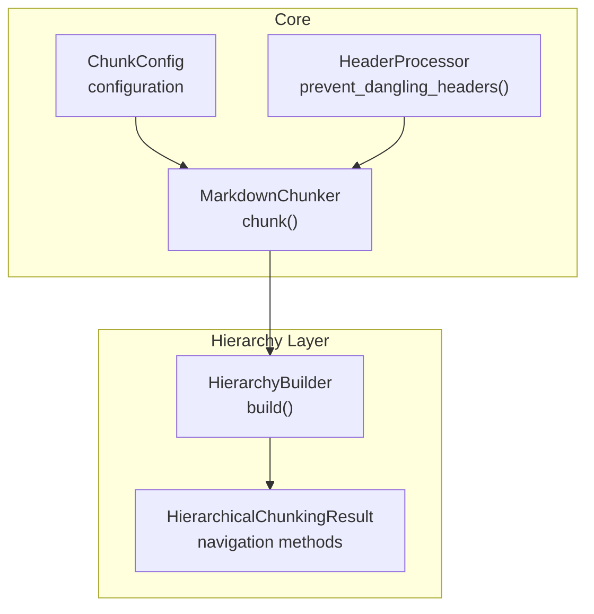
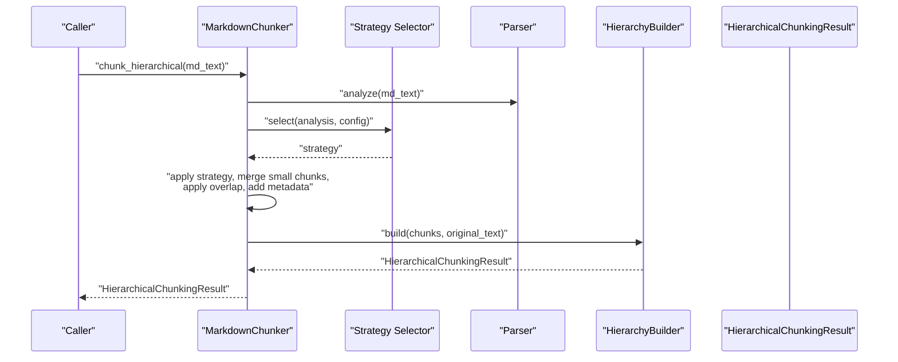
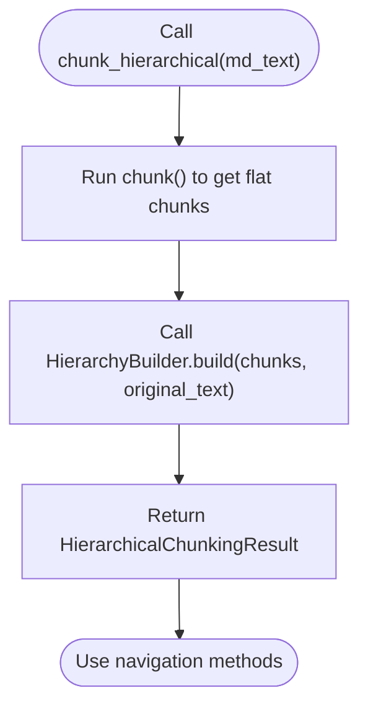
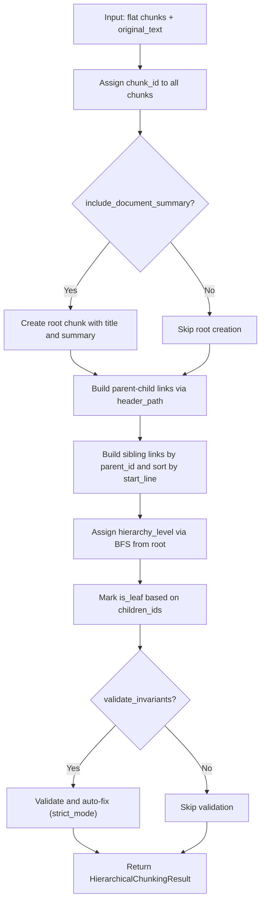
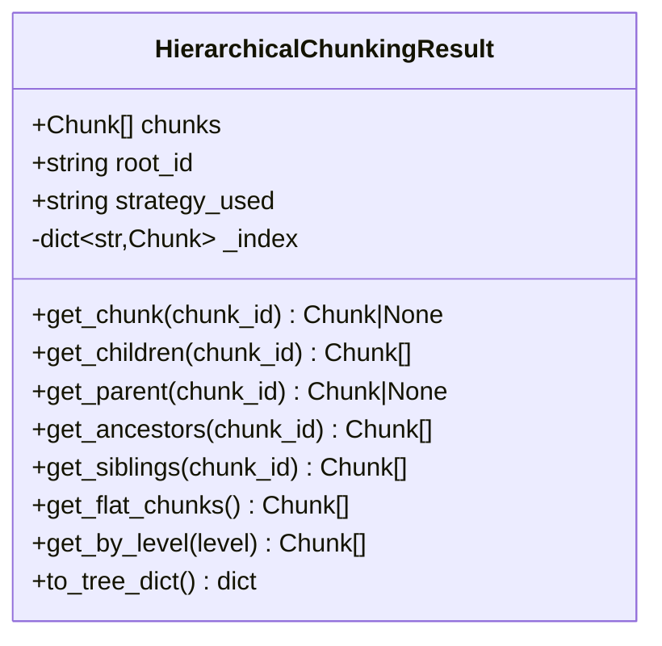
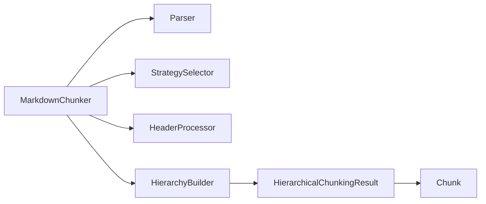

# Hierarchical Chunking

<cite>
**Referenced Files in This Document**
- [chunker.py](file://src/chunkana/chunker.py)
- [hierarchy.py](file://src/chunkana/hierarchy.py)
- [types.py](file://src/chunkana/types.py)
- [config.py](file://src/chunkana/config.py)
- [header_processor.py](file://src/chunkana/header_processor.py)
- [test_hierarchy.py](file://tests/unit/test_hierarchy.py)
- [test_performance_regression.py](file://tests/performance/test_performance_regression.py)
- [api.py](file://src/chunkana/api.py)
</cite>

## Table of Contents
1. [Introduction](#introduction)
2. [Project Structure](#project-structure)
3. [Core Components](#core-components)
4. [Architecture Overview](#architecture-overview)
5. [Detailed Component Analysis](#detailed-component-analysis)
6. [Dependency Analysis](#dependency-analysis)
7. [Performance Considerations](#performance-considerations)
8. [Troubleshooting Guide](#troubleshooting-guide)
9. [Conclusion](#conclusion)
10. [Appendices](#appendices)

## Introduction
This document explains the hierarchical chunking capability that constructs tree-structured relationships among chunks using header_path metadata. It focuses on the chunk_hierarchical() method, the post-processing nature of hierarchy construction, the integration with HierarchyBuilder, and the resulting HierarchicalChunkingResult with navigation methods. It also covers configuration options affecting hierarchy construction, differences between flat and hierarchical results for Retrieval-Augmented Generation (RAG), and practical use cases for hierarchical navigation.

## Project Structure
Hierarchical chunking is implemented as a layered feature built on top of the core chunking pipeline:
- MarkdownChunker orchestrates parsing, strategy selection, chunking, overlap, metadata enrichment, and validation.
- HierarchyBuilder adds parent-child-sibling relationships using existing header_path metadata.
- HierarchicalChunkingResult exposes navigation methods and serialization helpers.

**Diagram sources**
- [chunker.py](file://src/chunkana/chunker.py#L217-L248)
- [hierarchy.py](file://src/chunkana/hierarchy.py#L233-L308)
- [config.py](file://src/chunkana/config.py#L107-L111)

**Section sources**
- [chunker.py](file://src/chunkana/chunker.py#L217-L248)
- [hierarchy.py](file://src/chunkana/hierarchy.py#L233-L308)
- [config.py](file://src/chunkana/config.py#L107-L111)

## Core Components
- chunk_hierarchical(): Orchestrates flat chunking and then builds the hierarchy using HierarchyBuilder. It returns a HierarchicalChunkingResult with navigation methods.
- HierarchyBuilder: Post-processes flat chunks to establish parent-child-sibling relationships using header_path metadata. It optionally creates a root document chunk and assigns hierarchy levels.
- HierarchicalChunkingResult: Holds all chunks plus navigation helpers (get_chunk, get_children, get_parent, get_ancestors, get_siblings, get_flat_chunks, get_by_level, to_tree_dict) and an O(1) lookup index.

Key configuration options:
- include_document_summary: Controls whether a root document-level chunk is created.
- validate_invariants: Validates tree invariants after building; strict_mode controls whether to raise or auto-fix.

**Section sources**
- [chunker.py](file://src/chunkana/chunker.py#L217-L248)
- [hierarchy.py](file://src/chunkana/hierarchy.py#L233-L308)
- [types.py](file://src/chunkana/types.py#L240-L375)
- [config.py](file://src/chunkana/config.py#L107-L111)

## Architecture Overview
The hierarchical pipeline is a post-processing step that augments the flat chunk list with metadata-driven parent-child relationships and navigation capabilities.

**Diagram sources**
- [chunker.py](file://src/chunkana/chunker.py#L85-L176)
- [chunker.py](file://src/chunkana/chunker.py#L217-L248)
- [hierarchy.py](file://src/chunkana/hierarchy.py#L260-L308)

## Detailed Component Analysis

### chunk_hierarchical() Method
- Purpose: Create a hierarchical chunk structure by first performing normal chunking and then building parent-child relationships.
- Post-processing nature: The hierarchy is constructed using existing header_path metadata from the flat chunk list.
- Control flow:
  - Perform chunk() to produce flat chunks.
  - Pass the flat chunks and original text to HierarchyBuilder.build().
  - Return HierarchicalChunkingResult with navigation methods.

**Diagram sources**
- [chunker.py](file://src/chunkana/chunker.py#L217-L248)
- [hierarchy.py](file://src/chunkana/hierarchy.py#L260-L308)

**Section sources**
- [chunker.py](file://src/chunkana/chunker.py#L217-L248)

### HierarchyBuilder
Responsibilities:
- Assign unique chunk_id to each chunk.
- Optionally create a root document-level chunk with a summary and title.
- Build parent-child links using header_path metadata.
- Build sibling links by grouping chunks by parent_id and sorting by start_line.
- Assign hierarchy levels based on tree depth (BFS).
- Mark leaf chunks (is_leaf).
- Validate relationships (optional) and auto-fix in non-strict mode.

Key behaviors:
- Parent resolution: Walks up header_path segments to find the nearest parent; orphans link to root.
- Sibling ordering: Sorts siblings by start_line to preserve document order.
- Level assignment: BFS from root to compute hierarchy_level.
- Validation: Ensures is_leaf consistency, parent-child bidirectionality, and root content range consistency.

**Diagram sources**
- [hierarchy.py](file://src/chunkana/hierarchy.py#L260-L308)
- [hierarchy.py](file://src/chunkana/hierarchy.py#L374-L421)
- [hierarchy.py](file://src/chunkana/hierarchy.py#L422-L444)
- [hierarchy.py](file://src/chunkana/hierarchy.py#L445-L495)
- [hierarchy.py](file://src/chunkana/hierarchy.py#L496-L511)
- [hierarchy.py](file://src/chunkana/hierarchy.py#L812-L961)

**Section sources**
- [hierarchy.py](file://src/chunkana/hierarchy.py#L260-L308)
- [hierarchy.py](file://src/chunkana/hierarchy.py#L374-L421)
- [hierarchy.py](file://src/chunkana/hierarchy.py#L422-L444)
- [hierarchy.py](file://src/chunkana/hierarchy.py#L445-L495)
- [hierarchy.py](file://src/chunkana/hierarchy.py#L496-L511)
- [hierarchy.py](file://src/chunkana/hierarchy.py#L812-L961)

### HierarchicalChunkingResult
Navigation methods:
- get_chunk(chunk_id): O(1) lookup by chunk_id.
- get_children(chunk_id): Children by parent_id.
- get_parent(chunk_id): Parent by parent_id.
- get_ancestors(chunk_id): Ancestral chain from parent to root.
- get_siblings(chunk_id): Siblings ordered by start_line.
- get_flat_chunks(): Leaf chunks plus non-leaf chunks with significant content.
- get_by_level(level): Chunks at a specific hierarchy level.
- to_tree_dict(): Serializable tree representation using IDs.

**Diagram sources**
- [hierarchy.py](file://src/chunkana/hierarchy.py#L16-L150)
- [hierarchy.py](file://src/chunkana/hierarchy.py#L188-L231)

**Section sources**
- [hierarchy.py](file://src/chunkana/hierarchy.py#L16-L150)
- [hierarchy.py](file://src/chunkana/hierarchy.py#L188-L231)

### Configuration Options
- include_document_summary: When True, HierarchyBuilder creates a root document chunk containing a title and summary. When False, the root is omitted.
- validate_invariants: When True, HierarchyBuilder runs validation checks and can auto-fix inconsistencies in non-strict mode.
- strict_mode: When True, validation raises on violations; when False, warnings are logged and fixes are applied automatically.

These options are passed from ChunkConfig to HierarchyBuilder during MarkdownChunker initialization and used in chunk_hierarchical().

**Section sources**
- [config.py](file://src/chunkana/config.py#L107-L111)
- [chunker.py](file://src/chunkana/chunker.py#L60-L64)
- [hierarchy.py](file://src/chunkana/hierarchy.py#L242-L259)

### Integration with Header Metadata
- header_path: Used to resolve parent-child relationships. The builder indexes chunks by header_path and walks up the path segments to find parents.
- header_level: Used for document title extraction and fallback decisions.
- content_type: Used to distinguish preamble and other content types during root summary extraction.

**Section sources**
- [types.py](file://src/chunkana/types.py#L240-L375)
- [hierarchy.py](file://src/chunkana/hierarchy.py#L374-L421)
- [hierarchy.py](file://src/chunkana/hierarchy.py#L549-L655)

### Navigation Examples
- Parent-child relationships: Use get_parent() and get_children() to traverse up and down the tree.
- Ancestor tracking: Use get_ancestors() to get the path from a node to root.
- Tree traversal patterns:
  - Breadth-first traversal by levels using get_by_level().
  - Depth-first traversal by iterating children recursively.
- Serialization: Use to_tree_dict() to export a tree-like structure for UI or logging.

These behaviors are validated by unit tests and performance benchmarks.

**Section sources**
- [test_hierarchy.py](file://tests/unit/test_hierarchy.py#L48-L163)
- [test_hierarchy.py](file://tests/unit/test_hierarchy.py#L164-L203)
- [test_hierarchy.py](file://tests/unit/test_hierarchy.py#L204-L227)
- [test_performance_regression.py](file://tests/performance/test_performance_regression.py#L314-L344)

### Flat vs Hierarchical Results for RAG
- Flat chunking: Produces a list of chunks suitable for direct retrieval. HierarchicalChunkingResult.get_flat_chunks() returns leaf chunks plus non-leaf chunks with significant content to avoid losing material.
- Hierarchical results: Provide navigation metadata enabling:
  - Topic-aware retrieval: Retrieve a section’s children or ancestors for broader context.
  - Multi-level retrieval: Start at a higher level (e.g., chapter) and drill down to subsections.
  - Summarization: Use the root document chunk to generate summaries at different levels.
- Benefits:
  - Reduced hallucinations by providing explicit context boundaries.
  - Better explainability and traceability of retrieved chunks.
  - Improved recall by leveraging parent and sibling relationships.

**Section sources**
- [hierarchy.py](file://src/chunkana/hierarchy.py#L137-L187)
- [test_hierarchy.py](file://tests/unit/test_hierarchy.py#L114-L137)

### Use Cases for Hierarchical Navigation
- Document summarization:
  - Use the root document chunk to summarize the whole document.
  - Summarize sections by retrieving children of a given node.
- Context-aware retrieval:
  - Retrieve a topic’s subsections and their siblings for comprehensive coverage.
  - Traverse ancestors to include broader context when answering questions.
- Navigation aids:
  - Build UI breadcrumbs using get_ancestors().
  - Render hierarchical outlines using get_by_level() and to_tree_dict().

**Section sources**
- [hierarchy.py](file://src/chunkana/hierarchy.py#L188-L231)
- [test_hierarchy.py](file://tests/unit/test_hierarchy.py#L48-L113)

## Dependency Analysis
- MarkdownChunker depends on:
  - Parser for analysis.
  - StrategySelector for strategy selection.
  - HeaderProcessor for dangling header prevention.
  - HierarchyBuilder for hierarchical post-processing.
- HierarchyBuilder depends on:
  - Chunk metadata (chunk_id, parent_id, children_ids, header_path, hierarchy_level, is_leaf, is_root).
  - Config options (include_document_summary, validate_invariants, strict_mode).
- HierarchicalChunkingResult depends on:
  - Chunk dataclass and metadata fields.
  - O(1) indexing for fast lookups.

**Diagram sources**
- [chunker.py](file://src/chunkana/chunker.py#L217-L248)
- [hierarchy.py](file://src/chunkana/hierarchy.py#L233-L308)
- [types.py](file://src/chunkana/types.py#L240-L375)

**Section sources**
- [chunker.py](file://src/chunkana/chunker.py#L217-L248)
- [hierarchy.py](file://src/chunkana/hierarchy.py#L233-L308)
- [types.py](file://src/chunkana/types.py#L240-L375)

## Performance Considerations
- Navigation methods are O(1) for lookups and O(n) for ancestor traversal in the worst case.
- HierarchyBuilder performs linear scans and dictionary lookups; complexity is bounded by the number of chunks.
- Performance tests confirm hierarchical chunking and navigation remain fast for typical documents.

**Section sources**
- [test_performance_regression.py](file://tests/performance/test_performance_regression.py#L314-L344)

## Troubleshooting Guide
Common issues and resolutions:
- Orphaned chunks: If a chunk references a parent that does not exist, validation will detect and auto-fix by removing the invalid parent_id in non-strict mode.
- Missing child references: If a parent’s children_ids does not include a child, validation will add it in non-strict mode.
- Content range mismatch for root: If the root chunk does not span the expected document range, validation will log a warning and auto-fix in non-strict mode.
- Strict vs non-strict mode: In strict mode, validation raises on violations; in non-strict mode, warnings are logged and fixes are applied.

Validation and auto-fix behavior is implemented in HierarchyBuilder.validate_tree_invariants().

**Section sources**
- [hierarchy.py](file://src/chunkana/hierarchy.py#L812-L961)

## Conclusion
The hierarchical chunking feature augments flat chunking with robust parent-child relationships and navigation methods. It leverages header_path metadata to construct a tree structure post-hoc, enabling richer retrieval and summarization patterns. Configuration options allow controlling root creation, validation, and strictness. The resulting HierarchicalChunkingResult provides efficient navigation and serialization, making it suitable for advanced RAG applications.

## Appendices

### API Reference: chunk_hierarchical()
- Signature: chunk_hierarchical(md_text) -> HierarchicalChunkingResult
- Behavior: Performs chunk(), then HierarchyBuilder.build(), returning navigation-enabled results.
- Notes: The hierarchy is constructed using header_path metadata; root creation is controlled by include_document_summary.

**Section sources**
- [chunker.py](file://src/chunkana/chunker.py#L217-L248)

### Public API: chunk_hierarchical(text, config, include_document_summary)
- Signature: chunk_hierarchical(text, config=None, include_document_summary=True) -> HierarchicalChunkingResult
- Behavior: Alternative entry point that chunks and builds hierarchy independently of MarkdownChunker.

**Section sources**
- [api.py](file://src/chunkana/api.py#L273-L304)

### Metadata Fields Used by HierarchicalChunkingResult
- chunk_id: Unique identifier for each chunk.
- parent_id: Identifier of the parent chunk.
- children_ids: List of child identifiers.
- header_path: Hierarchical path used to resolve parents.
- hierarchy_level: Tree depth level (0=root, 1=sections, 2=subsections, 3+=paragraphs).
- is_leaf: True if no children.
- is_root: True for the root document chunk (when created).

**Section sources**
- [types.py](file://src/chunkana/types.py#L240-L375)
- [hierarchy.py](file://src/chunkana/hierarchy.py#L374-L421)
- [hierarchy.py](file://src/chunkana/hierarchy.py#L445-L495)
- [hierarchy.py](file://src/chunkana/hierarchy.py#L496-L511)