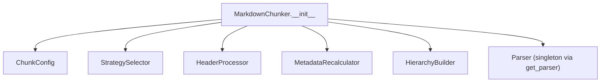
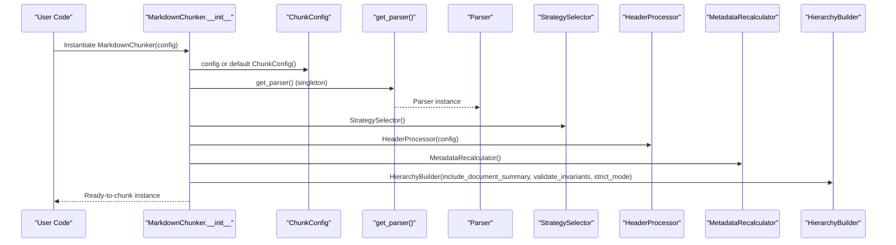
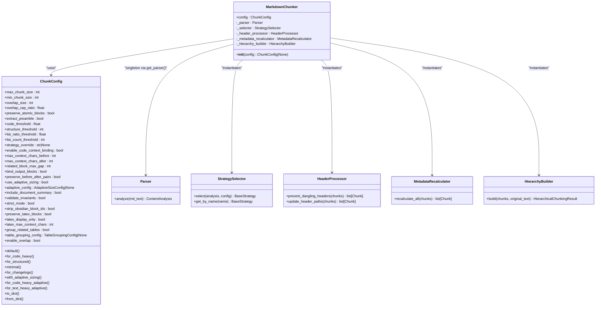

# Initialization and Configuration

<cite>
**Referenced Files in This Document**
- [chunker.py](file://src/chunkana/chunker.py)
- [config.py](file://src/chunkana/config.py)
- [parser.py](file://src/chunkana/parser.py)
- [header_processor.py](file://src/chunkana/header_processor.py)
- [metadata_recalculator.py](file://src/chunkana/metadata_recalculator.py)
- [hierarchy.py](file://src/chunkana/hierarchy.py)
- [strategies/__init__.py](file://src/chunkana/strategies/__init__.py)
- [test_config.py](file://tests/unit/test_config.py)
- [README.md](file://README.md)
- [MIGRATION_GUIDE.md](file://MIGRATION_GUIDE.md)
</cite>

## Table of Contents
1. [Introduction](#introduction)
2. [Project Structure](#project-structure)
3. [Core Components](#core-components)
4. [Architecture Overview](#architecture-overview)
5. [Detailed Component Analysis](#detailed-component-analysis)
6. [Dependency Analysis](#dependency-analysis)
7. [Performance Considerations](#performance-considerations)
8. [Troubleshooting Guide](#troubleshooting-guide)
9. [Conclusion](#conclusion)

## Introduction
This document explains how the MarkdownChunker class initializes and configures its internal subsystems via the __init__ method. It focuses on the role of ChunkConfig in controlling chunking behavior, the default configuration fallback mechanism, and how configuration parameters propagate to internal systems. It also documents the internal components initialized by MarkdownChunker, including the parser, strategy selector, header processor, metadata recalculator, and hierarchy builder. Practical examples show configuration customization and component dependency injection, along with debugging strategies for common configuration mistakes. Finally, it highlights the singleton pattern used for parser instantiation and its performance implications.

## Project Structure
The initialization logic centers around the MarkdownChunker class and its dependencies:
- MarkdownChunker orchestrates parsing, strategy selection, chunking, overlap, metadata enrichment, and validation.
- ChunkConfig encapsulates all configuration parameters and provides validation and convenience factory methods.
- Parser is a stateless singleton used for content analysis.
- StrategySelector chooses the appropriate chunking strategy based on content analysis and configuration.
- HeaderProcessor prevents dangling headers and updates metadata accordingly.
- MetadataRecalculator recalculates derived metadata after post-processing.
- HierarchyBuilder constructs parent-child relationships for hierarchical chunking.

**Diagram sources**
- [chunker.py](file://src/chunkana/chunker.py#L48-L65)
- [config.py](file://src/chunkana/config.py#L17-L127)
- [parser.py](file://src/chunkana/parser.py#L937-L949)
- [strategies/__init__.py](file://src/chunkana/strategies/__init__.py#L20-L68)
- [header_processor.py](file://src/chunkana/header_processor.py#L393-L451)
- [metadata_recalculator.py](file://src/chunkana/metadata_recalculator.py#L15-L49)
- [hierarchy.py](file://src/chunkana/hierarchy.py#L233-L308)

**Section sources**
- [chunker.py](file://src/chunkana/chunker.py#L48-L65)
- [config.py](file://src/chunkana/config.py#L17-L127)

## Core Components
- MarkdownChunker.__init__: Initializes configuration, parser singleton, strategy selector, header processor, metadata recalculator, and hierarchy builder. It stores references to these components as instance attributes for use during chunking.
- ChunkConfig: Central configuration dataclass with validated defaults and factory methods. It controls sizing, overlap, strategy thresholds, code-context binding, adaptive sizing, hierarchical chunking, LaTeX handling, and table grouping.
- Parser (singleton): Stateless analyzer that extracts code blocks, LaTeX, headers, tables, lists, and computes metrics. Exposed via get_parser().
- StrategySelector: Chooses the best strategy based on content analysis and configuration, with optional override.
- HeaderProcessor: Detects and fixes dangling headers, updating metadata and tracking movement.
- MetadataRecalculator: Recomputes derived metadata (e.g., section_tags) after post-processing.
- HierarchyBuilder: Builds parent-child-sibling relationships for hierarchical chunking and assigns hierarchy levels.

**Section sources**
- [chunker.py](file://src/chunkana/chunker.py#L48-L65)
- [config.py](file://src/chunkana/config.py#L17-L127)
- [parser.py](file://src/chunkana/parser.py#L937-L949)
- [strategies/__init__.py](file://src/chunkana/strategies/__init__.py#L20-L68)
- [header_processor.py](file://src/chunkana/header_processor.py#L393-L451)
- [metadata_recalculator.py](file://src/chunkana/metadata_recalculator.py#L15-L49)
- [hierarchy.py](file://src/chunkana/hierarchy.py#L233-L308)

## Architecture Overview
The initialization flow sets up the pipeline’s building blocks and wires them to the configuration:

**Diagram sources**
- [chunker.py](file://src/chunkana/chunker.py#L48-L65)
- [config.py](file://src/chunkana/config.py#L310-L370)
- [parser.py](file://src/chunkana/parser.py#L937-L949)
- [strategies/__init__.py](file://src/chunkana/strategies/__init__.py#L20-L38)
- [header_processor.py](file://src/chunkana/header_processor.py#L393-L404)
- [metadata_recalculator.py](file://src/chunkana/metadata_recalculator.py#L15-L32)
- [hierarchy.py](file://src/chunkana/hierarchy.py#L242-L259)

## Detailed Component Analysis

### MarkdownChunker.__init__ and Configuration Propagation
- Default configuration fallback: If no config is provided, MarkdownChunker constructs a default ChunkConfig instance. This ensures predictable behavior when callers do not supply explicit settings.
- Singleton parser: MarkdownChunker obtains a shared Parser instance via get_parser(), avoiding repeated instantiation and regex compilation overhead. The Parser is stateless and safe for concurrent use.
- Strategy selector: StrategySelector is instantiated once and reused for strategy selection across chunking runs.
- Header processor: HeaderProcessor is initialized with the current ChunkConfig so that header-related behaviors (e.g., dangling header detection) are driven by configuration.
- Metadata recalculator: MetadataRecalculator is initialized with default header levels for section_tags extraction.
- Hierarchy builder: HierarchyBuilder is initialized with include_document_summary, validate_invariants, and strict_mode taken from ChunkConfig. These flags control whether a root summary chunk is created, whether invariants are validated, and whether violations raise exceptions or are logged.

Configuration parameters propagate to downstream processing in several ways:
- Sizing and overlap: max_chunk_size, min_chunk_size, overlap_size, overlap_cap_ratio influence chunk sizes, overlap windows, and adaptive sizing behavior.
- Strategy selection: code_threshold, structure_threshold, list_ratio_threshold, list_count_threshold, and strategy_override guide StrategySelector in choosing the optimal strategy.
- Post-processing: preserve_atomic_blocks, extract_preamble, strip_obsidian_block_ids influence parsing and preprocessing steps.
- Hierarchical chunking: include_document_summary, validate_invariants, strict_mode influence HierarchyBuilder behavior.
- Code-context binding and LaTeX/table handling: enable_code_context_binding, max_context_chars_before, max_context_chars_after, related_block_max_gap, bind_output_blocks, preserve_before_after_pairs, preserve_latex_blocks, latex_display_only, latex_max_context_chars, group_related_tables, table_grouping_config influence advanced behaviors.

Practical examples:
- Minimal configuration: Use ChunkConfig.minimal() to produce smaller chunks for testing or constrained contexts.
- Code-heavy documents: Use ChunkConfig.for_code_heavy() or ChunkConfig.for_code_heavy_adaptive() to optimize thresholds and enable adaptive sizing for code-dominant content.
- Structured documents: Use ChunkConfig.for_structured() to adjust thresholds for header-heavy content.
- Adaptive sizing: Use ChunkConfig.with_adaptive_sizing() or ChunkConfig.for_text_heavy_adaptive() to dynamically adjust chunk sizes based on content complexity.

Component dependency injection:
- The caller can inject a custom ChunkConfig into MarkdownChunker.__init__ to override defaults.
- StrategySelector and HierarchyBuilder accept configuration-derived parameters directly from ChunkConfig.
- HeaderProcessor and MetadataRecalculator receive configuration via constructor arguments or rely on ChunkConfig fields accessed during chunking.

**Section sources**
- [chunker.py](file://src/chunkana/chunker.py#L48-L65)
- [config.py](file://src/chunkana/config.py#L310-L407)
- [strategies/__init__.py](file://src/chunkana/strategies/__init__.py#L20-L68)
- [header_processor.py](file://src/chunkana/header_processor.py#L393-L451)
- [metadata_recalculator.py](file://src/chunkana/metadata_recalculator.py#L15-L49)
- [hierarchy.py](file://src/chunkana/hierarchy.py#L242-L259)

### ChunkConfig: Role and Validation
ChunkConfig centralizes all configuration parameters and enforces validation in __post_init__:
- Size parameters: max_chunk_size, min_chunk_size, overlap_size; includes bounds checks and automatic adjustments when min > max.
- Strategy thresholds: code_threshold, structure_threshold, list_ratio_threshold, list_count_threshold; validated to be within acceptable ranges.
- Strategy override: strategy_override must be one of the supported strategy names.
- Code-context binding: max_context_chars_before, max_context_chars_after, related_block_max_gap; validated to be non-negative or meet minimum constraints.
- Adaptive sizing: use_adaptive_sizing triggers creation of AdaptiveSizeConfig if not provided.
- Hierarchical chunking: include_document_summary, validate_invariants, strict_mode.
- Content preprocessing: strip_obsidian_block_ids.
- LaTeX handling: preserve_latex_blocks, latex_display_only, latex_max_context_chars; validated to be non-negative.
- Table grouping: group_related_tables, table_grouping_config; validated in conjunction with table grouping logic.
- Overlap cap ratio: overlap_cap_ratio must be within (0, 1].

Factory methods provide convenient presets:
- default(): returns a balanced configuration.
- for_code_heavy(): optimized for code-dominant documents.
- for_structured(): optimized for header-heavy documents.
- minimal(): small chunks for testing.
- for_changelogs(): tuned for list-heavy changelogs.
- with_adaptive_sizing(): enables adaptive sizing with default weights.
- for_code_heavy_adaptive(): code-heavy preset with adaptive sizing.
- for_text_heavy_adaptive(): text-heavy preset with adaptive sizing.

Serialization helpers:
- to_dict(): serializes configuration fields including computed properties and nested configs.
- from_dict(): deserializes configuration, handles legacy fields, and filters unknown keys for forward compatibility.

**Section sources**
- [config.py](file://src/chunkana/config.py#L17-L127)
- [config.py](file://src/chunkana/config.py#L127-L229)
- [config.py](file://src/chunkana/config.py#L310-L407)
- [config.py](file://src/chunkana/config.py#L408-L503)
- [test_config.py](file://tests/unit/test_config.py#L1-L226)

### Parser Singleton Pattern and Performance Implications
- Singleton pattern: get_parser() returns a single Parser instance, created lazily on first call. This avoids repeated regex compilation and object allocation overhead.
- Parser is stateless: all methods operate purely on input text and return results, making it safe for concurrent use.
- Performance impact: the singleton reduces test suite runtime by approximately 3–5 seconds according to comments in the code.

Practical implications:
- Do not mutate the singleton Parser instance; treat it as immutable.
- When benchmarking or profiling, ensure the singleton is warmed up by calling get_parser() once before timing.

**Section sources**
- [parser.py](file://src/chunkana/parser.py#L937-L949)

### Strategy Selector and Configuration-Driven Strategy Choice
- StrategySelector maintains a prioritized list of strategies: CodeAwareStrategy, ListAwareStrategy, StructuralStrategy, FallbackStrategy.
- If strategy_override is set in ChunkConfig, StrategySelector returns the named strategy immediately.
- Otherwise, it evaluates each strategy in priority order using can_handle(), which considers content analysis and thresholds from ChunkConfig.

Configuration parameters influencing strategy selection:
- code_threshold, structure_threshold, list_ratio_threshold, list_count_threshold.
- strategy_override.

**Section sources**
- [strategies/__init__.py](file://src/chunkana/strategies/__init__.py#L20-L68)
- [config.py](file://src/chunkana/config.py#L77-L123)

### Header Processor and Metadata Updates
- HeaderProcessor prevents dangling headers by moving headers to the next chunk or merging chunks when necessary.
- It tracks header movement via metadata fields and iteratively fixes dangling headers until none remain or a maximum iteration threshold is reached.
- After fixing, it marks chunks for potential header_path updates.

Configuration parameters:
- strip_obsidian_block_ids influences preprocessing that may affect header detection.

**Section sources**
- [header_processor.py](file://src/chunkana/header_processor.py#L393-L451)
- [chunker.py](file://src/chunkana/chunker.py#L66-L84)

### Metadata Recalculator and Derived Fields
- MetadataRecalculator recomputes derived metadata (e.g., section_tags) after post-processing operations such as header movement and chunk merging.
- It extracts headers from content and updates metadata consistently.

Configuration parameters:
- header_levels controls which header levels are considered for section_tags extraction.

**Section sources**
- [metadata_recalculator.py](file://src/chunkana/metadata_recalculator.py#L15-L49)

### Hierarchy Builder and Hierarchical Chunking Controls
- HierarchyBuilder constructs parent-child-sibling relationships using header_path metadata and assigns hierarchy levels based on tree depth.
- It can create a root document-level chunk and validate tree invariants depending on ChunkConfig flags.

Configuration parameters:
- include_document_summary: toggles root summary creation.
- validate_invariants: toggles invariant validation after building.
- strict_mode: controls whether to raise exceptions or log warnings on violations.

**Section sources**
- [hierarchy.py](file://src/chunkana/hierarchy.py#L233-L308)
- [config.py](file://src/chunkana/config.py#L107-L111)

## Dependency Analysis
The initialization phase establishes tight coupling between MarkdownChunker and its subsystems, with ChunkConfig acting as the single source of truth for behavior control.

**Diagram sources**
- [chunker.py](file://src/chunkana/chunker.py#L48-L65)
- [config.py](file://src/chunkana/config.py#L17-L127)
- [parser.py](file://src/chunkana/parser.py#L937-L949)
- [strategies/__init__.py](file://src/chunkana/strategies/__init__.py#L20-L68)
- [header_processor.py](file://src/chunkana/header_processor.py#L393-L451)
- [metadata_recalculator.py](file://src/chunkana/metadata_recalculator.py#L15-L49)
- [hierarchy.py](file://src/chunkana/hierarchy.py#L233-L308)

**Section sources**
- [chunker.py](file://src/chunkana/chunker.py#L48-L65)
- [config.py](file://src/chunkana/config.py#L17-L127)

## Performance Considerations
- Singleton parser: Using a single Parser instance avoids repeated regex compilation and object allocation, improving throughput across multiple chunking operations.
- Preprocessing and normalization: The parser normalizes line endings once per analyze() call, enabling subsequent operations to assume consistent line endings.
- Strategy selection: StrategySelector evaluates strategies in priority order; setting strategy_override can reduce evaluation overhead when the optimal strategy is known.
- Adaptive sizing: Enabling use_adaptive_sizing introduces an additional analysis pass and dynamic configuration creation; use judiciously for very large documents.

[No sources needed since this section provides general guidance]

## Troubleshooting Guide
Common configuration mistakes and debugging strategies:
- Invalid size parameters:
  - Symptom: ValueError when max_chunk_size or min_chunk_size are non-positive, or when min_chunk_size > max_chunk_size.
  - Resolution: Ensure max_chunk_size > 0, min_chunk_size > 0, and min_chunk_size ≤ max_chunk_size. ChunkConfig automatically adjusts min_chunk_size to half of max_chunk_size when violated.
  - Reference: [config.py](file://src/chunkana/config.py#L138-L158)
- Overlap configuration:
  - Symptom: ValueError when overlap_size < 0 or overlap_size ≥ max_chunk_size.
  - Resolution: Set overlap_size to a non-negative value less than max_chunk_size. Use overlap_cap_ratio to cap overlap relative to chunk size.
  - Reference: [config.py](file://src/chunkana/config.py#L149-L158)
- Strategy override:
  - Symptom: ValueError when strategy_override is not one of the supported strategy names.
  - Resolution: Choose one of the valid strategies or leave unset to allow automatic selection.
  - Reference: [config.py](file://src/chunkana/config.py#L175-L184), [strategies/__init__.py](file://src/chunkana/strategies/__init__.py#L62-L68)
- Code-context binding parameters:
  - Symptom: ValueError when max_context_chars_before, max_context_chars_after, or related_block_max_gap are negative or invalid.
  - Resolution: Ensure all values are non-negative and meet minimum constraints.
  - Reference: [config.py](file://src/chunkana/config.py#L185-L202)
- Overlap cap ratio:
  - Symptom: ValueError when overlap_cap_ratio is outside (0, 1].
  - Resolution: Set overlap_cap_ratio to a value in (0, 1].
  - Reference: [config.py](file://src/chunkana/config.py#L222-L229)
- Serialization round-trip:
  - Symptom: Unexpected differences after to_dict()/from_dict().
  - Resolution: Use to_dict() to serialize and from_dict() to restore; unknown fields are ignored for forward compatibility.
  - Reference: [config.py](file://src/chunkana/config.py#L408-L503)
- Hierarchical mode validation:
  - Symptom: Exceptions or warnings when validate_invariants is True and strict_mode is False/True respectively.
  - Resolution: Adjust strict_mode or fix underlying issues causing invariant violations.
  - Reference: [hierarchy.py](file://src/chunkana/hierarchy.py#L297-L307), [config.py](file://src/chunkana/config.py#L107-L111)
- Legacy parameter mapping:
  - Symptom: Warnings about deprecated parameters or renamed fields.
  - Resolution: Use ChunkConfig.from_legacy() or migrate to new parameter names.
  - Reference: [config.py](file://src/chunkana/config.py#L254-L308), [MIGRATION_GUIDE.md](file://MIGRATION_GUIDE.md#L150-L203)
- Unit tests for validation:
  - Reference: [test_config.py](file://tests/unit/test_config.py#L1-L226)

**Section sources**
- [config.py](file://src/chunkana/config.py#L138-L229)
- [config.py](file://src/chunkana/config.py#L254-L308)
- [config.py](file://src/chunkana/config.py#L408-L503)
- [strategies/__init__.py](file://src/chunkana/strategies/__init__.py#L62-L68)
- [hierarchy.py](file://src/chunkana/hierarchy.py#L297-L307)
- [test_config.py](file://tests/unit/test_config.py#L1-L226)
- [MIGRATION_GUIDE.md](file://MIGRATION_GUIDE.md#L150-L203)

## Conclusion
MarkdownChunker.__init__ initializes a cohesive pipeline controlled by ChunkConfig. The default configuration fallback ensures robust behavior out of the box, while the singleton parser optimizes performance. Configuration parameters propagate throughout the system—driving strategy selection, sizing, overlap, post-processing, and hierarchical chunking. By leveraging factory methods and validation, users can customize behavior for diverse document types. When encountering configuration errors, consult the validation logic and unit tests for guidance.