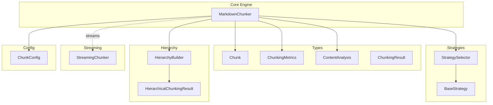
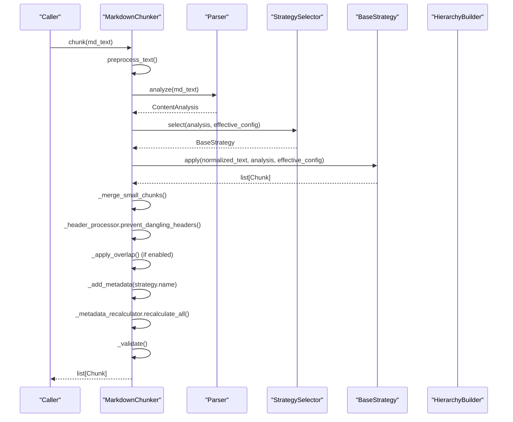
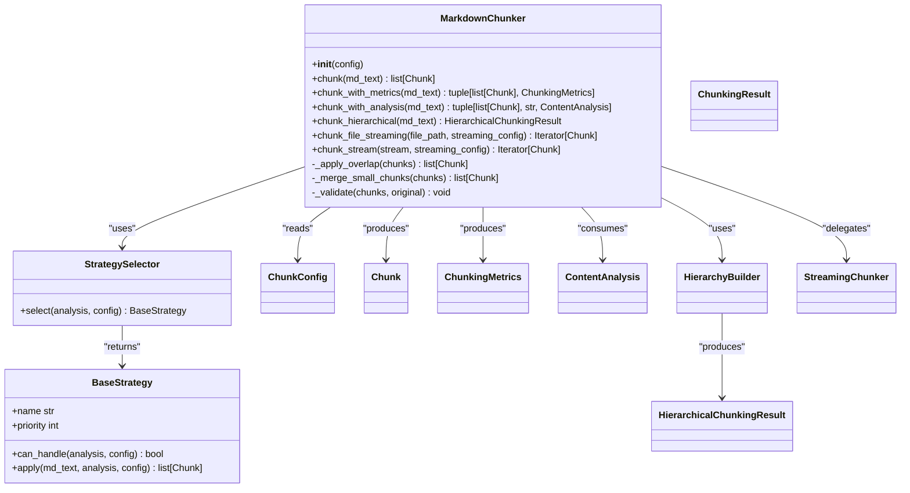

# MarkdownChunker Class

<cite>
**Referenced Files in This Document**
- [chunker.py](file://src/chunkana/chunker.py)
- [config.py](file://src/chunkana/config.py)
- [types.py](file://src/chunkana/types.py)
- [strategies/__init__.py](file://src/chunkana/strategies/__init__.py)
- [strategies/base.py](file://src/chunkana/strategies/base.py)
- [hierarchy.py](file://src/chunkana/hierarchy.py)
- [streaming/streaming_chunker.py](file://src/chunkana/streaming/streaming_chunker.py)
- [api.py](file://src/chunkana/api.py)
</cite>

## Table of Contents
1. [Introduction](#introduction)
2. [Project Structure](#project-structure)
3. [Core Components](#core-components)
4. [Architecture Overview](#architecture-overview)
5. [Detailed Component Analysis](#detailed-component-analysis)
6. [Dependency Analysis](#dependency-analysis)
7. [Performance Considerations](#performance-considerations)
8. [Troubleshooting Guide](#troubleshooting-guide)
9. [Conclusion](#conclusion)

## Introduction
This document provides comprehensive API documentation for the MarkdownChunker class, the core engine of Chunkana. It covers initialization, configuration defaults, the complete chunk() processing pipeline, auxiliary methods for metrics and analysis, hierarchical chunking, and streaming capabilities. It also documents internal methods that implement overlap application, small chunk merging, and validation.

## Project Structure
MarkdownChunker orchestrates a linear pipeline that parses markdown once, selects a strategy, applies it, merges small chunks, prevents dangling headers, applies overlap metadata, enriches metadata, and validates results. It integrates with:
- StrategySelector and BaseStrategy implementations for strategy selection and application
- ChunkConfig for configuration and defaults
- Types for Chunk, ChunkingMetrics, ContentAnalysis, and ChunkingResult
- HierarchyBuilder for hierarchical chunking
- StreamingChunker for memory-efficient processing of large files

**Diagram sources**
- [chunker.py](file://src/chunkana/chunker.py#L37-L300)
- [strategies/__init__.py](file://src/chunkana/strategies/__init__.py#L20-L78)
- [strategies/base.py](file://src/chunkana/strategies/base.py#L15-L120)
- [types.py](file://src/chunkana/types.py#L240-L478)
- [hierarchy.py](file://src/chunkana/hierarchy.py#L16-L120)
- [streaming/streaming_chunker.py](file://src/chunkana/streaming/streaming_chunker.py#L18-L99)
- [config.py](file://src/chunkana/config.py#L17-L126)

**Section sources**
- [chunker.py](file://src/chunkana/chunker.py#L37-L300)
- [config.py](file://src/chunkana/config.py#L17-L126)

## Core Components
- MarkdownChunker: Orchestrates the chunking pipeline and exposes chunk(), chunk_with_metrics(), chunk_with_analysis(), chunk_hierarchical(), chunk_file_streaming(), and chunk_stream().
- StrategySelector and BaseStrategy: Strategy selection and application framework.
- ChunkConfig: Centralized configuration with defaults and validation.
- Types: Data models for Chunk, ChunkingMetrics, ContentAnalysis, ChunkingResult.
- HierarchyBuilder: Builds hierarchical relationships among chunks.
- StreamingChunker: Streams large files for memory efficiency.

**Section sources**
- [chunker.py](file://src/chunkana/chunker.py#L37-L300)
- [strategies/__init__.py](file://src/chunkana/strategies/__init__.py#L20-L78)
- [strategies/base.py](file://src/chunkana/strategies/base.py#L15-L120)
- [types.py](file://src/chunkana/types.py#L240-L478)
- [hierarchy.py](file://src/chunkana/hierarchy.py#L16-L120)
- [streaming/streaming_chunker.py](file://src/chunkana/streaming/streaming_chunker.py#L18-L99)
- [config.py](file://src/chunkana/config.py#L17-L126)

## Architecture Overview
The MarkdownChunker class composes several collaborators:
- Parser: Parses markdown and produces ContentAnalysis.
- StrategySelector: Chooses a strategy based on ContentAnalysis and ChunkConfig.
- BaseStrategy implementations: Apply strategy-specific splitting and chunk creation.
- Post-processing: Merges small chunks, prevents dangling headers, applies overlap metadata, recalculates metadata, adds adaptive sizing metadata, and validates results.
- HierarchyBuilder: Builds parent-child relationships for hierarchical chunking.
- StreamingChunker: Processes files in windows for memory efficiency.

**Diagram sources**
- [chunker.py](file://src/chunkana/chunker.py#L85-L176)
- [strategies/__init__.py](file://src/chunkana/strategies/__init__.py#L20-L78)
- [strategies/base.py](file://src/chunkana/strategies/base.py#L15-L120)

## Detailed Component Analysis

### MarkdownChunker Initialization and Defaults
- Constructor signature: MarkdownChunker(config: ChunkConfig | None = None)
- Behavior:
  - Initializes with provided ChunkConfig or defaults to ChunkConfig().
  - Stores a singleton parser instance, a StrategySelector, a HeaderProcessor, a MetadataRecalculator, and a HierarchyBuilder configured from ChunkConfig.
- Default configuration behavior:
  - max_chunk_size defaults to 4096
  - min_chunk_size defaults to 512
  - overlap_size defaults to 200
  - preserve_atomic_blocks defaults to True
  - extract_preamble defaults to True
  - strategy_override defaults to None
  - enable_code_context_binding defaults to True
  - use_adaptive_sizing defaults to False
  - include_document_summary defaults to True
  - validate_invariants defaults to True
  - strict_mode defaults to False
  - strip_obsidian_block_ids defaults to False
  - preserve_latex_blocks defaults to True
  - latex_display_only defaults to True
  - latex_max_context_chars defaults to 300
  - group_related_tables defaults to False
  - overlap_cap_ratio defaults to 0.35

Practical example:
- Create a chunker with defaults: chunker = MarkdownChunker()
- Create a chunker with custom config: chunker = MarkdownChunker(ChunkConfig(max_chunk_size=8192))

Exceptions:
- Configuration validation raises ValueError for invalid parameter ranges or combinations during ChunkConfig.__post_init__().

**Section sources**
- [chunker.py](file://src/chunkana/chunker.py#L48-L65)
- [config.py](file://src/chunkana/config.py#L17-L126)
- [config.py](file://src/chunkana/config.py#L138-L229)

### chunk(md_text) — Complete Processing Pipeline
Purpose:
- Produce a list of Chunk objects from raw markdown text.

Processing steps:
1. Preprocess text: Optionally remove Obsidian block IDs if configured.
2. Parse: Analyze markdown to produce ContentAnalysis and normalize line endings.
3. Adaptive sizing (optional): If enabled, calculate optimal size and complexity, create an effective config with capped max_chunk_size, and disable recursive adaptive sizing.
4. Strategy selection: Choose strategy via StrategySelector based on ContentAnalysis and effective config.
5. Strategy application: Apply selected strategy to produce initial chunks.
6. Small chunk merging: Merge small chunks with adjacent chunks according to heuristics and structural strength checks.
7. Prevent dangling headers: Adjust chunk boundaries to avoid orphaned headers.
8. Overlap application (optional): Add metadata-only overlap context between adjacent chunks without duplicating content.
9. Metadata enrichment: Add standard metadata (e.g., strategy name).
10. Metadata recalculation: Recalculate derived metadata (e.g., section_tags).
11. Adaptive sizing metadata (optional): Enrich chunks with adaptive metrics when enabled.
12. Validation: Validate domain properties and fix ordering if needed.

Parameters:
- md_text: str — Raw markdown text.

Returns:
- list[Chunk]: List of chunked segments with metadata.

Exceptions:
- ValueError may be raised by Chunk.__post_init__() if chunk constraints are violated.
- Configuration validation may raise ValueError during ChunkConfig.__post_init__().

Practical example:
- chunks = chunker.chunk("# Hello\n\nWorld")

Notes:
- Overlap metadata fields include previous_content, next_content, and overlap_size.
- Oversized chunks may be flagged with allow_oversize and oversize_reason metadata.

**Section sources**
- [chunker.py](file://src/chunkana/chunker.py#L85-L176)
- [strategies/__init__.py](file://src/chunkana/strategies/__init__.py#L20-L78)
- [strategies/base.py](file://src/chunkana/strategies/base.py#L15-L120)
- [types.py](file://src/chunkana/types.py#L240-L375)

### chunk_with_metrics(md_text) — Metrics Collection
Purpose:
- Chunk markdown and compute quality metrics.

Parameters:
- md_text: str — Raw markdown text.

Returns:
- tuple[list[Chunk], ChunkingMetrics]: Tuple of (chunks, metrics).

Metrics include:
- total_chunks, avg_chunk_size, std_dev_size, min_size, max_size, undersize_count, oversize_count.

Use cases:
- Monitoring chunk size distribution and tuning configuration.

Practical example:
- chunks, metrics = chunker.chunk_with_metrics("# Hello\n\nWorld")

**Section sources**
- [chunker.py](file://src/chunkana/chunker.py#L178-L190)
- [types.py](file://src/chunkana/types.py#L377-L431)

### chunk_with_analysis(md_text) — Analysis and Strategy Info
Purpose:
- Chunk markdown and return strategy name and ContentAnalysis.

Parameters:
- md_text: str — Raw markdown text.

Returns:
- tuple[list[Chunk], str, ContentAnalysis | None]: Tuple of (chunks, strategy_name, analysis).

Use cases:
- Debugging and understanding strategy selection.

Practical example:
- chunks, strategy, analysis = chunker.chunk_with_analysis("# Hello\n\nWorld")

**Section sources**
- [chunker.py](file://src/chunkana/chunker.py#L191-L216)
- [types.py](file://src/chunkana/types.py#L181-L239)

### chunk_hierarchical(md_text) — Hierarchical Chunking
Purpose:
- Build a hierarchical structure with parent-child relationships and navigation methods.

Process:
1. Perform normal chunking via chunk().
2. Build hierarchy relationships via HierarchyBuilder.
3. Return HierarchicalChunkingResult with navigation methods.

Parameters:
- md_text: str — Raw markdown text.

Returns:
- HierarchicalChunkingResult: Object with navigation methods (get_chunk, get_children, get_parent, get_ancestors, get_siblings, get_flat_chunks, get_by_level) and a root_id.

Use cases:
- Tree-based retrieval and navigation.

Practical example:
- result = chunker.chunk_hierarchical(markdown_text)
- root = result.get_chunk(result.root_id)
- children = result.get_children(result.root_id)

**Section sources**
- [chunker.py](file://src/chunkana/chunker.py#L217-L248)
- [hierarchy.py](file://src/chunkana/hierarchy.py#L16-L120)
- [hierarchy.py](file://src/chunkana/hierarchy.py#L233-L308)

### chunk_file_streaming(file_path, streaming_config) — File Streaming
Purpose:
- Chunk a large markdown file in streaming mode for memory efficiency.

Parameters:
- file_path: str — Path to markdown file.
- streaming_config: StreamingConfig | None — Streaming configuration (defaults if None).

Yields:
- Iterator[Chunk]: Chunks with streaming metadata (e.g., stream_chunk_index, stream_window_index, bytes_processed).

Use cases:
- Processing files larger than typical memory budgets.

Practical example:
- for chunk in chunker.chunk_file_streaming("large.md"): process(chunk)

**Section sources**
- [chunker.py](file://src/chunkana/chunker.py#L249-L300)
- [streaming/streaming_chunker.py](file://src/chunkana/streaming/streaming_chunker.py#L18-L99)

### chunk_stream(stream, streaming_config) — Stream Streaming
Purpose:
- Chunk a text stream in streaming mode for memory efficiency.

Parameters:
- stream: io.TextIOBase — Text stream to process.
- streaming_config: StreamingConfig | None — Streaming configuration (defaults if None).

Yields:
- Iterator[Chunk]: Chunks with streaming metadata.

Use cases:
- Processing streams without loading entire content into memory.

Practical example:
- import io
- chunker = MarkdownChunker()
- stream = io.StringIO(large_text)
- for chunk in chunker.chunk_stream(stream): process(chunk)

**Section sources**
- [chunker.py](file://src/chunkana/chunker.py#L275-L300)
- [streaming/streaming_chunker.py](file://src/chunkana/streaming/streaming_chunker.py#L18-L99)

### Internal Methods

#### _apply_overlap(chunks) — Metadata-Only Overlap
Purpose:
- Add metadata-only overlap context between adjacent chunks without duplicating content.

Behavior:
- For each chunk (except first and last), compute previous_content and next_content from neighboring chunks.
- Window size is determined by overlap_size and capped by overlap_cap_ratio of adjacent chunk size.
- Extraction respects word boundaries.

Parameters:
- chunks: list[Chunk] — List of chunks.

Returns:
- list[Chunk] — Same chunks with overlap metadata added.

Configuration dependencies:
- overlap_size, overlap_cap_ratio, enable_overlap.

**Section sources**
- [chunker.py](file://src/chunkana/chunker.py#L301-L369)
- [chunker.py](file://src/chunkana/chunker.py#L371-L429)
- [config.py](file://src/chunkana/config.py#L124-L126)

#### _merge_small_chunks(chunks) — Small Chunk Merging
Purpose:
- Merge chunks smaller than min_chunk_size with adjacent chunks when safe and beneficial.

Phases:
1. Merge small header-only chunks with their section body.
2. Merge remaining small chunks with adjacent chunks respecting max_chunk_size and preamble compatibility.
3. Flag structurally weak small chunks with small_chunk metadata.

Structural strength criteria:
- Has strong header (level 2 or 3)
- Multiple paragraphs (at least 2)
- Sufficient non-header content (> 100 characters)
- Multiple meaningful lines (at least 3 non-empty lines after header removal)

Parameters:
- chunks: list[Chunk] — List of chunks.

Returns:
- list[Chunk] — Merged chunks.

Configuration dependencies:
- min_chunk_size, max_chunk_size, and header path metadata.

**Section sources**
- [chunker.py](file://src/chunkana/chunker.py#L431-L515)
- [chunker.py](file://src/chunkana/chunker.py#L516-L580)
- [chunker.py](file://src/chunkana/chunker.py#L581-L634)
- [chunker.py](file://src/chunkana/chunker.py#L635-L682)
- [chunker.py](file://src/chunkana/chunker.py#L683-L776)
- [chunker.py](file://src/chunkana/chunker.py#L777-L800)

#### _validate(chunks, original) — Domain Property Validation
Purpose:
- Validate domain properties and enforce invariants.

Checks:
- Content loss: Total output size compared to original (with tolerance).
- Oversized chunks: Mark allow_oversize and oversize_reason metadata for oversized chunks preserving atomic integrity.
- Ordering: Ensure monotonic start_line ordering and fix if needed.
- Other invariants enforced by Chunk.__post_init__.

Parameters:
- chunks: list[Chunk] — List of chunks.
- original: str — Original normalized text.

**Section sources**
- [chunker.py](file://src/chunkana/chunker.py#L431-L470)

### Strategy Selection and Application
- StrategySelector selects the best strategy based on ContentAnalysis and thresholds in ChunkConfig.
- BaseStrategy defines apply() and helper methods for splitting, atomic block handling, and table grouping.
- Strategy selection order: CodeAwareStrategy, ListAwareStrategy, StructuralStrategy, FallbackStrategy.

**Section sources**
- [strategies/__init__.py](file://src/chunkana/strategies/__init__.py#L20-L78)
- [strategies/base.py](file://src/chunkana/strategies/base.py#L15-L120)

### Metadata and Types
- Chunk: Core data model with content, start_line, end_line, and metadata.
- ChunkingMetrics: Quality metrics computed from chunks.
- ContentAnalysis: Document analysis results used for strategy selection.
- ChunkingResult: Structured result combining chunks, strategy_used, and processing stats.

**Section sources**
- [types.py](file://src/chunkana/types.py#L240-L478)

## Dependency Analysis
MarkdownChunker depends on:
- ChunkConfig for configuration and defaults
- StrategySelector and BaseStrategy for strategy selection and application
- Parser for ContentAnalysis
- HierarchyBuilder for hierarchical chunking
- StreamingChunker for streaming modes
- Types for Chunk, ChunkingMetrics, ContentAnalysis, ChunkingResult

**Diagram sources**
- [chunker.py](file://src/chunkana/chunker.py#L37-L300)
- [strategies/__init__.py](file://src/chunkana/strategies/__init__.py#L20-L78)
- [strategies/base.py](file://src/chunkana/strategies/base.py#L15-L120)
- [types.py](file://src/chunkana/types.py#L240-L478)
- [hierarchy.py](file://src/chunkana/hierarchy.py#L16-L120)
- [streaming/streaming_chunker.py](file://src/chunkana/streaming/streaming_chunker.py#L18-L99)
- [config.py](file://src/chunkana/config.py#L17-L126)

**Section sources**
- [chunker.py](file://src/chunkana/chunker.py#L37-L300)
- [strategies/__init__.py](file://src/chunkana/strategies/__init__.py#L20-L78)
- [strategies/base.py](file://src/chunkana/strategies/base.py#L15-L120)
- [types.py](file://src/chunkana/types.py#L240-L478)
- [hierarchy.py](file://src/chunkana/hierarchy.py#L16-L120)
- [streaming/streaming_chunker.py](file://src/chunkana/streaming/streaming_chunker.py#L18-L99)
- [config.py](file://src/chunkana/config.py#L17-L126)

## Performance Considerations
- Adaptive sizing: When enabled, calculates optimal chunk size based on content complexity and updates effective configuration. This can reduce the number of chunks and improve retrieval quality for complex documents.
- Overlap metadata: Using overlap_size and overlap_cap_ratio helps language models understand boundaries without increasing content duplication.
- Streaming: chunk_file_streaming and chunk_stream process files in windows, limiting memory usage for large inputs.
- Strategy selection: Choosing the appropriate strategy reduces fragmentation and improves chunk coherence.

[No sources needed since this section provides general guidance]

## Troubleshooting Guide
Common issues and resolutions:
- Empty or whitespace-only content: Chunk.__post_init__() raises ValueError. Ensure md_text contains meaningful content.
- Invalid line indices: start_line must be >= 1 and end_line must be >= start_line. Adjust parsing or pre-processing.
- Oversized chunks: If a chunk exceeds max_chunk_size due to atomic blocks (code, tables, LaTeX), allow_oversize is set with oversize_reason. Tune thresholds or enable table grouping.
- Unexpected chunk counts: Review min_chunk_size and adaptive sizing settings. Use chunk_with_metrics() to inspect distribution.
- Streaming errors: For chunk_file_streaming(), ensure file exists and is readable with the specified encoding.

**Section sources**
- [types.py](file://src/chunkana/types.py#L297-L307)
- [chunker.py](file://src/chunkana/chunker.py#L431-L470)
- [api.py](file://src/chunkana/api.py#L228-L271)

## Conclusion
MarkdownChunker provides a robust, configurable, and validated pipeline for chunking markdown documents. It supports advanced features like adaptive sizing, overlap metadata, small chunk merging, hierarchical navigation, and streaming for large files. The class integrates cleanly with strategy selection and metadata enrichment, enabling high-quality chunking for semantic retrieval and downstream applications.