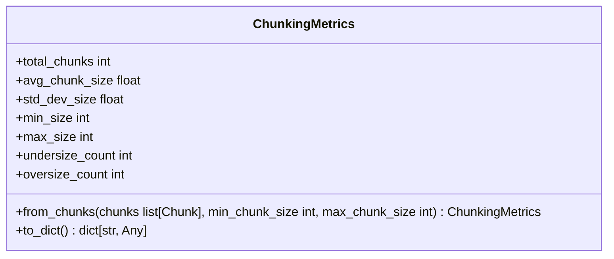
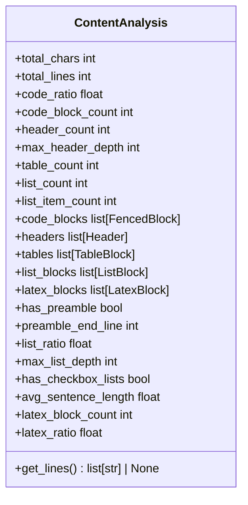
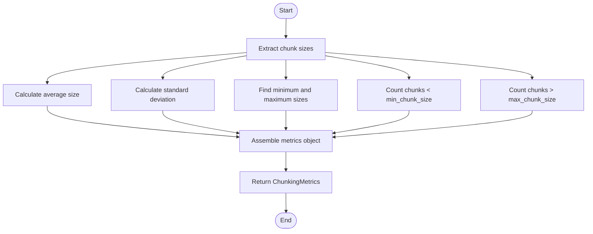
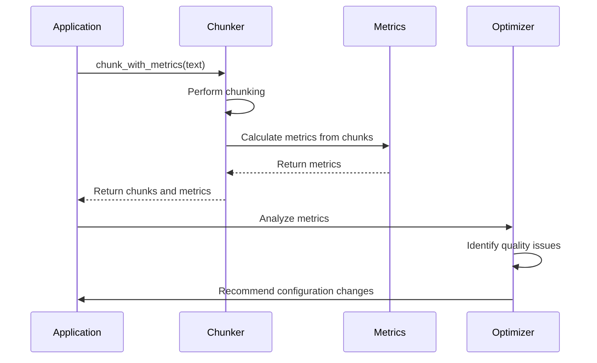
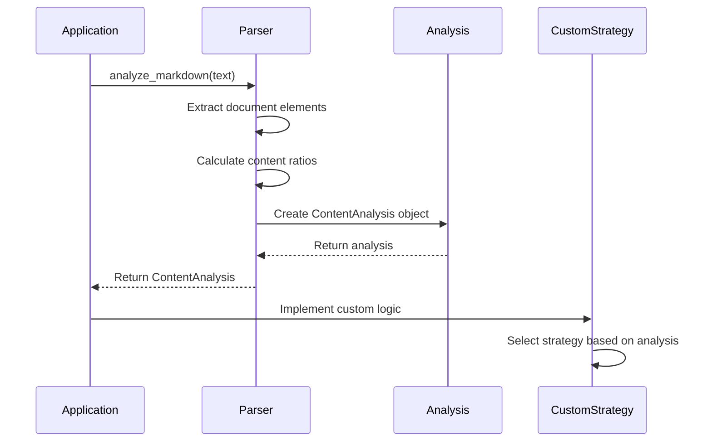
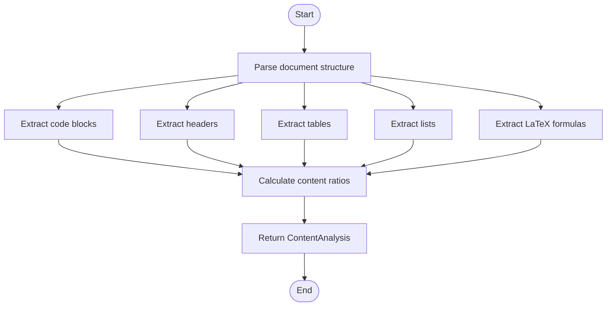
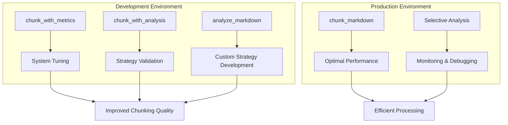

# Metrics and Analysis

<cite>
**Referenced Files in This Document**   
- [chunker.py](file://src/chunkana/chunker.py)
- [types.py](file://src/chunkana/types.py)
- [api.py](file://src/chunkana/api.py)
- [parser.py](file://src/chunkana/parser.py)
- [config.py](file://src/chunkana/config.py)
</cite>

## Table of Contents
1. [Introduction](#introduction)
2. [Core Methods Overview](#core-methods-overview)
3. [ChunkingMetrics Data Model](#chunkingmetrics-data-model)
4. [ContentAnalysis Return Value](#contentanalysis-return-value)
5. [Metric Calculation Process](#metric-calculation-process)
6. [Usage Examples and System Optimization](#usage-examples-and-system-optimization)
7. [Raw Analysis Data Access](#raw-analysis-data-access)
8. [Performance Considerations](#performance-considerations)
9. [Production vs Development Usage](#production-vs-development-usage)

## Introduction
The `chunk_with_metrics()` and `chunk_with_analysis()` methods provide enhanced visibility into the chunking process, enabling quality assurance, system optimization, and custom strategy implementation. These methods expose detailed metrics and document structure insights that inform decision-making for RAG systems. This document explains the implementation, data models, and practical applications of these analytical methods, including performance implications and appropriate usage contexts.

## Core Methods Overview

The `chunk_with_metrics()` and `chunk_with_analysis()` methods extend the basic chunking functionality by providing additional analytical data. The `chunk_with_metrics()` method returns chunking quality metrics that help assess output quality, while `chunk_with_analysis()` provides comprehensive document structure insights used for strategy selection and debugging.

**Section sources**
- [chunker.py](file://src/chunkana/chunker.py#L177-L215)
- [api.py](file://src/chunkana/api.py#L105-L135)

## ChunkingMetrics Data Model

The `ChunkingMetrics` data model captures quality metrics for monitoring and tuning the chunking process. It includes statistical measures derived from chunk size distributions, enabling assessment of chunking quality and identification of potential issues.

**Diagram sources**
- [types.py](file://src/chunkana/types.py#L378-L429)

**Section sources**
- [types.py](file://src/chunkana/types.py#L378-L429)

## ContentAnalysis Return Value

The `ContentAnalysis` return value provides document structure insights used for strategy selection. It contains metrics and extracted elements that characterize the document's content composition, enabling intelligent strategy decisions based on document characteristics.

**Diagram sources**
- [types.py](file://src/chunkana/types.py#L181-L238)

**Section sources**
- [types.py](file://src/chunkana/types.py#L181-L238)

## Metric Calculation Process

The metric calculation process for `ChunkingMetrics` involves analyzing chunk size distributions, overlap statistics, and content preservation ratios. The `from_chunks()` method calculates statistical measures from the chunk list, including average size, standard deviation, and counts of undersized and oversized chunks relative to configuration thresholds.

**Diagram sources**
- [types.py](file://src/chunkana/types.py#L393-L417)

**Section sources**
- [types.py](file://src/chunkana/types.py#L393-L417)

## Usage Examples and System Optimization

The metrics and analysis data inform system optimization and quality assurance by identifying chunking quality issues and guiding configuration adjustments. For example, high undersize counts may indicate the need to adjust min_chunk_size, while high oversize counts may suggest the need for more aggressive splitting strategies.

**Diagram sources**
- [chunker.py](file://src/chunkana/chunker.py#L177-L189)
- [api.py](file://src/chunkana/api.py#L105-L135)

**Section sources**
- [chunker.py](file://src/chunkana/chunker.py#L177-L189)
- [api.py](file://src/chunkana/api.py#L105-L135)

## Raw Analysis Data Access

Accessing raw analysis data before chunking enables custom strategy implementation by providing comprehensive document structure insights. The `analyze_markdown()` function exposes the `ContentAnalysis` object directly, allowing developers to implement custom logic based on document characteristics such as code ratio, header depth, and list density.

**Diagram sources**
- [parser.py](file://src/chunkana/parser.py#L44-L121)
- [api.py](file://src/chunkana/api.py#L43-L67)

**Section sources**
- [parser.py](file://src/chunkana/parser.py#L44-L121)
- [api.py](file://src/chunkana/api.py#L43-L67)

## Performance Considerations

The performance overhead of metrics collection is minimal for `chunk_with_metrics()` since metrics are calculated from existing chunk data. However, `chunk_with_analysis()` incurs additional overhead from document analysis, particularly for large documents. The analysis process involves multiple passes to extract code blocks, headers, tables, and other elements, which can impact performance.

**Diagram sources**
- [parser.py](file://src/chunkana/parser.py#L44-L121)

**Section sources**
- [parser.py](file://src/chunkana/parser.py#L44-L121)

## Production vs Development Usage

The analytical methods are primarily intended for development and quality assurance rather than production use. In development environments, they enable tuning of chunking parameters and validation of output quality. In production, the standard `chunk_markdown()` method is recommended for optimal performance, with analytical methods used selectively for monitoring and debugging.

**Diagram sources**
- [chunker.py](file://src/chunkana/chunker.py#L177-L215)
- [api.py](file://src/chunkana/api.py#L105-L135)

**Section sources**
- [chunker.py](file://src/chunkana/chunker.py#L177-L215)
- [api.py](file://src/chunkana/api.py#L105-L135)