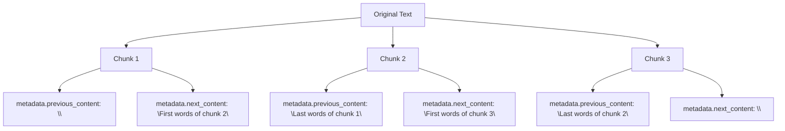
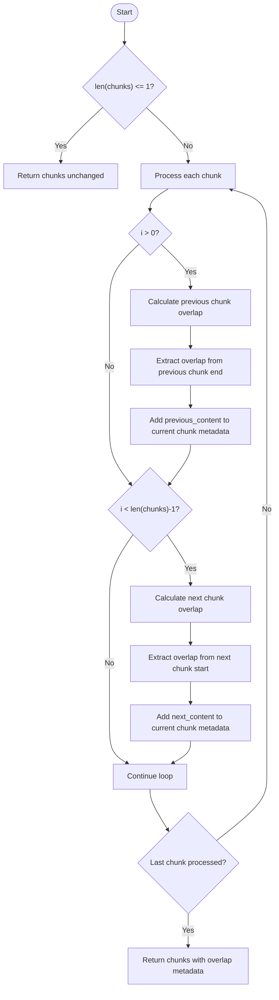
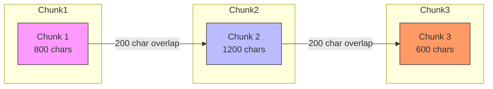
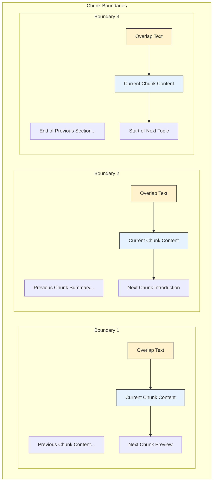

# Overlap Application

<cite>
**Referenced Files in This Document**   
- [chunker.py](file://src/chunkana/chunker.py)
- [config.py](file://src/chunkana/config.py)
- [types.py](file://src/chunkana/types.py)
- [formatters.py](file://src/chunkana/renderers/formatters.py)
</cite>

## Table of Contents
1. [Introduction](#introduction)
2. [Metadata-Only Overlap Implementation](#metadata-only-overlap-implementation)
3. [Adaptive Overlap Sizing Mechanism](#adaptive-overlap-sizing-mechanism)
4. [Context Field Injection](#context-field-injection)
5. [Overlap Calculation Examples](#overlap-calculation-examples)
6. [Configuration Tuning](#configuration-tuning)
7. [Visualization of Overlap Patterns](#visualization-of-overlap-patterns)
8. [Impact on Retrieval Quality](#impact-on-retrieval-quality)

## Introduction
The `_apply_overlap()` method in the MarkdownChunker class implements a metadata-only overlap strategy to provide contextual continuity between chunks without duplicating text content. This approach enhances language model understanding of chunk boundaries while preventing index bloat and semantic search confusion. The method uses adaptive sizing based on the `overlap_cap_ratio` parameter (default 0.35) and interacts with the configured `overlap_size` to determine effective overlap dimensions.

**Section sources**
- [chunker.py](file://src/chunkana/chunker.py#L301-L400)

## Metadata-Only Overlap Implementation
The `_apply_overlap()` method implements a metadata-only overlap model where context from neighboring chunks is stored exclusively in metadata fields. This ensures no physical text duplication occurs in `chunk.content`, maintaining distinct and non-overlapping content across chunks. The method adds three key metadata fields:

- `previous_content`: Last N characters from the previous chunk (for all except the first chunk)
- `next_content`: First N characters from the next chunk (for all except the last chunk)
- `overlap_size`: Size of the context window used for metadata extraction

This implementation prevents index bloat by keeping the actual chunk content unique while still providing sufficient context for language models to understand relationships across chunk boundaries. The metadata-only approach also avoids semantic search confusion that could arise from duplicated text appearing in multiple chunks.



**Diagram sources**
- [chunker.py](file://src/chunkana/chunker.py#L301-L370)
- [types.py](file://src/chunkana/types.py#L279-L287)

**Section sources**
- [chunker.py](file://src/chunkana/chunker.py#L301-L370)
- [types.py](file://src/chunkana/types.py#L279-L287)

## Adaptive Overlap Sizing Mechanism
The adaptive overlap sizing mechanism uses both the configured `overlap_size` parameter and the `overlap_cap_ratio` (default 0.35) to determine the effective overlap size. For each chunk boundary, the method calculates the maximum allowable overlap as a fraction of the adjacent chunk's size, then takes the minimum of this value and the configured `overlap_size`.

The calculation follows this formula:
```
max_overlap = min(config.overlap_size, chunk_size * config.overlap_cap_ratio)
```

This adaptive approach allows larger overlap for larger chunks while preventing excessive overlap on smaller chunks. For example, with a default `overlap_cap_ratio` of 0.35:
- A 1000-character chunk would have a maximum overlap of 350 characters
- A 500-character chunk would have a maximum overlap of 175 characters
- A 200-character chunk would have a maximum overlap of 70 characters

The mechanism ensures that overlap remains proportional to chunk size, maintaining context relevance while avoiding disproportionate metadata overhead on small chunks.



**Diagram sources**
- [chunker.py](file://src/chunkana/chunker.py#L345-L367)
- [config.py](file://src/chunkana/config.py#L124-L125)

**Section sources**
- [chunker.py](file://src/chunkana/chunker.py#L345-L367)
- [config.py](file://src/chunkana/config.py#L124-L125)

## Context Field Injection
The method injects context fields by extracting text from the boundaries of adjacent chunks using specialized helper methods. For `previous_content`, it uses `_extract_overlap_end()` to retrieve text from the end of the previous chunk, while for `next_content`, it uses `_extract_overlap_start()` to retrieve text from the beginning of the next chunk.

Both extraction methods respect word boundaries to ensure clean context transitions:
- `_extract_overlap_end()` attempts to start at a word boundary by finding the first space in the first half of the extracted text
- `_extract_overlap_start()` attempts to end at a word boundary by finding the last space in the second half of the extracted text

This word-aware extraction prevents awkward word splits in the context preview, improving readability and comprehension for language models. The extracted text is then stored in the appropriate metadata field without modifying the original chunk content.

```mermaid
classDiagram
class MarkdownChunker {
+_apply_overlap(chunks : list[Chunk]) list[Chunk]
+_extract_overlap_end(content : str, size : int) str
+_extract_overlap_start(content : str, size : int) str
}
class Chunk {
+content : str
+start_line : int
+end_line : int
+metadata : dict[str, Any]
+size : int
}
MarkdownChunker --> Chunk : "processes"
MarkdownChunker ..> "_extract_overlap_end" : "uses"
MarkdownChunker ..> "_extract_overlap_start" : "uses"
```

**Diagram sources**
- [chunker.py](file://src/chunkana/chunker.py#L371-L429)
- [types.py](file://src/chunkana/types.py#L240-L317)

**Section sources**
- [chunker.py](file://src/chunkana/chunker.py#L371-L429)

## Overlap Calculation Examples
Consider a document split into three consecutive chunks with different sizes. The effective overlap size is calculated based on both the configured `overlap_size` (200) and the `overlap_cap_ratio` (0.35):

**Example 1: Variable Chunk Sizes**
- Chunk 1: 800 characters
- Chunk 2: 1200 characters  
- Chunk 3: 600 characters

For the boundary between Chunk 1 and Chunk 2:
- Previous chunk (Chunk 1) size: 800
- Max overlap from cap: 800 × 0.35 = 280
- Effective overlap: min(200, 280) = 200 characters

For the boundary between Chunk 2 and Chunk 3:
- Next chunk (Chunk 3) size: 600
- Max overlap from cap: 600 × 0.35 = 210
- Effective overlap: min(200, 210) = 200 characters

**Example 2: Small Chunk Limitation**
- Chunk 1: 400 characters
- Chunk 2: 180 characters

For the boundary between Chunk 1 and Chunk 2:
- Next chunk (Chunk 2) size: 180
- Max overlap from cap: 180 × 0.35 = 63
- Effective overlap: min(200, 63) = 63 characters

This demonstrates how the adaptive mechanism reduces overlap size for smaller chunks to prevent excessive context relative to the chunk size.



**Diagram sources**
- [chunker.py](file://src/chunkana/chunker.py#L349-L362)

**Section sources**
- [chunker.py](file://src/chunkana/chunker.py#L349-L362)

## Configuration Tuning
Configuration tuning for different LLM context windows involves adjusting both `overlap_size` and `overlap_cap_ratio` parameters. The optimal settings depend on the target LLM's context window and the document characteristics:

**For Large Context LLMs (32K+ tokens):**
```python
config = ChunkerConfig(
    max_chunk_size=8192,
    overlap_size=300,
    overlap_cap_ratio=0.4
)
```
Larger overlap sizes can be used since the model can handle more context without performance degradation.

**For Medium Context LLMs (8K-16K tokens):**
```python
config = ChunkerConfig(
    max_chunk_size=4096, 
    overlap_size=200,
    overlap_cap_ratio=0.35
)
```
Balanced settings that provide sufficient context without overwhelming the model.

**For Small Context LLMs (2K-4K tokens):**
```python
config = ChunkerConfig(
    max_chunk_size=2048,
    overlap_size=100,
    overlap_cap_ratio=0.25
)
```
Smaller overlap sizes to conserve context window space for actual content.

The `overlap_cap_ratio` should be reduced for smaller context models to prevent overlap from consuming too much of the available context. Conversely, larger context models can benefit from higher ratios to provide more comprehensive boundary context.

**Section sources**
- [config.py](file://src/chunkana/config.py#L78-L80)
- [config.py](file://src/chunkana/config.py#L124-L125)

## Visualization of Overlap Patterns
The overlap pattern across chunk boundaries follows a systematic approach that ensures consistent context provision while maintaining content integrity. The visualization below shows how overlap metadata is applied across multiple chunks:



The pattern shows that each chunk receives context from both directions:
- All chunks except the first receive `previous_content` metadata
- All chunks except the last receive `next_content` metadata
- The first chunk only has `next_content`
- The last chunk only has `previous_content`

This bidirectional context flow creates a seamless reading experience across chunk boundaries while maintaining the integrity of the original content segmentation.

**Diagram sources**
- [chunker.py](file://src/chunkana/chunker.py#L345-L367)
- [formatters.py](file://src/chunkana/renderers/formatters.py#L105-L116)

**Section sources**
- [chunker.py](file://src/chunkana/chunker.py#L345-L367)
- [formatters.py](file://src/chunkana/renderers/formatters.py#L105-L116)

## Impact on Retrieval Quality
The metadata-only overlap approach significantly improves retrieval quality by providing contextual continuity without introducing duplicate content into the index. This prevents semantic search confusion that could occur when identical text appears in multiple chunks, which might artificially inflate relevance scores.

The adaptive sizing mechanism ensures that overlap remains proportionate to chunk size, preventing small chunks from being overwhelmed by relatively large overlap text. This maintains the focus on the primary content while still providing sufficient context for understanding.

When combined with renderers that embed the overlap metadata (such as `render_with_embedded_overlap`), the approach enables "rich context" mode where language models receive boundary context without the indexing system storing duplicate text. This separation of concerns—context for consumption vs. content for indexing—optimizes both retrieval accuracy and model comprehension.

The method also supports various retrieval strategies:
- **Bidirectional context**: Both previous and next content available
- **Sliding window**: Only previous content used for sequential processing
- **Metadata-only**: Context remains in metadata for selective use

This flexibility allows developers to choose the appropriate context strategy based on their specific use case and LLM requirements.

**Section sources**
- [formatters.py](file://src/chunkana/renderers/formatters.py#L87-L116)
- [chunker.py](file://src/chunkana/chunker.py#L301-L400)