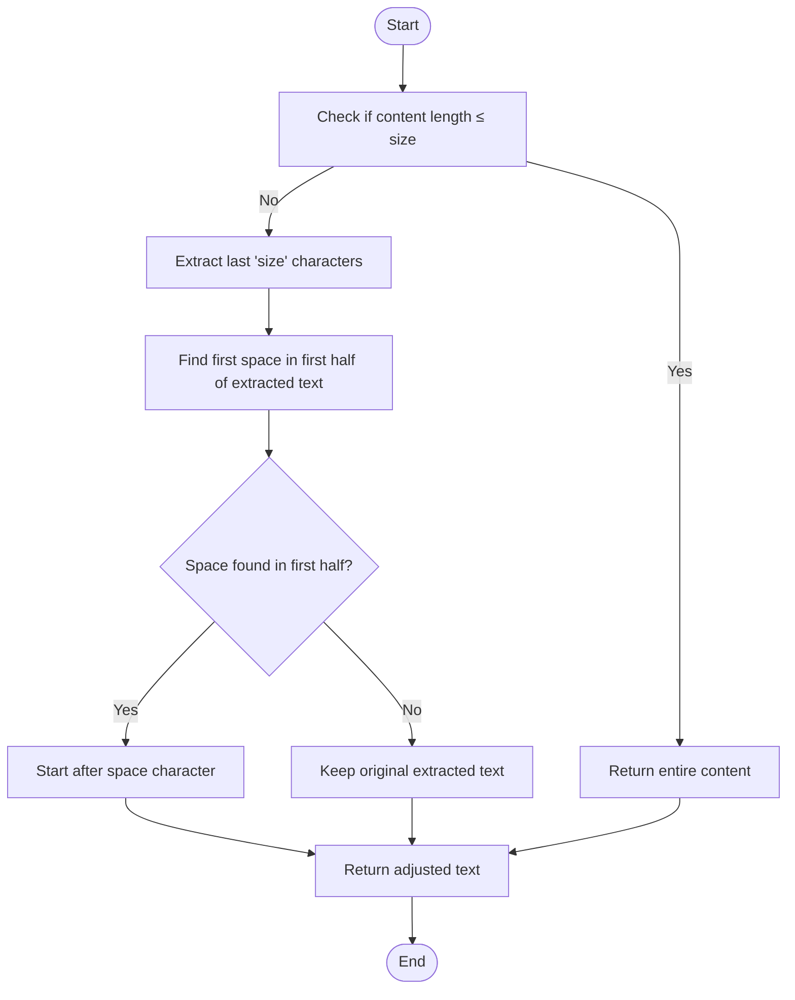
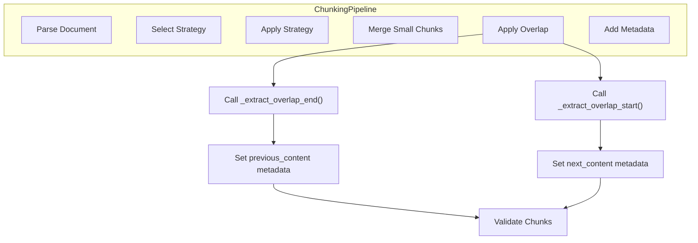

# Overlap End Extraction

<cite>
**Referenced Files in This Document**   
- [chunker.py](file://src/chunkana/chunker.py#L371-L399)
- [config.py](file://src/chunkana/config.py#L125)
- [types.py](file://src/chunkana/types.py#L279-L282)
</cite>

## Table of Contents
1. [Introduction](#introduction)
2. [Algorithm Overview](#algorithm-overview)
3. [Implementation Details](#implementation-details)
4. [Practical Examples](#practical-examples)
5. [Word Boundary Preservation](#word-boundary-preservation)
6. [Relationship to Overlap Strategy](#relationship-to-overlap-strategy)
7. [Configuration Parameters](#configuration-parameters)

## Introduction
The `_extract_overlap_end()` method is a critical component in the chunking pipeline responsible for extracting text from the end of a chunk's content to populate the `previous_content` metadata field. This functionality enables language models to maintain context continuity when processing sequential chunks by providing preview text from the preceding chunk without duplicating content in the main chunk body. The method implements intelligent text extraction that respects word boundaries to ensure readability and comprehension at chunk boundaries.

**Section sources**
- [chunker.py](file://src/chunkana/chunker.py#L371-L399)

## Algorithm Overview
The `_extract_overlap_end()` method follows a three-step algorithm to extract text from the end of a chunk's content:

1. **Size Check**: If the content length is less than or equal to the specified size parameter, the entire content is returned.
2. **Character Extraction**: Otherwise, the last 'size' characters are extracted from the content.
3. **Word Boundary Adjustment**: The method attempts to find a space character in the first half of the extracted text and adjusts the starting position to begin after this space, preventing word splitting.

This algorithm ensures that the extracted overlap text is both contextually relevant and linguistically coherent, avoiding the presentation of partial words that could hinder language model comprehension.

**Diagram sources **
- [chunker.py](file://src/chunkana/chunker.py#L389-L398)

**Section sources**
- [chunker.py](file://src/chunkana/chunker.py#L371-L399)

## Implementation Details
The implementation of `_extract_overlap_end()` is designed to balance efficiency with linguistic quality. The method takes two parameters: `content` (the source text) and `size` (the target overlap size). When the content length is less than or equal to the size parameter, the method returns the entire content as-is, which handles edge cases where chunks are smaller than the desired overlap size.

For longer content, the method extracts the last 'size' characters using Python's slice notation (`content[-size:]`). It then searches for the first space character within the extracted text using the `find(" ")` method. If a space is found and its position is within the first half of the extracted text (position < length/2), the method adjusts the starting point to begin after this space character (`text[space_pos + 1 :]`).

This approach prioritizes readability by avoiding word splits while maintaining a reasonable overlap size. The constraint of finding a space in the first half ensures that the adjustment doesn't significantly reduce the overlap size, preserving sufficient context for language models.

**Section sources**
- [chunker.py](file://src/chunkana/chunker.py#L389-L398)

## Practical Examples
Consider a chunk with the following content: "The quick brown fox jumps over the lazy dog and continues running through the forest." If the overlap size is set to 30 characters, the method would first extract the last 30 characters: "hrough the forest." The method then searches for the first space in the first 15 characters of this extracted text. Finding the space after "hrough", it adjusts the starting position to return "the forest." instead of "hrough the forest."

In another example, with content "This is a sample sentence for testing the overlap extraction functionality" and an overlap size of 25, the last 25 characters are "ractionality". Since there is no space in the first 12 characters of this extraction, the method returns the entire extracted text "ractionality" without adjustment.

When the content is shorter than or equal to the size parameter, such as "Short text" with a size of 15, the method returns the complete content "Short text" rather than attempting to extract a subset.

**Section sources**
- [chunker.py](file://src/chunkana/chunker.py#L389-L398)

## Word Boundary Preservation
Preserving word boundaries is essential for maintaining readability and comprehension at chunk boundaries. When language models encounter partial words, their ability to understand context and meaning is significantly impaired. The `_extract_overlap_end()` method addresses this by attempting to start the overlap text at a natural word boundary.

The algorithm specifically looks for a space character in the first half of the extracted text, ensuring that the adjustment doesn't excessively reduce the overlap size. This balance between readability and context preservation is crucial for effective language model processing. By starting after a space character, the method ensures that the `previous_content` field begins with a complete word, allowing language models to parse the text naturally.

This approach also prevents the creation of misleading word forms that could confuse language models. For example, instead of presenting "hrough" (which might be misinterpreted as a word), the method presents "the" as the starting word, maintaining linguistic integrity.

**Section sources**
- [chunker.py](file://src/chunkana/chunker.py#L394-L398)
- [types.py](file://src/chunkana/types.py#L279-L282)

## Relationship to Overlap Strategy
The `_extract_overlap_end()` method is an integral part of the overall overlap strategy in the chunking pipeline. It works in conjunction with `_extract_overlap_start()` to create bidirectional context between adjacent chunks. While `_extract_overlap_end()` provides the `previous_content` metadata for a chunk, `_extract_overlap_start()` provides the `next_content` metadata.

This metadata-only overlap approach ensures that the main chunk content remains distinct and non-overlapping, preventing index bloat and semantic search confusion. The overlap size is adaptively capped based on the adjacent chunk size through the `overlap_cap_ratio` configuration parameter, which limits the maximum overlap to a percentage of the chunk size.

The method is called during the `_apply_overlap()` phase of chunking, where it processes each chunk to add overlap metadata. This systematic approach ensures consistent context provision across all chunks in a document, enhancing the overall coherence of processed content.

**Diagram sources **
- [chunker.py](file://src/chunkana/chunker.py#L345-L368)

**Section sources**
- [chunker.py](file://src/chunkana/chunker.py#L345-L368)

## Configuration Parameters
The behavior of `_extract_overlap_end()` is influenced by several configuration parameters defined in the `ChunkConfig` class. The primary parameter is `overlap_size`, which determines the target size of the overlap text. This is typically set to 200 characters by default but can be adjusted based on specific use cases.

An important secondary parameter is `overlap_cap_ratio`, which defaults to 0.35. This ratio limits the maximum overlap size to a percentage of the adjacent chunk's size, preventing disproportionately large overlaps for very large chunks. The effective overlap size used by `_extract_overlap_end()` is the minimum of `overlap_size` and the adaptive maximum calculated from the chunk size and `overlap_cap_ratio`.

These configuration parameters allow the overlap strategy to be tuned for different document types and processing requirements, balancing context provision with efficiency considerations.

**Section sources**
- [config.py](file://src/chunkana/config.py#L80)
- [config.py](file://src/chunkana/config.py#L125)
- [chunker.py](file://src/chunkana/chunker.py#L350-L352)