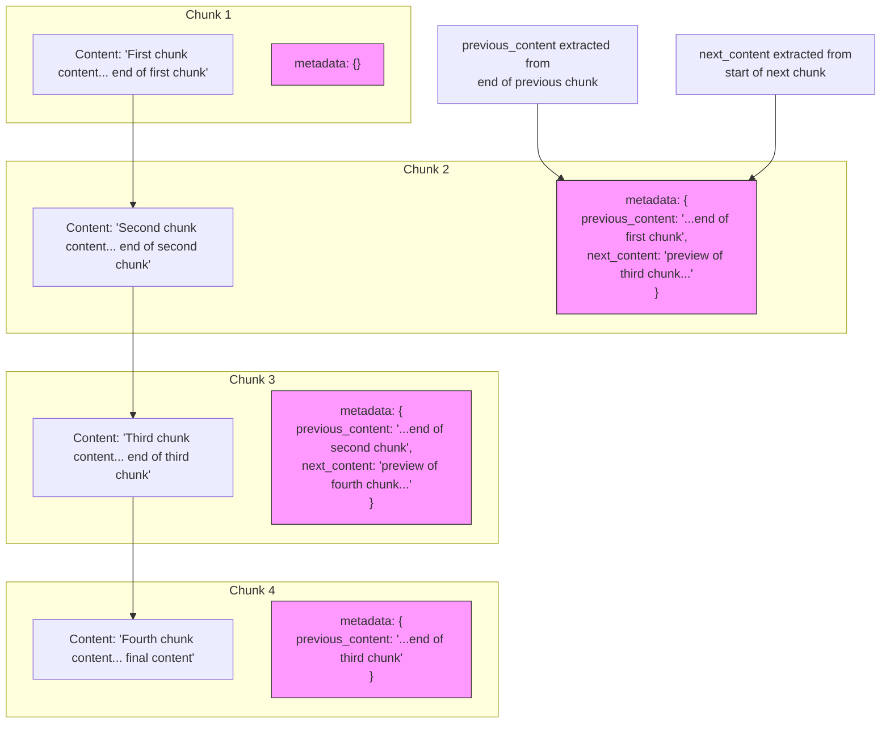

# Overlap Management

<cite>
**Referenced Files in This Document**   
- [chunker.py](file://src/chunkana/chunker.py#L301-L429)
- [config.py](file://src/chunkana/config.py#L124-L136)
- [types.py](file://src/chunkana/types.py#L279-L289)
- [formatters.py](file://src/chunkana/renderers/formatters.py#L97-L145)
</cite>

## Table of Contents
1. [Overlap Management](#overlap-management)
2. [Metadata-Only Overlap Model](#metadata-only-overlap-model)
3. [Adaptive Overlap Sizing](#adaptive-overlap-sizing)
4. [Word-Boundary Preservation](#word-boundary-preservation)
5. [Configuration and Tuning](#configuration-and-tuning)
6. [Overlap Pattern Visualization](#overlap-pattern-visualization)

## Metadata-Only Overlap Model

The overlap management system implements a metadata-only overlap model that prevents text duplication while providing contextual continuity between chunks. This approach ensures that the actual content of each chunk remains distinct and non-overlapping, while still providing language models with sufficient context to understand relationships across chunk boundaries.

The core principle of this model is that overlap context is stored exclusively in metadata fields rather than being physically duplicated in the chunk content. This prevents index bloat and avoids semantic search confusion that could arise from duplicated text. The model adds three metadata fields to chunks:

- **previous_content**: Contains the last N characters from the previous chunk (for all chunks except the first)
- **next_content**: Contains the first N characters from the next chunk (for all chunks except the last)
- **overlap_size**: Indicates the size of the context window used for overlap extraction

This metadata-only approach ensures that each piece of content appears exactly once in the actual chunk content, maintaining data integrity while still providing contextual continuity. The separation of content and context allows for flexible rendering strategies where the overlap can be optionally included or excluded based on the specific use case.

**Section sources**
- [chunker.py](file://src/chunkana/chunker.py#L303-L335)
- [types.py](file://src/chunkana/types.py#L279-L289)

## Adaptive Overlap Sizing

The overlap system implements adaptive sizing through the `overlap_cap_ratio` parameter (default: 0.35) that dynamically adjusts the overlap size based on the adjacent chunk's size. This prevents excessive overlap on small chunks while allowing larger context windows for larger chunks, optimizing the balance between context provision and efficiency.

The adaptive sizing mechanism works by calculating a maximum allowable overlap for each chunk boundary based on the size of the adjacent chunk:

```
max_overlap = min(config.overlap_size, chunk_size * config.overlap_cap_ratio)
```

For example, with the default `overlap_cap_ratio` of 0.35:
- A 1000-character chunk would allow a maximum overlap of 350 characters (1000 × 0.35)
- A 500-character chunk would allow a maximum overlap of 175 characters (500 × 0.35)
- A 2000-character chunk would allow a maximum overlap of 700 characters (2000 × 0.35)

The effective overlap size is then determined by taking the minimum of the configured `overlap_size` and this adaptive maximum. This ensures that the overlap never exceeds the configured base size while also preventing disproportionately large overlaps on very large chunks.

The `overlap_cap_ratio` can be configured in the `ChunkConfig` class, with validation ensuring it remains between 0 (exclusive) and 1 (inclusive). This adaptive approach allows the system to automatically adjust context provision based on content density and chunk size, improving retrieval quality across documents with varying structure and complexity.

**Section sources**
- [chunker.py](file://src/chunkana/chunker.py#L349-L362)
- [config.py](file://src/chunkana/config.py#L124-L136)

## Word-Boundary Preservation

The overlap extraction process preserves word boundaries to ensure language model comprehension and prevent the creation of artificial word fragments that could confuse natural language processing. This is achieved through specialized helper functions `_extract_overlap_start()` and `_extract_overlap_end()` that intelligently adjust extraction boundaries to respect word boundaries.

When extracting overlap from the end of content (for `previous_content`), the system:
1. Extracts the last N characters from the content
2. Searches for the first space character within the first half of the extracted text
3. If a space is found, trims the text to start after that space

When extracting overlap from the start of content (for `next_content`), the system:
1. Extracts the first N characters from the content
2. Searches for the last space character within the second half of the extracted text
3. If a space is found, trims the text to end at that space

This word-boundary preservation ensures that overlap text begins and ends at natural word boundaries rather than mid-word, which significantly improves readability and language model comprehension. For example, instead of creating a fragment like "implementat" (cut off mid-word), the system would adjust to include the complete word "implementation" or exclude it entirely.

The importance of word-boundary preservation lies in maintaining linguistic integrity. Language models are trained on text with natural word boundaries, and artificial word fragments can degrade performance by creating out-of-vocabulary tokens or confusing context interpretation. By respecting word boundaries, the overlap system provides context that is more natural and easier for language models to process effectively.

**Section sources**
- [chunker.py](file://src/chunkana/chunker.py#L371-L429)

## Configuration and Tuning

The overlap system provides several configuration options for tuning behavior to match specific LLM context windows and retrieval requirements. The primary configuration parameters are defined in the `ChunkConfig` class and can be adjusted based on the target language model's capabilities and the document characteristics.

Key configuration parameters include:
- **overlap_size**: Base overlap size in characters (default: 200)
- **overlap_cap_ratio**: Maximum overlap as a ratio of adjacent chunk size (default: 0.35)
- **enable_overlap**: Boolean flag to enable/disable overlap (derived from overlap_size > 0)

For different LLM context windows, these parameters can be tuned as follows:

**Small context windows (e.g., 2K tokens):**
```python
config = ChunkConfig(
    max_chunk_size=2048,
    overlap_size=100,
    overlap_cap_ratio=0.25
)
```
Smaller overlap sizes reduce the total context footprint while still providing basic continuity.

**Medium context windows (e.g., 4K-8K tokens):**
```python
config = ChunkConfig(
    max_chunk_size=4096,
    overlap_size=200,
    overlap_cap_ratio=0.35
)
```
Balanced settings that provide substantial context without excessive overhead.

**Large context windows (e.g., 16K+ tokens):**
```python
config = ChunkConfig(
    max_chunk_size=8192,
    overlap_size=400,
    overlap_cap_ratio=0.4
)
```
Larger overlap sizes take advantage of expanded context capacity for better document coherence.

The impact on retrieval quality is significant: appropriate overlap configuration improves the model's ability to understand context across chunk boundaries, reducing hallucinations and improving answer coherence. However, excessive overlap can lead to redundancy and reduced efficiency. The adaptive sizing mechanism helps mitigate this by automatically scaling overlap relative to chunk size.

**Section sources**
- [config.py](file://src/chunkana/config.py#L80-L81)
- [chunker.py](file://src/chunkana/chunker.py#L314-L318)

## Overlap Pattern Visualization

The following diagram illustrates the overlap patterns across chunk boundaries, showing how the metadata-only overlap model works in practice:



**Diagram sources**
- [chunker.py](file://src/chunkana/chunker.py#L301-L429)
- [types.py](file://src/chunkana/types.py#L279-L289)

The visualization demonstrates several key aspects of the overlap system:
1. Each chunk's content remains distinct and non-overlapping
2. Context from adjacent chunks is stored in metadata fields only
3. `previous_content` contains text from the end of the preceding chunk
4. `next_content` contains text from the beginning of the following chunk
5. The first chunk has no `previous_content`
6. The last chunk has no `next_content`
7. Word-boundary preservation ensures clean text boundaries

This pattern enables flexible rendering strategies where the overlap context can be optionally included based on the specific use case, such as embedding the context for sliding window retrieval or excluding it for precise content extraction.

**Section sources**
- [formatters.py](file://src/chunkana/renderers/formatters.py#L97-L145)
- [chunker.py](file://src/chunkana/chunker.py#L301-L429)