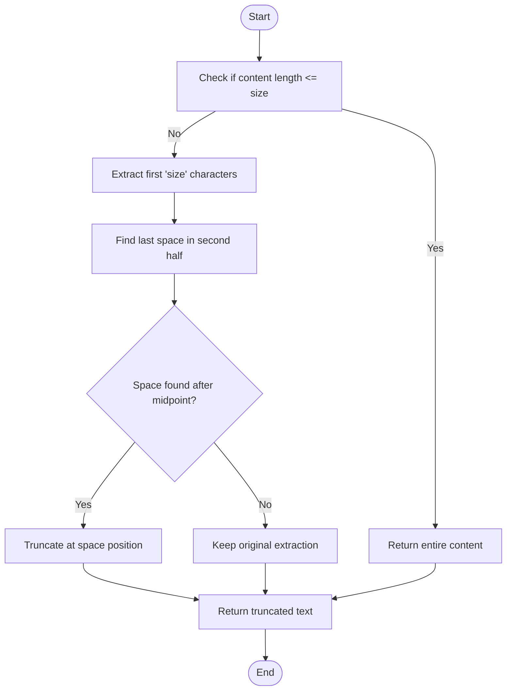
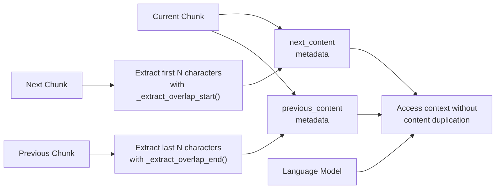

# Overlap Start Extraction

<cite>
**Referenced Files in This Document**   
- [chunker.py](file://src/chunkana/chunker.py#L401-L429)
- [config.py](file://src/chunkana/config.py#L125)
- [types.py](file://src/chunkana/types.py#L283-L286)
</cite>

## Table of Contents
1. [Introduction](#introduction)
2. [Algorithm Overview](#algorithm-overview)
3. [Word Boundary Preservation](#word-boundary-preservation)
4. [Practical Examples](#practical-examples)
5. [Relationship to Overlap Strategy](#relationship-to-overlap-strategy)
6. [Impact on Language Model Comprehension](#impact-on-language-model-comprehension)

## Introduction
The `_extract_overlap_start()` method is a critical component in the chunking pipeline responsible for extracting text from the beginning of a chunk's content for use in the `next_content` metadata field. This function ensures that adjacent chunks maintain contextual continuity while preserving word boundaries to enhance readability and comprehension. The method is specifically designed to work within the broader overlap management system, where context from neighboring chunks is stored in metadata fields without duplicating content in the actual chunk text.

The function plays a vital role in maintaining semantic coherence across chunk boundaries, particularly when processing text for language models. By extracting preview text from the next chunk and storing it in metadata, the system enables downstream applications to understand the context surrounding each chunk without creating redundant content or bloating indexes.

**Section sources**
- [chunker.py](file://src/chunkana/chunker.py#L401-L429)

## Algorithm Overview
The `_extract_overlap_start()` method implements a two-step algorithm to extract text from the beginning of a chunk while respecting word boundaries. The process begins by checking if the content length is less than or equal to the specified size parameter. When this condition is met, the entire content is returned as the overlap text, ensuring that small chunks are preserved in their entirety.

When the content exceeds the specified size, the algorithm first extracts the initial 'size' characters from the content. It then attempts to refine this extraction by finding a suitable word boundary within the second half of the extracted text. This is accomplished using Python's `rfind(" ")` method to locate the last space character in the extracted portion. If a space is found beyond the midpoint of the extracted text, the algorithm truncates the text at that position, effectively ending the overlap at a word boundary rather than splitting a word.

The size parameter used in this function is adaptive, determined by the minimum of the configured `overlap_size` and a calculated maximum based on the chunk size multiplied by the `overlap_cap_ratio` (default 0.35). This adaptive approach ensures that the overlap size scales appropriately with the chunk size while preventing excessive overlap that could lead to index bloat.

**Diagram sources **
- [chunker.py](file://src/chunkana/chunker.py#L419-L428)

**Section sources**
- [chunker.py](file://src/chunkana/chunker.py#L401-L429)
- [config.py](file://src/chunkana/config.py#L125)

## Word Boundary Preservation
The word boundary preservation mechanism in `_extract_overlap_start()` is essential for maintaining readability and semantic integrity at chunk boundaries. The algorithm specifically targets the second half of the initially extracted text when searching for a terminating space character. This strategic approach balances the need to preserve as much context as possible while avoiding the fragmentation of words.

By focusing on the second half of the extracted text, the algorithm ensures that a reasonable amount of content is preserved before attempting to find a word boundary. This prevents premature truncation that might occur if the search were conducted across the entire extracted portion. The condition `space_pos > len(text) // 2` guarantees that the algorithm only considers spaces that appear after the midpoint, maintaining a minimum threshold of contextual information.

This approach is particularly effective in preventing the splitting of compound words, technical terms, or proper nouns that might span multiple characters. For example, when processing technical documentation containing terms like "machinelearning" or "data-processing", the algorithm will avoid breaking these terms across chunk boundaries, preserving their semantic meaning. The word boundary preservation also enhances the tokenization process for language models, as tokens are more likely to represent complete words rather than partial fragments.

**Section sources**
- [chunker.py](file://src/chunkana/chunker.py#L424-L427)

## Practical Examples
Consider a scenario where the `_extract_overlap_start()` method processes a chunk with the content "The quick brown fox jumps over the lazy dog" with a size parameter of 20 characters. The algorithm first extracts the initial 20 characters: "The quick brown fox j". It then searches for the last space in the second half of this extraction (characters 10-20: "brown fox j"). Finding a space after "brown", the algorithm truncates the text at this position, resulting in "The quick brown" as the overlap text.

In another example, when processing a code comment like "// Initialize the database connection and configure parameters" with a size of 30, the initial extraction yields "// Initialize the database con". The algorithm searches for the last space in the second half and finds it after "database", returning "// Initialize the database" as the overlap text. This preserves the complete phrase while avoiding the split of "connection" across chunks.

For shorter content that is equal to or smaller than the size parameter, such as "Hello world" with a size of 15, the entire content "Hello world" is returned. This ensures that small but complete thoughts or phrases are preserved in their entirety within the overlap context.

These examples demonstrate how the algorithm adapts to different text types and lengths, consistently prioritizing word boundary preservation while maximizing the amount of contextual information provided to downstream processes.

**Section sources**
- [chunker.py](file://src/chunkana/chunker.py#L419-L428)

## Relationship to Overlap Strategy
The `_extract_overlap_start()` method is an integral component of the overall overlap strategy implemented in the chunking pipeline. It works in conjunction with the `_extract_overlap_end()` method to create bidirectional context between adjacent chunks, with `_extract_overlap_start()` specifically responsible for generating the `next_content` metadata field. This metadata, along with `previous_content`, enables applications to understand the context surrounding each chunk without duplicating content in the chunk text itself.

The overlap strategy follows a metadata-only approach, where context from neighboring chunks is stored in metadata fields rather than being physically duplicated in the chunk content. This design prevents index bloat and avoids semantic search confusion that could arise from duplicated text. The `overlap_size` parameter, typically set to 200 characters by default, determines the base context window size, while the `overlap_cap_ratio` (default 0.35) ensures that the overlap scales appropriately with chunk size.

The `_apply_overlap()` method orchestrates the entire overlap process, calling `_extract_overlap_start()` for each chunk's next content and `_extract_overlap_end()` for previous content. This systematic approach ensures consistent context extraction across all chunks in a document. The adaptive nature of the overlap size, calculated as the minimum of the configured `overlap_size` and the chunk size multiplied by `overlap_cap_ratio`, allows the system to handle documents with varying content densities and structures effectively.

**Diagram sources **
- [chunker.py](file://src/chunkana/chunker.py#L345-L368)

**Section sources**
- [chunker.py](file://src/chunkana/chunker.py#L301-L369)

## Impact on Language Model Comprehension
The `_extract_overlap_start()` method significantly enhances language model comprehension by providing contextual continuity across chunk boundaries. By preserving word boundaries and avoiding the splitting of words, the function ensures that tokens presented to language models represent complete linguistic units rather than fragmented pieces. This improves tokenization accuracy and allows models to better understand the semantic meaning of the text.

The preservation of complete words and phrases in the overlap context enables language models to maintain context when processing sequential chunks. This is particularly important for understanding pronouns, technical terms, and proper nouns that derive their meaning from surrounding context. For example, when a model encounters the phrase "the algorithm" in one chunk and "performs optimally" in the next, the overlap context containing "the algorithm" allows the model to correctly associate the pronoun with its antecedent.

Furthermore, the metadata-only overlap approach prevents the confusion that can arise from duplicated content in search indexes or retrieval systems. By keeping the actual chunk content distinct and non-overlapping while providing context through metadata, the system maintains clean separation between chunks while still enabling contextual understanding. This approach supports more accurate semantic search and retrieval, as each chunk represents a unique segment of content without redundancy.

The adaptive nature of the overlap size, which scales with chunk size, ensures that larger chunks receive proportionally more context, maintaining a balanced relationship between content and context across documents of varying complexity and density.

**Section sources**
- [types.py](file://src/chunkana/types.py#L283-L286)
- [chunker.py](file://src/chunkana/chunker.py#L314-L334)