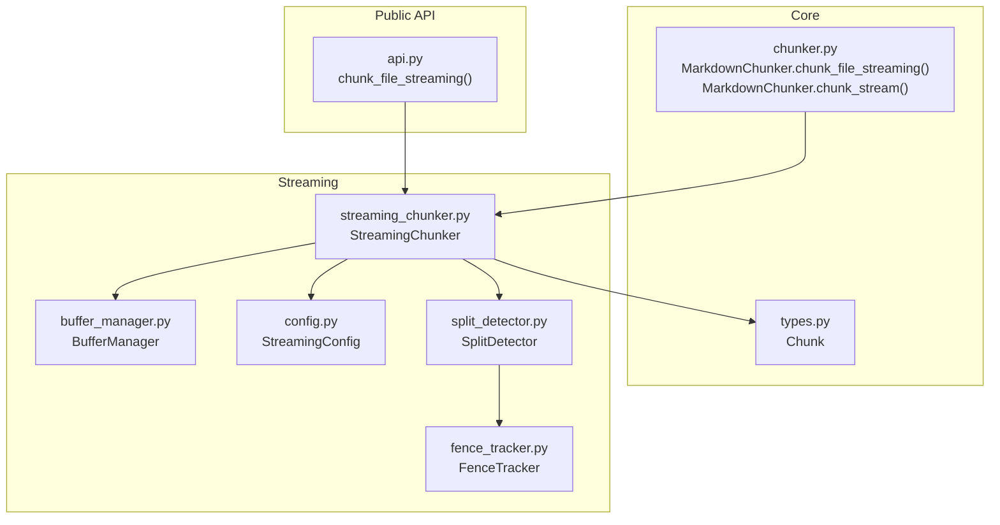
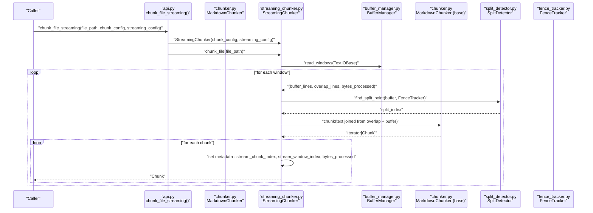
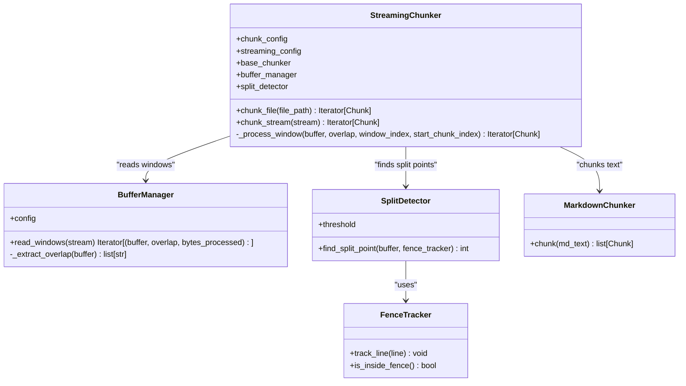
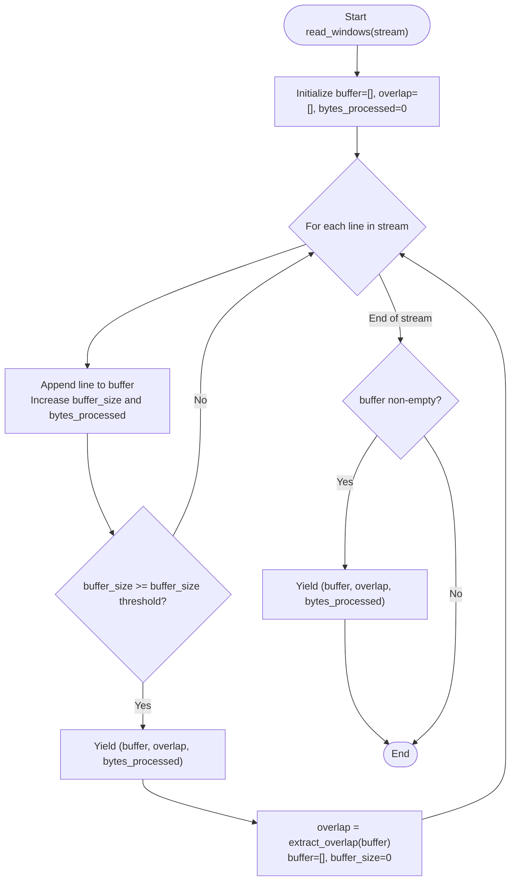
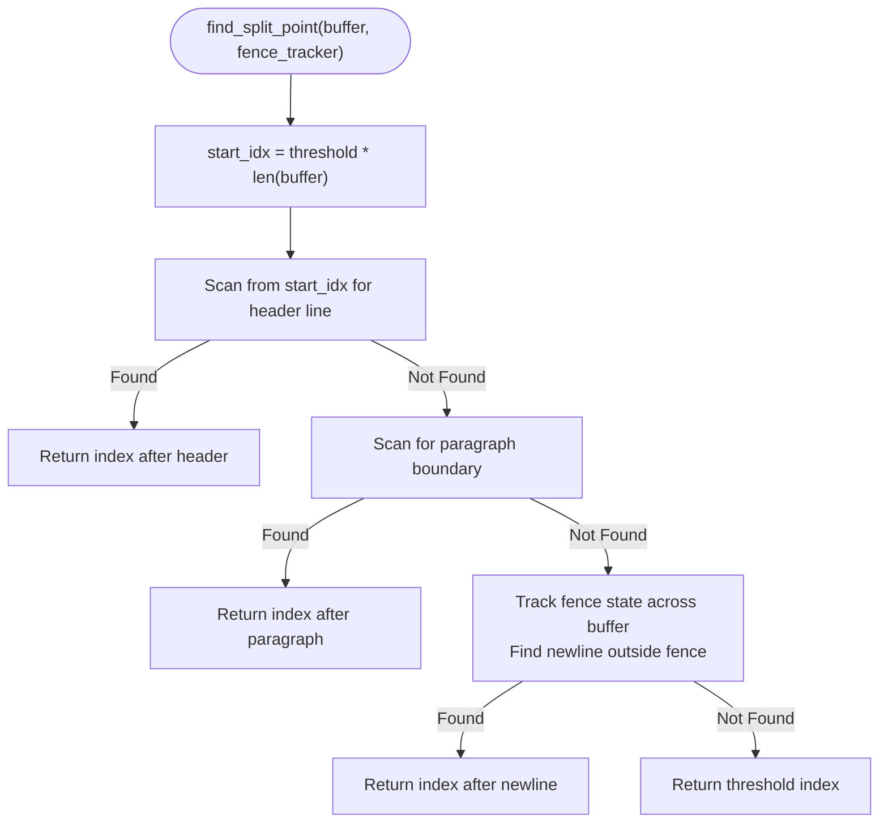
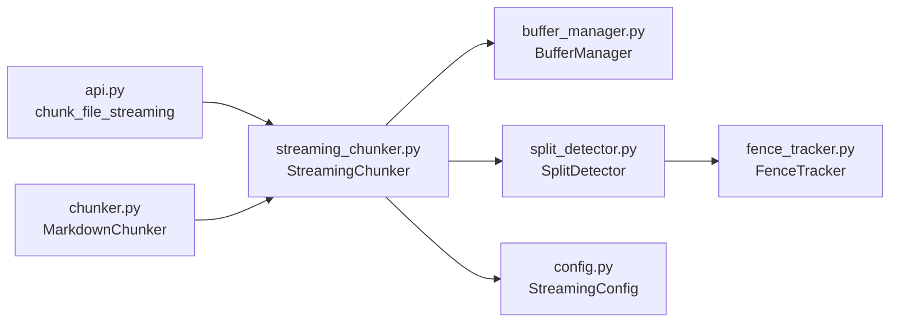

# Streaming Processing

<cite>
**Referenced Files in This Document**
- [README.md](file://README.md)
- [chunker.py](file://src/chunkana/chunker.py)
- [api.py](file://src/chunkana/api.py)
- [streaming_chunker.py](file://src/chunkana/streaming/streaming_chunker.py)
- [buffer_manager.py](file://src/chunkana/streaming/buffer_manager.py)
- [config.py](file://src/chunkana/streaming/config.py)
- [split_detector.py](file://src/chunkana/streaming/split_detector.py)
- [fence_tracker.py](file://src/chunkana/streaming/fence_tracker.py)
- [test_streaming.py](file://tests/unit/test_streaming.py)
- [test_performance_regression.py](file://tests/performance/test_performance_regression.py)
</cite>

## Table of Contents
1. [Introduction](#introduction)
2. [Project Structure](#project-structure)
3. [Core Components](#core-components)
4. [Architecture Overview](#architecture-overview)
5. [Detailed Component Analysis](#detailed-component-analysis)
6. [Dependency Analysis](#dependency-analysis)
7. [Performance Considerations](#performance-considerations)
8. [Troubleshooting Guide](#troubleshooting-guide)
9. [Conclusion](#conclusion)

## Introduction
This document explains the streaming processing capabilities for large Markdown files using chunk_file_streaming() and chunk_stream() methods. It focuses on memory efficiency, iterator-based yields, delegation to StreamingChunker, streaming metadata, buffer management, backpressure considerations, and performance characteristics. It also provides examples for file path and stream handling and outlines how streaming compares to in-memory processing.

## Project Structure
Streaming chunking is implemented under the streaming package and integrates with the main MarkdownChunker. Public APIs expose convenience functions for streaming chunking.

**Diagram sources**
- [api.py](file://src/chunkana/api.py#L228-L271)
- [chunker.py](file://src/chunkana/chunker.py#L249-L300)
- [streaming_chunker.py](file://src/chunkana/streaming/streaming_chunker.py#L18-L99)
- [buffer_manager.py](file://src/chunkana/streaming/buffer_manager.py#L13-L62)
- [config.py](file://src/chunkana/streaming/config.py#L8-L24)
- [split_detector.py](file://src/chunkana/streaming/split_detector.py#L10-L93)
- [fence_tracker.py](file://src/chunkana/streaming/fence_tracker.py#L10-L65)
- [types.py](file://src/chunkana/types.py#L1-L200)

**Section sources**
- [README.md](file://README.md#L1-L179)
- [api.py](file://src/chunkana/api.py#L228-L271)
- [chunker.py](file://src/chunkana/chunker.py#L249-L300)

## Core Components
- StreamingChunker orchestrates streaming: it reads windows from a stream, delegates to the base MarkdownChunker for chunking, and enriches each yielded Chunk with streaming metadata.
- BufferManager divides the input stream into fixed-size windows and maintains overlap between consecutive windows.
- SplitDetector identifies safe split points within a buffer window to avoid splitting atomic blocks.
- FenceTracker tracks fenced code block boundaries across windows to prevent mid-fence splits.
- StreamingConfig defines buffer size, overlap lines, and thresholds for safe splitting.

Key streaming metadata added to each Chunk:
- stream_chunk_index: monotonically increasing index across all yielded chunks
- stream_window_index: window number for the chunk’s origin
- bytes_processed: cumulative byte count processed so far

These fields support incremental processing and diagnostics.

**Section sources**
- [streaming_chunker.py](file://src/chunkana/streaming/streaming_chunker.py#L18-L99)
- [buffer_manager.py](file://src/chunkana/streaming/buffer_manager.py#L13-L62)
- [split_detector.py](file://src/chunkana/streaming/split_detector.py#L10-L93)
- [fence_tracker.py](file://src/chunkana/streaming/fence_tracker.py#L10-L65)
- [config.py](file://src/chunkana/streaming/config.py#L8-L24)
- [test_streaming.py](file://tests/unit/test_streaming.py#L344-L360)

## Architecture Overview
The streaming pipeline is an iterator-based, memory-efficient flow that processes input in windowed chunks.

**Diagram sources**
- [api.py](file://src/chunkana/api.py#L228-L271)
- [chunker.py](file://src/chunkana/chunker.py#L249-L300)
- [streaming_chunker.py](file://src/chunkana/streaming/streaming_chunker.py#L43-L99)
- [buffer_manager.py](file://src/chunkana/streaming/buffer_manager.py#L29-L55)
- [split_detector.py](file://src/chunkana/streaming/split_detector.py#L26-L62)
- [fence_tracker.py](file://src/chunkana/streaming/fence_tracker.py#L10-L65)

## Detailed Component Analysis

### StreamingChunker
Responsibilities:
- Delegates to BufferManager to read windows from a stream
- Uses SplitDetector to compute safe split points within each window
- Calls the base MarkdownChunker to chunk the combined overlap + buffer text
- Yields Chunks with streaming metadata

Iterator-based yield pattern:
- chunk_file(file_path) opens a UTF-8 file and delegates to chunk_stream(stream)
- chunk_stream(stream) iterates over windows and yields each Chunk immediately

Streaming metadata:
- stream_chunk_index: increments per yielded chunk
- stream_window_index: increments per window consumed
- bytes_processed: cumulative bytes processed across windows

**Diagram sources**
- [streaming_chunker.py](file://src/chunkana/streaming/streaming_chunker.py#L18-L99)
- [buffer_manager.py](file://src/chunkana/streaming/buffer_manager.py#L13-L62)
- [split_detector.py](file://src/chunkana/streaming/split_detector.py#L10-L93)
- [fence_tracker.py](file://src/chunkana/streaming/fence_tracker.py#L10-L65)
- [chunker.py](file://src/chunkana/chunker.py#L85-L177)

**Section sources**
- [streaming_chunker.py](file://src/chunkana/streaming/streaming_chunker.py#L43-L99)
- [test_streaming.py](file://tests/unit/test_streaming.py#L133-L149)

### BufferManager
Responsibilities:
- Reads lines from a TextIOBase stream
- Accumulates lines until buffer_size threshold is reached
- Emits (buffer, overlap, bytes_processed) tuples
- Maintains overlap_lines from the end of the previous buffer for context

Overlap strategy:
- Extracts the last overlap_lines lines from the previous buffer to prepend to the next window

**Diagram sources**
- [buffer_manager.py](file://src/chunkana/streaming/buffer_manager.py#L29-L55)

**Section sources**
- [buffer_manager.py](file://src/chunkana/streaming/buffer_manager.py#L29-L55)
- [test_streaming.py](file://tests/unit/test_streaming.py#L174-L212)

### SplitDetector and FenceTracker
SplitDetector prioritizes semantic boundaries:
- Header boundary (line before a header)
- Paragraph boundary (empty line separating paragraphs)
- Newline outside fences (respects FenceTracker state)
- Fallback to threshold position

FenceTracker maintains a stack of open fences to avoid splitting mid-code-block.

**Diagram sources**
- [split_detector.py](file://src/chunkana/streaming/split_detector.py#L26-L62)
- [fence_tracker.py](file://src/chunkana/streaming/fence_tracker.py#L10-L65)

**Section sources**
- [split_detector.py](file://src/chunkana/streaming/split_detector.py#L26-L62)
- [fence_tracker.py](file://src/chunkana/streaming/fence_tracker.py#L10-L65)
- [test_streaming.py](file://tests/unit/test_streaming.py#L233-L288)

### Public Streaming APIs
- chunk_file_streaming(file_path, chunk_config, streaming_config, encoding) yields Chunks for large files
- MarkdownChunker.chunk_file_streaming(file_path, streaming_config) and MarkdownChunker.chunk_stream(stream, streaming_config) provide programmatic streaming

Examples:
- File path processing: open file, pass to StreamingChunker.chunk_file
- Stream handling: pass any io.TextIOBase stream (e.g., io.StringIO) to StreamingChunker.chunk_stream

**Section sources**
- [api.py](file://src/chunkana/api.py#L228-L271)
- [chunker.py](file://src/chunkana/chunker.py#L249-L300)
- [test_streaming.py](file://tests/unit/test_streaming.py#L118-L132)

## Dependency Analysis
- StreamingChunker depends on:
  - BufferManager for windowed IO
  - SplitDetector and FenceTracker for safe split points
  - MarkdownChunker for semantic chunking
- Public API and MarkdownChunker both construct StreamingChunker with shared configuration

**Diagram sources**
- [api.py](file://src/chunkana/api.py#L228-L271)
- [chunker.py](file://src/chunkana/chunker.py#L249-L300)
- [streaming_chunker.py](file://src/chunkana/streaming/streaming_chunker.py#L18-L42)
- [buffer_manager.py](file://src/chunkana/streaming/buffer_manager.py#L13-L28)
- [split_detector.py](file://src/chunkana/streaming/split_detector.py#L10-L25)
- [fence_tracker.py](file://src/chunkana/streaming/fence_tracker.py#L10-L21)
- [config.py](file://src/chunkana/streaming/config.py#L8-L24)

**Section sources**
- [streaming_chunker.py](file://src/chunkana/streaming/streaming_chunker.py#L18-L42)
- [buffer_manager.py](file://src/chunkana/streaming/buffer_manager.py#L13-L28)
- [split_detector.py](file://src/chunkana/streaming/split_detector.py#L10-L25)
- [fence_tracker.py](file://src/chunkana/streaming/fence_tracker.py#L10-L21)
- [config.py](file://src/chunkana/streaming/config.py#L8-L24)

## Performance Considerations
- Memory efficiency: StreamingChunker keeps memory usage bounded by buffer_size and overlap_lines, yielding chunks incrementally to avoid loading entire files into memory.
- Backpressure: The iterator-based design naturally applies backpressure—consumers process chunks one at a time, limiting peak memory.
- Throughput: Window size and overlap influence throughput. Larger buffer_size reduces IO overhead but increases memory footprint; larger overlap_lines improves chunk continuity at the cost of recomputation.
- Safe split thresholds: safe_split_threshold controls where SplitDetector begins scanning for boundaries, balancing correctness and performance.
- Validation overhead: Streaming mode uses the same underlying chunking pipeline; validation can be toggled via ChunkConfig to reduce overhead when needed.

Benchmarking context:
- The repository includes performance tests that measure chunking time across small, medium, and large documents and validate linear scaling behavior. These tests illustrate the expected performance characteristics for in-memory chunking and can serve as a baseline when evaluating streaming performance.

**Section sources**
- [test_performance_regression.py](file://tests/performance/test_performance_regression.py#L213-L485)
- [config.py](file://src/chunkana/streaming/config.py#L8-L24)

## Troubleshooting Guide
Common issues and remedies:
- Empty or whitespace-only streams: StreamingChunker skips empty windows and yields no chunks. Verify input stream content.
- Unexpected chunk boundaries near fences: Adjust overlap_lines to ensure sufficient context across window boundaries; SplitDetector prefers semantic boundaries but falls back to threshold.
- Very small buffer_size causing excessive windows: Increase buffer_size to reduce IO overhead; ensure overlap_lines is set appropriately.
- Streaming metadata missing: Ensure you are using StreamingChunker via chunk_file_streaming or chunk_stream methods; metadata is added during chunk emission.

Verification via tests:
- StreamingConfig defaults and custom values
- BufferManager windowing behavior and overlap extraction
- SplitDetector split point detection and fallback
- Integration tests for large documents and code block preservation

**Section sources**
- [test_streaming.py](file://tests/unit/test_streaming.py#L17-L52)
- [test_streaming.py](file://tests/unit/test_streaming.py#L171-L232)
- [test_streaming.py](file://tests/unit/test_streaming.py#L233-L288)
- [test_streaming.py](file://tests/unit/test_streaming.py#L289-L360)

## Conclusion
Streaming chunking enables memory-efficient processing of large Markdown files by reading and chunking them in windowed fashion, preserving semantic boundaries and atomic blocks. The iterator-based design ensures low memory footprint and natural backpressure. Streaming metadata supports incremental processing and diagnostics. For large files (>10MB), prefer chunk_file_streaming or chunk_stream to avoid loading entire documents into memory. Performance tests provide a baseline for in-memory chunking; streaming adds IO overhead but maintains scalability and memory efficiency.