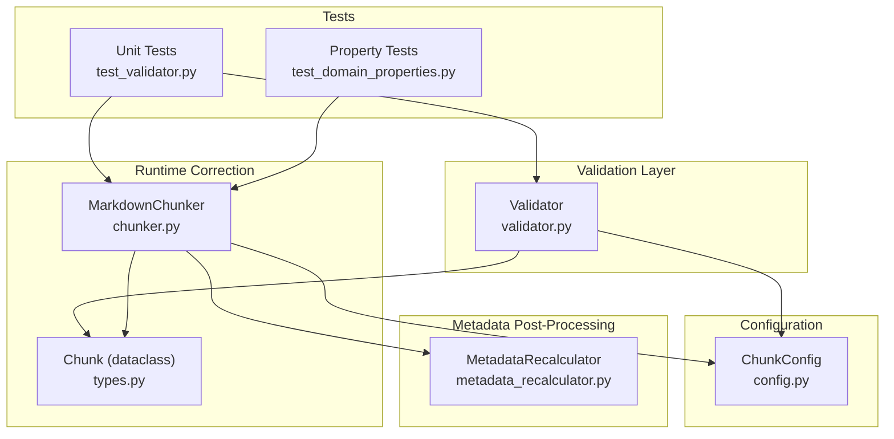
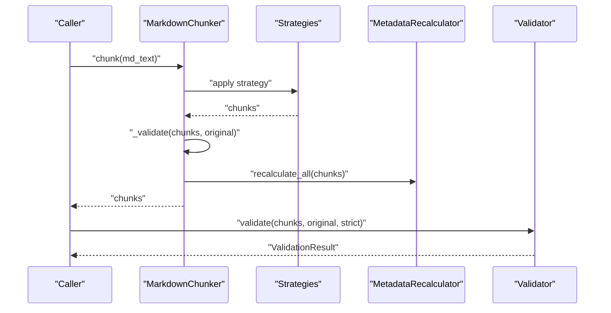
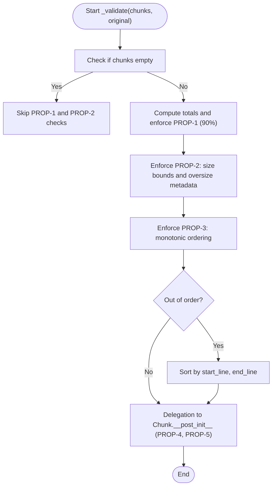
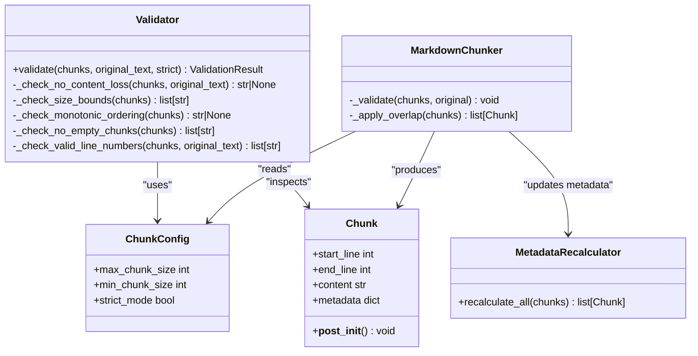

# Validation and Integrity

<cite>
**Referenced Files in This Document**
- [validator.py](file://src/chunkana/validator.py)
- [types.py](file://src/chunkana/types.py)
- [chunker.py](file://src/chunkana/chunker.py)
- [config.py](file://src/chunkana/config.py)
- [test_validator.py](file://tests/unit/test_validator.py)
- [test_domain_properties.py](file://tests/property/test_domain_properties.py)
- [metadata_recalculator.py](file://src/chunkana/metadata_recalculator.py)
</cite>

## Table of Contents
1. [Introduction](#introduction)
2. [Project Structure](#project-structure)
3. [Core Components](#core-components)
4. [Architecture Overview](#architecture-overview)
5. [Detailed Component Analysis](#detailed-component-analysis)
6. [Dependency Analysis](#dependency-analysis)
7. [Performance Considerations](#performance-considerations)
8. [Troubleshooting Guide](#troubleshooting-guide)
9. [Conclusion](#conclusion)

## Introduction
This document explains the validation and integrity mechanisms that ensure high-quality chunking. It focuses on the domain properties implemented by the validator and the chunker’s runtime corrections:
- PROP-1: Content preservation with a 90% threshold
- PROP-2: Size bounds enforcement with oversize metadata tagging
- PROP-3: Monotonic line ordering
- PROP-4 and PROP-5: Enforced by Chunk.__post_init__ during construction
- Automatic correction of out-of-order chunks and enrichment of oversized chunks with metadata (code_block_integrity, table_integrity)
- Guidance on strict_mode and its effect on validation failure handling
- Interpretation of validation results for debugging chunking issues

## Project Structure
The validation logic spans several modules:
- Validator: central validation engine for domain properties
- Chunker: applies runtime corrections and enriches metadata
- Types: defines Chunk and enforces basic invariants at construction
- Config: exposes strict_mode and other chunking parameters
- Tests: validate behavior and illustrate expected outcomes

**Diagram sources**
- [validator.py](file://src/chunkana/validator.py#L1-L221)
- [chunker.py](file://src/chunkana/chunker.py#L431-L470)
- [types.py](file://src/chunkana/types.py#L240-L375)
- [config.py](file://src/chunkana/config.py#L108-L110)
- [metadata_recalculator.py](file://src/chunkana/metadata_recalculator.py#L1-L161)
- [test_validator.py](file://tests/unit/test_validator.py#L1-L262)
- [test_domain_properties.py](file://tests/property/test_domain_properties.py#L1-L406)

**Section sources**
- [validator.py](file://src/chunkana/validator.py#L1-L221)
- [chunker.py](file://src/chunkana/chunker.py#L431-L470)
- [types.py](file://src/chunkana/types.py#L240-L375)
- [config.py](file://src/chunkana/config.py#L108-L110)
- [metadata_recalculator.py](file://src/chunkana/metadata_recalculator.py#L1-L161)
- [test_validator.py](file://tests/unit/test_validator.py#L1-L262)
- [test_domain_properties.py](file://tests/property/test_domain_properties.py#L1-L406)

## Core Components
- Validator: Implements PROP-1 through PROP-5 and returns a consolidated result with errors and warnings. It respects strict mode to convert warnings into errors.
- Chunker: Applies runtime corrections:
  - Oversized chunks are automatically enriched with allow_oversize and oversize_reason metadata
  - Out-of-order chunks are corrected by sorting by start_line and end_line
- Chunk: Enforces invariants at construction (non-empty content, valid line ranges)
- MetadataRecalculator: Recomputes derived metadata after post-processing (e.g., section_tags) to keep metadata consistent

**Section sources**
- [validator.py](file://src/chunkana/validator.py#L47-L91)
- [chunker.py](file://src/chunkana/chunker.py#L431-L470)
- [types.py](file://src/chunkana/types.py#L297-L307)
- [metadata_recalculator.py](file://src/chunkana/metadata_recalculator.py#L33-L72)

## Architecture Overview
The validation and integrity pipeline integrates at two stages:
- During chunking: runtime corrections and metadata enrichment
- After chunking: formal validation against domain properties

**Diagram sources**
- [chunker.py](file://src/chunkana/chunker.py#L146-L176)
- [chunker.py](file://src/chunkana/chunker.py#L431-L470)
- [metadata_recalculator.py](file://src/chunkana/metadata_recalculator.py#L33-L48)
- [validator.py](file://src/chunkana/validator.py#L47-L91)

## Detailed Component Analysis

### Validator: Domain Properties and Results
- PROP-1: Content preservation
  - Checks that total output length is at least 90% of the original length. This is a relaxed check designed to tolerate overlap and whitespace normalization differences.
  - The validator reports this as a warning by default; when strict is True, warnings become errors.
- PROP-2: Size bounds
  - Enforces max_chunk_size. Chunks exceeding the limit must be marked allow_oversize. The validator verifies oversize_reason is one of code_block_integrity, table_integrity, or section_integrity.
- PROP-3: Monotonic ordering
  - Enforces non-decreasing start_line across chunks. If violated, the validator records an error.
- PROP-4: No empty chunks
  - Enforced by Chunk.__post_init__; validator aggregates errors from this constraint.
- PROP-5: Valid line numbers
  - Enforces start_line >= 1, end_line >= start_line, and end_line <= total_lines. Validator aggregates errors from this constraint.

ValidationResult encapsulates is_valid, errors, and warnings. The validate method returns early with errors if any are found; otherwise, it returns success with potential warnings.

**Section sources**
- [validator.py](file://src/chunkana/validator.py#L47-L91)
- [validator.py](file://src/chunkana/validator.py#L93-L114)
- [validator.py](file://src/chunkana/validator.py#L115-L142)
- [validator.py](file://src/chunkana/validator.py#L144-L158)
- [validator.py](file://src/chunkana/validator.py#L159-L198)

### Runtime Corrections in MarkdownChunker
- Oversized chunks enrichment
  - If a chunk exceeds max_chunk_size and lacks allow_oversize, the chunker sets allow_oversize=True and infers oversize_reason:
    - code_block_integrity if the chunk contains fenced code markers
    - table_integrity if the chunk contains table-like content
    - section_integrity otherwise
- Monotonic ordering correction
  - If any chunk precedes another with a lower start_line, the chunker sorts the chunks by start_line and end_line once to restore order.
- Delegation to Chunk.__post_init__
  - PROP-4 and PROP-5 are enforced by Chunk.__post_init__ at construction time. The validator aggregates errors from these constraints.

**Diagram sources**
- [chunker.py](file://src/chunkana/chunker.py#L431-L470)
- [types.py](file://src/chunkana/types.py#L297-L307)

**Section sources**
- [chunker.py](file://src/chunkana/chunker.py#L431-L470)
- [types.py](file://src/chunkana/types.py#L297-L307)

### Oversize Metadata Enrichment Details
- allow_oversize: Boolean flag indicating intentional oversizing
- oversize_reason: One of code_block_integrity, table_integrity, section_integrity
- Detection heuristics:
  - code_block_integrity: presence of fenced code markers
  - table_integrity: presence of table-like content
  - section_integrity: fallback when neither code nor table markers are detected

These metadata fields are validated by the validator to ensure consistency.

**Section sources**
- [chunker.py](file://src/chunkana/chunker.py#L450-L460)
- [validator.py](file://src/chunkana/validator.py#L133-L140)

### Strict Mode and Failure Handling
- strict_mode (configuration)
  - Controls whether validation warnings are treated as errors. When strict_mode is True, the chunker raises exceptions on validation failures.
- strict parameter in validate_chunks
  - When True, warnings from the validator are elevated to errors; when False, warnings are retained separately.

Practical impact:
- In non-strict mode, PROP-1 content loss may appear as a warning; in strict mode, it becomes an error.
- Oversized chunks without proper oversize_reason are reported as errors in strict mode.

**Section sources**
- [config.py](file://src/chunkana/config.py#L108-L110)
- [chunker.py](file://src/chunkana/chunker.py#L60-L64)
- [validator.py](file://src/chunkana/validator.py#L47-L91)

### Interpreting Validation Results
- is_valid: True if no errors; warnings do not invalidate the result unless strict mode is enabled
- errors: List of hard failures (e.g., ordering violations, invalid line numbers, invalid oversize reasons)
- warnings: List of soft failures (e.g., content loss below threshold)

Guidance:
- If PROP-1 warning appears, inspect overlap and whitespace normalization effects; adjust overlap_size or review strategy if content is truly missing.
- If PROP-2 errors occur, ensure allow_oversize is set and oversize_reason is one of the allowed values.
- If PROP-3 errors occur, verify that monotonic ordering is restored by the chunker or adjust the chunking pipeline.
- If PROP-4/PROP-5 errors occur, ensure Chunk.__post_init__ constraints are satisfied (non-empty content, valid line ranges).

**Section sources**
- [validator.py](file://src/chunkana/validator.py#L15-L30)
- [validator.py](file://src/chunkana/validator.py#L159-L198)
- [types.py](file://src/chunkana/types.py#L297-L307)

### Examples: Validation Warnings and Their Interpretation
- Content loss warning (PROP-1)
  - Occurs when total output is below 90% of original length. This often indicates overlap or normalization differences. In strict mode, this becomes an error.
  - See test coverage demonstrating detection of content loss and strict mode behavior.
- Oversized chunk without proper metadata (PROP-2)
  - Occurs when a chunk exceeds max_chunk_size without allow_oversize or with an invalid oversize_reason. The chunker enriches metadata automatically; validator enforces consistency.
- Out-of-order chunks (PROP-3)
  - Occurs when start_line decreases between consecutive chunks. The chunker sorts once to fix; if still failing, investigate the chunking pipeline.

**Section sources**
- [test_validator.py](file://tests/unit/test_validator.py#L40-L71)
- [test_validator.py](file://tests/unit/test_validator.py#L193-L209)
- [test_domain_properties.py](file://tests/property/test_domain_properties.py#L135-L174)

## Dependency Analysis
- Validator depends on ChunkConfig for size thresholds and Chunk for metadata inspection.
- Chunker applies runtime corrections and delegates PROP-4/PROP-5 to Chunk.__post_init__.
- MetadataRecalculator recomputes derived metadata after post-processing to keep metadata consistent.

**Diagram sources**
- [validator.py](file://src/chunkana/validator.py#L47-L221)
- [chunker.py](file://src/chunkana/chunker.py#L431-L470)
- [types.py](file://src/chunkana/types.py#L240-L375)
- [config.py](file://src/chunkana/config.py#L77-L126)
- [metadata_recalculator.py](file://src/chunkana/metadata_recalculator.py#L33-L72)

**Section sources**
- [validator.py](file://src/chunkana/validator.py#L47-L221)
- [chunker.py](file://src/chunkana/chunker.py#L431-L470)
- [types.py](file://src/chunkana/types.py#L240-L375)
- [config.py](file://src/chunkana/config.py#L77-L126)
- [metadata_recalculator.py](file://src/chunkana/metadata_recalculator.py#L33-L72)

## Performance Considerations
- Validation is linear in the number of chunks and constant-time per chunk for most checks.
- Sorting to fix monotonic ordering occurs once and is bounded by O(n log n) for n chunks.
- Oversize metadata enrichment is linear in the number of oversized chunks.

[No sources needed since this section provides general guidance]

## Troubleshooting Guide
Common issues and resolutions:
- Content loss warning
  - Verify overlap and normalization effects; adjust overlap_size or strategy if content is truly missing.
- Oversized chunk errors
  - Ensure allow_oversize is set and oversize_reason is one of code_block_integrity, table_integrity, or section_integrity.
- Ordering errors
  - Confirm monotonic ordering; if still failing, inspect the chunking pipeline for custom transformations.
- Empty chunk or invalid line number errors
  - Ensure Chunk.__post_init__ constraints are satisfied; verify start_line >= 1, end_line >= start_line, and non-empty content.

Debugging tips:
- Use strict mode to surface warnings as errors for stricter validation.
- Inspect chunk.metadata for allow_oversize and oversize_reason to confirm runtime enrichment.
- Review MetadataRecalculator outputs for section_tags consistency after post-processing.

**Section sources**
- [validator.py](file://src/chunkana/validator.py#L47-L91)
- [validator.py](file://src/chunkana/validator.py#L115-L142)
- [validator.py](file://src/chunkana/validator.py#L144-L158)
- [validator.py](file://src/chunkana/validator.py#L159-L198)
- [types.py](file://src/chunkana/types.py#L297-L307)
- [metadata_recalculator.py](file://src/chunkana/metadata_recalculator.py#L101-L134)

## Conclusion
The validation and integrity system ensures high-quality chunking through:
- Formal domain property checks (PROP-1–PROP-5)
- Runtime corrections (oversize enrichment and ordering fix)
- Strict mode for stricter validation behavior
- Derived metadata consistency via post-processing

By interpreting validation results and leveraging strict mode, users can debug chunking issues effectively and maintain reliable chunking quality.