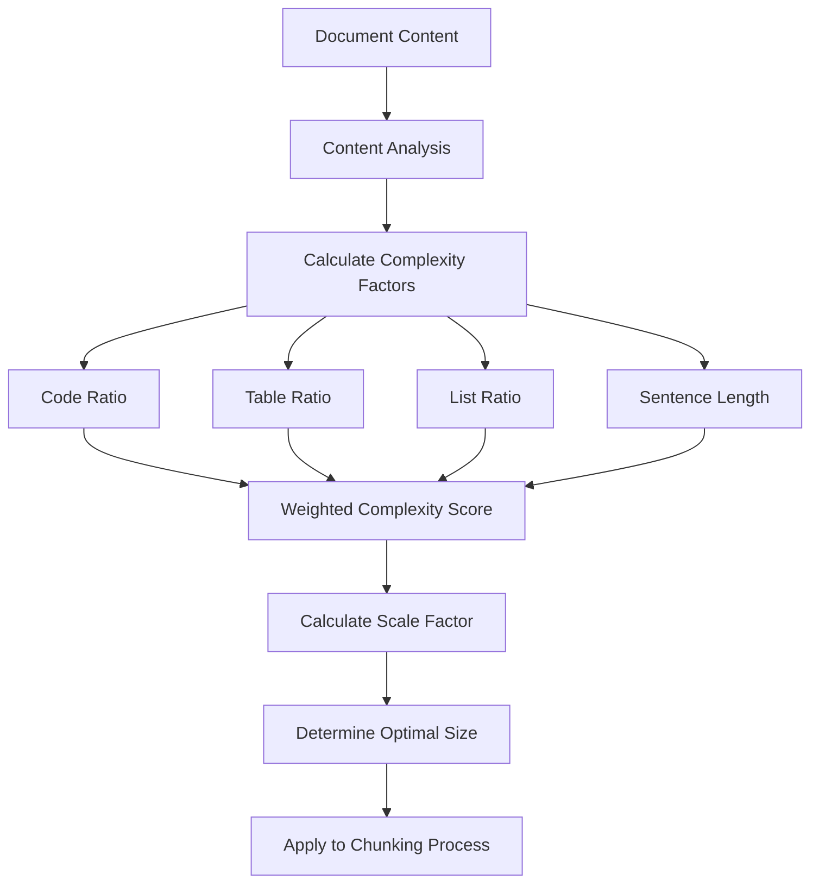
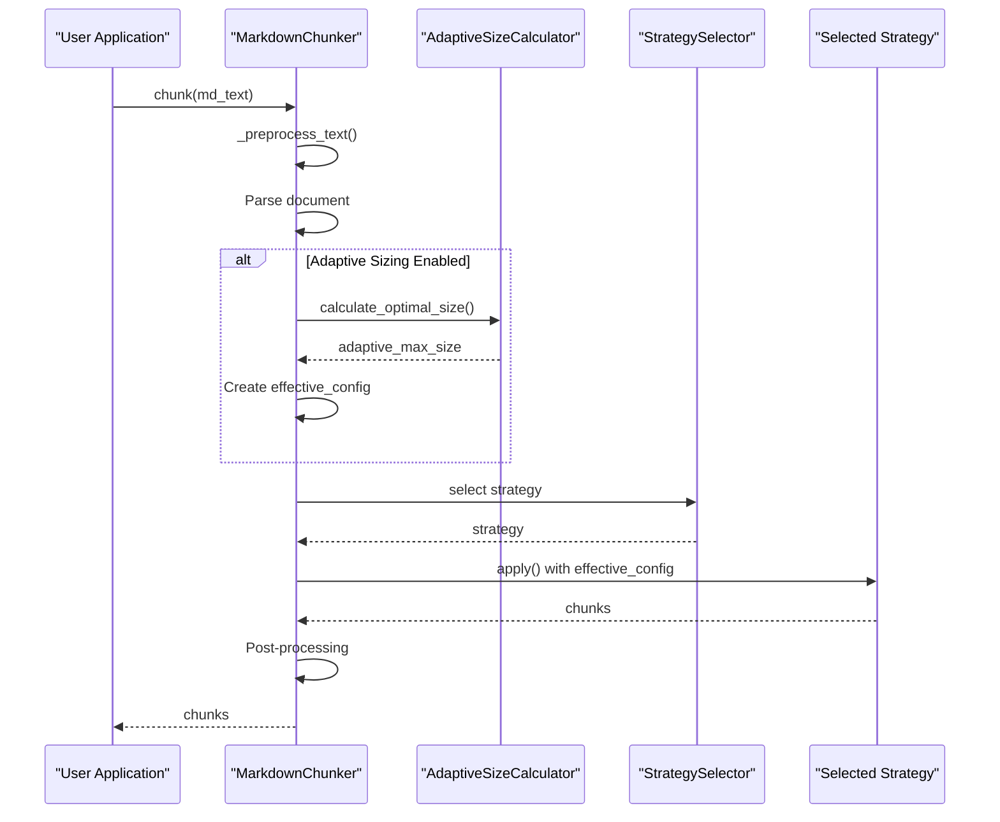

# Adaptive Sizing

<cite>
**Referenced Files in This Document**   
- [adaptive_sizing.py](file://src/chunkana/adaptive_sizing.py)
- [config.py](file://src/chunkana/config.py)
- [chunker.py](file://src/chunkana/chunker.py)
- [strategies/code_aware.py](file://src/chunkana/strategies/code_aware.py)
- [strategies/list_aware.py](file://src/chunkana/strategies/list_aware.py)
- [strategies/structural.py](file://src/chunkana/strategies/structural.py)
- [types.py](file://src/chunkana/types.py)
- [docs/config.md](file://docs/config.md)
- [tests/baseline/fixtures/adaptive_sizing.md](file://tests/baseline/fixtures/adaptive_sizing.md)
</cite>

## Table of Contents
1. [Introduction](#introduction)
2. [Adaptive Sizing Algorithm](#adaptive-sizing-algorithm)
3. [Content Analysis for Adaptive Sizing](#content-analysis-for-adaptive-sizing)
4. [Configuration Parameters](#configuration-parameters)
5. [Integration with Chunking Strategies](#integration-with-chunking-strategies)
6. [Fixed-Size vs Adaptive Chunking Comparison](#fixed-size-vs-adaptive-chunking-comparison)
7. [Performance Implications](#performance-implications)
8. [Tuning Recommendations](#tuning-recommendations)
9. [Conclusion](#conclusion)

## Introduction

Chunkana's adaptive sizing feature dynamically adjusts chunk boundaries based on content density and structure, optimizing for both size constraints and semantic coherence. Unlike fixed-size chunking, this approach analyzes the content characteristics of potential chunks and adjusts split points accordingly. The system evaluates various content types including text, code, lists, and tables to determine optimal chunk sizes that preserve meaningful content units while respecting size limits.

The adaptive sizing mechanism works in conjunction with Chunkana's strategy-based chunking system, where different strategies (code_aware, list_aware, structural) are selected based on document characteristics. When enabled, adaptive sizing modifies the effective chunk size parameters used by these strategies, allowing for larger chunks in complex content areas and smaller chunks in simpler text regions.

**Section sources**
- [adaptive_sizing.py](file://src/chunkana/adaptive_sizing.py#L1-L197)
- [config.py](file://src/chunkana/config.py#L1-L507)

## Adaptive Sizing Algorithm

The adaptive sizing algorithm in Chunkana calculates optimal chunk sizes through a multi-factor complexity assessment. The core algorithm, implemented in the `AdaptiveSizeCalculator` class, computes a complexity score based on several content characteristics and uses this score to determine an appropriate chunk size.

The algorithm follows these steps:

1. **Complexity Score Calculation**: The system calculates a content complexity score between 0.0 and 1.0 by analyzing multiple content factors:
   - Code ratio: Proportion of code content in the document
   - Table ratio: Proportion of table content in the document
   - List ratio: Proportion of list content in the document
   - Average sentence length: Indicator of text complexity

2. **Weighted Combination**: Each factor is assigned a configurable weight, and the complexity score is computed as a weighted sum of these normalized factors. The weights must sum to 1.0 to ensure proper scaling.

3. **Scale Factor Determination**: The complexity score is converted to a scale factor that ranges between the configured minimum and maximum scale values. This creates a linear mapping from complexity to size adjustment.

4. **Optimal Size Calculation**: The final chunk size is determined by multiplying the base size by the scale factor, with clamping to ensure it stays within the minimum and maximum bounds.

The algorithm ensures that content with higher complexity (such as code-heavy sections) receives larger chunk sizes to preserve context, while simpler text content is chunked more finely. This approach maintains semantic coherence by keeping related content together while still respecting the overall size constraints of the system.

**Diagram sources**
- [adaptive_sizing.py](file://src/chunkana/adaptive_sizing.py#L103-L181)

**Section sources**
- [adaptive_sizing.py](file://src/chunkana/adaptive_sizing.py#L103-L181)

## Content Analysis for Adaptive Sizing

The adaptive sizing system relies on comprehensive content analysis to determine optimal chunk sizes. The `ContentAnalysis` class provides the necessary metrics and extracted elements that inform the adaptive sizing calculations. This analysis occurs during the initial parsing phase and includes various content characteristics that influence the complexity score.

Key content analysis metrics used by the adaptive sizing algorithm include:

- **Code ratio**: The proportion of characters in code blocks relative to the total document size. This is a primary indicator of content complexity, as code typically requires more context to be meaningful.
- **Table ratio**: The proportion of characters in tables relative to the total document size. Tables often contain structured data that benefits from being kept intact.
- **List ratio**: The proportion of characters in lists relative to the total document size. Lists may indicate structured information that should be preserved.
- **Average sentence length**: A measure of text complexity, with longer sentences potentially indicating more complex content.

The content analysis also extracts structural elements such as code blocks, tables, lists, and headers, which are used not only for adaptive sizing but also for strategy selection and chunk boundary determination. This comprehensive analysis allows the system to make informed decisions about how to chunk different types of content appropriately.

The analysis process is optimized for performance by caching line arrays and other intermediate results, reducing redundant processing during the chunking pipeline. This ensures that the adaptive sizing calculations can be performed efficiently without significantly impacting overall processing time.

**Section sources**
- [types.py](file://src/chunkana/types.py#L181-L238)
- [adaptive_sizing.py](file://src/chunkana/adaptive_sizing.py#L120-L145)

## Configuration Parameters

Adaptive sizing in Chunkana is controlled by a set of configurable parameters that allow fine-tuning of the behavior to suit different content types and use cases. These parameters are defined in the `AdaptiveSizeConfig` class and can be customized through the main `ChunkConfig` object.

The key configuration parameters for adaptive sizing include:

| Parameter | Default Value | Description |
|---------|-------------|-------------|
| `base_size` | 1500 | Base chunk size for medium complexity content |
| `min_scale` | 0.5 | Minimum scaling factor (for simple text) |
| `max_scale` | 1.5 | Maximum scaling factor (for complex code) |
| `code_weight` | 0.4 | Weight for code ratio in complexity calculation |
| `table_weight` | 0.3 | Weight for table ratio in complexity calculation |
| `list_weight` | 0.2 | Weight for list ratio in complexity calculation |
| `sentence_length_weight` | 0.1 | Weight for sentence length in complexity calculation |

These parameters work together to determine how aggressively the system adjusts chunk sizes based on content characteristics. The weights control the relative importance of different content types in the complexity calculation, allowing users to prioritize certain content types over others.

The system includes validation to ensure that configuration parameters are reasonable:
- Base size must be positive
- Minimum and maximum scales must be positive, with minimum less than maximum
- All weights must be non-negative
- The sum of all weights must equal 1.0 (within a small tolerance)

Configuration can be applied through factory methods like `ChunkConfig.for_code_heavy_adaptive()` and `ChunkConfig.for_text_heavy_adaptive()`, which provide optimized settings for specific content types, or customized directly for specific use cases.

**Section sources**
- [adaptive_sizing.py](file://src/chunkana/adaptive_sizing.py#L14-L75)
- [config.py](file://src/chunkana/config.py#L103-L106)
- [docs/config.md](file://docs/config.md#L38-L56)

## Integration with Chunking Strategies

Adaptive sizing works in conjunction with Chunkana's strategy-based chunking system, where different strategies are selected based on document characteristics. The integration occurs in the `MarkdownChunker.chunk()` method, which first calculates the adaptive size (if enabled) and then applies the appropriate strategy using the adjusted size parameters.

The chunking pipeline with adaptive sizing follows this sequence:

1. **Preprocessing**: The input text is preprocessed (e.g., removing Obsidian block IDs if configured)
2. **Content Analysis**: The document is parsed and analyzed to extract structural elements and calculate content metrics
3. **Adaptive Size Calculation**: If adaptive sizing is enabled, the optimal chunk size is calculated based on content complexity
4. **Strategy Selection**: The appropriate chunking strategy is selected based on the content analysis
5. **Strategy Application**: The selected strategy is applied using the (potentially adjusted) chunk size parameters
6. **Post-processing**: Small chunks are merged, overlap is applied, and metadata is added

The adaptive sizing system creates an "effective configuration" with the adjusted max_chunk_size, which is then passed to the selected strategy. This ensures that strategies like `CodeAwareStrategy`, `ListAwareStrategy`, and `StructuralStrategy` operate with the dynamically determined size limits rather than fixed values.

This integration allows each strategy to benefit from adaptive sizing while maintaining their specialized behavior:
- Code-aware strategy can create larger chunks for code-heavy sections, preserving more context
- List-aware strategy can adjust chunk sizes based on list density and complexity
- Structural strategy can modify section chunk sizes based on the complexity of content within each section

The system prevents recursion by disabling adaptive sizing in the effective configuration passed to the strategy, ensuring that size adjustments are applied only once.

**Diagram sources**
- [chunker.py](file://src/chunkana/chunker.py#L85-L176)
- [adaptive_sizing.py](file://src/chunkana/adaptive_sizing.py#L147-L167)

**Section sources**
- [chunker.py](file://src/chunkana/chunker.py#L85-L176)
- [strategies/code_aware.py](file://src/chunkana/strategies/code_aware.py#L42-L103)
- [strategies/list_aware.py](file://src/chunkana/strategies/list_aware.py#L91-L109)
- [strategies/structural.py](file://src/chunkana/strategies/structural.py#L58-L150)

## Fixed-Size vs Adaptive Chunking Comparison

To illustrate the differences between fixed-size and adaptive chunking, we can examine how Chunkana processes the same document with and without adaptive sizing enabled. The test document `adaptive_sizing.md` contains sections with varying content density, making it ideal for comparing these approaches.

### Code-Heavy Document Example

In a code-heavy document, fixed-size chunking with a 4096-character limit might split a large code block across multiple chunks, breaking the semantic integrity of the code. The code block would be separated from its explanatory text, potentially losing important context.

With adaptive sizing enabled, the system recognizes the high code density and increases the effective chunk size. This allows the entire code block and its surrounding explanation to be kept in a single chunk, preserving the semantic relationship between the code and its documentation. The complexity score for this section would be high due to the significant code ratio, resulting in a larger chunk size that can accommodate the complete code example.

### Text-Heavy Document Example

In a text-heavy document with primarily prose content, fixed-size chunking would create chunks of uniform size, potentially splitting paragraphs or breaking the flow of ideas at arbitrary points.

With adaptive sizing, the system recognizes the lower complexity of plain text and may use a smaller effective chunk size. This allows for more granular chunks that align better with paragraph boundaries and natural text breaks. The complexity score for this section would be lower, resulting in a smaller chunk size that creates more focused, coherent text segments.

### Mixed Content Example

In a document with mixed content types, such as the `adaptive_sizing.md` test file, adaptive sizing demonstrates its greatest advantage. The system can apply different effective sizes to different sections of the document:

- The dense code section receives a larger chunk size to keep code blocks intact
- The sparse text section receives a smaller chunk size for more focused text segments
- The mixed density section receives an intermediate size that balances code and text preservation

This dynamic adjustment ensures that each content type is chunked appropriately for its characteristics, rather than applying a one-size-fits-all approach.

The adaptive approach results in chunks that are more semantically coherent and better suited for retrieval and understanding, as content is kept together in meaningful units rather than being split at arbitrary size boundaries.

**Section sources**
- [tests/baseline/fixtures/adaptive_sizing.md](file://tests/baseline/fixtures/adaptive_sizing.md#L1-L97)
- [adaptive_sizing.py](file://src/chunkana/adaptive_sizing.py#L147-L167)
- [chunker.py](file://src/chunkana/chunker.py#L117-L145)

## Performance Implications

The adaptive sizing feature in Chunkana has several performance implications that are important to consider when configuring and using the system.

**Processing Overhead**: Adaptive sizing introduces additional computational overhead compared to fixed-size chunking. The system must perform content analysis and complexity calculations before applying the chunking strategy. However, this overhead is generally minimal compared to the overall parsing and chunking process, as the content analysis is already required for strategy selection.

**Memory Usage**: The memory footprint of adaptive sizing is similar to fixed-size chunking, as the primary data structures (content analysis, configuration objects) are relatively small. The system does not require additional memory proportional to document size for adaptive sizing calculations.

**Throughput**: For most documents, the impact on throughput is negligible. The complexity calculations are O(n) with respect to document size and are dominated by the parsing and strategy application phases. In streaming mode, adaptive sizing can be applied efficiently as the document is processed.

**Edge Cases**: Documents with extreme content characteristics may have different performance profiles:
- Very large documents with uniform content types may benefit from adaptive sizing by reducing the total number of chunks
- Documents with rapidly changing content density may result in more variable chunk sizes, potentially affecting downstream processing

The system is designed to handle these cases efficiently by caching analysis results and using optimized algorithms for complexity calculation. The performance impact is generally outweighed by the quality benefits of more semantically coherent chunks.

**Configuration Impact**: The performance of adaptive sizing can be tuned through configuration:
- Simpler weight configurations (fewer non-zero weights) reduce calculation complexity
- Extreme scale factors (very small min_scale or very large max_scale) may affect downstream processing but have minimal impact on chunking performance
- Disabling adaptive sizing entirely eliminates the calculation overhead but loses the semantic benefits

Overall, the performance implications of adaptive sizing are favorable, providing significant quality improvements with minimal computational cost.

**Section sources**
- [adaptive_sizing.py](file://src/chunkana/adaptive_sizing.py#L120-L167)
- [chunker.py](file://src/chunkana/chunker.py#L117-L145)

## Tuning Recommendations

To optimize adaptive sizing for different content types, consider the following tuning recommendations:

### Code-Heavy Documents
For documents with significant code content, such as technical documentation, API references, or source code files:

- Increase the `code_weight` parameter (e.g., 0.6-0.7) to prioritize code context preservation
- Increase the `max_scale` parameter (e.g., 1.8-2.0) to allow larger chunks for complex code examples
- Use the `for_code_heavy_adaptive()` factory method as a starting point
- Consider increasing the `base_size` to 2000-2500 for better code context retention

### Text-Heavy Documents
For documents consisting primarily of prose, such as articles, reports, or books:

- Increase the `sentence_length_weight` parameter (e.g., 0.3-0.4) to better capture text complexity
- Decrease the `max_scale` parameter (e.g., 1.2-1.3) to prevent overly large text chunks
- Reduce the `code_weight` and `table_weight` parameters if these content types are rare
- Consider decreasing the `base_size` to 1000-1200 for more focused text segments

### List-Heavy Documents
For documents with extensive lists, such as changelogs, feature lists, or task lists:

- Increase the `list_weight` parameter (e.g., 0.4-0.5) to properly account for list complexity
- Ensure the `list_ratio_threshold` and `list_count_threshold` are appropriately set to trigger the list_aware strategy
- Consider increasing the `max_scale` to preserve longer lists in single chunks when appropriate
- Balance with text content by adjusting the `sentence_length_weight` if lists are interspersed with explanatory text

### Mixed Content Documents
For documents with diverse content types:

- Use balanced weights that reflect the expected content distribution
- Consider the primary use case: if code understanding is critical, favor higher code weights
- Test with representative documents to find optimal balance between chunk size variability and semantic coherence
- Monitor the `content_complexity` metadata in output chunks to understand how different sections are being evaluated

### General Recommendations
- Always validate that weight parameters sum to 1.0
- Start with the provided factory methods and adjust incrementally
- Monitor chunk size distribution and adjust scale parameters to achieve desired balance
- Consider the downstream use case: smaller chunks may be better for precise retrieval, while larger chunks preserve more context
- Test with representative documents from your specific domain to fine-tune parameters

These recommendations provide a starting point for configuring adaptive sizing, but optimal settings may vary based on specific requirements and content characteristics.

**Section sources**
- [config.py](file://src/chunkana/config.py#L355-L387)
- [adaptive_sizing.py](file://src/chunkana/adaptive_sizing.py#L28-L35)
- [docs/config.md](file://docs/config.md#L124-L157)

## Conclusion

Chunkana's adaptive sizing feature provides a sophisticated approach to document chunking that dynamically adjusts boundaries based on content density and structure. By analyzing content characteristics such as code ratio, table presence, list density, and text complexity, the system determines optimal chunk sizes that balance size constraints with semantic coherence.

The adaptive sizing algorithm calculates a complexity score using weighted factors and applies this to adjust chunk sizes appropriately. This allows code-heavy sections to receive larger chunks that preserve context, while simpler text content is chunked more finely. The system integrates seamlessly with Chunkana's strategy-based approach, enhancing the behavior of code_aware, list_aware, and structural strategies without disrupting their core functionality.

Configuration parameters provide fine-grained control over adaptive behavior, allowing optimization for different content types. The system includes validation to ensure reasonable parameter values and provides factory methods for common use cases. Performance implications are minimal, with the benefits of improved semantic coherence far outweighing the small computational overhead.

For optimal results, users should tune the configuration based on their specific content types and use cases, following the recommendations provided for code-heavy, text-heavy, list-heavy, and mixed content documents. By leveraging adaptive sizing, Chunkana delivers chunks that are more meaningful and effective for retrieval and understanding in RAG systems.

**Section sources**
- [adaptive_sizing.py](file://src/chunkana/adaptive_sizing.py#L1-L197)
- [chunker.py](file://src/chunkana/chunker.py#L85-L176)
- [config.py](file://src/chunkana/config.py#L355-L387)