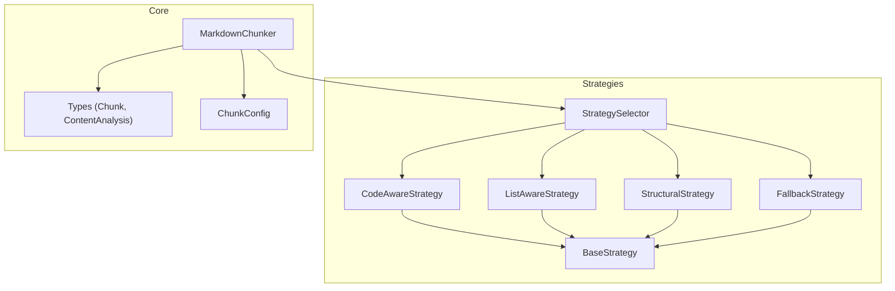
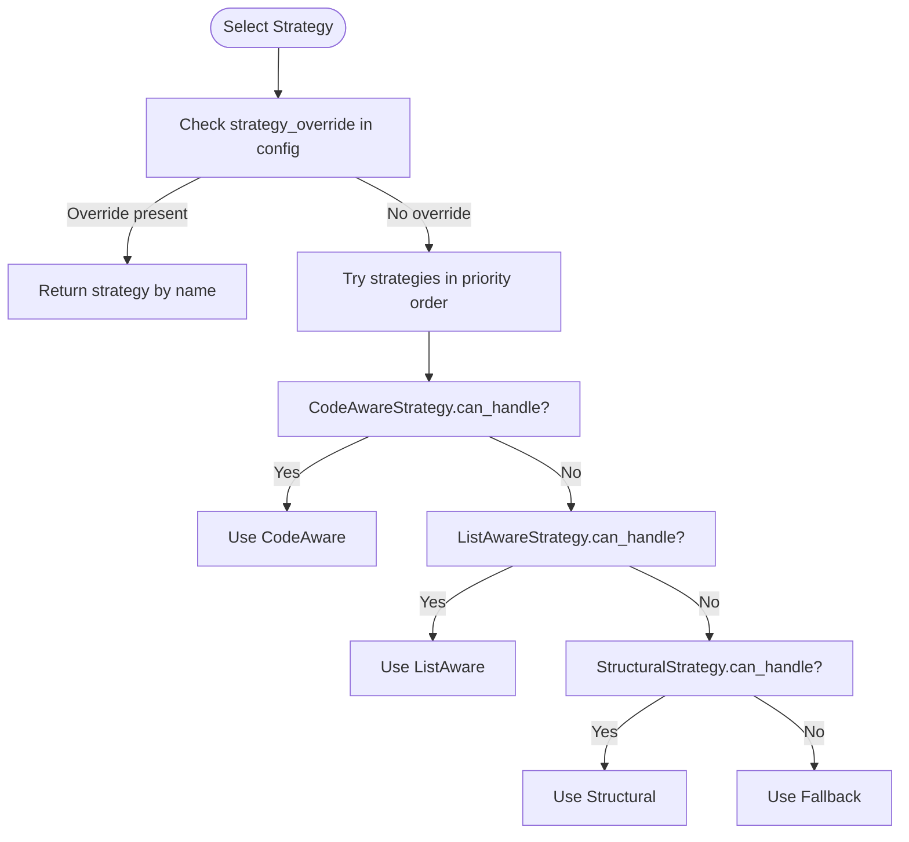
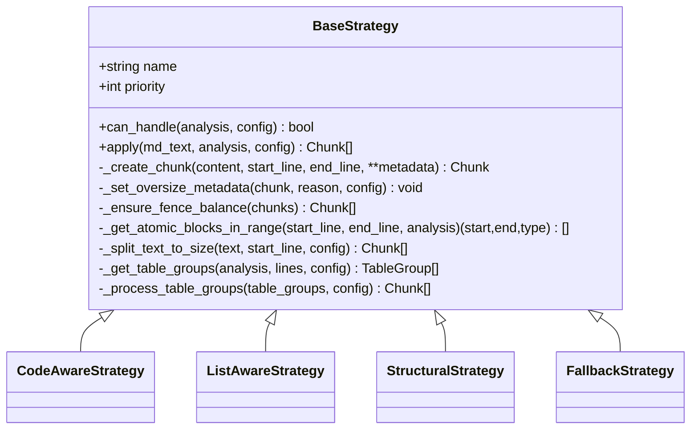
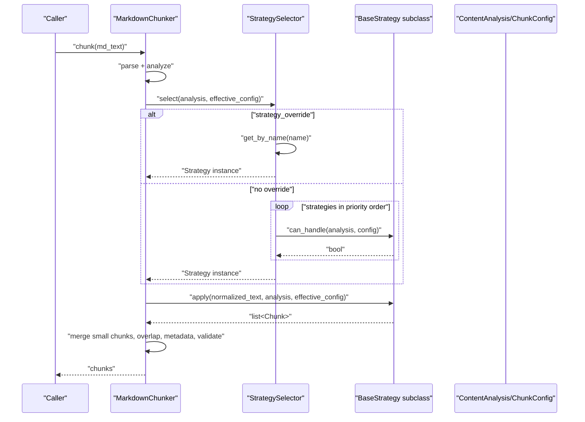
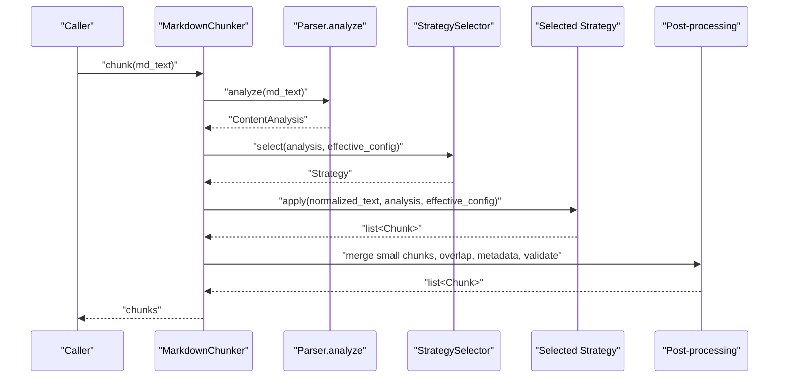
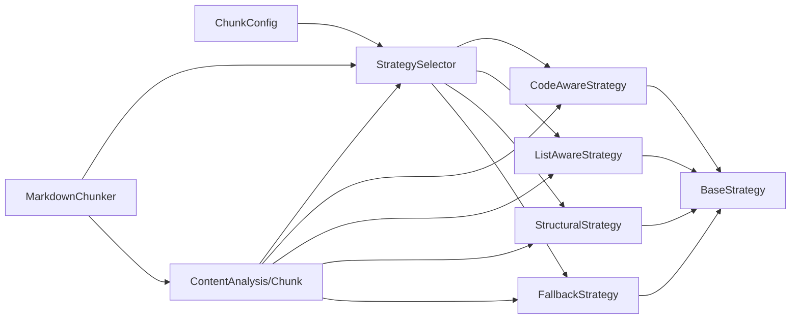

# Chunking Strategies

<cite>
**Referenced Files in This Document**
- [strategies/__init__.py](file://src/chunkana/strategies/__init__.py)
- [strategies/base.py](file://src/chunkana/strategies/base.py)
- [strategies/code_aware.py](file://src/chunkana/strategies/code_aware.py)
- [strategies/list_aware.py](file://src/chunkana/strategies/list_aware.py)
- [strategies/structural.py](file://src/chunkana/strategies/structural.py)
- [strategies/fallback.py](file://src/chunkana/strategies/fallback.py)
- [chunker.py](file://src/chunkana/chunker.py)
- [types.py](file://src/chunkana/types.py)
- [config.py](file://src/chunkana/config.py)
- [strategies.md](file://docs/strategies.md)
- [test_strategies.py](file://tests/unit/test_strategies.py)
</cite>

## Table of Contents
1. [Introduction](#introduction)
2. [Project Structure](#project-structure)
3. [Core Components](#core-components)
4. [Architecture Overview](#architecture-overview)
5. [Detailed Component Analysis](#detailed-component-analysis)
6. [Dependency Analysis](#dependency-analysis)
7. [Performance Considerations](#performance-considerations)
8. [Troubleshooting Guide](#troubleshooting-guide)
9. [Conclusion](#conclusion)
10. [Appendices](#appendices)

## Introduction
This document explains how Chunkana automatically selects the optimal chunking strategy based on content analysis and details each strategy’s behavior, decision logic, and performance trade-offs. It also documents the Strategy Pattern implementation, the StrategySelector selection algorithm, and how users can override automatic selection. Sequence diagrams illustrate the strategy invocation flow during processing.

## Project Structure
The chunking strategies live under src/chunkana/strategies and are selected by StrategySelector. The main orchestrator, MarkdownChunker, runs a single parse, selects a strategy, applies it, and then performs post-processing (merging small chunks, overlap, metadata enrichment, and validation).

**Diagram sources**
- [strategies/__init__.py](file://src/chunkana/strategies/__init__.py#L1-L78)
- [strategies/base.py](file://src/chunkana/strategies/base.py#L1-L120)
- [chunker.py](file://src/chunkana/chunker.py#L85-L176)
- [types.py](file://src/chunkana/types.py#L181-L238)
- [config.py](file://src/chunkana/config.py#L17-L120)

**Section sources**
- [strategies/__init__.py](file://src/chunkana/strategies/__init__.py#L1-L78)
- [chunker.py](file://src/chunkana/chunker.py#L85-L176)

## Core Components
- StrategySelector: Implements the selection algorithm that chooses the best strategy based on priority and content analysis.
- BaseStrategy: Defines the common interface and shared helpers for all strategies.
- Concrete strategies: CodeAware, ListAware, Structural, and Fallback.
- MarkdownChunker: Orchestrates parsing, strategy selection, application, and post-processing.
- Types: ContentAnalysis and Chunk define the data structures used by strategies.
- Config: ChunkConfig defines thresholds and behavior toggles used by strategies.

**Section sources**
- [strategies/__init__.py](file://src/chunkana/strategies/__init__.py#L1-L78)
- [strategies/base.py](file://src/chunkana/strategies/base.py#L1-L120)
- [chunker.py](file://src/chunkana/chunker.py#L85-L176)
- [types.py](file://src/chunkana/types.py#L181-L238)
- [config.py](file://src/chunkana/config.py#L17-L120)

## Architecture Overview
Automatic strategy selection follows a deterministic priority order. If a document satisfies the activation criteria for a higher-priority strategy, it wins; otherwise, the next strategy is tried until the universal fallback is used.

**Diagram sources**
- [strategies/__init__.py](file://src/chunkana/strategies/__init__.py#L39-L77)
- [strategies/code_aware.py](file://src/chunkana/strategies/code_aware.py#L32-L41)
- [strategies/list_aware.py](file://src/chunkana/strategies/list_aware.py#L48-L90)
- [strategies/structural.py](file://src/chunkana/strategies/structural.py#L52-L57)
- [strategies/fallback.py](file://src/chunkana/strategies/fallback.py#L31-L34)

## Detailed Component Analysis

### Strategy Pattern Implementation
- BaseStrategy defines the contract: name, priority, can_handle, apply, plus shared helpers for chunk creation, oversize marking, fence balancing, atomic block detection, paragraph splitting, and table grouping.
- Concrete strategies implement can_handle and apply to tailor chunking to document characteristics.

**Diagram sources**
- [strategies/base.py](file://src/chunkana/strategies/base.py#L15-L120)
- [strategies/code_aware.py](file://src/chunkana/strategies/code_aware.py#L14-L31)
- [strategies/list_aware.py](file://src/chunkana/strategies/list_aware.py#L15-L38)
- [strategies/structural.py](file://src/chunkana/strategies/structural.py#L15-L39)
- [strategies/fallback.py](file://src/chunkana/strategies/fallback.py#L13-L30)

**Section sources**
- [strategies/base.py](file://src/chunkana/strategies/base.py#L15-L120)

### StrategySelector and Decision Logic
- Priority order: CodeAware (1), ListAware (2), Structural (3), Fallback (4).
- If config.strategy_override is set, StrategySelector returns that strategy immediately.
- Otherwise, it iterates strategies in priority order and returns the first that can_handle the document.
- Fallback is guaranteed to accept any document.

**Diagram sources**
- [chunker.py](file://src/chunkana/chunker.py#L146-L176)
- [strategies/__init__.py](file://src/chunkana/strategies/__init__.py#L39-L77)

**Section sources**
- [strategies/__init__.py](file://src/chunkana/strategies/__init__.py#L39-L77)
- [chunker.py](file://src/chunkana/chunker.py#L146-L176)

### Code-Aware Strategy
- Purpose: Optimize chunking for documents with code blocks or tables; preserve atomic integrity.
- Activation criteria:
  - code_block_count >= 1, OR
  - table_count >= 1, OR
  - code_ratio >= code_threshold (default 0.3)
- Enhanced behavior:
  - Optional code-context binding: binds code blocks to surrounding explanations and groups related blocks (before/after, code/output, same language).
  - Table grouping: optional grouping of related tables into single chunks.
- Output metadata:
  - content_type: "code" or "table" for atomic chunks.
  - Oversize reasons: "code_block_integrity", "table_integrity", "latex_integrity", "related_code_group".
  - Fence balance handling: merges adjacent chunks to fix unbalanced fences.

Examples of documents that trigger this strategy:
- Documents with fenced code blocks.
- Documents with tables.
- Documents with high code_ratio even without explicit fenced code blocks.

Trade-offs:
- Higher computational cost due to context binding and table grouping.
- Better retrieval quality for code-heavy or table-heavy content.

**Section sources**
- [strategies/code_aware.py](file://src/chunkana/strategies/code_aware.py#L32-L41)
- [strategies/code_aware.py](file://src/chunkana/strategies/code_aware.py#L176-L210)
- [strategies/code_aware.py](file://src/chunkana/strategies/code_aware.py#L363-L415)
- [strategies/code_aware.py](file://src/chunkana/strategies/code_aware.py#L416-L480)
- [strategies/code_aware.py](file://src/chunkana/strategies/code_aware.py#L481-L507)
- [strategies/code_aware.py](file://src/chunkana/strategies/code_aware.py#L508-L585)
- [strategies/code_aware.py](file://src/chunkana/strategies/code_aware.py#L663-L724)
- [strategies/base.py](file://src/chunkana/strategies/base.py#L90-L117)
- [strategies/base.py](file://src/chunkana/strategies/base.py#L118-L167)
- [strategies/base.py](file://src/chunkana/strategies/base.py#L168-L210)
- [strategies/base.py](file://src/chunkana/strategies/base.py#L273-L361)
- [config.py](file://src/chunkana/config.py#L86-L91)
- [strategies.md](file://docs/strategies.md#L12-L25)
- [test_strategies.py](file://tests/unit/test_strategies.py#L12-L62)

### List-Aware Strategy
- Purpose: Optimize chunking for list-heavy documents while preserving list hierarchy.
- Activation criteria:
  - Non-structural documents: list_ratio > list_ratio_threshold (default 0.4) OR list_count >= list_count_threshold (default 5).
  - Structural documents (many headers): both conditions must hold to avoid interference with structural strategy.
- Features:
  - Preserves nested list hierarchies.
  - Binds introduction paragraphs to lists when appropriate.
  - Groups related list items.
  - Adds header_path metadata to chunks for downstream navigation.
  - Supports checkbox lists with statistics.

Examples of documents that trigger this strategy:
- Changelogs or feature lists with many bullet items.
- Task lists or agendas.

Trade-offs:
- Slightly more complex than fallback due to list-aware splitting and grouping.
- Improves semantic coherence for list-centric content.

**Section sources**
- [strategies/list_aware.py](file://src/chunkana/strategies/list_aware.py#L48-L90)
- [strategies/list_aware.py](file://src/chunkana/strategies/list_aware.py#L91-L110)
- [strategies/list_aware.py](file://src/chunkana/strategies/list_aware.py#L111-L169)
- [strategies/list_aware.py](file://src/chunkana/strategies/list_aware.py#L170-L219)
- [strategies/list_aware.py](file://src/chunkana/strategies/list_aware.py#L220-L249)
- [strategies/list_aware.py](file://src/chunkana/strategies/list_aware.py#L251-L295)
- [strategies/list_aware.py](file://src/chunkana/strategies/list_aware.py#L296-L310)
- [strategies/list_aware.py](file://src/chunkana/strategies/list_aware.py#L311-L402)
- [strategies/list_aware.py](file://src/chunkana/strategies/list_aware.py#L404-L445)
- [strategies/list_aware.py](file://src/chunkana/strategies/list_aware.py#L446-L501)
- [strategies/list_aware.py](file://src/chunkana/strategies/list_aware.py#L502-L536)
- [config.py](file://src/chunkana/config.py#L86-L91)
- [strategies.md](file://docs/strategies.md#L26-L39)
- [test_strategies.py](file://tests/unit/test_strategies.py#L91-L123)

### Structural Strategy
- Purpose: Optimize chunking for hierarchical documents with headers.
- Activation criteria:
  - header_count >= structure_threshold (default 3)
  - max_header_depth > 1
- Features:
  - Splits by header boundaries.
  - Maintains header hierarchy in header_path metadata.
  - Handles preamble (content before first header).
  - Preserves atomic blocks within sections.
  - Uses a configurable max_structural_level to decide which headers contribute to header_path vs. section_tags.

Examples of documents that trigger this strategy:
- Long-form documentation with multiple sections and subsections.
- API reference with many headers.

Trade-offs:
- More computationally intensive due to header stack caching and section tag derivation.
- Produces semantically rich chunks with strong navigational metadata.

**Section sources**
- [strategies/structural.py](file://src/chunkana/strategies/structural.py#L52-L57)
- [strategies/structural.py](file://src/chunkana/strategies/structural.py#L58-L151)
- [strategies/structural.py](file://src/chunkana/strategies/structural.py#L152-L203)
- [strategies/structural.py](file://src/chunkana/strategies/structural.py#L204-L315)
- [strategies/structural.py](file://src/chunkana/strategies/structural.py#L316-L386)
- [strategies/structural.py](file://src/chunkana/strategies/structural.py#L387-L433)
- [strategies/structural.py](file://src/chunkana/strategies/structural.py#L434-L527)
- [strategies/structural.py](file://src/chunkana/strategies/structural.py#L528-L596)
- [config.py](file://src/chunkana/config.py#L86-L91)
- [strategies.md](file://docs/strategies.md#L40-L51)
- [test_strategies.py](file://tests/unit/test_strategies.py#L63-L90)

### Fallback Strategy
- Purpose: Universal fallback for any document.
- Activation: Always returns True.
- Features:
  - Splits by paragraph boundaries and groups to fit max_chunk_size.
  - Preserves atomic blocks (code, tables, LaTeX) if present.
  - Marks oversized chunks with oversize_reason when needed.

Examples of documents that trigger this strategy:
- Plain text without headers, code, or lists.
- Edge cases where other strategies do not activate.

Trade-offs:
- Simplest and most robust; lowest overhead.
- May fragment atomic blocks if not handled carefully.

**Section sources**
- [strategies/fallback.py](file://src/chunkana/strategies/fallback.py#L31-L34)
- [strategies/fallback.py](file://src/chunkana/strategies/fallback.py#L35-L116)
- [strategies/fallback.py](file://src/chunkana/strategies/fallback.py#L117-L187)
- [strategies.md](file://docs/strategies.md#L52-L60)
- [test_strategies.py](file://tests/unit/test_strategies.py#L124-L137)

### Strategy Invocation During Processing
This sequence shows how MarkdownChunker orchestrates strategy selection and application.

**Diagram sources**
- [chunker.py](file://src/chunkana/chunker.py#L111-L176)
- [strategies/__init__.py](file://src/chunkana/strategies/__init__.py#L39-L77)

## Dependency Analysis
- StrategySelector depends on BaseStrategy subclasses and ChunkConfig.
- Strategies depend on BaseStrategy and ContentAnalysis.
- MarkdownChunker depends on StrategySelector, parser, and post-processing utilities.
- Types define the shared data structures used across the system.

**Diagram sources**
- [strategies/__init__.py](file://src/chunkana/strategies/__init__.py#L31-L77)
- [strategies/base.py](file://src/chunkana/strategies/base.py#L15-L120)
- [chunker.py](file://src/chunkana/chunker.py#L85-L176)
- [types.py](file://src/chunkana/types.py#L181-L238)
- [config.py](file://src/chunkana/config.py#L17-L120)

**Section sources**
- [strategies/__init__.py](file://src/chunkana/strategies/__init__.py#L31-L77)
- [chunker.py](file://src/chunkana/chunker.py#L85-L176)
- [types.py](file://src/chunkana/types.py#L181-L238)

## Performance Considerations
- StrategySelector is O(N) in the number of strategies (constant-time in practice).
- CodeAwareStrategy can be expensive due to code-context binding and table grouping; enable only when beneficial.
- StructuralStrategy uses header stack caching to reduce repeated computations.
- FallbackStrategy is lightweight and suitable for large plain-text documents.
- Oversize handling and fence balancing add minor overhead but improve correctness.

[No sources needed since this section provides general guidance]

## Troubleshooting Guide
Common issues and resolutions:
- Unexpected strategy selection:
  - Verify thresholds in ChunkConfig (code_threshold, structure_threshold, list_ratio_threshold, list_count_threshold).
  - Use strategy_override to force a specific strategy.
- Oversized chunks:
  - Oversize chunks are flagged with allow_oversize and oversize_reason; adjust max_chunk_size or enable adaptive sizing.
- Unbalanced fences:
  - The system attempts to merge adjacent chunks to balance fences; otherwise, fence_balance_error is set.
- List chunks split mid-item:
  - Ensure list-aware behavior is active; verify list_ratio_threshold and list_count_threshold.

**Section sources**
- [config.py](file://src/chunkana/config.py#L86-L91)
- [strategies/base.py](file://src/chunkana/strategies/base.py#L90-L117)
- [strategies/base.py](file://src/chunkana/strategies/base.py#L118-L167)
- [test_strategies.py](file://tests/unit/test_strategies.py#L138-L163)

## Conclusion
Chunkana’s Strategy Pattern cleanly separates concerns across four strategies, enabling optimal chunking for diverse document types. StrategySelector’s priority-based selection, combined with ContentAnalysis-driven activation criteria, yields predictable and high-quality results. Users can fine-tune thresholds or override selection to meet specific needs, while post-processing ensures consistency and navigability.

## Appendices

### How to Override Automatic Selection
- Set strategy_override in ChunkConfig to one of: "code_aware", "list_aware", "structural", "fallback".
- The selector will return the named strategy regardless of content analysis.

**Section sources**
- [config.py](file://src/chunkana/config.py#L92-L94)
- [strategies/__init__.py](file://src/chunkana/strategies/__init__.py#L62-L68)
- [strategies.md](file://docs/strategies.md#L61-L72)

### Thresholds and Defaults
- code_threshold: 0.3
- structure_threshold: 3
- list_ratio_threshold: 0.4
- list_count_threshold: 5

**Section sources**
- [config.py](file://src/chunkana/config.py#L86-L91)
- [strategies.md](file://docs/strategies.md#L12-L25)