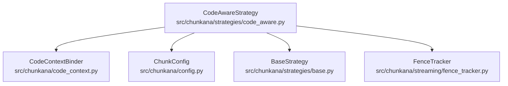
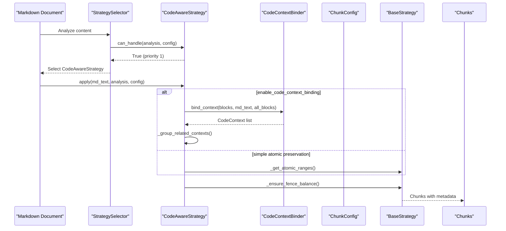
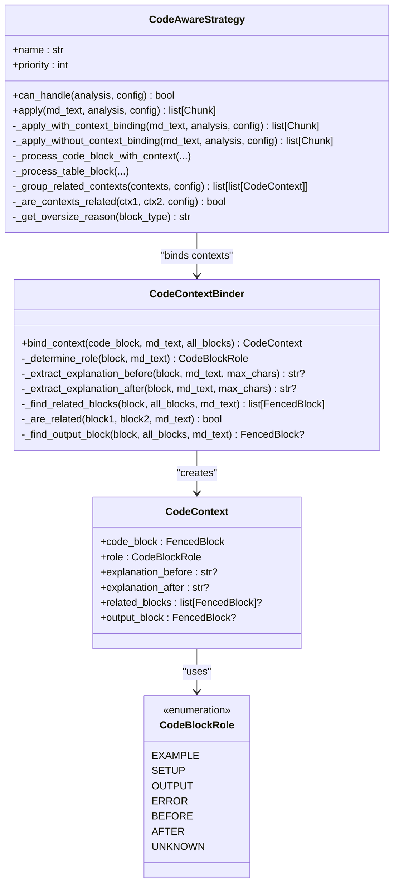
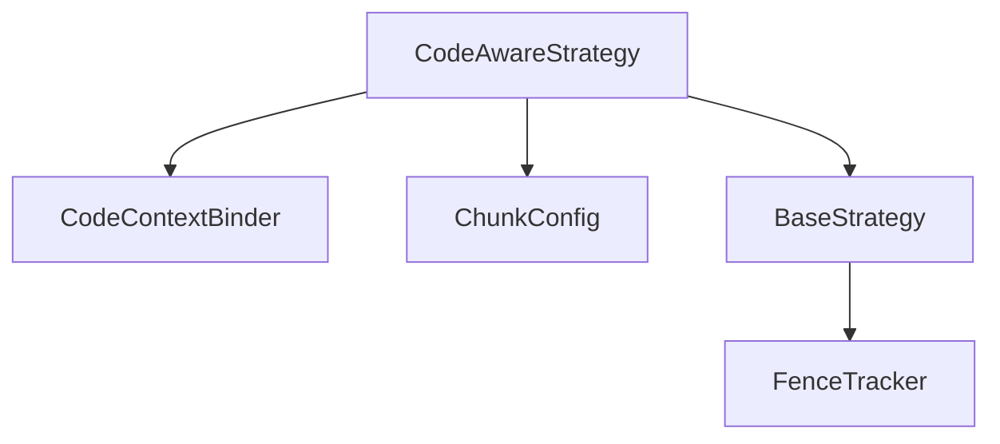

# Code-Aware Strategy

<cite>
**Referenced Files in This Document**
- [code_aware.py](file://src/chunkana/strategies/code_aware.py)
- [code_context.py](file://src/chunkana/code_context.py)
- [config.py](file://src/chunkana/config.py)
- [base.py](file://src/chunkana/strategies/base.py)
- [fence_tracker.py](file://src/chunkana/streaming/fence_tracker.py)
- [test_strategies.py](file://tests/unit/test_strategies.py)
- [code_heavy.md](file://tests/baseline/fixtures/code_heavy.md)
- [large_tables.md](file://tests/baseline/fixtures/large_tables.md)
</cite>

## Table of Contents
1. [Introduction](#introduction)
2. [Project Structure](#project-structure)
3. [Core Components](#core-components)
4. [Architecture Overview](#architecture-overview)
5. [Detailed Component Analysis](#detailed-component-analysis)
6. [Dependency Analysis](#dependency-analysis)
7. [Performance Considerations](#performance-considerations)
8. [Troubleshooting Guide](#troubleshooting-guide)
9. [Conclusion](#conclusion)
10. [Appendices](#appendices)

## Introduction
The Code-Aware Strategy is the highest-priority strategy (priority 1) designed for documents containing code blocks, tables, or LaTeX formulas. Its primary goal is to preserve atomic block integrity by preventing splits within code fences, tables, and mathematical expressions. It offers two operational modes:
- Context binding (enabled): Groups related code blocks with their explanations and output, forming cohesive units.
- Simple atomic preservation (disabled): Preserves atomic blocks without context binding, maintaining backward compatibility.

The strategy adds metadata to chunks to indicate preservation reasons and context scope, enabling downstream systems to understand why certain chunks are oversized or how code blocks relate to surrounding explanations.

## Project Structure
The Code-Aware Strategy resides in the strategies package and integrates with supporting modules for code context binding, configuration, and streaming fence tracking.

**Diagram sources**
- [code_aware.py](file://src/chunkana/strategies/code_aware.py#L1-L120)
- [code_context.py](file://src/chunkana/code_context.py#L63-L163)
- [config.py](file://src/chunkana/config.py#L17-L123)
- [base.py](file://src/chunkana/strategies/base.py#L15-L66)
- [fence_tracker.py](file://src/chunkana/streaming/fence_tracker.py#L10-L65)

**Section sources**
- [code_aware.py](file://src/chunkana/strategies/code_aware.py#L1-L120)
- [code_context.py](file://src/chunkana/code_context.py#L63-L163)
- [config.py](file://src/chunkana/config.py#L17-L123)
- [base.py](file://src/chunkana/strategies/base.py#L15-L66)
- [fence_tracker.py](file://src/chunkana/streaming/fence_tracker.py#L10-L65)

## Core Components
- CodeAwareStrategy: Implements the strategy selection and chunking logic for code-heavy and table-heavy documents. It identifies atomic blocks, optionally binds code blocks to context, groups related blocks, and ensures atomic integrity.
- CodeContextBinder: Extracts explanations before/after code blocks, classifies roles (example, setup, output, error, before, after), detects related blocks, and finds output blocks.
- ChunkConfig: Provides configuration for code-context binding, oversize handling, and related block grouping.
- BaseStrategy: Supplies shared helpers for chunk creation, oversize metadata, fence balancing, and text splitting.

Key responsibilities:
- Atomic block detection and preservation.
- Context binding and grouping logic.
- Oversize metadata assignment for integrity reasons.
- Fence balance enforcement across chunks.

**Section sources**
- [code_aware.py](file://src/chunkana/strategies/code_aware.py#L14-L120)
- [code_context.py](file://src/chunkana/code_context.py#L63-L163)
- [config.py](file://src/chunkana/config.py#L95-L123)
- [base.py](file://src/chunkana/strategies/base.py#L67-L167)

## Architecture Overview
The strategy orchestrates parsing results and configuration to produce chunks that respect atomic boundaries and optionally enrich code blocks with context.

**Diagram sources**
- [code_aware.py](file://src/chunkana/strategies/code_aware.py#L32-L120)
- [code_context.py](file://src/chunkana/code_context.py#L121-L163)
- [base.py](file://src/chunkana/strategies/base.py#L118-L167)

## Detailed Component Analysis

### CodeAwareStrategy
Responsibilities:
- Strategy selection: Priority 1 when code blocks, tables, or code ratio exceeds threshold.
- Modes:
  - With context binding: Uses CodeContextBinder to attach explanations and group related code blocks.
  - Without context binding: Preserves atomic blocks and splits text around them.
- Atomic block handling: Detects code, table, and LaTeX ranges and creates atomic chunks.
- Oversize handling: Adds metadata indicating integrity reasons when chunks exceed size limits.
- Fence balance: Ensures balanced code fences across chunk boundaries.

Operational highlights:
- can_handle: Checks code_block_count, table_count, or code_ratio against config.threshold.
- apply: Chooses mode based on enable_code_context_binding and delegates to internal methods.
- _apply_with_context_binding: Initializes CodeContextBinder, binds contexts, groups related contexts, computes atomic ranges, and processes blocks with context.
- _apply_without_context_binding: Uses cached lines from analysis, computes atomic ranges, splits text before/after blocks, and ensures fence balance.
- _process_code_block_with_context: Creates either grouped or single-code chunks with enriched metadata.
- _process_table_block: Supports single-table or grouped-table processing depending on configuration.
- _group_related_contexts: Forms groups based on Before/After pairs, Code/Output pairs, and proximity/language heuristics.
- _are_contexts_related: Implements relationship checks using configuration thresholds.
- _get_oversize_reason: Maps block types to integrity reasons for oversize metadata.
- _ensure_fence_balance: Balances fences by merging adjacent chunks when necessary.

Metadata added to chunks:
- code_role: Role of the code block (example, setup, output, error, before, after, or mixed).
- context_scope: "before", "after", "both", or "none" based on explanation presence.
- has_related_code: Boolean indicating related code blocks exist.
- related_code_count: Number of related code blocks.
- explanation_bound: Boolean indicating explanations were bound.
- has_output_block: Boolean indicating an output block is present.
- oversize_reason: Integrity reason when a chunk exceeds max_chunk_size.

**Section sources**
- [code_aware.py](file://src/chunkana/strategies/code_aware.py#L32-L120)
- [code_aware.py](file://src/chunkana/strategies/code_aware.py#L176-L221)
- [code_aware.py](file://src/chunkana/strategies/code_aware.py#L236-L294)
- [code_aware.py](file://src/chunkana/strategies/code_aware.py#L327-L362)
- [code_aware.py](file://src/chunkana/strategies/code_aware.py#L363-L480)
- [code_aware.py](file://src/chunkana/strategies/code_aware.py#L481-L507)
- [code_aware.py](file://src/chunkana/strategies/code_aware.py#L508-L585)
- [code_aware.py](file://src/chunkana/strategies/code_aware.py#L605-L724)
- [base.py](file://src/chunkana/strategies/base.py#L90-L117)

#### Class Diagram: Code-Aware Strategy and Context Binding

**Diagram sources**
- [code_aware.py](file://src/chunkana/strategies/code_aware.py#L14-L120)
- [code_context.py](file://src/chunkana/code_context.py#L16-L62)
- [code_context.py](file://src/chunkana/code_context.py#L121-L163)
- [code_context.py](file://src/chunkana/code_context.py#L357-L441)

### Code Context Binding
Behavior:
- Roles: Determines roles using language tags, preceding text patterns, and cached roles.
- Explanations: Extracts up to max_context_chars_before/after from text before/after a code block, respecting sentence boundaries.
- Related blocks: Identifies neighboring blocks with same language and small gaps, or Before/After pairs, or Code/Output pairs.
- Output blocks: Associates the next block as output when appropriate.

Configuration:
- max_context_chars_before/after: Controls explanation extraction window.
- related_block_max_gap: Maximum line gap to consider blocks related.
- bind_output_blocks: Enables automatic linking of output blocks to code.
- preserve_before_after_pairs: Keeps Before/After examples in single chunks.

**Section sources**
- [code_context.py](file://src/chunkana/code_context.py#L100-L163)
- [code_context.py](file://src/chunkana/code_context.py#L164-L244)
- [code_context.py](file://src/chunkana/code_context.py#L279-L356)
- [code_context.py](file://src/chunkana/code_context.py#L357-L441)
- [code_context.py](file://src/chunkana/code_context.py#L442-L516)

### Atomic Block Preservation and Oversize Metadata
- Atomic ranges: Aggregates code, table, and LaTeX ranges from analysis and sorts by start line.
- Oversize reasons: Maps block types to integrity reasons ("code_block_integrity", "table_integrity", "latex_integrity", "related_code_group").
- Fence balance: Ensures balanced fences by merging adjacent chunks when necessary; otherwise marks errors.

**Section sources**
- [code_aware.py](file://src/chunkana/strategies/code_aware.py#L481-L507)
- [code_aware.py](file://src/chunkana/strategies/code_aware.py#L167-L175)
- [base.py](file://src/chunkana/strategies/base.py#L118-L167)

### Examples from Tests
- Code-heavy document triggers CodeAwareStrategy and preserves code blocks intact.
- Table-containing document triggers CodeAwareStrategy and preserves tables intact.

These examples demonstrate that documents with code blocks or tables are routed to the Code-Aware Strategy, which prevents splits within atomic blocks.

**Section sources**
- [test_strategies.py](file://tests/unit/test_strategies.py#L15-L62)
- [test_strategies.py](file://tests/unit/test_strategies.py#L168-L219)
- [code_heavy.md](file://tests/baseline/fixtures/code_heavy.md#L1-L74)
- [large_tables.md](file://tests/baseline/fixtures/large_tables.md#L1-L68)

## Dependency Analysis
- CodeAwareStrategy depends on:
  - CodeContextBinder for context enrichment.
  - ChunkConfig for thresholds and binding parameters.
  - BaseStrategy for shared helpers (chunk creation, oversize metadata, fence balancing).
  - FenceTracker indirectly via BaseStrategy’s fence balance enforcement.
- CodeContextBinder depends on:
  - FencedBlock and regex patterns for role detection.
  - Lines caching for performance optimization.

**Diagram sources**
- [code_aware.py](file://src/chunkana/strategies/code_aware.py#L176-L221)
- [code_context.py](file://src/chunkana/code_context.py#L121-L163)
- [config.py](file://src/chunkana/config.py#L95-L123)
- [base.py](file://src/chunkana/strategies/base.py#L118-L167)
- [fence_tracker.py](file://src/chunkana/streaming/fence_tracker.py#L10-L65)

**Section sources**
- [code_aware.py](file://src/chunkana/strategies/code_aware.py#L176-L221)
- [code_context.py](file://src/chunkana/code_context.py#L121-L163)
- [config.py](file://src/chunkana/config.py#L95-L123)
- [base.py](file://src/chunkana/strategies/base.py#L118-L167)
- [fence_tracker.py](file://src/chunkana/streaming/fence_tracker.py#L10-L65)

## Performance Considerations
- Context binding optimization:
  - Lines caching: CodeContextBinder accepts pre-split lines to avoid repeated splitting.
  - Reduced scanning: Role detection and explanation extraction use bounded windows.
- Grouping complexity:
  - _group_related_contexts performs pairwise checks; complexity grows with number of code blocks.
  - Thresholds (related_block_max_gap) limit unnecessary grouping.
- Oversize handling:
  - Oversize metadata avoids recomputation and enables downstream decisions.
- Fence balancing:
  - Merging adjacent chunks is linear in number of chunks produced.

Recommendations:
- Increase max_chunk_size for code-heavy documents to reduce oversize occurrences.
- Tune related_block_max_gap to balance grouping fidelity and performance.
- Enable adaptive sizing for dynamic chunk sizes based on content complexity.

[No sources needed since this section provides general guidance]

## Troubleshooting Guide
Common issues and resolutions:
- Unbalanced fences:
  - Symptom: Fence balance error metadata on chunks.
  - Resolution: Review chunk boundaries; ensure code blocks are not split mid-fence.
- Oversized chunks:
  - Symptom: allow_oversize with oversize_reason indicating integrity preservation.
  - Resolution: Increase max_chunk_size or reduce code block sizes; verify integrity reasons.
- Context binding not taking effect:
  - Symptom: Missing explanation_bound or related_code metadata.
  - Resolution: Verify enable_code_context_binding and thresholds; confirm presence of Before/After or Code/Output patterns.
- Table grouping not applied:
  - Symptom: Single-table chunks instead of grouped chunks.
  - Resolution: Enable group_related_tables and ensure tables are near each other.

**Section sources**
- [base.py](file://src/chunkana/strategies/base.py#L118-L167)
- [code_aware.py](file://src/chunkana/strategies/code_aware.py#L167-L175)
- [code_aware.py](file://src/chunkana/strategies/code_aware.py#L363-L415)
- [code_aware.py](file://src/chunkana/strategies/code_aware.py#L416-L480)

## Conclusion
The Code-Aware Strategy provides robust atomic block preservation for code-heavy and table-heavy documents. With optional context binding, it enhances retrieval quality by grouping related code blocks with their explanations and outputs. Its metadata model communicates integrity reasons and context scope, enabling downstream systems to interpret chunk boundaries effectively. Configuration options allow tuning for performance and content characteristics.

[No sources needed since this section summarizes without analyzing specific files]

## Appendices

### Configuration Options for Code-Aware Strategy
- enable_code_context_binding: Enable enhanced code-context binding.
- max_context_chars_before: Maximum characters to search backward for explanation.
- max_context_chars_after: Maximum characters to search forward for explanation.
- related_block_max_gap: Maximum line gap to consider blocks related.
- bind_output_blocks: Automatically link output blocks to code.
- preserve_before_after_pairs: Keep Before/After examples in single chunks.
- group_related_tables: Group related tables into single chunks.
- preserve_latex_blocks: Treat LaTeX formulas as atomic blocks.
- latex_display_only: Only extract display math and environments.
- latex_max_context_chars: Maximum characters of surrounding text to bind with LaTeX.

**Section sources**
- [config.py](file://src/chunkana/config.py#L95-L123)
- [config.py](file://src/chunkana/config.py#L115-L123)

### Metadata Fields Added to Chunks
- code_role: Role of the code block.
- context_scope: Scope of explanations bound.
- has_related_code: Presence of related code blocks.
- related_code_count: Count of related code blocks.
- explanation_bound: Whether explanations were bound.
- has_output_block: Presence of an output block.
- oversize_reason: Integrity reason for oversized chunks.

**Section sources**
- [code_aware.py](file://src/chunkana/strategies/code_aware.py#L605-L661)
- [code_aware.py](file://src/chunkana/strategies/code_aware.py#L663-L724)
- [base.py](file://src/chunkana/strategies/base.py#L90-L117)