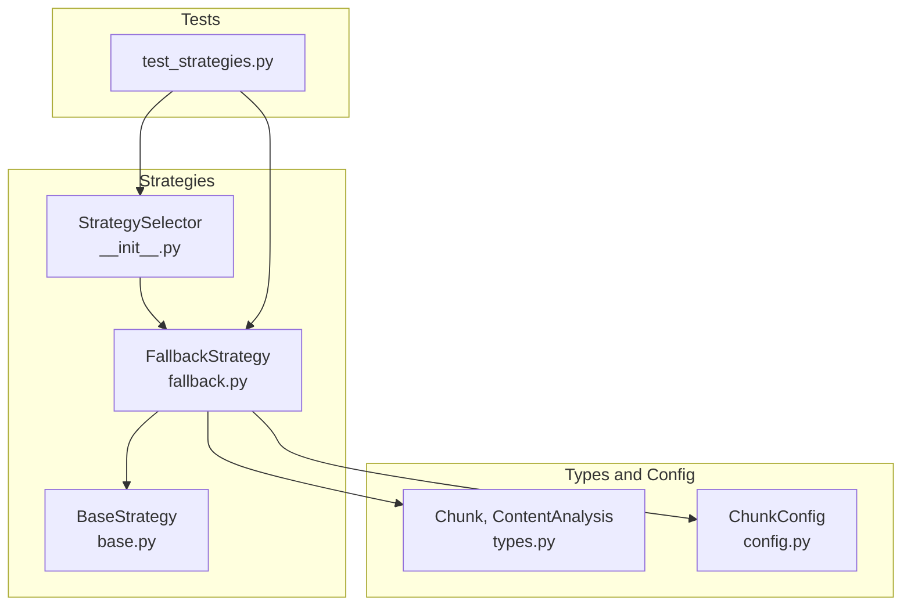
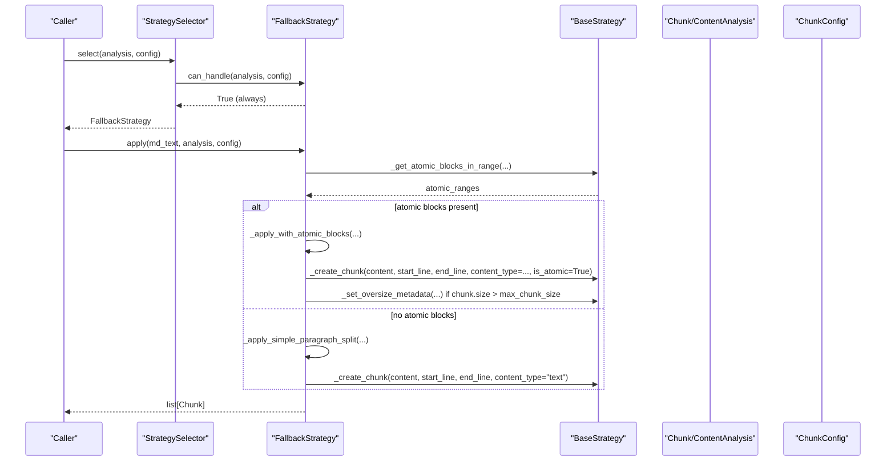
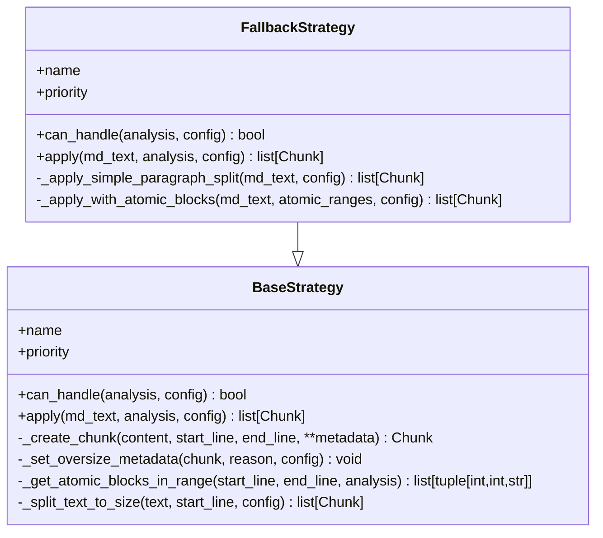
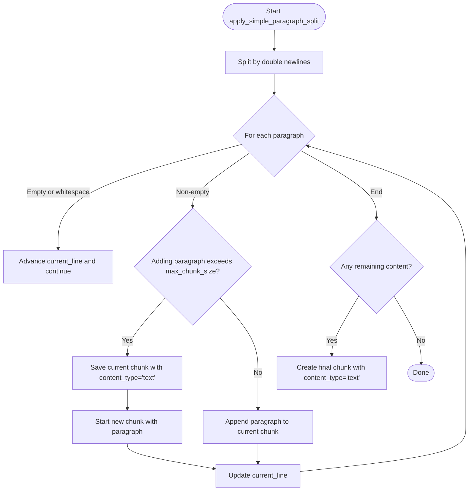
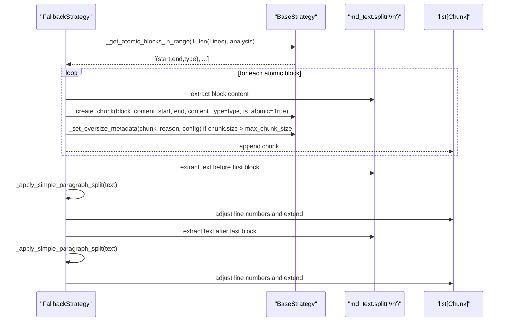
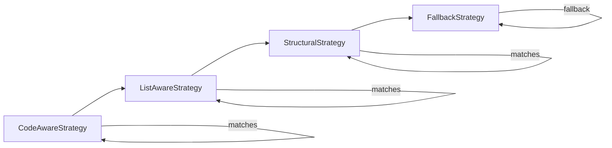
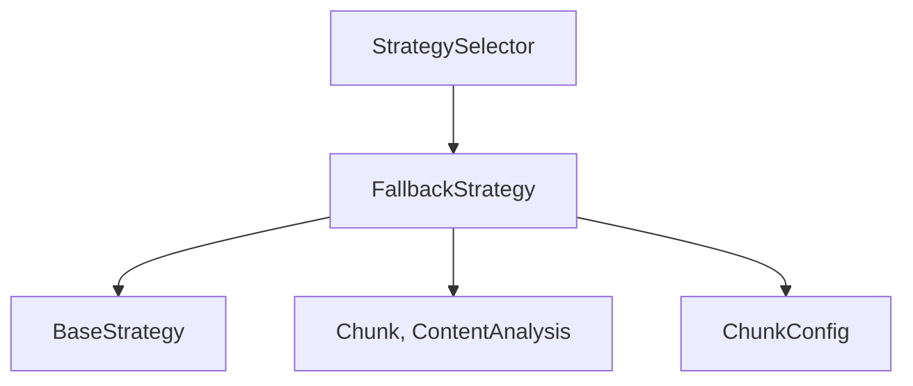

# Fallback Strategy

<cite>
**Referenced Files in This Document**
- [fallback.py](file://src/chunkana/strategies/fallback.py)
- [base.py](file://src/chunkana/strategies/base.py)
- [__init__.py](file://src/chunkana/strategies/__init__.py)
- [types.py](file://src/chunkana/types.py)
- [config.py](file://src/chunkana/config.py)
- [test_strategies.py](file://tests/unit/test_strategies.py)
</cite>

## Table of Contents
1. [Introduction](#introduction)
2. [Project Structure](#project-structure)
3. [Core Components](#core-components)
4. [Architecture Overview](#architecture-overview)
5. [Detailed Component Analysis](#detailed-component-analysis)
6. [Dependency Analysis](#dependency-analysis)
7. [Performance Considerations](#performance-considerations)
8. [Troubleshooting Guide](#troubleshooting-guide)
9. [Conclusion](#conclusion)

## Introduction
The Fallback Strategy serves as the universal fallback (priority 4) that guarantees chunking for any document when no other strategy applies. It ensures robustness by splitting content into manageable chunks while respecting size limits and preserving atomic blocks when present. This document explains how it performs paragraph-based splitting, preserves atomic blocks (code, tables, LaTeX), adjusts line numbers, adds metadata, and marks oversized chunks appropriately.

## Project Structure
The Fallback Strategy is implemented as part of the strategies package and integrates with the shared BaseStrategy and configuration types. Tests validate its behavior for plain text and oversize scenarios.

**Diagram sources**
- [fallback.py](file://src/chunkana/strategies/fallback.py#L1-L187)
- [base.py](file://src/chunkana/strategies/base.py#L1-L361)
- [__init__.py](file://src/chunkana/strategies/__init__.py#L1-L78)
- [types.py](file://src/chunkana/types.py#L180-L378)
- [config.py](file://src/chunkana/config.py#L17-L123)
- [test_strategies.py](file://tests/unit/test_strategies.py#L124-L158)

**Section sources**
- [fallback.py](file://src/chunkana/strategies/fallback.py#L1-L187)
- [base.py](file://src/chunkana/strategies/base.py#L1-L361)
- [__init__.py](file://src/chunkana/strategies/__init__.py#L1-L78)
- [types.py](file://src/chunkana/types.py#L180-L378)
- [config.py](file://src/chunkana/config.py#L17-L123)
- [test_strategies.py](file://tests/unit/test_strategies.py#L124-L158)

## Core Components
- FallbackStrategy: Implements the universal fallback behavior, including paragraph splitting and atomic block preservation.
- BaseStrategy: Provides shared helpers such as chunk creation, oversize metadata, and atomic block detection.
- StrategySelector: Orders strategies by priority and selects FallbackStrategy as the final safety net.
- Types and Config: Define Chunk, ContentAnalysis, and ChunkConfig used throughout the strategy.

Key responsibilities:
- Always returns True for can_handle, ensuring it is selected when no higher-priority strategy matches.
- Splits plain text by paragraph boundaries and groups content to fit max_chunk_size.
- Preserves atomic blocks (code, tables, LaTeX) when detected, marking them as atomic and setting oversize metadata when needed.
- Adjusts line numbers for text chunks around atomic blocks to maintain accurate provenance.

**Section sources**
- [fallback.py](file://src/chunkana/strategies/fallback.py#L23-L34)
- [base.py](file://src/chunkana/strategies/base.py#L67-L118)
- [base.py](file://src/chunkana/strategies/base.py#L168-L209)
- [__init__.py](file://src/chunkana/strategies/__init__.py#L20-L68)
- [types.py](file://src/chunkana/types.py#L240-L378)
- [config.py](file://src/chunkana/config.py#L17-L123)

## Architecture Overview
The strategy selection chain prioritizes specialized strategies first, falling back to FallbackStrategy when none match. FallbackStrategy uses ContentAnalysis to detect atomic blocks and applies either simple paragraph splitting or atomic-preserving splitting accordingly.

**Diagram sources**
- [__init__.py](file://src/chunkana/strategies/__init__.py#L39-L68)
- [fallback.py](file://src/chunkana/strategies/fallback.py#L31-L59)
- [fallback.py](file://src/chunkana/strategies/fallback.py#L117-L187)
- [base.py](file://src/chunkana/strategies/base.py#L168-L209)
- [base.py](file://src/chunkana/strategies/base.py#L67-L118)

## Detailed Component Analysis

### FallbackStrategy Class
- Purpose: Universal fallback for any document.
- Priority: 4 (lowest).
- Methods:
  - name: "fallback"
  - priority: 4
  - can_handle: Always True
  - apply: Orchestrates paragraph splitting or atomic-preserving splitting.
  - _apply_simple_paragraph_split: Splits plain text by paragraphs and respects max_chunk_size.
  - _apply_with_atomic_blocks: Preserves atomic blocks and adjusts line numbers for surrounding text.

Behavior highlights:
- Paragraph splitting uses double newlines as separators and groups paragraphs to fit within max_chunk_size.
- Atomic block preservation detects code, table, and LaTeX blocks and creates atomic chunks with is_atomic=True and appropriate content_type.
- Oversize chunks exceeding max_chunk_size are marked with allow_oversize and an oversize_reason indicating integrity reasons (e.g., code_block_integrity, table_integrity, latex_integrity).
- Line numbers are adjusted for text chunks around atomic blocks to reflect their positions in the original document.

**Diagram sources**
- [base.py](file://src/chunkana/strategies/base.py#L15-L118)
- [base.py](file://src/chunkana/strategies/base.py#L168-L209)
- [base.py](file://src/chunkana/strategies/base.py#L210-L272)
- [fallback.py](file://src/chunkana/strategies/fallback.py#L13-L34)
- [fallback.py](file://src/chunkana/strategies/fallback.py#L35-L59)
- [fallback.py](file://src/chunkana/strategies/fallback.py#L60-L116)
- [fallback.py](file://src/chunkana/strategies/fallback.py#L117-L187)

**Section sources**
- [fallback.py](file://src/chunkana/strategies/fallback.py#L13-L34)
- [fallback.py](file://src/chunkana/strategies/fallback.py#L35-L59)
- [fallback.py](file://src/chunkana/strategies/fallback.py#L60-L116)
- [fallback.py](file://src/chunkana/strategies/fallback.py#L117-L187)
- [base.py](file://src/chunkana/strategies/base.py#L67-L118)
- [base.py](file://src/chunkana/strategies/base.py#L168-L209)

### Paragraph-Based Splitting (Simple Mode)
- Splits text by double newlines to identify paragraph boundaries.
- Accumulates paragraphs until adding the next would exceed max_chunk_size.
- Creates chunks with content_type="text".
- Tracks and updates current_line to compute end_line accurately.

**Diagram sources**
- [fallback.py](file://src/chunkana/strategies/fallback.py#L60-L116)

**Section sources**
- [fallback.py](file://src/chunkana/strategies/fallback.py#L60-L116)

### Atomic Block Preservation (Atomic Mode)
- Detects atomic blocks (code, table, LaTeX) via _get_atomic_blocks_in_range.
- For each atomic block:
  - Creates a chunk with content_type equal to block type and is_atomic=True.
  - If the chunk exceeds max_chunk_size, sets allow_oversize=True and oversize_reason based on block type.
- For text before and after atomic blocks:
  - Splits text by paragraphs and adjusts line numbers to reflect original positions.

**Diagram sources**
- [fallback.py](file://src/chunkana/strategies/fallback.py#L117-L187)
- [base.py](file://src/chunkana/strategies/base.py#L168-L209)
- [base.py](file://src/chunkana/strategies/base.py#L67-L118)

**Section sources**
- [fallback.py](file://src/chunkana/strategies/fallback.py#L117-L187)
- [base.py](file://src/chunkana/strategies/base.py#L168-L209)
- [base.py](file://src/chunkana/strategies/base.py#L67-L118)

### Metadata and Oversize Handling
- Paragraph chunks receive content_type="text".
- Atomic blocks receive content_type equal to their type (e.g., "code", "table", "latex") and is_atomic=True.
- Oversize chunks set allow_oversize=True and oversize_reason indicating integrity reasons:
  - code_block_integrity for code
  - table_integrity for tables
  - latex_integrity for LaTeX
- Line numbers are adjusted for text chunks around atomic blocks to preserve accurate provenance.

**Section sources**
- [fallback.py](file://src/chunkana/strategies/fallback.py#L91-L112)
- [fallback.py](file://src/chunkana/strategies/fallback.py#L155-L169)
- [base.py](file://src/chunkana/strategies/base.py#L67-L118)

### Strategy Selection Chain and Role as Safety Net
- StrategySelector orders strategies by priority: CodeAware (1), ListAware (2), Structural (3), Fallback (4).
- FallbackStrategy’s can_handle always returns True, ensuring it is selected when no other strategy matches.
- Tests confirm plain text documents trigger fallback and that oversize chunks are handled correctly.

**Diagram sources**
- [__init__.py](file://src/chunkana/strategies/__init__.py#L20-L68)
- [fallback.py](file://src/chunkana/strategies/fallback.py#L31-L34)

**Section sources**
- [__init__.py](file://src/chunkana/strategies/__init__.py#L20-L68)
- [fallback.py](file://src/chunkana/strategies/fallback.py#L31-L34)
- [test_strategies.py](file://tests/unit/test_strategies.py#L124-L158)

## Dependency Analysis
- FallbackStrategy depends on BaseStrategy for:
  - Chunk creation (_create_chunk)
  - Oversize metadata handling (_set_oversize_metadata)
  - Atomic block detection (_get_atomic_blocks_in_range)
- StrategySelector maintains ordered strategy instances and selects FallbackStrategy as the default.
- Types define Chunk and ContentAnalysis used by strategies; Config defines ChunkConfig used by strategies.

**Diagram sources**
- [fallback.py](file://src/chunkana/strategies/fallback.py#L13-L34)
- [base.py](file://src/chunkana/strategies/base.py#L67-L118)
- [base.py](file://src/chunkana/strategies/base.py#L168-L209)
- [types.py](file://src/chunkana/types.py#L240-L378)
- [config.py](file://src/chunkana/config.py#L17-L123)
- [__init__.py](file://src/chunkana/strategies/__init__.py#L31-L68)

**Section sources**
- [fallback.py](file://src/chunkana/strategies/fallback.py#L13-L34)
- [base.py](file://src/chunkana/strategies/base.py#L67-L118)
- [base.py](file://src/chunkana/strategies/base.py#L168-L209)
- [types.py](file://src/chunkana/types.py#L240-L378)
- [config.py](file://src/chunkana/config.py#L17-L123)
- [__init__.py](file://src/chunkana/strategies/__init__.py#L31-L68)

## Performance Considerations
- Paragraph splitting is linear in the number of paragraphs and character count, bounded by max_chunk_size checks.
- Atomic block preservation introduces additional passes over text and atomic ranges; however, the number of atomic blocks is typically small compared to total content.
- Using cached lines from ContentAnalysis avoids redundant splitting when available, improving performance for repeated operations.

[No sources needed since this section provides general guidance]

## Troubleshooting Guide
Common issues and resolutions:
- Unexpected oversize chunks: Verify that atomic blocks are larger than max_chunk_size. Oversize chunks are intentionally allowed with allow_oversize=True and an oversize_reason to preserve integrity.
- Incorrect line numbers: Ensure text chunks around atomic blocks are processed through paragraph splitting and line number adjustments.
- Plain text not triggering fallback: Confirm that no other strategy matches (headers, lists, or code density thresholds). Tests demonstrate plain text documents selecting fallback.

Evidence from tests:
- Plain text documents select fallback strategy.
- Oversize chunks are flagged with allow_oversize when exceeding max_chunk_size.

**Section sources**
- [test_strategies.py](file://tests/unit/test_strategies.py#L124-L158)
- [test_strategies.py](file://tests/unit/test_strategies.py#L295-L364)

## Conclusion
The Fallback Strategy provides a robust, universal fallback that guarantees chunking for any document. It splits plain text by paragraphs, preserves atomic blocks when present, adjusts line numbers for provenance, and annotates chunks with appropriate metadata. Its always-true can_handle method ensures it acts as the final safety net in the strategy selection chain, while tests validate its behavior for plain text and oversize handling.