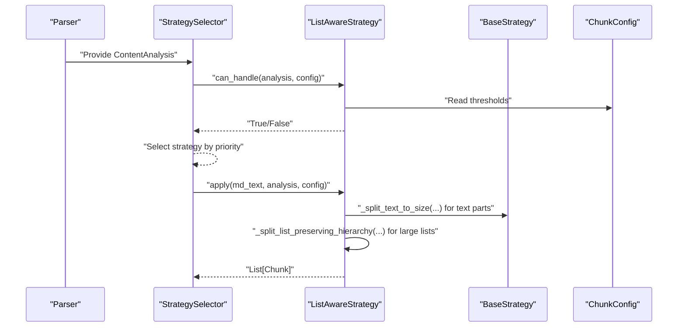
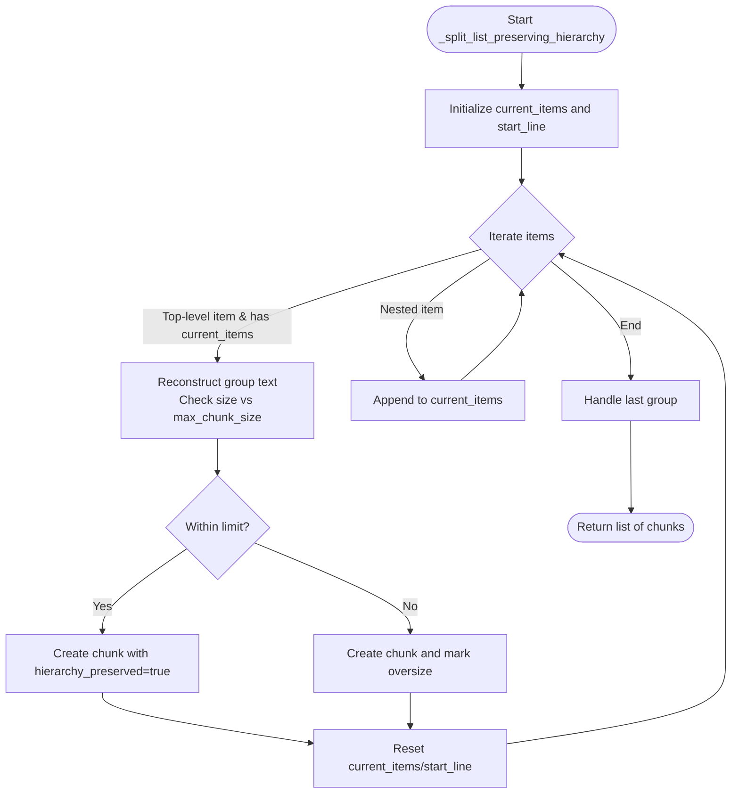
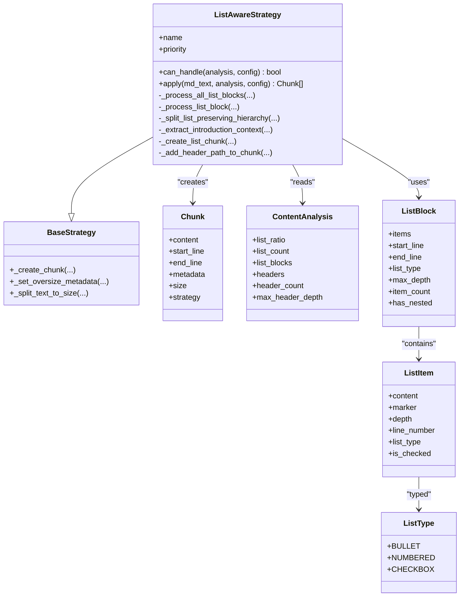
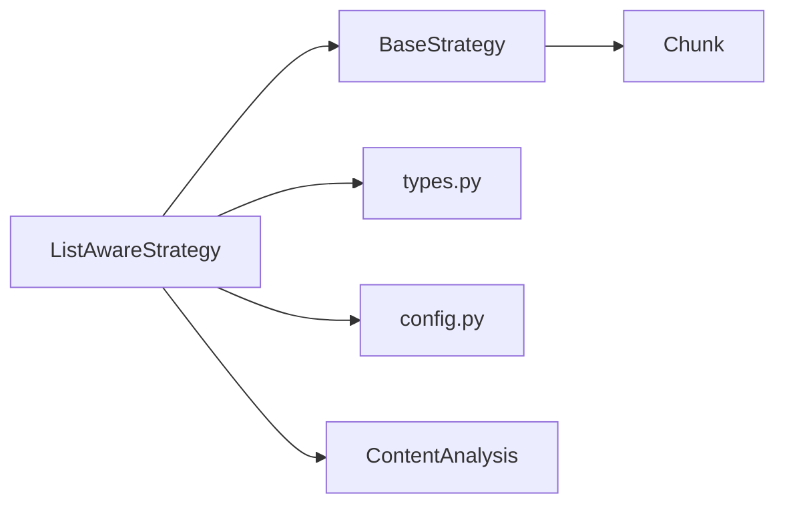

# List-Aware Strategy

<cite>
**Referenced Files in This Document**
- [list_aware.py](file://src/chunkana/strategies/list_aware.py)
- [base.py](file://src/chunkana/strategies/base.py)
- [config.py](file://src/chunkana/config.py)
- [types.py](file://src/chunkana/types.py)
- [strategies.md](file://docs/strategies.md)
- [test_strategies.py](file://tests/unit/test_strategies.py)
- [list_heavy.md](file://tests/baseline/fixtures/list_heavy.md)
- [list_heavy.jsonl](file://tests/baseline/golden_dify_style/list_heavy.jsonl)
</cite>

## Table of Contents
1. [Introduction](#introduction)
2. [Project Structure](#project-structure)
3. [Core Components](#core-components)
4. [Architecture Overview](#architecture-overview)
5. [Detailed Component Analysis](#detailed-component-analysis)
6. [Dependency Analysis](#dependency-analysis)
7. [Performance Considerations](#performance-considerations)
8. [Troubleshooting Guide](#troubleshooting-guide)
9. [Conclusion](#conclusion)
10. [Appendices](#appendices)

## Introduction
The List-Aware Strategy is designed to handle list-heavy documents such as changelogs, feature lists, and task lists. It prioritizes preserving list hierarchies, grouping top-level items with their nested children, and binding introductory paragraphs to lists when appropriate. It also computes statistics for checkbox lists and adds rich metadata to chunks to support downstream retrieval and navigation.

Key characteristics:
- Priority: 2 (after CodeAware, before Structural)
- Dual activation criteria:
  - For documents without strong structure: list_ratio exceeds threshold OR list_count meets minimum
  - For structurally rich documents: both conditions must be met to avoid interfering with hierarchical chunking
- Preservation of list hierarchies and context binding
- Rich metadata for downstream consumers

**Section sources**
- [list_aware.py](file://src/chunkana/strategies/list_aware.py#L15-L38)
- [strategies.md](file://docs/strategies.md#L26-L40)

## Project Structure
The List-Aware Strategy is implemented as a dedicated strategy class that inherits from the base strategy interface. It relies on parsed content analysis (headers, lists, tables, code, LaTeX) and configuration thresholds to decide whether to activate and how to chunk.

```mermaid
graph TB
subgraph "Strategies"
Base["BaseStrategy (base.py)"]
LA["ListAwareStrategy (list_aware.py)"]
end
subgraph "Types"
Types["types.py<br/>ContentAnalysis, ListBlock, ListItem, ListType, Header, Chunk"]
end
Config["config.py<br/>ChunkConfig"]
Docs["docs/strategies.md"]
LA --> Base
LA --> Types
LA --> Config
Docs -. "Documentation" .-> LA
```

**Diagram sources**
- [list_aware.py](file://src/chunkana/strategies/list_aware.py#L1-L60)
- [base.py](file://src/chunkana/strategies/base.py#L1-L60)
- [types.py](file://src/chunkana/types.py#L1-L120)
- [config.py](file://src/chunkana/config.py#L1-L120)
- [strategies.md](file://docs/strategies.md#L1-L40)

**Section sources**
- [list_aware.py](file://src/chunkana/strategies/list_aware.py#L1-L60)
- [base.py](file://src/chunkana/strategies/base.py#L1-L60)
- [types.py](file://src/chunkana/types.py#L1-L120)
- [config.py](file://src/chunkana/config.py#L1-L120)
- [strategies.md](file://docs/strategies.md#L1-L40)

## Core Components
- ListAwareStrategy: Implements activation logic, list processing, context binding, and chunk creation with metadata.
- BaseStrategy: Provides shared helpers for chunk creation, oversize marking, and text splitting.
- ContentAnalysis: Supplies metrics and extracted elements (headers, lists, tables, code, LaTeX) used by strategies.
- ChunkConfig: Holds thresholds and other configuration affecting strategy selection and behavior.

Key responsibilities:
- Activation: Decide when to use ListAware based on list_ratio and list_count thresholds, adjusted for structural strength.
- Processing: Group top-level list items with nested children, split large lists while preserving hierarchy, and bind introductory paragraphs.
- Metadata: Attach list-specific metadata (types, counts, hierarchy preservation, checkbox stats) and header path.

**Section sources**
- [list_aware.py](file://src/chunkana/strategies/list_aware.py#L48-L110)
- [base.py](file://src/chunkana/strategies/base.py#L67-L118)
- [types.py](file://src/chunkana/types.py#L180-L240)
- [config.py](file://src/chunkana/config.py#L86-L91)

## Architecture Overview
The strategy participates in automatic strategy selection alongside CodeAware, Structural, and Fallback. It uses parsed analysis to guide chunking decisions and ensures that list hierarchies remain intact.



**Diagram sources**
- [list_aware.py](file://src/chunkana/strategies/list_aware.py#L48-L110)
- [base.py](file://src/chunkana/strategies/base.py#L210-L272)
- [config.py](file://src/chunkana/config.py#L86-L91)

## Detailed Component Analysis

### Activation Criteria and Thresholds
- Non-structural documents:
  - list_ratio > list_ratio_threshold OR list_count >= list_count_threshold
- Structurally rich documents:
  - Both list_ratio > list_ratio_threshold AND list_count >= list_count_threshold
- Structural strength detection:
  - Requires sufficient headers, deep hierarchy, and header-to-list dominance ratio

Impact on strategy selection:
- Prevents ListAware from overriding Structural for hierarchical documents that incidentally contain lists.
- Encourages ListAware for pure list-heavy documents.

Configuration options:
- list_ratio_threshold: default 0.4
- list_count_threshold: default 5
- Optimized profiles adjust thresholds for specialized domains (e.g., changelogs)

**Section sources**
- [list_aware.py](file://src/chunkana/strategies/list_aware.py#L48-L90)
- [config.py](file://src/chunkana/config.py#L86-L91)
- [config.py](file://src/chunkana/config.py#L343-L352)
- [strategies.md](file://docs/strategies.md#L26-L40)

### Context Binding of Introduction Paragraphs
- Detects introductory text before a list block that:
  - Is short (threshold enforced)
  - Ends with a colon
  - Contains phrases indicating inclusion (e.g., “the following”, “includes”, “such as”, “these”)
- Attempts to combine the introduction with the list if the combined size fits within the configured maximum
- Adds metadata indicating context binding and the type of context

Benefits:
- Improves readability by keeping explanatory context close to the list it introduces
- Reduces fragmentation for documents that open with a summary or bullet list

**Section sources**
- [list_aware.py](file://src/chunkana/strategies/list_aware.py#L170-L219)
- [list_aware.py](file://src/chunkana/strategies/list_aware.py#L251-L295)

### Preservation of List Hierarchies
- Top-level items (depth 0) are treated as chunk boundaries
- Parent items are grouped with all nested children to maintain hierarchy integrity
- For oversized top-level groups, the chunk is still created and marked as intentionally oversized with a reason

Method: _split_list_preserving_hierarchy
- Iterates through list items
- Starts a new group at each top-level item
- Reconstructs each group’s text and checks size against max_chunk_size
- Marks oversized chunks with a specific reason for hierarchy preservation



**Diagram sources**
- [list_aware.py](file://src/chunkana/strategies/list_aware.py#L311-L402)
- [list_aware.py](file://src/chunkana/strategies/list_aware.py#L404-L445)

**Section sources**
- [list_aware.py](file://src/chunkana/strategies/list_aware.py#L311-L402)
- [list_aware.py](file://src/chunkana/strategies/list_aware.py#L404-L445)

### Chunk Creation and Metadata
- Content type: "list" for list chunks
- List metadata:
  - has_nested_lists: whether the block contains nested items
  - max_list_depth: maximum nesting level
  - list_item_count: total items in the block
  - list_types: set of list types present (bullet, numbered, checkbox)
  - checkbox_stats: presence and counts for checkbox lists
  - hierarchy_preserved: always true for list chunks
  - has_context_binding: true when an introduction paragraph was bound to the list
  - context_type: "introduction" when context binding occurred
- Header path and level:
  - header_path: path-like string built from headers before the chunk start
  - header_level: deepest level in the path
- Oversize handling:
  - Oversized list chunks are marked with allow_oversize and a reason



**Diagram sources**
- [list_aware.py](file://src/chunkana/strategies/list_aware.py#L48-L110)
- [base.py](file://src/chunkana/strategies/base.py#L67-L118)
- [types.py](file://src/chunkana/types.py#L12-L19)
- [types.py](file://src/chunkana/types.py#L28-L78)
- [types.py](file://src/chunkana/types.py#L241-L320)

**Section sources**
- [list_aware.py](file://src/chunkana/strategies/list_aware.py#L446-L501)
- [base.py](file://src/chunkana/strategies/base.py#L67-L118)
- [types.py](file://src/chunkana/types.py#L241-L320)

### Examples from Tests and Baselines
- Unit tests demonstrate that list-heavy documents select the ListAware strategy and that list items are preserved intact.
- Baseline fixture and golden outputs show:
  - Introduction paragraphs bound to lists
  - List chunks with hierarchy_preserved and list metadata
  - Checkbox stats computed and attached
  - header_path populated for list chunks

References:
- Strategy selection for list-heavy documents
- Preservation of list items and context binding
- Golden outputs with metadata fields for list chunks

**Section sources**
- [test_strategies.py](file://tests/unit/test_strategies.py#L91-L123)
- [test_strategies.py](file://tests/unit/test_strategies.py#L270-L294)
- [list_heavy.md](file://tests/baseline/fixtures/list_heavy.md#L1-L53)
- [list_heavy.jsonl](file://tests/baseline/golden_dify_style/list_heavy.jsonl#L1-L4)

## Dependency Analysis
- ListAwareStrategy depends on:
  - ContentAnalysis for metrics and extracted elements
  - ChunkConfig for thresholds and size limits
  - BaseStrategy for shared helpers (chunk creation, oversize marking, text splitting)
  - Types for list and header structures
- Coupling:
  - Low to ContentAnalysis and ChunkConfig via parameters
  - Cohesive internal logic for list processing and metadata enrichment
- External integration:
  - Works with StrategySelector to participate in automatic selection
  - Produces chunks consumable by downstream systems



**Diagram sources**
- [list_aware.py](file://src/chunkana/strategies/list_aware.py#L48-L110)
- [base.py](file://src/chunkana/strategies/base.py#L67-L118)
- [types.py](file://src/chunkana/types.py#L180-L240)
- [config.py](file://src/chunkana/config.py#L86-L91)

**Section sources**
- [list_aware.py](file://src/chunkana/strategies/list_aware.py#L48-L110)
- [base.py](file://src/chunkana/strategies/base.py#L67-L118)
- [types.py](file://src/chunkana/types.py#L180-L240)
- [config.py](file://src/chunkana/config.py#L86-L91)

## Performance Considerations
- List-aware processing is linear in the number of list items and lines, with additional overhead for reconstruction and size checks.
- For very large lists, splitting preserves hierarchy and may produce oversized chunks only when necessary, minimizing fragmentation.
- Using cached line arrays from analysis avoids repeated parsing costs.

[No sources needed since this section provides general guidance]

## Troubleshooting Guide
Common issues and resolutions:
- Oversized list chunks:
  - Cause: A single top-level group exceeds max_chunk_size
  - Resolution: Strategy marks allow_oversize with a reason; consider increasing max_chunk_size or reducing list density
- Unexpected strategy selection:
  - Cause: Structural strength detected (many headers, deep hierarchy)
  - Resolution: Adjust thresholds or use strategy_override to force ListAware for list-heavy documents
- Checkbox stats missing:
  - Cause: Not a checkbox list
  - Resolution: Checkbox stats are only computed for checkbox lists
- Context binding not applied:
  - Cause: Introductory paragraph too long or lacks binding indicators
  - Resolution: Ensure the paragraph is short and includes binding phrases or ends with a colon

**Section sources**
- [list_aware.py](file://src/chunkana/strategies/list_aware.py#L311-L402)
- [base.py](file://src/chunkana/strategies/base.py#L90-L117)
- [config.py](file://src/chunkana/config.py#L86-L91)

## Conclusion
The List-Aware Strategy provides robust handling for list-heavy documents by preserving hierarchies, binding context, and enriching chunks with actionable metadata. Its dual activation criteria ensure it complements rather than competes with Structural chunking for hierarchical documents, while still enabling efficient chunking for pure list content such as changelogs, feature lists, and task lists.

[No sources needed since this section summarizes without analyzing specific files]

## Appendices

### Configuration Options for List-Aware Strategy
- list_ratio_threshold: default 0.4
- list_count_threshold: default 5
- Optimized profiles:
  - for_changelogs: lower thresholds to capture dense changelog entries

**Section sources**
- [config.py](file://src/chunkana/config.py#L86-L91)
- [config.py](file://src/chunkana/config.py#L343-L352)

### Metadata Fields Added to Chunks
- content_type: "list" for list chunks
- has_nested_lists: presence of nested items
- max_list_depth: maximum nesting level
- list_item_count: total items
- list_types: set of list types
- checkbox_stats: total, checked, unchecked (when applicable)
- hierarchy_preserved: true for list chunks
- has_context_binding: true when introduction was bound
- context_type: "introduction" when context binding occurred
- header_path: hierarchical path string
- header_level: deepest level in path

**Section sources**
- [list_aware.py](file://src/chunkana/strategies/list_aware.py#L446-L501)
- [types.py](file://src/chunkana/types.py#L241-L320)