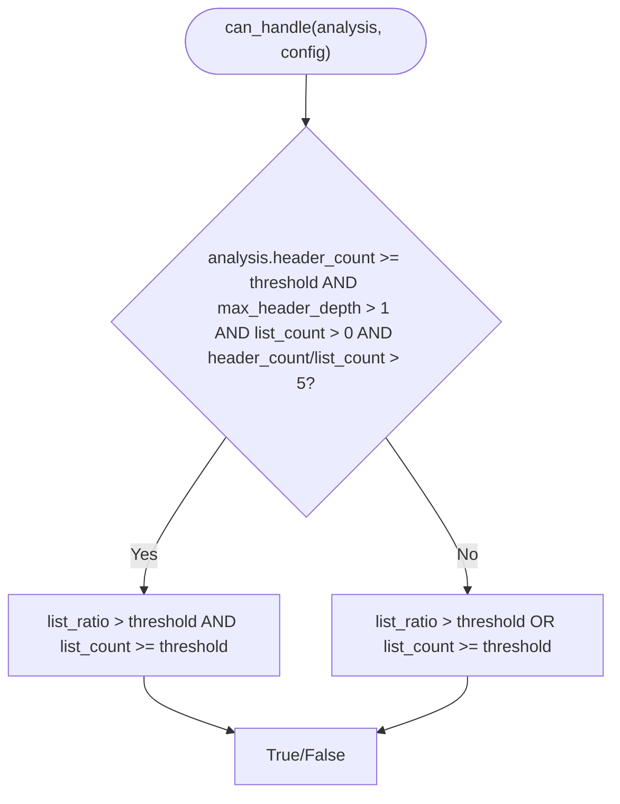

# Strategy Selection Mechanism

<cite>
**Referenced Files in This Document**
- [__init__.py](file://src/chunkana/strategies/__init__.py)
- [base.py](file://src/chunkana/strategies/base.py)
- [code_aware.py](file://src/chunkana/strategies/code_aware.py)
- [list_aware.py](file://src/chunkana/strategies/list_aware.py)
- [structural.py](file://src/chunkana/strategies/structural.py)
- [fallback.py](file://src/chunkana/strategies/fallback.py)
- [types.py](file://src/chunkana/types.py)
- [config.py](file://src/chunkana/config.py)
- [test_strategies.py](file://tests/unit/test_strategies.py)
</cite>

## Table of Contents
1. [Introduction](#introduction)
2. [Project Structure](#project-structure)
3. [Core Components](#core-components)
4. [Architecture Overview](#architecture-overview)
5. [Detailed Component Analysis](#detailed-component-analysis)
6. [Dependency Analysis](#dependency-analysis)
7. [Performance Considerations](#performance-considerations)
8. [Troubleshooting Guide](#troubleshooting-guide)
9. [Conclusion](#conclusion)

## Introduction
This document explains the Strategy Selection Mechanism used by the chunker to automatically pick the best chunking strategy for a given markdown document. It focuses on how StrategySelector implements a priority-based selection process, how ContentAnalysis metrics drive decisions, and how override and fail-safe mechanisms ensure predictable behavior. Concrete examples from the test suite demonstrate how different document types trigger specific strategies.

## Project Structure
The strategy selection logic lives under src/chunkana/strategies and integrates with shared types and configuration.

**Diagram sources**
- [__init__.py](file://src/chunkana/strategies/__init__.py#L20-L78)
- [base.py](file://src/chunkana/strategies/base.py#L1-L120)
- [code_aware.py](file://src/chunkana/strategies/code_aware.py#L1-L60)
- [list_aware.py](file://src/chunkana/strategies/list_aware.py#L1-L60)
- [structural.py](file://src/chunkana/strategies/structural.py#L1-L60)
- [fallback.py](file://src/chunkana/strategies/fallback.py#L1-L40)
- [types.py](file://src/chunkana/types.py#L180-L240)
- [config.py](file://src/chunkana/config.py#L17-L120)

**Section sources**
- [__init__.py](file://src/chunkana/strategies/__init__.py#L1-L78)
- [types.py](file://src/chunkana/types.py#L180-L240)
- [config.py](file://src/chunkana/config.py#L17-L120)

## Core Components
- StrategySelector: Central orchestrator that evaluates strategies in priority order and returns a selected strategy. It also supports override by name and guarantees a fallback strategy is always returned.
- BaseStrategy: Abstract interface defining name, priority, can_handle, and apply methods used by all strategies.
- Strategy implementations:
  - CodeAwareStrategy: Highest priority; selects when code blocks or tables are present or when code_ratio exceeds a threshold.
  - ListAwareStrategy: Second priority; selects for list-heavy content, with nuanced thresholds depending on document structure.
  - StructuralStrategy: Third priority; selects for hierarchical documents with sufficient headers and depth.
  - FallbackStrategy: Lowest priority; universal fallback that preserves atomic blocks and splits text safely.
- ContentAnalysis: Provides metrics and extracted elements used by strategies to decide whether they can handle a document.
- ChunkConfig: Supplies thresholds and overrides influencing strategy selection.

**Section sources**
- [__init__.py](file://src/chunkana/strategies/__init__.py#L20-L78)
- [base.py](file://src/chunkana/strategies/base.py#L1-L120)
- [code_aware.py](file://src/chunkana/strategies/code_aware.py#L1-L60)
- [list_aware.py](file://src/chunkana/strategies/list_aware.py#L1-L60)
- [structural.py](file://src/chunkana/strategies/structural.py#L1-L60)
- [fallback.py](file://src/chunkana/strategies/fallback.py#L1-L40)
- [types.py](file://src/chunkana/types.py#L180-L240)
- [config.py](file://src/chunkana/config.py#L77-L120)

## Architecture Overview
The selection flow is deterministic and layered: override first, then priority evaluation, then fallback.

**Diagram sources**
- [__init__.py](file://src/chunkana/strategies/__init__.py#L39-L78)
- [config.py](file://src/chunkana/config.py#L92-L94)
- [base.py](file://src/chunkana/strategies/base.py#L38-L66)

## Detailed Component Analysis

### StrategySelector: Priority-Based Selection
- Initialization builds a fixed list of strategies in priority order: CodeAwareStrategy, ListAwareStrategy, StructuralStrategy, FallbackStrategy.
- select method:
  - Checks config.strategy_override first and returns the named strategy immediately if present.
  - Iterates strategies in priority order and returns the first that can_handle returns True.
  - If none match, returns the fallback strategy (guaranteed to accept any document).
- get_by_name:
  - Iterates strategies by name and raises an error if unknown.

**Diagram sources**
- [__init__.py](file://src/chunkana/strategies/__init__.py#L39-L78)

**Section sources**
- [__init__.py](file://src/chunkana/strategies/__init__.py#L20-L78)

### CodeAwareStrategy: Priority 1
- Purpose: Handles documents with code blocks or tables, or when code_ratio exceeds the configured threshold.
- Decision logic: analysis.code_block_count >= 1 OR analysis.table_count >= 1 OR analysis.code_ratio >= config.code_threshold.
- Implementation highlights:
  - Supports two modes: without code-context binding and with enhanced binding.
  - Preserves atomic blocks (code, tables, LaTeX) and ensures fence balance.
  - Uses table grouping when enabled and creates chunks with appropriate metadata.

**Diagram sources**
- [code_aware.py](file://src/chunkana/strategies/code_aware.py#L32-L41)
- [config.py](file://src/chunkana/config.py#L86-L91)
- [types.py](file://src/chunkana/types.py#L190-L220)

**Section sources**
- [code_aware.py](file://src/chunkana/strategies/code_aware.py#L1-L120)
- [types.py](file://src/chunkana/types.py#L180-L240)
- [config.py](file://src/chunkana/config.py#L86-L91)

### ListAwareStrategy: Priority 2
- Purpose: Handles list-heavy documents.
- Decision logic:
  - For strongly structured documents (many headers and deep hierarchy), requires both list_ratio > threshold AND list_count >= threshold.
  - For non-structured documents, either condition is sufficient.
- Implementation highlights:
  - Preserves nested list hierarchies.
  - Binds introductory paragraphs to lists when appropriate.
  - Splits large lists while preserving hierarchy and marks oversize chunks when needed.

**Diagram sources**
- [list_aware.py](file://src/chunkana/strategies/list_aware.py#L48-L90)
- [config.py](file://src/chunkana/config.py#L88-L91)

**Section sources**
- [list_aware.py](file://src/chunkana/strategies/list_aware.py#L1-L120)
- [config.py](file://src/chunkana/config.py#L88-L91)

### StructuralStrategy: Priority 3
- Purpose: Handles hierarchical documents with sufficient headers and depth.
- Decision logic: analysis.header_count >= config.structure_threshold AND analysis.max_header_depth > 1.
- Implementation highlights:
  - Splits by headers while preserving header hierarchy.
  - Computes header_path and section_tags metadata.
  - Splits large sections while preserving atomic blocks when present.

**Diagram sources**
- [structural.py](file://src/chunkana/strategies/structural.py#L52-L57)
- [config.py](file://src/chunkana/config.py#L86-L91)
- [types.py](file://src/chunkana/types.py#L190-L220)

**Section sources**
- [structural.py](file://src/chunkana/strategies/structural.py#L1-L120)
- [config.py](file://src/chunkana/config.py#L86-L91)
- [types.py](file://src/chunkana/types.py#L190-L220)

### FallbackStrategy: Priority 4 (Universal)
- Purpose: Ensures a strategy is always available.
- Decision logic: Always returns True.
- Implementation highlights:
  - Splits by paragraph boundaries and groups to fit max_chunk_size.
  - Preserves atomic blocks when present and sets oversize metadata when needed.

**Diagram sources**
- [fallback.py](file://src/chunkana/strategies/fallback.py#L31-L34)

**Section sources**
- [fallback.py](file://src/chunkana/strategies/fallback.py#L1-L120)

### Metrics That Influence Strategy Selection
- CodeAwareStrategy relies on:
  - code_block_count, table_count, code_ratio from ContentAnalysis.
  - code_threshold from ChunkConfig.
- ListAwareStrategy relies on:
  - list_ratio, list_count, list_item_count, max_list_depth from ContentAnalysis.
  - list_ratio_threshold, list_count_threshold from ChunkConfig.
- StructuralStrategy relies on:
  - header_count, max_header_depth from ContentAnalysis.
  - structure_threshold from ChunkConfig.

These metrics are computed during parsing and passed to strategies via ContentAnalysis.

**Section sources**
- [types.py](file://src/chunkana/types.py#L180-L240)
- [config.py](file://src/chunkana/config.py#L86-L91)
- [code_aware.py](file://src/chunkana/strategies/code_aware.py#L32-L41)
- [list_aware.py](file://src/chunkana/strategies/list_aware.py#L48-L90)
- [structural.py](file://src/chunkana/strategies/structural.py#L52-L57)

### Override and Fail-Safe Behavior
- Override:
  - StrategySelector.get_by_name returns the strategy instance by name when config.strategy_override is set.
  - ChunkConfig validates strategy_override against known strategy names.
- Fail-safe:
  - StrategySelector always returns a strategy; if none match, it returns the fallback strategy.

Concrete examples from tests:
- Overriding to code_aware or fallback forces selection regardless of metrics.
- Documents with headers select structural; documents with lists select list_aware; documents with code or tables select code_aware; plain text selects fallback.

**Section sources**
- [__init__.py](file://src/chunkana/strategies/__init__.py#L62-L78)
- [config.py](file://src/chunkana/config.py#L175-L184)
- [test_strategies.py](file://tests/unit/test_strategies.py#L138-L163)
- [test_strategies.py](file://tests/unit/test_strategies.py#L15-L123)

## Dependency Analysis
The strategies depend on shared abstractions and types, and StrategySelector composes them.

**Diagram sources**
- [__init__.py](file://src/chunkana/strategies/__init__.py#L20-L78)
- [base.py](file://src/chunkana/strategies/base.py#L1-L120)
- [code_aware.py](file://src/chunkana/strategies/code_aware.py#L1-L60)
- [list_aware.py](file://src/chunkana/strategies/list_aware.py#L1-L60)
- [structural.py](file://src/chunkana/strategies/structural.py#L1-L60)
- [fallback.py](file://src/chunkana/strategies/fallback.py#L1-L40)

**Section sources**
- [__init__.py](file://src/chunkana/strategies/__init__.py#L20-L78)
- [base.py](file://src/chunkana/strategies/base.py#L1-L120)

## Performance Considerations
- Sequential evaluation cost: StrategySelector iterates strategies in order until a match is found. With four strategies, worst-case is constant-time overhead proportional to strategy count.
- Early exit: The first strategy that can_handle returns True terminates evaluation, minimizing unnecessary checks.
- Priority ordering matters: Correct ordering ensures optimal strategy selection and avoids misclassification. For example, code-heavy documents should not be treated as structural or list-heavy.
- Atomic block handling: Strategies that preserve atomic blocks (code, tables, LaTeX) avoid expensive re-parsing and rely on precomputed ranges from ContentAnalysis, reducing overhead.

[No sources needed since this section provides general guidance]

## Troubleshooting Guide
Common issues and resolutions:
- Unexpected strategy selection:
  - Verify ContentAnalysis metrics (code_block_count, table_count, code_ratio, list_ratio, header_count, max_header_depth) align with expectations.
  - Confirm thresholds in ChunkConfig meet your content characteristics.
- Override not taking effect:
  - Ensure strategy_override is one of the supported names: code_aware, list_aware, structural, fallback.
  - Validate that ChunkConfig is passed to StrategySelector.select.
- Oversized chunks:
  - Strategies mark chunks as oversize when preserving atomic blocks causes exceedance; confirm max_chunk_size and review strategy metadata for allow_oversize reasons.
- Fence balance errors:
  - Some strategies ensure balanced code fences; if unbalanced, chunks may be merged or flagged with error metadata.

**Section sources**
- [config.py](file://src/chunkana/config.py#L175-L184)
- [base.py](file://src/chunkana/strategies/base.py#L90-L167)
- [code_aware.py](file://src/chunkana/strategies/code_aware.py#L167-L175)
- [structural.py](file://src/chunkana/strategies/structural.py#L528-L596)
- [fallback.py](file://src/chunkana/strategies/fallback.py#L117-L187)

## Conclusion
The Strategy Selection Mechanism provides a robust, predictable way to choose the right chunking strategy. StrategySelector’s priority-based evaluation, combined with ContentAnalysis-driven thresholds and a fail-safe fallback, ensures reliable behavior across diverse document types. Overrides offer explicit control, while the priority order guarantees optimal selection for typical content patterns.