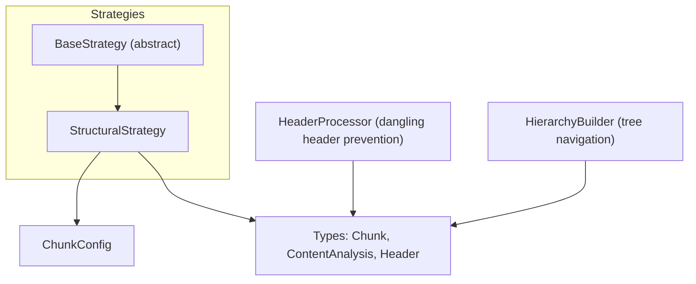
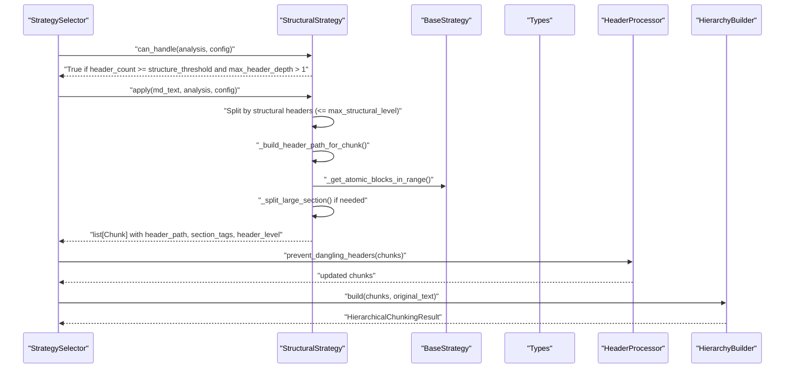
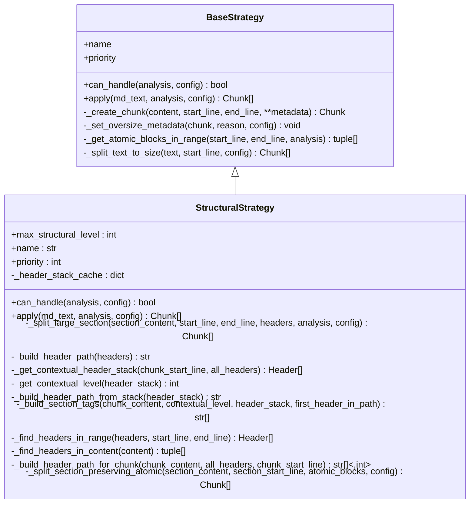
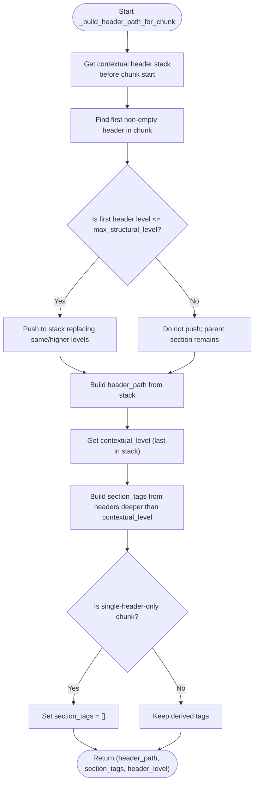
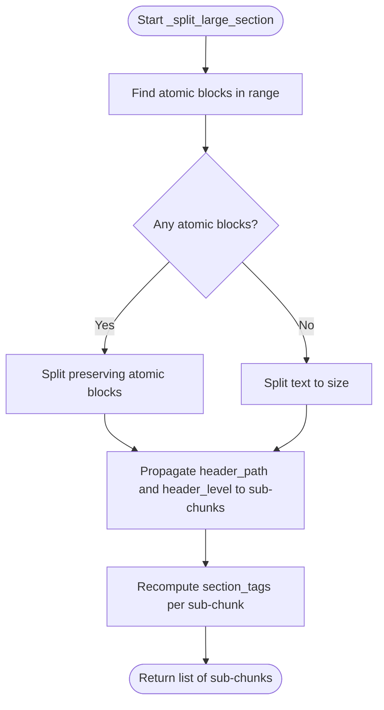
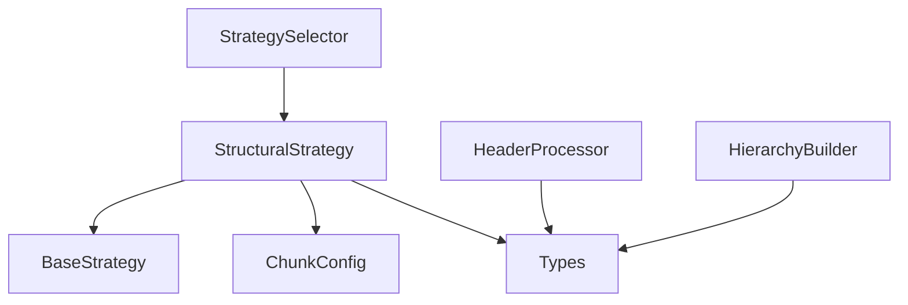

# Structural Strategy

<cite>
**Referenced Files in This Document**
- [structural.py](file://src/chunkana/strategies/structural.py)
- [base.py](file://src/chunkana/strategies/base.py)
- [config.py](file://src/chunkana/config.py)
- [types.py](file://src/chunkana/types.py)
- [header_processor.py](file://src/chunkana/header_processor.py)
- [hierarchy.py](file://src/chunkana/hierarchy.py)
- [test_strategies.py](file://tests/unit/test_strategies.py)
- [structural.md](file://tests/baseline/fixtures/structural.md)
</cite>

## Table of Contents
1. [Introduction](#introduction)
2. [Project Structure](#project-structure)
3. [Core Components](#core-components)
4. [Architecture Overview](#architecture-overview)
5. [Detailed Component Analysis](#detailed-component-analysis)
6. [Dependency Analysis](#dependency-analysis)
7. [Performance Considerations](#performance-considerations)
8. [Troubleshooting Guide](#troubleshooting-guide)
9. [Conclusion](#conclusion)
10. [Appendices](#appendices)

## Introduction
The Structural Strategy is designed for documents with hierarchical headers. It splits documents by header boundaries up to a configurable structural depth, preserving the document’s hierarchy in chunk metadata. It produces chunks with:
- header_path: breadcrumb-like path indicating the structural context (e.g., “/Introduction/Setup/Configuration”)
- section_tags: header texts of deeper-level headers within each chunk
- header_level: the level of the root header used for header_path
- content_type: “section” for structural chunks, “preamble” for pre-first-header content

It also handles large sections by preserving atomic blocks (code, tables, LaTeX) and ensures sub-chunks inherit the parent section’s header_path. A performance optimization caches header stacks to avoid repeated hierarchy computations.

## Project Structure
The Structural Strategy lives under strategies and integrates with the chunking pipeline via the base strategy interface. It relies on configuration for thresholds and limits, and on shared types for headers and chunks.

**Diagram sources**
- [structural.py](file://src/chunkana/strategies/structural.py#L1-L120)
- [base.py](file://src/chunkana/strategies/base.py#L1-L120)
- [config.py](file://src/chunkana/config.py#L17-L120)
- [types.py](file://src/chunkana/types.py#L120-L220)
- [header_processor.py](file://src/chunkana/header_processor.py#L1-L120)
- [hierarchy.py](file://src/chunkana/hierarchy.py#L230-L320)

**Section sources**
- [structural.py](file://src/chunkana/strategies/structural.py#L1-L120)
- [base.py](file://src/chunkana/strategies/base.py#L1-L120)
- [config.py](file://src/chunkana/config.py#L17-L120)
- [types.py](file://src/chunkana/types.py#L120-L220)

## Core Components
- StructuralStrategy: Implements header-aware splitting, breadcrumb header_path construction, section_tags derivation, and large-section splitting with atomic-block preservation.
- BaseStrategy: Defines the common interface and shared helpers (chunk creation, oversize marking, atomic block discovery, paragraph-based splitting).
- ChunkConfig: Holds configuration including structure_threshold and max_structural_level.
- Types: Defines Chunk, ContentAnalysis, and Header used across strategies.
- HeaderProcessor: Prevents dangling headers across chunk boundaries and updates header_path metadata accordingly.
- HierarchyBuilder: Builds parent-child-sibling relationships using header_path metadata for hierarchical navigation.

**Section sources**
- [structural.py](file://src/chunkana/strategies/structural.py#L1-L120)
- [base.py](file://src/chunkana/strategies/base.py#L60-L120)
- [config.py](file://src/chunkana/config.py#L17-L120)
- [types.py](file://src/chunkana/types.py#L120-L220)
- [header_processor.py](file://src/chunkana/header_processor.py#L1-L120)
- [hierarchy.py](file://src/chunkana/hierarchy.py#L230-L320)

## Architecture Overview
The Structural Strategy participates in the chunking pipeline by:
- Selecting itself when a document has sufficient headers and hierarchy
- Splitting by structural headers up to max_structural_level
- Building header_path from the contextual header stack
- Deriving section_tags from deeper-level headers within each chunk
- Preserving atomic blocks when sections are large
- Ensuring sub-chunks inherit the parent section’s header_path

**Diagram sources**
- [structural.py](file://src/chunkana/strategies/structural.py#L52-L150)
- [base.py](file://src/chunkana/strategies/base.py#L168-L210)
- [header_processor.py](file://src/chunkana/header_processor.py#L400-L474)
- [hierarchy.py](file://src/chunkana/hierarchy.py#L233-L320)

## Detailed Component Analysis

### StructuralStrategy: Role and Processing Logic
- Priority: 3 (used when document has headers but no code/tables)
- Activation: requires header_count >= structure_threshold and max_header_depth > 1
- Splitting:
  - Filters headers to structural headers (level <= max_structural_level)
  - Splits sections bounded by structural headers
  - For large sections, preserves atomic blocks (code, tables, LaTeX) and sets oversize reasons
- Metadata:
  - header_path: breadcrumb path built from contextual header stack
  - section_tags: header texts of deeper-level headers within the chunk
  - header_level: level of the root header used for header_path
  - content_type: “section” or “preamble”

Key methods and responsibilities:
- can_handle: checks header count and max depth
- apply: orchestrates preamble handling, structural splitting, and large-section splitting
- _build_header_path_for_chunk: constructs header_path and section_tags with nuanced rules
- _split_large_section: preserves atomic blocks and propagates header_path to sub-chunks
- _get_contextual_header_stack: builds header stack before chunk start (cached)
- _build_header_path_from_stack: converts stack to header_path
- _build_section_tags: derives section_tags relative to contextual_level
- _find_headers_in_content/_find_headers_in_range: header discovery helpers
- _split_section_preserving_atomic: atomic-block-aware splitting

**Diagram sources**
- [structural.py](file://src/chunkana/strategies/structural.py#L1-L200)
- [base.py](file://src/chunkana/strategies/base.py#L1-L120)

**Section sources**
- [structural.py](file://src/chunkana/strategies/structural.py#L1-L200)
- [base.py](file://src/chunkana/strategies/base.py#L60-L120)

### Header Path Construction and Special Cases
- Contextual header stack:
  - Built from all headers occurring before the chunk start line
  - Levels are filtered only for determining chunk boundaries (max_structural_level), not for header_path
  - Cached by chunk start line to avoid recomputation
- First header handling:
  - If the first non-empty line in a chunk is a header with level <= max_structural_level, it is added to the stack
  - If it is deeper (H3+), it goes into section_tags, not header_path
  - Single-header-only chunks have empty section_tags
- header_path:
  - Derived from the contextual stack; empty string when no headers
  - Special case for preamble: “/__preamble__”
- section_tags:
  - Relative to contextual_level (last header in header_path)
  - Excludes root section header and the first header added to path from this chunk

**Diagram sources**
- [structural.py](file://src/chunkana/strategies/structural.py#L434-L527)

**Section sources**
- [structural.py](file://src/chunkana/strategies/structural.py#L235-L386)
- [structural.py](file://src/chunkana/strategies/structural.py#L434-L527)

### Large Sections and Atomic Blocks Preservation
- Large sections are split while preserving atomic blocks (code, tables, LaTeX) to maintain integrity
- If atomic blocks are present, the section is split around them; otherwise, paragraph-based splitting is used
- Oversize metadata is set with reasons like “section_integrity”, “code_block_integrity”, “table_integrity”, or “latex_integrity”
- Sub-chunks inherit the parent section’s header_path and header_level

**Diagram sources**
- [structural.py](file://src/chunkana/strategies/structural.py#L152-L203)
- [base.py](file://src/chunkana/strategies/base.py#L168-L209)

**Section sources**
- [structural.py](file://src/chunkana/strategies/structural.py#L152-L203)
- [base.py](file://src/chunkana/strategies/base.py#L168-L209)

### Performance Optimization: _header_stack_cache
- Purpose: Avoid redundant computation of contextual header stacks for consecutive chunks that share the same header context
- Mechanism: Cache keyed by chunk start line; populated and reused during header stack construction
- Benefit: Reduces repeated hierarchy building across adjacent chunks

**Section sources**
- [structural.py](file://src/chunkana/strategies/structural.py#L235-L283)

### Configuration Options
- structure_threshold: Minimum number of headers required to activate Structural Strategy
- max_structural_level: Maximum header level included in header_path; deeper headers go into section_tags
- Other relevant config:
  - max_chunk_size, min_chunk_size, overlap_size
  - preserve_atomic_blocks, extract_preamble
  - strategy_override

These options influence strategy selection and chunk sizing behavior.

**Section sources**
- [config.py](file://src/chunkana/config.py#L17-L120)
- [config.py](file://src/chunkana/config.py#L38-L44)

### Examples from Tests
- Header-rich documents that trigger Structural Strategy:
  - A multi-section document with H1 and H2 headers
  - A document with deep hierarchy (H3/H4) to demonstrate section_tags behavior
- Tests confirm:
  - Strategy selection chooses structural for header-rich documents
  - header_path metadata is present on chunks
  - Hierarchy preservation is maintained

**Section sources**
- [test_strategies.py](file://tests/unit/test_strategies.py#L221-L269)
- [structural.md](file://tests/baseline/fixtures/structural.md#L1-L50)

## Dependency Analysis
- StructuralStrategy depends on:
  - BaseStrategy for shared helpers and chunk creation
  - ChunkConfig for thresholds and limits
  - Types for Chunk, ContentAnalysis, Header
- Integration points:
  - StrategySelector selects StructuralStrategy when can_handle returns True
  - HeaderProcessor runs post-chunking to prevent dangling headers and update header_path metadata
  - HierarchyBuilder uses header_path to build parent-child-sibling relationships

**Diagram sources**
- [structural.py](file://src/chunkana/strategies/structural.py#L1-L120)
- [base.py](file://src/chunkana/strategies/base.py#L1-L120)
- [config.py](file://src/chunkana/config.py#L17-L120)
- [types.py](file://src/chunkana/types.py#L120-L220)
- [header_processor.py](file://src/chunkana/header_processor.py#L400-L474)
- [hierarchy.py](file://src/chunkana/hierarchy.py#L233-L320)

**Section sources**
- [structural.py](file://src/chunkana/strategies/structural.py#L1-L120)
- [base.py](file://src/chunkana/strategies/base.py#L1-L120)
- [config.py](file://src/chunkana/config.py#L17-L120)
- [types.py](file://src/chunkana/types.py#L120-L220)
- [header_processor.py](file://src/chunkana/header_processor.py#L400-L474)
- [hierarchy.py](file://src/chunkana/hierarchy.py#L233-L320)

## Performance Considerations
- Header stack caching reduces repeated hierarchy computations for adjacent chunks
- Paragraph-based splitting minimizes fragmentation while respecting size limits
- Atomic-block preservation avoids expensive re-parsing and maintains content integrity
- Oversize metadata allows downstream systems to handle oversized chunks appropriately

[No sources needed since this section provides general guidance]

## Troubleshooting Guide
- Unexpected empty header_path:
  - Ensure the document has headers; if not, Structural Strategy falls back to text splitting
  - Verify max_structural_level is set appropriately
- section_tags unexpectedly empty:
  - For single-header-only chunks, section_tags is intentionally empty
  - Confirm contextual_level logic and that deeper headers exist within the chunk
- Oversized chunks:
  - Oversize metadata is set with reasons like “section_integrity” or “code_block_integrity”
  - Adjust max_chunk_size or reduce content density in problematic sections
- Dangling headers:
  - Use HeaderProcessor to move headers between chunks or merge when safe
  - Re-run HierarchyBuilder to update parent-child relationships if header_path changed

**Section sources**
- [structural.py](file://src/chunkana/strategies/structural.py#L152-L203)
- [base.py](file://src/chunkana/strategies/base.py#L90-L118)
- [header_processor.py](file://src/chunkana/header_processor.py#L240-L371)
- [hierarchy.py](file://src/chunkana/hierarchy.py#L374-L422)

## Conclusion
The Structural Strategy provides robust, header-aware chunking with breadcrumb navigation via header_path and contextual tagging via section_tags. Its design balances hierarchy preservation with performance, using cached header stacks and atomic-block-aware splitting. Configuration options allow tuning for different document styles, and integration with HeaderProcessor and HierarchyBuilder ensures clean, navigable chunk hierarchies.

[No sources needed since this section summarizes without analyzing specific files]

## Appendices

### Configuration Reference
- structure_threshold: Minimum header count to activate Structural Strategy
- max_structural_level: Maximum header level included in header_path
- max_chunk_size/min_chunk_size/overlap_size: Size and overlap controls
- preserve_atomic_blocks, extract_preamble: Behavioral toggles
- strategy_override: Force a specific strategy

**Section sources**
- [config.py](file://src/chunkana/config.py#L17-L120)