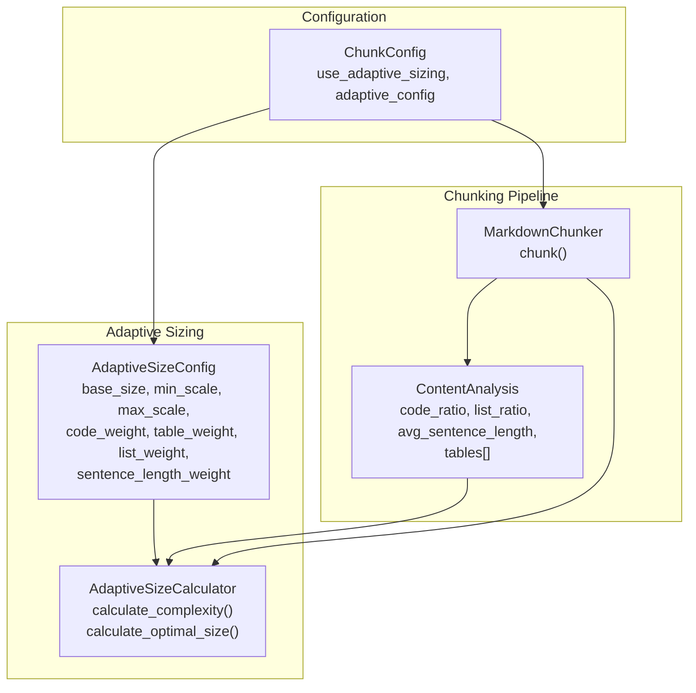
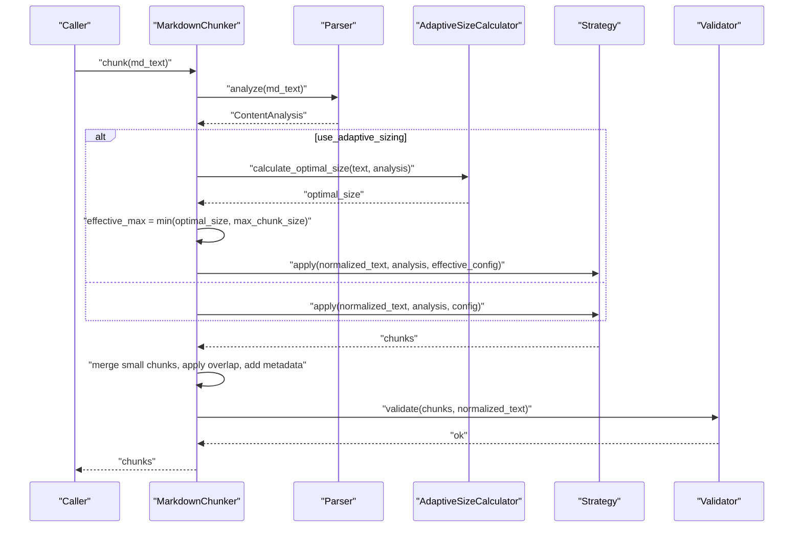
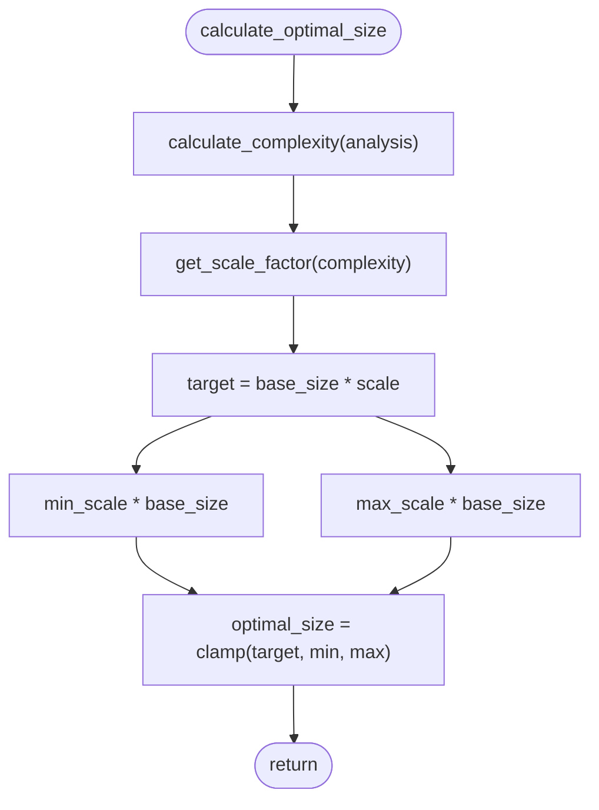
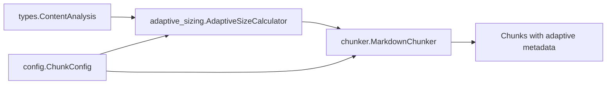

# Adaptive Sizing

<cite>
**Referenced Files in This Document**
- [adaptive_sizing.py](file://src/chunkana/adaptive_sizing.py)
- [config.py](file://src/chunkana/config.py)
- [chunker.py](file://src/chunkana/chunker.py)
- [types.py](file://src/chunkana/types.py)
- [config.md](file://docs/config.md)
- [adaptive_sizing.md](file://tests/baseline/fixtures/adaptive_sizing.md)
- [adaptive_sizing.jsonl](file://tests/baseline/golden_canonical/adaptive_sizing.jsonl)
- [code_heavy.jsonl](file://tests/baseline/golden_canonical/code_heavy.jsonl)
</cite>

## Table of Contents
1. [Introduction](#introduction)
2. [Project Structure](#project-structure)
3. [Core Components](#core-components)
4. [Architecture Overview](#architecture-overview)
5. [Detailed Component Analysis](#detailed-component-analysis)
6. [Dependency Analysis](#dependency-analysis)
7. [Performance Considerations](#performance-considerations)
8. [Troubleshooting Guide](#troubleshooting-guide)
9. [Conclusion](#conclusion)
10. [Appendices](#appendices)

## Introduction
Adaptive sizing adjusts chunk sizes dynamically based on content complexity. It uses a content analysis to compute a complexity score and then derives an optimal chunk size that respects global limits. This ensures that dense content (e.g., code-heavy or table-heavy) receives larger chunks while simpler text remains compact, improving retrieval quality and context preservation.

## Project Structure
Adaptive sizing spans several modules:
- Configuration and defaults live in the configuration module.
- The adaptive sizing engine resides in the adaptive sizing module.
- The chunker integrates adaptive sizing into the chunking pipeline.
- Types define the content analysis used by the adaptive sizing engine.

**Diagram sources**
- [config.py](file://src/chunkana/config.py#L17-L127)
- [adaptive_sizing.py](file://src/chunkana/adaptive_sizing.py#L14-L197)
- [chunker.py](file://src/chunkana/chunker.py#L85-L177)
- [types.py](file://src/chunkana/types.py#L181-L239)

**Section sources**
- [config.py](file://src/chunkana/config.py#L17-L127)
- [adaptive_sizing.py](file://src/chunkana/adaptive_sizing.py#L14-L197)
- [chunker.py](file://src/chunkana/chunker.py#L85-L177)
- [types.py](file://src/chunkana/types.py#L181-L239)

## Core Components
- ChunkConfig: Holds global chunking parameters and toggles adaptive sizing. When adaptive sizing is enabled, it also holds the AdaptiveSizeConfig instance.
- AdaptiveSizeConfig: Defines the adaptive sizing profile with base_size, min_scale, max_scale, and weights for code, tables, lists, and sentence length.
- AdaptiveSizeCalculator: Computes content complexity and optimal chunk size from ContentAnalysis.
- ContentAnalysis: Provides metrics used by AdaptiveSizeCalculator (code_ratio, list_ratio, avg_sentence_length, tables).
- MarkdownChunker: Integrates adaptive sizing into the chunking pipeline, computes effective limits, and enriches chunks with adaptive metadata.

**Section sources**
- [config.py](file://src/chunkana/config.py#L17-L127)
- [adaptive_sizing.py](file://src/chunkana/adaptive_sizing.py#L14-L197)
- [types.py](file://src/chunkana/types.py#L181-L239)
- [chunker.py](file://src/chunkana/chunker.py#L85-L177)

## Architecture Overview
Adaptive sizing runs during chunking:
1. The chunker parses the document and obtains a ContentAnalysis.
2. If adaptive sizing is enabled, it computes a complexity score and an optimal size.
3. The effective max_chunk_size is capped by the configured max_chunk_size.
4. The strategy is selected and applied with the effective configuration.
5. Final metadata includes adaptive_size, content_complexity, and size_scale_factor.

**Diagram sources**
- [chunker.py](file://src/chunkana/chunker.py#L85-L177)
- [adaptive_sizing.py](file://src/chunkana/adaptive_sizing.py#L120-L168)
- [types.py](file://src/chunkana/types.py#L181-L239)

## Detailed Component Analysis

### AdaptiveSizeConfig
AdaptiveSizeConfig defines the adaptive sizing profile:
- base_size: Base chunk size for medium complexity content.
- min_scale: Minimum scaling factor (simple text).
- max_scale: Maximum scaling factor (complex code).
- code_weight: Weight for code ratio in complexity calculation.
- table_weight: Weight for table ratio in complexity calculation.
- list_weight: Weight for list ratio in complexity calculation.
- sentence_length_weight: Weight for sentence length in complexity calculation.

Validation enforces:
- Positive base_size, min_scale, max_scale.
- min_scale < max_scale.
- Non-negative weights.
- Weights sum to approximately 1.0.

Serialization helpers convert to/from dictionaries for persistence and round-tripping.

**Section sources**
- [adaptive_sizing.py](file://src/chunkana/adaptive_sizing.py#L14-L101)

### AdaptiveSizeCalculator
The calculator computes:
- Complexity score from ContentAnalysis using weighted factors.
- Scale factor mapped from complexity to [min_scale, max_scale].
- Optimal size = base_size × scale_factor, clamped to [min_scale×base_size, max_scale×base_size].

It also computes table ratio from ContentAnalysis tables.

**Diagram sources**
- [adaptive_sizing.py](file://src/chunkana/adaptive_sizing.py#L120-L168)

**Section sources**
- [adaptive_sizing.py](file://src/chunkana/adaptive_sizing.py#L103-L197)

### ContentAnalysis
ContentAnalysis supplies the inputs for complexity scoring:
- code_ratio, list_ratio, avg_sentence_length.
- tables list used to compute table ratio.
- Additional metrics and element counts.

These fields are populated by the parser and passed to AdaptiveSizeCalculator.

**Section sources**
- [types.py](file://src/chunkana/types.py#L181-L239)

### ChunkConfig and Adaptive Sizing Integration
ChunkConfig controls adaptive sizing:
- use_adaptive_sizing: Enables adaptive sizing.
- adaptive_config: Instance of AdaptiveSizeConfig (auto-created if enabled).
- Global limits: max_chunk_size and min_chunk_size constrain adaptive results.

Factory methods demonstrate typical profiles:
- with_adaptive_sizing: Default adaptive profile.
- for_code_heavy_adaptive: Emphasizes code_weight and higher max_scale.
- for_text_heavy_adaptive: Emphasizes sentence_length_weight and lower max_scale.

**Section sources**
- [config.py](file://src/chunkana/config.py#L17-L127)
- [config.py](file://src/chunkana/config.py#L354-L407)

### MarkdownChunker Integration
During chunk():
- If adaptive sizing is enabled, the chunker calculates optimal_size and effective_max.
- Effective configuration replaces max_chunk_size with the effective cap to respect global limits.
- After strategy application, adaptive metadata is attached to each chunk.

Overlap behavior remains independent but uses effective overlap caps proportional to chunk sizes.

**Section sources**
- [chunker.py](file://src/chunkana/chunker.py#L85-L177)
- [chunker.py](file://src/chunkana/chunker.py#L301-L370)

## Dependency Analysis
Adaptive sizing depends on:
- ContentAnalysis from parsing.
- ChunkConfig for enabling and limits.
- AdaptiveSizeConfig for profile parameters.
- Chunker for pipeline integration and metadata enrichment.

**Diagram sources**
- [types.py](file://src/chunkana/types.py#L181-L239)
- [adaptive_sizing.py](file://src/chunkana/adaptive_sizing.py#L103-L168)
- [config.py](file://src/chunkana/config.py#L17-L127)
- [chunker.py](file://src/chunkana/chunker.py#L85-L177)

**Section sources**
- [types.py](file://src/chunkana/types.py#L181-L239)
- [adaptive_sizing.py](file://src/chunkana/adaptive_sizing.py#L103-L168)
- [config.py](file://src/chunkana/config.py#L17-L127)
- [chunker.py](file://src/chunkana/chunker.py#L85-L177)

## Performance Considerations
- Complexity computation is O(1) per document; it relies on precomputed ratios and table character counts.
- Adaptive sizing adds negligible overhead compared to parsing and strategy application.
- Effective max_chunk_size ensures downstream strategies and validators operate within configured bounds.

[No sources needed since this section provides general guidance]

## Troubleshooting Guide
Common issues and resolutions:
- Invalid AdaptiveSizeConfig values:
  - Ensure base_size, min_scale, max_scale are positive and min_scale < max_scale.
  - Ensure all weights are non-negative and sum to approximately 1.0.
- Adaptive sizing not taking effect:
  - Verify use_adaptive_sizing is True and adaptive_config is set (or auto-created).
  - Confirm max_chunk_size is sufficiently large to allow larger chunks.
- Unexpected chunk sizes:
  - Inspect content_complexity and size_scale_factor metadata to understand the computed complexity.
  - Adjust weights in AdaptiveSizeConfig to reflect content priorities (e.g., increase code_weight for code-heavy content).

**Section sources**
- [adaptive_sizing.py](file://src/chunkana/adaptive_sizing.py#L37-L76)
- [config.py](file://src/chunkana/config.py#L203-L208)
- [chunker.py](file://src/chunkana/chunker.py#L117-L172)

## Conclusion
Adaptive sizing provides a principled way to tailor chunk sizes to content complexity. By combining content analysis with a configurable profile, it dynamically balances chunk granularity across diverse content types while honoring global size limits. Users can fine-tune weights and scales to match domain characteristics and achieve optimal retrieval quality.

[No sources needed since this section summarizes without analyzing specific files]

## Appendices

### How use_adaptive_sizing and adaptive_config Work Together
- use_adaptive_sizing toggles whether adaptive sizing is active.
- adaptive_config defines the profile (base_size, min_scale, max_scale, weights).
- When enabled, the chunker computes complexity and optimal size, caps it to max_chunk_size, and applies the resulting effective configuration to strategy selection and chunking.

**Section sources**
- [config.py](file://src/chunkana/config.py#L103-L127)
- [chunker.py](file://src/chunkana/chunker.py#L117-L172)

### AdaptiveSizeConfig Parameters
- base_size: Base chunk size for medium complexity content.
- min_scale: Minimum scaling factor (simple text).
- max_scale: Maximum scaling factor (complex code).
- code_weight: Weight for code ratio in complexity calculation.
- table_weight: Weight for table ratio in complexity calculation.
- list_weight: Weight for list ratio in complexity calculation.
- sentence_length_weight: Weight for sentence length in complexity calculation.

Validation ensures correctness and stability.

**Section sources**
- [adaptive_sizing.py](file://src/chunkana/adaptive_sizing.py#L14-L101)

### Example Profiles and Expected Behavior
- Code-heavy profile:
  - Increase code_weight and max_scale to allow larger chunks for dense code.
  - Typical result: Larger chunks containing code blocks and related explanations.
- Text-heavy profile:
  - Increase sentence_length_weight and reduce max_scale to keep text chunks compact.
  - Typical result: Smaller chunks suited for prose readability.
- Mixed content:
  - Balanced weights produce intermediate chunk sizes; complexity drives dynamic adjustments.

Reference fixtures and golden outputs for representative behaviors:
- Adaptive sizing fixture demonstrates varied densities across sections.
- Golden outputs show code-focused chunking with adaptive metadata.

**Section sources**
- [config.py](file://src/chunkana/config.py#L354-L407)
- [adaptive_sizing.md](file://tests/baseline/fixtures/adaptive_sizing.md#L1-L97)
- [adaptive_sizing.jsonl](file://tests/baseline/golden_canonical/adaptive_sizing.jsonl#L1-L3)
- [code_heavy.jsonl](file://tests/baseline/golden_canonical/code_heavy.jsonl#L1-L2)

### Relationship Between Adaptive Sizing and Fixed Limits
- Adaptive sizing computes an optimal size based on content complexity.
- The effective max_chunk_size is the minimum of the computed optimal size and the configured max_chunk_size.
- This guarantees that adaptive sizing never exceeds global constraints, maintaining system stability and predictable resource usage.

**Section sources**
- [chunker.py](file://src/chunkana/chunker.py#L133-L145)
- [config.py](file://src/chunkana/config.py#L138-L158)