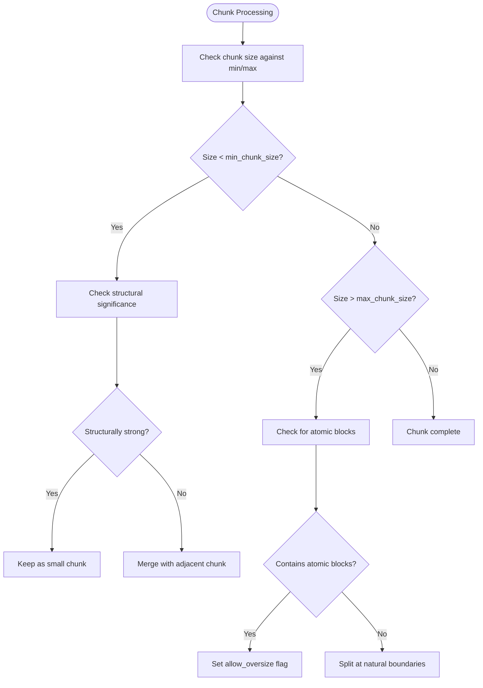
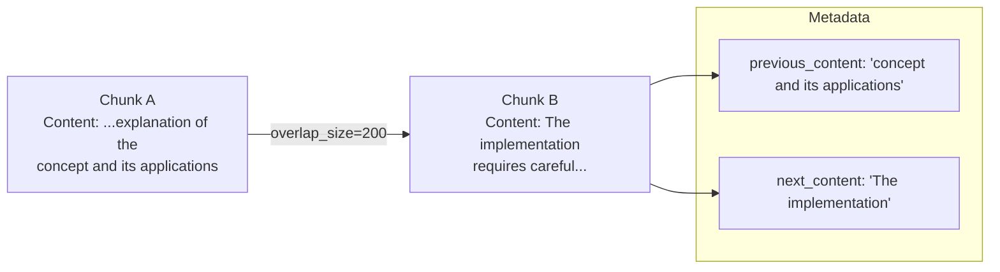
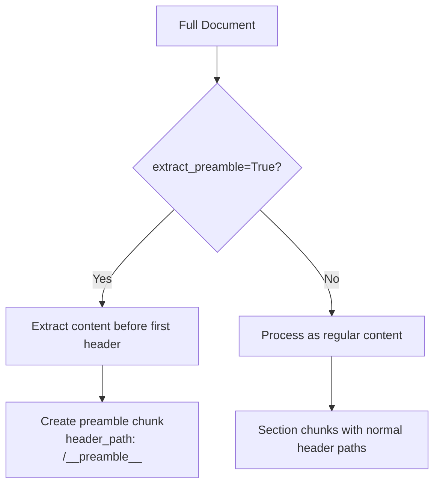
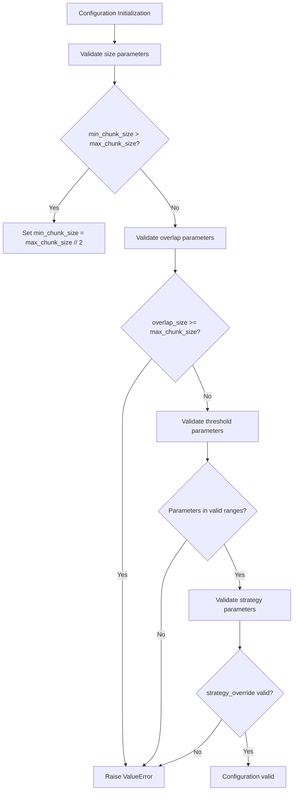
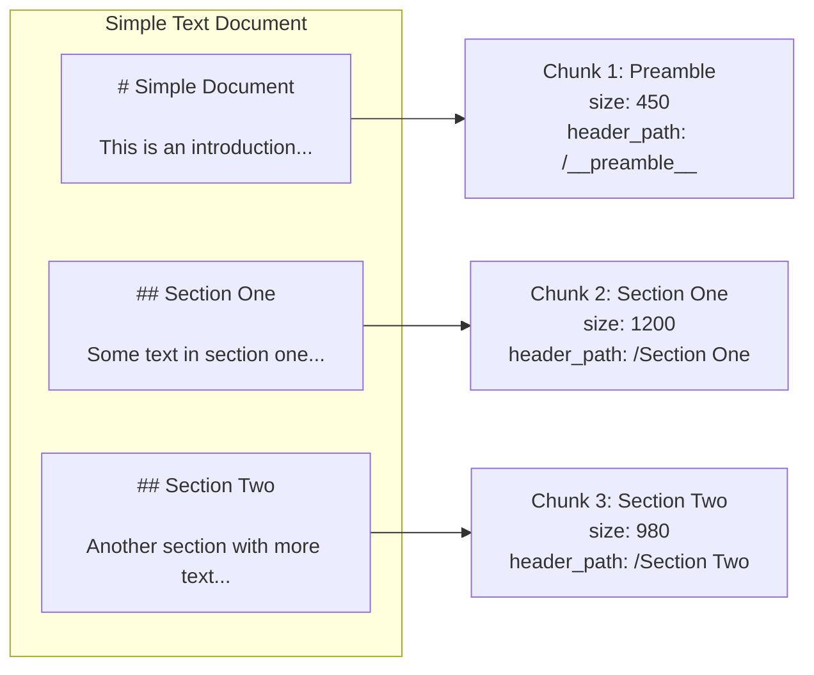
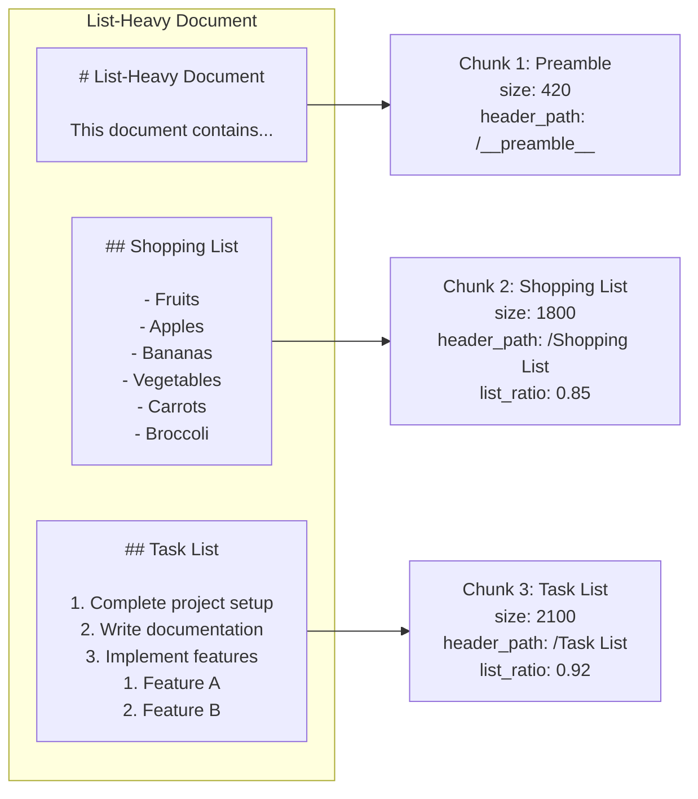
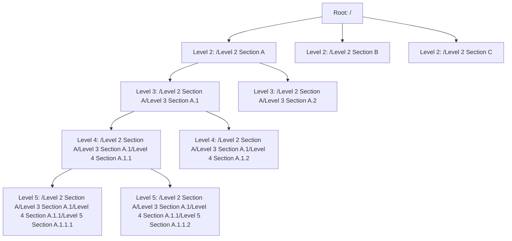
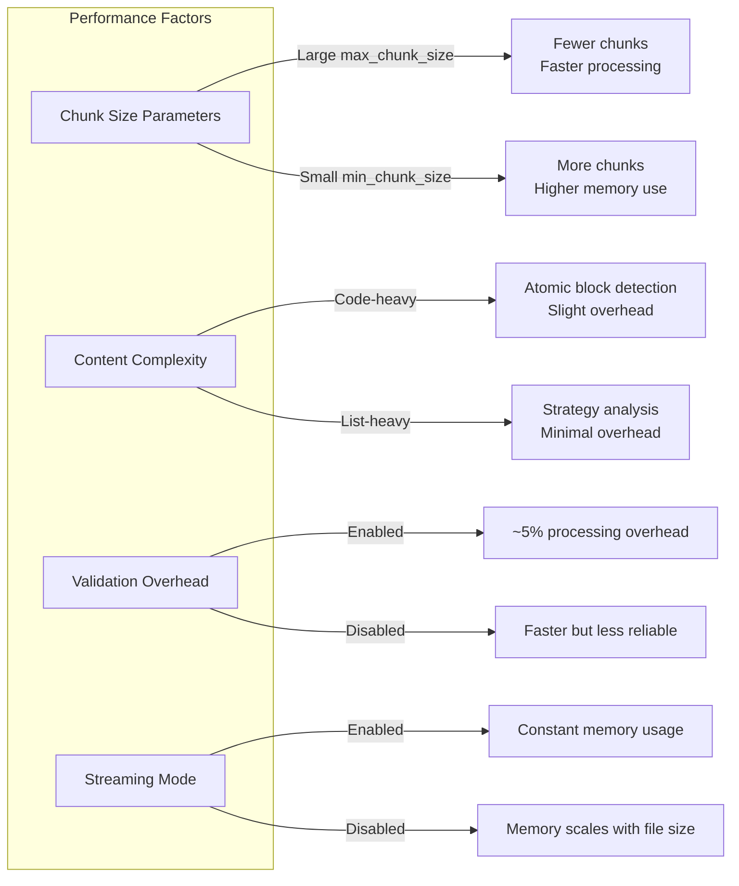

# Basic Parameters

<cite>
**Referenced Files in This Document**   
- [config.py](file://src/chunkana/config.py)
- [chunker.py](file://src/chunkana/chunker.py)
- [types.py](file://src/chunkana/types.py)
- [validator.py](file://src/chunkana/validator.py)
- [test_config.py](file://tests/unit/test_config.py)
- [simple_text.md](file://tests/baseline/fixtures/simple_text.md)
- [code_heavy.md](file://tests/baseline/fixtures/code_heavy.md)
- [list_heavy.md](file://tests/baseline/fixtures/list_heavy.md)
- [headers_deep.md](file://tests/baseline/fixtures/headers_deep.md)
- [config.md](file://docs/config.md)
</cite>

## Table of Contents
1. [Introduction](#introduction)
2. [Core Chunking Parameters](#core-chunking-parameters)
3. [Parameter Validation and Auto-Correction](#parameter-validation-and-auto-correction)
4. [Practical Examples by Document Type](#practical-examples-by-document-type)
5. [Performance Considerations](#performance-considerations)
6. [Common Configuration Mistakes and Solutions](#common-configuration-mistakes-and-solutions)
7. [Conclusion](#conclusion)

## Introduction

The `ChunkConfig` class in Chunkana provides a simplified yet powerful configuration system for controlling how Markdown documents are chunked into smaller segments for retrieval-augmented generation (RAG) systems. This document details the basic parameters that govern the chunking process: `max_chunk_size`, `min_chunk_size`, `overlap_size`, `preserve_atomic_blocks`, and `extract_preamble`. These parameters directly influence the quality, coherence, and usability of the resulting chunks.

The chunking process is designed to balance content preservation with optimal segment size for downstream AI applications. By understanding and properly configuring these parameters, users can tailor the chunking behavior to their specific document types and use cases, from code-heavy technical documentation to structured articles with deep hierarchies.

**Section sources**
- [config.py](file://src/chunkana/config.py#L18-L126)

## Core Chunking Parameters

### max_chunk_size and min_chunk_size

The `max_chunk_size` and `min_chunk_size` parameters define the boundaries for chunk length in characters. These parameters work together to ensure chunks are neither too large to process efficiently nor too small to contain meaningful context.

`max_chunk_size` sets the upper limit for chunk size, with a default value of 4096 characters. This parameter is crucial for ensuring compatibility with language models that have token limits. When a natural content boundary (like a code block or table) exceeds this limit, the chunker may create oversize chunks with the `allow_oversize` flag set to true, preserving the integrity of atomic blocks.

`min_chunk_size` establishes the lower threshold at 512 characters by default. Chunks smaller than this threshold are candidates for merging with adjacent chunks, unless they contain structurally significant content like headers or code blocks. This prevents the creation of micro-chunks that lack sufficient context for meaningful analysis.

The relationship between these parameters is enforced during validation - if `min_chunk_size` exceeds `max_chunk_size`, the system automatically adjusts `min_chunk_size` to half of `max_chunk_size` rather than failing, providing a graceful degradation path.



**Diagram sources**
- [chunker.py](file://src/chunkana/chunker.py#L470-L514)
- [config.py](file://src/chunkana/config.py#L138-L149)

**Section sources**
- [config.py](file://src/chunkana/config.py#L26-L29)
- [chunker.py](file://src/chunkana/chunker.py#L470-L514)

### overlap_size

The `overlap_size` parameter controls the amount of contextual overlap between adjacent chunks, defaulting to 200 characters. Unlike traditional chunking systems that duplicate text between chunks, Chunkana implements a metadata-only overlap model that preserves context without content duplication.

This parameter determines the base context window size for both `previous_content` and `next_content` metadata fields. The actual overlap size is adaptive, capped at a ratio of the adjacent chunk's size defined by `overlap_cap_ratio` (default 0.35). This means the effective overlap is the minimum of `overlap_size` and `chunk_size * overlap_cap_ratio`.

The overlap extraction is word-boundary aware, attempting to break at spaces rather than mid-word. For `previous_content`, it searches for the first space in the first half of the extracted text; for `next_content`, it looks for the last space in the second half. This produces more readable context that respects natural language boundaries.



**Diagram sources**
- [chunker.py](file://src/chunkana/chunker.py#L301-L335)
- [chunker.py](file://src/chunkana/chunker.py#L342-L369)

**Section sources**
- [config.py](file://src/chunkana/config.py#L30-L31)
- [chunker.py](file://src/chunkana/chunker.py#L301-L369)

### preserve_atomic_blocks

The `preserve_atomic_blocks` parameter, enabled by default, ensures that certain content elements remain intact within single chunks rather than being split across boundaries. This parameter protects the semantic integrity of code blocks, tables, and LaTeX formulas, which derive meaning from their complete structure.

When this parameter is true, the chunking algorithm treats fenced code blocks (```), Markdown tables, and LaTeX formulas ($$...$$) as atomic units that cannot be divided. If such a block would be split by a chunk boundary, the entire block is moved to the next chunk. This behavior is essential for maintaining the usability of technical content in RAG systems.

The parameter works in conjunction with the `allow_oversize` mechanism - when an atomic block exceeds `max_chunk_size`, it is still kept intact but flagged accordingly. This prevents situations where a code function or mathematical formula is split in the middle, which would render it meaningless to both humans and AI systems.

```mermaid
classDiagram
class Chunk {
+content : str
+start_line : int
+end_line : int
+metadata : dict
+size : int
}
class FencedBlock {
+language : str
+content : str
+start_line : int
+end_line : int
+is_closed : bool
}
class TableBlock {
+content : str
+start_line : int
+end_line : int
+column_count : int
}
Chunk --> FencedBlock : "contains"
Chunk --> TableBlock : "contains"
note right of Chunk
When preserve_atomic_blocks=True,
FencedBlock and TableBlock instances
remain intact within single chunks
end note
```

**Diagram sources**
- [types.py](file://src/chunkana/types.py#L80-L116)
- [types.py](file://src/chunkana/types.py#L118-L136)

**Section sources**
- [config.py](file://src/chunkana/config.py#L32-L33)
- [types.py](file://src/chunkana/types.py#L80-L136)

### extract_preamble

The `extract_preamble` parameter controls how content before the first header is handled, defaulting to true. When enabled, text that appears before any Markdown header (lines not starting with #) is extracted as a dedicated preamble chunk with the metadata path `/__preamble__`.

This behavior recognizes that introductory content often provides essential context for understanding the document's main sections. By isolating this preamble, the chunking system ensures this contextual information is preserved and easily accessible. The preamble chunk receives special treatment during merging - it will only be merged with other preamble chunks, not with structurally defined sections.

When disabled, preamble content is treated like any other text and may be included in the first section chunk or split according to normal chunking rules. This might be preferred in cases where the pre-header content is minimal or not particularly contextual.

The preamble extraction works in conjunction with the header path system, which uses hierarchical paths like `/Introduction/Background` to represent a chunk's position in the document structure. The preamble chunk occupies its own namespace with the special path `/__preamble__`, making it easily identifiable and retrievable.



**Diagram sources**
- [config.py](file://src/chunkana/config.py#L34-L35)
- [chunker.py](file://src/chunkana/chunker.py#L581-L633)

**Section sources**
- [config.py](file://src/chunkana/config.py#L34-L35)
- [chunker.py](file://src/chunkana/chunker.py#L581-L633)

## Parameter Validation and Auto-Correction

The `ChunkConfig` class includes comprehensive validation logic to ensure configuration parameters are within acceptable ranges and logically consistent. This validation occurs during object initialization through the `__post_init__` method, which calls several specialized validation methods.

The validation system checks multiple aspects of the configuration:
- Size parameters must be positive, with `min_chunk_size` not exceeding `max_chunk_size`
- Overlap parameters must be non-negative and less than `max_chunk_size`
- Threshold parameters must fall within their expected ranges (0-1 for ratios, positive integers for counts)
- Strategy overrides must be one of the valid strategy names

Rather than failing on invalid configurations, the system implements auto-correction behavior for certain conditions. Most notably, when `min_chunk_size` exceeds `max_chunk_size`, the system automatically adjusts `min_chunk_size` to half of `max_chunk_size` instead of raising an exception. This graceful degradation allows the system to continue functioning with a reasonable configuration even when users make mistakes.

For other invalid values, the system raises descriptive `ValueError` exceptions with messages that explain the problem and the invalid value provided. This immediate feedback helps users correct their configurations. The validation also includes checks for code-context binding parameters, LaTeX handling parameters, and table grouping parameters to ensure all aspects of the configuration are sound.



**Diagram sources**
- [config.py](file://src/chunkana/config.py#L127-L229)

**Section sources**
- [config.py](file://src/chunkana/config.py#L127-L229)
- [test_config.py](file://tests/unit/test_config.py#L16-L42)

## Practical Examples by Document Type

### Simple Text Documents

For simple text documents with basic structure, the default configuration parameters work effectively. Consider a document with a title, introduction, and several sections with paragraphs of text. With `max_chunk_size=4096`, `min_chunk_size=512`, and `overlap_size=200`, the chunker will create segments that respect paragraph boundaries while maintaining context through overlap metadata.

The `extract_preamble` parameter ensures that introductory text before the first header becomes its own chunk, providing immediate context. Since simple text typically doesn't contain atomic blocks, `preserve_atomic_blocks` has minimal effect, but it remains enabled as a safeguard.



**Diagram sources**
- [simple_text.md](file://tests/baseline/fixtures/simple_text.md)
- [config.py](file://src/chunkana/config.py#L78-L80)

### Code-Heavy Documents

Documents with extensive code content require different parameter tuning. The `for_code_heavy()` factory method provides an optimized configuration with `max_chunk_size=8192`, `min_chunk_size=1024`, and `overlap_size=100`. The larger maximum size accommodates substantial code blocks, while the higher minimum size prevents fragmentation of code sections.

The `preserve_atomic_blocks` parameter is critical here, ensuring that code blocks remain intact. When a function or class definition spans hundreds of lines, it stays within a single chunk rather than being split. The reduced overlap size (100 vs default 200) reflects the fact that code-to-code context is often less important than code-to-explanation context.

The `code_threshold` parameter (set to 0.2 in the code-heavy profile) triggers the CodeAwareStrategy when more than 20% of the document consists of code, applying code-specific chunking logic that prioritizes function and class boundaries.

```mermaid
flowchart LR
subgraph "Code-Heavy Document"
A["# Code-Heavy Document\n\nThis document contains..."]
B["## Python Example\n\n
```python\ndef calculate_fibonacci(n):\n    \"\"\"Calculate the nth Fibonacci number.\"\"\"\n    if n <= 1:\n        return n\n    return calculate_fibonacci(n-1) + calculate_fibonacci(n-2)\n```"]
        C["## JavaScript Example\n\n```javascript\nclass DataProcessor {\n    constructor(data) {\n        this.data = data;\n        this.processed = false;\n    }\n}\n```"]
    end
    
    A --> Chunk1["Chunk 1: Preamble\nsize: 580\nheader_path: /__preamble__"]
    B --> Chunk2["Chunk 2: Python Example\nsize: 3200\nheader_path: /Python Example\nallow_oversize: True"]
    C --> Chunk3["Chunk 3: JavaScript Example\nsize: 2800\nheader_path: /JavaScript Example\nallow_oversize: True"]
```

**Diagram sources**
- [code_heavy.md](file://tests/baseline/fixtures/code_heavy.md)
- [config.py](file://src/chunkana/config.py#L317-L322)

### List-Heavy Documents

Documents dominated by lists, such as shopping lists, task lists, or feature checklists, benefit from the ListAwareStrategy. The default `list_ratio_threshold=0.4` and `list_count_threshold=5` mean that if at least 40% of the content consists of lists or there are at least 5 list blocks, the specialized list-aware chunking strategy is selected.

For changelogs and release notes, the `for_changelogs()` factory method reduces the list thresholds to `list_ratio_threshold=0.35` and `list_count_threshold=4`, making it more sensitive to list content. The `max_chunk_size=6144` accommodates longer changelog entries while maintaining readability.

The `preserve_atomic_blocks` parameter has limited impact on pure list documents, but it becomes important when lists contain code snippets or tables. The `extract_preamble` parameter ensures that any introductory text before the first list is preserved as context.



**Diagram sources**
- [list_heavy.md](file://tests/baseline/fixtures/list_heavy.md)
- [config.py](file://src/chunkana/config.py#L347-L352)

### Deeply Structured Documents

Documents with deep header hierarchies, such as technical specifications or academic papers, leverage the StructuralStrategy when `structure_threshold=3` (the default). This strategy prioritizes header boundaries at multiple levels, creating a hierarchical chunk structure that reflects the document's organization.

The default `max_chunk_size=4096` and `min_chunk_size=512` work well for structured documents, with the chunker creating segments that align with section boundaries. The `overlap_size=200` provides context between sections, helping maintain coherence across chunk boundaries.

The `extract_preamble` parameter captures any abstract or executive summary that precedes the main header structure. The hierarchical chunking system preserves the parent-child relationships between sections, allowing navigation through the document structure.



**Diagram sources**
- [headers_deep.md](file://tests/baseline/fixtures/headers_deep.md)
- [config.py](file://src/chunkana/config.py#L88-L89)

## Performance Considerations

### Memory Usage

Chunk size parameters have a direct impact on memory consumption during processing. Larger `max_chunk_size` values reduce the total number of chunks but increase the memory footprint per chunk. For documents with extensive content, using the streaming chunking mode (`chunk_file_streaming`) is recommended to limit memory usage, especially for files over 10MB.

The `min_chunk_size` parameter affects memory efficiency through its influence on chunk count. Very small minimum sizes can lead to a large number of chunks, increasing memory overhead for storing metadata and object instances. The default value of 512 strikes a balance between granularity and efficiency.

The overlap system is memory-efficient by design, storing overlap context in metadata rather than duplicating text in chunk content. This approach uses approximately 400 bytes of additional metadata per chunk (200 for `previous_content` and 200 for `next_content` on average) without increasing the primary content storage.

### Processing Time

Processing time is influenced by several factors related to chunk configuration. Larger `max_chunk_size` values generally reduce processing time by decreasing the number of chunks and associated processing steps. However, this benefit diminishes when chunks contain complex content that requires extensive analysis.

The `preserve_atomic_blocks` parameter can increase processing time slightly, as the system must identify and track code blocks, tables, and other atomic elements. This overhead is typically negligible compared to the benefits of content preservation.

Validation operations add a small but consistent overhead to the chunking process. The system performs multiple validation checks on the final chunks to ensure content integrity, size bounds, monotonic ordering, and valid line numbers. These checks are optimized for performance and typically add less than 5% to total processing time.

For large-scale processing, the streaming interface provides significant performance benefits by processing files in buffer windows rather than loading them entirely into memory. This approach maintains consistent memory usage regardless of file size, with processing time scaling linearly with document length.



**Diagram sources**
- [chunker.py](file://src/chunkana/chunker.py#L249-L274)
- [streaming](file://src/chunkana/streaming)

**Section sources**
- [chunker.py](file://src/chunkana/chunker.py#L249-L274)
- [streaming](file://src/chunkana/streaming)

## Common Configuration Mistakes and Solutions

### Invalid Size Parameters

A common mistake is setting `min_chunk_size` greater than `max_chunk_size`, which creates a logical contradiction. While the system auto-corrects this by adjusting `min_chunk_size` to half of `max_chunk_size`, it's better to avoid the issue entirely by ensuring proper parameter ordering.

Another frequent error is setting `overlap_size` equal to or greater than `max_chunk_size`, which would create excessive redundancy. The validation system prevents this by raising a `ValueError` when overlap size is not less than maximum chunk size.

Solution: Always set `min_chunk_size` ≤ `max_chunk_size` and ensure `overlap_size` < `max_chunk_size`. Use the factory methods (`for_code_heavy`, `minimal`, etc.) as starting points rather than configuring all parameters from scratch.

### Overlapping Configuration Conflicts

Users sometimes disable `preserve_atomic_blocks` when working with documents that have many small code snippets, expecting more aggressive splitting. However, this can lead to fragmented code that loses its meaning. Similarly, disabling `extract_preamble` might seem beneficial for documents with minimal introductory text, but it can result in important context being merged into section chunks.

Solution: Keep `preserve_atomic_blocks=True` and `extract_preamble=True` as defaults. Only modify these when you have a specific use case that requires different behavior, and test thoroughly to ensure content integrity is maintained.

### Strategy Selection Issues

The automatic strategy selection can sometimes choose a suboptimal strategy due to threshold settings. For example, a document with exactly 4 list blocks might not trigger the ListAwareStrategy if `list_count_threshold=5`. Similarly, a document with 39% list content won't activate list-aware chunking with the default `list_ratio_threshold=0.4`.

Solution: Use `strategy_override` to force a specific strategy when the automatic selection doesn't produce desired results. Alternatively, adjust the threshold parameters to better match your document characteristics, or use the appropriate factory method (`for_changelogs`, `for_code_heavy`, etc.).

### Performance Misconfigurations

Setting `max_chunk_size` too small (e.g., 256) can lead to excessive chunk counts and performance degradation, while setting it too large (e.g., 16384) might exceed downstream system limits. Similarly, setting `overlap_size` too high (e.g., 1000) increases metadata overhead without proportional benefits.

Solution: Start with default values and adjust based on empirical testing. Monitor chunk count, average size, and processing time to find the optimal balance for your use case. Use the `chunk_with_metrics` method to gather performance data for tuning.

**Section sources**
- [config.py](file://src/chunkana/config.py#L138-L157)
- [config.md](file://docs/config.md)
- [test_config.py](file://tests/unit/test_config.py)

## Conclusion

The basic parameters of `ChunkConfig` provide powerful control over the Markdown chunking process, enabling users to tailor the behavior to their specific document types and use cases. By understanding the interplay between `max_chunk_size`, `min_chunk_size`, `overlap_size`, `preserve_atomic_blocks`, and `extract_preamble`, users can optimize their chunking strategy for quality, performance, and downstream application requirements.

The system's validation and auto-correction features provide robustness against configuration errors, while the factory methods offer sensible defaults for common scenarios. Practical examples demonstrate how different parameter combinations work effectively for simple text, code-heavy documents, list-dominated content, and deeply structured articles.

Performance considerations highlight the trade-offs between memory usage, processing time, and chunk quality, with streaming mode available for large-scale processing. Awareness of common configuration mistakes and their solutions helps users avoid pitfalls and achieve optimal results.

By leveraging these parameters effectively, users can transform complex Markdown documents into well-structured, context-rich chunks that maximize the effectiveness of retrieval-augmented generation systems.