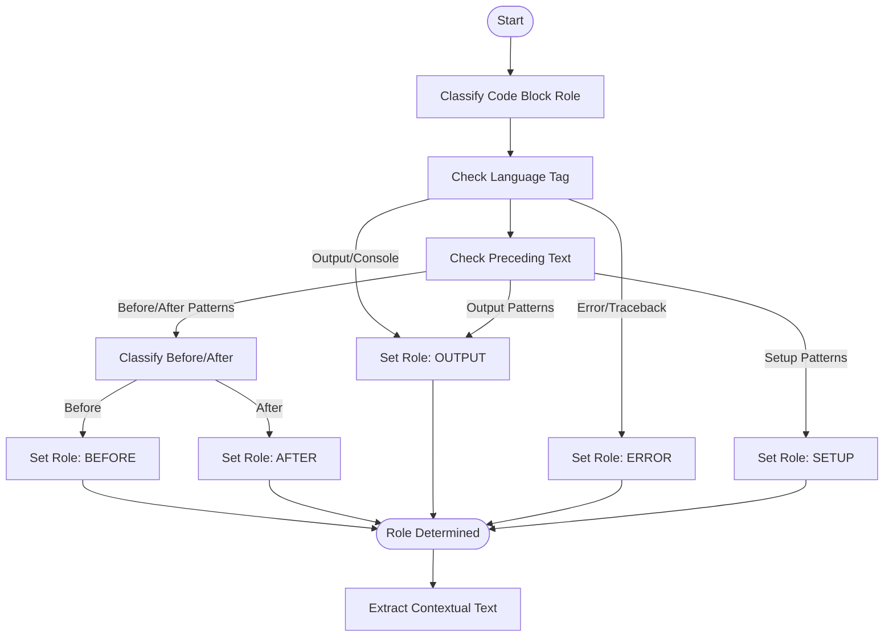
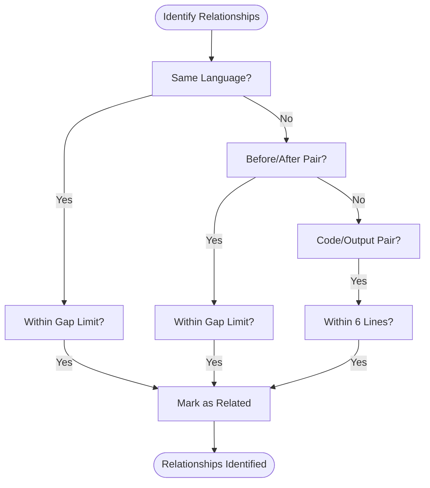
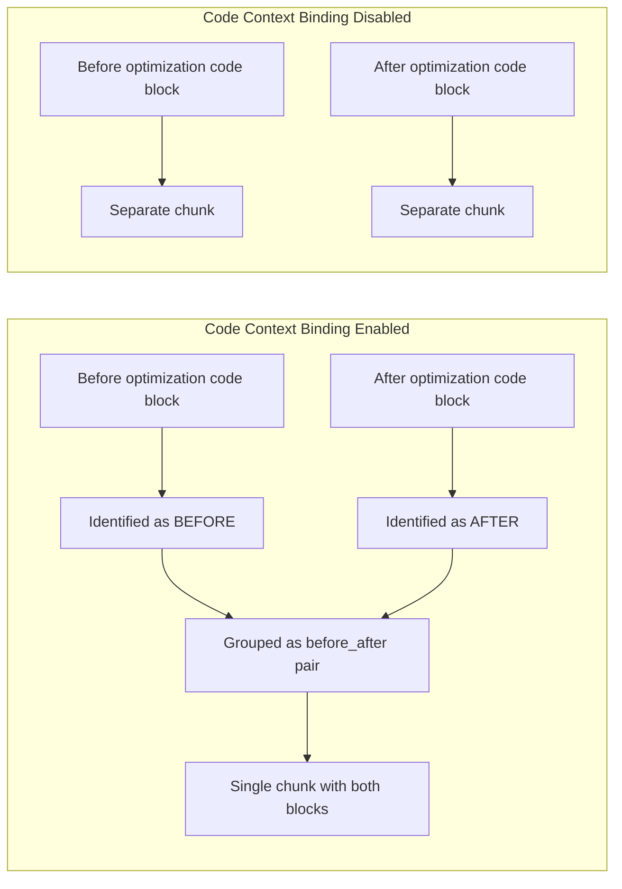

# Code Context Binding

<cite>
**Referenced Files in This Document**   
- [code_context.py](file://src/chunkana/code_context.py)
- [config.py](file://src/chunkana/config.py)
- [code_aware.py](file://src/chunkana/strategies/code_aware.py)
- [code_context.md](file://tests/baseline/fixtures/code_context.md)
- [test_config.py](file://tests/unit/test_config.py)
</cite>

## Table of Contents
1. [Introduction](#introduction)
2. [Core Configuration Parameters](#core-configuration-parameters)
3. [Algorithm for Code Context Binding](#algorithm-for-code-context-binding)
4. [Examples of Code Context Binding](#examples-of-code-context-binding)
5. [Best Practices for Configuration](#best-practices-for-configuration)
6. [Performance and Memory Considerations](#performance-and-memory-considerations)
7. [Conclusion](#conclusion)

## Introduction
Code context binding is a sophisticated feature designed to preserve the relationship between code blocks and their surrounding explanatory text in markdown documents. This capability ensures that when documents are chunked for processing, the semantic relationships between code examples, their explanations, and related blocks are maintained. The system uses intelligent pattern recognition to identify and bind code blocks to their context, enabling more effective information retrieval and processing. This documentation explains the parameters, algorithms, and best practices for configuring code context binding in ChunkConfig.

**Section sources**
- [code_context.py](file://src/chunkana/code_context.py#L1-L516)
- [config.py](file://src/chunkana/config.py#L1-L507)

## Core Configuration Parameters

The code context binding functionality is controlled by several key parameters in the ChunkConfig class. These parameters work together to determine how code blocks are identified, related, and bound to their contextual information.

### enable_code_context_binding
This boolean parameter enables or disables the entire code context binding feature. When set to `True` (default), the system will analyze code blocks for relationships and bind them to surrounding explanations. When disabled, code blocks are processed as isolated entities without context binding.

**Section sources**
- [config.py](file://src/chunkana/config.py#L95-L96)

### max_context_chars_before and max_context_chars_after
These integer parameters control the maximum number of characters to search for explanatory text before and after a code block, respectively. By default, the system searches up to 500 characters before and 300 characters after each code block to extract relevant context. These values can be adjusted based on the expected density of explanatory text around code blocks.

**Section sources**
- [config.py](file://src/chunkana/config.py#L97-L98)
- [code_context.py](file://src/chunkana/code_context.py#L102-L103)

### related_block_max_gap
This parameter defines the maximum line gap (in lines) between code blocks to consider them potentially related. The default value is 5 lines, meaning that code blocks separated by more than 5 lines of text are unlikely to be considered related. This parameter helps prevent false positives when identifying related code blocks that should be grouped together.

**Section sources**
- [config.py](file://src/chunkana/config.py#L101)
- [code_context.py](file://src/chunkana/code_context.py#L104)

### bind_output_blocks
When enabled (default), this boolean parameter allows the system to automatically detect and bind output blocks to their corresponding code blocks. The system recognizes common output indicators like "Output:", "Result:", "Console:", or "stdout:" to identify output blocks and associate them with preceding code examples.

**Section sources**
- [config.py](file://src/chunkana/config.py#L104)
- [code_context.py](file://src/chunkana/code_context.py#L442-L499)

### preserve_before_after_pairs
This boolean parameter controls whether "Before/After" code comparison pairs should be preserved in a single chunk. When enabled (default), code blocks identified as "before" and "after" variants of the same functionality are grouped together, maintaining their comparative relationship. This is particularly useful for documentation showing code optimizations or refactorings.

**Section sources**
- [config.py](file://src/chunkana/config.py#L105-L106)
- [code_context.py](file://src/chunkana/code_context.py#L565-L572)

## Algorithm for Code Context Binding

The code context binding algorithm follows a systematic approach to identify and preserve relationships between code blocks and their explanatory text. The process involves several stages of analysis and grouping.

### Role Classification
The algorithm begins by classifying each code block according to its role using pattern recognition. The `CodeBlockRole` enum defines several roles including EXAMPLE, SETUP, OUTPUT, ERROR, BEFORE, and AFTER. The classification is performed through multiple methods:

1. **Language tag analysis**: Code blocks with language tags like "output", "console", "error", or "traceback" are automatically classified based on their tag.
2. **Preceding text patterns**: The system examines text immediately before the code block for specific patterns that indicate its role.
3. **Before/After patterns**: Text containing phrases like "before", "after", "old version", "new version", "problematic", or "fixed" triggers classification as BEFORE or AFTER.



**Diagram sources**
- [code_context.py](file://src/chunkana/code_context.py#L164-L243)
- [code_context.py](file://src/chunkana/code_context.py#L279-L355)

### Context Extraction
Once roles are classified, the system extracts explanatory text from both before and after each code block. The extraction process respects sentence boundaries to avoid cutting sentences mid-way. For text before the code block, the system searches backward up to `max_context_chars_before` characters, attempting to start at a sentence boundary. For text after the code block, it searches forward up to `max_context_chars_after` characters, attempting to end at a sentence boundary.

### Relationship Identification
The algorithm identifies relationships between code blocks based on three primary criteria:

1. **Same language and proximity**: Code blocks with the same language tag that are within `related_block_max_gap` lines of each other are considered related.
2. **Before/After pairing**: Blocks classified as BEFORE and AFTER are paired together when they are in close proximity.
3. **Code/Output pairing**: Code blocks are paired with subsequent output blocks when the output block is within 6 lines and properly labeled.



**Diagram sources**
- [code_context.py](file://src/chunkana/code_context.py#L412-L440)
- [code_aware.py](file://src/chunkana/strategies/code_aware.py#L550-L584)

### Group Formation
Based on the identified relationships, the system forms groups of related code blocks. The grouping process follows these rules:

- Before/After pairs are grouped when `preserve_before_after_pairs` is enabled
- Code blocks with their output are grouped when `bind_output_blocks` is enabled
- Sequential code blocks with the same language in close proximity are grouped together

The resulting groups are then processed as single units, ensuring that related content remains together in the final chunks.

**Section sources**
- [code_aware.py](file://src/chunkana/strategies/code_aware.py#L508-L548)

## Examples of Code Context Binding

### Example 1: Function Documentation with Explanatory Text
Consider a markdown document with a function definition and surrounding explanation:

```markdown
The following function calculates factorial recursively:

```python
def factorial(n):
    """Calculate factorial of n."""
    if n <= 1:
        return 1
    return n * factorial(n - 1)
```

The time complexity is O(n) and space complexity is O(n) due to recursion.
```

With code context binding enabled, the system will:
- Classify the code block as an EXAMPLE
- Extract the explanatory text before (500 characters max) and after (300 characters max)
- Create a single chunk containing the explanation, code block, and subsequent explanation
- Include metadata indicating that context was bound from both before and after

When code context binding is disabled, this content would likely be split into three separate chunks: the introductory text, the code block, and the complexity explanation, breaking the semantic relationship.

**Section sources**
- [code_context.md](file://tests/baseline/fixtures/code_context.md#L7-L17)

### Example 2: Before/After Code Comparison
Consider a documentation section showing code optimization:

```markdown
Before optimization:

```python
def slow_sum(numbers):
    total = 0
    for n in numbers:
        total = total + n
    return total
```

After optimization:

```python
def fast_sum(numbers):
    return sum(numbers)
```
```

With code context binding enabled and `preserve_before_after_pairs` set to true:
- Both code blocks are identified as BEFORE and AFTER based on the surrounding text
- The two blocks are grouped together as a related pair
- A single chunk is created containing both code blocks with metadata indicating a "before_after" relationship

When code context binding is disabled, these would be processed as two separate code chunks, losing the comparative relationship that is evident in the original documentation.



**Diagram sources**
- [code_context.md](file://tests/baseline/fixtures/code_context.md#L43-L58)
- [code_context.py](file://src/chunkana/code_context.py#L91-L98)

### Example 3: Code and Output Pairing
Consider a code example with its expected output:

```markdown
Here's how to use the sorting function:

```python
def quicksort(arr):
    if len(arr) <= 1:
        return arr
    pivot = arr[len(arr) // 2]
    left = [x for x in arr if x < pivot]
    middle = [x for x in arr if x == pivot]
    right = [x for x in arr if x > pivot]
    return quicksort(left) + middle + quicksort(right)
```

Example output:

```
>>> quicksort([3, 6, 8, 10, 1, 2, 1])
[1, 1, 2, 3, 6, 8, 10]
```
```

With code context binding enabled and `bind_output_blocks` set to true:
- The code block is classified as an EXAMPLE
- The subsequent block is identified as OUTPUT based on the "Example output:" heading
- The two blocks are linked together
- A single chunk is created containing both the code and its expected output

When code context binding is disabled, these would be separate chunks, potentially separating the code from its demonstration of usage.

**Section sources**
- [code_context.md](file://tests/baseline/fixtures/code_context.md#L21-L39)

## Best Practices for Configuration

### General Configuration Guidelines
For most documentation scenarios, the default configuration provides optimal results:
```python
config = ChunkConfig(
    enable_code_context_binding=True,
    max_context_chars_before=500,
    max_context_chars_after=300,
    related_block_max_gap=5,
    bind_output_blocks=True,
    preserve_before_after_pairs=True
)
```

These defaults balance comprehensive context preservation with processing efficiency.

### Documentation Style-Specific Configurations

#### Technical Tutorials and Guides
For step-by-step tutorials with extensive explanations:
```python
config = ChunkConfig(
    enable_code_context_binding=True,
    max_context_chars_before=800,  # More context from longer explanations
    max_context_chars_after=500,   # More context for follow-up explanations
    related_block_max_gap=8,       # Allow for more text between related blocks
    bind_output_blocks=True,
    preserve_before_after_pairs=True
)
```

#### API Documentation
For API references with concise examples:
```python
config = ChunkConfig(
    enable_code_context_binding=True,
    max_context_chars_before=300,  # Shorter descriptions
    max_context_chars_after=200,   # Minimal follow-up text
    related_block_max_gap=3,       # Examples are typically close together
    bind_output_blocks=True,
    preserve_before_after_pairs=False  # Less common in API docs
)
```

#### Code Review and Optimization Documentation
For documents focusing on code comparisons:
```python
config = ChunkConfig(
    enable_code_context_binding=True,
    max_context_chars_before=600,
    max_context_chars_after=400,
    related_block_max_gap=10,      # Allow for more explanatory text between before/after
    bind_output_blocks=False,      # Output less relevant in comparisons
    preserve_before_after_pairs=True
)
```

### Performance-Oriented Configuration
For large-scale processing where performance is critical:
```python
config = ChunkConfig(
    enable_code_context_binding=False,  # Disable for maximum speed
    max_context_chars_before=200,      # Minimal context if enabled
    max_context_chars_after=100,
    related_block_max_gap=3,
    bind_output_blocks=False,
    preserve_before_after_pairs=False
)
```

**Section sources**
- [config.py](file://src/chunkana/config.py#L185-L387)

## Performance and Memory Considerations

### Memory Usage Analysis
The code context binding feature has specific memory implications that scale with document size and complexity:

1. **Line Storage**: The system stores all document lines in memory to facilitate efficient context extraction. For a document with N lines, this requires O(N) memory.
2. **Code Context Objects**: Each code block generates a CodeContext object containing references to the code block, role, explanations, and related blocks. The memory footprint is proportional to the number of code blocks.
3. **Pattern Matching**: The regex patterns used for role detection are compiled once and reused, minimizing memory overhead.

For very large files (10MB+), consider using the streaming chunking interface to process the document in smaller segments, reducing peak memory usage.

### Processing Time Complexity
The algorithm's time complexity is primarily determined by:

1. **O(M × N)** for context extraction, where M is the number of code blocks and N is the average context size
2. **O(M²)** for relationship identification in the worst case, as each code block is compared with every other block
3. **O(N)** for the initial document parsing

In practice, the relationship identification is optimized by only considering blocks within the `related_block_max_gap`, reducing the effective complexity.

### Optimization Strategies
To optimize performance for large code files:

1. **Adjust context sizes**: Reduce `max_context_chars_before` and `max_context_chars_after` for documents with dense code and minimal explanations
2. **Tune gap threshold**: Lower `related_block_max_gap` for documents where related code blocks are typically very close together
3. **Disable specific features**: Set `bind_output_blocks=False` or `preserve_before_after_pairs=False` if these patterns are not present in your documentation
4. **Use streaming**: For very large files, use the `chunk_file_streaming` method to process the document incrementally

The system includes an optimization (O1) that caches document lines and reuses them across multiple operations, reducing the overhead of repeated string splitting operations.

**Section sources**
- [code_context.py](file://src/chunkana/code_context.py#L119-L120)
- [code_aware.py](file://src/chunkana/strategies/code_aware.py#L184-L196)

## Conclusion
Code context binding is a powerful feature that preserves the semantic relationships between code blocks and their explanatory text in markdown documents. By intelligently identifying code roles, extracting surrounding context, and grouping related blocks, the system ensures that documentation maintains its intended meaning when processed into chunks. The configurable parameters allow fine-tuning for different documentation styles and performance requirements. When properly configured, code context binding significantly improves the quality of chunked output by maintaining the relationships that make technical documentation effective and understandable.