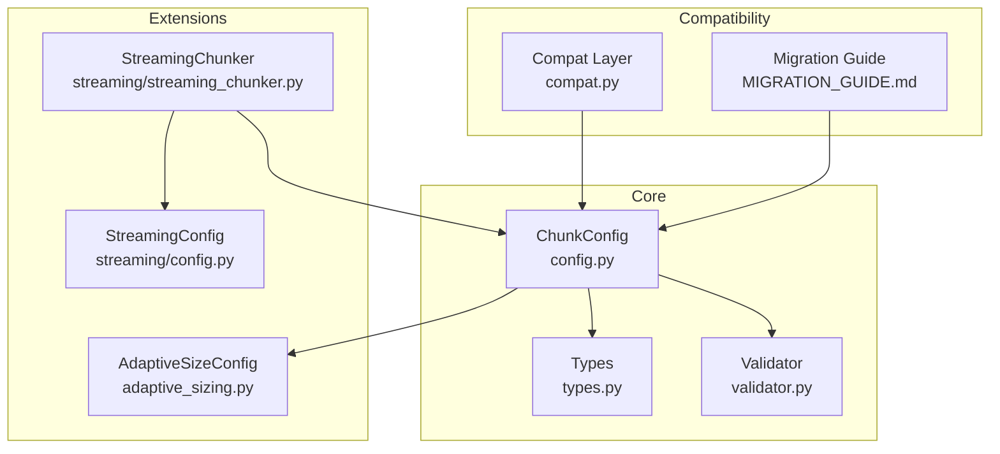
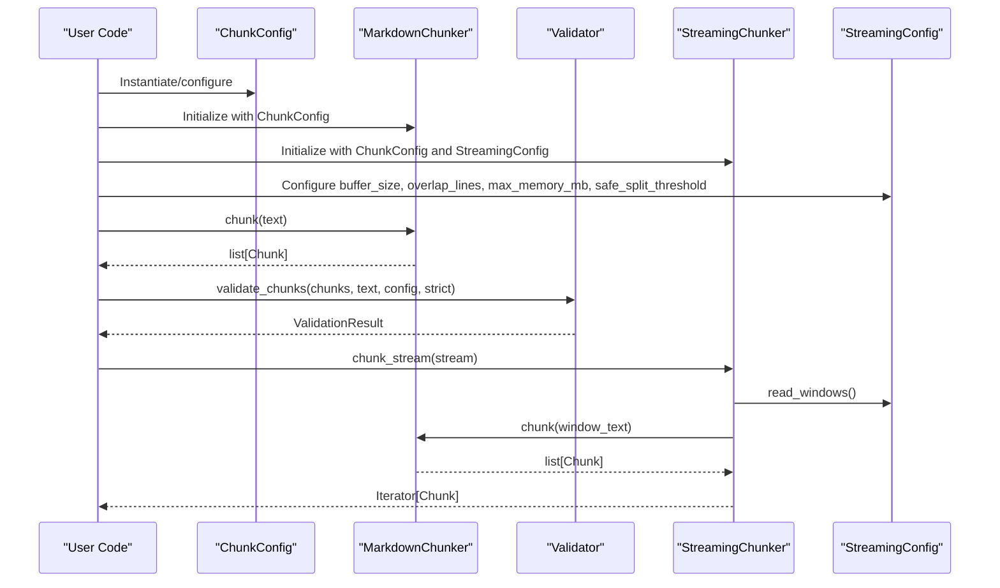
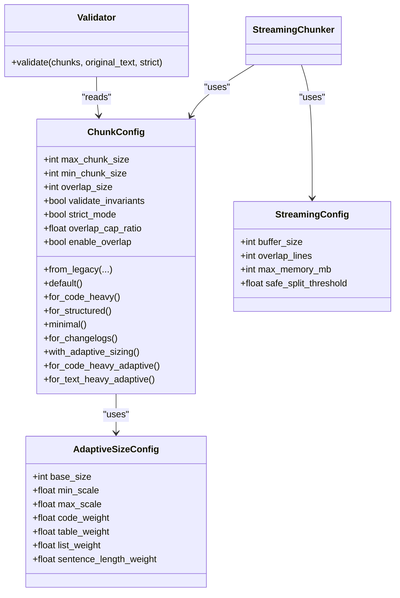
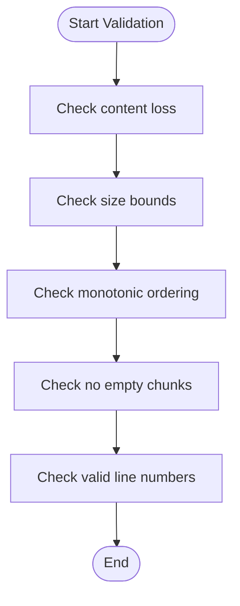

# Configuration

<cite>
**Referenced Files in This Document**
- [config.py](file://src/chunkana/config.py)
- [types.py](file://src/chunkana/types.py)
- [validator.py](file://src/chunkana/validator.py)
- [adaptive_sizing.py](file://src/chunkana/adaptive_sizing.py)
- [streaming/config.py](file://src/chunkana/streaming/config.py)
- [streaming/streaming_chunker.py](file://src/chunkana/streaming/streaming_chunker.py)
- [compat.py](file://src/chunkana/compat.py)
- [MIGRATION_GUIDE.md](file://MIGRATION_GUIDE.md)
- [docs/config.md](file://docs/config.md)
- [tests/unit/test_config.py](file://tests/unit/test_config.py)
- [tests/unit/test_invariant_validation.py](file://tests/unit/test_invariant_validation.py)
</cite>

## Table of Contents
1. [Introduction](#introduction)
2. [Project Structure](#project-structure)
3. [Core Components](#core-components)
4. [Architecture Overview](#architecture-overview)
5. [Detailed Component Analysis](#detailed-component-analysis)
6. [Dependency Analysis](#dependency-analysis)
7. [Performance Considerations](#performance-considerations)
8. [Troubleshooting Guide](#troubleshooting-guide)
9. [Conclusion](#conclusion)
10. [Appendices](#appendices)

## Introduction
This document provides comprehensive configuration documentation for ChunkConfig (alias ChunkerConfig) and runtime parameters that control chunking behavior. It explains each configuration option, its impact on chunking and output quality, recommended values for different use cases, and how to configure streaming buffer settings. It also covers validation rules, error handling for invalid configurations, and backward compatibility/deprecation policies.

## Project Structure
The configuration system centers around ChunkConfig, with supporting components for adaptive sizing, streaming, validation, and compatibility.

**Diagram sources**
- [config.py](file://src/chunkana/config.py#L1-L120)
- [types.py](file://src/chunkana/types.py#L240-L376)
- [validator.py](file://src/chunkana/validator.py#L32-L221)
- [adaptive_sizing.py](file://src/chunkana/adaptive_sizing.py#L14-L101)
- [streaming/config.py](file://src/chunkana/streaming/config.py#L8-L24)
- [streaming/streaming_chunker.py](file://src/chunkana/streaming/streaming_chunker.py#L18-L99)
- [compat.py](file://src/chunkana/compat.py#L16-L53)
- [MIGRATION_GUIDE.md](file://MIGRATION_GUIDE.md#L110-L172)

**Section sources**
- [config.py](file://src/chunkana/config.py#L1-L120)
- [docs/config.md](file://docs/config.md#L1-L172)

## Core Components
- ChunkConfig: Central configuration for chunking behavior, including size bounds, overlap, strategy thresholds, code-context binding, adaptive sizing, LaTeX handling, table grouping, and hierarchical validation controls.
- AdaptiveSizeConfig: Optional configuration for adaptive chunk sizing based on content complexity.
- StreamingConfig: Controls streaming buffer behavior for large files.
- Validator: Validates chunking results against domain properties and hierarchical invariants.

Key runtime parameters documented in this guide:
- max_chunk_size
- min_chunk_size
- overlap_size
- validate_invariants
- strict_mode
- Streaming buffer settings (buffer_size, overlap_lines, max_memory_mb, safe_split_threshold)

**Section sources**
- [config.py](file://src/chunkana/config.py#L17-L126)
- [adaptive_sizing.py](file://src/chunkana/adaptive_sizing.py#L14-L101)
- [streaming/config.py](file://src/chunkana/streaming/config.py#L8-L24)
- [validator.py](file://src/chunkana/validator.py#L32-L221)

## Architecture Overview
The configuration system integrates with chunking, validation, and streaming components.

**Diagram sources**
- [config.py](file://src/chunkana/config.py#L1-L120)
- [validator.py](file://src/chunkana/validator.py#L47-L221)
- [streaming/streaming_chunker.py](file://src/chunkana/streaming/streaming_chunker.py#L25-L99)
- [streaming/config.py](file://src/chunkana/streaming/config.py#L8-L24)

## Detailed Component Analysis

### ChunkConfig: Global Defaults and Instance-Specific Overrides
- Purpose: Encapsulates all chunking behavior parameters with validated defaults and computed helpers.
- Global defaults vs instance-specific:
  - Global defaults are defined as class attributes (e.g., max_chunk_size=4096, min_chunk_size=512, overlap_size=200).
  - Instance-specific overrides occur when constructing ChunkConfig with explicit parameters.
- Computed fields:
  - enable_overlap: derived from overlap_size > 0.

Recommended defaults and typical overrides:
- Default profile: max_chunk_size=4096, min_chunk_size=512, overlap_size=200.
- Code-heavy documents: larger chunks and lower code_threshold.
- Structured documents: smaller overlap and adjusted structure_threshold.
- Minimal/small chunks: reduced max/min_chunk_size and overlap_size.

Validation rules enforced during __post_init__:
- Size parameters: max_chunk_size > 0; min_chunk_size > 0; min_chunk_size ≤ max_chunk_size; overlap_size ≥ 0; overlap_size < max_chunk_size.
- Threshold parameters: code_threshold ∈ [0,1]; structure_threshold ≥ 1; list_ratio_threshold ∈ [0,1]; list_count_threshold ≥ 1.
- Strategy override: must be one of {"code_aware","list_aware","structural","fallback","None"}.
- Code-context binding: max_context_chars_before ≥ 0; max_context_chars_after ≥ 0; related_block_max_gap ≥ 1.
- Adaptive sizing: if use_adaptive_sizing=True and adaptive_config is None, a default AdaptiveSizeConfig is auto-created.
- LaTeX parameters: latex_max_context_chars ≥ 0.
- Table grouping: consistency checks (validated by nested TableGroupingConfig).
- Overlap cap ratio: 0 < overlap_cap_ratio ≤ 1.

Backward compatibility and deprecation:
- from_legacy maps renamed parameters (e.g., max_size→max_chunk_size, min_size→min_chunk_size) and emits deprecation warnings for removed parameters.
- Removed parameters are ignored with warnings; legacy enable_overlap is translated to overlap_size.

Error handling:
- Invalid combinations raise ValueError with descriptive messages.
- Some adjustments are auto-applied (e.g., min_chunk_size auto-adjusted to half of max_chunk_size when violated).

Examples of configuration objects and their effects:
- Code repositories: larger max/min_chunk_size, lower code_threshold, enable code-context binding.
- Documentation sites: balanced defaults with adjusted structure_threshold.
- Changelogs/release notes: tuned list_ratio_threshold and list_count_threshold.
- Scientific documents: preserve LaTeX blocks and atomic blocks.

**Section sources**
- [config.py](file://src/chunkana/config.py#L77-L126)
- [config.py](file://src/chunkana/config.py#L138-L229)
- [config.py](file://src/chunkana/config.py#L253-L308)
- [tests/unit/test_config.py](file://tests/unit/test_config.py#L13-L53)
- [tests/unit/test_config.py](file://tests/unit/test_config.py#L183-L226)
- [docs/config.md](file://docs/config.md#L1-L172)

### Runtime Parameters: max_chunk_size, min_chunk_size, overlap_size
- max_chunk_size:
  - Impact: Upper bound on chunk size; affects memory footprint and retrieval quality.
  - Recommended values:
    - RAG/search indexing: moderate to large (e.g., 2048–8192) to balance recall and latency.
    - Summarization: slightly smaller (e.g., 1024–2048) to improve coherence.
    - Code repositories: larger (e.g., 4096–8192) to keep methods/classes whole.
- min_chunk_size:
  - Impact: Prevents overly small chunks; influences merging behavior.
  - Recommended values:
    - General: 256–512; code-heavy: 512–1024.
- overlap_size:
  - Impact: Adds contextual metadata between adjacent chunks; improves retrieval continuity.
  - Recommended values:
    - General: 100–200; code-heavy: 50–100; very dense content: up to 200–300.
  - Overlap cap ratio: limits overlap to a fraction of chunk size (default 0.35).

Effects on output quality:
- Larger chunks reduce fragmentation and improve context retention.
- Smaller chunks increase granularity for targeted retrieval.
- Overlap metadata enhances downstream retrieval without duplicating content in chunk.content.

**Section sources**
- [config.py](file://src/chunkana/config.py#L77-L126)
- [config.py](file://src/chunkana/config.py#L138-L158)
- [config.py](file://src/chunkana/config.py#L222-L229)
- [tests/unit/test_config.py](file://tests/unit/test_config.py#L13-L53)
- [tests/unit/test_config.py](file://tests/unit/test_config.py#L183-L226)

### Runtime Parameters: validate_invariants and strict_mode
- validate_invariants:
  - Purpose: Enables hierarchical tree validation after chunking.
  - When enabled, Validator checks domain properties and hierarchical invariants.
- strict_mode:
  - Purpose: Controls whether validation raises exceptions (strict) or attempts auto-fixes (non-strict).
  - Typical usage: False for production runs; True for debugging and CI to enforce correctness.

Domain properties validated:
- PROP-1: No content loss.
- PROP-2: Size bounds (with allow_oversize exceptions).
- PROP-3: Monotonic ordering by start_line.
- PROP-4: No empty chunks.
- PROP-5: Valid line numbers.

Hierarchical invariants (when building trees):
- is_leaf consistency.
- Parent-child bidirectionality.
- Content range consistency for root chunks.

Recommended usage:
- Default: validate_invariants=True, strict_mode=False for robustness.
- Debugging: validate_invariants=True, strict_mode=True to surface issues early.

**Section sources**
- [validator.py](file://src/chunkana/validator.py#L32-L221)
- [tests/unit/test_invariant_validation.py](file://tests/unit/test_invariant_validation.py#L15-L122)
- [tests/unit/test_invariant_validation.py](file://tests/unit/test_invariant_validation.py#L194-L232)
- [MIGRATION_GUIDE.md](file://MIGRATION_GUIDE.md#L81-L99)

### Streaming Buffer Settings: buffer_size, overlap_lines, max_memory_mb, safe_split_threshold
- buffer_size:
  - Purpose: Maximum bytes per buffer window.
  - Impact: Controls memory usage; larger buffers reduce overhead but increase peak memory.
- overlap_lines:
  - Purpose: Lines to retain as context between adjacent buffers.
  - Impact: Ensures boundary continuity for chunking across buffer boundaries.
- max_memory_mb:
  - Purpose: Hard ceiling for memory usage in streaming mode.
  - Impact: Prevents unbounded growth; tune based on deployment constraints.
- safe_split_threshold:
  - Purpose: Fractional threshold to determine where to start looking for split points.
  - Impact: Balances performance and correctness near buffer edges.

Recommended values:
- buffer_size: 50–200 KB for typical documents; increase for very large files.
- overlap_lines: 10–50; higher for documents with tight boundaries (e.g., code).
- max_memory_mb: 50–200 MB depending on workload.
- safe_split_threshold: 0.7–0.9 for safer splits; lower for more aggressive splitting.

**Section sources**
- [streaming/config.py](file://src/chunkana/streaming/config.py#L8-L24)
- [streaming/streaming_chunker.py](file://src/chunkana/streaming/streaming_chunker.py#L25-L99)

### Adaptive Sizing: use_adaptive_sizing and AdaptiveSizeConfig
- use_adaptive_sizing:
  - Purpose: Enable dynamic chunk size based on content complexity.
  - When True, adaptive_config must be provided or auto-created.
- AdaptiveSizeConfig:
  - base_size: Base chunk size for medium complexity.
  - min_scale, max_scale: Scaling factors for simple to complex content.
  - Weights: code_weight, table_weight, list_weight, sentence_length_weight.
  - Validation: weights must sum to 1.0; scales must satisfy min_scale < max_scale.

Recommended usage:
- Enable for text-heavy or mixed-content documents to improve retrieval quality.
- Tune weights to reflect domain characteristics (e.g., higher code_weight for code-heavy).

**Section sources**
- [config.py](file://src/chunkana/config.py#L103-L111)
- [config.py](file://src/chunkana/config.py#L203-L209)
- [adaptive_sizing.py](file://src/chunkana/adaptive_sizing.py#L14-L101)
- [adaptive_sizing.py](file://src/chunkana/adaptive_sizing.py#L103-L197)

### Strategy Selection Thresholds
- code_threshold: Ratio threshold for CodeAwareStrategy.
- structure_threshold: Minimum header count for StructuralStrategy.
- list_ratio_threshold, list_count_threshold: List-aware thresholds.

Tuning guidance:
- Lower code_threshold for code-heavy documents to trigger code-aware chunking earlier.
- Reduce structure_threshold for sparse or short documents.
- Adjust list thresholds for changelogs or release notes.

**Section sources**
- [config.py](file://src/chunkana/config.py#L86-L91)
- [docs/config.md](file://docs/config.md#L15-L24)

### Code-Context Binding Parameters
- enable_code_context_binding: Toggle enhanced binding.
- max_context_chars_before, max_context_chars_after: Bound explanation spans.
- related_block_max_gap: Max gap between related code blocks.
- bind_output_blocks, preserve_before_after_pairs: Control pairing behavior.

Impact:
- Improves retrieval quality by associating code with explanatory text.
- Can increase processing time; disable for performance-sensitive paths.

**Section sources**
- [config.py](file://src/chunkana/config.py#L95-L102)
- [config.py](file://src/chunkana/config.py#L185-L203)
- [docs/config.md](file://docs/config.md#L25-L37)

### LaTeX Handling
- preserve_latex_blocks: Treat LaTeX formulas as atomic blocks.
- latex_display_only: Extract only display math/environments; skip inline math.
- latex_max_context_chars: Bound surrounding text for LaTeX binding.

Impact:
- Preserves mathematical structure for scientific documents.
- Reduces noise from inline math when disabled.

**Section sources**
- [config.py](file://src/chunkana/config.py#L115-L119)
- [docs/config.md](file://docs/config.md#L85-L92)

### Table Grouping
- group_related_tables: Enable grouping of related tables.
- table_grouping_config: Nested configuration for grouping behavior.

Impact:
- Improves retrieval quality for documents with grouped tabular data.

**Section sources**
- [config.py](file://src/chunkana/config.py#L120-L123)
- [docs/config.md](file://docs/config.md#L58-L75)

### Backward Compatibility and Deprecation Policies
- Legacy parameter mapping:
  - max_size → max_chunk_size
  - min_size → min_chunk_size
  - enable_overlap → overlap_size (0 or default)
- Removed parameters are ignored with deprecation warnings.
- Compatibility layer:
  - LegacyChunkConfig.create and LegacyMarkdownChunker wrap modern ChunkConfig and MarkdownChunker while issuing deprecation warnings.

Migration guidance:
- Replace legacy keyword arguments with ChunkConfig instances.
- Use factory methods for recommended profiles (e.g., for_code_heavy, for_structured).

**Section sources**
- [config.py](file://src/chunkana/config.py#L253-L308)
- [compat.py](file://src/chunkana/compat.py#L16-L53)
- [MIGRATION_GUIDE.md](file://MIGRATION_GUIDE.md#L110-L172)

## Dependency Analysis
- ChunkConfig depends on AdaptiveSizeConfig and TableGroupingConfig (nested).
- Validator consumes ChunkConfig to validate results.
- StreamingChunker composes StreamingConfig and uses ChunkConfig for chunking.
- Legacy compatibility layer wraps modern APIs.

**Diagram sources**
- [config.py](file://src/chunkana/config.py#L77-L126)
- [config.py](file://src/chunkana/config.py#L203-L209)
- [adaptive_sizing.py](file://src/chunkana/adaptive_sizing.py#L14-L101)
- [streaming/config.py](file://src/chunkana/streaming/config.py#L8-L24)
- [validator.py](file://src/chunkana/validator.py#L47-L221)

**Section sources**
- [config.py](file://src/chunkana/config.py#L77-L126)
- [adaptive_sizing.py](file://src/chunkana/adaptive_sizing.py#L14-L101)
- [streaming/config.py](file://src/chunkana/streaming/config.py#L8-L24)
- [validator.py](file://src/chunkana/validator.py#L47-L221)

## Performance Considerations
- Larger max_chunk_size reduces chunk count and overhead but increases memory usage.
- Enabling adaptive sizing adds computation for complexity scoring; enable only when beneficial.
- Streaming mode trades CPU for memory by processing in windows; tune buffer_size and overlap_lines accordingly.
- Disabling validation (validate_invariants=False) can improve performance for production runs where correctness is ensured elsewhere.

[No sources needed since this section provides general guidance]

## Troubleshooting Guide
Common configuration issues and resolutions:
- Invalid size parameters:
  - max_chunk_size must be positive; min_chunk_size must be positive and ≤ max_chunk_size; overlap_size must be non-negative and < max_chunk_size.
- Threshold parameter errors:
  - code_threshold and list_ratio_threshold must be in [0,1]; structure_threshold and list_count_threshold must be ≥ 1.
- Strategy override errors:
  - strategy_override must be one of {"code_aware","list_aware","structural","fallback","None"}.
- Overlap cap ratio:
  - Must be in (0,1].
- Hierarchical validation failures:
  - In strict_mode=True, validation raises exceptions; switch to strict_mode=False to auto-fix.
- Streaming buffer issues:
  - Increase buffer_size or overlap_lines if boundary artifacts appear; reduce max_memory_mb if memory pressure occurs.

Validation flow for hierarchical chunking:

**Diagram sources**
- [validator.py](file://src/chunkana/validator.py#L47-L198)

**Section sources**
- [config.py](file://src/chunkana/config.py#L138-L229)
- [tests/unit/test_config.py](file://tests/unit/test_config.py#L13-L53)
- [tests/unit/test_config.py](file://tests/unit/test_config.py#L183-L226)
- [validator.py](file://src/chunkana/validator.py#L47-L198)
- [tests/unit/test_invariant_validation.py](file://tests/unit/test_invariant_validation.py#L15-L122)

## Conclusion
ChunkConfig provides a focused, validated configuration surface for reliable chunking across diverse content types. By tuning max_chunk_size, min_chunk_size, overlap_size, and strategy thresholds, you can optimize for RAG, search indexing, summarization, or specialized domains like code repositories and scientific documents. Streaming buffer settings help manage memory for large files. Hierarchical validation and strict_mode ensure correctness, while adaptive sizing improves retrieval quality for complex content. The compatibility layer and migration guide ease transitions from legacy configurations.

[No sources needed since this section summarizes without analyzing specific files]

## Appendices

### Recommended Configuration Profiles
- RAG/search indexing:
  - Balanced defaults with moderate overlap; consider enabling adaptive sizing for mixed content.
- Summarization:
  - Slightly smaller chunks to improve coherence; moderate overlap.
- Code repositories:
  - Larger chunks; lower code_threshold; enable code-context binding.
- Documentation sites:
  - Balanced defaults; adjust structure_threshold for shorter documents.
- Changelogs/release notes:
  - Lower list_ratio_threshold and list_count_threshold.
- Scientific documents:
  - Preserve LaTeX blocks; consider preserving atomic blocks.

**Section sources**
- [docs/config.md](file://docs/config.md#L123-L172)
- [config.py](file://src/chunkana/config.py#L314-L407)

### Example Configuration Objects
- Documentation sites:
  - max_chunk_size=2048, min_chunk_size=256, overlap_size=150, structure_threshold=2.
- Code repositories:
  - max_chunk_size=8192, min_chunk_size=1024, overlap_size=100, code_threshold=0.2, enable_code_context_binding=True.
- Changelogs/release notes:
  - max_chunk_size=4096, min_chunk_size=512, list_ratio_threshold=0.3, list_count_threshold=3.
- Scientific documents:
  - max_chunk_size=4096, preserve_latex_blocks=True, preserve_atomic_blocks=True.

**Section sources**
- [docs/config.md](file://docs/config.md#L123-L172)