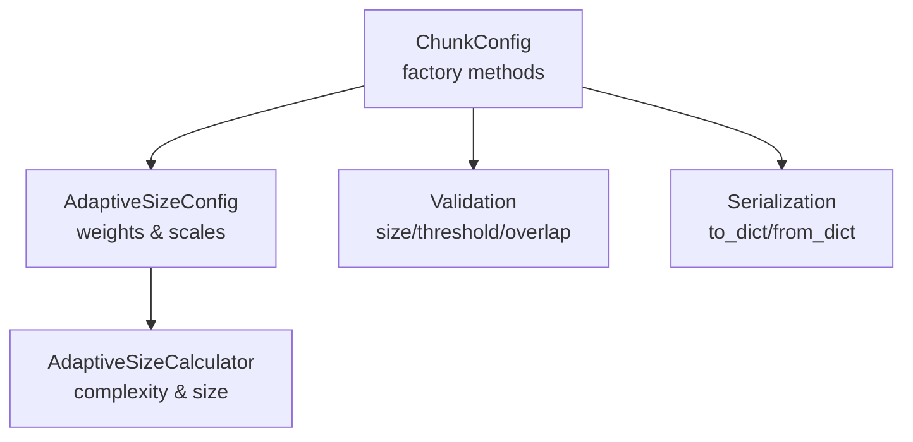
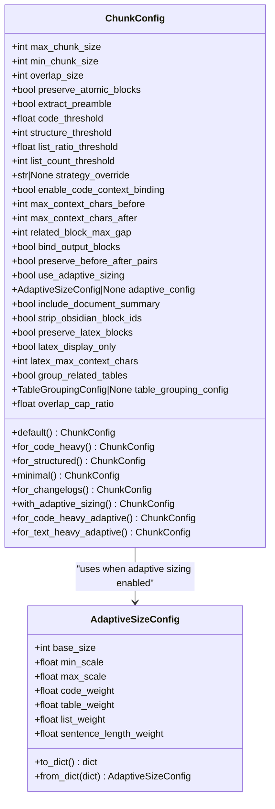
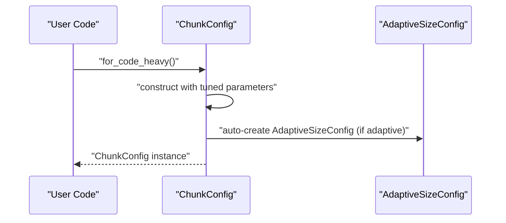
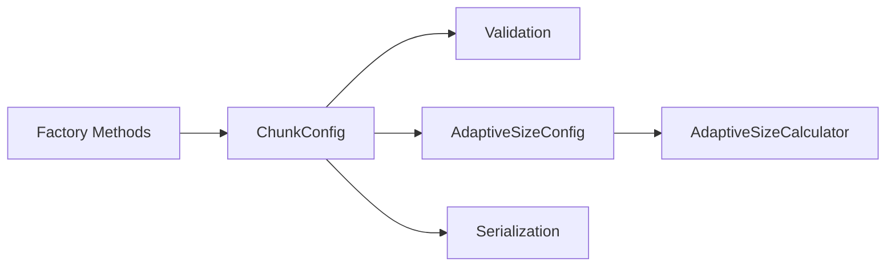

# Factory Methods

<cite>
**Referenced Files in This Document**
- [config.py](file://src/chunkana/config.py)
- [adaptive_sizing.py](file://src/chunkana/adaptive_sizing.py)
- [test_config.py](file://tests/unit/test_config.py)
- [config.md](file://docs/config.md)
</cite>

## Table of Contents
1. [Introduction](#introduction)
2. [Project Structure](#project-structure)
3. [Core Components](#core-components)
4. [Architecture Overview](#architecture-overview)
5. [Detailed Component Analysis](#detailed-component-analysis)
6. [Dependency Analysis](#dependency-analysis)
7. [Performance Considerations](#performance-considerations)
8. [Troubleshooting Guide](#troubleshooting-guide)
9. [Conclusion](#conclusion)

## Introduction
This document explains the factory methods of ChunkConfig (alias ChunkerConfig). These class methods provide ready-to-use configurations optimized for common document types and use cases. They simplify configuration by encapsulating sensible defaults and tuning parameters for specific content characteristics such as code density, structure depth, list density, and text complexity. The methods also integrate adaptive sizing when applicable, enabling dynamic chunk sizing based on content complexity.

## Project Structure
The factory methods live in the configuration module alongside validation and serialization logic. Adaptive sizing is handled by a dedicated configuration class and calculator.

**Diagram sources**
- [config.py](file://src/chunkana/config.py#L127-L229)
- [config.py](file://src/chunkana/config.py#L310-L406)
- [adaptive_sizing.py](file://src/chunkana/adaptive_sizing.py#L14-L101)
- [adaptive_sizing.py](file://src/chunkana/adaptive_sizing.py#L103-L197)

**Section sources**
- [config.py](file://src/chunkana/config.py#L127-L229)
- [config.py](file://src/chunkana/config.py#L310-L406)
- [adaptive_sizing.py](file://src/chunkana/adaptive_sizing.py#L14-L101)
- [adaptive_sizing.py](file://src/chunkana/adaptive_sizing.py#L103-L197)

## Core Components
- ChunkConfig: Central configuration dataclass with 8 core parameters and numerous behavior flags. It includes validation, serialization, and a comprehensive set of class methods for common scenarios.
- AdaptiveSizeConfig: Nested configuration for adaptive sizing, including base size and weighted factors for code, tables, lists, and sentence length.
- AdaptiveSizeCalculator: Computes content complexity and optimal chunk size from analysis metrics.

Key factory methods:
- default(): Returns a balanced baseline configuration.
- for_code_heavy(): Optimized for documents with substantial code content.
- for_structured(): Optimized for documents with strong structural hierarchy.
- minimal(): Small chunks for fine-grained processing.
- for_changelogs(): Optimized for changelog/release-note style content.
- with_adaptive_sizing(): Enables adaptive sizing with a default profile.
- for_code_heavy_adaptive(): Code-heavy with adaptive sizing tuned for code density.
- for_text_heavy_adaptive(): Text-heavy with adaptive sizing tuned for prose complexity.

**Section sources**
- [config.py](file://src/chunkana/config.py#L17-L126)
- [config.py](file://src/chunkana/config.py#L310-L406)
- [adaptive_sizing.py](file://src/chunkana/adaptive_sizing.py#L14-L101)

## Architecture Overview
The factory methods return pre-tuned ChunkConfig instances. When adaptive sizing is enabled, the configuration auto-creates an AdaptiveSizeConfig with appropriate weights and scales. Validation ensures parameters remain within acceptable bounds, and serialization supports persistence and round-trips.

**Diagram sources**
- [config.py](file://src/chunkana/config.py#L17-L126)
- [config.py](file://src/chunkana/config.py#L310-L406)
- [adaptive_sizing.py](file://src/chunkana/adaptive_sizing.py#L14-L101)

## Detailed Component Analysis

### default()
- Purpose: Provides a balanced baseline configuration suitable for general-purpose chunking.
- Typical parameters: moderate max/min chunk sizes, moderate overlap, default strategy thresholds, and default behavior flags.
- Use cases: Starting points for typical markdown content where no special content characteristics dominate.
- Guidance: Use when you want a sensible default without specifying explicit parameters.

**Section sources**
- [config.py](file://src/chunkana/config.py#L310-L313)
- [test_config.py](file://tests/unit/test_config.py#L58-L64)

### for_code_heavy()
- Purpose: Optimized for documents with heavy code content.
- Typical parameters: larger max/min chunk sizes, lower code threshold to trigger code-aware strategies earlier, and default behavior flags.
- Use cases: Code repositories, API documentation with extensive code samples, tutorials with runnable examples.
- Guidance: Choose when code blocks dominate the content and should be preserved intact.

**Section sources**
- [config.py](file://src/chunkana/config.py#L314-L323)
- [test_config.py](file://tests/unit/test_config.py#L65-L72)

### for_structured()
- Purpose: Optimized for documents with strong structural hierarchy (many headers).
- Typical parameters: balanced chunk sizes, lower structure threshold to favor structural strategies.
- Use cases: Long-form documentation with deep sectioning, technical manuals, and structured articles.
- Guidance: Choose when hierarchical structure is the primary organizing principle.

**Section sources**
- [config.py](file://src/chunkana/config.py#L324-L333)

### minimal()
- Purpose: Produces small chunks for fine-grained processing or testing.
- Typical parameters: small max/min chunk sizes and modest overlap.
- Use cases: Debugging, incremental processing, or scenarios requiring highly granular chunks.
- Guidance: Use for constrained environments or when you need maximum granularity.

**Section sources**
- [config.py](file://src/chunkana/config.py#L334-L342)

### for_changelogs()
- Purpose: Optimized for changelog and release note style content.
- Typical parameters: moderate max/min chunk sizes, tuned list ratio and count thresholds to reflect dense list-based change entries.
- Use cases: Version histories, release notes, update logs.
- Guidance: Choose when content is primarily list-based updates.

**Section sources**
- [config.py](file://src/chunkana/config.py#L343-L353)

### with_adaptive_sizing()
- Purpose: Enables adaptive sizing with a default profile.
- Typical parameters: balanced chunk sizes, adaptive sizing flag enabled, and a default AdaptiveSizeConfig with base size and scale factors.
- Use cases: Mixed-content documents where content complexity varies; you want automatic chunk size adjustment.
- Guidance: Use when content characteristics vary widely and you want the system to adapt automatically.

**Section sources**
- [config.py](file://src/chunkana/config.py#L354-L368)
- [adaptive_sizing.py](file://src/chunkana/adaptive_sizing.py#L14-L101)

### for_code_heavy_adaptive()
- Purpose: Combines code-heavy tuning with adaptive sizing.
- Typical parameters: larger chunk sizes suited for code-heavy content, lower code threshold, and an AdaptiveSizeConfig tuned toward code density with higher code weight and adjusted scales.
- Use cases: Large codebases, API references, and documentation with extensive code samples where adaptive sizing is desired.
- Guidance: Choose when code density is high and you want adaptive sizing to account for varying code complexity.

**Section sources**
- [config.py](file://src/chunkana/config.py#L369-L388)
- [adaptive_sizing.py](file://src/chunkana/adaptive_sizing.py#L14-L101)

### for_text_heavy_adaptive()
- Purpose: Combines text-heavy tuning with adaptive sizing.
- Typical parameters: balanced chunk sizes, adaptive sizing enabled, and an AdaptiveSizeConfig tuned for prose complexity with emphasis on sentence length and lists.
- Use cases: Articles, blogs, long-form prose, and documentation with dense textual content.
- Guidance: Choose when text complexity and readability are primary concerns and you want adaptive sizing to adjust for varying prose density.

**Section sources**
- [config.py](file://src/chunkana/config.py#L389-L406)
- [adaptive_sizing.py](file://src/chunkana/adaptive_sizing.py#L14-L101)

### How factory methods relate to validation and serialization
- Validation: Each factory method returns a valid configuration; validation ensures size parameters, thresholds, overlap constraints, and adaptive sizing parameters are within acceptable ranges. Some validations auto-correct minor inconsistencies (e.g., adjusting min_chunk_size relative to max_chunk_size).
- Serialization: Factory-created configurations can be serialized to dictionaries and restored, preserving all fields including nested AdaptiveSizeConfig and TableGroupingConfig.

**Section sources**
- [config.py](file://src/chunkana/config.py#L127-L229)
- [config.py](file://src/chunkana/config.py#L408-L503)
- [adaptive_sizing.py](file://src/chunkana/adaptive_sizing.py#L77-L101)

### When to use factory methods vs. manual configuration
- Use factory methods when:
  - You want a proven, optimized configuration for a specific content type.
  - You need a quick start without fine-tuning every parameter.
  - You rely on adaptive sizing and want a sensible default profile.
- Use manual configuration when:
  - You have domain-specific constraints not covered by the factory profiles.
  - You need precise control over thresholds or overlap behavior.
  - You want to customize nested configurations (e.g., AdaptiveSizeConfig weights) beyond the provided defaults.

**Section sources**
- [config.py](file://src/chunkana/config.py#L310-L406)
- [config.md](file://docs/config.md#L99-L122)

### Sequence of a factory method call

**Diagram sources**
- [config.py](file://src/chunkana/config.py#L314-L323)
- [config.py](file://src/chunkana/config.py#L354-L368)
- [adaptive_sizing.py](file://src/chunkana/adaptive_sizing.py#L14-L101)

## Dependency Analysis
- Factory methods depend on ChunkConfig’s internal validation and auto-creation of nested configurations (e.g., AdaptiveSizeConfig).
- Adaptive sizing relies on AdaptiveSizeConfig weights and scales to compute complexity and optimal chunk size.
- Serialization preserves all fields, including nested adaptive and table grouping configurations.

**Diagram sources**
- [config.py](file://src/chunkana/config.py#L127-L229)
- [config.py](file://src/chunkana/config.py#L310-L406)
- [adaptive_sizing.py](file://src/chunkana/adaptive_sizing.py#L14-L101)
- [adaptive_sizing.py](file://src/chunkana/adaptive_sizing.py#L103-L197)

**Section sources**
- [config.py](file://src/chunkana/config.py#L127-L229)
- [config.py](file://src/chunkana/config.py#L310-L406)
- [adaptive_sizing.py](file://src/chunkana/adaptive_sizing.py#L14-L101)
- [adaptive_sizing.py](file://src/chunkana/adaptive_sizing.py#L103-L197)

## Performance Considerations
- Larger chunks reduce overhead but increase memory usage during processing. Smaller chunks improve granularity but increase the number of chunks.
- Adaptive sizing dynamically adjusts chunk size based on content complexity, potentially reducing fragmentation and improving retrieval quality for heterogeneous content.
- Overlap size affects context preservation and metadata storage; ensure it aligns with downstream processing needs.

[No sources needed since this section provides general guidance]

## Troubleshooting Guide
- Invalid parameter errors: Validation raises errors for out-of-range values (e.g., negative sizes, overlap exceeding max chunk size). Adjust parameters accordingly.
- Adaptive sizing misconfiguration: Ensure weights sum to approximately 1.0 and scales are positive with min_scale less than max_scale.
- Serialization mismatches: Use to_dict/from_dict to persist and restore configurations; unknown fields are ignored for forward compatibility.

**Section sources**
- [config.py](file://src/chunkana/config.py#L138-L229)
- [adaptive_sizing.py](file://src/chunkana/adaptive_sizing.py#L37-L76)
- [config.py](file://src/chunkana/config.py#L451-L503)

## Conclusion
The ChunkConfig factory methods encapsulate best-practice configurations for common document types and use cases. They streamline setup, reduce cognitive load, and integrate adaptive sizing where appropriate. Use them as starting points, then refine manually when domain-specific constraints demand it. Together, they embody the library’s philosophy of balancing simplicity, robustness, and flexibility.