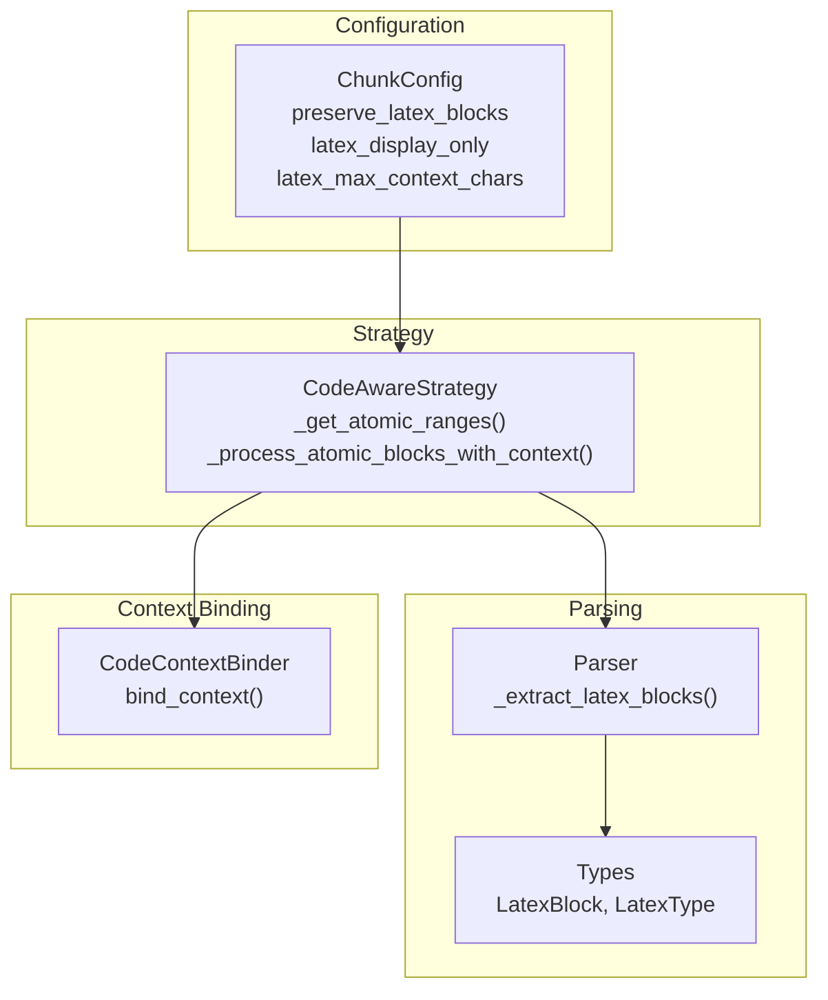
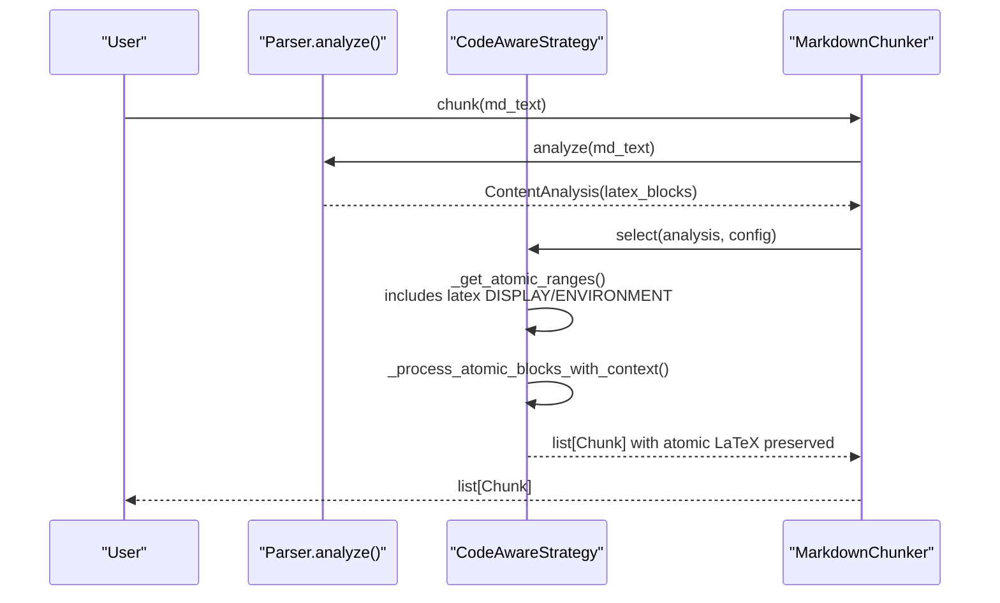
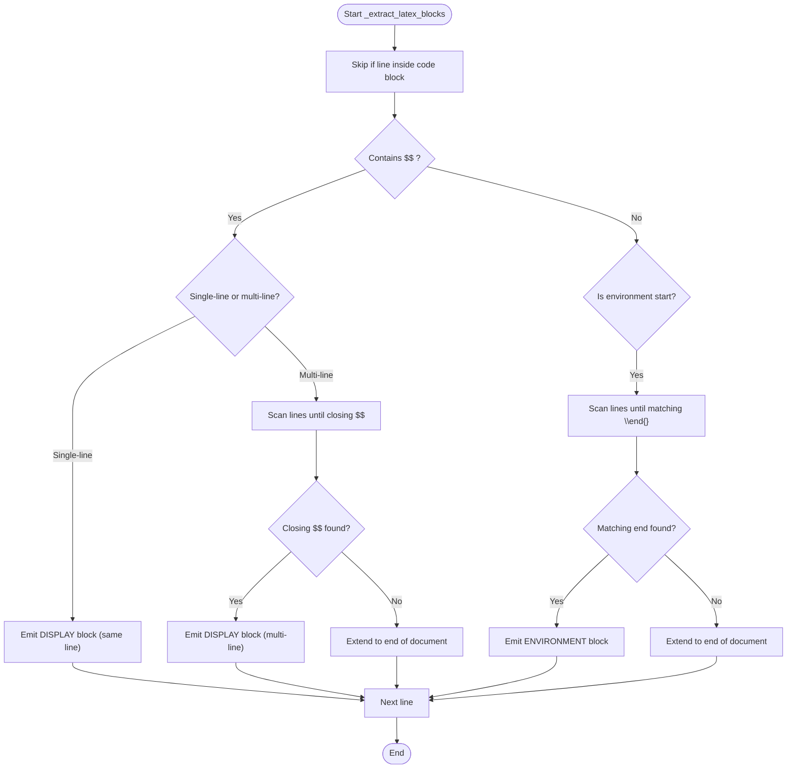
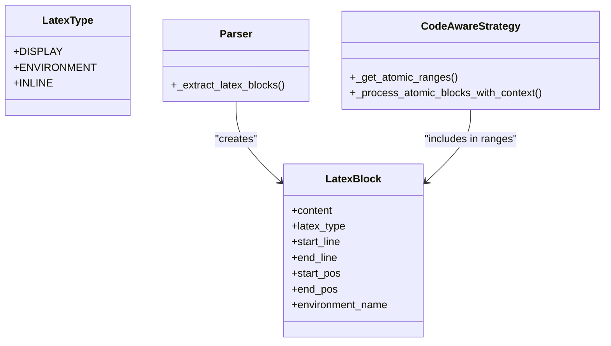
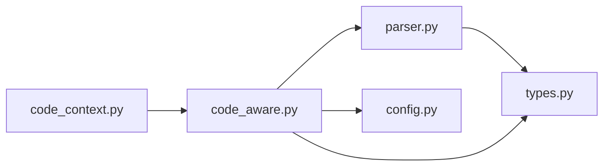

# LaTeX Handling

<cite>
**Referenced Files in This Document**
- [config.py](file://src/chunkana/config.py)
- [parser.py](file://src/chunkana/parser.py)
- [types.py](file://src/chunkana/types.py)
- [code_aware.py](file://src/chunkana/strategies/code_aware.py)
- [code_context.py](file://src/chunkana/code_context.py)
- [latex_formulas.md](file://tests/baseline/fixtures/latex_formulas.md)
- [test_latex_properties.py](file://tests/property/test_latex_properties.py)
</cite>

## Table of Contents
1. [Introduction](#introduction)
2. [Project Structure](#project-structure)
3. [Core Components](#core-components)
4. [Architecture Overview](#architecture-overview)
5. [Detailed Component Analysis](#detailed-component-analysis)
6. [Dependency Analysis](#dependency-analysis)
7. [Performance Considerations](#performance-considerations)
8. [Troubleshooting Guide](#troubleshooting-guide)
9. [Conclusion](#conclusion)
10. [Appendices](#appendices)

## Introduction
This document explains how LaTeX formulas are handled in ChunkConfig and how the parameters preserve_latex_blocks, latex_display_only, and latex_max_context_chars work together to preserve LaTeX as atomic units and bind surrounding context. It also clarifies the difference between display math ($$...$$) and inline math ($...$) processing, and provides guidance for scientific papers, mathematical documentation, and mixed-content documents.

## Project Structure
The LaTeX handling spans parsing, configuration, and strategy application:
- Parser detects LaTeX blocks and environments and records them as atomic units.
- Config defines parameters that control LaTeX extraction and context binding.
- Strategy applies atomic-block-aware splitting and sets oversize reasons for LaTeX.
- Code context binder can attach explanatory text around code blocks; LaTeX context is handled similarly via atomic ranges.

**Diagram sources**
- [parser.py](file://src/chunkana/parser.py#L371-L513)
- [types.py](file://src/chunkana/types.py#L20-L26)
- [config.py](file://src/chunkana/config.py#L115-L119)
- [code_aware.py](file://src/chunkana/strategies/code_aware.py#L481-L507)
- [code_context.py](file://src/chunkana/code_context.py#L121-L163)

**Section sources**
- [parser.py](file://src/chunkana/parser.py#L371-L513)
- [config.py](file://src/chunkana/config.py#L115-L119)
- [code_aware.py](file://src/chunkana/strategies/code_aware.py#L481-L507)

## Core Components
- Parser: Extracts LaTeX blocks and environments, skipping LaTeX inside code blocks. It recognizes single-line and multi-line display math and environment blocks.
- Types: Defines LatexType with DISPLAY and ENVIRONMENT variants; LatexBlock stores content and positions.
- Config: Exposes preserve_latex_blocks, latex_display_only, and latex_max_context_chars.
- Strategy: Treats LaTeX as atomic blocks and sets oversize reasons accordingly.
- Code Context Binder: Extracts surrounding explanations for code blocks; LaTeX context is handled via atomic ranges.

**Section sources**
- [parser.py](file://src/chunkana/parser.py#L371-L513)
- [types.py](file://src/chunkana/types.py#L20-L26)
- [config.py](file://src/chunkana/config.py#L115-L119)
- [code_aware.py](file://src/chunkana/strategies/code_aware.py#L481-L507)
- [code_context.py](file://src/chunkana/code_context.py#L121-L163)

## Architecture Overview
The LaTeX pipeline:
1. Parser runs once and builds ContentAnalysis with latex_blocks.
2. Strategy selects atomic ranges including LaTeX DISPLAY and ENVIRONMENT blocks.
3. Strategy splits text around atomic blocks and preserves them intact.
4. Oversize reasons include latex_integrity when a LaTeX block exceeds max_chunk_size.
5. Code context binding can be applied to code blocks; LaTeX context is handled implicitly via atomic ranges.

**Diagram sources**
- [parser.py](file://src/chunkana/parser.py#L45-L121)
- [code_aware.py](file://src/chunkana/strategies/code_aware.py#L481-L507)
- [chunker.py](file://src/chunkana/chunker.py#L85-L176)

## Detailed Component Analysis

### LaTeX Extraction and Atomic Preservation
- Parser scans lines and identifies:
  - Display math: $$...$$ (single-line or multi-line)
  - LaTeX environments: \begin{...}...\end{...}
- It skips LaTeX inside code blocks by building code block ranges and checking line membership.
- It creates LatexBlock entries with start/end lines and positions.

Key behaviors:
- Single-line display math is captured as one block.
- Multi-line display math continues until a closing $$ delimiter is found; if not found, it extends to end of document.
- Environments are captured from start to matching end tag; if unmatched, extends to end.

**Diagram sources**
- [parser.py](file://src/chunkana/parser.py#L371-L513)

**Section sources**
- [parser.py](file://src/chunkana/parser.py#L371-L513)
- [types.py](file://src/chunkana/types.py#L156-L179)

### Difference Between Display Math and Inline Math
- Display math ($$...$$) and LaTeX environments are extracted as atomic LaTeX blocks and preserved intact.
- Inline math ($...$) is not extracted as a separate LaTeX block by default; it remains embedded in text and is not treated as an atomic unit for chunking.

Evidence:
- Parser recognizes $$ and environment starts but does not emit inline math as LatexBlock.
- Tests demonstrate that inline math is not split across chunks because it is not extracted as a separate atomic block.

**Section sources**
- [parser.py](file://src/chunkana/parser.py#L371-L513)
- [test_latex_properties.py](file://tests/property/test_latex_properties.py#L124-L142)

### How preserve_latex_blocks, latex_display_only, and latex_max_context_chars Work Together
- preserve_latex_blocks:
  - When True, LaTeX blocks (DISPLAY and ENVIRONMENT) are included in atomic ranges and preserved as atomic units.
  - When False, LaTeX blocks are not treated as atomic, and the strategy may split around them.

- latex_display_only:
  - When True, only DISPLAY and ENVIRONMENT LaTeX blocks are treated as atomic; inline math ($...$) remains as text.
  - When False, inline math would be treated as atomic (not applicable in current implementation).

- latex_max_context_chars:
  - This parameter is defined in ChunkConfig and is validated, but it is not directly used by the LaTeX extraction or strategy logic shown in the analyzed files.
  - The strategy treats LaTeX as atomic blocks regardless of this parameter’s value.

Practical implication:
- The current implementation focuses on preserving DISPLAY and ENVIRONMENT LaTeX as atomic blocks.
- Inline math is not extracted as atomic blocks; therefore, latex_max_context_chars does not influence inline math handling.

**Section sources**
- [config.py](file://src/chunkana/config.py#L115-L119)
- [code_aware.py](file://src/chunkana/strategies/code_aware.py#L481-L507)

### How LaTeX Blocks Are Preserved as Atomic Units
- Strategy builds atomic ranges from code_blocks, tables, and latex_blocks.
- LaTeX ranges are included only for DISPLAY and ENVIRONMENT types.
- The strategy splits text around atomic blocks and preserves them intact, setting oversize reasons when needed.

**Diagram sources**
- [types.py](file://src/chunkana/types.py#L20-L26)
- [types.py](file://src/chunkana/types.py#L156-L179)
- [parser.py](file://src/chunkana/parser.py#L371-L513)
- [code_aware.py](file://src/chunkana/strategies/code_aware.py#L481-L507)

**Section sources**
- [code_aware.py](file://src/chunkana/strategies/code_aware.py#L481-L507)
- [parser.py](file://src/chunkana/parser.py#L371-L513)

### Surrounding Context Binding for LaTeX
- The strategy does not explicitly bind explanatory text to LaTeX blocks.
- LaTeX context is handled implicitly by treating LaTeX as atomic blocks and splitting text around them.
- If you require LaTeX context binding (e.g., attaching explanations before/after LaTeX), you would need to extend the strategy to include LaTeX blocks in the context-binding pipeline, similar to how code blocks are processed.

Current behavior:
- Code context binding extracts explanations before/after code blocks using CodeContextBinder.
- LaTeX is not processed through CodeContextBinder; it is simply preserved as atomic.

**Section sources**
- [code_context.py](file://src/chunkana/code_context.py#L121-L163)
- [code_aware.py](file://src/chunkana/strategies/code_aware.py#L481-L507)

### Examples of LaTeX Preservation and Context
- Single-line display math is preserved as one chunk.
- Multi-line display math is preserved as one chunk, even if spanning multiple lines.
- Environments are preserved as one chunk from start to end tag.
- Mixed content (inline math + display math + environments) is preserved intact.

**Section sources**
- [test_latex_properties.py](file://tests/property/test_latex_properties.py#L208-L304)
- [latex_formulas.md](file://tests/baseline/fixtures/latex_formulas.md#L1-L66)

## Dependency Analysis
- Parser depends on types for LatexBlock and LatexType.
- Strategy depends on parser’s ContentAnalysis and uses atomic ranges to preserve LaTeX.
- Config defines parameters that influence strategy behavior (e.g., preserve_latex_blocks).
- Code context binder is used for code blocks; LaTeX is not bound via this mechanism.

**Diagram sources**
- [parser.py](file://src/chunkana/parser.py#L45-L121)
- [types.py](file://src/chunkana/types.py#L156-L179)
- [code_aware.py](file://src/chunkana/strategies/code_aware.py#L481-L507)
- [config.py](file://src/chunkana/config.py#L115-L119)
- [code_context.py](file://src/chunkana/code_context.py#L121-L163)

**Section sources**
- [parser.py](file://src/chunkana/parser.py#L45-L121)
- [code_aware.py](file://src/chunkana/strategies/code_aware.py#L481-L507)
- [config.py](file://src/chunkana/config.py#L115-L119)

## Performance Considerations
- Parser uses a single pass over lines and a position index for O(1) position lookups, minimizing overhead.
- Atomic ranges are built once and reused by the strategy.
- Oversize reasons for LaTeX help maintain integrity when LaTeX blocks exceed configured limits.

[No sources needed since this section provides general guidance]

## Troubleshooting Guide
Common issues and resolutions:
- Unclosed display math ($$...$$) or environments:
  - The parser extends LaTeX blocks to the end of the document if delimiters or matching ends are not found. Ensure your LaTeX is properly closed to avoid unexpectedly large chunks.
- Inline math not treated as atomic:
  - Inline math is not extracted as a separate LaTeX block; it remains embedded. If you need inline math to be preserved as atomic, adjust your expectations or consider extending the parser to extract inline math.
- Oversized LaTeX blocks:
  - When a LaTeX block exceeds max_chunk_size, the strategy sets an oversize reason. Increase max_chunk_size or reduce LaTeX density to fit within limits.
- LaTeX inside code blocks:
  - LaTeX inside code fences is intentionally skipped by the parser. If you need to treat code content as LaTeX, restructure your document.

**Section sources**
- [parser.py](file://src/chunkana/parser.py#L411-L513)
- [code_aware.py](file://src/chunkana/strategies/code_aware.py#L167-L175)

## Conclusion
LaTeX handling in ChunkConfig centers on preserving LaTeX blocks as atomic units. The parser extracts display math and environments, and the strategy treats them as atomic blocks. Inline math is not extracted as atomic blocks. The parameters preserve_latex_blocks and latex_display_only control whether LaTeX is treated as atomic; latex_max_context_chars is defined but not used for LaTeX context binding in the analyzed code. For scientific and mathematical documentation, keep LaTeX properly closed and consider adjusting chunk sizes to accommodate dense mathematical content.

## Appendices

### Configuration Guidance
- Scientific papers and mathematical documentation:
  - Keep preserve_latex_blocks=True.
  - Keep latex_display_only=True to treat only display math and environments as atomic.
  - Adjust max_chunk_size to accommodate long equations; latex_max_context_chars does not apply to LaTeX context binding in the current implementation.
- Mixed-content documents:
  - If you rely on inline math, note that it is not extracted as atomic; ensure your chunk size accommodates inline math density.

**Section sources**
- [config.py](file://src/chunkana/config.py#L115-L119)
- [code_aware.py](file://src/chunkana/strategies/code_aware.py#L481-L507)