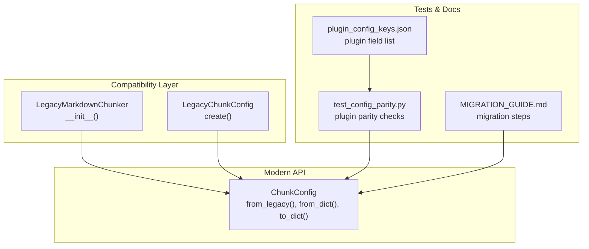
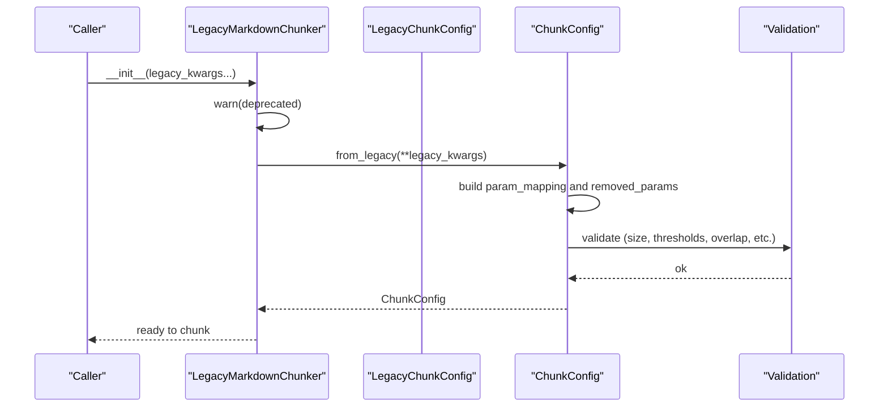
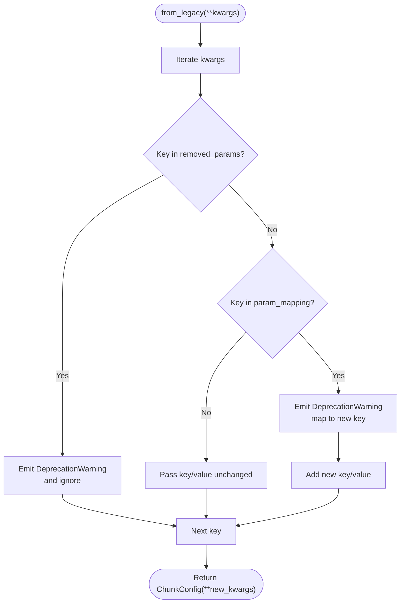
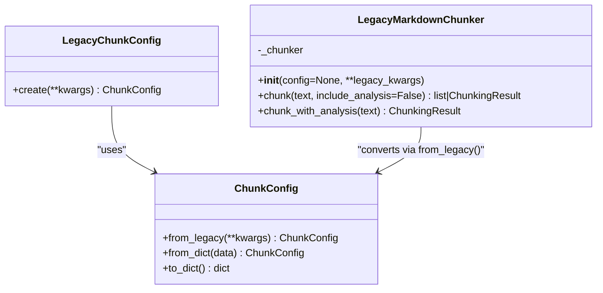
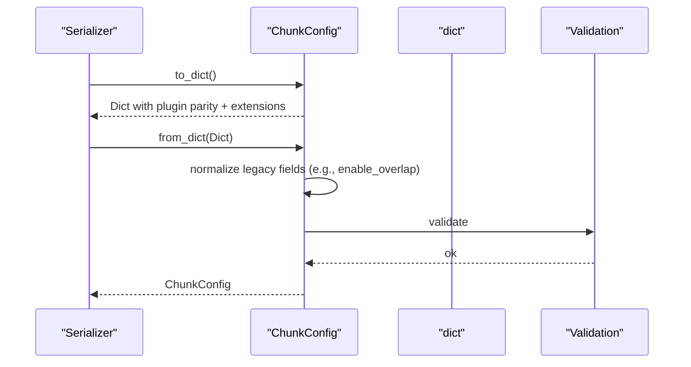
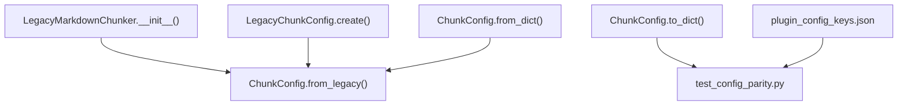

# Legacy Compatibility

<cite>
**Referenced Files in This Document**
- [config.py](file://src/chunkana/config.py)
- [compat.py](file://src/chunkana/compat.py)
- [MIGRATION_GUIDE.md](file://MIGRATION_GUIDE.md)
- [test_config_parity.py](file://tests/baseline/test_config_parity.py)
- [plugin_config_keys.json](file://tests/baseline/plugin_config_keys.json)
- [test_config.py](file://tests/unit/test_config.py)
</cite>

## Table of Contents
1. [Introduction](#introduction)
2. [Project Structure](#project-structure)
3. [Core Components](#core-components)
4. [Architecture Overview](#architecture-overview)
5. [Detailed Component Analysis](#detailed-component-analysis)
6. [Dependency Analysis](#dependency-analysis)
7. [Performance Considerations](#performance-considerations)
8. [Troubleshooting Guide](#troubleshooting-guide)
9. [Conclusion](#conclusion)
10. [Appendices](#appendices)

## Introduction
This document explains how ChunkConfig maintains legacy compatibility while simplifying the API from 32 parameters to 8 core parameters. It focuses on the from_legacy() method’s handling of deprecated and removed parameters, the parameter mapping (notably max_size → max_chunk_size), and how removed parameters are either always enabled or ignored. It also provides migration examples, guidance on interpreting deprecation warnings, and the design philosophy behind the simplification.

## Project Structure
Legacy compatibility spans two primary areas:
- The ChunkConfig class, which exposes the modern API and includes from_legacy() for converting legacy parameters.
- The compat module, which provides a compatibility layer for older calling patterns and wraps legacy parameter names.

**Diagram sources**
- [config.py](file://src/chunkana/config.py#L253-L308)
- [compat.py](file://src/chunkana/compat.py#L16-L53)
- [test_config_parity.py](file://tests/baseline/test_config_parity.py#L19-L127)
- [plugin_config_keys.json](file://tests/baseline/plugin_config_keys.json#L1-L22)
- [MIGRATION_GUIDE.md](file://MIGRATION_GUIDE.md#L1-L120)

**Section sources**
- [config.py](file://src/chunkana/config.py#L253-L308)
- [compat.py](file://src/chunkana/compat.py#L16-L53)
- [test_config_parity.py](file://tests/baseline/test_config_parity.py#L19-L127)
- [plugin_config_keys.json](file://tests/baseline/plugin_config_keys.json#L1-L22)
- [MIGRATION_GUIDE.md](file://MIGRATION_GUIDE.md#L1-L120)

## Core Components
- ChunkConfig.from_legacy(): Converts legacy parameter names to modern equivalents, emits deprecation warnings for renamed parameters, and ignores removed parameters. It returns a validated ChunkConfig instance.
- LegacyChunkConfig.create(): Thin wrapper around ChunkConfig.from_legacy() for convenience.
- LegacyMarkdownChunker.__init__(): Accepts legacy keyword arguments, emits a deprecation warning, and internally converts them to ChunkConfig via from_legacy().
- Plugin parity tests and plugin_config_keys.json: Define the canonical set of plugin-exposed fields that ChunkerConfig.to_dict() must include and from_dict() must accept.

Key responsibilities:
- Maintain backward compatibility for external callers using old parameter names.
- Preserve behavior for removed parameters that are now always enabled.
- Provide clear deprecation warnings to guide migration.

**Section sources**
- [config.py](file://src/chunkana/config.py#L253-L308)
- [compat.py](file://src/chunkana/compat.py#L16-L53)
- [test_config_parity.py](file://tests/baseline/test_config_parity.py#L19-L127)
- [plugin_config_keys.json](file://tests/baseline/plugin_config_keys.json#L1-L22)

## Architecture Overview
The legacy compatibility pipeline:

**Diagram sources**
- [compat.py](file://src/chunkana/compat.py#L36-L53)
- [config.py](file://src/chunkana/config.py#L253-L308)
- [config.py](file://src/chunkana/config.py#L138-L229)

## Detailed Component Analysis

### Legacy Parameter Handling in ChunkConfig.from_legacy()
Behavior summary:
- Renamed parameters are mapped to their modern equivalents.
- Removed parameters emit deprecation warnings and are ignored.
- Unknown parameters are passed through unchanged.

Parameter mapping highlights:
- max_size → max_chunk_size
- min_size → min_chunk_size

Removed parameters (always enabled or removed):
- enable_overlap → use overlap_size > 0
- block_based_splitting → always enabled
- preserve_code_blocks → always enabled
- preserve_tables → always enabled
- enable_deduplication → removed
- enable_regression_validation → removed
- enable_header_path_validation → removed
- use_enhanced_parser → always enabled
- use_legacy_overlap → removed
- enable_block_overlap → use overlap_size > 0
- enable_sentence_splitting → removed
- enable_paragraph_merging → removed
- enable_list_preservation → always enabled
- enable_metadata_enrichment → always enabled
- enable_size_normalization → removed
- enable_fallback_strategy → always enabled

Validation and defaults:
- The returned ChunkConfig runs post-init validations, including size bounds, overlap constraints, and threshold ranges.

**Diagram sources**
- [config.py](file://src/chunkana/config.py#L253-L308)

**Section sources**
- [config.py](file://src/chunkana/config.py#L253-L308)

### Compatibility Wrapper Classes
LegacyChunkConfig.create():
- Wraps ChunkConfig.from_legacy() for direct conversion from legacy parameters.

LegacyMarkdownChunker.__init__():
- Accepts legacy keyword arguments, warns about deprecation, and converts them to ChunkConfig via from_legacy() before initializing the underlying chunker.

**Diagram sources**
- [compat.py](file://src/chunkana/compat.py#L16-L53)
- [config.py](file://src/chunkana/config.py#L253-L308)

**Section sources**
- [compat.py](file://src/chunkana/compat.py#L16-L53)

### Plugin Parity and Serialization
ChunkerConfig.to_dict() and from_dict() ensure compatibility with the plugin’s expected fields:
- to_dict() includes all plugin parity fields plus Chunkana extensions.
- from_dict() handles legacy enable_overlap and nested configs (adaptive_config, table_grouping_config), filters unknown fields for forward compatibility, and validates the resulting config.

**Diagram sources**
- [config.py](file://src/chunkana/config.py#L408-L503)
- [test_config_parity.py](file://tests/baseline/test_config_parity.py#L19-L127)
- [plugin_config_keys.json](file://tests/baseline/plugin_config_keys.json#L1-L22)

**Section sources**
- [config.py](file://src/chunkana/config.py#L408-L503)
- [test_config_parity.py](file://tests/baseline/test_config_parity.py#L19-L127)
- [plugin_config_keys.json](file://tests/baseline/plugin_config_keys.json#L1-L22)

### Migration Examples and Guidance
- Parameter mapping example: max_size → max_chunk_size.
- Removed parameters: Many “enable_*” toggles are removed and are now always enabled; others are ignored with deprecation warnings.
- Legacy enable_overlap is handled by from_dict() by setting overlap_size appropriately.
- Use ChunkConfig.from_legacy() or LegacyChunkConfig.create() to convert legacy configurations.
- Prefer explicit ChunkConfig usage over passing legacy kwargs directly to LegacyMarkdownChunker.

Reference migration guidance:
- See the migration guide for step-by-step updates and renderer selection decisions.

**Section sources**
- [config.py](file://src/chunkana/config.py#L253-L308)
- [config.py](file://src/chunkana/config.py#L451-L503)
- [compat.py](file://src/chunkana/compat.py#L16-L53)
- [MIGRATION_GUIDE.md](file://MIGRATION_GUIDE.md#L1-L120)

### Design Philosophy Behind the Simplification
- Reduced parameter surface: From 32 parameters to 8 core parameters improves usability and reduces cognitive load.
- Default-safe behavior: Many legacy toggles are now always enabled, reducing the chance of misconfiguration.
- Centralized validation: Post-init validation ensures consistent behavior and catches invalid combinations early.
- Serialization-first compatibility: to_dict()/from_dict() keep external systems happy while enabling internal simplifications.

**Section sources**
- [config.py](file://src/chunkana/config.py#L17-L137)
- [config.py](file://src/chunkana/config.py#L138-L229)
- [test_config_parity.py](file://tests/baseline/test_config_parity.py#L19-L127)

## Dependency Analysis
Relationships among components involved in legacy compatibility:

**Diagram sources**
- [config.py](file://src/chunkana/config.py#L253-L308)
- [config.py](file://src/chunkana/config.py#L408-L503)
- [compat.py](file://src/chunkana/compat.py#L16-L53)
- [test_config_parity.py](file://tests/baseline/test_config_parity.py#L19-L127)
- [plugin_config_keys.json](file://tests/baseline/plugin_config_keys.json#L1-L22)

**Section sources**
- [config.py](file://src/chunkana/config.py#L253-L308)
- [config.py](file://src/chunkana/config.py#L408-L503)
- [compat.py](file://src/chunkana/compat.py#L16-L53)
- [test_config_parity.py](file://tests/baseline/test_config_parity.py#L19-L127)
- [plugin_config_keys.json](file://tests/baseline/plugin_config_keys.json#L1-L22)

## Performance Considerations
- Legacy conversion is lightweight: It performs simple key mapping and emits warnings; overhead is negligible compared to chunking.
- Validation occurs once during initialization; repeated conversions reuse the same validation logic.
- Using from_dict() with pre-serialized configs avoids repeated mapping workloads.

[No sources needed since this section provides general guidance]

## Troubleshooting Guide
Common issues and resolutions:
- Deprecation warnings for removed parameters:
  - These parameters are ignored; update your code to remove them. The warnings indicate what changed and suggest consulting the migration guide.
- Unexpected behavior after removal:
  - Many toggles are now always enabled (e.g., code/table preservation). Adjust expectations accordingly.
- Legacy enable_overlap:
  - If you previously relied on enable_overlap, ensure overlap_size is set appropriately in the modern config.
- Unknown fields in from_dict():
  - Unknown fields are ignored for forward compatibility; ensure you only pass supported fields.

Interpreting warnings:
- Renamed parameters: Replace the old key with the new key and continue using the modern API.
- Removed parameters: Remove them from your configuration; they are no longer configurable.

**Section sources**
- [config.py](file://src/chunkana/config.py#L253-L308)
- [config.py](file://src/chunkana/config.py#L451-L503)
- [MIGRATION_GUIDE.md](file://MIGRATION_GUIDE.md#L1-L120)

## Conclusion
ChunkConfig’s from_legacy() method preserves compatibility with older parameter sets by mapping renamed parameters and ignoring removed ones with clear deprecation warnings. The simplification reduces API complexity while keeping behavior consistent and validated. Use LegacyChunkConfig.create() or LegacyMarkdownChunker for immediate migration, and gradually adopt the modern ChunkConfig API for long-term maintainability.

[No sources needed since this section summarizes without analyzing specific files]

## Appendices

### Appendix A: Parameter Mapping Reference
- Renamed:
  - max_size → max_chunk_size
  - min_size → min_chunk_size
- Removed (ignored with deprecation warnings):
  - enable_overlap, enable_block_overlap → use overlap_size > 0
  - block_based_splitting, preserve_code_blocks, preserve_tables, enable_list_preservation, enable_metadata_enrichment, enable_fallback_strategy → always enabled
  - enable_deduplication, enable_regression_validation, enable_header_path_validation, use_legacy_overlap, enable_sentence_splitting, enable_paragraph_merging, enable_size_normalization → removed

**Section sources**
- [config.py](file://src/chunkana/config.py#L253-L308)

### Appendix B: Migration Steps
- Replace legacy parameter names with modern equivalents.
- Remove parameters that are now always enabled or removed.
- Use ChunkConfig.from_legacy() or LegacyChunkConfig.create() to convert existing configurations.
- Validate with plugin parity tests to ensure compatibility.

**Section sources**
- [MIGRATION_GUIDE.md](file://MIGRATION_GUIDE.md#L1-L120)
- [test_config_parity.py](file://tests/baseline/test_config_parity.py#L19-L127)
- [plugin_config_keys.json](file://tests/baseline/plugin_config_keys.json#L1-L22)