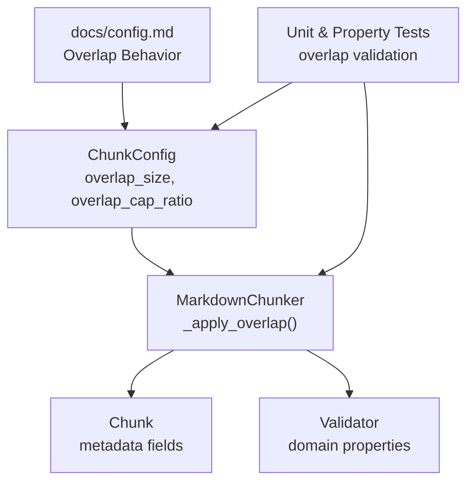
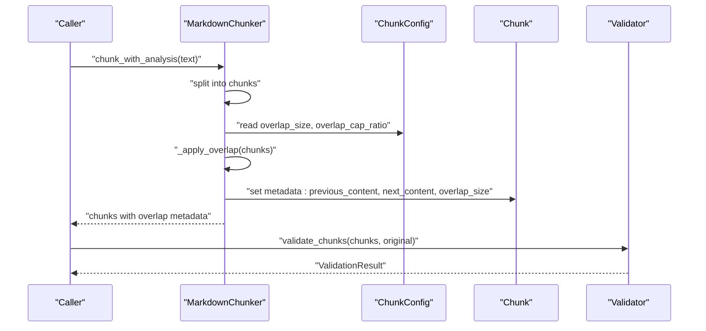
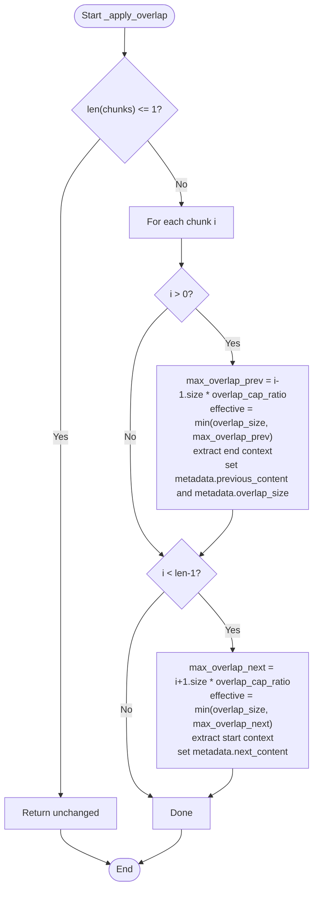
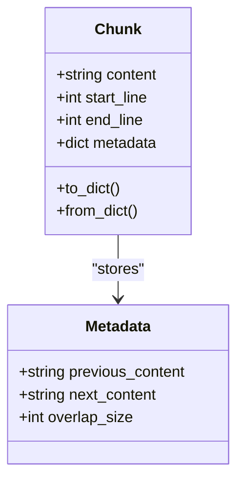
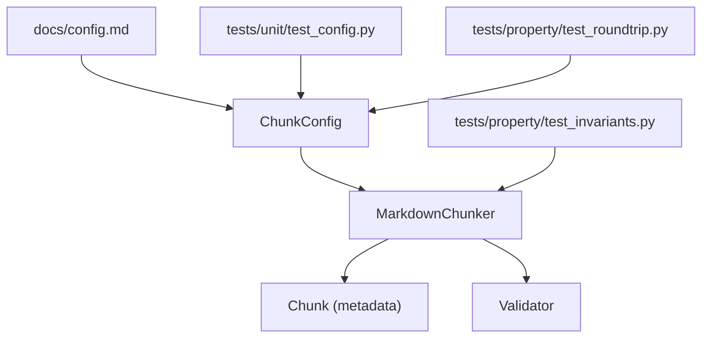

# Overlap Behavior

<cite>
**Referenced Files in This Document**
- [config.py](file://src/chunkana/config.py)
- [chunker.py](file://src/chunkana/chunker.py)
- [types.py](file://src/chunkana/types.py)
- [validator.py](file://src/chunkana/validator.py)
- [config.md](file://docs/config.md)
- [test_config.py](file://tests/unit/test_config.py)
- [test_roundtrip.py](file://tests/property/test_roundtrip.py)
- [test_invariants.py](file://tests/property/test_invariants.py)
- [simple_text.jsonl](file://tests/baseline/golden_canonical/simple_text.jsonl)
</cite>

## Table of Contents
1. [Introduction](#introduction)
2. [Project Structure](#project-structure)
3. [Core Components](#core-components)
4. [Architecture Overview](#architecture-overview)
5. [Detailed Component Analysis](#detailed-component-analysis)
6. [Dependency Analysis](#dependency-analysis)
7. [Performance Considerations](#performance-considerations)
8. [Troubleshooting Guide](#troubleshooting-guide)
9. [Conclusion](#conclusion)
10. [Appendices](#appendices)

## Introduction
This document explains how overlap behavior is configured and applied in ChunkConfig. It focuses on how overlap_size and overlap_cap_ratio work together to control context overlap between adjacent chunks, why overlap is stored in metadata rather than embedded in content, and how this impacts retrieval-augmented generation (RAG) quality. It also provides guidance on selecting appropriate overlap sizes for different chunk sizes and content types, along with validation rules and the relationship between overlap_size and max_chunk_size.

## Project Structure
Overlap behavior spans configuration, chunking, and validation modules:
- ChunkConfig defines overlap_size and overlap_cap_ratio and validates them.
- MarkdownChunker applies overlap metadata to chunks without duplicating text.
- Types define the Chunk model and metadata fields for overlap.
- Validator enforces domain properties that indirectly validate overlap correctness.
- Documentation and tests provide examples and constraints.

**Diagram sources**
- [config.py](file://src/chunkana/config.py#L77-L126)
- [chunker.py](file://src/chunkana/chunker.py#L300-L369)
- [types.py](file://src/chunkana/types.py#L240-L296)
- [validator.py](file://src/chunkana/validator.py#L43-L99)
- [config.md](file://docs/config.md#L76-L84)
- [test_config.py](file://tests/unit/test_config.py#L44-L53)
- [test_roundtrip.py](file://tests/property/test_roundtrip.py#L392-L408)

**Section sources**
- [config.py](file://src/chunkana/config.py#L77-L126)
- [chunker.py](file://src/chunkana/chunker.py#L300-L369)
- [types.py](file://src/chunkana/types.py#L240-L296)
- [validator.py](file://src/chunkana/validator.py#L43-L99)
- [config.md](file://docs/config.md#L76-L84)

## Core Components
- ChunkConfig: Holds overlap_size and overlap_cap_ratio, validates them, and exposes computed enable_overlap.
- MarkdownChunker: Applies overlap metadata to chunks using overlap_size and overlap_cap_ratio.
- Chunk: Defines metadata fields previous_content, next_content, and overlap_size.
- Validator: Enforces domain properties that ensure overlap correctness and chunk quality.

Key responsibilities:
- overlap_size: Base context window size (characters) used for overlap.
- overlap_cap_ratio: Fraction of adjacent chunk size that caps overlap; prevents excessive overlap for large chunks.
- Metadata-only overlap: previous_content and next_content are stored in metadata, not embedded in chunk.content.

**Section sources**
- [config.py](file://src/chunkana/config.py#L77-L126)
- [chunker.py](file://src/chunkana/chunker.py#L300-L369)
- [types.py](file://src/chunkana/types.py#L240-L296)
- [validator.py](file://src/chunkana/validator.py#L115-L142)

## Architecture Overview
Overlap is applied after chunking to add contextual previews without duplicating content. The process:
- Compute effective overlap size per pair using overlap_size and overlap_cap_ratio.
- Extract word-boundary-aware context from previous and next chunks.
- Store metadata-only context in chunk.metadata fields.
- Preserve chunk.content as non-overlapping text.

**Diagram sources**
- [chunker.py](file://src/chunkana/chunker.py#L300-L369)
- [config.py](file://src/chunkana/config.py#L77-L126)
- [types.py](file://src/chunkana/types.py#L240-L296)
- [validator.py](file://src/chunkana/validator.py#L43-L99)

## Detailed Component Analysis

### Overlap Configuration in ChunkConfig
- overlap_size: Non-negative integer controlling base overlap window. Must be less than max_chunk_size.
- overlap_cap_ratio: Fraction (0 < ratio <= 1) limiting overlap to a proportion of adjacent chunk size.
- Validation rules:
  - overlap_size >= 0
  - overlap_size < max_chunk_size
  - overlap_cap_ratio must be in (0, 1]
- Computed property enable_overlap: True when overlap_size > 0.

Practical implications:
- Larger chunks can have proportionally larger overlap without inflating metadata.
- Very small overlap_size combined with large chunks can still be capped by overlap_cap_ratio.

**Section sources**
- [config.py](file://src/chunkana/config.py#L138-L158)
- [config.py](file://src/chunkana/config.py#L222-L229)
- [config.py](file://src/chunkana/config.py#L248-L252)
- [test_config.py](file://tests/unit/test_config.py#L44-L53)
- [test_roundtrip.py](file://tests/property/test_roundtrip.py#L392-L408)

### How Overlap Is Applied in MarkdownChunker
- _apply_overlap computes effective overlap per neighbor:
  - max_overlap = min(overlap_size, adjacent_chunk_size * overlap_cap_ratio)
  - effective_overlap_size = min(overlap_size, max_overlap)
- Extracts word-boundary-aware context:
  - previous_content from end of previous chunk
  - next_content from start of next chunk
- Stores metadata-only context and overlap_size in chunk.metadata.
- Ensures chunk.content remains distinct and non-overlapping.

**Diagram sources**
- [chunker.py](file://src/chunkana/chunker.py#L300-L369)
- [chunker.py](file://src/chunkana/chunker.py#L371-L429)

**Section sources**
- [chunker.py](file://src/chunkana/chunker.py#L300-L369)
- [chunker.py](file://src/chunkana/chunker.py#L371-L429)

### Metadata Model for Overlap
- Chunk.metadata fields used for overlap:
  - previous_content: last N characters from previous chunk (metadata-only)
  - next_content: first N characters from next chunk (metadata-only)
  - overlap_size: actual length of context used
- These fields are separate from chunk.content, which remains non-overlapping.

**Diagram sources**
- [types.py](file://src/chunkana/types.py#L240-L296)

**Section sources**
- [types.py](file://src/chunkana/types.py#L240-L296)

### Purpose of Overlap in RAG
- Contextual continuity: previous_content and next_content help downstream models understand chunk boundaries and maintain coherence across chunk edges.
- Metadata-only storage avoids:
  - Index bloat from duplicated text
  - Semantic search confusion caused by repeated phrases
- Retrieval quality improves because:
  - Adjacent chunks share boundary context via metadata
  - Models can leverage this context during inference without corrupting the corpus

Evidence in code:
- Documentation explicitly states overlap is stored in metadata, not embedded in content.
- Tests enforce that chunk.content does not start with previous_content.

**Section sources**
- [config.md](file://docs/config.md#L76-L84)
- [test_invariants.py](file://tests/property/test_invariants.py#L387-L415)

### Examples of Overlap Configurations and Their Impact
Below are representative scenarios derived from the codebase and tests. Replace values with your own preferences; the relationships remain consistent.

- Small chunks with modest overlap:
  - max_chunk_size: 1024
  - min_chunk_size: 256
  - overlap_size: 50
  - overlap_cap_ratio: 0.35
  - Effect: Tight overlap; minimal metadata overhead; good for dense topics requiring frequent context switching.

- Default profile:
  - max_chunk_size: 4096
  - min_chunk_size: 512
  - overlap_size: 200
  - overlap_cap_ratio: 0.35
  - Effect: Balanced overlap; suitable for general documentation and articles.

- Large chunks with moderate overlap:
  - max_chunk_size: 8192
  - min_chunk_size: 1024
  - overlap_size: 100
  - overlap_cap_ratio: 0.35
  - Effect: Larger chunks with proportionally larger overlap; reduces boundary artifacts for long-form content.

- Adaptive sizing with overlap:
  - max_chunk_size: varies via AdaptiveSizeConfig
  - overlap_size: 200
  - overlap_cap_ratio: 0.35
  - Effect: Overlap adapts to chunk size automatically; maintains proportional context across varying chunk lengths.

Notes:
- overlap_size acts as a base cap; overlap_cap_ratio ensures proportionality to chunk size.
- Larger chunks can have larger effective overlap without manual tuning.

**Section sources**
- [config.py](file://src/chunkana/config.py#L334-L367)
- [config.py](file://src/chunkana/config.py#L354-L406)
- [config.md](file://docs/config.md#L123-L167)
- [simple_text.jsonl](file://tests/baseline/golden_canonical/simple_text.jsonl#L1-L4)

### Guidance on Selecting Overlap Sizes
- General guidance:
  - Start with overlap_size around 10–20% of typical chunk size for balanced RAG performance.
  - Keep overlap_cap_ratio near 0.35 for proportional scaling.
- Content type considerations:
  - Code-heavy documents: Consider slightly smaller overlap_size to reduce noise; keep overlap_cap_ratio at default.
  - Long-form prose: Consider moderate overlap_size; adjust overlap_cap_ratio to maintain proportionality.
  - Structured content (headers/lists): Smaller overlap_size often suffices; rely on overlap_cap_ratio to scale with chunk size.
- Relationship to max_chunk_size:
  - overlap_size must be strictly less than max_chunk_size.
  - If overlap_size approaches max_chunk_size, the system raises an error to prevent invalid configurations.

**Section sources**
- [config.py](file://src/chunkana/config.py#L138-L158)
- [config.py](file://src/chunkana/config.py#L222-L229)
- [test_config.py](file://tests/unit/test_config.py#L44-L53)

## Dependency Analysis
Overlap behavior depends on:
- ChunkConfig for parameters and validation
- MarkdownChunker for applying overlap metadata
- Types for metadata schema
- Validator for domain property checks

**Diagram sources**
- [config.py](file://src/chunkana/config.py#L77-L126)
- [chunker.py](file://src/chunkana/chunker.py#L300-L369)
- [types.py](file://src/chunkana/types.py#L240-L296)
- [validator.py](file://src/chunkana/validator.py#L43-L99)
- [config.md](file://docs/config.md#L76-L84)
- [test_config.py](file://tests/unit/test_config.py#L44-L53)
- [test_roundtrip.py](file://tests/property/test_roundtrip.py#L392-L408)
- [test_invariants.py](file://tests/property/test_invariants.py#L387-L415)

**Section sources**
- [config.py](file://src/chunkana/config.py#L77-L126)
- [chunker.py](file://src/chunkana/chunker.py#L300-L369)
- [types.py](file://src/chunkana/types.py#L240-L296)
- [validator.py](file://src/chunkana/validator.py#L115-L142)
- [config.md](file://docs/config.md#L76-L84)
- [test_config.py](file://tests/unit/test_config.py#L44-L53)
- [test_roundtrip.py](file://tests/property/test_roundtrip.py#L392-L408)
- [test_invariants.py](file://tests/property/test_invariants.py#L387-L415)

## Performance Considerations
- Metadata-only overlap avoids duplicating text, reducing memory and index size.
- Word-boundary-aware extraction minimizes fragmentation and preserves readability.
- Proportional overlap via overlap_cap_ratio prevents exponential growth in metadata for large chunks.

[No sources needed since this section provides general guidance]

## Troubleshooting Guide
Common issues and resolutions:
- overlap_size >= max_chunk_size:
  - Symptom: ValueError raised during configuration.
  - Resolution: Decrease overlap_size or increase max_chunk_size.
- overlap_cap_ratio out of range:
  - Symptom: ValueError indicating must be in (0, 1].
  - Resolution: Set overlap_cap_ratio to a value in (0, 1].
- Overlap unexpectedly small:
  - Cause: Effective overlap is limited by overlap_cap_ratio relative to adjacent chunk size.
  - Resolution: Increase overlap_size or reduce overlap_cap_ratio to achieve desired effective overlap.
- Overlap appears in chunk.content:
  - Cause: Misinterpretation; overlap is metadata-only.
  - Evidence: Tests assert chunk.content does not start with previous_content.
  - Resolution: Access metadata.previous_content and metadata.next_content for context.

**Section sources**
- [config.py](file://src/chunkana/config.py#L138-L158)
- [config.py](file://src/chunkana/config.py#L222-L229)
- [test_config.py](file://tests/unit/test_config.py#L44-L53)
- [test_roundtrip.py](file://tests/property/test_roundtrip.py#L392-L408)
- [test_invariants.py](file://tests/property/test_invariants.py#L387-L415)

## Conclusion
Overlap in ChunkConfig is controlled by two complementary parameters:
- overlap_size sets the base context window.
- overlap_cap_ratio ensures overlap scales proportionally with chunk size.

Together, they produce metadata-only overlap that improves RAG quality by preserving chunk integrity while providing boundary context. Validation rules protect against invalid configurations, and tests confirm that overlap remains metadata-only and within expected bounds.

[No sources needed since this section summarizes without analyzing specific files]

## Appendices

### Validation Rules Summary
- overlap_size must be non-negative and less than max_chunk_size.
- overlap_cap_ratio must be greater than 0 and less than or equal to 1.
- Domain properties ensure chunks respect size bounds and line numbering.

**Section sources**
- [config.py](file://src/chunkana/config.py#L138-L158)
- [config.py](file://src/chunkana/config.py#L222-L229)
- [validator.py](file://src/chunkana/validator.py#L115-L142)