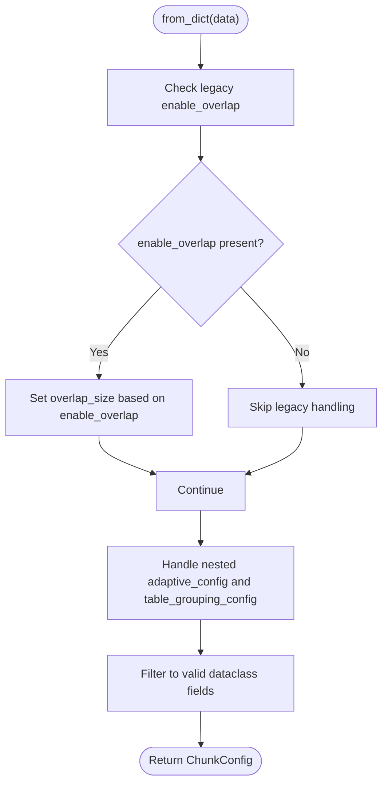

# Serialization

<cite>
**Referenced Files in This Document**
- [config.py](file://src/chunkana/config.py)
- [adaptive_sizing.py](file://src/chunkana/adaptive_sizing.py)
- [table_grouping.py](file://src/chunkana/table_grouping.py)
- [types.py](file://src/chunkana/types.py)
- [test_config_parity.py](file://tests/baseline/test_config_parity.py)
- [test_roundtrip.py](file://tests/property/test_roundtrip.py)
- [test_config.py](file://tests/unit/test_config.py)
- [plugin_config_keys.json](file://tests/baseline/plugin_config_keys.json)
- [compat.py](file://src/chunkana/compat.py)
</cite>

## Table of Contents
1. [Introduction](#introduction)
2. [Project Structure](#project-structure)
3. [Core Components](#core-components)
4. [Architecture Overview](#architecture-overview)
5. [Detailed Component Analysis](#detailed-component-analysis)
6. [Dependency Analysis](#dependency-analysis)
7. [Performance Considerations](#performance-considerations)
8. [Troubleshooting Guide](#troubleshooting-guide)
9. [Conclusion](#conclusion)
10. [Appendices](#appendices)

## Introduction
This document explains how configuration serialization works in ChunkConfig, focusing on the to_dict() and from_dict() methods that enable saving and restoring configuration objects. It covers the round-trip guarantee, forward compatibility (ignoring unknown fields), and nested configuration handling for AdaptiveSizeConfig and TableGroupingConfig. It also provides practical guidance for persisting configurations to JSON and other formats, sharing configurations across teams and systems, and migrating configurations over time.

## Project Structure
The serialization logic centers around the ChunkConfig class and its nested configuration components. The relevant files are:
- ChunkConfig and its serialization methods
- Nested AdaptiveSizeConfig and TableGroupingConfig with their own to_dict()/from_dict()
- Supporting types and tests that validate parity and round-trip behavior
- Compatibility helpers for legacy parameter names

**Diagram sources**
- [config.py](file://src/chunkana/config.py#L408-L507)
- [adaptive_sizing.py](file://src/chunkana/adaptive_sizing.py#L77-L101)
- [table_grouping.py](file://src/chunkana/table_grouping.py#L48-L66)
- [types.py](file://src/chunkana/types.py#L329-L375)
- [test_config_parity.py](file://tests/baseline/test_config_parity.py#L19-L127)
- [test_roundtrip.py](file://tests/property/test_roundtrip.py#L224-L315)
- [test_config.py](file://tests/unit/test_config.py#L74-L127)
- [plugin_config_keys.json](file://tests/baseline/plugin_config_keys.json#L1-L22)
- [compat.py](file://src/chunkana/compat.py#L16-L53)

**Section sources**
- [config.py](file://src/chunkana/config.py#L408-L507)
- [adaptive_sizing.py](file://src/chunkana/adaptive_sizing.py#L77-L101)
- [table_grouping.py](file://src/chunkana/table_grouping.py#L48-L66)
- [types.py](file://src/chunkana/types.py#L329-L375)
- [test_config_parity.py](file://tests/baseline/test_config_parity.py#L19-L127)
- [test_roundtrip.py](file://tests/property/test_roundtrip.py#L224-L315)
- [test_config.py](file://tests/unit/test_config.py#L74-L127)
- [plugin_config_keys.json](file://tests/baseline/plugin_config_keys.json#L1-L22)
- [compat.py](file://src/chunkana/compat.py#L16-L53)

## Core Components
- ChunkConfig: Top-level configuration with serialization methods and nested configuration support.
- AdaptiveSizeConfig: Nested configuration for adaptive chunk sizing with its own to_dict()/from_dict().
- TableGroupingConfig: Nested configuration for grouping related tables with its own to_dict()/from_dict().
- Chunk and ChunkingResult: Supporting types with to_dict()/from_dict() and JSON helpers for completeness.

Key responsibilities:
- ChunkConfig.to_dict(): Serializes all core and extension fields, including computed properties and nested configs.
- ChunkConfig.from_dict(): Restores configuration from a dictionary, handles legacy fields, nested configs, and ignores unknown fields for forward compatibility.
- AdaptiveSizeConfig.to_dict()/from_dict(): Serialize and restore adaptive sizing parameters.
- TableGroupingConfig.to_dict()/from_dict(): Serialize and restore table grouping parameters.

**Section sources**
- [config.py](file://src/chunkana/config.py#L408-L507)
- [adaptive_sizing.py](file://src/chunkana/adaptive_sizing.py#L77-L101)
- [table_grouping.py](file://src/chunkana/table_grouping.py#L48-L66)
- [types.py](file://src/chunkana/types.py#L329-L375)

## Architecture Overview
The serialization architecture is layered:
- Top-level ChunkConfig manages core and extension fields, nested configs, and computed properties.
- Nested AdaptiveSizeConfig and TableGroupingConfig encapsulate their respective domains and expose to_dict()/from_dict().
- Tests enforce parity with the plugin’s expected keys and validate round-trip correctness and forward compatibility.

**Diagram sources**
- [config.py](file://src/chunkana/config.py#L408-L507)
- [adaptive_sizing.py](file://src/chunkana/adaptive_sizing.py#L77-L101)
- [table_grouping.py](file://src/chunkana/table_grouping.py#L48-L66)
- [types.py](file://src/chunkana/types.py#L329-L375)

## Detailed Component Analysis

### ChunkConfig Serialization
ChunkConfig implements:
- to_dict(): Emits core plugin parity fields, extension fields, computed properties, and nested configs.
- from_dict(): Handles legacy fields, reconstructs nested configs, filters unknown fields, and validates parameters via dataclass fields.

Behavior highlights:
- Plugin parity: Ensures all keys expected by the plugin are included.
- Extension fields: Adds Chunkana-specific keys beyond plugin parity.
- Computed property: enable_overlap is included as a field in the serialized dict.
- Legacy handling: Converts legacy enable_overlap into overlap_size semantics.
- Unknown fields: Unknown keys are ignored to support forward compatibility.

**Diagram sources**
- [config.py](file://src/chunkana/config.py#L408-L507)
- [adaptive_sizing.py](file://src/chunkana/adaptive_sizing.py#L89-L101)
- [table_grouping.py](file://src/chunkana/table_grouping.py#L57-L66)

**Section sources**
- [config.py](file://src/chunkana/config.py#L408-L507)
- [test_config_parity.py](file://tests/baseline/test_config_parity.py#L19-L127)
- [test_roundtrip.py](file://tests/property/test_roundtrip.py#L224-L315)

### Nested Configurations: AdaptiveSizeConfig and TableGroupingConfig
Both nested configs provide:
- to_dict(): Serializes all fields.
- from_dict(): Deserializes with defaults for missing numeric fields and boolean defaults.

ChunkConfig integrates these by:
- Serializing nested configs as dicts.
- Reconstructing nested instances during from_dict().

**Diagram sources**
- [config.py](file://src/chunkana/config.py#L451-L503)
- [adaptive_sizing.py](file://src/chunkana/adaptive_sizing.py#L89-L101)
- [table_grouping.py](file://src/chunkana/table_grouping.py#L57-L66)

**Section sources**
- [adaptive_sizing.py](file://src/chunkana/adaptive_sizing.py#L77-L101)
- [table_grouping.py](file://src/chunkana/table_grouping.py#L48-L66)
- [config.py](file://src/chunkana/config.py#L451-L503)

### Round-Trip Guarantee and Forward Compatibility
- Round-trip: Serializing to dict and deserializing preserves all core and extension fields, including nested configs.
- Forward compatibility: Unknown fields in the input dict are ignored, enabling safe deserialization of future versions.
- Parity: The serialized dict includes all plugin keys and Chunkana extension keys.

**Diagram sources**
- [test_roundtrip.py](file://tests/property/test_roundtrip.py#L224-L315)
- [test_config_parity.py](file://tests/baseline/test_config_parity.py#L19-L127)

**Section sources**
- [test_roundtrip.py](file://tests/property/test_roundtrip.py#L224-L315)
- [test_config_parity.py](file://tests/baseline/test_config_parity.py#L19-L127)

### Legacy Parameter Handling
ChunkConfig.from_legacy() maps old parameter names to new ones and warns about deprecated parameters. compat.LegacyChunkConfig and compat.LegacyMarkdownChunker wrap this behavior for legacy usage.

**Diagram sources**
- [config.py](file://src/chunkana/config.py#L254-L308)
- [compat.py](file://src/chunkana/compat.py#L16-L53)

**Section sources**
- [config.py](file://src/chunkana/config.py#L254-L308)
- [compat.py](file://src/chunkana/compat.py#L16-L53)

### JSON Serialization Guidance
While ChunkConfig does not provide a dedicated to_json()/from_json() method, you can serialize to JSON using Python’s standard library and the dict representation:
- Serialize to JSON: Use the dict from to_dict() and pass it to your JSON encoder.
- Deserialize from JSON: Load JSON into a dict and pass it to from_dict().

Supporting types (Chunk and ChunkingResult) include to_json()/from_json() helpers for convenience.

**Section sources**
- [config.py](file://src/chunkana/config.py#L408-L507)
- [types.py](file://src/chunkana/types.py#L359-L375)

### Using Serialization for Sharing, Version Control, and API Communication
- Sharing: Export configurations as JSON or YAML for team collaboration. Keep a canonical configuration file in version control.
- Version control: Treat configuration files as code; review changes to parameters and nested configs.
- API communication: Send serialized dictionaries over the wire; servers can accept JSON and convert to dict before calling from_dict().

Best practices:
- Pin versions of external dependencies to ensure consistent serialization behavior.
- Include comments in configuration files to explain parameter choices.
- Use separate files for different environments (dev/staging/prod) while keeping a base configuration.

[No sources needed since this section provides general guidance]

### Handling Nested Configurations During Serialization
- AdaptiveSizeConfig: Serialized as a dict with numeric and boolean fields; from_dict() applies defaults for missing numeric fields.
- TableGroupingConfig: Serialized as a dict with integer and boolean fields; from_dict() applies defaults for missing fields.
- ChunkConfig.from_dict(): Detects presence of nested dicts and reconstructs nested instances accordingly.

**Section sources**
- [adaptive_sizing.py](file://src/chunkana/adaptive_sizing.py#L77-L101)
- [table_grouping.py](file://src/chunkana/table_grouping.py#L48-L66)
- [config.py](file://src/chunkana/config.py#L451-L503)

### Best Practices for Configuration Persistence and Migration
- Persist to JSON/YAML: Store configurations alongside source documents for reproducibility.
- Migration: Use from_legacy() and compat wrappers for legacy inputs; rely on unknown-field filtering for forward compatibility.
- Validation: Rely on built-in validation in ChunkConfig and nested configs; tests demonstrate expected error conditions.
- Parity: Ensure your serialized dict includes all plugin keys and Chunkana extension keys.

**Section sources**
- [config.py](file://src/chunkana/config.py#L254-L308)
- [test_config_parity.py](file://tests/baseline/test_config_parity.py#L19-L127)
- [test_roundtrip.py](file://tests/property/test_roundtrip.py#L224-L315)
- [test_config.py](file://tests/unit/test_config.py#L74-L127)

## Dependency Analysis
- Coupling: ChunkConfig depends on AdaptiveSizeConfig and TableGroupingConfig for nested serialization.
- Cohesion: Each class has a single responsibility—serialization and validation—promoting maintainability.
- External dependencies: Standard library dataclasses and typing are used; JSON serialization uses Python’s json module.

**Diagram sources**
- [config.py](file://src/chunkana/config.py#L408-L507)
- [adaptive_sizing.py](file://src/chunkana/adaptive_sizing.py#L77-L101)
- [table_grouping.py](file://src/chunkana/table_grouping.py#L48-L66)
- [test_roundtrip.py](file://tests/property/test_roundtrip.py#L224-L315)
- [test_config_parity.py](file://tests/baseline/test_config_parity.py#L19-L127)
- [plugin_config_keys.json](file://tests/baseline/plugin_config_keys.json#L1-L22)

**Section sources**
- [config.py](file://src/chunkana/config.py#L408-L507)
- [adaptive_sizing.py](file://src/chunkana/adaptive_sizing.py#L77-L101)
- [table_grouping.py](file://src/chunkana/table_grouping.py#L48-L66)
- [test_roundtrip.py](file://tests/property/test_roundtrip.py#L224-L315)
- [test_config_parity.py](file://tests/baseline/test_config_parity.py#L19-L127)
- [plugin_config_keys.json](file://tests/baseline/plugin_config_keys.json#L1-L22)

## Performance Considerations
- Serialization cost: to_dict() and nested to_dict() are lightweight; overhead is dominated by dict construction and recursion for nested configs.
- Memory footprint: Serialized dicts are proportional to the number of fields; nested configs add modest overhead.
- Recommendations: For high-throughput scenarios, reuse configuration instances and avoid repeated serialization unless necessary.

[No sources needed since this section provides general guidance]

## Troubleshooting Guide
Common issues and resolutions:
- Missing plugin keys: Ensure to_dict() includes all plugin keys; parity tests verify this.
- Unknown fields: from_dict() ignores unknown fields; if behavior differs unexpectedly, verify the field names.
- Legacy parameters: Use from_legacy() or compat wrappers for old parameter names.
- Validation errors: Invalid values raise ValueError with descriptive messages; adjust parameters accordingly.

**Section sources**
- [test_config_parity.py](file://tests/baseline/test_config_parity.py#L19-L127)
- [test_roundtrip.py](file://tests/property/test_roundtrip.py#L316-L409)
- [test_config.py](file://tests/unit/test_config.py#L74-L127)
- [config.py](file://src/chunkana/config.py#L254-L308)

## Conclusion
ChunkConfig provides robust, forward-compatible serialization through to_dict() and from_dict(). Together with nested AdaptiveSizeConfig and TableGroupingConfig, it enables reliable configuration persistence, sharing, and API communication. Parity tests and property-based round-trip validation ensure correctness across versions, while legacy compatibility helpers ease migration.

[No sources needed since this section summarizes without analyzing specific files]

## Appendices

### Appendix A: Example Workflows
- Export to JSON: Serialize a ChunkConfig instance to a dict, then encode to JSON with your preferred encoder.
- Import from JSON: Decode JSON into a dict, then pass to ChunkConfig.from_dict().
- Share across teams: Commit a canonical configuration file to version control; include environment-specific overrides.

[No sources needed since this section provides general guidance]