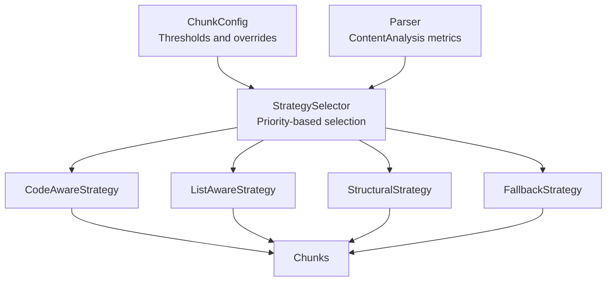
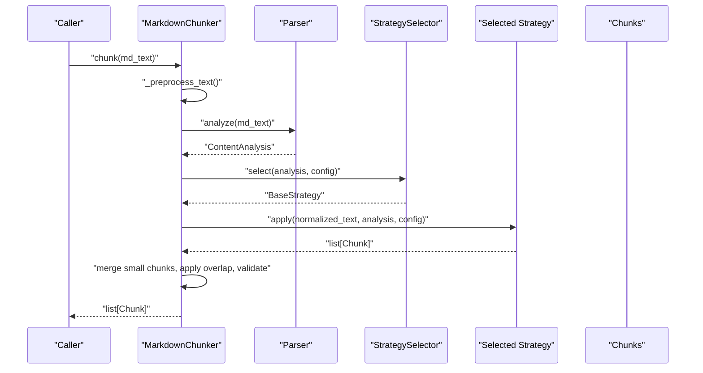
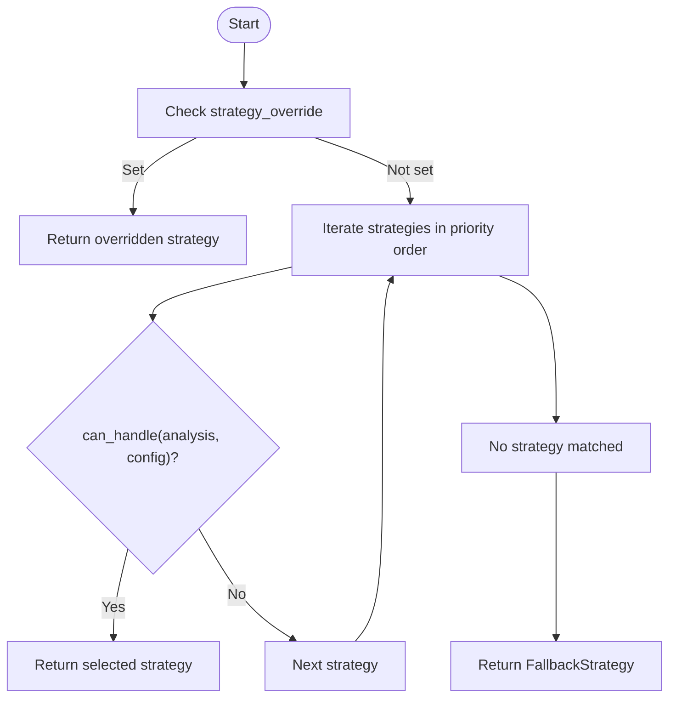
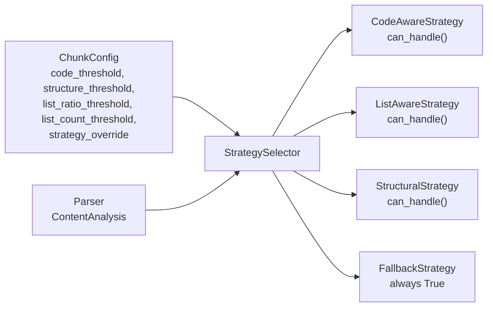

# Strategy Selection

<cite>
**Referenced Files in This Document**
- [config.py](file://src/chunkana/config.py)
- [strategies/__init__.py](file://src/chunkana/strategies/__init__.py)
- [strategies/base.py](file://src/chunkana/strategies/base.py)
- [strategies/code_aware.py](file://src/chunkana/strategies/code_aware.py)
- [strategies/list_aware.py](file://src/chunkana/strategies/list_aware.py)
- [strategies/structural.py](file://src/chunkana/strategies/structural.py)
- [strategies/fallback.py](file://src/chunkana/strategies/fallback.py)
- [parser.py](file://src/chunkana/parser.py)
- [types.py](file://src/chunkana/types.py)
- [chunker.py](file://src/chunkana/chunker.py)
- [test_strategies.py](file://tests/unit/test_strategies.py)
</cite>

## Table of Contents
1. [Introduction](#introduction)
2. [Project Structure](#project-structure)
3. [Core Components](#core-components)
4. [Architecture Overview](#architecture-overview)
5. [Detailed Component Analysis](#detailed-component-analysis)
6. [Dependency Analysis](#dependency-analysis)
7. [Performance Considerations](#performance-considerations)
8. [Troubleshooting Guide](#troubleshooting-guide)
9. [Conclusion](#conclusion)
10. [Appendices](#appendices)

## Introduction
This document explains how ChunkConfig’s strategy selection parameters influence automatic strategy choice in the system. It focuses on:
- code_threshold
- structure_threshold
- list_ratio_threshold
- list_count_threshold
- strategy_override

You will learn how these parameters are used by StrategySelector and individual strategies, how thresholds affect decision-making, and how to tune them for different content types (code repositories, technical documentation, changelogs). Edge cases and troubleshooting tips are also covered.

## Project Structure
The strategy selection pipeline is centralized in the strategies package and driven by ChunkConfig thresholds. The parser produces ContentAnalysis metrics consumed by strategies.

**Diagram sources**
- [config.py](file://src/chunkana/config.py#L36-L45)
- [strategies/__init__.py](file://src/chunkana/strategies/__init__.py#L20-L68)
- [parser.py](file://src/chunkana/parser.py#L44-L121)
- [strategies/code_aware.py](file://src/chunkana/strategies/code_aware.py#L32-L41)
- [strategies/list_aware.py](file://src/chunkana/strategies/list_aware.py#L48-L90)
- [strategies/structural.py](file://src/chunkana/strategies/structural.py#L52-L57)
- [strategies/fallback.py](file://src/chunkana/strategies/fallback.py#L31-L34)

**Section sources**
- [config.py](file://src/chunkana/config.py#L36-L45)
- [strategies/__init__.py](file://src/chunkana/strategies/__init__.py#L20-L68)
- [parser.py](file://src/chunkana/parser.py#L44-L121)

## Core Components
- ChunkConfig holds the eight core parameters, including the four strategy selection thresholds and strategy_override.
- StrategySelector selects the best strategy based on priority and each strategy’s can_handle() evaluation using ContentAnalysis and ChunkConfig thresholds.
- Strategies evaluate whether they can handle a document:
  - CodeAwareStrategy: activated by code blocks, tables, or code_ratio ≥ code_threshold.
  - ListAwareStrategy: activated by list_ratio > list_ratio_threshold OR list_count ≥ list_count_threshold (with nuanced logic for strongly structured vs. weakly structured documents).
  - StructuralStrategy: activated by header_count ≥ structure_threshold AND max_header_depth > 1.
  - FallbackStrategy: always eligible.

Key threshold validations occur in ChunkConfig to ensure sensible ranges.

**Section sources**
- [config.py](file://src/chunkana/config.py#L36-L45)
- [config.py](file://src/chunkana/config.py#L159-L174)
- [strategies/__init__.py](file://src/chunkana/strategies/__init__.py#L20-L68)
- [strategies/code_aware.py](file://src/chunkana/strategies/code_aware.py#L32-L41)
- [strategies/list_aware.py](file://src/chunkana/strategies/list_aware.py#L48-L90)
- [strategies/structural.py](file://src/chunkana/strategies/structural.py#L52-L57)
- [strategies/fallback.py](file://src/chunkana/strategies/fallback.py#L31-L34)

## Architecture Overview
The chunking pipeline computes ContentAnalysis, selects a strategy, applies it, and returns chunks with metadata.

**Diagram sources**
- [chunker.py](file://src/chunkana/chunker.py#L85-L140)
- [chunker.py](file://src/chunkana/chunker.py#L198-L216)
- [parser.py](file://src/chunkana/parser.py#L44-L121)
- [strategies/__init__.py](file://src/chunkana/strategies/__init__.py#L39-L61)

## Detailed Component Analysis

### StrategySelector Decision Flow
StrategySelector evaluates strategies in priority order:
1) CodeAwareStrategy
2) ListAwareStrategy
3) StructuralStrategy
4) FallbackStrategy

Selection logic:
- If config.strategy_override is set, return the named strategy immediately.
- Otherwise, iterate strategies and return the first that can_handle() returns True.
- If none qualify, return FallbackStrategy.

**Diagram sources**
- [strategies/__init__.py](file://src/chunkana/strategies/__init__.py#L39-L61)

**Section sources**
- [strategies/__init__.py](file://src/chunkana/strategies/__init__.py#L20-L68)

### CodeAwareStrategy
Activation:
- analysis.code_block_count ≥ 1
- OR analysis.table_count ≥ 1
- OR analysis.code_ratio ≥ config.code_threshold

Behavior:
- Preserves atomic blocks (code, tables, LaTeX) and splits text around them.
- Supports enhanced code-context binding when enabled.

Typical metrics triggering CodeAwareStrategy:
- Documents with ≥1 code block or ≥1 table.
- Documents with code_ratio exceeding the configured threshold (e.g., 0.3 by default).

Edge cases:
- Very large code blocks may exceed max_chunk_size; strategies mark allow_oversize with reason metadata.

**Section sources**
- [strategies/code_aware.py](file://src/chunkana/strategies/code_aware.py#L32-L41)
- [strategies/base.py](file://src/chunkana/strategies/base.py#L90-L118)

### ListAwareStrategy
Activation:
- For documents WITHOUT strong structure: list_ratio > list_ratio_threshold OR list_count ≥ list_count_threshold
- For documents WITH strong structure (many headers, deep hierarchy, headers significantly outnumber lists): both list_ratio > list_ratio_threshold AND list_count ≥ list_count_threshold

Behavior:
- Preserves nested list hierarchies.
- Binds introductory paragraphs to lists when appropriate.
- Splits large lists while preserving hierarchy.

Typical metrics triggering ListAwareStrategy:
- High list_ratio and/or high list_count.
- For strongly structured documents, both conditions must hold to avoid interference with StructuralStrategy.

**Section sources**
- [strategies/list_aware.py](file://src/chunkana/strategies/list_aware.py#L48-L90)

### StructuralStrategy
Activation:
- analysis.header_count ≥ config.structure_threshold
- analysis.max_header_depth > 1

Behavior:
- Splits by headers, maintaining header hierarchy.
- Computes header_path and section_tags metadata.

Typical metrics triggering StructuralStrategy:
- Sufficient headers and a maximum header depth > 1.

**Section sources**
- [strategies/structural.py](file://src/chunkana/strategies/structural.py#L52-L57)

### FallbackStrategy
Activation:
- Always returns True.

Behavior:
- Splits by paragraph boundaries and groups to fit max_chunk_size.
- Preserves atomic blocks when present.

Typical metrics triggering FallbackStrategy:
- Documents that do not meet the above conditions.

**Section sources**
- [strategies/fallback.py](file://src/chunkana/strategies/fallback.py#L31-L34)

### Thresholds in Action: How They Influence Strategy Selection
- code_threshold: Controls whether a document is treated as “code-heavy” even without explicit code blocks or tables. Typical default is 0.3.
- structure_threshold: Controls the minimum number of headers required for StructuralStrategy activation. Typical default is 3.
- list_ratio_threshold: Controls the minimum list dominance for ListAwareStrategy. Typical default is 0.4.
- list_count_threshold: Controls the minimum number of list blocks for ListAwareStrategy. Typical default is 5.
- strategy_override: Forces a specific strategy regardless of metrics.

Validation ensures thresholds are within acceptable ranges.

**Section sources**
- [config.py](file://src/chunkana/config.py#L36-L45)
- [config.py](file://src/chunkana/config.py#L159-L174)

### Tuning Guidelines by Content Type
- Code repositories:
  - Increase code_threshold to treat documents with moderate code presence as code-heavy.
  - Keep structure_threshold moderate to still allow StructuralStrategy for heavily documented codebases.
  - Consider enabling table grouping if tables are common.
  - Example profiles:
    - [config.py](file://src/chunkana/config.py#L314-L323)
    - [config.py](file://src/chunkana/config.py#L370-L387)

- Technical documentation:
  - Lower structure_threshold to activate StructuralStrategy earlier.
  - Keep list_ratio_threshold and list_count_threshold moderate to avoid forcing ListAwareStrategy on documents that are primarily structured.
  - Example profiles:
    - [config.py](file://src/chunkana/config.py#L324-L333)

- Changelogs:
  - Lower list_ratio_threshold and list_count_threshold to capture frequent list-heavy content.
  - Example profile:
    - [config.py](file://src/chunkana/config.py#L344-L352)

- Adaptive sizing:
  - Use adaptive sizing to adjust chunk sizes based on content complexity (code, tables, lists, sentence length).
  - Example profiles:
    - [config.py](file://src/chunkana/config.py#L355-L368)
    - [config.py](file://src/chunkana/config.py#L389-L406)

**Section sources**
- [config.py](file://src/chunkana/config.py#L314-L323)
- [config.py](file://src/chunkana/config.py#L324-L333)
- [config.py](file://src/chunkana/config.py#L344-L352)
- [config.py](file://src/chunkana/config.py#L355-L368)
- [config.py](file://src/chunkana/config.py#L370-L387)
- [config.py](file://src/chunkana/config.py#L389-L406)

### Concrete Examples of Document Analysis Metrics That Trigger Each Strategy
- CodeAwareStrategy:
  - analysis.code_block_count ≥ 1
  - OR analysis.table_count ≥ 1
  - OR analysis.code_ratio ≥ config.code_threshold

- ListAwareStrategy:
  - Weak structure: list_ratio > list_ratio_threshold OR list_count ≥ list_count_threshold
  - Strong structure: list_ratio > list_ratio_threshold AND list_count ≥ list_count_threshold

- StructuralStrategy:
  - header_count ≥ structure_threshold AND max_header_depth > 1

- FallbackStrategy:
  - Always eligible.

These conditions are evaluated by each strategy’s can_handle() method using ContentAnalysis fields and ChunkConfig thresholds.

**Section sources**
- [strategies/code_aware.py](file://src/chunkana/strategies/code_aware.py#L32-L41)
- [strategies/list_aware.py](file://src/chunkana/strategies/list_aware.py#L48-L90)
- [strategies/structural.py](file://src/chunkana/strategies/structural.py#L52-L57)
- [strategies/fallback.py](file://src/chunkana/strategies/fallback.py#L31-L34)

### How StrategySelector Uses Thresholds
- StrategySelector.select() checks config.strategy_override first.
- Otherwise, it iterates strategies in priority order and returns the first whose can_handle() returns True given ContentAnalysis and ChunkConfig thresholds.

This ensures deterministic selection order and predictable behavior across content types.

**Section sources**
- [strategies/__init__.py](file://src/chunkana/strategies/__init__.py#L39-L61)

### Validation of Thresholds
ChunkConfig validates:
- code_threshold ∈ [0, 1]
- structure_threshold ≥ 1
- list_ratio_threshold ∈ [0, 1]
- list_count_threshold ≥ 1
- strategy_override ∈ {"code_aware", "list_aware", "structural", "fallback"}

These validations prevent invalid configurations.

**Section sources**
- [config.py](file://src/chunkana/config.py#L159-L174)

## Dependency Analysis
The following diagram shows how thresholds and analysis drive strategy selection:

**Diagram sources**
- [config.py](file://src/chunkana/config.py#L36-L45)
- [strategies/__init__.py](file://src/chunkana/strategies/__init__.py#L39-L61)
- [parser.py](file://src/chunkana/parser.py#L44-L121)
- [strategies/code_aware.py](file://src/chunkana/strategies/code_aware.py#L32-L41)
- [strategies/list_aware.py](file://src/chunkana/strategies/list_aware.py#L48-L90)
- [strategies/structural.py](file://src/chunkana/strategies/structural.py#L52-L57)
- [strategies/fallback.py](file://src/chunkana/strategies/fallback.py#L31-L34)

**Section sources**
- [strategies/__init__.py](file://src/chunkana/strategies/__init__.py#L20-L68)
- [parser.py](file://src/chunkana/parser.py#L44-L121)
- [types.py](file://src/chunkana/types.py#L182-L238)

## Performance Considerations
- StrategySelector iteration is O(S) where S is the number of strategies (constant).
- Each strategy’s can_handle() uses ContentAnalysis fields and simple comparisons, which are O(1) relative to document size.
- Parser.compute metrics are linear in document size; ContentAnalysis is reused by strategies to avoid repeated parsing.

[No sources needed since this section provides general guidance]

## Troubleshooting Guide
Common issues and resolutions:
- Unexpected strategy selection:
  - Verify thresholds in ChunkConfig meet your content characteristics.
  - Use strategy_override to force a specific strategy for testing.
  - Inspect ContentAnalysis fields (e.g., code_ratio, list_ratio, header_count) to confirm metrics.

- Oversized chunks:
  - Strategies may intentionally mark chunks as oversize when preserving atomic blocks (e.g., code_block_integrity, table_integrity).
  - Check chunk.metadata.allow_oversize and reason fields.

- List-aware interfering with structural:
  - For strongly structured documents, both list_ratio and list_count thresholds must be met to avoid ListAwareStrategy.
  - Adjust list_ratio_threshold and list_count_threshold accordingly.

- Tests demonstrating expected behavior:
  - Strategy selection tests show correct strategy selection for code-heavy, list-heavy, structural, and plain-text documents.
  - Strategy override tests demonstrate forced strategy selection.

**Section sources**
- [strategies/base.py](file://src/chunkana/strategies/base.py#L90-L118)
- [strategies/list_aware.py](file://src/chunkana/strategies/list_aware.py#L48-L90)
- [test_strategies.py](file://tests/unit/test_strategies.py#L12-L122)
- [test_strategies.py](file://tests/unit/test_strategies.py#L138-L163)

## Conclusion
Strategy selection hinges on four thresholds and one override:
- code_threshold influences CodeAwareStrategy activation.
- structure_threshold influences StructuralStrategy activation.
- list_ratio_threshold and list_count_threshold influence ListAwareStrategy activation, with nuanced logic for strongly structured documents.
- strategy_override forces a specific strategy.

By aligning thresholds with content characteristics—using provided profiles and validation—you can achieve predictable, high-quality chunking across diverse document types.

[No sources needed since this section summarizes without analyzing specific files]

## Appendices

### Appendix A: Strategy Metadata in Chunks
Each chunk includes strategy metadata and other fields useful for diagnostics and downstream processing.

**Section sources**
- [types.py](file://src/chunkana/types.py#L241-L376)

### Appendix B: Strategy Selection Tests
Unit tests validate strategy selection under typical scenarios and demonstrate override behavior.

**Section sources**
- [test_strategies.py](file://tests/unit/test_strategies.py#L12-L122)
- [test_strategies.py](file://tests/unit/test_strategies.py#L138-L163)