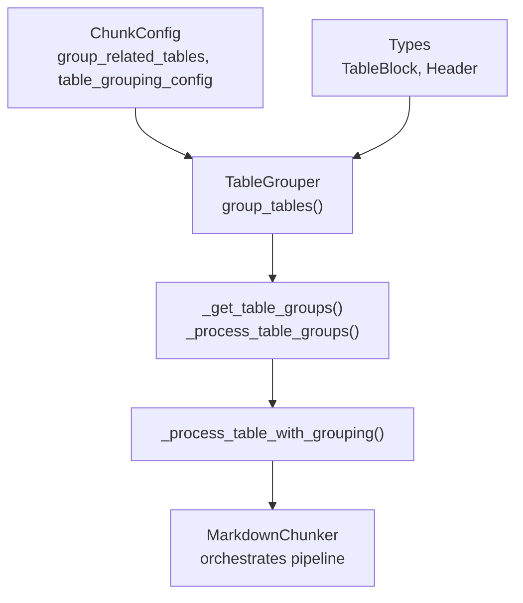
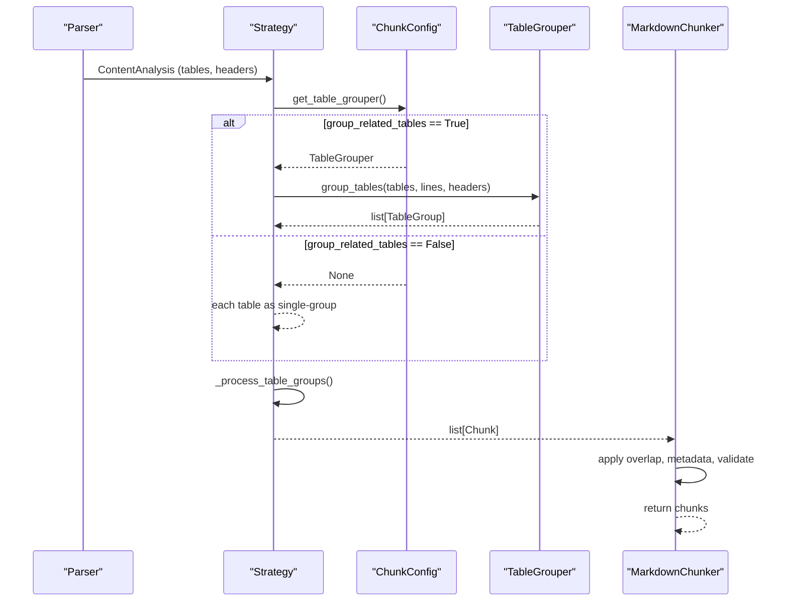
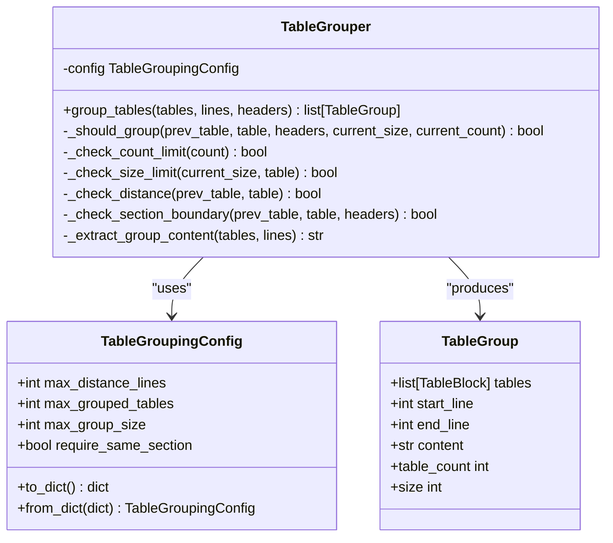
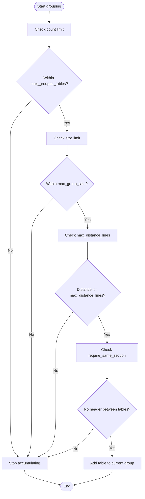
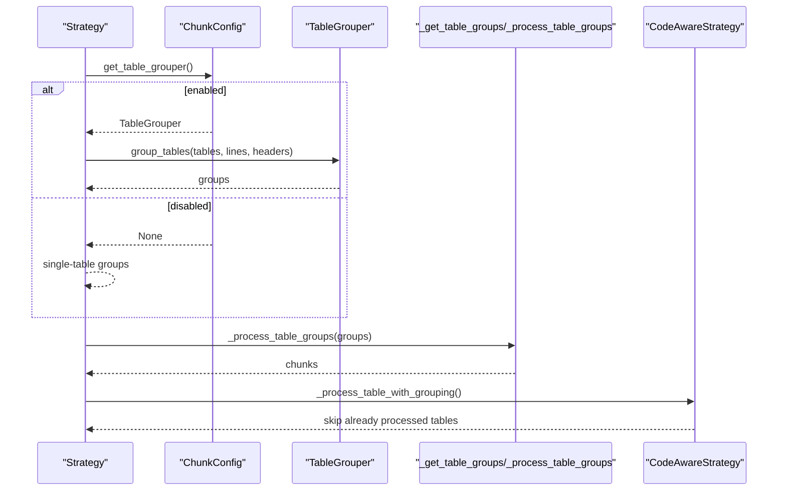
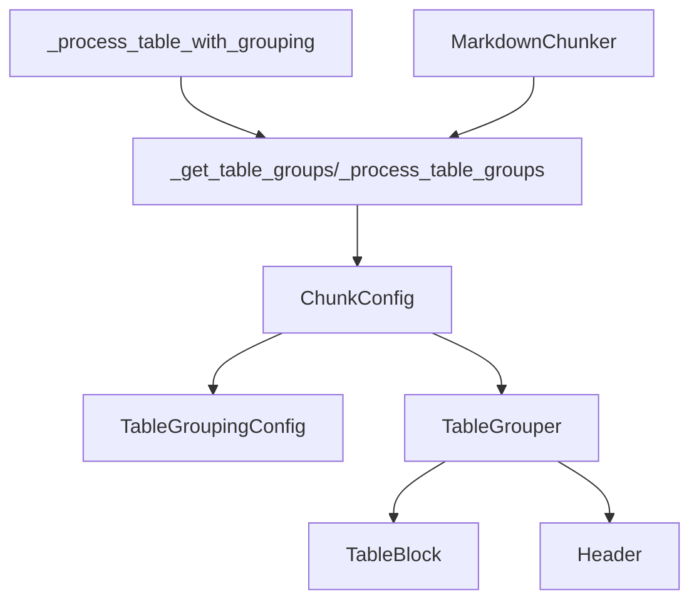

# Table Grouping

<cite>
**Referenced Files in This Document**
- [config.py](file://src/chunkana/config.py)
- [table_grouping.py](file://src/chunkana/table_grouping.py)
- [types.py](file://src/chunkana/types.py)
- [base.py](file://src/chunkana/strategies/base.py)
- [code_aware.py](file://src/chunkana/strategies/code_aware.py)
- [chunker.py](file://src/chunkana/chunker.py)
- [config.md](file://docs/config.md)
- [table_grouping.md](file://tests/baseline/fixtures/table_grouping.md)
</cite>

## Table of Contents
1. [Introduction](#introduction)
2. [Project Structure](#project-structure)
3. [Core Components](#core-components)
4. [Architecture Overview](#architecture-overview)
5. [Detailed Component Analysis](#detailed-component-analysis)
6. [Dependency Analysis](#dependency-analysis)
7. [Performance Considerations](#performance-considerations)
8. [Troubleshooting Guide](#troubleshooting-guide)
9. [Conclusion](#conclusion)
10. [Appendices](#appendices)

## Introduction
This document explains how table grouping works in ChunkConfig and how the combination of group_related_tables and table_grouping_config improves retrieval quality by keeping related tables together. It covers the TableGroupingConfig parameters, how they influence grouping decisions, and how to tune them for different document structures. It also compares grouped versus ungrouped processing, outlines performance implications, and provides guidance on enabling and tuning table grouping.

## Project Structure
Table grouping spans configuration, grouping logic, and strategy integration:
- ChunkConfig exposes group_related_tables and table_grouping_config.
- TableGroupingConfig defines grouping constraints.
- Strategies compute table groups and produce chunks.
- The chunker orchestrates parsing, strategy selection, and post-processing.

**Diagram sources**
- [config.py](file://src/chunkana/config.py#L120-L123)
- [table_grouping.py](file://src/chunkana/table_grouping.py#L96-L159)
- [types.py](file://src/chunkana/types.py#L118-L136)
- [base.py](file://src/chunkana/strategies/base.py#L273-L361)
- [code_aware.py](file://src/chunkana/strategies/code_aware.py#L380-L479)
- [chunker.py](file://src/chunkana/chunker.py#L85-L176)

**Section sources**
- [config.py](file://src/chunkana/config.py#L120-L123)
- [table_grouping.py](file://src/chunkana/table_grouping.py#L96-L159)
- [types.py](file://src/chunkana/types.py#L118-L136)
- [base.py](file://src/chunkana/strategies/base.py#L273-L361)
- [code_aware.py](file://src/chunkana/strategies/code_aware.py#L380-L479)
- [chunker.py](file://src/chunkana/chunker.py#L85-L176)

## Core Components
- ChunkConfig: Exposes group_related_tables and table_grouping_config. Provides get_table_grouper() to instantiate a TableGrouper when grouping is enabled.
- TableGroupingConfig: Defines constraints for grouping: max_distance_lines, max_grouped_tables, max_group_size, require_same_section.
- TableGrouper: Implements grouping logic across tables, respecting distance, section boundaries, and size limits.
- Strategies: Compute table groups and produce chunks, adding metadata for grouped tables.
- Types: TableBlock and Header support grouping and content extraction.

**Section sources**
- [config.py](file://src/chunkana/config.py#L120-L123)
- [config.py](file://src/chunkana/config.py#L230-L247)
- [table_grouping.py](file://src/chunkana/table_grouping.py#L14-L66)
- [table_grouping.py](file://src/chunkana/table_grouping.py#L96-L159)
- [types.py](file://src/chunkana/types.py#L118-L136)
- [base.py](file://src/chunkana/strategies/base.py#L273-L361)
- [code_aware.py](file://src/chunkana/strategies/code_aware.py#L380-L479)

## Architecture Overview
Table grouping is integrated into the chunking pipeline as follows:
- The parser produces ContentAnalysis with tables and headers.
- Strategies compute table groups via ChunkConfig.get_table_grouper().
- TableGrouper.group_tables() applies constraints to form groups.
- Strategy creates chunks from groups, marking table groups with metadata.
- The chunker applies overlap and validation.

**Diagram sources**
- [base.py](file://src/chunkana/strategies/base.py#L273-L361)
- [config.py](file://src/chunkana/config.py#L230-L247)
- [table_grouping.py](file://src/chunkana/table_grouping.py#L116-L159)
- [chunker.py](file://src/chunkana/chunker.py#L85-L176)

## Detailed Component Analysis

### TableGroupingConfig and TableGrouper
TableGroupingConfig controls grouping behavior:
- max_distance_lines: Maximum allowed line distance between consecutive tables to be grouped.
- max_grouped_tables: Maximum number of tables in a single group.
- max_group_size: Maximum combined character length for grouped content.
- require_same_section: Enforce that tables must be within the same header section.

TableGrouper.group_tables() iterates tables in order and accumulates them into groups until a constraint fails. It extracts content for each group, including normalized text between tables.

**Diagram sources**
- [table_grouping.py](file://src/chunkana/table_grouping.py#L14-L66)
- [table_grouping.py](file://src/chunkana/table_grouping.py#L96-L159)
- [table_grouping.py](file://src/chunkana/table_grouping.py#L183-L235)
- [table_grouping.py](file://src/chunkana/table_grouping.py#L250-L326)
- [types.py](file://src/chunkana/types.py#L118-L136)

**Section sources**
- [table_grouping.py](file://src/chunkana/table_grouping.py#L14-L66)
- [table_grouping.py](file://src/chunkana/table_grouping.py#L96-L159)
- [table_grouping.py](file://src/chunkana/table_grouping.py#L183-L235)
- [table_grouping.py](file://src/chunkana/table_grouping.py#L250-L326)
- [types.py](file://src/chunkana/types.py#L118-L136)

### How group_related_tables and table_grouping_config Work Together
- group_related_tables toggles whether grouping is enabled. When True, ChunkConfig.get_table_grouper() returns a TableGrouper initialized with table_grouping_config (or defaults).
- table_grouping_config defines the constraints that determine which tables are grouped and how big a group can be.

Key integration points:
- ChunkConfig.get_table_grouper(): returns None when group_related_tables is False; otherwise constructs TableGrouper with TableGroupingConfig.
- Strategies call get_table_grouper() and pass analysis.tables, lines, and headers to group_tables().

**Section sources**
- [config.py](file://src/chunkana/config.py#L120-L123)
- [config.py](file://src/chunkana/config.py#L230-L247)
- [base.py](file://src/chunkana/strategies/base.py#L273-L317)

### Grouping Decision Flow
The decision-making logic is encapsulated in TableGrouper._should_group(), which enforces constraints in order:
- Count limit: group size must not exceed max_grouped_tables.
- Size limit: combined size must not exceed max_group_size.
- Distance: line distance between consecutive tables must not exceed max_distance_lines.
- Section boundary: if require_same_section is True, no header must lie between the tables.

**Diagram sources**
- [table_grouping.py](file://src/chunkana/table_grouping.py#L183-L235)

**Section sources**
- [table_grouping.py](file://src/chunkana/table_grouping.py#L183-L235)

### Strategy Integration and Chunk Creation
- Strategies compute table groups via _get_table_groups(), which either delegates to TableGrouper or falls back to single-table groups.
- _process_table_groups() converts groups into chunks, sets content_type to "table", marks table groups, and applies oversize metadata when needed.
- CodeAwareStrategy’s _process_table_with_grouping() ensures that once a table is included in a group, subsequent tables in that group are skipped to avoid duplication.

**Diagram sources**
- [base.py](file://src/chunkana/strategies/base.py#L273-L361)
- [code_aware.py](file://src/chunkana/strategies/code_aware.py#L380-L479)
- [config.py](file://src/chunkana/config.py#L230-L247)

**Section sources**
- [base.py](file://src/chunkana/strategies/base.py#L273-L361)
- [code_aware.py](file://src/chunkana/strategies/code_aware.py#L380-L479)
- [config.py](file://src/chunkana/config.py#L230-L247)

### Example: Grouped vs Ungrouped Table Processing
- Ungrouped: Each table becomes a separate chunk. This preserves atomicity but may fragment related tables across chunks.
- Grouped: Tables within the same section and within max_distance_lines are combined into a single chunk, preserving contextual relationships.

Reference fixture demonstrating grouped tables within the same section and an isolated table that should remain separate.

**Section sources**
- [table_grouping.md](file://tests/baseline/fixtures/table_grouping.md#L1-L92)
- [base.py](file://src/chunkana/strategies/base.py#L273-L317)

## Dependency Analysis
- ChunkConfig depends on TableGroupingConfig for table grouping behavior.
- Strategies depend on ChunkConfig.get_table_grouper() to obtain a TableGrouper.
- TableGrouper depends on TableBlock and Header types for line-based grouping.
- The chunker orchestrates the pipeline and applies overlap and validation after strategy output.

**Diagram sources**
- [config.py](file://src/chunkana/config.py#L120-L123)
- [config.py](file://src/chunkana/config.py#L230-L247)
- [table_grouping.py](file://src/chunkana/table_grouping.py#L96-L159)
- [types.py](file://src/chunkana/types.py#L118-L136)
- [base.py](file://src/chunkana/strategies/base.py#L273-L361)
- [code_aware.py](file://src/chunkana/strategies/code_aware.py#L380-L479)
- [chunker.py](file://src/chunkana/chunker.py#L85-L176)

**Section sources**
- [config.py](file://src/chunkana/config.py#L120-L123)
- [config.py](file://src/chunkana/config.py#L230-L247)
- [table_grouping.py](file://src/chunkana/table_grouping.py#L96-L159)
- [types.py](file://src/chunkana/types.py#L118-L136)
- [base.py](file://src/chunkana/strategies/base.py#L273-L361)
- [code_aware.py](file://src/chunkana/strategies/code_aware.py#L380-L479)
- [chunker.py](file://src/chunkana/chunker.py#L85-L176)

## Performance Considerations
- Complexity: TableGrouper.group_tables() iterates tables once and performs constant-time checks per pair, resulting in linear complexity with respect to the number of tables.
- Memory: Grouped content is reconstructed by joining table content and inter-table text; max_group_size bounds memory growth.
- Impact on chunk size distribution:
  - Grouping increases average chunk size when multiple tables are closely related and within section boundaries.
  - Oversized chunks are handled by setting metadata indicating intentional oversize for atomic blocks, preserving retrieval quality.
- Overlap and validation: The chunker applies overlap and validation after grouping; ensure overlap settings are tuned to avoid excessive metadata overhead.

[No sources needed since this section provides general guidance]

## Troubleshooting Guide
- Unexpectedly small groups:
  - Check max_distance_lines and require_same_section. Tight constraints can prevent grouping.
  - Verify max_grouped_tables and max_group_size are not too restrictive for your content.
- Tables across sections being grouped:
  - Set require_same_section to True to enforce intra-section grouping.
- Oversized chunks:
  - Reduce max_grouped_tables or max_group_size to keep chunks within max_chunk_size.
  - Consider enabling adaptive sizing to adjust chunk sizes dynamically.
- Duplicate table chunks:
  - Ensure strategies mark processed tables so they are not re-emitted after grouping.

**Section sources**
- [table_grouping.py](file://src/chunkana/table_grouping.py#L183-L235)
- [base.py](file://src/chunkana/strategies/base.py#L319-L361)
- [code_aware.py](file://src/chunkana/strategies/code_aware.py#L380-L479)
- [chunker.py](file://src/chunkana/chunker.py#L431-L470)

## Conclusion
Table grouping enhances retrieval quality by keeping related tables together within the same chunk. Configure group_related_tables and tune table_grouping_config to balance grouping density and chunk size. Use require_same_section to respect document structure, and adjust max_distance_lines and max_grouped_tables to fit your content patterns. Monitor chunk size distribution and consider adaptive sizing for dynamic chunk sizes.

[No sources needed since this section summarizes without analyzing specific files]

## Appendices

### Parameter Reference and Tuning Guidance
- group_related_tables: Enable to activate grouping. Disable to treat each table as a separate chunk.
- table_grouping_config:
  - max_distance_lines: Increase for looser grouping; decrease to keep tables closer together.
  - require_same_section: Keep True for intra-section grouping; set False to group across sections (use cautiously).
  - max_grouped_tables: Limit group size to avoid overly large chunks.
  - max_group_size: Cap combined content length to keep chunks within acceptable limits.

Guidance by document type:
- Data-heavy documentation: Enable grouping; increase max_grouped_tables and max_group_size moderately; keep require_same_section True.
- API/reference docs: Enable grouping; tighten max_distance_lines to keep endpoint tables near their descriptions; keep require_same_section True.
- Mixed-content docs: Enable grouping; reduce max_grouped_tables to avoid oversized chunks; keep require_same_section True.

**Section sources**
- [config.md](file://docs/config.md#L58-L75)
- [table_grouping.py](file://src/chunkana/table_grouping.py#L14-L66)
- [config.py](file://src/chunkana/config.py#L120-L123)