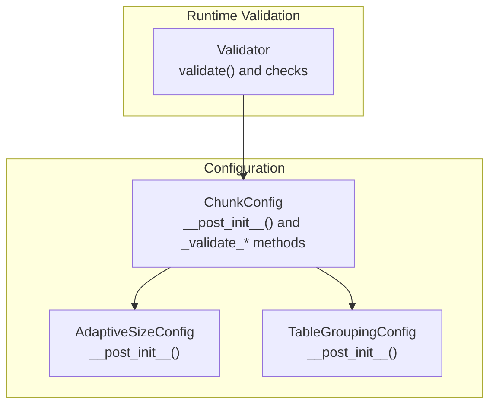
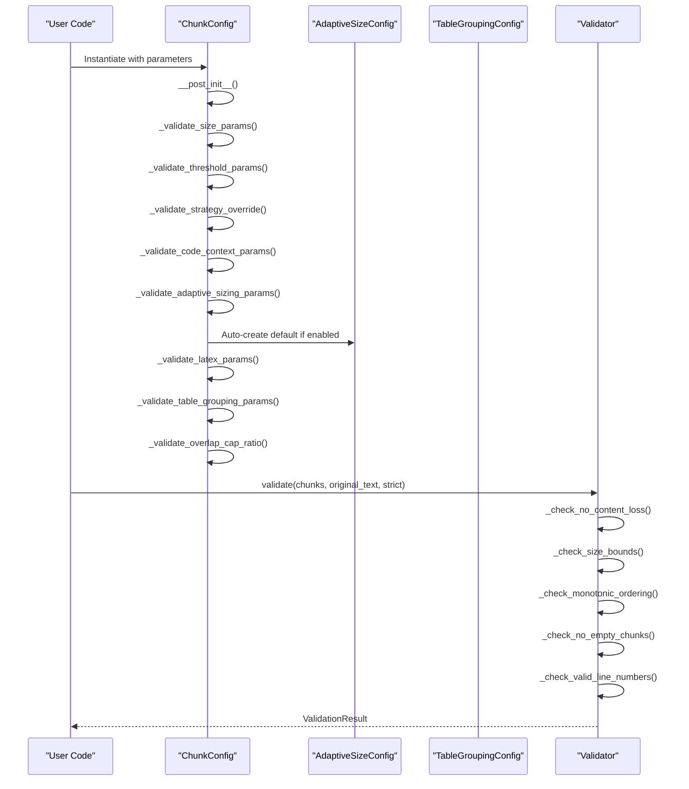
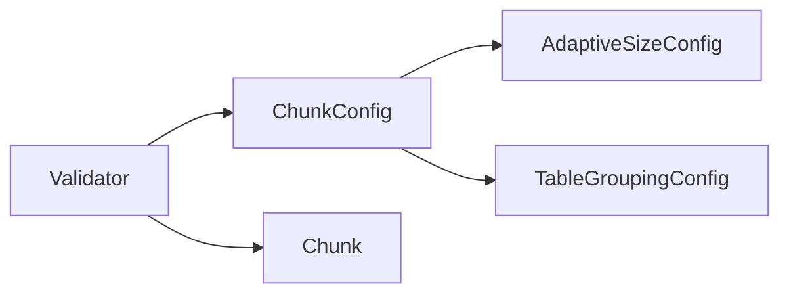

# Validation

<cite>
**Referenced Files in This Document**
- [config.py](file://src/chunkana/config.py)
- [adaptive_sizing.py](file://src/chunkana/adaptive_sizing.py)
- [table_grouping.py](file://src/chunkana/table_grouping.py)
- [validator.py](file://src/chunkana/validator.py)
- [test_config.py](file://tests/unit/test_config.py)
- [test_validator.py](file://tests/unit/test_validator.py)
- [README.md](file://README.md)
- [config.md](file://docs/config.md)
</cite>

## Table of Contents
1. [Introduction](#introduction)
2. [Project Structure](#project-structure)
3. [Core Components](#core-components)
4. [Architecture Overview](#architecture-overview)
5. [Detailed Component Analysis](#detailed-component-analysis)
6. [Dependency Analysis](#dependency-analysis)
7. [Performance Considerations](#performance-considerations)
8. [Troubleshooting Guide](#troubleshooting-guide)
9. [Conclusion](#conclusion)

## Introduction
This document explains configuration validation in ChunkConfig, focusing on the validation performed in __post_init__() and the dedicated _validate_* methods. It details the validation rules for each parameter, the error messages produced for invalid configurations, and how certain invalid states are auto-corrected (for example, min_chunk_size > max_chunk_size). It also covers how validation contributes to the library’s reliability and user experience, and provides practical troubleshooting guidance.

## Project Structure
The validation logic for ChunkConfig lives primarily in the configuration module. Supporting validations exist in nested configuration types (adaptive sizing and table grouping) and in the result validator that checks output correctness after chunking.

**Diagram sources**
- [config.py](file://src/chunkana/config.py#L127-L229)
- [adaptive_sizing.py](file://src/chunkana/adaptive_sizing.py#L37-L76)
- [table_grouping.py](file://src/chunkana/table_grouping.py#L35-L47)
- [validator.py](file://src/chunkana/validator.py#L47-L92)

**Section sources**
- [config.py](file://src/chunkana/config.py#L127-L229)
- [adaptive_sizing.py](file://src/chunkana/adaptive_sizing.py#L37-L76)
- [table_grouping.py](file://src/chunkana/table_grouping.py#L35-L47)
- [validator.py](file://src/chunkana/validator.py#L47-L92)

## Core Components
- ChunkConfig: Central configuration dataclass with validation in __post_init__(), including size bounds, thresholds, strategy override, code-context binding, adaptive sizing, LaTeX, table grouping, and overlap cap ratio.
- AdaptiveSizeConfig: Nested configuration for adaptive sizing with its own validation in __post_init__().
- TableGroupingConfig: Nested configuration for table grouping with its own validation in __post_init__().
- Validator: Validates chunking results against domain properties (no content loss, size bounds, monotonic ordering, no empty chunks, valid line numbers).

**Section sources**
- [config.py](file://src/chunkana/config.py#L127-L229)
- [adaptive_sizing.py](file://src/chunkana/adaptive_sizing.py#L37-L76)
- [table_grouping.py](file://src/chunkana/table_grouping.py#L35-L47)
- [validator.py](file://src/chunkana/validator.py#L47-L92)

## Architecture Overview
The validation pipeline operates in two phases:
- Configuration-time validation: ChunkConfig.__post_init__() invokes a series of _validate_* methods to ensure internal consistency and enforce constraints.
- Runtime validation: After chunking, Validator.validate() checks the produced chunks against domain properties to guarantee correctness.

**Diagram sources**
- [config.py](file://src/chunkana/config.py#L127-L229)
- [adaptive_sizing.py](file://src/chunkana/adaptive_sizing.py#L37-L76)
- [table_grouping.py](file://src/chunkana/table_grouping.py#L35-L47)
- [validator.py](file://src/chunkana/validator.py#L47-L92)

## Detailed Component Analysis

### ChunkConfig.__post_init__() and _validate_* Methods
ChunkConfig performs comprehensive validation in __post_init__(). It calls:
- _validate_size_params(): Enforces positivity and relative bounds for size parameters and overlap.
- _validate_threshold_params(): Enforces valid ranges for strategy thresholds.
- _validate_strategy_override(): Ensures strategy override is one of the allowed values.
- _validate_code_context_params(): Enforces non-negativity and minimums for code-context binding parameters.
- _validate_adaptive_sizing_params(): Auto-creates AdaptiveSizeConfig if adaptive sizing is enabled.
- _validate_latex_params(): Enforces non-negativity for LaTeX context parameter.
- _validate_table_grouping_params(): Delegates to nested TableGroupingConfig validation.
- _validate_overlap_cap_ratio(): Enforces valid range for overlap cap ratio.

Key auto-corrections:
- If min_chunk_size > max_chunk_size, min_chunk_size is reduced to half of max_chunk_size rather than raising an error.

Error behavior:
- Many validations raise ValueError with descriptive messages indicating the offending parameter and its value.
- Some validations are defensive and auto-correct to preserve usability.

**Section sources**
- [config.py](file://src/chunkana/config.py#L127-L229)

#### Size Parameters Validation (_validate_size_params)
Rules:
- max_chunk_size must be positive.
- min_chunk_size must be positive.
- If min_chunk_size > max_chunk_size, it is auto-corrected to max_chunk_size // 2.
- overlap_size must be non-negative.
- overlap_size must be strictly less than max_chunk_size.

Examples of invalid configurations and handling:
- max_chunk_size <= 0: Raises ValueError.
- min_chunk_size <= 0: Raises ValueError.
- min_chunk_size > max_chunk_size: Auto-corrects min_chunk_size to max_chunk_size // 2.
- overlap_size < 0: Raises ValueError.
- overlap_size >= max_chunk_size: Raises ValueError.

**Section sources**
- [config.py](file://src/chunkana/config.py#L138-L158)
- [test_config.py](file://tests/unit/test_config.py#L24-L53)

#### Threshold Parameters Validation (_validate_threshold_params)
Rules:
- code_threshold must be in [0, 1].
- structure_threshold must be >= 1.
- list_ratio_threshold must be in [0, 1].
- list_count_threshold must be >= 1.

Examples of invalid configurations and handling:
- code_threshold outside [0, 1]: Raises ValueError.
- structure_threshold < 1: Raises ValueError.
- list_ratio_threshold outside [0, 1]: Raises ValueError.
- list_count_threshold < 1: Raises ValueError.

**Section sources**
- [config.py](file://src/chunkana/config.py#L159-L174)
- [test_config.py](file://tests/unit/test_config.py#L24-L53)

#### Strategy Override Validation (_validate_strategy_override)
Rules:
- strategy_override must be one of {"code_aware", "list_aware", "structural", "fallback"} when provided.

Examples of invalid configurations and handling:
- strategy_override not in the allowed set: Raises ValueError.

**Section sources**
- [config.py](file://src/chunkana/config.py#L175-L184)
- [test_config.py](file://tests/unit/test_config.py#L24-L53)

#### Code-Context Binding Parameters Validation (_validate_code_context_params)
Rules:
- max_context_chars_before must be non-negative.
- max_context_chars_after must be non-negative.
- related_block_max_gap must be >= 1.

Examples of invalid configurations and handling:
- Negative max_context_chars_before: Raises ValueError.
- Negative max_context_chars_after: Raises ValueError.
- related_block_max_gap < 1: Raises ValueError.

**Section sources**
- [config.py](file://src/chunkana/config.py#L185-L202)
- [test_config.py](file://tests/unit/test_config.py#L144-L181)

#### Adaptive Sizing Parameters Validation (_validate_adaptive_sizing_params)
Behavior:
- If use_adaptive_sizing is True and adaptive_config is None, a default AdaptiveSizeConfig is auto-created.

Notes:
- AdaptiveSizeConfig itself enforces its own constraints in __post_init__(). See its section below.

**Section sources**
- [config.py](file://src/chunkana/config.py#L203-L208)
- [adaptive_sizing.py](file://src/chunkana/adaptive_sizing.py#L37-L76)

#### LaTeX Parameters Validation (_validate_latex_params)
Rules:
- latex_max_context_chars must be non-negative.

Examples of invalid configurations and handling:
- latex_max_context_chars < 0: Raises ValueError.

**Section sources**
- [config.py](file://src/chunkana/config.py#L209-L215)
- [test_config.py](file://tests/unit/test_config.py#L183-L226)

#### Table Grouping Parameters Validation (_validate_table_grouping_params)
Behavior:
- TableGroupingConfig validates itself in its own __post_init__().
- ChunkConfig delegates to the nested config when applicable.

**Section sources**
- [config.py](file://src/chunkana/config.py#L216-L221)
- [table_grouping.py](file://src/chunkana/table_grouping.py#L35-L47)

#### Overlap Cap Ratio Validation (_validate_overlap_cap_ratio)
Rules:
- overlap_cap_ratio must be in (0, 1].

Examples of invalid configurations and handling:
- overlap_cap_ratio <= 0: Raises ValueError.
- overlap_cap_ratio > 1: Raises ValueError.

**Section sources**
- [config.py](file://src/chunkana/config.py#L222-L229)
- [test_config.py](file://tests/unit/test_config.py#L183-L226)

### AdaptiveSizeConfig Validation (__post_init__)
AdaptiveSizeConfig enforces:
- base_size > 0.
- min_scale > 0.
- max_scale > 0.
- min_scale < max_scale.
- Weights non-negative.
- Weights sum to 1.0 within a small tolerance.

Examples of invalid configurations and handling:
- base_size <= 0: Raises ValueError.
- min_scale <= 0: Raises ValueError.
- max_scale <= 0: Raises ValueError.
- min_scale >= max_scale: Raises ValueError.
- Any weight < 0: Raises ValueError.
- Weights sum != 1.0 within tolerance: Raises ValueError.

**Section sources**
- [adaptive_sizing.py](file://src/chunkana/adaptive_sizing.py#L37-L76)

### TableGroupingConfig Validation (__post_init__)
TableGroupingConfig enforces:
- max_distance_lines >= 0.
- max_grouped_tables >= 1.
- max_group_size >= 100.

Examples of invalid configurations and handling:
- max_distance_lines < 0: Raises ValueError.
- max_grouped_tables < 1: Raises ValueError.
- max_group_size < 100: Raises ValueError.

**Section sources**
- [table_grouping.py](file://src/chunkana/table_grouping.py#L35-L47)

### Runtime Validation with Validator
After chunking, Validator.validate() checks:
- PROP-1: No Content Loss: Total output content should approximate original within a tolerance.
- PROP-2: Size Bounds: Chunks must respect max_chunk_size unless marked as oversize with valid reasons.
- PROP-3: Monotonic Ordering: Chunks must be ordered by start_line.
- PROP-4: No Empty Chunks: Chunks must have non-empty content.
- PROP-5: Valid Line Numbers: start_line must be >= 1, end_line >= start_line, and end_line <= total lines.

Strict mode:
- When strict=True, warnings are elevated to errors.

**Section sources**
- [validator.py](file://src/chunkana/validator.py#L47-L92)
- [validator.py](file://src/chunkana/validator.py#L93-L199)
- [test_validator.py](file://tests/unit/test_validator.py#L11-L71)
- [test_validator.py](file://tests/unit/test_validator.py#L165-L209)

## Dependency Analysis
- ChunkConfig depends on AdaptiveSizeConfig and TableGroupingConfig for nested validation and auto-creation.
- Validator depends on ChunkConfig to enforce size bounds and on the chunk metadata to handle oversize exceptions.
- Unit tests validate both configuration-time and runtime validation behavior.

**Diagram sources**
- [config.py](file://src/chunkana/config.py#L127-L229)
- [adaptive_sizing.py](file://src/chunkana/adaptive_sizing.py#L37-L76)
- [table_grouping.py](file://src/chunkana/table_grouping.py#L35-L47)
- [validator.py](file://src/chunkana/validator.py#L47-L92)

**Section sources**
- [config.py](file://src/chunkana/config.py#L127-L229)
- [validator.py](file://src/chunkana/validator.py#L47-L92)

## Performance Considerations
- Configuration validation is O(1) and runs once per instantiation, so negligible overhead.
- Runtime validation is linear in the number of chunks and is intended to be used selectively (e.g., in tests or strict mode) to avoid unnecessary cost.
- Oversize handling avoids reprocessing by marking exceptional chunks with metadata rather than recomputing chunk sizes.

[No sources needed since this section provides general guidance]

## Troubleshooting Guide
Common validation errors and how to resolve them:

- Invalid size parameters
  - Symptom: ValueError mentioning max_chunk_size, min_chunk_size, or overlap_size.
  - Resolution: Ensure max_chunk_size > 0, min_chunk_size > 0, min_chunk_size <= max_chunk_size, overlap_size >= 0, and overlap_size < max_chunk_size. Note: min_chunk_size > max_chunk_size triggers auto-correction to min_chunk_size = max_chunk_size // 2.

- Invalid threshold parameters
  - Symptom: ValueError for code_threshold, structure_threshold, list_ratio_threshold, or list_count_threshold.
  - Resolution: Constrain code_threshold and list_ratio_threshold to [0, 1]; set structure_threshold >= 1 and list_count_threshold >= 1.

- Invalid strategy override
  - Symptom: ValueError stating strategy_override must be one of the allowed values.
  - Resolution: Choose from "code_aware", "list_aware", "structural", or "fallback".

- Invalid code-context binding parameters
  - Symptom: ValueError for max_context_chars_before, max_context_chars_after, or related_block_max_gap.
  - Resolution: Ensure non-negative values for max_context_chars_before and max_context_chars_after; set related_block_max_gap >= 1.

- Invalid adaptive sizing configuration
  - Symptom: ValueError for AdaptiveSizeConfig constraints.
  - Resolution: Ensure base_size > 0, min_scale > 0, max_scale > 0, min_scale < max_scale, weights non-negative, and weights sum to 1.0 within tolerance.

- Invalid table grouping configuration
  - Symptom: ValueError for TableGroupingConfig constraints.
  - Resolution: Ensure max_distance_lines >= 0, max_grouped_tables >= 1, and max_group_size >= 100.

- Invalid overlap cap ratio
  - Symptom: ValueError for overlap_cap_ratio.
  - Resolution: Set overlap_cap_ratio in (0, 1].

- Runtime validation failures
  - Symptom: Validator reports content loss, out-of-order chunks, empty chunks, or invalid line numbers.
  - Resolution: Review chunking logic and ensure monotonic ordering and non-empty content. In strict mode, warnings become errors.

Where to look in the code:
- Configuration-time validation: [config.py](file://src/chunkana/config.py#L127-L229)
- Adaptive sizing validation: [adaptive_sizing.py](file://src/chunkana/adaptive_sizing.py#L37-L76)
- Table grouping validation: [table_grouping.py](file://src/chunkana/table_grouping.py#L35-L47)
- Runtime validation: [validator.py](file://src/chunkana/validator.py#L47-L92)

**Section sources**
- [config.py](file://src/chunkana/config.py#L127-L229)
- [adaptive_sizing.py](file://src/chunkana/adaptive_sizing.py#L37-L76)
- [table_grouping.py](file://src/chunkana/table_grouping.py#L35-L47)
- [validator.py](file://src/chunkana/validator.py#L47-L92)

## Conclusion
ChunkConfig’s validation ensures robust, predictable behavior by enforcing parameter constraints at creation time and auto-correcting benign inconsistencies. Together with runtime validation, it guarantees reliable chunking outcomes, improves user experience by surfacing actionable errors, and maintains high-quality outputs suitable for downstream applications like RAG pipelines.

[No sources needed since this section summarizes without analyzing specific files]