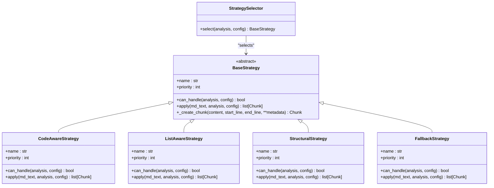

# Contributing Guide

<cite>
**Referenced Files in This Document**   
- [CONTRIBUTING.md](file://CONTRIBUTING.md)
- [README.md](file://README.md)
- [pyproject.toml](file://pyproject.toml)
- [Makefile](file://Makefile)
- [BASELINE.md](file://BASELINE.md)
- [src/chunkana/__init__.py](file://src/chunkana/__init__.py)
- [src/chunkana/chunker.py](file://src/chunkana/chunker.py)
- [src/chunkana/types.py](file://src/chunkana/types.py)
- [src/chunkana/exceptions.py](file://src/chunkana/exceptions.py)
- [src/chunkana/config.py](file://src/chunkana/config.py)
- [src/chunkana/strategies/base.py](file://src/chunkana/strategies/base.py)
- [src/chunkana/streaming/streaming_chunker.py](file://src/chunkana/streaming/streaming_chunker.py)
- [src/chunkana/api.py](file://src/chunkana/api.py)
- [tests/conftest.py](file://tests/conftest.py)
- [tests/unit/test_chunk.py](file://tests/unit/test_chunk.py)
- [scripts/generate_baseline.py](file://scripts/generate_baseline.py)
</cite>

## Table of Contents
1. [Development Environment Setup](#development-environment-setup)
2. [Coding Standards](#coding-standards)
3. [Testing Requirements](#testing-requirements)
4. [Pull Request Workflow](#pull-request-workflow)
5. [Branching Strategy](#branching-strategy)
6. [Implementing New Features](#implementing-new-features)
7. [Fixing Bugs](#fixing-bugs)
8. [Documentation Requirements](#documentation-requirements)
9. [Architectural Principles](#architectural-principles)
10. [Design Patterns](#design-patterns)
11. [Issue Reporting](#issue-reporting)
12. [Feature Requests](#feature-requests)
13. [Community Support](#community-support)
14. [Licensing Considerations](#licensing-considerations)

## Development Environment Setup

To set up the development environment for Chunkana, follow these steps:

1. Clone the repository:
```bash
git clone https://github.com/asukhodko/chunkana.git
cd chunkana
```

2. Create a virtual environment:
```bash
python -m venv venv
source venv/bin/activate  # On Windows: venv\Scripts\activate
```

3. Install development dependencies:
```bash
pip install -e ".[dev]"
```

4. Verify the installation by running tests:
```bash
pytest
```

The project uses a Makefile to automate common development tasks. You can use commands like `make venv`, `make install-dev`, `make test`, `make lint`, `make typecheck`, and `make check` to streamline your workflow. The Makefile also includes a `make all` command that performs a complete setup by cleaning, installing dependencies, and running tests.

**Section sources**
- [CONTRIBUTING.md](file://CONTRIBUTING.md#L1-L90)
- [Makefile](file://Makefile#L1-L118)
- [pyproject.toml](file://pyproject.toml#L1-L94)

## Coding Standards

Chunkana enforces strict coding standards to maintain code quality and consistency across the codebase. The project uses two primary tools for code quality assurance: **ruff** for linting and formatting, and **mypy** for type checking.

### Ruff Configuration
The project uses ruff for both linting and formatting with the following configuration in `pyproject.toml`:
- Target Python version: 3.12
- Line length: 100 characters
- Selected rules: E (pycodestyle), F (pyflakes), W (pycodestyle warnings), I (isort), UP (pyupgrade), B (bugbear), C4 (comprehensions), SIM (flake8-simplify)
- Ignored rule: E501 (line too long) to accommodate the 100-character line length

Run ruff checks with:
```bash
ruff check src/chunkana
```

Format code with:
```bash
ruff format .
```

### MyPy Configuration
The project uses mypy for static type checking with strict settings:
- Target Python version: 3.12
- Strict mode enabled
- Warn on return of Any type
- Warn on unused configuration

Run type checking with:
```bash
mypy src/chunkana
```

All code must pass both ruff and mypy checks before submission. The project follows Python's type hints extensively, and contributors are expected to maintain this standard by providing appropriate type annotations for all functions, methods, and class attributes.

**Section sources**
- [CONTRIBUTING.md](file://CONTRIBUTING.md#L29-L39)
- [pyproject.toml](file://pyproject.toml#L60-L73)

## Testing Requirements

Chunkana has a comprehensive testing framework to ensure code quality and functionality. The test suite is organized into several categories, each serving a specific purpose in the quality assurance process.

### Test Categories
The project's tests are organized in the `tests/` directory with the following structure:
- `tests/unit/`: Unit tests for individual components and functions
- `tests/property/`: Property-based tests using the hypothesis library to test invariants and edge cases
- `tests/baseline/`: Compatibility tests that ensure Chunkana maintains parity with dify-markdown-chunker v2
- `tests/performance/`: Performance regression tests for monitoring execution time and memory usage
- `tests/regression/`: Tests for specific issues that have been previously reported and fixed

### Running Tests
You can run tests using pytest with the following commands:

```bash
# Run all tests
pytest

# Run tests with coverage
pytest --cov=chunkana

# Run a specific test file
pytest tests/unit/test_chunk.py

# Run tests with verbose output
pytest -v
```

The project includes a comprehensive test suite that covers core functionality, edge cases, and error handling. All contributions must include appropriate tests to cover new functionality or bug fixes.

### Baseline Tests
Baseline tests are a critical part of the testing strategy, ensuring compatibility with dify-markdown-chunker v2. These tests use golden outputs generated from a specific commit of the reference implementation. The baseline fixtures are located in `tests/baseline/fixtures/` and include various test cases such as:
- `simple_text.md`: Basic text without special structures
- `nested_fences.md`: Nested code fences
- `large_tables.md`: Multiple tables, some exceeding chunk size
- `code_heavy.md`: Code-heavy document with multiple languages
- `headers_deep.md`: Deep header hierarchy (h1-h6)
- `mixed_content.md`: Combination of all element types

To run baseline tests:
```bash
pytest tests/baseline/
```

To regenerate golden outputs (requires the dify-markdown-chunker plugin):
```bash
python scripts/generate_baseline.py --plugin-path /path/to/dify-markdown-chunker
```

**Section sources**
- [CONTRIBUTING.md](file://CONTRIBUTING.md#L41-L73)
- [BASELINE.md](file://BASELINE.md#L1-L115)
- [pyproject.toml](file://pyproject.toml#L74-L83)
- [tests/conftest.py](file://tests/conftest.py#L1-L113)
- [tests/unit/test_chunk.py](file://tests/unit/test_chunk.py#L1-L166)

## Pull Request Workflow

The pull request workflow for Chunkana follows a standardized process to ensure code quality and maintainability. Contributors should follow these steps when submitting changes:

1. Fork the repository on GitHub
2. Create a feature branch from the main branch with a descriptive name (e.g., `feature/new-strategy` or `bugfix/header-validation`)
3. Make your changes following the coding standards
4. Write appropriate tests for new functionality or bug fixes
5. Run all tests and ensure they pass
6. Run linting and type checking, fixing any issues
7. Commit your changes with clear, descriptive commit messages
8. Push your branch to your fork
9. Submit a pull request to the main repository

When submitting a pull request, please include:
- A clear description of the changes
- The motivation for the changes
- Any relevant issue numbers
- Instructions for testing the changes
- Screenshots or examples if applicable

The pull request will be reviewed by project maintainers who may request changes or improvements. Please respond promptly to review comments and make requested changes. Once approved, the pull request will be merged into the main branch.

**Section sources**
- [CONTRIBUTING.md](file://CONTRIBUTING.md#L75-L82)

## Branching Strategy

Chunkana follows a simple branching model focused on maintaining a stable main branch:

- `main`: The primary branch that contains the latest stable code. All pull requests should be targeted to this branch.
- Feature branches: Created for new features or significant changes, named with a prefix like `feature/`, `bugfix/`, or `enhancement/` followed by a descriptive name.
- Release branches: Created for preparing releases, if needed.

The main branch should always be in a deployable state. Contributors should create feature branches from the main branch and regularly rebase their branches to incorporate the latest changes. This helps prevent merge conflicts and ensures that new changes are compatible with the latest codebase.

**Section sources**
- [CONTRIBUTING.md](file://CONTRIBUTING.md#L77-L78)

## Implementing New Features

When implementing new features for Chunkana, follow these guidelines to ensure consistency with the project's architecture and design principles:

### Design Considerations
Before implementing a new feature, consider how it aligns with the project's core principles:
- Intelligent Markdown chunking for RAG systems
- Preservation of atomic blocks (code, tables, LaTeX)
- Hierarchical navigation with tree invariant validation
- Rich metadata for enhanced retrieval
- Streaming processing for large files

### Implementation Steps
1. Create a new feature branch from the main branch
2. Implement the feature following the existing code patterns and architectural principles
3. Add comprehensive tests to cover the new functionality
4. Update documentation to reflect the changes
5. Ensure the feature passes all linting, type checking, and testing requirements

### Example: Adding a New Chunking Strategy
To add a new chunking strategy, you would:
1. Create a new file in `src/chunkana/strategies/` (e.g., `semantic_aware.py`)
2. Implement the strategy by extending the `BaseStrategy` class
3. Register the strategy in the `StrategySelector`
4. Add tests in `tests/unit/test_strategies.py`
5. Update documentation in `docs/strategies.md`

All new features should be designed to be extensible and maintainable, following the existing patterns in the codebase.

**Section sources**
- [src/chunkana/strategies/base.py](file://src/chunkana/strategies/base.py#L1-L361)
- [src/chunkana/chunker.py](file://src/chunkana/chunker.py#L1-L800)

## Fixing Bugs

When fixing bugs in Chunkana, follow this systematic approach:

### Bug Reporting
Before fixing a bug, ensure it has been properly reported with:
- Python version
- Chunkana version
- Minimal reproducible example
- Expected vs actual behavior

### Debugging Process
1. Reproduce the issue using the provided example
2. Write a failing test that demonstrates the bug
3. Implement the fix
4. Ensure the test passes
5. Verify that existing tests still pass

### Example: Fixing a Validation Issue
If you're fixing a validation issue in the `Chunk` class, you would:
1. Locate the relevant code in `src/chunkana/types.py`
2. Understand the validation logic in the `__post_init__` method
3. Implement the fix while maintaining backward compatibility
4. Add a test in `tests/unit/test_chunk.py` to prevent regression

All bug fixes should include appropriate tests to ensure the issue is resolved and doesn't reoccur in the future.

**Section sources**
- [CONTRIBUTING.md](file://CONTRIBUTING.md#L83-L89)
- [src/chunkana/types.py](file://src/chunkana/types.py#L297-L307)
- [tests/unit/test_chunk.py](file://tests/unit/test_chunk.py#L1-L166)

## Documentation Requirements

All contributions to Chunkana must include appropriate documentation to ensure the project remains accessible and maintainable. Documentation requirements vary depending on the type of contribution:

### Code Documentation
- All public functions, classes, and methods must have docstrings following the Google style
- Docstrings should include descriptions, parameter descriptions, return value descriptions, and examples when appropriate
- Internal functions should have docstrings if their purpose is not immediately clear

### User Documentation
When adding new features, update the relevant documentation files in the `docs/` directory:
- `docs/quickstart.md`: Update if the new feature affects basic usage
- `docs/config.md`: Update if new configuration options are added
- `docs/strategies.md`: Update if new chunking strategies are added
- `docs/renderers.md`: Update if new renderers are added

### API Documentation
The project's API documentation is generated from docstrings and type hints. Ensure that all public API elements are properly documented with clear examples that demonstrate their usage.

All documentation should be written in clear, concise English and follow the existing style and formatting of the project.

**Section sources**
- [README.md](file://README.md#L1-L179)
- [src/chunkana/__init__.py](file://src/chunkana/__init__.py#L1-L116)
- [src/chunkana/api.py](file://src/chunkana/api.py#L1-L305)

## Architectural Principles

Chunkana is designed with several key architectural principles that guide its development and ensure its effectiveness as a Markdown chunking library for RAG systems.

### Core Principles
1. **Intelligent Chunking**: The library automatically selects the optimal chunking strategy based on content analysis, considering factors like code density, header structure, and list complexity.

2. **Atomic Block Preservation**: Code blocks, tables, and LaTeX formulas are preserved as atomic units to maintain their integrity and context.

3. **Hierarchical Structure**: The library supports hierarchical chunking with tree invariant validation, allowing for navigation of chunks by header structure.

4. **Rich Metadata**: Each chunk includes rich metadata such as header paths, content types, and overlap context to enhance retrieval quality.

5. **Streaming Processing**: Large files can be processed efficiently in streaming mode to limit memory usage.

6. **Quality Assurance**: The library includes automatic dangling header prevention and micro-chunk minimization to reduce fragmentation while preserving important standalone elements.

### Design Goals
The architecture is designed to balance several competing goals:
- **Accuracy**: Preserving the semantic meaning of the original content
- **Efficiency**: Processing documents quickly and with minimal memory usage
- **Flexibility**: Supporting various use cases and integration scenarios
- **Reliability**: Ensuring consistent and predictable behavior across different inputs

These principles are reflected in the codebase structure and implementation patterns, guiding decisions about how new features are designed and implemented.

**Section sources**
- [README.md](file://README.md#L7-L13)
- [src/chunkana/chunker.py](file://src/chunkana/chunker.py#L1-L800)
- [src/chunkana/types.py](file://src/chunkana/types.py#L240-L375)

## Design Patterns

Chunkana employs several design patterns to achieve its goals of flexibility, maintainability, and extensibility.

### Strategy Pattern
The chunking process uses a strategy pattern to select the appropriate algorithm based on content analysis. The `StrategySelector` chooses from different strategies like `CodeAwareStrategy`, `ListAwareStrategy`, and `StructuralStrategy` based on the document's characteristics.



**Diagram sources **
- [src/chunkana/strategies/base.py](file://src/chunkana/strategies/base.py#L15-L361)
- [src/chunkana/chunker.py](file://src/chunkana/chunker.py#L57-L58)

### Factory Pattern
The `MarkdownChunker` class acts as a factory that creates chunks based on the input document and configuration. It orchestrates the chunking pipeline, which includes parsing, strategy selection, application, and post-processing.

### Data Classes
The project extensively uses Python's dataclasses for data modeling, particularly for the `Chunk`, `ContentAnalysis`, and `ChunkingMetrics` classes. This provides immutability, type safety, and built-in methods for serialization and comparison.

### Dependency Injection
Configuration is injected into classes rather than being hardcoded, allowing for greater flexibility and testability. The `ChunkConfig` object is passed through the system, enabling different behaviors based on configuration.

These design patterns work together to create a flexible, maintainable architecture that can adapt to different use cases while maintaining a consistent interface.

**Section sources**
- [src/chunkana/chunker.py](file://src/chunkana/chunker.py#L37-L65)
- [src/chunkana/types.py](file://src/chunkana/types.py#L240-L375)
- [src/chunkana/config.py](file://src/chunkana/config.py#L17-L507)

## Issue Reporting

When reporting issues with Chunkana, please include the following information to help maintainers reproduce and resolve the problem:

- **Python version**: The version of Python you are using
- **Chunkana version**: The version of Chunkana installed
- **Minimal reproducible example**: A small, self-contained code snippet that demonstrates the issue
- **Expected behavior**: What you expected to happen
- **Actual behavior**: What actually happened
- **Error messages**: Any error messages or stack traces
- **Environment details**: Operating system and any other relevant environment information

Report issues on the project's GitHub repository in the Issues section. When possible, include a failing test that demonstrates the issue. This helps ensure that the fix resolves the specific problem and prevents regression in the future.

For security-related issues, please contact the maintainers directly rather than creating a public issue.

**Section sources**
- [CONTRIBUTING.md](file://CONTRIBUTING.md#L83-L89)

## Feature Requests

To request new features for Chunkana, follow these guidelines to ensure your request is considered:

1. Check if the feature has already been requested by searching existing issues
2. Create a new issue with the "feature request" label
3. Provide a clear description of the feature and its use case
4. Explain how the feature aligns with the project's goals
5. Include examples of how the feature would be used
6. Suggest an implementation approach if possible

Feature requests are evaluated based on:
- Alignment with the project's core principles
- Potential impact on users
- Implementation complexity
- Maintenance burden
- Compatibility with existing features

The maintainers may request additional information or clarification before accepting a feature request. If you are able to implement the feature yourself, indicate this in your request, as pull requests are often prioritized over requests that require implementation by maintainers.

**Section sources**
- [README.md](file://README.md#L174-L175)

## Community Support

The Chunkana community is supported through several channels:

- **GitHub Issues**: For reporting bugs, requesting features, and asking questions
- **Documentation**: Comprehensive guides and examples in the `docs/` directory
- **Integration Guides**: Specific documentation for integrating with platforms like Dify, n8n, and Windmill in `docs/integrations/`

The project's README and documentation are designed to help users get started quickly and understand the library's capabilities. For complex issues or feature discussions, the GitHub issues section serves as the primary communication channel.

Contributors are encouraged to participate in the community by:
- Answering questions from other users
- Sharing use cases and examples
- Contributing to documentation
- Reviewing pull requests

The maintainers aim to respond to issues and pull requests in a timely manner, typically within a few days.

**Section sources**
- [README.md](file://README.md#L52-L55)
- [docs/integrations/dify.md](file://docs/integrations/dify.md)
- [docs/integrations/n8n.md](file://docs/integrations/n8n.md)
- [docs/integrations/windmill.md](file://docs/integrations/windmill.md)

## Licensing Considerations

Chunkana is released under the MIT License, which is a permissive open-source license that allows for free use, modification, and distribution of the software. When contributing to the project, you agree to license your contributions under the same terms.

The MIT License requires that the original copyright notice and permission notice be included in all copies or substantial portions of the software. As a contributor, you retain copyright to your contributions but grant others the right to use them under the terms of the MIT License.

For more details, see the LICENSE file in the project root directory.

**Section sources**
- [README.md](file://README.md#L176-L178)
- [pyproject.toml](file://pyproject.toml#L10-L11)