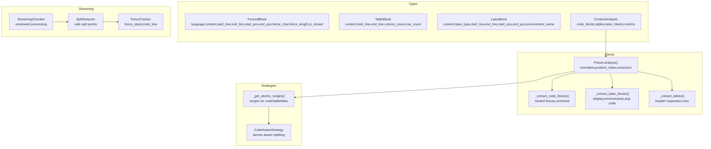
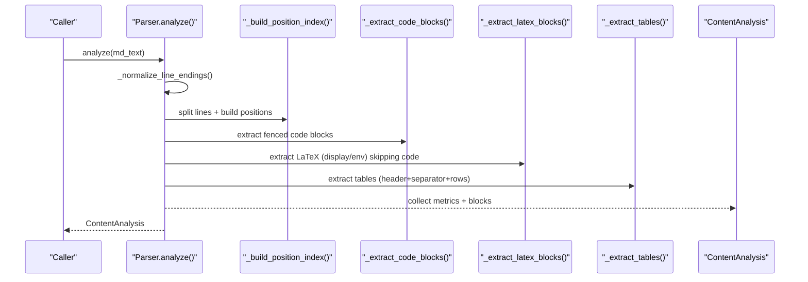
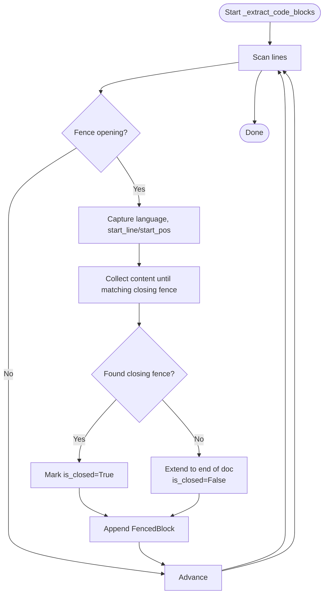
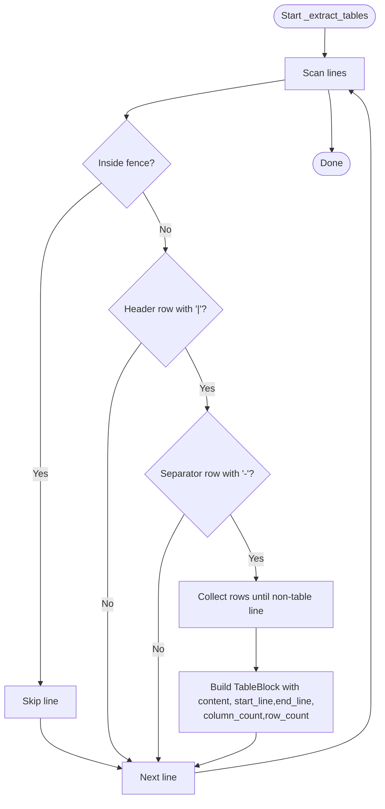
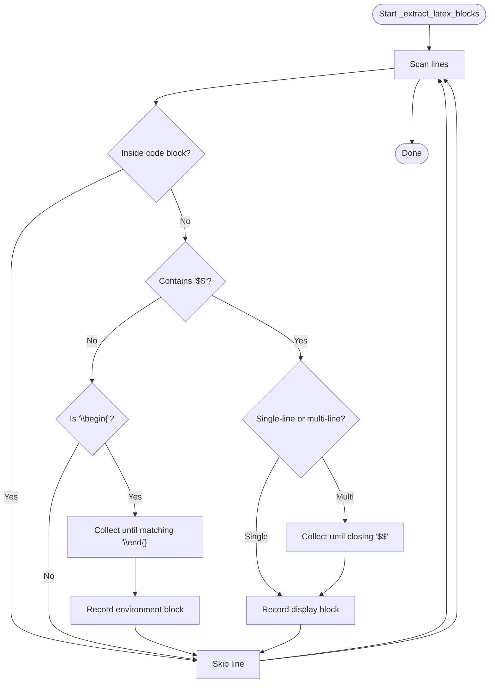
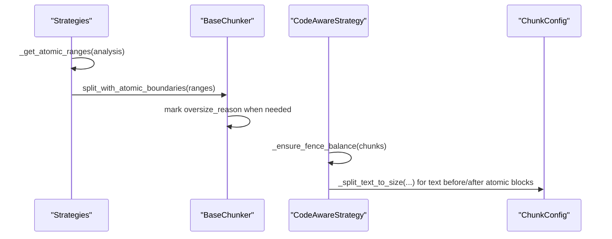
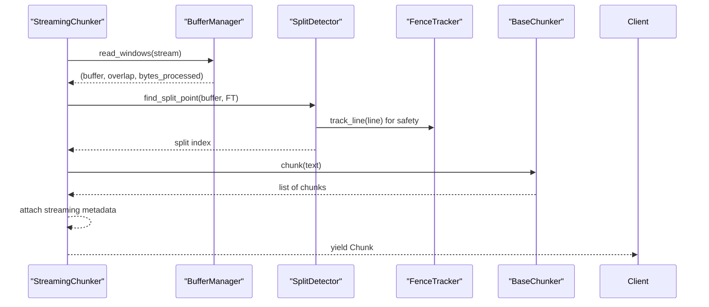
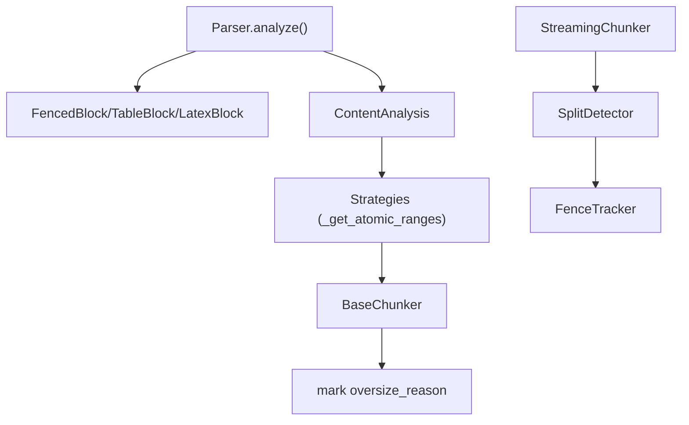

# Atomic Blocks

<cite>
**Referenced Files in This Document**
- [types.py](file://src/chunkana/types.py)
- [parser.py](file://src/chunkana/parser.py)
- [code_aware.py](file://src/chunkana/strategies/code_aware.py)
- [base.py](file://src/chunkana/strategies/base.py)
- [fence_tracker.py](file://src/chunkana/streaming/fence_tracker.py)
- [split_detector.py](file://src/chunkana/streaming/split_detector.py)
- [streaming_chunker.py](file://src/chunkana/streaming/streaming_chunker.py)
- [nested_fences.md](file://tests/baseline/fixtures/nested_fences.md)
- [latex_formulas.md](file://tests/baseline/fixtures/latex_formulas.md)
- [large_tables.md](file://tests/baseline/fixtures/large_tables.md)
</cite>

## Table of Contents
1. [Introduction](#introduction)
2. [Project Structure](#project-structure)
3. [Core Components](#core-components)
4. [Architecture Overview](#architecture-overview)
5. [Detailed Component Analysis](#detailed-component-analysis)
6. [Dependency Analysis](#dependency-analysis)
7. [Performance Considerations](#performance-considerations)
8. [Troubleshooting Guide](#troubleshooting-guide)
9. [Conclusion](#conclusion)

## Introduction
This document explains how Chunkana preserves semantic units—code blocks, tables, and LaTeX formulas—as atomic blocks during content analysis and chunking. It focuses on the FencedBlock, TableBlock, and LatexBlock classes, detailing their attributes for content, position, and type information. It also describes how the Parser extracts these blocks, handling edge cases such as nested fences, unclosed blocks, and environment detection. Finally, it illustrates how preserving atomic blocks prevents fragmentation of code examples or mathematical formulas, how block metadata supports downstream processing, and how to address common issues and performance implications.

## Project Structure
Atomic block handling spans several modules:
- Types define the data models for atomic blocks and analysis results.
- Parser performs extraction of fenced code, tables, LaTeX, headers, and lists.
- Strategies coordinate chunking while respecting atomic boundaries.
- Streaming components ensure atomic integrity across buffer boundaries.

**Diagram sources**
- [types.py](file://src/chunkana/types.py#L80-L179)
- [parser.py](file://src/chunkana/parser.py#L44-L121)
- [parser.py](file://src/chunkana/parser.py#L228-L293)
- [parser.py](file://src/chunkana/parser.py#L371-L513)
- [parser.py](file://src/chunkana/parser.py#L573-L655)
- [code_aware.py](file://src/chunkana/strategies/code_aware.py#L481-L501)
- [base.py](file://src/chunkana/strategies/base.py#L166-L195)
- [fence_tracker.py](file://src/chunkana/streaming/fence_tracker.py#L1-L65)
- [split_detector.py](file://src/chunkana/streaming/split_detector.py#L1-L93)
- [streaming_chunker.py](file://src/chunkana/streaming/streaming_chunker.py#L1-L99)

**Section sources**
- [types.py](file://src/chunkana/types.py#L80-L179)
- [parser.py](file://src/chunkana/parser.py#L44-L121)
- [code_aware.py](file://src/chunkana/strategies/code_aware.py#L481-L501)
- [base.py](file://src/chunkana/strategies/base.py#L166-L195)
- [fence_tracker.py](file://src/chunkana/streaming/fence_tracker.py#L1-L65)
- [split_detector.py](file://src/chunkana/streaming/split_detector.py#L1-L93)
- [streaming_chunker.py](file://src/chunkana/streaming/streaming_chunker.py#L1-L99)

## Core Components
- FencedBlock: Represents fenced code blocks with language, content, and positional metadata. It tracks whether the block is closed and supports nested fence detection.
- TableBlock: Represents markdown tables with content, start/end lines, and counts of columns/rows.
- LatexBlock: Represents LaTeX display math and environments with content, type, and environment name when applicable.

These types are consumed by the Parser to build a ContentAnalysis, which is then used by strategies to ensure atomic blocks remain intact during chunking.

**Section sources**
- [types.py](file://src/chunkana/types.py#L80-L179)

## Architecture Overview
The system normalizes line endings, builds a position index, and then extracts atomic blocks. The Parser avoids parsing LaTeX inside code blocks and uses a fence stack to handle nested fences. Strategies rely on atomic ranges to prevent partial atomic blocks across chunk boundaries. Streaming components ensure safe split points outside fences.

**Diagram sources**
- [parser.py](file://src/chunkana/parser.py#L44-L121)
- [parser.py](file://src/chunkana/parser.py#L143-L166)
- [parser.py](file://src/chunkana/parser.py#L228-L293)
- [parser.py](file://src/chunkana/parser.py#L371-L513)
- [parser.py](file://src/chunkana/parser.py#L573-L655)

## Detailed Component Analysis

### FencedBlock Extraction and Edge Cases
The Parser’s code extractor:
- Detects fence openings and closings robustly, including backticks and tildes, and supports varying lengths.
- Tracks nested fences using a stack to avoid misinterpreting nested fences as separate blocks.
- Handles unclosed fences by extending to the end of the document.
- Records positional metadata (start/end line and start/end position) for downstream use.

**Diagram sources**
- [parser.py](file://src/chunkana/parser.py#L228-L293)
- [parser.py](file://src/chunkana/parser.py#L168-L227)

**Section sources**
- [parser.py](file://src/chunkana/parser.py#L228-L293)
- [parser.py](file://src/chunkana/parser.py#L168-L227)
- [nested_fences.md](file://tests/baseline/fixtures/nested_fences.md#L1-L15)

### TableBlock Extraction and Grouping
The Parser’s table extractor:
- Identifies table starts by a header row containing pipes and a separator row with dashes.
- Counts columns from the header and collects subsequent rows until a non-table line is encountered.
- Skips tables inside code blocks using the same fence stack mechanism.

**Diagram sources**
- [parser.py](file://src/chunkana/parser.py#L573-L655)

**Section sources**
- [parser.py](file://src/chunkana/parser.py#L573-L655)
- [large_tables.md](file://tests/baseline/fixtures/large_tables.md#L1-L68)

### LatexBlock Extraction and Environment Detection
The Parser’s LaTeX extractor:
- Skips LaTeX inside code blocks by precomputing code block ranges.
- Detects display math by scanning for delimiter pairs and supports single-line and multi-line forms.
- Detects LaTeX environments by matching begin/end pairs for supported environments.
- Handles unclosed environments/display math by extending to the end of the document.
- Records environment names for environment-type blocks.

**Diagram sources**
- [parser.py](file://src/chunkana/parser.py#L371-L513)
- [latex_formulas.md](file://tests/baseline/fixtures/latex_formulas.md#L1-L66)

**Section sources**
- [parser.py](file://src/chunkana/parser.py#L371-L513)
- [latex_formulas.md](file://tests/baseline/fixtures/latex_formulas.md#L1-L66)

### Atomic Block Preservation During Chunking
Strategies and base chunker logic:
- Strategies compute atomic ranges for code, tables, and LaTeX (display/environment) to avoid partial atomic blocks.
- Base chunker marks intentional oversize chunks when preserving atomic integrity.
- Code-aware strategy creates text chunks before/after atomic blocks and ensures fence balance across chunks.

**Diagram sources**
- [base.py](file://src/chunkana/strategies/base.py#L166-L195)
- [base.py](file://src/chunkana/strategies/base.py#L94-L136)
- [code_aware.py](file://src/chunkana/strategies/code_aware.py#L481-L501)
- [code_aware.py](file://src/chunkana/strategies/code_aware.py#L293-L325)

**Section sources**
- [base.py](file://src/chunkana/strategies/base.py#L166-L195)
- [base.py](file://src/chunkana/strategies/base.py#L94-L136)
- [code_aware.py](file://src/chunkana/strategies/code_aware.py#L481-L501)
- [code_aware.py](file://src/chunkana/strategies/code_aware.py#L293-L325)

### Streaming Safety Across Buffer Boundaries
Streaming components ensure atomic blocks remain intact across buffer windows:
- FenceTracker maintains a fence stack to detect when inside code blocks across windows.
- SplitDetector finds safe split points prioritizing semantic boundaries and avoiding mid-fence splits.
- StreamingChunker processes windows and yields chunks from the base chunker with streaming metadata.

**Diagram sources**
- [streaming_chunker.py](file://src/chunkana/streaming/streaming_chunker.py#L43-L99)
- [split_detector.py](file://src/chunkana/streaming/split_detector.py#L26-L93)
- [fence_tracker.py](file://src/chunkana/streaming/fence_tracker.py#L1-L65)

**Section sources**
- [streaming_chunker.py](file://src/chunkana/streaming/streaming_chunker.py#L43-L99)
- [split_detector.py](file://src/chunkana/streaming/split_detector.py#L26-L93)
- [fence_tracker.py](file://src/chunkana/streaming/fence_tracker.py#L1-L65)

## Dependency Analysis
Atomic block handling depends on:
- Parser extracting blocks and building ContentAnalysis.
- Strategies using atomic ranges to enforce boundaries.
- Base chunker marking oversize reasons for atomic integrity.
- Streaming components ensuring fence balance and safe split points.

**Diagram sources**
- [parser.py](file://src/chunkana/parser.py#L44-L121)
- [types.py](file://src/chunkana/types.py#L80-L179)
- [base.py](file://src/chunkana/strategies/base.py#L166-L195)
- [base.py](file://src/chunkana/strategies/base.py#L94-L136)
- [streaming_chunker.py](file://src/chunkana/streaming/streaming_chunker.py#L43-L99)
- [split_detector.py](file://src/chunkana/streaming/split_detector.py#L26-L93)
- [fence_tracker.py](file://src/chunkana/streaming/fence_tracker.py#L1-L65)

**Section sources**
- [parser.py](file://src/chunkana/parser.py#L44-L121)
- [base.py](file://src/chunkana/strategies/base.py#L166-L195)
- [base.py](file://src/chunkana/strategies/base.py#L94-L136)
- [streaming_chunker.py](file://src/chunkana/streaming/streaming_chunker.py#L43-L99)

## Performance Considerations
- Parser optimizations:
  - Normalization and position index reduce repeated O(n) computations.
  - Precompiled patterns speed up fence and list detection.
  - Early termination patterns minimize unnecessary checks.
- Streaming optimizations:
  - FenceTracker avoids expensive state reconstruction by maintaining a stack.
  - SplitDetector prefers semantic boundaries to reduce retries and reprocessing.
- Practical tips:
  - Prefer single-pass extraction with position indices.
  - Use precompiled patterns for repeated checks.
  - Avoid overly broad regex captures; keep patterns tight to reduce backtracking.

[No sources needed since this section provides general guidance]

## Troubleshooting Guide
Common issues and resolutions:
- Incorrectly parsed blocks:
  - Verify that code blocks are skipped when detecting LaTeX to avoid false positives.
  - Ensure fence stacks are correctly maintained across nested fences.
- Unclosed blocks:
  - Confirm that unclosed display math and environments extend to the end of the document and are recorded with appropriate end positions.
- Fragmented atomic blocks:
  - Use atomic ranges to prevent partial blocks across chunk boundaries.
  - Mark intentional oversize chunks with oversize_reason to signal downstream consumers.
- Streaming mid-fence splits:
  - Use FenceTracker to detect inside-fence boundaries and SplitDetector to find safe split points.

**Section sources**
- [parser.py](file://src/chunkana/parser.py#L371-L513)
- [parser.py](file://src/chunkana/parser.py#L228-L293)
- [base.py](file://src/chunkana/strategies/base.py#L94-L136)
- [split_detector.py](file://src/chunkana/streaming/split_detector.py#L26-L93)
- [fence_tracker.py](file://src/chunkana/streaming/fence_tracker.py#L1-L65)

## Conclusion
Chunkana preserves semantic units by modeling atomic blocks with precise positional metadata, extracting them robustly with careful handling of nested fences and unclosed constructs, and enforcing atomic integrity during chunking and streaming. The combination of ContentAnalysis, atomic ranges, and streaming-safe split detection ensures that code examples, tables, and LaTeX formulas remain intact, enabling downstream consumers to reliably process structured content.