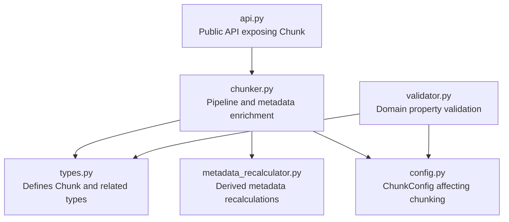
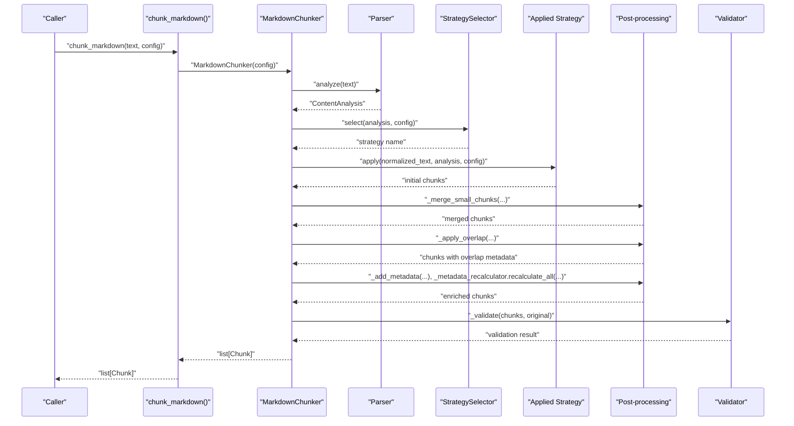
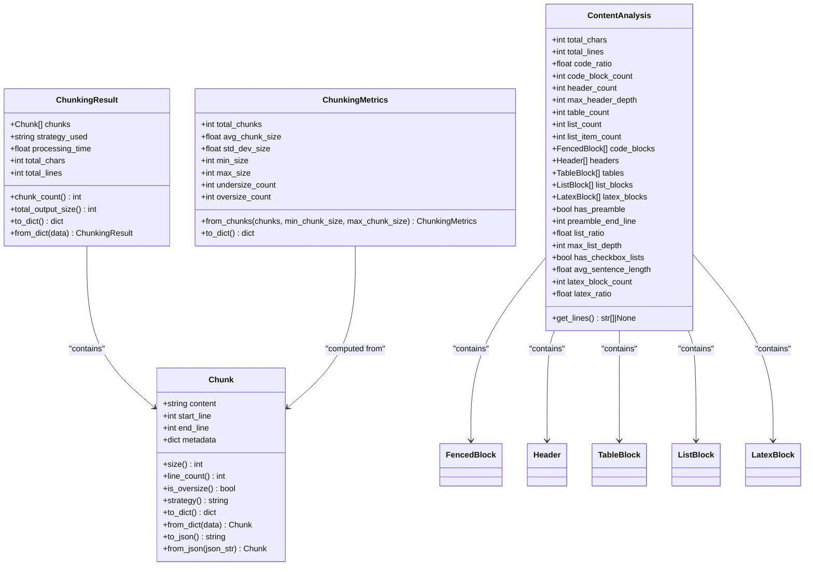
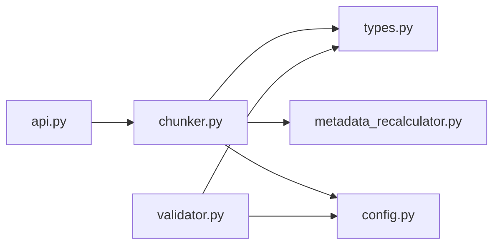

# Chunk Data Model

<cite>
**Referenced Files in This Document**
- [types.py](file://src/chunkana/types.py)
- [chunker.py](file://src/chunkana/chunker.py)
- [metadata_recalculator.py](file://src/chunkana/metadata_recalculator.py)
- [config.py](file://src/chunkana/config.py)
- [validator.py](file://src/chunkana/validator.py)
- [api.py](file://src/chunkana/api.py)
- [test_chunk.py](file://tests/unit/test_chunk.py)
</cite>

## Table of Contents
1. [Introduction](#introduction)
2. [Project Structure](#project-structure)
3. [Core Components](#core-components)
4. [Architecture Overview](#architecture-overview)
5. [Detailed Component Analysis](#detailed-component-analysis)
6. [Dependency Analysis](#dependency-analysis)
7. [Performance Considerations](#performance-considerations)
8. [Troubleshooting Guide](#troubleshooting-guide)
9. [Conclusion](#conclusion)

## Introduction
This document explains the Chunk data model as the fundamental unit of content in Chunkana. It covers the Chunk class structure, core attributes, rich metadata fields, validation guarantees, and practical usage patterns for serialization and deserialization. It also highlights how metadata (e.g., header_path, content_type, strategy, structural indicators) enhances semantic understanding and downstream processing, and how line ranges provide approximate source location. Finally, it addresses common issues (empty content, invalid line numbers) and their impact on Retrieval-Augmented Generation (RAG) systems, along with performance considerations for high-throughput scenarios.

## Project Structure
The Chunk data model is defined centrally and consumed across the chunking pipeline:
- Data model and serialization: [types.py](file://src/chunkana/types.py)
- Chunking pipeline and metadata enrichment: [chunker.py](file://src/chunkana/chunker.py)
- Derived metadata recalibration: [metadata_recalculator.py](file://src/chunkana/metadata_recalculator.py)
- Configuration impacting chunk behavior: [config.py](file://src/chunkana/config.py)
- Validation of domain properties: [validator.py](file://src/chunkana/validator.py)
- Public API surface exposing Chunk: [api.py](file://src/chunkana/api.py)
- Unit tests validating Chunk behavior: [test_chunk.py](file://tests/unit/test_chunk.py)

**Diagram sources**
- [types.py](file://src/chunkana/types.py#L240-L376)
- [chunker.py](file://src/chunkana/chunker.py#L1-L120)
- [metadata_recalculator.py](file://src/chunkana/metadata_recalculator.py#L1-L100)
- [config.py](file://src/chunkana/config.py#L17-L126)
- [validator.py](file://src/chunkana/validator.py#L32-L200)
- [api.py](file://src/chunkana/api.py#L18-L41)

**Section sources**
- [types.py](file://src/chunkana/types.py#L240-L376)
- [chunker.py](file://src/chunkana/chunker.py#L1-L120)
- [metadata_recalculator.py](file://src/chunkana/metadata_recalculator.py#L1-L100)
- [config.py](file://src/chunkana/config.py#L17-L126)
- [validator.py](file://src/chunkana/validator.py#L32-L200)
- [api.py](file://src/chunkana/api.py#L18-L41)

## Core Components
- Chunk: The central data model representing a single chunk with content, positional line numbers, and metadata.
- ChunkingResult: Container for a list of chunks plus strategy and statistics.
- ChunkingMetrics: Aggregated statistics for a set of chunks.
- ChunkConfig: Configuration controlling chunk size bounds, overlap, strategy selection thresholds, and other behaviors.

Key responsibilities:
- Chunk holds the text content and approximate source location via start_line and end_line.
- Rich metadata enables downstream processing (semantic navigation, RAG retrieval, overlap context).
- Validation ensures domain properties (no empty chunks, valid line numbers, monotonic ordering, size bounds).
- Serialization methods support round-trip preservation of content and metadata.

**Section sources**
- [types.py](file://src/chunkana/types.py#L240-L376)
- [types.py](file://src/chunkana/types.py#L377-L478)
- [config.py](file://src/chunkana/config.py#L17-L126)

## Architecture Overview
The Chunk class is used throughout the chunking pipeline. The pipeline parses the document once, selects a strategy, applies it, merges small chunks, applies overlap metadata, enriches metadata, recalculates derived metadata, and validates domain properties.

**Diagram sources**
- [api.py](file://src/chunkana/api.py#L18-L41)
- [chunker.py](file://src/chunkana/chunker.py#L85-L176)
- [chunker.py](file://src/chunkana/chunker.py#L301-L470)
- [validator.py](file://src/chunkana/validator.py#L47-L99)

## Detailed Component Analysis

### Chunk Class: Structure and Semantics
- Core attributes:
  - content: The text content of the chunk.
  - start_line: Starting line number (1-indexed) indicating approximate source location.
  - end_line: Ending line number (1-indexed) indicating approximate source location.
  - metadata: Arbitrary dictionary for rich metadata (e.g., content_type, header_path, strategy, small_chunk, is_oversize, overlap context).
- Computed properties:
  - size: Character count of content.
  - line_count: Approximate line count computed as end_line - start_line + 1.
  - is_oversize: Boolean indicating intentional oversize chunks (metadata flag).
  - strategy: Strategy name that created the chunk (metadata).
- Validation in __post_init__:
  - start_line must be >= 1.
  - end_line must be >= start_line.
  - content cannot be empty or whitespace-only.
- Serialization:
  - to_dict: Produces a dictionary with content, start_line, end_line, size, line_count, and metadata.
  - from_dict: Constructs a Chunk from a dictionary, validating required fields.
  - to_json/from_json: JSON serialization/deserialization with UTF-8 support.

How line ranges provide approximate source location:
- start_line and end_line define a 1-indexed range. They help locate chunks in the original document and inform downstream systems about proximity to headers and sections. Overlap metadata (previous_content/next_content) augments context without duplicating content in chunk.content.

Rich metadata fields enhancing semantic understanding:
- content_type: "text" | "code" | "table" | "mixed" | "preamble".
- header_path: Hierarchical path to the first header in the chunk (e.g., "/Level1/Level2/Level3"), or "/__preamble__" for preamble chunks.
- header_level: Level of the first header (1–6).
- strategy: Strategy name that produced the chunk.
- small_chunk: Flag indicating a small chunk that could not be merged without exceeding max_chunk_size and is structurally weak.
- small_chunk_reason: Reason for small_chunk flag (e.g., "cannot_merge").
- is_oversize: Flag indicating intentionally oversized chunks (e.g., for code/table integrity).
- previous_content/next_content: Preview/follow-up text from adjacent chunks (metadata-only).
- overlap_size: Effective overlap window used for previous_content/next_content.

Downstream processing benefits:
- RAG retrieval: header_path and header_level guide semantic navigation and section-aware retrieval.
- Overlap context: previous_content/next_content helps language models understand chunk boundaries without duplicating content.
- Quality control: small_chunk and is_oversize flags inform downstream filtering or special handling.

**Section sources**
- [types.py](file://src/chunkana/types.py#L240-L376)
- [chunker.py](file://src/chunkana/chunker.py#L301-L470)
- [metadata_recalculator.py](file://src/chunkana/metadata_recalculator.py#L1-L100)
- [test_chunk.py](file://tests/unit/test_chunk.py#L1-L166)

### Validation in __post_init__
The Chunk constructor enforces:
- start_line >= 1.
- end_line >= start_line.
- content is non-empty and non-whitespace-only.

These checks prevent empty chunks and invalid line ranges, which are critical for RAG systems relying on accurate chunk boundaries and content.

Impact on RAG:
- Empty chunks cause retrieval ambiguity and wasted index space.
- Invalid line ranges misrepresent source locations, complicating provenance and navigation.

**Section sources**
- [types.py](file://src/chunkana/types.py#L297-L307)
- [validator.py](file://src/chunkana/validator.py#L173-L199)

### Serialization and Deserialization
- to_dict: Returns a dictionary with content, start_line, end_line, size, line_count, and metadata. line_count is computed as end_line - start_line + 1.
- from_dict: Validates presence of required fields (content, start_line, end_line) and constructs a Chunk.
- to_json/from_json: Uses JSON with UTF-8 support to preserve unicode content.

Round-trip guarantees:
- Tests confirm that serializing to dict/json and deserializing preserves content, including unicode.

Practical examples (paths only):
- Creating a Chunk: [tests/unit/test_chunk.py](file://tests/unit/test_chunk.py#L16-L33)
- Serializing to dict: [tests/unit/test_chunk.py](file://tests/unit/test_chunk.py#L71-L94)
- Deserializing from dict: [tests/unit/test_chunk.py](file://tests/unit/test_chunk.py#L95-L109)
- Serializing to JSON: [tests/unit/test_chunk.py](file://tests/unit/test_chunk.py#L110-L121)
- Deserializing from JSON: [tests/unit/test_chunk.py](file://tests/unit/test_chunk.py#L122-L133)
- Unicode preservation: [tests/unit/test_chunk.py](file://tests/unit/test_chunk.py#L136-L146)

**Section sources**
- [types.py](file://src/chunkana/types.py#L329-L375)
- [test_chunk.py](file://tests/unit/test_chunk.py#L68-L146)

### Metadata Enrichment and Recalculation
- During chunking, metadata is added and refined:
  - Overlap context: previous_content and next_content are populated (metadata-only).
  - small_chunk and small_chunk_reason are set for structurally weak small chunks.
  - is_oversize and oversize_reason are set for oversized chunks preserving atomic blocks or sections.
  - section_tags are recalculated to reflect actual headers present in content.
- Derived metadata recalculations occur after post-processing (e.g., after fixing dangling headers and merging small chunks).

Why this matters:
- section_tags align with actual content, improving retrieval accuracy.
- Oversized chunks are flagged with reasons to justify retention.

**Section sources**
- [chunker.py](file://src/chunkana/chunker.py#L301-L470)
- [metadata_recalculator.py](file://src/chunkana/metadata_recalculator.py#L33-L100)

### Structural Indicators and Their Impact
- small_chunk: Indicates a chunk below min_chunk_size that cannot be merged without exceeding max_chunk_size and lacks structural strength (e.g., lacks strong headers, multiple paragraphs, or meaningful content). Such chunks may be filtered or treated specially in downstream RAG pipelines.
- is_oversize: Intentionally oversized chunks preserve atomic blocks (code, tables) or section integrity. Oversized chunks are validated to ensure they include a reason (e.g., code_block_integrity, table_integrity, section_integrity).

Implications for RAG:
- Filtering small_chunk can reduce noise and improve retrieval granularity.
- Retaining is_oversize chunks with explicit reasons prevents accidental truncation of semantically important units.

**Section sources**
- [chunker.py](file://src/chunkana/chunker.py#L431-L470)
- [validator.py](file://src/chunkana/validator.py#L115-L143)

### Line Range Approximation and Source Location
- start_line and end_line provide approximate source location. They are 1-indexed and may overlap between adjacent chunks. For precise boundaries, rely on the content text itself.
- Overlap metadata (previous_content/next_content) adds context without duplicating content in chunk.content.

Use cases:
- Navigation: header_path and header_level help map chunks to document sections.
- Provenance: line ranges assist in linking chunks back to source documents.

**Section sources**
- [types.py](file://src/chunkana/types.py#L240-L296)
- [chunker.py](file://src/chunkana/chunker.py#L301-L370)

### Class Diagram: Chunk and Related Types

**Diagram sources**
- [types.py](file://src/chunkana/types.py#L240-L478)

## Dependency Analysis
- Chunk depends on:
  - types: Core data model and serialization.
  - chunker: Pipeline enrichment (overlap, merging, metadata).
  - metadata_recalculator: Derived metadata recalculations.
  - validator: Domain property validation.
  - config: Configuration impacting chunk behavior (size bounds, overlap, thresholds).
- Public API exposes Chunk to consumers.

**Diagram sources**
- [api.py](file://src/chunkana/api.py#L18-L41)
- [chunker.py](file://src/chunkana/chunker.py#L1-L120)
- [types.py](file://src/chunkana/types.py#L240-L376)
- [metadata_recalculator.py](file://src/chunkana/metadata_recalculator.py#L1-L100)
- [validator.py](file://src/chunkana/validator.py#L32-L200)
- [config.py](file://src/chunkana/config.py#L17-L126)

**Section sources**
- [api.py](file://src/chunkana/api.py#L18-L41)
- [chunker.py](file://src/chunkana/chunker.py#L1-L120)
- [types.py](file://src/chunkana/types.py#L240-L376)
- [metadata_recalculator.py](file://src/chunkana/metadata_recalculator.py#L1-L100)
- [validator.py](file://src/chunkana/validator.py#L32-L200)
- [config.py](file://src/chunkana/config.py#L17-L126)

## Performance Considerations
- Serialization overhead:
  - to_dict: O(n) where n is the length of content (computes size and line_count).
  - to_json: O(n) for JSON serialization; UTF-8 support avoids transcoding overhead.
- High-throughput scenarios:
  - Prefer batch processing and minimize repeated serialization.
  - Use streaming chunking for very large files to reduce peak memory usage.
  - Avoid unnecessary recomputation of derived metadata; reuse where possible.
- Overlap computation:
  - previous_content/next_content extraction is O(n) per chunk; consider adaptive caps to bound cost.

[No sources needed since this section provides general guidance]

## Troubleshooting Guide
Common issues and resolutions:
- Empty content or whitespace-only content:
  - Cause: Violates Chunk.__post_init__ validation.
  - Impact: Leads to empty chunks, which violate PROP-4 and degrade RAG quality.
  - Resolution: Ensure content is non-empty and contains meaningful text.
- Invalid line numbers:
  - Cause: start_line < 1 or end_line < start_line.
  - Impact: Violates PROP-5; retrieval and navigation become unreliable.
  - Resolution: Correct line indices and ensure monotonic ordering.
- Oversized chunks without justification:
  - Cause: Exceeds max_chunk_size without allow_oversize flag or invalid oversize_reason.
  - Impact: May fragment atomic blocks or mislead downstream systems.
  - Resolution: Set allow_oversize and provide a valid reason (code_block_integrity, table_integrity, section_integrity).
- Small chunks that cannot be merged:
  - Cause: Below min_chunk_size and structurally weak.
  - Impact: May increase index size and reduce retrieval granularity.
  - Resolution: Consider filtering small_chunk or adjusting thresholds.

Validation references:
- Domain properties (PROP-1 through PROP-5) enforced by Validator and pipeline logic.

**Section sources**
- [types.py](file://src/chunkana/types.py#L297-L307)
- [validator.py](file://src/chunkana/validator.py#L115-L199)
- [chunker.py](file://src/chunkana/chunker.py#L431-L470)

## Conclusion
The Chunk data model is the backbone of Chunkana’s chunking pipeline. Its core attributes (content, start_line, end_line) and rich metadata (content_type, header_path, strategy, small_chunk, is_oversize, overlap context) provide semantic richness essential for RAG systems. Validation in __post_init__ and domain property checks ensure data integrity. Serialization methods enable robust round-trip preservation, while metadata recalculations keep derived fields consistent. Proper configuration and awareness of structural indicators help optimize retrieval quality and system performance.