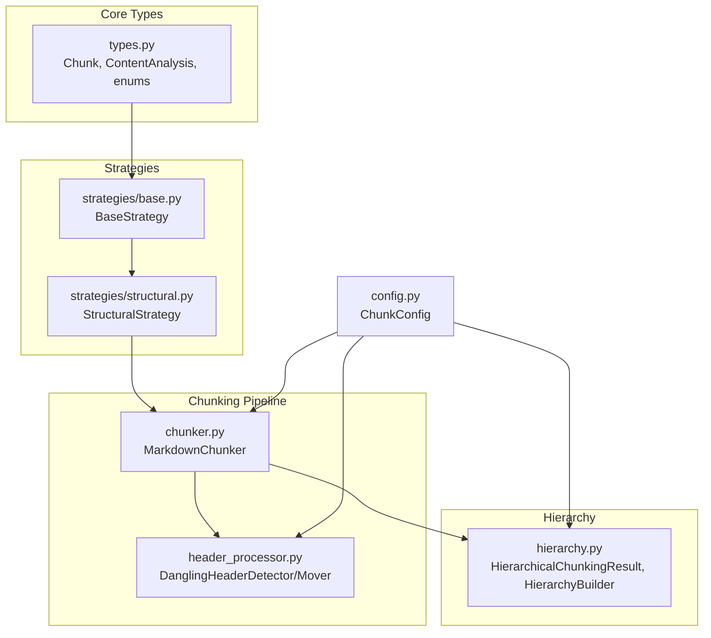
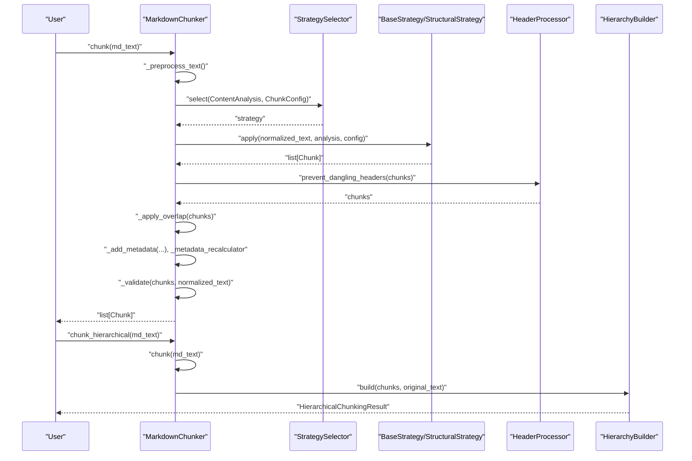
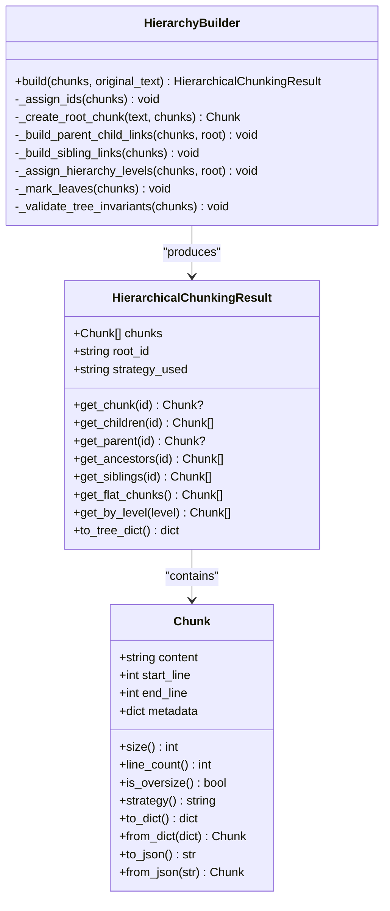
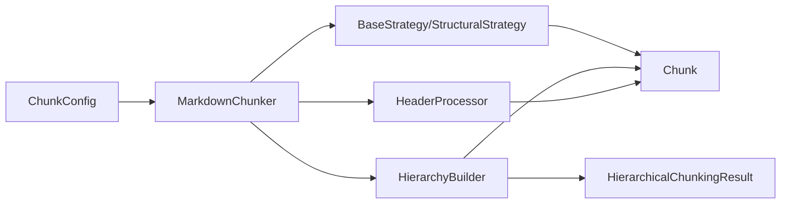

# Core Concepts

<cite>
**Referenced Files in This Document**
- [types.py](file://src/chunkana/types.py)
- [hierarchy.py](file://src/chunkana/hierarchy.py)
- [chunker.py](file://src/chunkana/chunker.py)
- [structural.py](file://src/chunkana/strategies/structural.py)
- [base.py](file://src/chunkana/strategies/base.py)
- [header_processor.py](file://src/chunkana/header_processor.py)
- [config.py](file://src/chunkana/config.py)
- [test_hierarchy.py](file://tests/unit/test_hierarchy.py)
- [test_chunk.py](file://tests/unit/test_chunk.py)
- [test_hierarchical_invariants.py](file://tests/property/test_hierarchical_invariants.py)
- [debug_mode.md](file://docs/debug_mode.md)
</cite>

## Table of Contents
1. [Introduction](#introduction)
2. [Project Structure](#project-structure)
3. [Core Components](#core-components)
4. [Architecture Overview](#architecture-overview)
5. [Detailed Component Analysis](#detailed-component-analysis)
6. [Dependency Analysis](#dependency-analysis)
7. [Performance Considerations](#performance-considerations)
8. [Troubleshooting Guide](#troubleshooting-guide)
9. [Conclusion](#conclusion)

## Introduction
This document explains the fundamental abstractions in Chunkana that underpin robust, semantically meaningful chunking of Markdown documents. It focuses on:
- The Chunk data model: content, metadata, line ranges, and identifiers
- The hierarchical chunking result as a navigable tree with parent-child-sibling relationships
- Structural invariants and why they matter for document integrity
- The distinction between flat and hierarchical chunking modes
- The role of atomic blocks (code, tables, LaTeX) in shaping chunk boundaries
- The significance of header paths for semantic navigation

## Project Structure
Chunkana organizes core concepts around a few central modules:
- Types define the canonical data structures used across parsing, chunking, and rendering
- Strategies implement different chunking heuristics (structural, code-aware, list-aware, fallback)
- The chunker orchestrates parsing, strategy selection, overlap, and validation
- The hierarchy module constructs and validates a navigable tree from flat chunks
- The header processor prevents dangling headers across chunk boundaries
- Config encapsulates all tunable parameters for chunking behavior

**Diagram sources**
- [types.py](file://src/chunkana/types.py#L240-L478)
- [base.py](file://src/chunkana/strategies/base.py#L1-L361)
- [structural.py](file://src/chunkana/strategies/structural.py#L1-L596)
- [chunker.py](file://src/chunkana/chunker.py#L1-L923)
- [hierarchy.py](file://src/chunkana/hierarchy.py#L1-L966)
- [header_processor.py](file://src/chunkana/header_processor.py#L1-L474)
- [config.py](file://src/chunkana/config.py#L1-L507)

**Section sources**
- [types.py](file://src/chunkana/types.py#L240-L478)
- [chunker.py](file://src/chunkana/chunker.py#L1-L923)
- [hierarchy.py](file://src/chunkana/hierarchy.py#L1-L966)
- [structural.py](file://src/chunkana/strategies/structural.py#L1-L596)
- [base.py](file://src/chunkana/strategies/base.py#L1-L361)
- [header_processor.py](file://src/chunkana/header_processor.py#L1-L474)
- [config.py](file://src/chunkana/config.py#L1-L507)

## Core Components
- Chunk: The fundamental unit of output, carrying content, approximate line ranges, and rich metadata for navigation and provenance
- ContentAnalysis: Lightweight analysis of a document’s structure and content characteristics used by strategies
- HierarchicalChunkingResult: A flat list of chunks augmented with parent-child-sibling metadata and navigation helpers
- HierarchyBuilder: Constructs the tree relationships from header_path metadata and validates structural invariants
- Strategies: Implementors of different chunking approaches; StructuralStrategy is central to hierarchical chunking semantics
- HeaderProcessor: Prevents dangling headers by moving or merging content across chunk boundaries

Key responsibilities:
- Chunk: Encapsulate content and metadata; enforce basic invariants on creation
- StructuralStrategy: Split by headers, compute header_path and section_tags, preserve atomic blocks
- HierarchyBuilder: Assign IDs, create parent-child links, sibling chains, hierarchy levels, and validate invariants
- HeaderProcessor: Detect and fix dangling headers; track movement with header_moved_from

**Section sources**
- [types.py](file://src/chunkana/types.py#L240-L478)
- [hierarchy.py](file://src/chunkana/hierarchy.py#L16-L307)
- [structural.py](file://src/chunkana/strategies/structural.py#L52-L203)
- [base.py](file://src/chunkana/strategies/base.py#L67-L167)
- [header_processor.py](file://src/chunkana/header_processor.py#L1-L200)

## Architecture Overview
The chunking pipeline produces flat chunks first, then optionally builds a hierarchical representation with navigation metadata.

**Diagram sources**
- [chunker.py](file://src/chunkana/chunker.py#L85-L248)
- [structural.py](file://src/chunkana/strategies/structural.py#L52-L203)
- [header_processor.py](file://src/chunkana/header_processor.py#L393-L474)
- [hierarchy.py](file://src/chunkana/hierarchy.py#L260-L308)

## Detailed Component Analysis

### Chunk Data Model
The Chunk class defines the core abstraction for a piece of content with associated metadata and line-range information.

- Content and line ranges:
  - content: The actual text of the chunk
  - start_line, end_line: 1-indexed approximate positions; line ranges may overlap between adjacent chunks
- Metadata:
  - chunk_index: Sequential index in the document
  - content_type: "text", "code", "table", "mixed", "preamble"
  - header_path: Hierarchical path to the first header in the chunk (e.g., "/Level1/Level2/Level3"); special "/__preamble__" for preamble; empty if no headers
  - header_level: Level of the first header (1–6)
  - sub_headers: Additional header texts within the chunk (excluding the first header used for header_path)
  - small_chunk and small_chunk_reason: Flags for undersized chunks that cannot merge without exceeding max size and are structurally weak
  - previous_content, next_content, overlap_size: Metadata-only overlap context for neighboring chunks
  - strategy: Strategy that created the chunk
  - allow_oversize and oversize_reason: For chunks intentionally oversized to preserve atomic blocks
  - is_leaf, is_root, hierarchy_level, parent_id, children_ids, prev_sibling_id, next_sibling_id: Hierarchical metadata (available in hierarchical mode)

Validation:
- start_line must be ≥ 1
- end_line must be ≥ start_line
- content cannot be empty or whitespace-only

Computed properties:
- size: character count
- line_count: derived from content
- is_oversize: convenience flag based on allow_oversize

Serialization:
- to_dict/from_dict/to_json/from_json for persistence and transport

Practical implications:
- Line ranges are approximate; use content itself for precise boundaries
- Oversized chunks carry explicit reasons to preserve atomic integrity
- Overlap is metadata-only to avoid duplicating text and index bloat

**Section sources**
- [types.py](file://src/chunkana/types.py#L240-L376)
- [types.py](file://src/chunkana/types.py#L377-L478)
- [test_chunk.py](file://tests/unit/test_chunk.py#L1-L166)

### Hierarchical Chunking Result and Tree Navigation
HierarchicalChunkingResult augments a flat list of chunks with parent-child-sibling relationships and navigation helpers. The hierarchy is built from existing header_path metadata and stored as metadata on each chunk.

Key capabilities:
- get_chunk(chunk_id): O(1) lookup by ID
- get_children(chunk_id), get_parent(chunk_id), get_ancestors(chunk_id): Tree traversal
- get_siblings(chunk_id): Ordered siblings by start_line
- get_flat_chunks(): Returns leaf chunks plus non-leaf chunks with significant content (>100 chars excluding headers) to avoid losing content in flat retrieval
- get_by_level(level): Retrieve chunks at a specific hierarchy level
- to_tree_dict(): Serialize tree structure using IDs for safe JSON serialization

Construction:
- HierarchyBuilder.build assigns unique chunk_id to each chunk, optionally creates a root document chunk, builds parent-child links via header_path, establishes sibling chains, assigns hierarchy levels by tree depth, marks leaves, and validates invariants.

Header path semantics:
- header_path encodes structural context (where a chunk sits in the document tree)
- section_tags captures local sections inside a chunk (children of the root section in header_path)
- max_structural_level controls where to split sections; deeper headers become local tags

Root chunk:
- Optionally created with a meaningful title and summary; header_path="/" and hierarchy_level=0

Validation:
- Parent-child bidirectionality, sibling chain integrity, and leaf consistency are validated; strict_mode can raise exceptions or auto-fix depending on configuration.

**Diagram sources**
- [types.py](file://src/chunkana/types.py#L240-L478)
- [hierarchy.py](file://src/chunkana/hierarchy.py#L16-L307)

**Section sources**
- [hierarchy.py](file://src/chunkana/hierarchy.py#L16-L307)
- [hierarchy.py](file://src/chunkana/hierarchy.py#L309-L966)
- [test_hierarchy.py](file://tests/unit/test_hierarchy.py#L1-L268)
- [test_hierarchical_invariants.py](file://tests/property/test_hierarchical_invariants.py#L1-L299)
- [debug_mode.md](file://docs/debug_mode.md#L1-L61)

### Structural Invariants and Their Importance
Structural invariants ensure the hierarchical tree remains consistent and reliable for navigation and retrieval:
- is_leaf consistency: is_leaf must equal (children_ids is empty)
- Parent-child bidirectionality: parent_id must appear in parent’s children_ids and vice versa
- No orphaned chunks: every non-root chunk must have a parent
- Content range consistency: root chunk should span the document appropriately

These invariants are validated by HierarchyBuilder and can operate in strict or non-strict modes:
- Strict mode raises exceptions on violations
- Non-strict mode auto-fixes inconsistencies (e.g., recalculating is_leaf) and logs warnings

Why they matter:
- Predictable navigation across chunks
- Accurate flat retrieval via get_flat_chunks
- Reliable semantic navigation using header_path and hierarchy_level
- Trustworthy tree structure for downstream consumers

**Section sources**
- [hierarchy.py](file://src/chunkana/hierarchy.py#L549-L966)
- [test_hierarchical_invariants.py](file://tests/property/test_hierarchical_invariants.py#L1-L299)

### Flat vs Hierarchical Chunking Modes
- Flat chunking mode:
  - Produces a plain list of chunks with content_type, header_path, header_level, and chunk_index
  - Suitable for simple retrieval and embedding scenarios
  - Overlap is metadata-only; no parent-child metadata is attached
- Hierarchical chunking mode:
  - Adds chunk_id, parent_id, children_ids, is_leaf, is_root, hierarchy_level, prev_sibling_id, next_sibling_id
  - Enables navigation methods and tree inspection
  - get_flat_chunks() returns leaf chunks plus non-leaf chunks with significant content to avoid losing material

Practical guidance:
- Use hierarchical mode when you need navigation or tree-aware retrieval
- Use flat mode for simpler pipelines or when you only need chunk content and header metadata

**Section sources**
- [debug_mode.md](file://docs/debug_mode.md#L1-L61)
- [chunker.py](file://src/chunkana/chunker.py#L217-L248)
- [hierarchy.py](file://src/chunkana/hierarchy.py#L137-L187)

### Atomic Blocks and Chunk Boundaries
Atomic blocks (code, tables, LaTeX) must remain intact to preserve semantic integrity. Strategies and builders coordinate to respect these constraints:
- BaseStrategy helpers:
  - _ensure_fence_balance: Ensures balanced code fences by merging adjacent chunks when needed
  - _get_atomic_blocks_in_range: Collects atomic block ranges within a line range
  - _set_oversize_metadata: Marks oversized chunks with reasons like "code_block_integrity", "table_integrity", "latex_integrity"
- StructuralStrategy:
  - Splits sections while preserving atomic blocks
  - For large sections, splits text around atomic blocks and creates dedicated chunks for atomic content
  - Sets is_atomic=True and content_type accordingly
- BaseStrategy._split_text_to_size: Splits at paragraph boundaries when possible, respecting size limits

Implications:
- Oversized chunks are permitted when preserving atomic integrity is necessary
- Fence balance is maintained automatically when possible
- Table grouping can be enabled to combine related tables into single chunks

**Section sources**
- [base.py](file://src/chunkana/strategies/base.py#L90-L167)
- [base.py](file://src/chunkana/strategies/base.py#L168-L361)
- [structural.py](file://src/chunkana/strategies/structural.py#L528-L596)

### Role of Header Paths in Semantic Navigation
Header paths encode structural context and enable semantic navigation:
- header_path: The hierarchical path to the root section of a chunk
- section_tags: Local sections inside a chunk (children of the root section)
- header_level: The level of the root section in header_path
- max_structural_level: Controls where to split sections; deeper headers become local tags

Behavior:
- StructuralStrategy computes header_path and section_tags using a contextual header stack
- The contextual stack considers all headers before a chunk’s start line, while splitting decisions are influenced by max_structural_level
- For single-header-only chunks, section_tags is empty

Benefits:
- Accurate semantic grouping of content
- Reliable navigation across sections and subsections
- Clear separation between structural context and local subsections

**Section sources**
- [structural.py](file://src/chunkana/strategies/structural.py#L204-L527)

### Example: How These Concepts Are Implemented
- Chunk creation and validation:
  - [Chunk.__post_init__](file://src/chunkana/types.py#L297-L307)
  - [Chunk.to_dict/from_dict](file://src/chunkana/types.py#L329-L375)
- Hierarchical chunking:
  - [MarkdownChunker.chunk_hierarchical](file://src/chunkana/chunker.py#L217-L248)
  - [HierarchyBuilder.build](file://src/chunkana/hierarchy.py#L260-L308)
  - [HierarchicalChunkingResult.get_flat_chunks](file://src/chunkana/hierarchy.py#L137-L187)
- Structural chunking and atomic blocks:
  - [StructuralStrategy.apply](file://src/chunkana/strategies/structural.py#L58-L150)
  - [StructuralStrategy._split_large_section](file://src/chunkana/strategies/structural.py#L152-L203)
  - [BaseStrategy._ensure_fence_balance](file://src/chunkana/strategies/base.py#L118-L167)
- Dangling header prevention:
  - [HeaderProcessor.prevent_dangling_headers](file://src/chunkana/header_processor.py#L405-L451)
  - [HeaderMover.fix_dangling_header](file://src/chunkana/header_processor.py#L250-L371)

**Section sources**
- [types.py](file://src/chunkana/types.py#L240-L376)
- [chunker.py](file://src/chunkana/chunker.py#L217-L248)
- [hierarchy.py](file://src/chunkana/hierarchy.py#L137-L307)
- [structural.py](file://src/chunkana/strategies/structural.py#L58-L203)
- [base.py](file://src/chunkana/strategies/base.py#L118-L167)
- [header_processor.py](file://src/chunkana/header_processor.py#L250-L371)

## Dependency Analysis
- Chunk depends on metadata conventions used by strategies and hierarchy
- StructuralStrategy depends on ContentAnalysis and BaseStrategy helpers
- HierarchyBuilder depends on Chunk metadata fields and validates structural invariants
- HeaderProcessor depends on Chunk and modifies header_path metadata indirectly via movement tracking
- ChunkConfig governs behavior across all components (size limits, overlap, strategy selection, atomic block preservation)

**Diagram sources**
- [config.py](file://src/chunkana/config.py#L1-L200)
- [chunker.py](file://src/chunkana/chunker.py#L1-L200)
- [structural.py](file://src/chunkana/strategies/structural.py#L1-L120)
- [header_processor.py](file://src/chunkana/header_processor.py#L1-L120)
- [hierarchy.py](file://src/chunkana/hierarchy.py#L1-L120)
- [types.py](file://src/chunkana/types.py#L240-L320)

**Section sources**
- [config.py](file://src/chunkana/config.py#L1-L200)
- [chunker.py](file://src/chunkana/chunker.py#L1-L200)
- [structural.py](file://src/chunkana/strategies/structural.py#L1-L120)
- [header_processor.py](file://src/chunkana/header_processor.py#L1-L120)
- [hierarchy.py](file://src/chunkana/hierarchy.py#L1-L120)
- [types.py](file://src/chunkana/types.py#L240-L320)

## Performance Considerations
- Overlap is metadata-only and bounded by overlap_size and overlap_cap_ratio to avoid index bloat
- Adaptive sizing can adjust max_chunk_size based on content complexity, reducing fragmentation
- Header stack caching in StructuralStrategy reduces repeated computation of contextual stacks
- Hierarchical indexing uses a simple dict keyed by chunk_id for O(1) lookups
- Validation can be toggled via ChunkConfig.validate_invariants and strict_mode to trade safety for speed

[No sources needed since this section provides general guidance]

## Troubleshooting Guide
Common issues and remedies:
- Oversized chunks:
  - Cause: Atomic blocks (code, tables, LaTeX) exceed max_chunk_size
  - Remedy: Allow oversize with explicit oversize_reason; verify integrity is preserved
  - Reference: [BaseStrategy._set_oversize_metadata](file://src/chunkana/strategies/base.py#L90-L117)
- Unbalanced code fences:
  - Cause: Split across chunk boundary
  - Remedy: Use _ensure_fence_balance to merge adjacent chunks or mark fence_balance_error
  - Reference: [BaseStrategy._ensure_fence_balance](file://src/chunkana/strategies/base.py#L118-L167)
- Dangling headers:
  - Cause: Header at end of chunk with content in next chunk
  - Remedy: Use HeaderProcessor to move header into next chunk or merge chunks
  - Reference: [HeaderProcessor.prevent_dangling_headers](file://src/chunkana/header_processor.py#L405-L451)
- Invariant violations in hierarchical mode:
  - Cause: Disconnected tree or inconsistent is_leaf
  - Remedy: Enable strict_mode for exceptions or rely on non-strict auto-fix; re-run validation
  - Reference: [HierarchyBuilder._validate_tree_invariants](file://src/chunkana/hierarchy.py#L549-L966), [test_hierarchical_invariants.py](file://tests/property/test_hierarchical_invariants.py#L1-L299)

**Section sources**
- [base.py](file://src/chunkana/strategies/base.py#L90-L167)
- [header_processor.py](file://src/chunkana/header_processor.py#L393-L474)
- [hierarchy.py](file://src/chunkana/hierarchy.py#L549-L966)
- [test_hierarchical_invariants.py](file://tests/property/test_hierarchical_invariants.py#L1-L299)

## Conclusion
Chunkana’s core abstractions center on a robust Chunk model enriched with semantic metadata, a flexible strategy system that preserves atomic integrity, and a validated hierarchical tree for navigation. Understanding header paths, atomic blocks, and structural invariants ensures reliable, semantically coherent chunking across diverse Markdown documents. Choose flat or hierarchical modes based on your retrieval needs, and leverage the provided validation and repair mechanisms to maintain integrity.