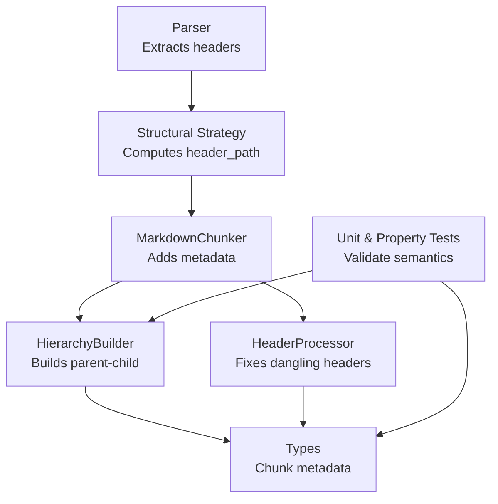
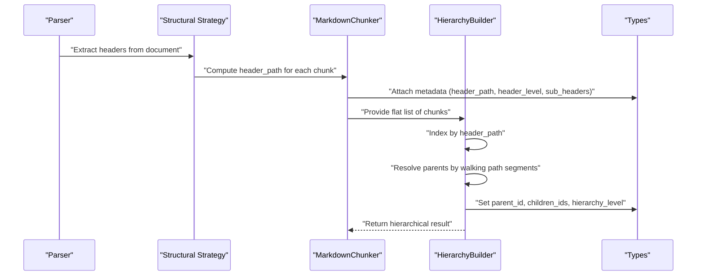
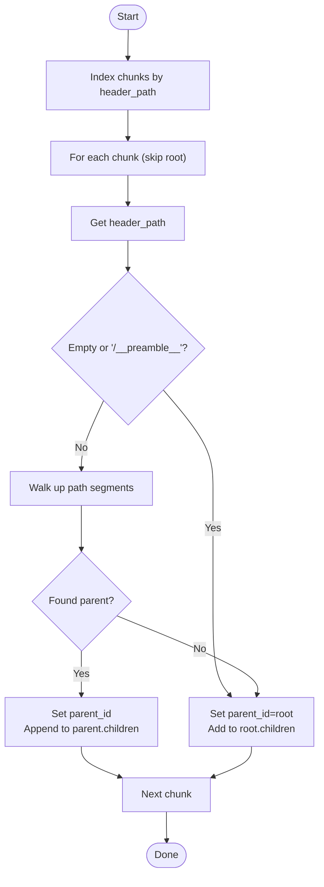
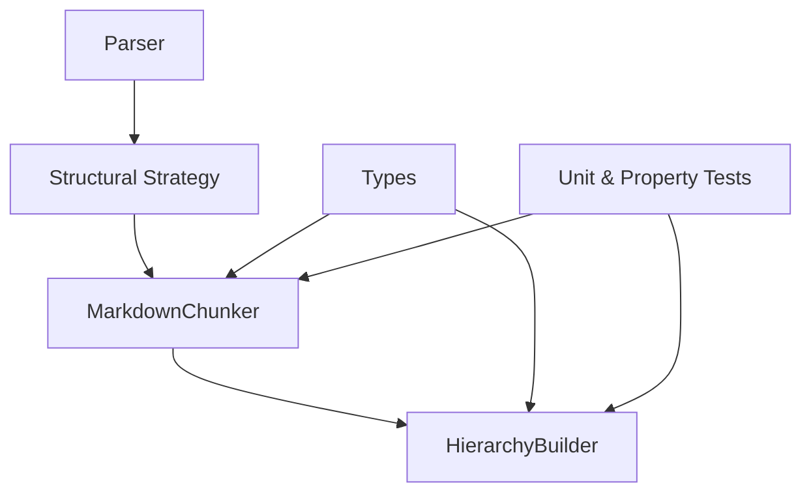

# Header Path Semantics

<cite>
**Referenced Files in This Document**
- [types.py](file://src/chunkana/types.py)
- [hierarchy.py](file://src/chunkana/hierarchy.py)
- [header_processor.py](file://src/chunkana/header_processor.py)
- [structural.py](file://src/chunkana/strategies/structural.py)
- [chunker.py](file://src/chunkana/chunker.py)
- [parser.py](file://src/chunkana/parser.py)
- [test_hierarchy.py](file://tests/unit/test_hierarchy.py)
- [headers_deep.md](file://tests/baseline/fixtures/headers_deep.md)
</cite>

## Table of Contents
1. [Introduction](#introduction)
2. [Project Structure](#project-structure)
3. [Core Components](#core-components)
4. [Architecture Overview](#architecture-overview)
5. [Detailed Component Analysis](#detailed-component-analysis)
6. [Dependency Analysis](#dependency-analysis)
7. [Performance Considerations](#performance-considerations)
8. [Troubleshooting Guide](#troubleshooting-guide)
9. [Conclusion](#conclusion)

## Introduction
This document explains header path semantics and how the header_path metadata field enables semantic navigation across hierarchical chunks. It describes the format “/Level1/Level2/Level3”, how it maps to the header hierarchy in the source document, and how HierarchyBuilder uses header_path to establish parent-child relationships. It also covers special cases such as “/__preamble__” for preamble chunks and empty strings for headerless documents. Finally, it explains how header_level and sub_headers complement header_path for additional structural information, and outlines common issues and performance considerations for path parsing in large hierarchies.

## Project Structure
The header path semantics are implemented across several modules:
- Types define the Chunk metadata contract, including header_path, header_level, and sub_headers.
- Strategies compute header_path during chunking.
- HierarchyBuilder constructs parent-child relationships using header_path.
- HeaderProcessor prevents dangling headers and updates metadata accordingly.
- Parser extracts headers from the source document.
- Tests validate behavior and edge cases.

**Diagram sources**
- [parser.py](file://src/chunkana/parser.py#L515-L571)
- [structural.py](file://src/chunkana/strategies/structural.py#L200-L520)
- [chunker.py](file://src/chunkana/chunker.py#L146-L176)
- [hierarchy.py](file://src/chunkana/hierarchy.py#L374-L421)
- [header_processor.py](file://src/chunkana/header_processor.py#L400-L474)
- [types.py](file://src/chunkana/types.py#L240-L376)

**Section sources**
- [parser.py](file://src/chunkana/parser.py#L515-L571)
- [structural.py](file://src/chunkana/strategies/structural.py#L200-L520)
- [chunker.py](file://src/chunkana/chunker.py#L146-L176)
- [hierarchy.py](file://src/chunkana/hierarchy.py#L374-L421)
- [header_processor.py](file://src/chunkana/header_processor.py#L400-L474)
- [types.py](file://src/chunkana/types.py#L240-L376)

## Core Components
- Chunk metadata fields:
  - header_path: Hierarchical path to the first structural header in a chunk. Format: “/Level1/Level2/Level3”. Special values: “/__preamble__” for preamble chunks; empty string for headerless documents.
  - header_level: Level of the first structural header in the chunk (1–6).
  - sub_headers: Optional list of additional header texts within the chunk (excluding the first header used for header_path).
- HierarchyBuilder:
  - Uses header_path to build parent-child and sibling relationships.
  - Treats empty header_path and “/__preamble__” as children of the root.
  - Assigns hierarchy_level based on tree depth from root.
- HeaderProcessor:
  - Prevents dangling headers across chunk boundaries.
  - Updates metadata to reflect movement and marks chunks for potential header_path recalculation.

**Section sources**
- [types.py](file://src/chunkana/types.py#L240-L376)
- [hierarchy.py](file://src/chunkana/hierarchy.py#L374-L421)
- [header_processor.py](file://src/chunkana/header_processor.py#L400-L474)

## Architecture Overview
The header path is computed during chunking and consumed by the hierarchy builder to construct navigable relationships.

**Diagram sources**
- [parser.py](file://src/chunkana/parser.py#L515-L571)
- [structural.py](file://src/chunkana/strategies/structural.py#L200-L520)
- [chunker.py](file://src/chunkana/chunker.py#L146-L176)
- [hierarchy.py](file://src/chunkana/hierarchy.py#L374-L421)
- [types.py](file://src/chunkana/types.py#L240-L376)

## Detailed Component Analysis

### Header Path Format and Mapping to Source Headers
- Format: “/Level1/Level2/Level3”
  - Each segment corresponds to a header level in the source document.
  - The path is rooted at the document root and reflects the structural context of the chunk.
- Mapping:
  - header_path is derived from the contextual header stack at the start of the chunk.
  - The contextual stack includes all headers before the chunk start line, with levels ≤ max_structural_level used for determining chunk boundaries.
  - The first structural header in the chunk (level ≤ max_structural_level) may be appended to the stack to refine the path.
- Special cases:
  - “/__preamble__”: Indicates the preamble chunk; it is treated as a child of the root.
  - Empty string: Used when the document has no headers; chunks without structural headers receive an empty header_path.

**Section sources**
- [structural.py](file://src/chunkana/strategies/structural.py#L200-L520)
- [types.py](file://src/chunkana/types.py#L240-L376)

### How HierarchyBuilder Establishes Parent-Child Relationships
- Parent resolution:
  - HierarchyBuilder indexes chunks by header_path for O(1) lookup.
  - For each chunk (except root), it walks up the path segments to find the nearest parent present in the index.
  - If no parent is found, the chunk becomes a child of the root.
- Preamble handling:
  - Chunks with empty header_path or “/__preamble__” are attached to the root.
- Sibling relationships:
  - Chunks are grouped by parent_id and sorted by start_line to form prev/next sibling links.
- Hierarchy levels:
  - hierarchy_level is assigned via BFS traversal from the root, reflecting tree depth.

**Diagram sources**
- [hierarchy.py](file://src/chunkana/hierarchy.py#L374-L421)

**Section sources**
- [hierarchy.py](file://src/chunkana/hierarchy.py#L374-L421)

### Special Cases: Preamble and Headerless Documents
- Preamble chunks:
  - header_path is “/__preamble__”.
  - They are attached to the root as children.
- Headerless documents:
  - header_path is an empty string.
  - These chunks are attached to the root as children.

**Section sources**
- [hierarchy.py](file://src/chunkana/hierarchy.py#L374-L421)
- [types.py](file://src/chunkana/types.py#L240-L376)

### Complementing Metadata: header_level and sub_headers
- header_level:
  - Level of the first structural header in the chunk (1–6).
  - Useful for quick level checks and filtering.
- sub_headers:
  - Optional list of additional header texts within the chunk (excluding the first header used for header_path).
  - Helps identify local subsections within a chunk’s structural context.

**Section sources**
- [types.py](file://src/chunkana/types.py#L240-L376)

### Semantic Navigation and Retrieval Context
- Navigation:
  - Parent-child and sibling relationships are available via HierarchicalChunkingResult methods.
  - Retrieval by level and ancestry is supported.
- Retrieval context:
  - header_path provides semantic context for each chunk, enabling targeted retrieval and filtering.
  - sub_headers enriches local context within a chunk.

**Section sources**
- [hierarchy.py](file://src/chunkana/hierarchy.py#L1-L187)
- [types.py](file://src/chunkana/types.py#L240-L376)

### Examples: How header_path Supports Organization and Retrieval
- Deep nesting:
  - A document with deeply nested headers demonstrates how header_path reflects the structural hierarchy.
- Edge cases:
  - Empty documents and headerless documents are handled gracefully with root attachment.
- Validation:
  - Tests confirm that parent-child relationships are consistent and that deep nesting is supported.

**Section sources**
- [headers_deep.md](file://tests/baseline/fixtures/headers_deep.md#L1-L66)
- [test_hierarchy.py](file://tests/unit/test_hierarchy.py#L228-L268)

### Dangling Headers and header_path Integrity
- Dangling headers occur when a header appears at the end of a chunk while its content is in the next chunk.
- HeaderProcessor detects and fixes dangling headers by moving headers or merging chunks.
- After fixes, header_path metadata may require recalculation; the system marks chunks for potential updates.

**Section sources**
- [header_processor.py](file://src/chunkana/header_processor.py#L400-L474)

## Dependency Analysis
- Parser → Structural Strategy → Chunker → HierarchyBuilder
- Types defines the metadata contract used by all components.
- Tests validate correctness of header_path semantics and hierarchy construction.

**Diagram sources**
- [parser.py](file://src/chunkana/parser.py#L515-L571)
- [structural.py](file://src/chunkana/strategies/structural.py#L200-L520)
- [chunker.py](file://src/chunkana/chunker.py#L146-L176)
- [hierarchy.py](file://src/chunkana/hierarchy.py#L374-L421)
- [types.py](file://src/chunkana/types.py#L240-L376)

**Section sources**
- [parser.py](file://src/chunkana/parser.py#L515-L571)
- [structural.py](file://src/chunkana/strategies/structural.py#L200-L520)
- [chunker.py](file://src/chunkana/chunker.py#L146-L176)
- [hierarchy.py](file://src/chunkana/hierarchy.py#L374-L421)
- [types.py](file://src/chunkana/types.py#L240-L376)

## Performance Considerations
- Path parsing complexity:
  - Parent resolution uses header_path indexing and path segment walking; complexity is linear in the number of chunks and path depth.
- Optimization strategies:
  - Structural Strategy caches the contextual header stack keyed by chunk start line to avoid recomputation for consecutive chunks sharing the same context.
  - HierarchyBuilder uses an index map for O(1) parent lookup.
- Large hierarchies:
  - Depth-first traversal for hierarchy_level assignment is O(N) with respect to the number of chunks.
  - Consider limiting max_structural_level to reduce path depth and improve navigation performance.

**Section sources**
- [structural.py](file://src/chunkana/strategies/structural.py#L235-L283)
- [hierarchy.py](file://src/chunkana/hierarchy.py#L374-L421)

## Troubleshooting Guide
- Incorrect path generation:
  - Ensure header_path is computed using the contextual header stack and the first structural header in the chunk.
  - Validate that max_structural_level is set appropriately to avoid overly deep paths.
- Dangling headers:
  - Run HeaderProcessor to move headers or merge chunks; verify that header_moved_from metadata is set and that header_path may need recalculation.
- Edge cases:
  - Preamble chunks should have header_path “/__preamble__” and attach to root.
  - Headerless documents should have empty header_path and attach to root.
- Validation:
  - Use HierarchicalChunkingResult methods to verify parent-child and sibling relationships.
  - Tests provide coverage for deep nesting and empty/headerless scenarios.

**Section sources**
- [header_processor.py](file://src/chunkana/header_processor.py#L400-L474)
- [hierarchy.py](file://src/chunkana/hierarchy.py#L374-L421)
- [test_hierarchy.py](file://tests/unit/test_hierarchy.py#L228-L268)

## Conclusion
Header path semantics provide robust, semantically meaningful navigation across hierarchical chunks. The format “/Level1/Level2/Level3” maps directly to the source document’s header hierarchy, enabling precise parent-child relationships and retrieval context. Special cases like preamble and headerless documents are handled consistently, and complementary metadata (header_level, sub_headers) enrich structural understanding. With caching and efficient indexing, the system scales to large hierarchies while maintaining correctness and navigability.