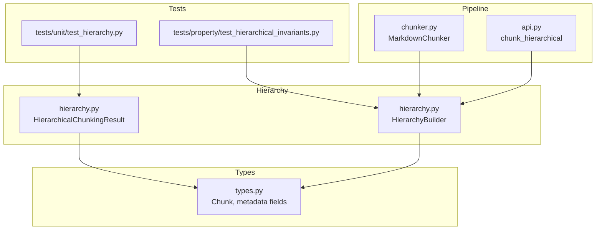
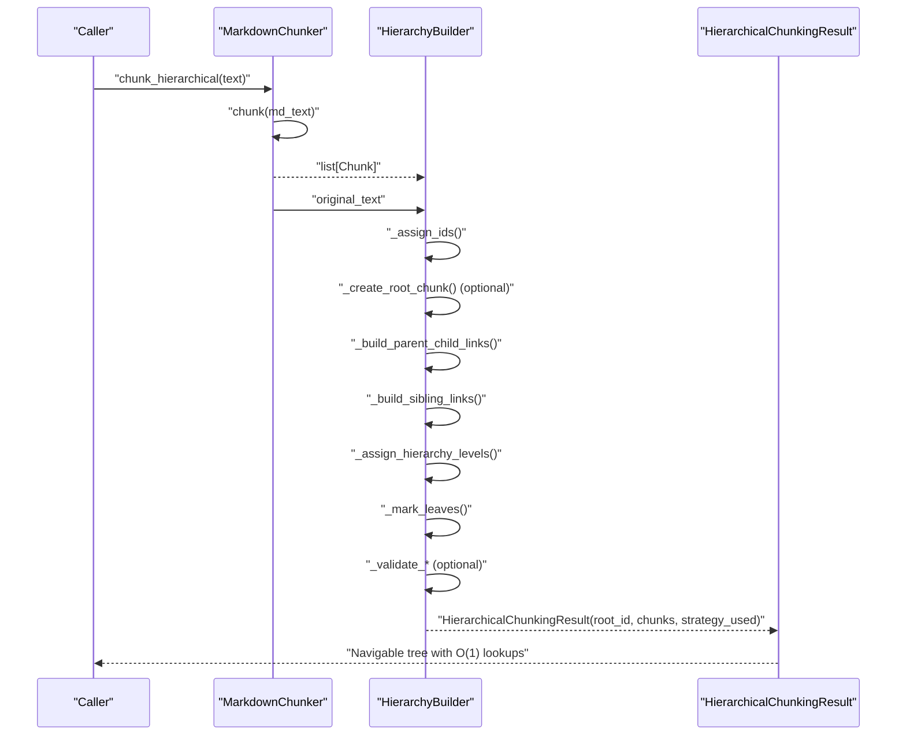
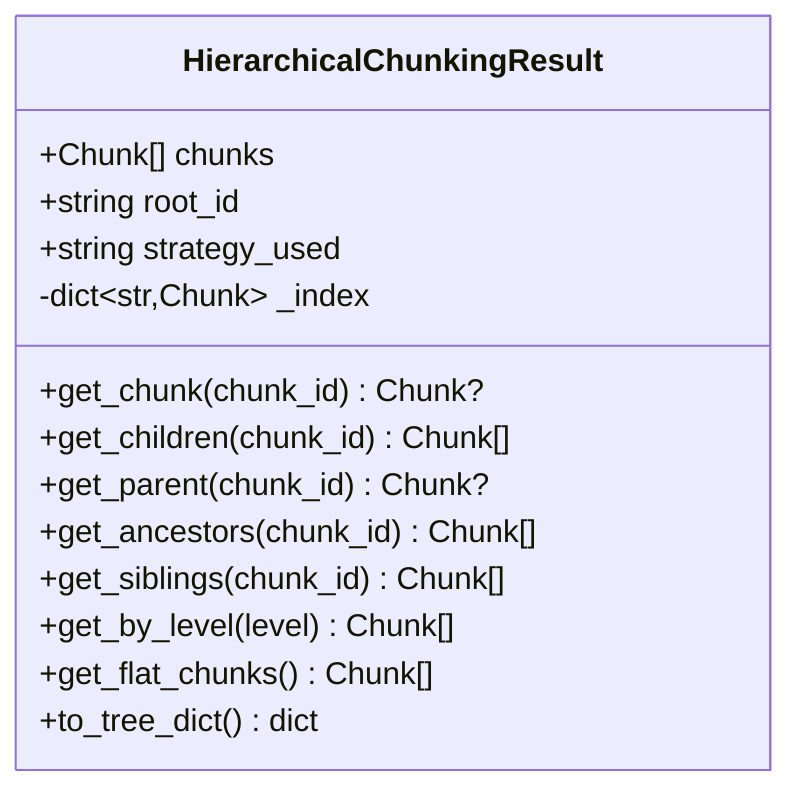
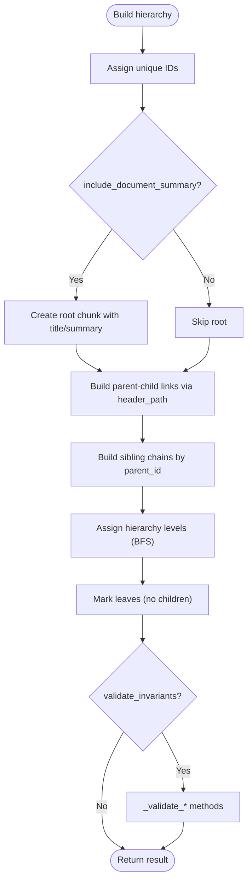
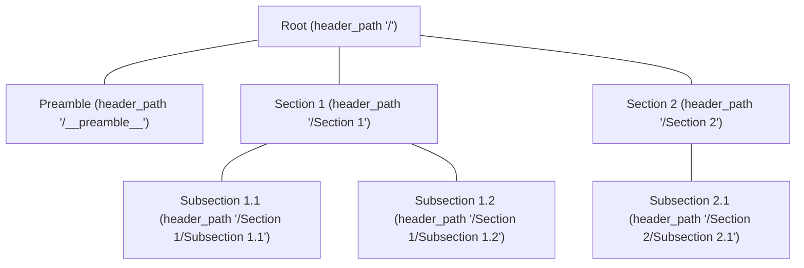
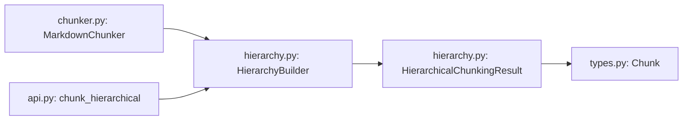

# Hierarchical Chunking

<cite>
**Referenced Files in This Document**
- [hierarchy.py](file://src/chunkana/hierarchy.py)
- [types.py](file://src/chunkana/types.py)
- [chunker.py](file://src/chunkana/chunker.py)
- [api.py](file://src/chunkana/api.py)
- [test_hierarchy.py](file://tests/unit/test_hierarchy.py)
- [test_hierarchical_invariants.py](file://tests/property/test_hierarchical_invariants.py)
- [README.md](file://README.md)
</cite>

## Table of Contents
1. [Introduction](#introduction)
2. [Project Structure](#project-structure)
3. [Core Components](#core-components)
4. [Architecture Overview](#architecture-overview)
5. [Detailed Component Analysis](#detailed-component-analysis)
6. [Dependency Analysis](#dependency-analysis)
7. [Performance Considerations](#performance-considerations)
8. [Troubleshooting Guide](#troubleshooting-guide)
9. [Conclusion](#conclusion)

## Introduction
This document explains hierarchical chunking in the codebase, focusing on the HierarchicalChunkingResult class and its navigation capabilities. It describes how flat chunks are transformed into a tree structure using header_path metadata, how an O(1) lookup index and navigation methods enable efficient traversal, and how the HierarchyBuilder constructs the hierarchy. It also details the get_flat_chunks method for content-preserving flat retrieval, illustrates tree structure and relationships with diagrams, and addresses issues like orphaned chunks and broken sibling chains with validation. Finally, it provides performance considerations for large document hierarchies and practical navigation patterns for common use cases such as context enrichment.

## Project Structure
Hierarchical chunking spans several modules:
- Types define the Chunk dataclass and metadata fields used by the hierarchy.
- Hierarchy implements the HierarchicalChunkingResult navigation API and the HierarchyBuilder that constructs parent-child-sibling relationships.
- Chunker orchestrates the chunking pipeline and exposes chunk_hierarchical to produce hierarchical results.
- API provides convenience functions for hierarchical chunking.
- Tests validate navigation correctness and invariants.

**Diagram sources**
- [hierarchy.py](file://src/chunkana/hierarchy.py#L1-L231)
- [types.py](file://src/chunkana/types.py#L240-L376)
- [chunker.py](file://src/chunkana/chunker.py#L217-L248)
- [api.py](file://src/chunkana/api.py#L273-L305)
- [test_hierarchy.py](file://tests/unit/test_hierarchy.py#L1-L268)
- [test_hierarchical_invariants.py](file://tests/property/test_hierarchical_invariants.py#L1-L299)

**Section sources**
- [hierarchy.py](file://src/chunkana/hierarchy.py#L1-L231)
- [types.py](file://src/chunkana/types.py#L240-L376)
- [chunker.py](file://src/chunkana/chunker.py#L217-L248)
- [api.py](file://src/chunkana/api.py#L273-L305)
- [test_hierarchy.py](file://tests/unit/test_hierarchy.py#L1-L268)
- [test_hierarchical_invariants.py](file://tests/property/test_hierarchical_invariants.py#L1-L299)

## Core Components
- HierarchicalChunkingResult: Stores flat chunks plus a root_id and strategy_used, and provides O(1) navigation via an internal index keyed by chunk_id. Navigation methods include get_chunk, get_children, get_parent, get_ancestors, get_siblings, get_by_level, get_flat_chunks, and to_tree_dict.
- HierarchyBuilder: Post-processes flat chunks to build parent-child-sibling relationships using header_path metadata, assigns hierarchy levels, marks leaves, and validates relationships. It also generates short unique IDs for chunks and can create a root document chunk.

Key metadata fields used by the hierarchy:
- chunk_id: Unique identifier for each chunk.
- parent_id: Parent chunk identifier.
- children_ids: List of child identifiers.
- prev_sibling_id/next_sibling_id: Sibling chain pointers.
- header_path: Hierarchical path to the first header in the chunk, used to infer parent-child relationships.
- hierarchy_level: Tree depth level (0=root, 1=sections, 2=subsections, 3+=deeper).
- is_leaf: Whether the chunk has no children.
- is_root: Whether the chunk is the root document container.

**Section sources**
- [hierarchy.py](file://src/chunkana/hierarchy.py#L16-L231)
- [types.py](file://src/chunkana/types.py#L240-L376)

## Architecture Overview
The hierarchical pipeline transforms flat chunks into a navigable tree:
1. Flat chunks are produced by MarkdownChunker.chunk.
2. HierarchyBuilder.build assigns IDs, optionally creates a root chunk, builds parent-child links via header_path, builds sibling chains, assigns hierarchy levels, marks leaves, and validates relationships.
3. HierarchicalChunkingResult exposes navigation methods backed by an O(1) index.

**Diagram sources**
- [chunker.py](file://src/chunkana/chunker.py#L217-L248)
- [hierarchy.py](file://src/chunkana/hierarchy.py#L260-L308)

## Detailed Component Analysis

### HierarchicalChunkingResult: Navigation and Flat Retrieval
- O(1) lookup index: Built during initialization by iterating chunks and indexing by chunk_id.
- Navigation methods:
  - get_children: Returns children by resolving children_ids via the index.
  - get_parent: Returns parent by resolving parent_id via the index.
  - get_ancestors: Walks up parent_id until reaching root.
  - get_siblings: Returns all siblings under the same parent, ordered by start_line.
  - get_by_level: Filters chunks by hierarchy_level.
  - get_flat_chunks: Returns leaf chunks and non-leaf chunks with significant content to avoid losing content when retrieving flatly.
- Serialization: to_tree_dict produces a safe dictionary representation using IDs instead of object references.

**Diagram sources**
- [hierarchy.py](file://src/chunkana/hierarchy.py#L16-L231)

**Section sources**
- [hierarchy.py](file://src/chunkana/hierarchy.py#L16-L231)

### HierarchyBuilder: Construction, ID Generation, and Validation
- ID generation: Short unique IDs are generated from a hash of content and index to keep IDs compact.
- Root chunk: Optionally created with a meaningful title and summary, header_path "/", and is_root flag.
- Parent-child links: Indexed by header_path; for each chunk, walk up the path segments to find the nearest existing parent. Orphaned chunks link to root.
- Sibling links: Group by parent_id, sort by start_line, and link prev/next.
- Hierarchy levels: BFS from root assigns levels 0..3 based on tree depth.
- Leaves: Marked consistently as chunks with no children.
- Validation: Parent-child count checks, sibling chain integrity, and tree invariants. In strict mode, raises exceptions; in non-strict mode, auto-fixes and logs warnings.

**Diagram sources**
- [hierarchy.py](file://src/chunkana/hierarchy.py#L260-L308)
- [hierarchy.py](file://src/chunkana/hierarchy.py#L374-L421)
- [hierarchy.py](file://src/chunkana/hierarchy.py#L422-L444)
- [hierarchy.py](file://src/chunkana/hierarchy.py#L445-L496)
- [hierarchy.py](file://src/chunkana/hierarchy.py#L496-L511)
- [hierarchy.py](file://src/chunkana/hierarchy.py#L656-L810)

**Section sources**
- [hierarchy.py](file://src/chunkana/hierarchy.py#L260-L308)
- [hierarchy.py](file://src/chunkana/hierarchy.py#L374-L421)
- [hierarchy.py](file://src/chunkana/hierarchy.py#L422-L444)
- [hierarchy.py](file://src/chunkana/hierarchy.py#L445-L496)
- [hierarchy.py](file://src/chunkana/hierarchy.py#L496-L511)
- [hierarchy.py](file://src/chunkana/hierarchy.py#L656-L810)

### Tree Structure and Relationships
The tree is derived from header_path metadata. Parent-child relationships are inferred by walking up the path segments to locate the nearest existing parent. Sibling order is determined by start_line within each parent group.

**Diagram sources**
- [hierarchy.py](file://src/chunkana/hierarchy.py#L374-L421)
- [types.py](file://src/chunkana/types.py#L240-L376)

### Navigation Patterns and Common Use Cases
- Context enrichment: Use get_ancestors to enrich prompts with parent sections and headers.
- Flat retrieval: Use get_flat_chunks to retrieve leaf chunks plus non-leaf chunks with significant content, ensuring no content is lost.
- Tree inspection: Use to_tree_dict to serialize the tree for visualization or debugging.
- Level-based filtering: Use get_by_level to target specific hierarchy levels.

Validation and invariants:
- Parent-child bidirectionality: Each child’s parent_id equals the parent’s chunk_id, and parent’s children_ids include the child.
- No orphaned chunks: Non-root chunks must have a parent; root has no parent.
- Sibling chain integrity: prev/next links form a continuous chain with consistent bidirectional links.
- is_leaf consistency: is_leaf equals (children_ids is empty).

**Section sources**
- [test_hierarchy.py](file://tests/unit/test_hierarchy.py#L1-L268)
- [test_hierarchical_invariants.py](file://tests/property/test_hierarchical_invariants.py#L1-L299)

### get_flat_chunks: Content Preservation
The method preserves content by including:
- Leaf chunks (no children).
- Non-leaf, non-root chunks that have significant content (more than 100 characters of non-header text).

This prevents losing meaningful content-bearing parents that contain text beyond headers.

**Section sources**
- [hierarchy.py](file://src/chunkana/hierarchy.py#L137-L187)
- [hierarchy.py](file://src/chunkana/hierarchy.py#L512-L548)

## Dependency Analysis
- MarkdownChunker depends on StrategySelector, Parser, HeaderProcessor, MetadataRecalculator, and HierarchyBuilder to produce hierarchical results.
- HierarchicalChunkingResult depends on Chunk and metadata fields to navigate and serialize.
- HierarchyBuilder depends on Chunk and metadata fields to construct relationships and validate invariants.

**Diagram sources**
- [chunker.py](file://src/chunkana/chunker.py#L217-L248)
- [hierarchy.py](file://src/chunkana/hierarchy.py#L16-L231)
- [types.py](file://src/chunkana/types.py#L240-L376)
- [api.py](file://src/chunkana/api.py#L273-L305)

**Section sources**
- [chunker.py](file://src/chunkana/chunker.py#L217-L248)
- [hierarchy.py](file://src/chunkana/hierarchy.py#L16-L231)
- [types.py](file://src/chunkana/types.py#L240-L376)
- [api.py](file://src/chunkana/api.py#L273-L305)

## Performance Considerations
- O(1) navigation: The internal index enables constant-time lookups by chunk_id.
- Parent-child linking: Indexing by header_path allows O(1) parent lookup per chunk, with a linear pass over chunks to establish relationships.
- Sibling linking: Sorting by start_line per parent group is efficient for typical document structures.
- BFS level assignment: Traverses the tree once from root, assigning levels in O(N).
- Validation overhead: Parent-child counts and sibling chain validation add modest overhead; disable or tune in non-critical paths.
- Large hierarchies: For very deep documents, consider disabling document summary root to reduce extra content and simplify traversal.

[No sources needed since this section provides general guidance]

## Troubleshooting Guide
Common issues and resolutions:
- Orphaned chunks: Non-root chunks must have a parent. In strict mode, this triggers an exception; in non-strict mode, missing child references are auto-fixed by appending to parent’s children_ids.
- Broken sibling chains: Validate sibling groups to ensure exactly one first sibling and continuous prev/next links. Cycles and mismatched bidirectional links are detected and reported.
- is_leaf inconsistencies: Auto-fix sets is_leaf to match children_ids emptiness when not in strict mode.
- Root chunk anomalies: Ensure header_path "/" for root and correct start/end lines; the root covers the entire document.

Validation and configuration:
- validate_invariants toggles validation; strict_mode controls whether to raise exceptions or auto-fix.

**Section sources**
- [hierarchy.py](file://src/chunkana/hierarchy.py#L656-L810)
- [hierarchy.py](file://src/chunkana/hierarchy.py#L882-L899)
- [test_hierarchical_invariants.py](file://tests/property/test_hierarchical_invariants.py#L1-L299)
- [README.md](file://README.md#L86-L112)

## Conclusion
Hierarchical chunking transforms flat chunks into a navigable tree using header_path metadata and a compact O(1) index. The HierarchyBuilder constructs parent-child-sibling relationships, assigns levels, marks leaves, and validates invariants. HierarchicalChunkingResult exposes efficient navigation methods and a content-preserving flat retrieval mode. Robust validation protects against orphaned chunks and broken sibling chains, with strict/non-strict modes to suit different reliability needs. These capabilities enable powerful context enrichment and flexible retrieval strategies for RAG applications.