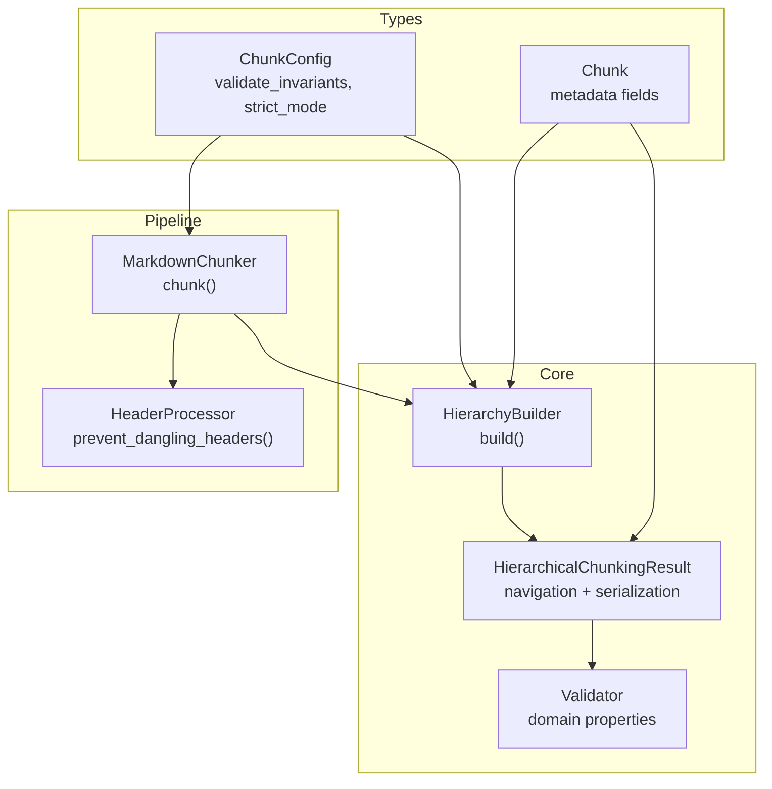
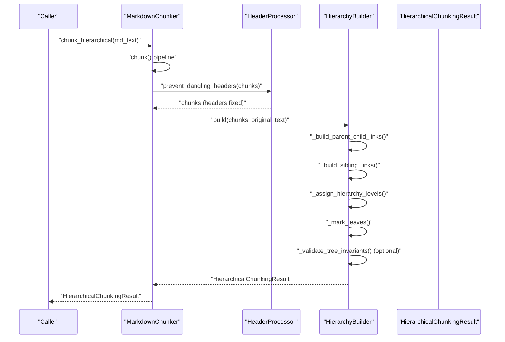
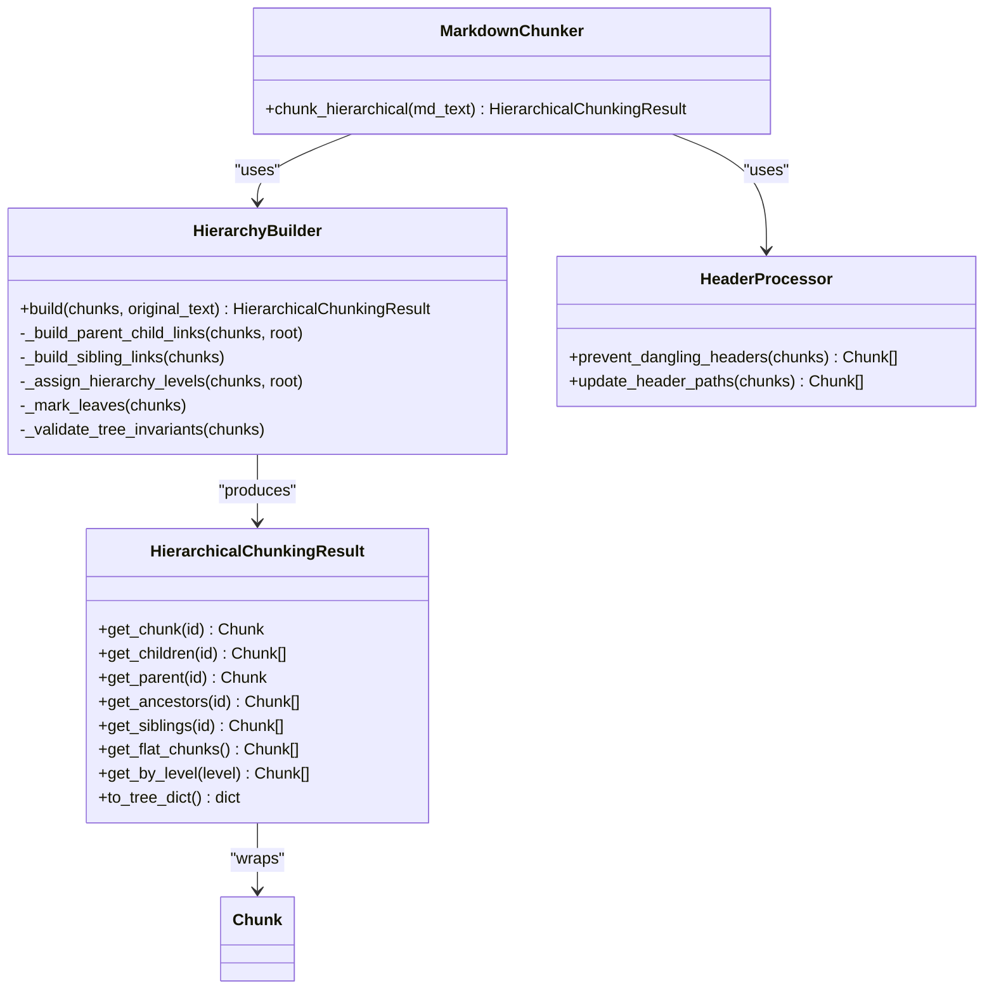

# Hierarchical Chunking

<cite>
**Referenced Files in This Document**
- [hierarchy.py](file://src/chunkana/hierarchy.py)
- [chunker.py](file://src/chunkana/chunker.py)
- [types.py](file://src/chunkana/types.py)
- [header_processor.py](file://src/chunkana/header_processor.py)
- [exceptions.py](file://src/chunkana/exceptions.py)
- [config.py](file://src/chunkana/config.py)
- [test_hierarchy.py](file://tests/unit/test_hierarchy.py)
- [test_hierarchical_invariants.py](file://tests/property/test_hierarchical_invariants.py)
</cite>

## Table of Contents
1. [Introduction](#introduction)
2. [Project Structure](#project-structure)
3. [Core Components](#core-components)
4. [Architecture Overview](#architecture-overview)
5. [Detailed Component Analysis](#detailed-component-analysis)
6. [Dependency Analysis](#dependency-analysis)
7. [Performance Considerations](#performance-considerations)
8. [Troubleshooting Guide](#troubleshooting-guide)
9. [Conclusion](#conclusion)

## Introduction
This document explains how Chunkana builds and validates hierarchical document structure trees from flat chunks. It covers header analysis, parent-child relationship establishment, tree construction, and the line range contract. It also details the tree invariant validation system, differences between strict_mode and auto-fix behavior, and practical navigation using get_children(), get_parent(), and get_flat_chunks(). Finally, it provides performance considerations for large documents and memory usage patterns.

## Project Structure
The hierarchical chunking capability centers around:
- A builder that constructs parent-child-sibling relationships from existing header_path metadata
- A result object that exposes navigation methods and serialization helpers
- Validation logic that enforces tree invariants and supports strict_mode
- Integration with the main chunker pipeline to produce hierarchical results

**Diagram sources**
- [hierarchy.py](file://src/chunkana/hierarchy.py#L233-L307)
- [chunker.py](file://src/chunkana/chunker.py#L217-L248)
- [header_processor.py](file://src/chunkana/header_processor.py#L405-L451)
- [types.py](file://src/chunkana/types.py#L240-L376)
- [config.py](file://src/chunkana/config.py#L107-L111)

**Section sources**
- [hierarchy.py](file://src/chunkana/hierarchy.py#L233-L307)
- [chunker.py](file://src/chunkana/chunker.py#L217-L248)
- [types.py](file://src/chunkana/types.py#L240-L376)
- [config.py](file://src/chunkana/config.py#L107-L111)

## Core Components
- HierarchyBuilder: Orchestrates building parent-child-sibling links, assigning hierarchy levels, marking leaves, and validating invariants. It uses header_path metadata to infer parent-child relationships and supports strict_mode.
- HierarchicalChunkingResult: Wraps the flat chunk list and provides O(1) navigation via chunk_id lookups, parent/child/sibling retrieval, ancestor traversal, and flat chunk selection.
- HeaderProcessor: Prevents dangling headers by moving headers between chunks or merging chunks when necessary, updating metadata accordingly.
- Validator: Validates domain properties (no content loss, size bounds, monotonic ordering, empty chunks, valid line numbers). While distinct from hierarchical validation, it complements pipeline correctness.
- ChunkConfig: Controls hierarchical validation and strict_mode behavior, among other pipeline settings.

**Section sources**
- [hierarchy.py](file://src/chunkana/hierarchy.py#L233-L307)
- [hierarchy.py](file://src/chunkana/hierarchy.py#L16-L114)
- [header_processor.py](file://src/chunkana/header_processor.py#L405-L451)
- [validator.py](file://src/chunkana/validator.py#L32-L92)
- [config.py](file://src/chunkana/config.py#L107-L111)

## Architecture Overview
The hierarchical chunking pipeline integrates with the main chunker:
1. The chunker produces flat chunks with header_path metadata.
2. The chunker invokes HierarchyBuilder to establish parent-child-sibling relationships.
3. The builder optionally validates invariants and supports strict_mode.
4. The result is a HierarchicalChunkingResult with navigation methods and serialization helpers.

**Diagram sources**
- [chunker.py](file://src/chunkana/chunker.py#L217-L248)
- [header_processor.py](file://src/chunkana/header_processor.py#L405-L451)
- [hierarchy.py](file://src/chunkana/hierarchy.py#L260-L307)

## Detailed Component Analysis

### Header Analysis and Parent-Child Relationship Establishment
- Parent-child links are inferred from header_path metadata. The builder:
  - Indexes chunks by header_path for O(1) parent lookup.
  - Walks up the path segments to find the nearest parent.
  - Links orphans to the root when no parent is found.
  - Ensures preamble chunks are children of the root.
- Sibling links are built by grouping chunks by parent_id and sorting by start_line, then linking prev/next pointers.
- Hierarchy levels are assigned via BFS from the root, calculating actual tree depth rather than mapping header_level.

Key behaviors:
- header_path semantics: "/Level1/Level2/Level3" with special "/__preamble__".
- Orphaned chunks (no matching parent_path) are attached to root.
- Root chunk is created when enabled, containing document title and summary.

**Section sources**
- [hierarchy.py](file://src/chunkana/hierarchy.py#L374-L421)
- [hierarchy.py](file://src/chunkana/hierarchy.py#L422-L444)
- [hierarchy.py](file://src/chunkana/hierarchy.py#L445-L495)
- [hierarchy.py](file://src/chunkana/hierarchy.py#L335-L373)

### Tree Construction and Navigation
- HierarchicalChunkingResult provides:
  - get_chunk(chunk_id): O(1) lookup by chunk_id.
  - get_children(chunk_id): Children by parent_id.
  - get_parent(chunk_id): Parent by parent_id.
  - get_ancestors(chunk_id): Ancestral chain to root.
  - get_siblings(chunk_id): Siblings ordered by start_line.
  - get_flat_chunks(): Leaf chunks plus non-leaf chunks with significant content (>100 chars excluding headers).
  - get_by_level(level): Chunks at a specific hierarchy level.
  - to_tree_dict(): Serializable tree representation using IDs.

Navigation guarantees:
- Bidirectional parent-child relationships are validated by tests and property-based invariants.
- Sibling chains are validated to be complete and continuous.

**Section sources**
- [hierarchy.py](file://src/chunkana/hierarchy.py#L45-L165)
- [hierarchy.py](file://src/chunkana/hierarchy.py#L188-L231)
- [test_hierarchy.py](file://tests/unit/test_hierarchy.py#L48-L163)
- [test_hierarchy.py](file://tests/unit/test_hierarchy.py#L164-L203)

### Line Range Contract and Content Ownership
- Internal nodes (non-leaf) contain only their header content; children contain detailed content.
- The root chunk spans the document’s start_line to end_line, encapsulating the whole document when created.
- The builder assigns hierarchy_level based on tree depth, not header_level, ensuring consistent levels across the tree.

Validation implications:
- Content range consistency is part of the hierarchical invariants tested by property-based tests.

**Section sources**
- [hierarchy.py](file://src/chunkana/hierarchy.py#L445-L495)
- [test_hierarchical_invariants.py](file://tests/property/test_hierarchical_invariants.py#L154-L183)

### Tree Invariant Validation System
The system validates:
- is_leaf consistency: is_leaf equals (children_ids is empty).
- parent-child bidirectionality: parent’s children_ids includes child and child’s parent_id equals parent.
- no orphaned chunks: non-root chunks must have a parent; root has no parent.
- content range consistency: root start_line is 1 and end_line covers most of the document.

Behavior modes:
- strict_mode: Raises HierarchicalInvariantError on violations with detailed context and suggestions.
- auto-fix (non-strict): Corrects violations (e.g., recalculating is_leaf) without raising.

Exceptions:
- HierarchicalInvariantError carries invariant name, chunk_id, details, and suggested_fix.

**Section sources**
- [test_hierarchical_invariants.py](file://tests/property/test_hierarchical_invariants.py#L81-L104)
- [test_hierarchical_invariants.py](file://tests/property/test_hierarchical_invariants.py#L105-L151)
- [test_hierarchical_invariants.py](file://tests/property/test_hierarchical_invariants.py#L184-L215)
- [test_hierarchical_invariants.py](file://tests/property/test_hierarchical_invariants.py#L216-L299)
- [exceptions.py](file://src/chunkana/exceptions.py#L34-L101)

### Strict Mode vs Auto-Fix Behavior
- strict_mode=True: Enforce invariants strictly; violations raise HierarchicalInvariantError.
- strict_mode=False: Attempt to auto-fix inconsistencies (e.g., correcting is_leaf) and continue.

Practical impact:
- Property-based tests demonstrate strict_mode raising exceptions and non-strict mode auto-fixing.

**Section sources**
- [test_hierarchical_invariants.py](file://tests/property/test_hierarchical_invariants.py#L216-L299)
- [config.py](file://src/chunkana/config.py#L107-L111)

### Examples of Navigating the Tree
Common navigation patterns:
- Retrieve root: result.get_chunk(result.root_id)
- Iterate children of a node: result.get_children(parent_id)
- Navigate up: result.get_parent(child_id)
- Traverse ancestors: result.get_ancestors(chunk_id)
- Get siblings: result.get_siblings(chunk_id)
- Flatten for retrieval: result.get_flat_chunks()

These patterns are validated by unit tests and property-based invariants.

**Section sources**
- [test_hierarchy.py](file://tests/unit/test_hierarchy.py#L48-L163)
- [test_hierarchy.py](file://tests/unit/test_hierarchy.py#L164-L203)

### Dangling Header Prevention and Metadata Updates
- DanglingHeaderDetector identifies headers at the end of a chunk that appear to belong to the next chunk.
- HeaderMover attempts to move the header into the next chunk or merge chunks if moving would exceed size limits.
- HeaderProcessor iteratively fixes dangling headers and marks chunks for header_path updates.

Effects on hierarchy:
- After header movement, header_path may need recalculation; metadata flags indicate potential updates.

**Section sources**
- [header_processor.py](file://src/chunkana/header_processor.py#L405-L451)
- [header_processor.py](file://src/chunkana/header_processor.py#L1-L165)
- [header_processor.py](file://src/chunkana/header_processor.py#L240-L392)

### Integration with the Main Chunker
- chunk_hierarchical() runs the standard chunk() pipeline, then builds the hierarchy.
- The builder is configured via ChunkConfig: include_document_summary, validate_invariants, strict_mode.

**Section sources**
- [chunker.py](file://src/chunkana/chunker.py#L217-L248)
- [config.py](file://src/chunkana/config.py#L107-L111)

## Dependency Analysis
- HierarchyBuilder depends on:
  - Chunk metadata (header_path, parent_id, children_ids, hierarchy_level, is_root, is_leaf)
  - O(1) indexing via chunk_id
  - BFS traversal for hierarchy levels
- HierarchicalChunkingResult depends on:
  - Flat list of chunks and internal _index
  - Metadata fields for navigation and filtering
- HeaderProcessor depends on:
  - Chunk content and header_path metadata
  - Config for size limits and thresholds
- Validator operates independently but complements pipeline correctness.

**Diagram sources**
- [hierarchy.py](file://src/chunkana/hierarchy.py#L233-L307)
- [hierarchy.py](file://src/chunkana/hierarchy.py#L16-L114)
- [header_processor.py](file://src/chunkana/header_processor.py#L405-L451)
- [chunker.py](file://src/chunkana/chunker.py#L217-L248)
- [types.py](file://src/chunkana/types.py#L240-L376)

**Section sources**
- [hierarchy.py](file://src/chunkana/hierarchy.py#L233-L307)
- [header_processor.py](file://src/chunkana/header_processor.py#L405-L451)
- [chunker.py](file://src/chunkana/chunker.py#L217-L248)
- [types.py](file://src/chunkana/types.py#L240-L376)

## Performance Considerations
- Complexity characteristics:
  - Building parent-child links: O(n) indexing plus O(n) traversal over chunks.
  - Sibling linking: O(n) grouping plus O(k log k) per parent group (sorting by start_line).
  - Assigning hierarchy levels: O(n) BFS traversal.
  - Marking leaves: O(n).
  - Indexing for O(1) lookups: O(n).
- Memory usage patterns:
  - Flat storage of chunks with metadata; no deep object graph.
  - Index map _index maps chunk_id to Chunk for O(1) lookup.
  - Metadata fields include children_ids, parent_id, prev_sibling_id, next_sibling_id, hierarchy_level, is_leaf, is_root.
  - get_flat_chunks() filters to avoid content duplication by preferring leaves or non-leaf chunks with significant content.
- Large documents:
  - Use chunk_file_streaming() for memory efficiency when processing very large files.
  - Consider adaptive sizing and overlap settings to balance chunk sizes and retrieval quality.

[No sources needed since this section provides general guidance]

## Troubleshooting Guide
Common issues and resolutions:
- Invariant violations:
  - Symptom: HierarchicalInvariantError indicating is_leaf_consistency, parent_child_bidirectionality, or orphaned_chunk.
  - Resolution: Enable strict_mode for strict enforcement; disable strict_mode to auto-fix inconsistencies; inspect chunk metadata for mismatches.
- Dangling headers:
  - Symptom: Headers appear at the end of a chunk with minimal content while detailed content is in the next chunk.
  - Resolution: Run prevent_dangling_headers(); review header_moved_from metadata and consider merging chunks if size limits apply.
- Orphaned chunks:
  - Symptom: Non-root chunks lack a parent.
  - Resolution: Ensure header_path is correct; verify parent-child inference; rebuild hierarchy with validate_invariants enabled.
- Excessive memory usage:
  - Symptom: Large in-memory footprint during chunk_hierarchical().
  - Resolution: Use chunk_file_streaming() for large files; adjust overlap_size and max_chunk_size; consider disabling include_document_summary.

**Section sources**
- [exceptions.py](file://src/chunkana/exceptions.py#L34-L101)
- [header_processor.py](file://src/chunkana/header_processor.py#L405-L451)
- [test_hierarchical_invariants.py](file://tests/property/test_hierarchical_invariants.py#L216-L299)

## Conclusion
Chunkana’s hierarchical chunking transforms flat chunks into a navigable tree using header_path metadata. The HierarchyBuilder establishes robust parent-child relationships, assigns hierarchy levels, and validates invariants with strict_mode and auto-fix options. The HierarchicalChunkingResult offers efficient navigation and serialization, while the pipeline integrates header prevention and domain validation. For large documents, streaming and configuration tuning help manage memory and performance effectively.