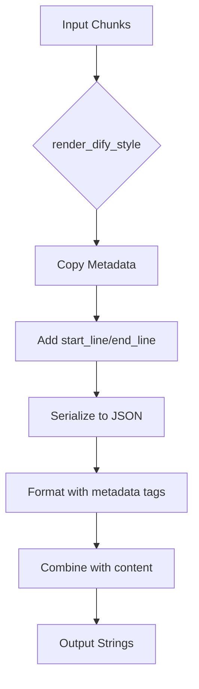
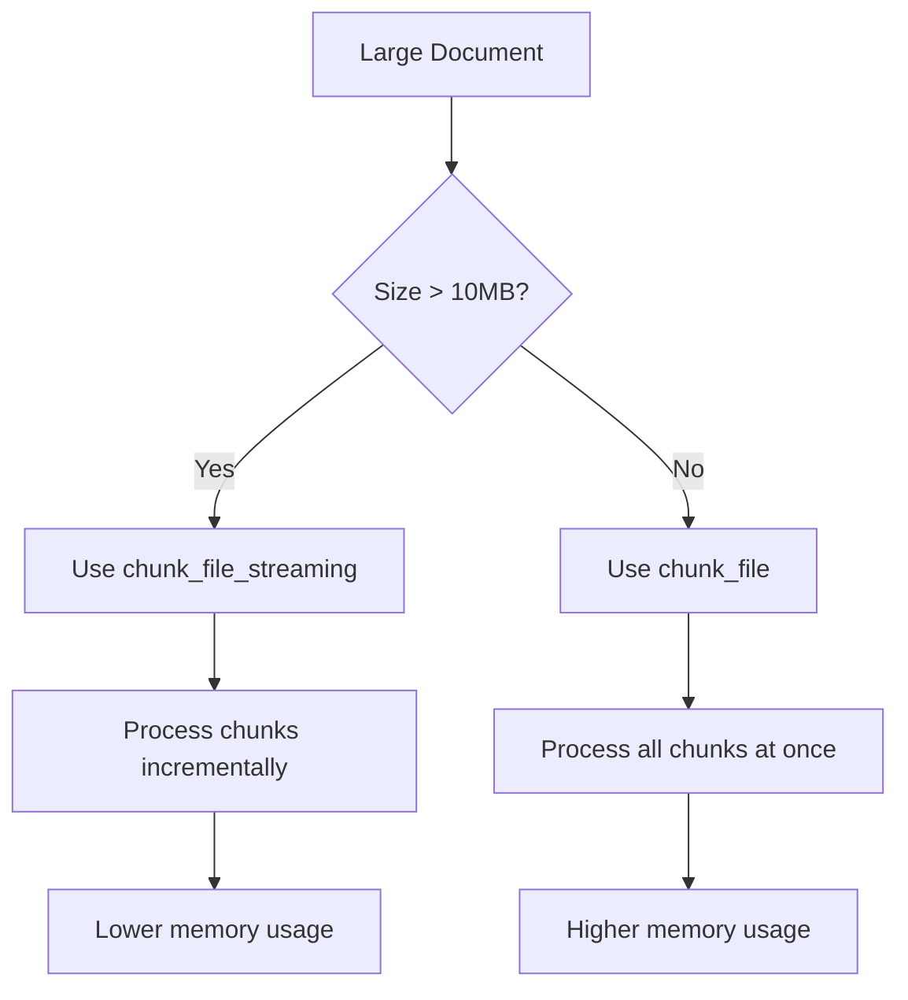

# Dify Integration

<cite>
**Referenced Files in This Document**   
- [dify.md](file://docs/integrations/dify.md)
- [formatters.py](file://src/chunkana/renderers/formatters.py)
- [config.py](file://src/chunkana/config.py)
- [api.py](file://src/chunkana/api.py)
- [types.py](file://src/chunkana/types.py)
- [streaming_chunker.py](file://src/chunkana/streaming/streaming_chunker.py)
- [MIGRATION_GUIDE.md](file://MIGRATION_GUIDE.md)
- [BASELINE.md](file://BASELINE.md)
- [golden_dify_style/code_heavy.jsonl](file://tests/baseline/golden_dify_style/code_heavy.jsonl)
- [golden_dify_style/mixed_content.jsonl](file://tests/baseline/golden_dify_style/mixed_content.jsonl)
- [golden_dify_style/headers_deep.jsonl](file://tests/baseline/golden_dify_style/headers_deep.jsonl)
</cite>

## Table of Contents
1. [Introduction](#introduction)
2. [Dify-Compatible Rendering](#dify-compatible-rendering)
3. [Configuration for Dify Integration](#configuration-for-dify-integration)
4. [Step-by-Step Configuration](#step-by-step-configuration)
5. [Processing Markdown Files](#processing-markdown-files)
6. [Field Mappings and Schema Constraints](#field-mappings-and-schema-constraints)
7. [Common Issues and Troubleshooting](#common-issues-and-troubleshooting)
8. [Performance Considerations](#performance-considerations)
9. [Golden Dify Style Test Fixtures](#golden-dify-style-test-fixtures)

## Introduction

Chunkana provides seamless integration with Dify's Retrieval-Augmented Generation (RAG) pipeline through its Dify-compatible renderer. This integration enables users to process Markdown documents and output structured chunks in the exact format expected by Dify, ensuring compatibility and optimal performance within Dify workflows. The core functionality revolves around Chunkana's ability to chunk Markdown content intelligently and render it using the `render_dify_style` function, which formats chunks with metadata blocks that match Dify's ingestion requirements.

The integration maintains full compatibility with the dify-markdown-chunker v2 plugin, producing identical output when given the same input and configuration. This ensures a smooth migration path for existing Dify users while providing enhanced features and improved maintainability through Chunkana's standalone library architecture.

**Section sources**
- [dify.md](file://docs/integrations/dify.md#L1-L126)
- [MIGRATION_GUIDE.md](file://MIGRATION_GUIDE.md#L1-L200)

## Dify-Compatible Rendering

Chunkana's Dify-compatible rendering is implemented through the `render_dify_style` function in the `chunkana.renderers` module. This function transforms a list of `Chunk` objects into strings formatted with metadata blocks that are fully compatible with Dify's ingestion API.

### Rendering Format

The `render_dify_style` function produces output in the following format:

```
<metadata>
{JSON metadata including start_line and end_line}
</metadata>
{chunk content}
```

Each chunk is rendered as a string containing a `<metadata>` block with JSON-formatted metadata followed by the actual chunk content. The metadata includes all fields from the chunk's metadata dictionary plus the `start_line` and `end_line` properties from the chunk object itself.

### Implementation Details

The rendering process is a pure function that does not modify the original chunk objects. For each chunk, it:
1. Creates a copy of the chunk's metadata dictionary
2. Adds `start_line` and `end_line` fields from the chunk object
3. Serializes the metadata to formatted JSON
4. Combines the metadata block with the chunk content using the specified format

This approach ensures that the original chunk data remains unchanged while producing output that matches the v2 plugin behavior with `include_metadata=True`.



**Diagram sources**
- [formatters.py](file://src/chunkana/renderers/formatters.py#L56-L84)

**Section sources**
- [formatters.py](file://src/chunkana/renderers/formatters.py#L56-L84)
- [dify.md](file://docs/integrations/dify.md#L58-L68)

## Configuration for Dify Integration

Configuring Chunkana for Dify integration involves setting up the appropriate `ChunkerConfig` parameters and selecting the correct rendering function based on the desired output format. The configuration system provides both direct parameter control and convenience methods for common use cases.

### Core Configuration Parameters

The `ChunkerConfig` class (aliased from `ChunkConfig`) exposes several parameters that control chunking behavior:

| Parameter | Default | Description |
|---------|--------|-------------|
| `max_chunk_size` | 4096 | Maximum size of a chunk in characters |
| `min_chunk_size` | 512 | Minimum size of a chunk in characters |
| `overlap_size` | 200 | Size of overlap between chunks in characters |
| `strategy_override` | None | Force specific chunking strategy ("auto" = None) |
| `code_threshold` | 0.3 | Code ratio threshold for CodeAwareStrategy |
| `structure_threshold` | 3 | Minimum headers for StructuralStrategy |
| `list_ratio_threshold` | 0.4 | Minimum list ratio for ListAwareStrategy |

### Dify-Specific Configuration

For Dify integration, the most important parameters are those that control the output format and chunking strategy. The configuration should be aligned with Dify's expectations for chunk size, overlap, and metadata inclusion.

```python
from chunkana import ChunkerConfig

# Standard Dify configuration
config = ChunkerConfig(
    max_chunk_size=4096,
    min_chunk_size=512,
    overlap_size=200,
)
```

The default values match the baseline parameters used in the dify-markdown-chunker v2 plugin, ensuring compatibility with existing Dify workflows.

**Section sources**
- [config.py](file://src/chunkana/config.py#L1-L507)
- [dify.md](file://docs/integrations/dify.md#L44-L48)

## Step-by-Step Configuration

Configuring Chunkana to output in Dify's expected format involves several steps that transform raw Markdown content into properly formatted chunks. This process ensures compatibility with Dify's RAG pipeline and maintains the structural integrity of the original document.

### Basic Configuration Workflow

1. **Import required modules**:
```python
from chunkana import chunk_markdown, ChunkerConfig
from chunkana.renderers import render_dify_style
```

2. **Create configuration**:
```python
config = ChunkerConfig(
    max_chunk_size=4096,
    min_chunk_size=512,
    overlap_size=200,
)
```

3. **Process document**:
```python
chunks = chunk_markdown(text, config)
result = render_dify_style(chunks)
```

### Migration from dify-markdown-chunker

When migrating from the dify-markdown-chunker plugin, follow these steps:

1. **Update imports**:
```python
# Before
from markdown_chunker_v2 import MarkdownChunker, ChunkConfig

# After
from chunkana import chunk_markdown, ChunkerConfig
from chunkana.renderers import render_dify_style
```

2. **Update configuration and chunking**:
```python
# Before
config = ChunkConfig(max_chunk_size=4096)
chunker = MarkdownChunker(config)
result = chunker.chunk(text, include_metadata=True)

# After
config = ChunkerConfig(max_chunk_size=4096)
chunks = chunk_markdown(text, config)
result = render_dify_style(chunks)
```

The key difference is the separation of chunking and rendering operations. Chunkana always returns `List[Chunk]` from the chunking operation, and rendering is handled by separate functions based on the desired output format.

**Section sources**
- [dify.md](file://docs/integrations/dify.md#L38-L55)
- [MIGRATION_GUIDE.md](file://MIGRATION_GUIDE.md#L17-L30)

## Processing Markdown Files

Processing Markdown files for Dify integration involves converting the raw Markdown content into structured chunks that preserve both content and context. This section demonstrates how to process different types of Markdown files and feed the structured chunks into Dify workflows.

### Processing Code-Heavy Documents

For documents with extensive code blocks, Chunkana's `code_aware` strategy ensures that code blocks are preserved intact while providing appropriate context.

```python
# Example: Processing a code-heavy document
def process_code_document(text: str) -> list[str]:
    """Process code-heavy document for Dify workflow."""
    config = ChunkerConfig(
        max_chunk_size=8192,
        min_chunk_size=1024,
        overlap_size=100,
        code_threshold=0.2,
    )
    
    chunks = chunk_markdown(text, config)
    return render_dify_style(chunks)
```

The output includes metadata that identifies code blocks and their context, as shown in the golden test fixtures.

### Processing Mixed Content Documents

Documents containing a mix of text, code, lists, and tables are processed using Chunkana's adaptive strategies to maintain the integrity of each content type.

```python
# Example: Processing mixed content
def process_mixed_document(text: str) -> dict:
    """Process mixed content document for Dify."""
    chunks = chunk_markdown(text)
    formatted = render_dify_style(chunks)
    
    return {
        "chunks": formatted,
        "count": len(formatted),
    }
```

### Processing Deeply Nested Headers

Documents with complex header hierarchies are processed to maintain the structural relationships between sections.

```python
# Example: Processing hierarchical document
def process_hierarchical_document(text: str, debug: bool = False) -> dict:
    """Process document with deep header hierarchy."""
    from chunkana import chunk_hierarchical
    
    result = chunk_hierarchical(text)
    
    if debug:
        # Include all chunks (root, intermediate, leaf)
        chunks = result.get_all_chunks()
    else:
        # Only leaf chunks (default)
        chunks = result.get_flat_chunks()
    
    return {"chunks": render_dify_style(chunks)}
```

**Section sources**
- [dify.md](file://docs/integrations/dify.md#L72-L102)
- [golden_dify_style/code_heavy.jsonl](file://tests/baseline/golden_dify_style/code_heavy.jsonl#L1-L2)
- [golden_dify_style/mixed_content.jsonl](file://tests/baseline/golden_dify_style/mixed_content.jsonl#L1-L2)
- [golden_dify_style/headers_deep.jsonl](file://tests/baseline/golden_dify_style/headers_deep.jsonl#L1-L5)

## Field Mappings and Schema Constraints

Understanding the field mappings between Dify's parameters and Chunkana's configuration is essential for proper integration. This section documents the exact mappings and schema constraints that ensure compatibility between the two systems.

### Tool Input Parameter Mapping

| Dify Tool Param | Chunkana Equivalent | Notes |
|----------------|-------------------|-------|
| `input_text` | `chunk_markdown(text, ...)` | The Markdown text to process |
| `max_chunk_size` | `ChunkerConfig.max_chunk_size` | Maximum chunk size in characters |
| `chunk_overlap` | `ChunkerConfig.overlap_size` | Overlap size in characters |
| `strategy` | `ChunkerConfig.strategy_override` | "auto" = None in Chunkana |
| `include_metadata=True` | `render_dify_style(chunks)` | Output with metadata blocks |
| `include_metadata=False` | `render_with_embedded_overlap(chunks)` | Output with embedded overlap |
| `enable_hierarchy=True` | `chunk_hierarchical(text, config)` | Hierarchical chunking |

### Metadata Schema

The metadata included in Dify-style output contains the following fields:

| Field | Type | Description |
|------|------|-------------|
| `chunk_index` | int | Sequential index of chunk in document |
| `content_type` | str | "text", "code", "table", "mixed", or "preamble" |
| `has_code` | bool | Whether chunk contains code blocks |
| `strategy` | str | Strategy that created this chunk |
| `header_path` | str | Hierarchical path to first header in chunk |
| `header_level` | int | Level of first header in chunk (1-6) |
| `start_line` | int | Starting line number in source document |
| `end_line` | int | Ending line number in source document |

The metadata schema is designed to provide Dify with sufficient context for retrieval and generation tasks while maintaining compatibility with existing workflows.

**Section sources**
- [dify.md](file://docs/integrations/dify.md#L22-L31)
- [types.py](file://src/chunkana/types.py#L255-L289)
- [formatters.py](file://src/chunkana/renderers/formatters.py#L79-L81)

## Common Issues and Troubleshooting

When integrating Chunkana with Dify, several common issues may arise. This section addresses the most frequent problems and provides solutions to ensure smooth operation.

### Format Mismatches

**Issue**: Output format does not match Dify's expectations.

**Solution**: Ensure you are using the correct renderer function:
- Use `render_dify_style()` for metadata blocks
- Use `render_with_embedded_overlap()` for embedded overlap

```python
# Correct usage
chunks = chunk_markdown(text)
result = render_dify_style(chunks)  # For Dify compatibility
```

### Metadata Stripping

**Issue**: Expected metadata fields are missing from output.

**Solution**: Verify that you are using `render_dify_style()` and not another renderer. The Dify-style renderer automatically includes `start_line` and `end_line` in addition to the chunk's metadata.

### Payload Size Limits

**Issue**: Individual chunks exceed Dify's payload size limits.

**Solution**: Adjust the `max_chunk_size` parameter in `ChunkerConfig`:

```python
config = ChunkerConfig(
    max_chunk_size=2048,  # Reduced size
    min_chunk_size=256,
    overlap_size=100,
)
```

### Strategy Selection Issues

**Issue**: Inappropriate chunking strategy is being used.

**Solution**: Either allow auto-detection or explicitly set the strategy:

```python
# Allow auto-detection (default)
config = ChunkerConfig()

# Or force a specific strategy
config = ChunkerConfig(strategy_override="structural")
```

### Empty Output

**Issue**: No chunks are produced from the input.

**Solution**: Ensure the input text is not empty and contains valid Markdown content. The chunking process requires non-whitespace content.

**Section sources**
- [dify.md](file://docs/integrations/dify.md#L105-L114)
- [types.py](file://src/chunkana/types.py#L297-L306)

## Performance Considerations

When using Chunkana with Dify's ingestion API, several performance considerations should be taken into account, particularly when using streaming mode for large documents.

### Streaming Mode Performance

For large documents (>10MB), Chunkana provides a streaming mode that processes files in buffer windows to limit memory usage:

```python
from chunkana import chunk_file_streaming

# Process large file in streaming mode
for chunk in chunk_file_streaming("large_document.md"):
    # Process each chunk incrementally
    send_to_dify(chunk)
```

The streaming mode maintains the following invariants:
- **Line coverage**: All source lines appear in output
- **Atomic blocks**: Code blocks and tables are not split
- **Monotonic start_line**: Chunks are ordered by position

### Memory Efficiency

Streaming mode is significantly more memory-efficient than loading entire files into memory:

```python
# Streaming approach (recommended for large files)
for chunk in chunk_file_streaming("large.md"):
    process(chunk)

# Non-streaming approach (uses more memory)
chunks = chunk_file("large.md")
for chunk in chunks:
    process(chunk)
```

### Processing Time

The processing time for chunking operations depends on document complexity and size. For optimal performance:
- Use appropriate chunk sizes for your content type
- Consider using adaptive sizing for mixed-content documents
- Process files incrementally when possible



**Diagram sources**
- [streaming_chunker.py](file://src/chunkana/streaming/streaming_chunker.py#L18-L99)
- [api.py](file://src/chunkana/api.py#L228-L271)

**Section sources**
- [streaming_chunker.py](file://src/chunkana/streaming/streaming_chunker.py#L18-L99)
- [api.py](file://src/chunkana/api.py#L228-L271)

## Golden Dify Style Test Fixtures

The golden_dify_style test fixtures serve as canonical examples of correct output formatting for Dify integration. These fixtures are generated from the dify-markdown-chunker v2 plugin at a specific commit and are used to verify Chunkana's compatibility.

### Purpose of Golden Fixtures

The golden fixtures in `tests/baseline/golden_dify_style/` provide:
- **Source of truth**: Byte-for-byte identical output to the v2 plugin
- **Compatibility verification**: Test cases to ensure Chunkana produces the same results
- **Regression protection**: Safeguard against unintentional changes in output format

### Fixture Structure

Each fixture is a JSONL file containing one JSON object per line, where each object represents a chunk:

```json
{
  "chunk_index": 0,
  "text": "<metadata>\n{\n  \"strategy\": \"code_aware\",\n  \"content_type\": \"code\",\n  \"start_line\": 1,\n  \"end_line\": 74\n}\n</metadata>\n# Code-Heavy Document\n\nThis document contains lots of code blocks..."
}
```

The `text` field contains the complete formatted chunk with metadata block and content.

### Using Fixtures for Validation

The fixtures are used in baseline tests to verify compatibility:

```bash
# Run baseline tests to verify parity
pytest tests/baseline/test_canonical.py -v
pytest tests/baseline/test_view_level.py -v
```

These tests compare Chunkana's output against the golden fixtures to ensure full compatibility with Dify's expectations.

**Section sources**
- [BASELINE.md](file://BASELINE.md#L1-L34)
- [golden_dify_style/code_heavy.jsonl](file://tests/baseline/golden_dify_style/code_heavy.jsonl#L1-L2)
- [golden_dify_style/mixed_content.jsonl](file://tests/baseline/golden_dify_style/mixed_content.jsonl#L1-L2)
- [golden_dify_style/headers_deep.jsonl](file://tests/baseline/golden_dify_style/headers_deep.jsonl#L1-L5)