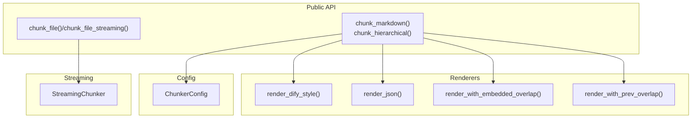
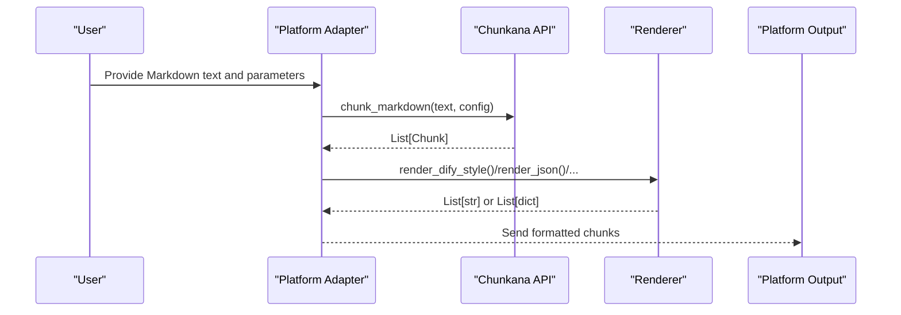
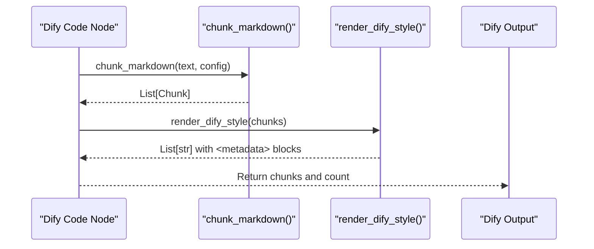
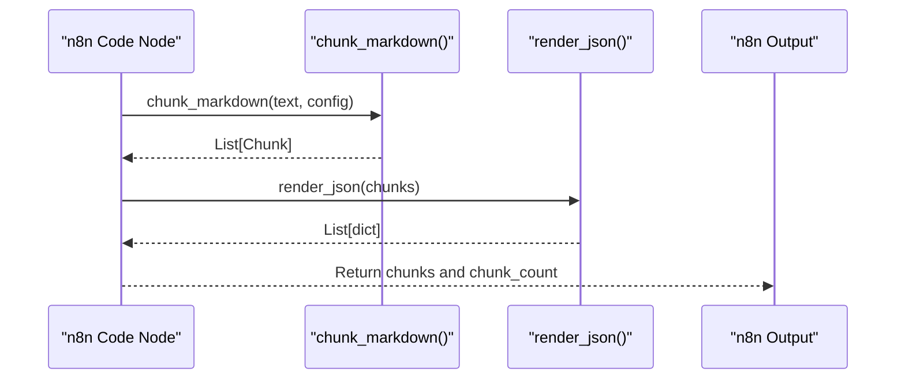
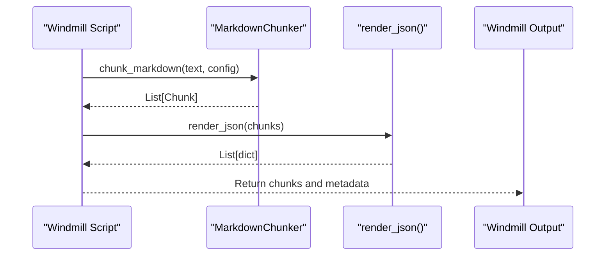
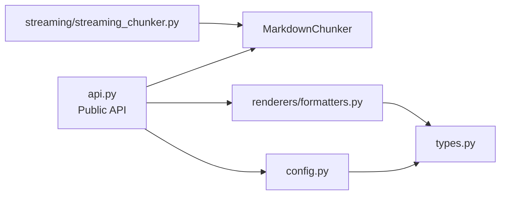
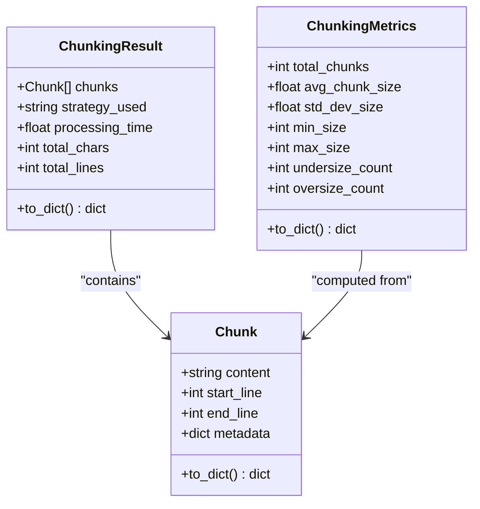

# Integration Guides

<cite>
**Referenced Files in This Document**
- [README.md](file://README.md)
- [MIGRATION_GUIDE.md](file://MIGRATION_GUIDE.md)
- [docs/migration/parity_matrix.md](file://docs/migration/parity_matrix.md)
- [docs/integrations/dify.md](file://docs/integrations/dify.md)
- [docs/integrations/n8n.md](file://docs/integrations/n8n.md)
- [docs/integrations/windmill.md](file://docs/integrations/windmill.md)
- [src/chunkana/api.py](file://src/chunkana/api.py)
- [src/chunkana/renderers/formatters.py](file://src/chunkana/renderers/formatters.py)
- [src/chunkana/config.py](file://src/chunkana/config.py)
- [src/chunkana/types.py](file://src/chunkana/types.py)
- [src/chunkana/streaming/streaming_chunker.py](file://src/chunkana/streaming/streaming_chunker.py)
- [tests/baseline/plugin_tool_params.json](file://tests/baseline/plugin_tool_params.json)
- [tests/baseline/golden_dify_style/code_context.jsonl](file://tests/baseline/golden_dify_style/code_context.jsonl)
</cite>

## Table of Contents
1. [Introduction](#introduction)
2. [Project Structure](#project-structure)
3. [Core Components](#core-components)
4. [Architecture Overview](#architecture-overview)
5. [Detailed Component Analysis](#detailed-component-analysis)
6. [Dependency Analysis](#dependency-analysis)
7. [Performance Considerations](#performance-considerations)
8. [Troubleshooting Guide](#troubleshooting-guide)
9. [Conclusion](#conclusion)
10. [Appendices](#appendices)

## Introduction
This document provides end-to-end integration guides for connecting Chunkana with three external platforms: Dify, n8n, and Windmill. Each guide includes step-by-step setup, configuration, data flow, authentication, error handling, monitoring, and troubleshooting tailored to each platform’s constraints and expectations. It also highlights how Chunkana’s specialized renderers ensure seamless compatibility across platforms.

## Project Structure
Chunkana exposes a simple public API for chunking Markdown and rendering outputs in multiple formats. Integrations primarily use:
- Public convenience functions for chunking and hierarchical chunking
- Renderers for platform-specific output formats
- Configuration classes for tuning chunk size, overlap, strategies, and advanced features
- Streaming chunker for large files

**Diagram sources**
- [src/chunkana/api.py](file://src/chunkana/api.py#L18-L305)
- [src/chunkana/renderers/formatters.py](file://src/chunkana/renderers/formatters.py#L1-L146)
- [src/chunkana/config.py](file://src/chunkana/config.py#L1-L507)
- [src/chunkana/streaming/streaming_chunker.py](file://src/chunkana/streaming/streaming_chunker.py#L1-L99)

**Section sources**
- [README.md](file://README.md#L1-L179)
- [src/chunkana/api.py](file://src/chunkana/api.py#L18-L305)
- [src/chunkana/renderers/formatters.py](file://src/chunkana/renderers/formatters.py#L1-L146)
- [src/chunkana/config.py](file://src/chunkana/config.py#L1-L507)
- [src/chunkana/streaming/streaming_chunker.py](file://src/chunkana/streaming/streaming_chunker.py#L1-L99)

## Core Components
- Public API functions:
  - chunk_markdown: primary entry point returning a list of chunks
  - chunk_hierarchical: hierarchical chunking with navigation
  - chunk_file/chunk_file_streaming: file-based chunking with streaming support
- Renderers:
  - render_dify_style: Dify-compatible format with metadata blocks
  - render_json: JSON dicts per chunk
  - render_with_embedded_overlap/render_with_prev_overlap: overlap embedding variants
- Configuration:
  - ChunkerConfig: size, overlap, strategy, code-context binding, LaTeX/table handling, adaptive sizing, and hierarchical options
- Streaming:
  - StreamingChunker: memory-efficient processing for large files

**Section sources**
- [src/chunkana/api.py](file://src/chunkana/api.py#L18-L305)
- [src/chunkana/renderers/formatters.py](file://src/chunkana/renderers/formatters.py#L1-L146)
- [src/chunkana/config.py](file://src/chunkana/config.py#L1-L507)
- [src/chunkana/streaming/streaming_chunker.py](file://src/chunkana/streaming/streaming_chunker.py#L1-L99)

## Architecture Overview
The integration architecture centers on transforming Markdown input into platform-ready outputs via Chunkana’s chunking and rendering pipeline. Platform-specific adapters translate tool parameters and runtime inputs into Chunkana’s configuration and renderer selection.

**Diagram sources**
- [src/chunkana/api.py](file://src/chunkana/api.py#L18-L305)
- [src/chunkana/renderers/formatters.py](file://src/chunkana/renderers/formatters.py#L1-L146)

## Detailed Component Analysis

### Dify Integration
This guide adapts Dify plugin parameters to Chunkana’s API and renderers, ensuring parity with the original plugin’s behavior.

- Setup and migration
  - Install Chunkana in your Dify environment
  - Replace plugin calls with chunk_markdown and render_dify_style or render_with_embedded_overlap
  - Use ChunkerConfig for size, overlap, and strategy overrides
- Parameter mapping
  - input_text → chunk_markdown(text)
  - max_chunk_size → ChunkerConfig.max_chunk_size
  - chunk_overlap → ChunkerConfig.overlap_size
  - strategy → ChunkerConfig.strategy_override (None = auto)
  - include_metadata → renderer selection (render_dify_style vs render_with_embedded_overlap)
  - enable_hierarchy → chunk_hierarchical(text)
  - debug → HierarchicalChunkingResult.get_all_chunks() vs get_flat_chunks()
- Data flow
  - Input: Markdown text
  - Process: chunk_markdown(text, config)
  - Output: render_dify_style(chunks) for metadata-included format
- Authentication and secrets
  - Dify adapters typically run in managed environments; store secrets in Dify’s secret store and pass via node parameters
- Error handling
  - Catch exceptions and return structured error messages to Dify
  - Use strict_mode in hierarchical chunking for validation in development
- Monitoring
  - Log chunk count, average size, and strategy used
  - Track processing time via chunk_with_analysis or chunk_with_metrics
- Troubleshooting
  - If metadata fields differ, verify renderer selection and ensure metadata is included via render_dify_style
  - For hierarchical mismatches, confirm strict_mode and validate_invariants settings

**Diagram sources**
- [docs/integrations/dify.md](file://docs/integrations/dify.md#L1-L126)
- [src/chunkana/api.py](file://src/chunkana/api.py#L18-L116)
- [src/chunkana/renderers/formatters.py](file://src/chunkana/renderers/formatters.py#L56-L84)

**Section sources**
- [docs/integrations/dify.md](file://docs/integrations/dify.md#L1-L126)
- [MIGRATION_GUIDE.md](file://MIGRATION_GUIDE.md#L110-L174)
- [docs/migration/parity_matrix.md](file://docs/migration/parity_matrix.md#L37-L51)
- [tests/baseline/plugin_tool_params.json](file://tests/baseline/plugin_tool_params.json#L1-L54)
- [tests/baseline/golden_dify_style/code_context.jsonl](file://tests/baseline/golden_dify_style/code_context.jsonl#L1-L2)

### n8n Integration
This guide focuses on integrating Chunkana into n8n workflows using Python code nodes.

- Setup
  - Install Chunkana in the n8n Python environment
- Basic usage
  - Iterate over items, chunk each text, and render to JSON
- Configuration
  - Use ChunkerConfig to tune chunk size and overlap
- Output format
  - render_json produces a list of dicts with content, line ranges, and metadata
- Streaming large documents
  - Use MarkdownChunker and chunk_file_streaming for memory efficiency
- Authentication and secrets
  - Store credentials in n8n’s credential store and pass via node parameters
- Error handling
  - Validate inputs and wrap chunk_markdown in try/catch
- Monitoring
  - Track chunk_count and strategy per item
- Troubleshooting
  - If outputs are unexpected, verify renderer selection and ensure metadata inclusion when needed

**Diagram sources**
- [docs/integrations/n8n.md](file://docs/integrations/n8n.md#L1-L101)
- [src/chunkana/api.py](file://src/chunkana/api.py#L18-L116)
- [src/chunkana/renderers/formatters.py](file://src/chunkana/renderers/formatters.py#L15-L27)

**Section sources**
- [docs/integrations/n8n.md](file://docs/integrations/n8n.md#L1-L101)
- [src/chunkana/renderers/formatters.py](file://src/chunkana/renderers/formatters.py#L15-L27)
- [src/chunkana/types.py](file://src/chunkana/types.py#L240-L375)

### Windmill Integration
This guide shows how to integrate Chunkana into Windmill scripts for both simple and hierarchical chunking.

- Setup
  - Add chunkana to script dependencies
- Basic script
  - Process a single text input and return JSON chunks
- With configuration
  - Expose max_chunk_size and overlap_size as script parameters
- Processing files
  - Use MarkdownChunker.chunk for file content
- Hierarchical output
  - Return tree and flat chunks for navigation
- Error handling
  - Validate inputs and catch exceptions to return structured error messages
- Monitoring
  - Include strategy and total_chunks in metadata
- Troubleshooting
  - Confirm renderer selection and chunker configuration

**Diagram sources**
- [docs/integrations/windmill.md](file://docs/integrations/windmill.md#L1-L124)
- [src/chunkana/api.py](file://src/chunkana/api.py#L18-L116)
- [src/chunkana/renderers/formatters.py](file://src/chunkana/renderers/formatters.py#L15-L27)

**Section sources**
- [docs/integrations/windmill.md](file://docs/integrations/windmill.md#L1-L124)
- [src/chunkana/renderers/formatters.py](file://src/chunkana/renderers/formatters.py#L15-L27)

## Dependency Analysis
Chunkana’s integration surface is intentionally thin and focused:
- Public API depends on MarkdownChunker and configuration
- Renderers depend on Chunk objects and produce platform-specific views
- StreamingChunker composes MarkdownChunker with buffer/window processing
- Tests and parity matrices define expected behavior and parameter mappings

**Diagram sources**
- [src/chunkana/api.py](file://src/chunkana/api.py#L18-L305)
- [src/chunkana/renderers/formatters.py](file://src/chunkana/renderers/formatters.py#L1-L146)
- [src/chunkana/config.py](file://src/chunkana/config.py#L1-L507)
- [src/chunkana/streaming/streaming_chunker.py](file://src/chunkana/streaming/streaming_chunker.py#L1-L99)
- [src/chunkana/types.py](file://src/chunkana/types.py#L240-L375)

**Section sources**
- [src/chunkana/api.py](file://src/chunkana/api.py#L18-L305)
- [src/chunkana/renderers/formatters.py](file://src/chunkana/renderers/formatters.py#L1-L146)
- [src/chunkana/config.py](file://src/chunkana/config.py#L1-L507)
- [src/chunkana/streaming/streaming_chunker.py](file://src/chunkana/streaming/streaming_chunker.py#L1-L99)
- [src/chunkana/types.py](file://src/chunkana/types.py#L240-L375)

## Performance Considerations
- Use chunk_with_analysis or chunk_with_metrics to monitor chunk size distribution and strategy usage
- For large files, prefer chunk_file_streaming to reduce memory footprint
- Tune overlap_size and max_chunk_size to balance retrieval quality and cost
- Consider enabling adaptive sizing for content-aware chunk boundaries

[No sources needed since this section provides general guidance]

## Troubleshooting Guide
Common issues and resolutions:
- Return type mismatch
  - Chunkana always returns List[Chunk]; use renderers to produce strings or dicts
- include_metadata parameter
  - Use render_dify_style for metadata-included format; render_with_embedded_overlap for embedded overlap
- Strategy parameter
  - Use strategy_override=None for auto-selection
- Overlap parameter naming
  - Tool uses chunk_overlap; config uses overlap_size
- Hierarchical validation
  - In strict_mode, exceptions are raised; in non-strict mode, violations are auto-fixed
- Streaming differences
  - Streaming chunk boundaries may differ at buffer splits; treat as expected behavior

**Section sources**
- [docs/integrations/dify.md](file://docs/integrations/dify.md#L105-L126)
- [MIGRATION_GUIDE.md](file://MIGRATION_GUIDE.md#L33-L74)
- [docs/migration/parity_matrix.md](file://docs/migration/parity_matrix.md#L37-L51)
- [src/chunkana/config.py](file://src/chunkana/config.py#L138-L229)

## Conclusion
Chunkana’s specialized renderers and clean API make it straightforward to integrate with Dify, n8n, and Windmill. By aligning platform parameters with ChunkerConfig and selecting the appropriate renderer, you can achieve parity with existing plugins while gaining access to advanced features like hierarchical chunking, streaming, and adaptive sizing.

[No sources needed since this section summarizes without analyzing specific files]

## Appendices

### Renderer Selection Decision Tree
- Dify plugin equivalent:
  - include_metadata=True → render_dify_style
  - include_metadata=False → render_with_embedded_overlap
- Other platforms:
  - JSON/dict output → render_json
  - Bidirectional context → render_with_embedded_overlap
  - Sliding window → render_with_prev_overlap

**Section sources**
- [MIGRATION_GUIDE.md](file://MIGRATION_GUIDE.md#L163-L174)
- [src/chunkana/renderers/formatters.py](file://src/chunkana/renderers/formatters.py#L15-L146)

### Configuration Reference
Key configuration fields and defaults:
- max_chunk_size, min_chunk_size, overlap_size
- preserve_atomic_blocks, extract_preamble
- code_threshold, structure_threshold, list_ratio_threshold, list_count_threshold
- strategy_override
- enable_code_context_binding, max_context_chars_before, max_context_chars_after, related_block_max_gap, bind_output_blocks, preserve_before_after_pairs
- use_adaptive_sizing, adaptive_config
- include_document_summary, validate_invariants, strict_mode
- strip_obsidian_block_ids
- preserve_latex_blocks, latex_display_only, latex_max_context_chars
- group_related_tables, table_grouping_config
- overlap_cap_ratio

**Section sources**
- [src/chunkana/config.py](file://src/chunkana/config.py#L17-L123)
- [src/chunkana/config.py](file://src/chunkana/config.py#L408-L449)

### Data Model for Chunks
Chunk objects include content, line ranges, and metadata fields such as chunk_index, content_type, header_path, strategy, and overlap metadata.

**Diagram sources**
- [src/chunkana/types.py](file://src/chunkana/types.py#L240-L375)
- [src/chunkana/types.py](file://src/chunkana/types.py#L377-L478)