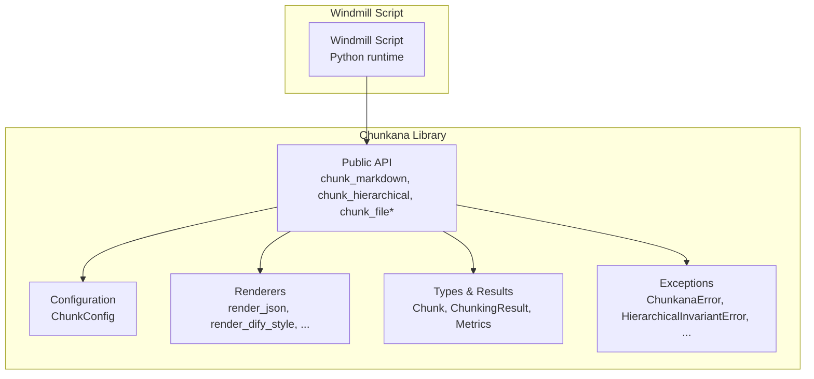
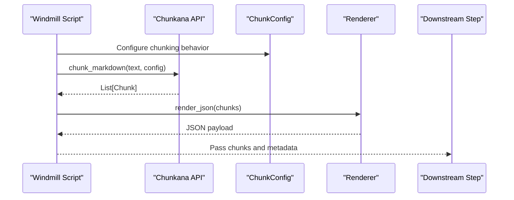
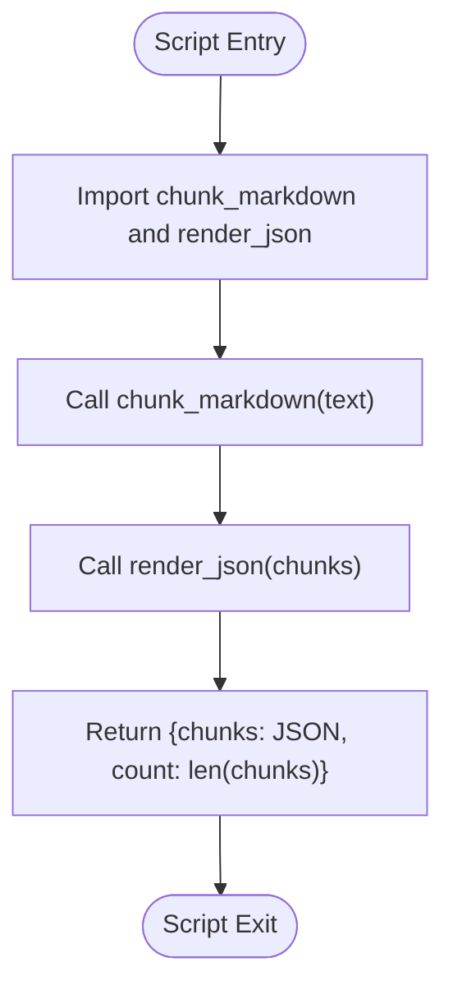
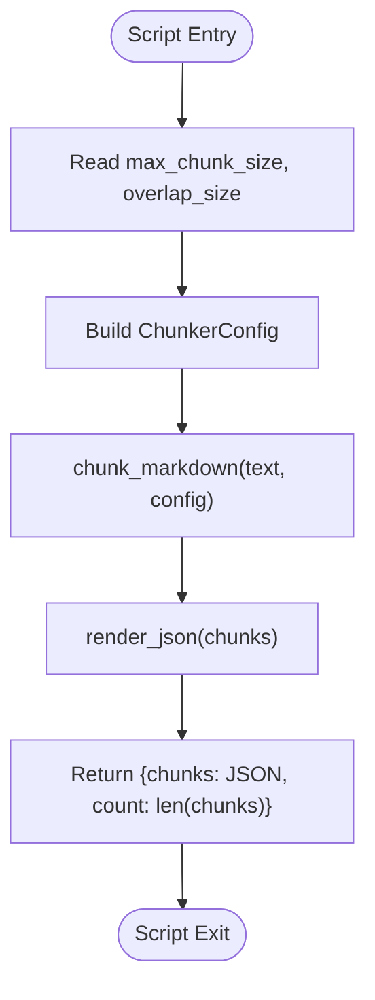
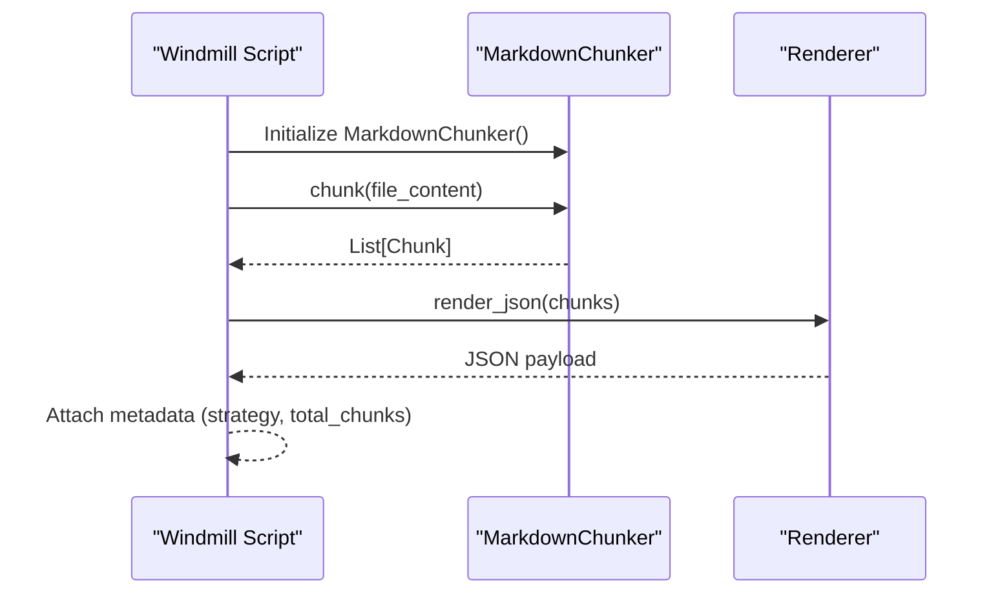
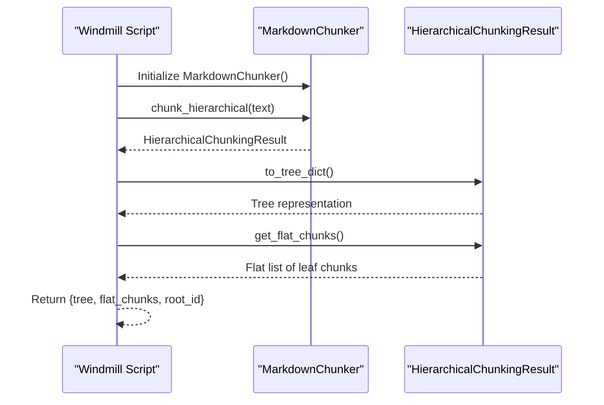
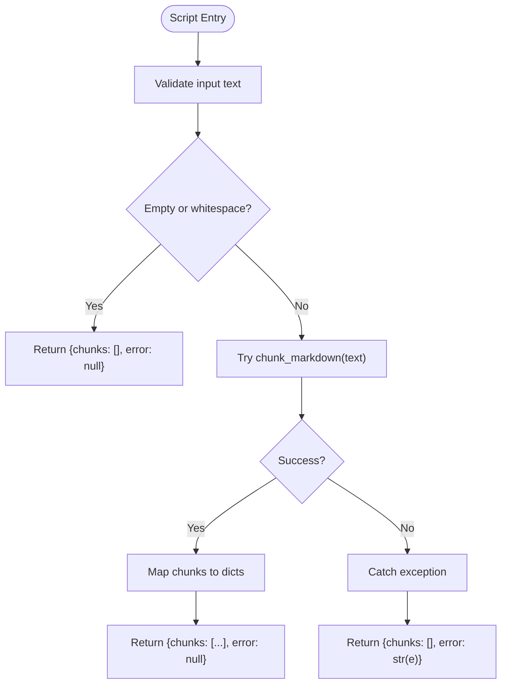
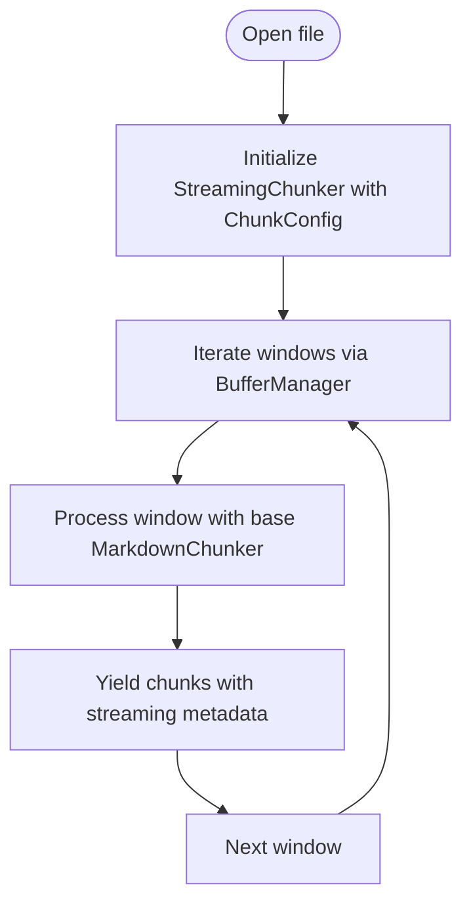
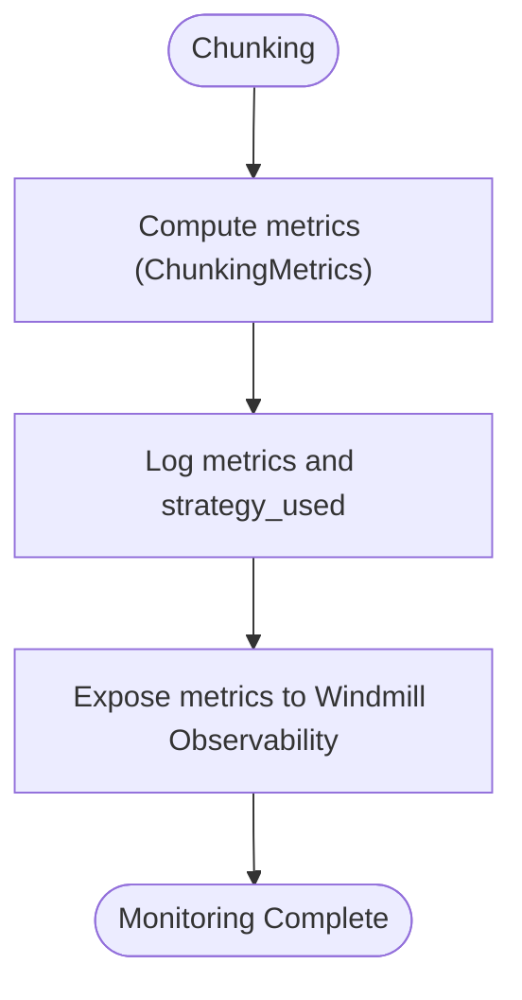
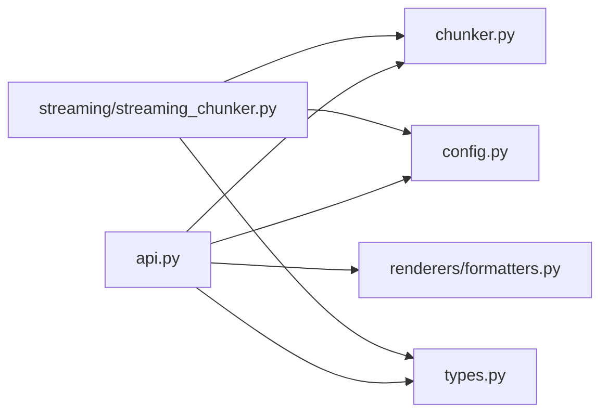

# Windmill Integration

<cite>
**Referenced Files in This Document**
- [README.md](file://README.md)
- [docs/integrations/windmill.md](file://docs/integrations/windmill.md)
- [src/chunkana/__init__.py](file://src/chunkana/__init__.py)
- [src/chunkana/api.py](file://src/chunkana/api.py)
- [src/chunkana/config.py](file://src/chunkana/config.py)
- [src/chunkana/renderers/formatters.py](file://src/chunkana/renderers/formatters.py)
- [src/chunkana/types.py](file://src/chunkana/types.py)
- [src/chunkana/exceptions.py](file://src/chunkana/exceptions.py)
- [src/chunkana/streaming/streaming_chunker.py](file://src/chunkana/streaming/streaming_chunker.py)
- [pyproject.toml](file://pyproject.toml)
</cite>

## Table of Contents
1. [Introduction](#introduction)
2. [Project Structure](#project-structure)
3. [Core Components](#core-components)
4. [Architecture Overview](#architecture-overview)
5. [Detailed Component Analysis](#detailed-component-analysis)
6. [Dependency Analysis](#dependency-analysis)
7. [Performance Considerations](#performance-considerations)
8. [Troubleshooting Guide](#troubleshooting-guide)
9. [Conclusion](#conclusion)
10. [Appendices](#appendices)

## Introduction
This document explains how to deploy Chunkana as a script or module within Windmill’s automation platform for document processing workflows. It provides step-by-step setup instructions for installing Chunkana in Windmill’s execution environment, outlines dependency management and version pinning, and demonstrates how to call Chunkana’s API from Windmill scripts. It also documents configuration strategies for optimizing chunking behavior for knowledge base ingestion and document analysis, and addresses security considerations, monitoring, and logging within Windmill’s observability framework.

## Project Structure
Chunkana exposes a focused public API and a set of renderers and configuration classes suitable for integration into external platforms like Windmill. The Windmill integration guide in the repository provides example scripts and patterns for invoking Chunkana from Windmill.

**Diagram sources**
- [docs/integrations/windmill.md](file://docs/integrations/windmill.md#L1-L124)
- [src/chunkana/api.py](file://src/chunkana/api.py#L1-L305)
- [src/chunkana/config.py](file://src/chunkana/config.py#L1-L507)
- [src/chunkana/renderers/formatters.py](file://src/chunkana/renderers/formatters.py#L1-L146)
- [src/chunkana/types.py](file://src/chunkana/types.py#L1-L478)
- [src/chunkana/exceptions.py](file://src/chunkana/exceptions.py#L1-L248)

**Section sources**
- [docs/integrations/windmill.md](file://docs/integrations/windmill.md#L1-L124)
- [src/chunkana/__init__.py](file://src/chunkana/__init__.py#L1-L116)

## Core Components
- Public API: chunk_markdown, chunk_hierarchical, chunk_file, chunk_file_streaming, analyze_markdown, chunk_with_analysis, chunk_with_metrics, iter_chunks.
- Configuration: ChunkConfig (alias ChunkerConfig) with simplified parameters and factory methods for common profiles.
- Renderers: render_json, render_dify_style, render_with_embedded_overlap, render_with_prev_overlap, render_inline_metadata.
- Types and results: Chunk, ChunkingResult, ChunkingMetrics, ContentAnalysis.
- Exceptions: ChunkanaError, HierarchicalInvariantError, ValidationError, ConfigurationError, TreeConstructionError.

Key integration points for Windmill:
- Use chunk_markdown for basic chunking and render_json for JSON output.
- Use chunk_hierarchical for tree navigation and Dify-compatible rendering via render_dify_style.
- Use chunk_file_streaming for large files to keep memory usage low.
- Use ChunkConfig factory methods (e.g., for_code_heavy, for_structured) to optimize behavior for typical Windmill use cases.

**Section sources**
- [src/chunkana/api.py](file://src/chunkana/api.py#L1-L305)
- [src/chunkana/config.py](file://src/chunkana/config.py#L1-L507)
- [src/chunkana/renderers/formatters.py](file://src/chunkana/renderers/formatters.py#L1-L146)
- [src/chunkana/types.py](file://src/chunkana/types.py#L1-L478)
- [src/chunkana/exceptions.py](file://src/chunkana/exceptions.py#L1-L248)

## Architecture Overview
The Windmill integration follows a straightforward flow: a Windmill script invokes Chunkana’s public API, receives structured chunks, and passes them to downstream steps. For hierarchical workflows, the script can build a tree and expose flat chunks or tree metadata.

**Diagram sources**
- [docs/integrations/windmill.md](file://docs/integrations/windmill.md#L1-L124)
- [src/chunkana/api.py](file://src/chunkana/api.py#L1-L305)
- [src/chunkana/renderers/formatters.py](file://src/chunkana/renderers/formatters.py#L1-L146)

## Detailed Component Analysis

### Windmill Setup and Dependencies
- Add chunkana to your script dependencies using the requirements notation shown in the Windmill integration guide.
- Install the package in Windmill’s execution environment. The repository’s project metadata indicates Python 3.12 as the minimum runtime, so ensure your Windmill environment aligns with this requirement.

Step-by-step:
1. Declare chunkana in your script’s dependency list as shown in the integration guide.
2. Verify the Python runtime version in your Windmill environment matches the library’s requirement.
3. Run the script; Windmill will resolve and install the declared dependency.

Version pinning:
- Pin to a specific release tag or commit hash in your Windmill environment to ensure reproducibility across runs.

Security note:
- Windmill executes scripts in a sandboxed environment. Still, validate inputs and sanitize outputs before passing to downstream steps to prevent injection or unexpected data formats.

**Section sources**
- [docs/integrations/windmill.md](file://docs/integrations/windmill.md#L1-L31)
- [pyproject.toml](file://pyproject.toml#L1-L94)

### Basic Script Pattern
- Import chunk_markdown and render_json.
- Define a main function that accepts the Markdown text input.
- Chunk the text and return a dictionary with chunks (JSON) and a count.

**Diagram sources**
- [docs/integrations/windmill.md](file://docs/integrations/windmill.md#L14-L31)

**Section sources**
- [docs/integrations/windmill.md](file://docs/integrations/windmill.md#L14-L31)

### Configurable Script Pattern
- Accept parameters for max_chunk_size and overlap_size.
- Construct ChunkerConfig and pass it to chunk_markdown.
- Render JSON and return metadata alongside chunks.

**Diagram sources**
- [docs/integrations/windmill.md](file://docs/integrations/windmill.md#L32-L57)

**Section sources**
- [docs/integrations/windmill.md](file://docs/integrations/windmill.md#L32-L57)

### File-Based Processing
- Use MarkdownChunker to chunk preloaded file content.
- Return metadata such as strategy and total_chunks.

**Diagram sources**
- [docs/integrations/windmill.md](file://docs/integrations/windmill.md#L59-L79)

**Section sources**
- [docs/integrations/windmill.md](file://docs/integrations/windmill.md#L59-L79)

### Hierarchical Output
- Use chunk_hierarchical to build a tree result.
- Expose tree structure and flat chunks for downstream navigation.

**Diagram sources**
- [docs/integrations/windmill.md](file://docs/integrations/windmill.md#L81-L98)

**Section sources**
- [docs/integrations/windmill.md](file://docs/integrations/windmill.md#L81-L98)

### Error Handling
- Validate inputs early (e.g., empty or whitespace-only text).
- Wrap chunk_markdown in a try-except block and return structured error information.

**Diagram sources**
- [docs/integrations/windmill.md](file://docs/integrations/windmill.md#L100-L124)

**Section sources**
- [docs/integrations/windmill.md](file://docs/integrations/windmill.md#L100-L124)

### Configuration Strategies for Windmill Use Cases
- Knowledge base ingestion:
  - Prefer structural chunking with headers to support hierarchical retrieval.
  - Use ChunkConfig.for_structured or tuned thresholds to emphasize header-driven segmentation.
- Code repositories:
  - Use ChunkConfig.for_code_heavy or ChunkConfig.with_adaptive_sizing to handle larger chunks and code-context binding.
- Changelogs/release notes:
  - Tune list_ratio_threshold and list_count_threshold to capture list-heavy content effectively.
- Scientific documents with LaTeX:
  - Preserve LaTeX blocks and adjust max_chunk_size accordingly.

Factory methods and thresholds:
- ChunkConfig.default, for_code_heavy, for_structured, minimal, for_changelogs, with_adaptive_sizing, for_code_heavy_adaptive, for_text_heavy_adaptive.
- Strategy selection thresholds: code_threshold, structure_threshold, list_ratio_threshold, list_count_threshold.
- Overlap behavior: overlap_size and overlap_cap_ratio.

Renderer selection:
- render_dify_style for Dify-compatible metadata.
- render_json for JSON API outputs.
- render_with_embedded_overlap for bidirectional context.
- render_with_prev_overlap for sliding window context.

**Section sources**
- [src/chunkana/config.py](file://src/chunkana/config.py#L1-L507)
- [docs/config.md](file://docs/config.md#L1-L172)
- [docs/strategies.md](file://docs/strategies.md#L1-L82)
- [docs/renderers.md](file://docs/renderers.md#L1-L136)
- [src/chunkana/renderers/formatters.py](file://src/chunkana/renderers/formatters.py#L1-L146)

### Streaming Large Files
- For files larger than 10 MB, use chunk_file_streaming to process incrementally and reduce memory usage.
- StreamingChunker reads the file in windows, yields chunks with streaming metadata.

**Diagram sources**
- [src/chunkana/streaming/streaming_chunker.py](file://src/chunkana/streaming/streaming_chunker.py#L1-L99)
- [src/chunkana/api.py](file://src/chunkana/api.py#L228-L271)

**Section sources**
- [src/chunkana/streaming/streaming_chunker.py](file://src/chunkana/streaming/streaming_chunker.py#L1-L99)
- [src/chunkana/api.py](file://src/chunkana/api.py#L228-L271)

### Security Considerations
- Input validation:
  - Validate and sanitize text inputs before chunking. Reject empty or whitespace-only inputs early.
  - Validate configuration parameters to avoid invalid ranges or thresholds.
- Output sanitization:
  - When passing chunks to downstream steps, ensure metadata and content are serialized safely.
  - Avoid embedding raw user-provided content into executable contexts.
- Least privilege:
  - Run scripts with minimal required permissions in Windmill.
- Secrets handling:
  - Do not log sensitive data. Mask or redact secrets in logs.

**Section sources**
- [docs/integrations/windmill.md](file://docs/integrations/windmill.md#L100-L124)
- [src/chunkana/config.py](file://src/chunkana/config.py#L127-L229)

### Monitoring and Logging
- Use ChunkingMetrics to compute statistics (average size, undersize/oversize counts) for monitoring.
- Log strategy_used and processing_time from chunk_with_analysis or ChunkingResult for observability.
- For streaming, track stream_chunk_index, stream_window_index, and bytes_processed to monitor progress.

**Diagram sources**
- [src/chunkana/api.py](file://src/chunkana/api.py#L106-L136)
- [src/chunkana/types.py](file://src/chunkana/types.py#L377-L478)

**Section sources**
- [src/chunkana/api.py](file://src/chunkana/api.py#L106-L136)
- [src/chunkana/types.py](file://src/chunkana/types.py#L377-L478)

## Dependency Analysis
Chunkana’s public API is thin and composes MarkdownChunker, configuration, and renderers. There are no explicit runtime dependencies declared in the project metadata, which simplifies installation in Windmill’s environment.

**Diagram sources**
- [src/chunkana/api.py](file://src/chunkana/api.py#L1-L305)
- [src/chunkana/streaming/streaming_chunker.py](file://src/chunkana/streaming/streaming_chunker.py#L1-L99)
- [src/chunkana/renderers/formatters.py](file://src/chunkana/renderers/formatters.py#L1-L146)
- [src/chunkana/config.py](file://src/chunkana/config.py#L1-L507)
- [src/chunkana/types.py](file://src/chunkana/types.py#L1-L478)

**Section sources**
- [pyproject.toml](file://pyproject.toml#L1-L94)
- [src/chunkana/__init__.py](file://src/chunkana/__init__.py#L1-L116)

## Performance Considerations
- Prefer streaming for large files to avoid memory spikes.
- Adjust max_chunk_size and overlap_size to balance retrieval quality and cost.
- Use adaptive sizing for variable-content documents to stabilize chunk sizes.
- Avoid excessive overlap if downstream steps do not require it.

[No sources needed since this section provides general guidance]

## Troubleshooting Guide
Common issues and resolutions:
- Empty or whitespace-only input:
  - Early-validate and return empty chunks gracefully.
- Configuration errors:
  - Ensure overlap_size is less than max_chunk_size and thresholds are within valid ranges.
- Hierarchical invariant violations:
  - Review strict_mode and validate_invariants settings; adjust content or thresholds.
- Streaming progress:
  - Track stream_chunk_index and stream_window_index to confirm progress.

**Section sources**
- [docs/integrations/windmill.md](file://docs/integrations/windmill.md#L100-L124)
- [src/chunkana/config.py](file://src/chunkana/config.py#L127-L229)
- [src/chunkana/exceptions.py](file://src/chunkana/exceptions.py#L1-L248)
- [src/chunkana/streaming/streaming_chunker.py](file://src/chunkana/streaming/streaming_chunker.py#L1-L99)

## Conclusion
Chunkana integrates cleanly into Windmill workflows. Use the provided API patterns to chunk Markdown content, configure behavior for your use case, and render outputs suitable for downstream steps. Apply streaming for large files, monitor metrics, and follow security best practices to ensure robust, observable, and secure document processing pipelines.

[No sources needed since this section summarizes without analyzing specific files]

## Appendices

### Quick Reference: Public API and Renderers
- chunk_markdown, chunk_hierarchical, chunk_file, chunk_file_streaming, analyze_markdown, chunk_with_analysis, chunk_with_metrics, iter_chunks.
- render_json, render_dify_style, render_with_embedded_overlap, render_with_prev_overlap, render_inline_metadata.
- Chunk, ChunkingResult, ChunkingMetrics, ContentAnalysis.
- ChunkanaError, HierarchicalInvariantError, ValidationError, ConfigurationError, TreeConstructionError.

**Section sources**
- [src/chunkana/api.py](file://src/chunkana/api.py#L1-L305)
- [src/chunkana/renderers/formatters.py](file://src/chunkana/renderers/formatters.py#L1-L146)
- [src/chunkana/types.py](file://src/chunkana/types.py#L1-L478)
- [src/chunkana/exceptions.py](file://src/chunkana/exceptions.py#L1-L248)