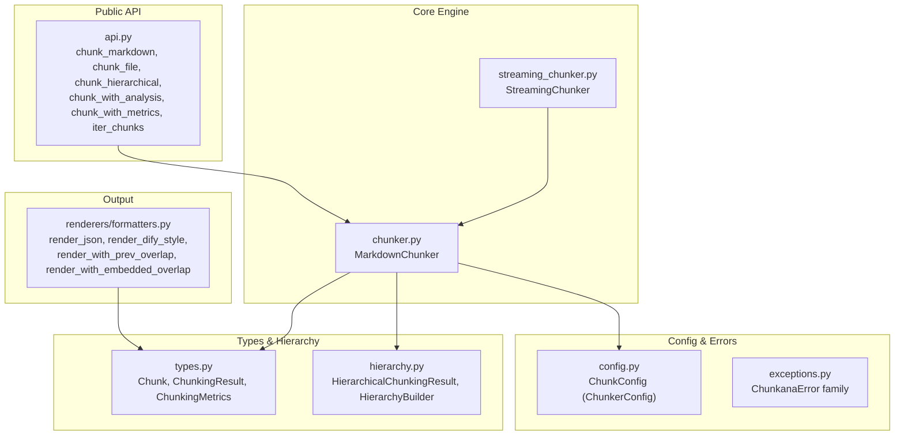
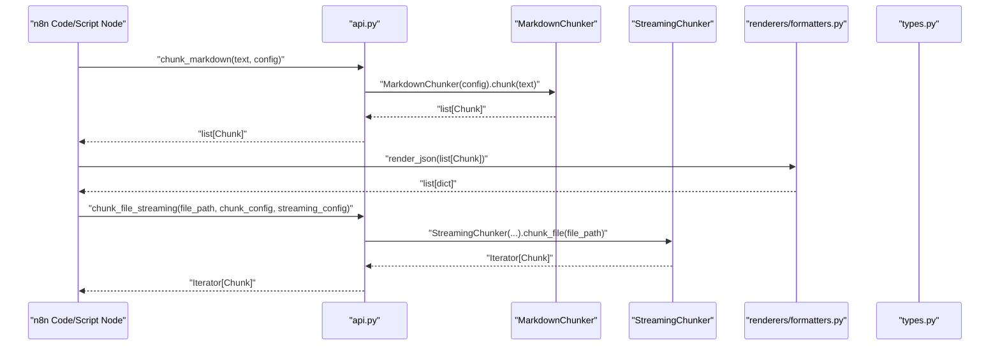
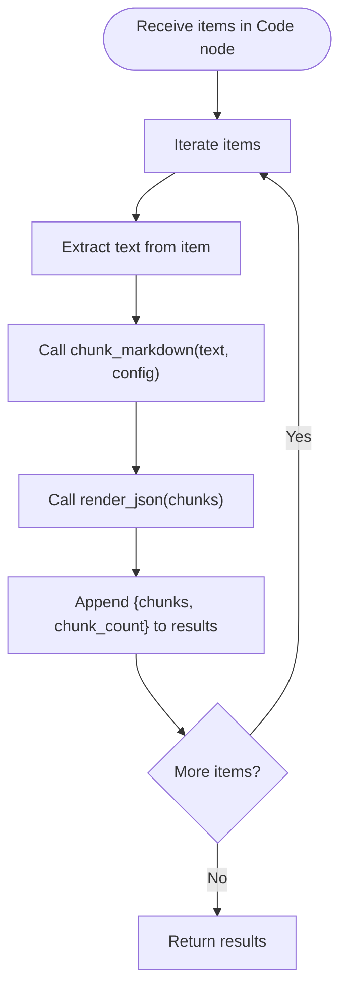
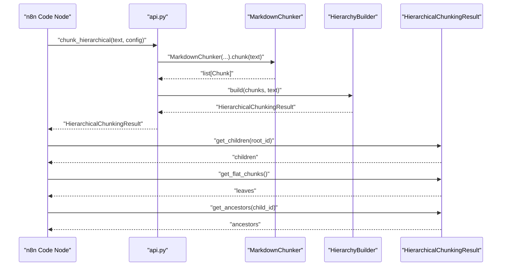
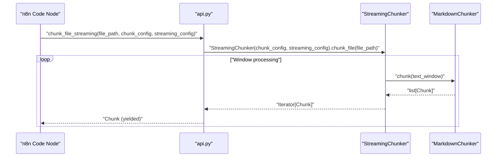
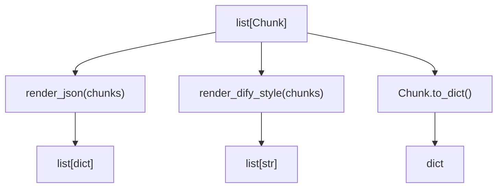
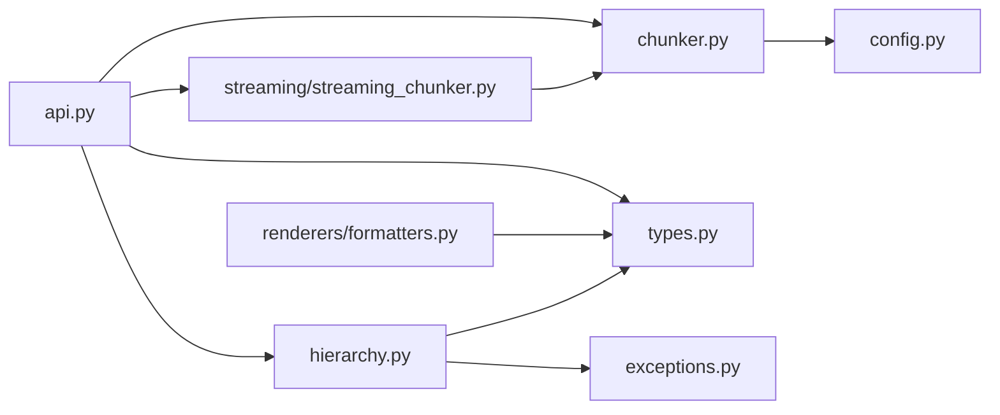

# n8n Integration

<cite>
**Referenced Files in This Document**
- [README.md](file://README.md)
- [docs/integrations/n8n.md](file://docs/integrations/n8n.md)
- [src/chunkana/__init__.py](file://src/chunkana/__init__.py)
- [src/chunkana/api.py](file://src/chunkana/api.py)
- [src/chunkana/chunker.py](file://src/chunkana/chunker.py)
- [src/chunkana/streaming/streaming_chunker.py](file://src/chunkana/streaming/streaming_chunker.py)
- [src/chunkana/renderers/formatters.py](file://src/chunkana/renderers/formatters.py)
- [src/chunkana/types.py](file://src/chunkana/types.py)
- [src/chunkana/hierarchy.py](file://src/chunkana/hierarchy.py)
- [src/chunkana/config.py](file://src/chunkana/config.py)
- [src/chunkana/exceptions.py](file://src/chunkana/exceptions.py)
</cite>

## Table of Contents
1. [Introduction](#introduction)
2. [Project Structure](#project-structure)
3. [Core Components](#core-components)
4. [Architecture Overview](#architecture-overview)
5. [Detailed Component Analysis](#detailed-component-analysis)
6. [Dependency Analysis](#dependency-analysis)
7. [Performance Considerations](#performance-considerations)
8. [Troubleshooting Guide](#troubleshooting-guide)
9. [Conclusion](#conclusion)
10. [Appendices](#appendices)

## Introduction
This document explains how to integrate Chunkana into n8n workflows to preprocess Markdown documentation for AI pipelines. It focuses on invoking Chunkana from JavaScript/Python within n8n Code nodes and Script nodes, processing Markdown content, routing chunked output to downstream nodes, and configuring Chunkana for compatibility with n8n’s data handling. It also covers asynchronous processing patterns for large documents, hierarchical chunking traversal and filtering, and troubleshooting common issues such as memory limits, timeouts, and data type mismatches.

## Project Structure
Chunkana exposes a focused public API with convenience functions, a main chunker class, streaming chunker, renderers, hierarchical chunking, configuration, and exception types. For n8n integration, the most relevant entry points are:
- Convenience functions for chunking and analysis
- The main chunker class for advanced scenarios
- Streaming chunker for large files
- Renderers for JSON and Dify-compatible outputs
- Hierarchical chunking result with navigation helpers

**Diagram sources**
- [src/chunkana/api.py](file://src/chunkana/api.py#L1-L305)
- [src/chunkana/chunker.py](file://src/chunkana/chunker.py#L1-L300)
- [src/chunkana/streaming/streaming_chunker.py](file://src/chunkana/streaming/streaming_chunker.py#L1-L99)
- [src/chunkana/renderers/formatters.py](file://src/chunkana/renderers/formatters.py#L1-L146)
- [src/chunkana/types.py](file://src/chunkana/types.py#L240-L375)
- [src/chunkana/hierarchy.py](file://src/chunkana/hierarchy.py#L1-L200)
- [src/chunkana/config.py](file://src/chunkana/config.py#L1-L120)
- [src/chunkana/exceptions.py](file://src/chunkana/exceptions.py#L1-L120)

**Section sources**
- [src/chunkana/__init__.py](file://src/chunkana/__init__.py#L1-L116)
- [docs/integrations/n8n.md](file://docs/integrations/n8n.md#L1-L101)

## Core Components
- Public API functions:
  - chunk_markdown: Primary convenience function returning a list of chunks.
  - chunk_file: Reads a file and chunks its content.
  - chunk_hierarchical: Returns a hierarchical result with navigation methods.
  - chunk_with_analysis and chunk_with_metrics: Return enriched results with analysis/metrics.
  - iter_chunks: Incremental iterator for memory efficiency.
- Main chunker:
  - MarkdownChunker: Orchestrates parsing, strategy selection, overlap, validation, and metadata enrichment.
- Streaming:
  - StreamingChunker: Processes large files in windows to limit memory usage.
- Renderers:
  - render_json: Converts chunks to a list of dictionaries for JSON serialization.
  - render_dify_style: Formats chunks for Dify-compatible metadata blocks.
  - render_with_prev_overlap and render_with_embedded_overlap: Views for contextual embedding.
- Types:
  - Chunk: Core data structure with content, line ranges, and metadata.
  - ChunkingResult and ChunkingMetrics: Structured results and statistics.
- Hierarchy:
  - HierarchicalChunkingResult: Navigation helpers (get_children, get_parent, get_ancestors, get_flat_chunks).
  - HierarchyBuilder: Builds parent-child relationships from flat chunks.
- Config:
  - ChunkConfig (alias ChunkerConfig): Centralized configuration with sensible defaults and validation.
- Exceptions:
  - ChunkanaError, HierarchicalInvariantError, ValidationError, ConfigurationError, TreeConstructionError.

**Section sources**
- [src/chunkana/api.py](file://src/chunkana/api.py#L18-L305)
- [src/chunkana/chunker.py](file://src/chunkana/chunker.py#L85-L274)
- [src/chunkana/streaming/streaming_chunker.py](file://src/chunkana/streaming/streaming_chunker.py#L18-L99)
- [src/chunkana/renderers/formatters.py](file://src/chunkana/renderers/formatters.py#L15-L146)
- [src/chunkana/types.py](file://src/chunkana/types.py#L240-L478)
- [src/chunkana/hierarchy.py](file://src/chunkana/hierarchy.py#L16-L200)
- [src/chunkana/config.py](file://src/chunkana/config.py#L17-L120)
- [src/chunkana/exceptions.py](file://src/chunkana/exceptions.py#L11-L120)

## Architecture Overview
The n8n integration leverages Chunkana’s public API and main chunker class. Typical flows:
- Basic Markdown chunking via chunk_markdown and render_json.
- Hierarchical chunking via chunk_hierarchical for tree navigation.
- Streaming for large files via chunk_file_streaming or chunk_stream.
- Downstream nodes consume chunked outputs as JSON arrays or formatted strings.

**Diagram sources**
- [src/chunkana/api.py](file://src/chunkana/api.py#L18-L305)
- [src/chunkana/chunker.py](file://src/chunkana/chunker.py#L249-L300)
- [src/chunkana/streaming/streaming_chunker.py](file://src/chunkana/streaming/streaming_chunker.py#L43-L99)
- [src/chunkana/renderers/formatters.py](file://src/chunkana/renderers/formatters.py#L15-L28)
- [src/chunkana/types.py](file://src/chunkana/types.py#L240-L375)

## Detailed Component Analysis

### Basic Markdown Chunking in n8n
- Use chunk_markdown to chunk Markdown text and render_json to serialize to JSON for downstream nodes.
- The JSON output includes content, line ranges, size, line_count, and metadata for each chunk.

**Diagram sources**
- [docs/integrations/n8n.md](file://docs/integrations/n8n.md#L13-L57)
- [src/chunkana/api.py](file://src/chunkana/api.py#L18-L41)
- [src/chunkana/renderers/formatters.py](file://src/chunkana/renderers/formatters.py#L15-L28)
- [src/chunkana/types.py](file://src/chunkana/types.py#L329-L375)

**Section sources**
- [docs/integrations/n8n.md](file://docs/integrations/n8n.md#L13-L57)
- [src/chunkana/api.py](file://src/chunkana/api.py#L18-L41)
- [src/chunkana/renderers/formatters.py](file://src/chunkana/renderers/formatters.py#L15-L28)

### Hierarchical Chunking and Traversal
- Use chunk_hierarchical to build a tree with parent-child relationships and navigation methods.
- Downstream nodes can:
  - Retrieve children of the root or any node.
  - Get ancestors to traverse upward.
  - Flatten to leaf chunks for targeted retrieval.
  - Filter by header_path or hierarchy_level for fine-grained routing.

**Diagram sources**
- [src/chunkana/api.py](file://src/chunkana/api.py#L273-L305)
- [src/chunkana/chunker.py](file://src/chunkana/chunker.py#L217-L248)
- [src/chunkana/hierarchy.py](file://src/chunkana/hierarchy.py#L16-L165)

**Section sources**
- [src/chunkana/api.py](file://src/chunkana/api.py#L273-L305)
- [src/chunkana/chunker.py](file://src/chunkana/chunker.py#L217-L248)
- [src/chunkana/hierarchy.py](file://src/chunkana/hierarchy.py#L16-L165)

### Streaming Large Documents
- For large files, use chunk_file_streaming to process incrementally and avoid memory spikes.
- The streaming chunker yields Chunk objects with streaming metadata fields.

**Diagram sources**
- [docs/integrations/n8n.md](file://docs/integrations/n8n.md#L79-L101)
- [src/chunkana/api.py](file://src/chunkana/api.py#L228-L272)
- [src/chunkana/streaming/streaming_chunker.py](file://src/chunkana/streaming/streaming_chunker.py#L43-L99)
- [src/chunkana/chunker.py](file://src/chunkana/chunker.py#L249-L300)

**Section sources**
- [docs/integrations/n8n.md](file://docs/integrations/n8n.md#L79-L101)
- [src/chunkana/api.py](file://src/chunkana/api.py#L228-L272)
- [src/chunkana/streaming/streaming_chunker.py](file://src/chunkana/streaming/streaming_chunker.py#L18-L99)

### Rendering and JSON Serialization
- render_json converts list[Chunk] to list[dict] for safe JSON serialization in n8n.
- render_dify_style formats chunks with metadata blocks for Dify-compatible pipelines.
- Chunk.to_dict and Chunk.to_json provide explicit serialization hooks.

**Diagram sources**
- [src/chunkana/renderers/formatters.py](file://src/chunkana/renderers/formatters.py#L15-L84)
- [src/chunkana/types.py](file://src/chunkana/types.py#L329-L375)

**Section sources**
- [src/chunkana/renderers/formatters.py](file://src/chunkana/renderers/formatters.py#L15-L84)
- [src/chunkana/types.py](file://src/chunkana/types.py#L329-L375)

### Configuration Best Practices for n8n
- Use ChunkConfig to tune chunk sizes, overlap, and strategy selection for your content type.
- For code-heavy docs, consider increased max_chunk_size and adjusted thresholds.
- For structured docs, keep moderate overlap and thresholds.
- Enable adaptive sizing for variable content density.
- For hierarchical mode, enable validate_invariants and strict_mode to catch issues early.

**Section sources**
- [src/chunkana/config.py](file://src/chunkana/config.py#L17-L120)
- [src/chunkana/config.py](file://src/chunkana/config.py#L310-L407)
- [README.md](file://README.md#L48-L90)

### Asynchronous Processing Patterns
- Use chunk_file_streaming or chunk_stream to process large inputs without loading entire content into memory.
- In n8n, iterate over yielded Chunk objects and emit them downstream as they become available to reduce latency and memory pressure.
- For extremely large streams, consider batching emitted items to balance throughput and downstream processing capacity.

**Section sources**
- [src/chunkana/api.py](file://src/chunkana/api.py#L228-L272)
- [src/chunkana/chunker.py](file://src/chunkana/chunker.py#L275-L300)
- [docs/integrations/n8n.md](file://docs/integrations/n8n.md#L79-L101)

### Filtering and Traversal Within n8n
- Use HierarchicalChunkingResult methods to target specific content:
  - get_children to navigate subsections.
  - get_ancestors to route by header path.
  - get_flat_chunks to retrieve leaf chunks for targeted retrieval.
  - get_by_level to filter by hierarchy level.
- Route downstream nodes based on metadata fields such as header_path, content_type, and hierarchy_level.

**Section sources**
- [src/chunkana/hierarchy.py](file://src/chunkana/hierarchy.py#L16-L165)
- [src/chunkana/types.py](file://src/chunkana/types.py#L240-L328)

## Dependency Analysis
Chunkana’s public API aggregates core functionality and exposes it through a clean interface. The main dependencies are:
- api.py depends on chunker.py, hierarchy.py, streaming.py, and types.py.
- chunker.py depends on config.py, strategies, parser, and validators.
- streaming_chunker.py composes MarkdownChunker and buffer/split detectors.
- renderers depend on types.py for serialization.
- hierarchy.py depends on types.py and exceptions for validation.

**Diagram sources**
- [src/chunkana/api.py](file://src/chunkana/api.py#L1-L305)
- [src/chunkana/chunker.py](file://src/chunkana/chunker.py#L1-L120)
- [src/chunkana/streaming/streaming_chunker.py](file://src/chunkana/streaming/streaming_chunker.py#L1-L42)
- [src/chunkana/renderers/formatters.py](file://src/chunkana/renderers/formatters.py#L1-L146)
- [src/chunkana/types.py](file://src/chunkana/types.py#L1-L120)
- [src/chunkana/hierarchy.py](file://src/chunkana/hierarchy.py#L1-L60)
- [src/chunkana/exceptions.py](file://src/chunkana/exceptions.py#L1-L60)

**Section sources**
- [src/chunkana/__init__.py](file://src/chunkana/__init__.py#L24-L71)

## Performance Considerations
- Prefer streaming for files larger than typical memory budgets in n8n environments.
- Tune overlap_size and overlap_cap_ratio to balance context retention with memory usage.
- Use adaptive sizing for variable-density content to reduce oversize/small_chunk occurrences.
- Leverage get_flat_chunks and get_by_level to minimize downstream processing of unnecessary nodes.

[No sources needed since this section provides general guidance]

## Troubleshooting Guide
Common issues and resolutions:
- Memory limits exceeded:
  - Switch to chunk_file_streaming or chunk_stream to process incrementally.
  - Reduce max_chunk_size and increase overlap_size moderately to lower peak memory.
- Timeout errors:
  - Break long-running tasks into smaller batches and emit chunks progressively.
  - Use streaming to avoid holding entire content in memory.
- Data type mismatches:
  - Ensure items passed to chunk_markdown contain a text field.
  - Use render_json to convert chunks to dicts for JSON-compatible downstream nodes.
- Hierarchical invariant violations:
  - Enable validate_invariants and strict_mode in ChunkConfig for stricter checks.
  - Inspect HierarchicalInvariantError details and suggested fixes.
- Oversized or undersized chunks:
  - Adjust min_chunk_size and max_chunk_size.
  - Consider enabling adaptive sizing or adjusting strategy thresholds.

**Section sources**
- [src/chunkana/api.py](file://src/chunkana/api.py#L228-L305)
- [src/chunkana/chunker.py](file://src/chunkana/chunker.py#L301-L470)
- [src/chunkana/config.py](file://src/chunkana/config.py#L120-L229)
- [src/chunkana/exceptions.py](file://src/chunkana/exceptions.py#L34-L120)
- [docs/integrations/n8n.md](file://docs/integrations/n8n.md#L13-L57)

## Conclusion
Chunkana integrates cleanly into n8n workflows via its public API and main chunker class. By leveraging chunk_markdown, chunk_hierarchical, and streaming chunkers, you can preprocess Markdown documentation for AI pipelines while maintaining compatibility with n8n’s data handling. Use renderers for JSON/Dify outputs, configure ChunkConfig for your content characteristics, and apply hierarchical navigation to target specific content. For large inputs, rely on streaming to stay within memory and timeout constraints.

[No sources needed since this section summarizes without analyzing specific files]

## Appendices

### Quick Reference: n8n Integration Paths
- Install Chunkana in n8n Python environment.
- Use chunk_markdown for basic chunking and render_json for JSON output.
- Use chunk_hierarchical for hierarchical navigation and filtering.
- Use chunk_file_streaming for large files.
- Access hierarchical navigation methods on the returned result.

**Section sources**
- [docs/integrations/n8n.md](file://docs/integrations/n8n.md#L1-L101)
- [src/chunkana/api.py](file://src/chunkana/api.py#L18-L305)
- [src/chunkana/renderers/formatters.py](file://src/chunkana/renderers/formatters.py#L15-L84)
- [src/chunkana/hierarchy.py](file://src/chunkana/hierarchy.py#L16-L165)