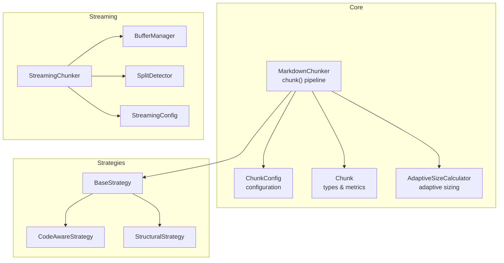
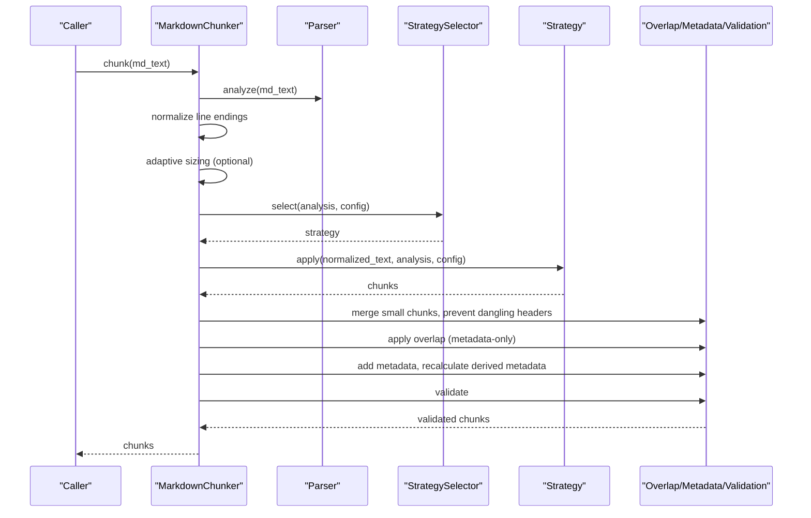
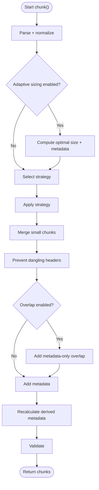
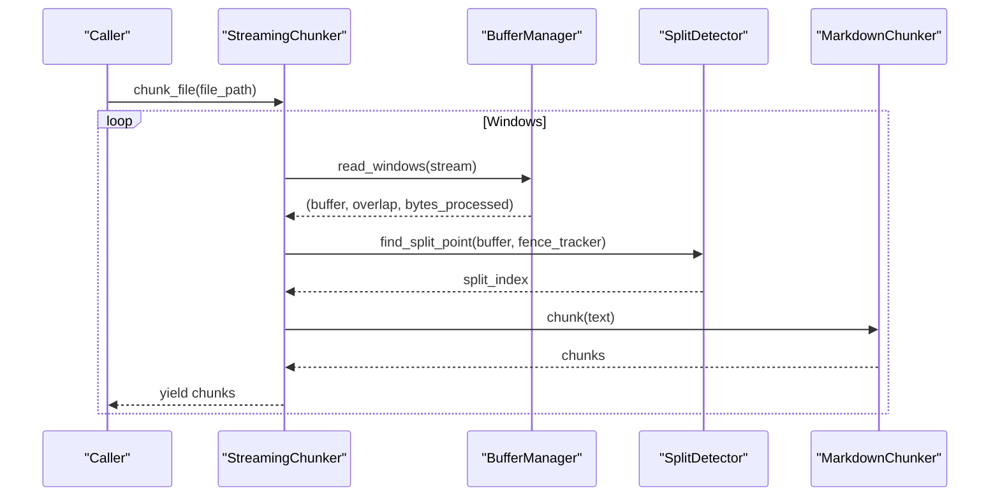
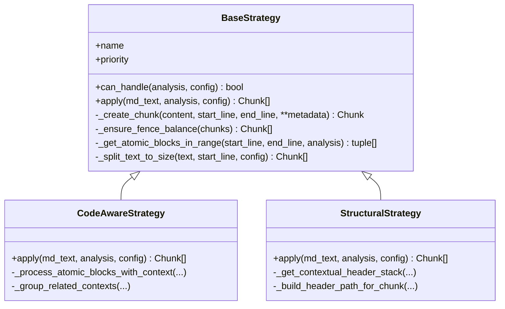
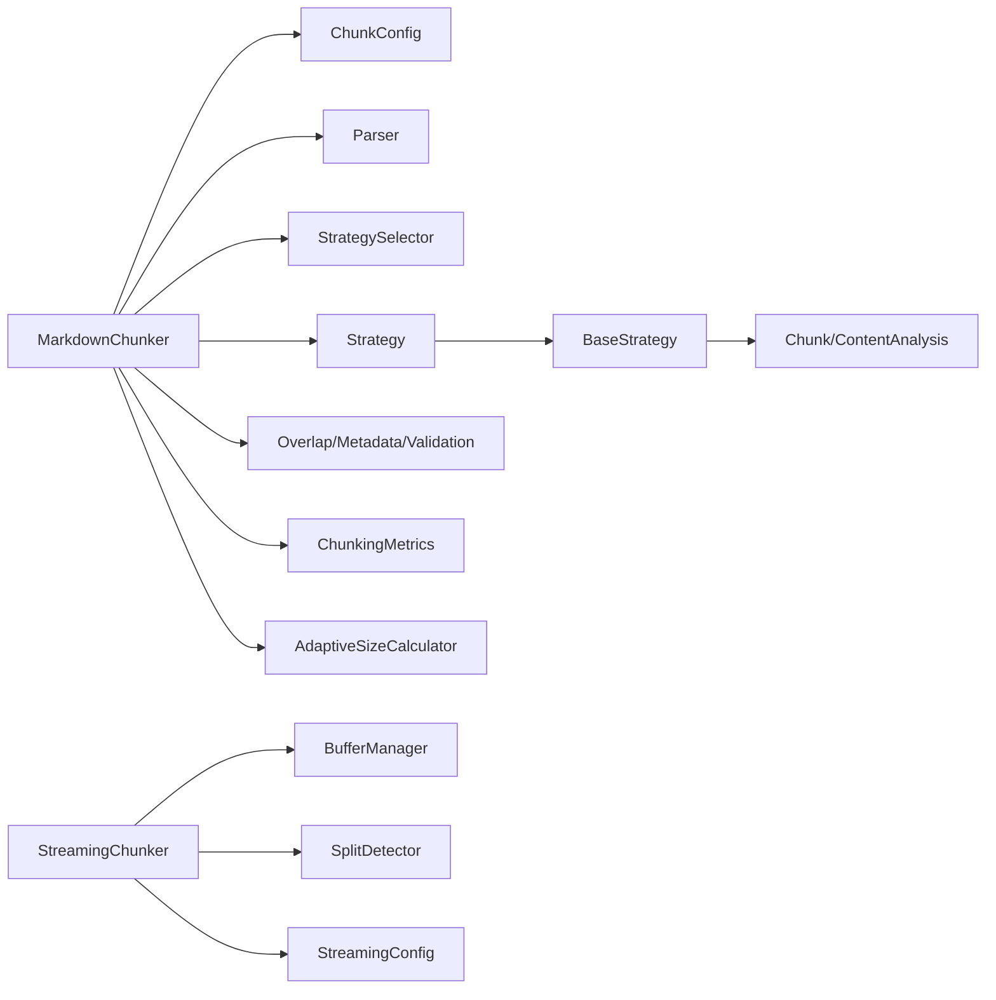

# Performance Considerations

<cite>
**Referenced Files in This Document**
- [README.md](file://README.md)
- [src/chunkana/chunker.py](file://src/chunkana/chunker.py)
- [src/chunkana/config.py](file://src/chunkana/config.py)
- [src/chunkana/types.py](file://src/chunkana/types.py)
- [src/chunkana/adaptive_sizing.py](file://src/chunkana/adaptive_sizing.py)
- [src/chunkana/strategies/base.py](file://src/chunkana/strategies/base.py)
- [src/chunkana/strategies/code_aware.py](file://src/chunkana/strategies/code_aware.py)
- [src/chunkana/strategies/structural.py](file://src/chunkana/strategies/structural.py)
- [src/chunkana/streaming/streaming_chunker.py](file://src/chunkana/streaming/streaming_chunker.py)
- [src/chunkana/streaming/buffer_manager.py](file://src/chunkana/streaming/buffer_manager.py)
- [src/chunkana/streaming/split_detector.py](file://src/chunkana/streaming/split_detector.py)
- [src/chunkana/streaming/config.py](file://src/chunkana/streaming/config.py)
- [tests/performance/test_performance_regression.py](file://tests/performance/test_performance_regression.py)
</cite>

## Table of Contents
1. [Introduction](#introduction)
2. [Project Structure](#project-structure)
3. [Core Components](#core-components)
4. [Architecture Overview](#architecture-overview)
5. [Detailed Component Analysis](#detailed-component-analysis)
6. [Dependency Analysis](#dependency-analysis)
7. [Performance Considerations](#performance-considerations)
8. [Troubleshooting Guide](#troubleshooting-guide)
9. [Conclusion](#conclusion)
10. [Appendices](#appendices)

## Introduction
This document provides a comprehensive performance analysis of Chunkana, focusing on time complexity, memory usage patterns, and scalability characteristics. It compares in-memory versus streaming processing modes, benchmarks typical document sizes and types, explains the performance impact of configuration options, and offers optimization tips for high-throughput and large-document scenarios. Guidance on CPU vs memory trade-offs, garbage collection considerations, profiling, bottleneck identification, and production deployment/load testing recommendations is included.

## Project Structure
Chunkana’s performance-critical path centers on the main chunker, strategy selection, and streaming subsystem. The key modules are:
- Core chunking pipeline: [MarkdownChunker](file://src/chunkana/chunker.py)
- Configuration: [ChunkConfig](file://src/chunkana/config.py)
- Types and metrics: [Chunk](file://src/chunkana/types.py), [ChunkingMetrics](file://src/chunkana/types.py)
- Adaptive sizing: [AdaptiveSizeCalculator](file://src/chunkana/adaptive_sizing.py)
- Strategies: [BaseStrategy](file://src/chunkana/strategies/base.py), [CodeAwareStrategy](file://src/chunkana/strategies/code_aware.py), [StructuralStrategy](file://src/chunkana/strategies/structural.py)
- Streaming: [StreamingChunker](file://src/chunkana/streaming/streaming_chunker.py), [BufferManager](file://src/chunkana/streaming/buffer_manager.py), [SplitDetector](file://src/chunkana/streaming/split_detector.py), [StreamingConfig](file://src/chunkana/streaming/config.py)
- Performance tests: [test_performance_regression.py](file://tests/performance/test_performance_regression.py)

**Diagram sources**
- [src/chunkana/chunker.py](file://src/chunkana/chunker.py#L85-L176)
- [src/chunkana/config.py](file://src/chunkana/config.py#L17-L123)
- [src/chunkana/types.py](file://src/chunkana/types.py#L240-L376)
- [src/chunkana/adaptive_sizing.py](file://src/chunkana/adaptive_sizing.py#L103-L197)
- [src/chunkana/strategies/base.py](file://src/chunkana/strategies/base.py#L15-L118)
- [src/chunkana/strategies/code_aware.py](file://src/chunkana/strategies/code_aware.py#L14-L60)
- [src/chunkana/strategies/structural.py](file://src/chunkana/strategies/structural.py#L15-L50)
- [src/chunkana/streaming/streaming_chunker.py](file://src/chunkana/streaming/streaming_chunker.py#L18-L99)
- [src/chunkana/streaming/buffer_manager.py](file://src/chunkana/streaming/buffer_manager.py#L13-L62)
- [src/chunkana/streaming/split_detector.py](file://src/chunkana/streaming/split_detector.py#L10-L93)
- [src/chunkana/streaming/config.py](file://src/chunkana/streaming/config.py#L8-L24)

**Section sources**
- [README.md](file://README.md#L1-L179)
- [src/chunkana/chunker.py](file://src/chunkana/chunker.py#L85-L176)
- [src/chunkana/config.py](file://src/chunkana/config.py#L17-L123)

## Core Components
- MarkdownChunker: orchestrates parsing, strategy selection, overlap, metadata enrichment, validation, and optional hierarchical construction. See [chunk](file://src/chunkana/chunker.py#L85-L176).
- ChunkConfig: central configuration controlling chunk sizes, overlap, strategy thresholds, and streaming behavior. See [ChunkConfig](file://src/chunkana/config.py#L17-L123).
- Chunk and ChunkingMetrics: typed containers for chunks and statistical summaries. See [Chunk](file://src/chunkana/types.py#L240-L376), [ChunkingMetrics](file://src/chunkana/types.py#L377-L431).
- AdaptiveSizeCalculator: computes optimal chunk size based on content complexity. See [AdaptiveSizeCalculator](file://src/chunkana/adaptive_sizing.py#L103-L197).
- Strategies: BaseStrategy defines shared helpers; CodeAwareStrategy and StructuralStrategy implement content-aware splitting. See [BaseStrategy](file://src/chunkana/strategies/base.py#L15-L118), [CodeAwareStrategy](file://src/chunkana/strategies/code_aware.py#L14-L60), [StructuralStrategy](file://src/chunkana/strategies/structural.py#L15-L50).
- StreamingChunker: processes files in windows with overlap and safe split detection. See [StreamingChunker](file://src/chunkana/streaming/streaming_chunker.py#L18-L99).

**Section sources**
- [src/chunkana/chunker.py](file://src/chunkana/chunker.py#L85-L176)
- [src/chunkana/config.py](file://src/chunkana/config.py#L17-L123)
- [src/chunkana/types.py](file://src/chunkana/types.py#L240-L431)
- [src/chunkana/adaptive_sizing.py](file://src/chunkana/adaptive_sizing.py#L103-L197)
- [src/chunkana/strategies/base.py](file://src/chunkana/strategies/base.py#L15-L118)
- [src/chunkana/strategies/code_aware.py](file://src/chunkana/strategies/code_aware.py#L14-L60)
- [src/chunkana/strategies/structural.py](file://src/chunkana/strategies/structural.py#L15-L50)
- [src/chunkana/streaming/streaming_chunker.py](file://src/chunkana/streaming/streaming_chunker.py#L18-L99)

## Architecture Overview
The chunking pipeline is linear and deterministic, with optional adaptive sizing and overlap. Streaming mode uses windowed processing with overlap and safe split detection.

**Diagram sources**
- [src/chunkana/chunker.py](file://src/chunkana/chunker.py#L85-L176)
- [src/chunkana/strategies/base.py](file://src/chunkana/strategies/base.py#L15-L118)
- [src/chunkana/adaptive_sizing.py](file://src/chunkana/adaptive_sizing.py#L103-L197)

**Section sources**
- [src/chunkana/chunker.py](file://src/chunkana/chunker.py#L85-L176)

## Detailed Component Analysis

### In-Memory Chunking Pipeline
- Parsing and normalization: single pass over text; line-end normalization occurs early. See [chunk](file://src/chunkana/chunker.py#L111-L116).
- Adaptive sizing: optional, recomputes effective max_chunk_size and metadata enrichment. See [chunk](file://src/chunkana/chunker.py#L118-L145).
- Strategy selection and application: strategy chooses split points and preserves atomic blocks. See [BaseStrategy.apply](file://src/chunkana/strategies/base.py#L52-L65), [CodeAwareStrategy.apply](file://src/chunkana/strategies/code_aware.py#L42-L60), [StructuralStrategy.apply](file://src/chunkana/strategies/structural.py#L58-L150).
- Post-processing: small chunk merging, header prevention, overlap injection, metadata enrichment, validation. See [chunk](file://src/chunkana/chunker.py#L152-L176).

**Diagram sources**
- [src/chunkana/chunker.py](file://src/chunkana/chunker.py#L85-L176)
- [src/chunkana/strategies/base.py](file://src/chunkana/strategies/base.py#L52-L65)
- [src/chunkana/adaptive_sizing.py](file://src/chunkana/adaptive_sizing.py#L103-L197)

**Section sources**
- [src/chunkana/chunker.py](file://src/chunkana/chunker.py#L85-L176)
- [src/chunkana/strategies/base.py](file://src/chunkana/strategies/base.py#L52-L65)
- [src/chunkana/adaptive_sizing.py](file://src/chunkana/adaptive_sizing.py#L103-L197)

### Streaming Chunking Pipeline
Streaming processes files in fixed-size windows with overlap to avoid boundary artifacts. Split detection prefers semantic boundaries.

**Diagram sources**
- [src/chunkana/streaming/streaming_chunker.py](file://src/chunkana/streaming/streaming_chunker.py#L43-L99)
- [src/chunkana/streaming/buffer_manager.py](file://src/chunkana/streaming/buffer_manager.py#L29-L55)
- [src/chunkana/streaming/split_detector.py](file://src/chunkana/streaming/split_detector.py#L26-L62)
- [src/chunkana/chunker.py](file://src/chunkana/chunker.py#L85-L176)

**Section sources**
- [src/chunkana/streaming/streaming_chunker.py](file://src/chunkana/streaming/streaming_chunker.py#L43-L99)
- [src/chunkana/streaming/buffer_manager.py](file://src/chunkana/streaming/buffer_manager.py#L29-L55)
- [src/chunkana/streaming/split_detector.py](file://src/chunkana/streaming/split_detector.py#L26-L62)
- [src/chunkana/streaming/config.py](file://src/chunkana/streaming/config.py#L8-L24)

### Strategy-Level Processing Logic
- CodeAwareStrategy: preserves atomic blocks (code, tables, LaTeX), optionally binds code to explanatory context, groups related code blocks. See [CodeAwareStrategy.apply](file://src/chunkana/strategies/code_aware.py#L42-L60), [CodeAwareStrategy._process_atomic_blocks_with_context](file://src/chunkana/strategies/code_aware.py#L236-L294).
- StructuralStrategy: splits by headers, caches header stacks for performance, builds header_path and section_tags. See [StructuralStrategy.apply](file://src/chunkana/strategies/structural.py#L58-L150), [StructuralStrategy._get_contextual_header_stack](file://src/chunkana/strategies/structural.py#L235-L283).

**Diagram sources**
- [src/chunkana/strategies/base.py](file://src/chunkana/strategies/base.py#L15-L118)
- [src/chunkana/strategies/code_aware.py](file://src/chunkana/strategies/code_aware.py#L14-L60)
- [src/chunkana/strategies/structural.py](file://src/chunkana/strategies/structural.py#L15-L50)

**Section sources**
- [src/chunkana/strategies/code_aware.py](file://src/chunkana/strategies/code_aware.py#L14-L60)
- [src/chunkana/strategies/structural.py](file://src/chunkana/strategies/structural.py#L15-L50)
- [src/chunkana/strategies/base.py](file://src/chunkana/strategies/base.py#L15-L118)

## Dependency Analysis
- Coupling: MarkdownChunker depends on StrategySelector, Parser, AdaptiveSizeCalculator, and post-processing helpers. Strategies depend on BaseStrategy and ContentAnalysis.
- Cohesion: Each strategy encapsulates its splitting logic; streaming components are cohesive and isolated.
- External dependencies: None beyond Python standard library and typing modules.

**Diagram sources**
- [src/chunkana/chunker.py](file://src/chunkana/chunker.py#L85-L176)
- [src/chunkana/strategies/base.py](file://src/chunkana/strategies/base.py#L15-L118)
- [src/chunkana/types.py](file://src/chunkana/types.py#L181-L239)
- [src/chunkana/adaptive_sizing.py](file://src/chunkana/adaptive_sizing.py#L103-L197)
- [src/chunkana/streaming/streaming_chunker.py](file://src/chunkana/streaming/streaming_chunker.py#L43-L99)

**Section sources**
- [src/chunkana/chunker.py](file://src/chunkana/chunker.py#L85-L176)
- [src/chunkana/strategies/base.py](file://src/chunkana/strategies/base.py#L15-L118)
- [src/chunkana/types.py](file://src/chunkana/types.py#L181-L239)
- [src/chunkana/adaptive_sizing.py](file://src/chunkana/adaptive_sizing.py#L103-L197)
- [src/chunkana/streaming/streaming_chunker.py](file://src/chunkana/streaming/streaming_chunker.py#L43-L99)

## Performance Considerations

### Time Complexity
- Overall pipeline: O(n) in input size for typical documents, with additional overhead proportional to:
  - Number of headers and atomic blocks (code, tables, LaTeX) for strategy selection and splitting.
  - Overlap computation adds constant-time per neighbor pair.
  - Validation performs bounded checks and sorting for ordering fixes.
- Strategy-specific:
  - CodeAwareStrategy: O(n) plus cost of context binding and grouping; grouping is O(k^2) in worst-case for relatedness checks among k code contexts.
  - StructuralStrategy: O(n) plus O(h) header processing and O(s) for splitting large sections, where h is header count and s is section size; caching reduces repeated header stack computations.
- Streaming: O(n) over the file with windowed processing; split detection is O(w) per window where w is window size.

Evidence and references:
- Pipeline stages and complexity are evident from method-level logic and loop structures in [chunk](file://src/chunkana/chunker.py#L85-L176), [CodeAwareStrategy.apply](file://src/chunkana/strategies/code_aware.py#L42-L60), [StructuralStrategy.apply](file://src/chunkana/strategies/structural.py#L58-L150), and [StreamingChunker.chunk_stream](file://src/chunkana/streaming/streaming_chunker.py#L56-L78).

**Section sources**
- [src/chunkana/chunker.py](file://src/chunkana/chunker.py#L85-L176)
- [src/chunkana/strategies/code_aware.py](file://src/chunkana/strategies/code_aware.py#L42-L60)
- [src/chunkana/strategies/structural.py](file://src/chunkana/strategies/structural.py#L58-L150)
- [src/chunkana/streaming/streaming_chunker.py](file://src/chunkana/streaming/streaming_chunker.py#L56-L78)

### Memory Usage Patterns
- In-memory mode:
  - Stores normalized text and parsed analysis once; chunks are created and metadata enriched; overlap is stored as metadata strings, not duplicated content.
  - Small chunk merging and header path/tag computation are in-memory operations.
- Streaming mode:
  - Uses fixed-size buffers with overlap; memory usage is bounded by buffer_size and overlap_lines.
  - Split detection avoids arbitrary splits by preferring semantic boundaries, minimizing rework.

References:
- Overlap metadata storage and non-duplicated content: [MarkdownChunker._apply_overlap](file://src/chunkana/chunker.py#L301-L370).
- Streaming buffer and overlap: [BufferManager.read_windows](file://src/chunkana/streaming/buffer_manager.py#L29-L55), [StreamingConfig](file://src/chunkana/streaming/config.py#L8-L24).
- Split detection heuristics: [SplitDetector.find_split_point](file://src/chunkana/streaming/split_detector.py#L26-L62).

**Section sources**
- [src/chunkana/chunker.py](file://src/chunkana/chunker.py#L301-L370)
- [src/chunkana/streaming/buffer_manager.py](file://src/chunkana/streaming/buffer_manager.py#L29-L55)
- [src/chunkana/streaming/config.py](file://src/chunkana/streaming/config.py#L8-L24)
- [src/chunkana/streaming/split_detector.py](file://src/chunkana/streaming/split_detector.py#L26-L62)

### Scalability Characteristics
- Linear scaling with document size is demonstrated in performance tests; time grows roughly linearly with document size, with allowance for O(n log n) behavior.
- Chunk counts remain reasonable across sizes, and hierarchical mode does not inflate flat chunk counts excessively.

References:
- Scaling and chunk count tests: [TestScalability](file://tests/performance/test_performance_regression.py#L363-L404), [TestMemoryUsage](file://tests/performance/test_performance_regression.py#L405-L451).

**Section sources**
- [tests/performance/test_performance_regression.py](file://tests/performance/test_performance_regression.py#L363-L404)
- [tests/performance/test_performance_regression.py](file://tests/performance/test_performance_regression.py#L405-L451)

### Benchmarks by Document Size and Type
- Small, medium, and large synthetic documents are used in performance tests. Typical thresholds:
  - Small (< 50ms average)
  - Medium (< 200ms average)
  - Large (< 1s average)
- Hierarchical chunking adds modest overhead compared to standard chunking; navigation operations are O(1) or near-constant.

References:
- Benchmarks and thresholds: [TestChunkingPerformance](file://tests/performance/test_performance_regression.py#L213-L291), [TestHierarchicalPerformance](file://tests/performance/test_performance_regression.py#L293-L361).

**Section sources**
- [tests/performance/test_performance_regression.py](file://tests/performance/test_performance_regression.py#L213-L291)
- [tests/performance/test_performance_regression.py](file://tests/performance/test_performance_regression.py#L293-L361)

### Configuration Impact on Performance
- max_chunk_size and min_chunk_size:
  - Larger max_chunk_size reduces chunk count and post-processing steps; may increase overlap metadata size.
  - Smaller min_chunk_size increases small chunk merging and potential micro-chunk flags.
- overlap_size and overlap_cap_ratio:
  - Higher overlap improves continuity across chunks but increases metadata size and minor string processing.
- use_adaptive_sizing:
  - Adds computational overhead for complexity scoring and optimal size calculation; beneficial for mixed content.
- strategy_override:
  - Forces a specific strategy; may reduce selection overhead but could underperform on heterogeneous content.
- preserve_atomic_blocks, enable_code_context_binding, group_related_tables:
  - Enhance correctness and retrieval quality; introduce additional processing costs (context binding, grouping).
- validate_invariants and strict_mode:
  - Validation adds bounded overhead; strict_mode may incur extra error handling.

References:
- Configuration defaults and validation: [ChunkConfig](file://src/chunkana/config.py#L17-L123), [ChunkConfig._validate_size_params](file://src/chunkana/config.py#L138-L158).
- Adaptive sizing: [AdaptiveSizeCalculator](file://src/chunkana/adaptive_sizing.py#L103-L197).
- Overlap behavior: [MarkdownChunker._apply_overlap](file://src/chunkana/chunker.py#L301-L370).

**Section sources**
- [src/chunkana/config.py](file://src/chunkana/config.py#L17-L123)
- [src/chunkana/adaptive_sizing.py](file://src/chunkana/adaptive_sizing.py#L103-L197)
- [src/chunkana/chunker.py](file://src/chunkana/chunker.py#L301-L370)

### In-Memory vs Streaming Processing
- In-memory:
  - Best for documents under a few MB; fastest end-to-end latency; minimal I/O overhead.
  - Memory usage grows with document size; bounded by chunk count and overlap metadata.
- Streaming:
  - Designed for large files; memory usage bounded by buffer_size and overlap_lines.
  - Windowed processing introduces overhead for boundary handling; split detection prefers semantic boundaries to minimize rework.

References:
- Streaming chunking: [StreamingChunker.chunk_stream](file://src/chunkana/streaming/streaming_chunker.py#L56-L78), [BufferManager.read_windows](file://src/chunkana/streaming/buffer_manager.py#L29-L55), [SplitDetector.find_split_point](file://src/chunkana/streaming/split_detector.py#L26-L62).

**Section sources**
- [src/chunkana/streaming/streaming_chunker.py](file://src/chunkana/streaming/streaming_chunker.py#L56-L78)
- [src/chunkana/streaming/buffer_manager.py](file://src/chunkana/streaming/buffer_manager.py#L29-L55)
- [src/chunkana/streaming/split_detector.py](file://src/chunkana/streaming/split_detector.py#L26-L62)

### CPU vs Memory Trade-offs and GC Considerations
- CPU-intensive operations:
  - Adaptive sizing, code-context binding, and table grouping can increase CPU usage.
  - StructuralStrategy caches header stacks to reduce repeated computation; this trades memory for CPU savings.
- Memory footprint:
  - Overlap metadata increases memory per chunk; consider disabling overlap for extremely memory-constrained environments.
  - Streaming mode caps memory usage; tune buffer_size and overlap_lines accordingly.
- Garbage collection:
  - Avoid retaining large intermediate strings unnecessarily; reuse buffers and avoid concatenating large strings repeatedly.
  - Prefer iterator-based streaming for long-running jobs to reduce peak memory.

References:
- Overlap metadata and non-duplicated content: [MarkdownChunker._apply_overlap](file://src/chunkana/chunker.py#L301-L370).
- Streaming memory controls: [StreamingConfig](file://src/chunkana/streaming/config.py#L8-L24).

**Section sources**
- [src/chunkana/chunker.py](file://src/chunkana/chunker.py#L301-L370)
- [src/chunkana/streaming/config.py](file://src/chunkana/streaming/config.py#L8-L24)

### Optimization Tips for High-Throughput and Large Documents
- Tune chunk sizes:
  - Increase max_chunk_size for code-heavy or table-heavy content to reduce chunk count and improve retrieval quality.
  - Decrease min_chunk_size cautiously to avoid micro-chunks.
- Use adaptive sizing:
  - Enable use_adaptive_sizing for mixed-content documents to dynamically adjust chunk sizes based on content complexity.
- Prefer streaming for large files:
  - Set buffer_size and overlap_lines to balance throughput and memory usage.
- Disable overlap when unnecessary:
  - Turn off overlap_size or set overlap_cap_ratio lower to reduce metadata overhead.
- Strategy selection:
  - Use strategy_override only when confident about content composition; otherwise rely on automatic selection.
- Validation:
  - Disable validate_invariants for high-throughput ingestion if downstream validation is handled elsewhere.

References:
- Configuration options: [ChunkConfig](file://src/chunkana/config.py#L17-L123).
- Streaming tuning: [StreamingConfig](file://src/chunkana/streaming/config.py#L8-L24).

**Section sources**
- [src/chunkana/config.py](file://src/chunkana/config.py#L17-L123)
- [src/chunkana/streaming/config.py](file://src/chunkana/streaming/config.py#L8-L24)

### Profiling, Bottleneck Identification, and Production Deployment
- Profiling:
  - Use Python’s built-in profiler to identify hotspots in strategy application and overlap computation.
  - Measure chunking time per document size to detect regressions.
- Bottlenecks:
  - Code-aware context binding and grouping are likely CPU hotspots for code-heavy documents.
  - StructuralStrategy header stack caching mitigates overhead; ensure headers are well-formed.
  - Streaming split detection is efficient but can be tuned via safe_split_threshold.
- Load testing:
  - Run performance tests across document sizes and types to establish baselines.
  - Monitor chunk counts and chunking metrics to ensure quality targets are met.
- Deployment:
  - Use streaming mode for large files; set buffer_size and overlap_lines to meet latency and memory targets.
  - Enable adaptive sizing for mixed content; disable overlap if memory is constrained.
  - Validate performance regressions regularly using the provided test suite.

References:
- Performance tests and metrics: [test_performance_regression.py](file://tests/performance/test_performance_regression.py#L213-L485).

**Section sources**
- [tests/performance/test_performance_regression.py](file://tests/performance/test_performance_regression.py#L213-L485)

## Troubleshooting Guide
Common performance issues and remedies:
- Excessive chunk count:
  - Increase max_chunk_size or enable adaptive sizing to reduce fragmentation.
- Slow chunking on code-heavy documents:
  - Disable code-context binding if not needed; consider grouping related tables.
- High memory usage:
  - Switch to streaming mode; reduce buffer_size and overlap_lines; disable overlap metadata.
- Poor overlap quality:
  - Adjust overlap_size and overlap_cap_ratio; ensure chunk sizes are reasonable.

References:
- Configuration validation and defaults: [ChunkConfig](file://src/chunkana/config.py#L138-L229).
- Streaming configuration: [StreamingConfig](file://src/chunkana/streaming/config.py#L8-L24).

**Section sources**
- [src/chunkana/config.py](file://src/chunkana/config.py#L138-L229)
- [src/chunkana/streaming/config.py](file://src/chunkana/streaming/config.py#L8-L24)

## Conclusion
Chunkana achieves near-linear performance across document sizes with predictable memory usage. In-memory mode is optimal for small-to-medium documents, while streaming mode scales to large files with controlled memory footprints. Configuration choices—chunk sizes, overlap, adaptive sizing, and strategy selection—significantly impact throughput and memory. Validation and overlap add bounded overhead and should be tuned for production needs. Use the provided performance tests and streaming configuration to benchmark and deploy reliably.

## Appendices

### Appendix A: Configuration Options Reference
- ChunkConfig fields affecting performance:
  - max_chunk_size, min_chunk_size, overlap_size, overlap_cap_ratio
  - use_adaptive_sizing, adaptive_config
  - preserve_atomic_blocks, enable_code_context_binding, group_related_tables
  - validate_invariants, strict_mode

References:
- [ChunkConfig](file://src/chunkana/config.py#L17-L123)

**Section sources**
- [src/chunkana/config.py](file://src/chunkana/config.py#L17-L123)

### Appendix B: Streaming Configuration Reference
- StreamingConfig fields:
  - buffer_size, overlap_lines, max_memory_mb, safe_split_threshold

References:
- [StreamingConfig](file://src/chunkana/streaming/config.py#L8-L24)

**Section sources**
- [src/chunkana/streaming/config.py](file://src/chunkana/streaming/config.py#L8-L24)