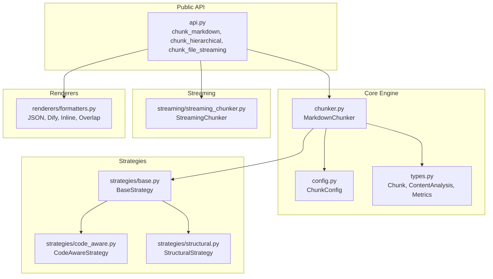
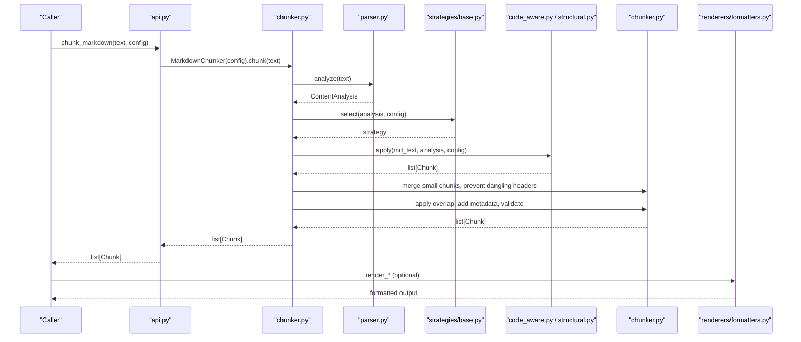
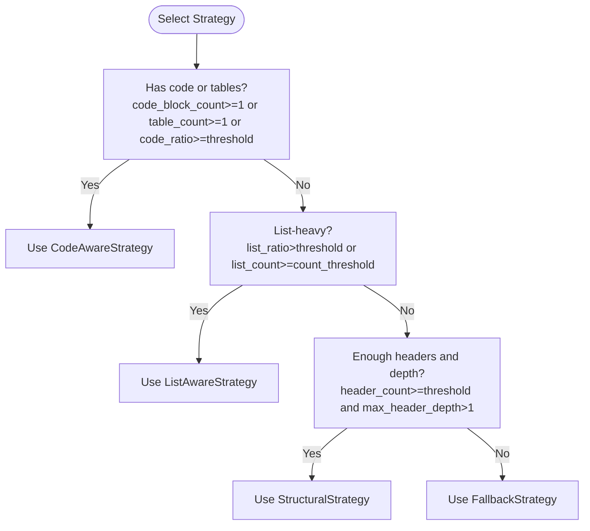
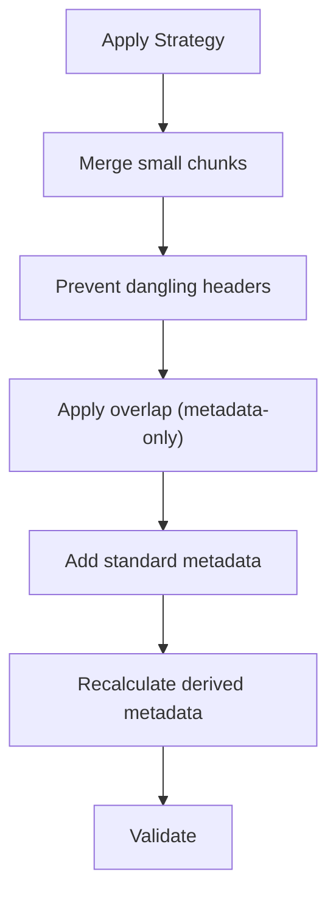
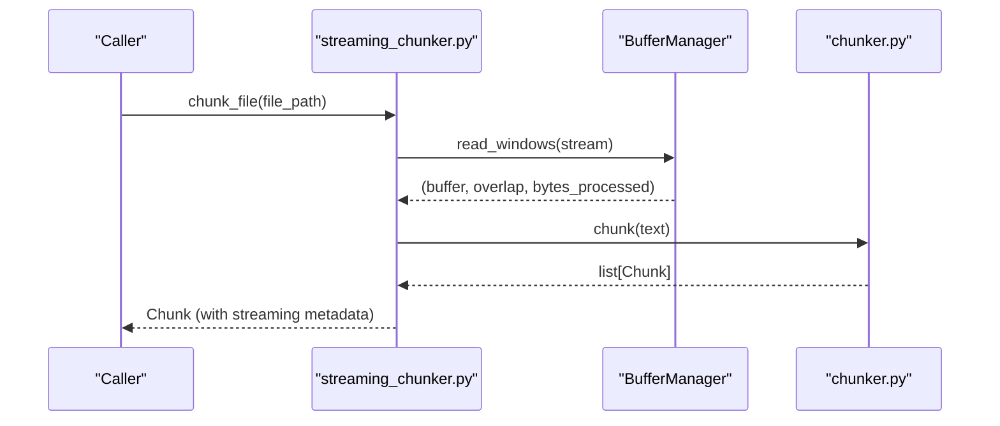
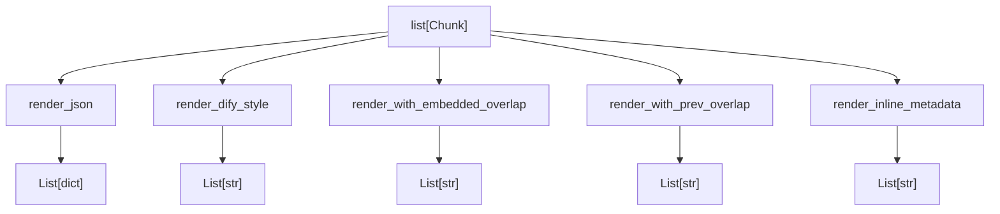
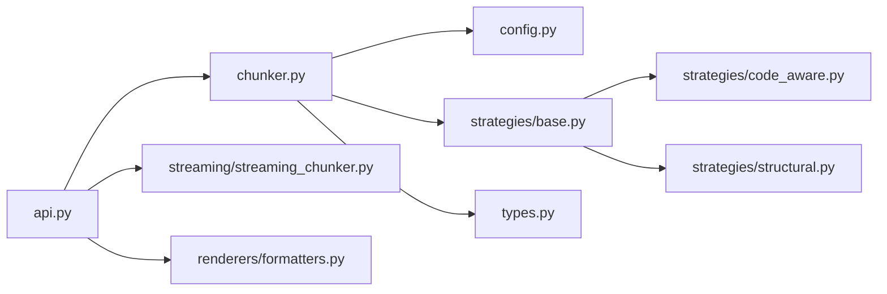
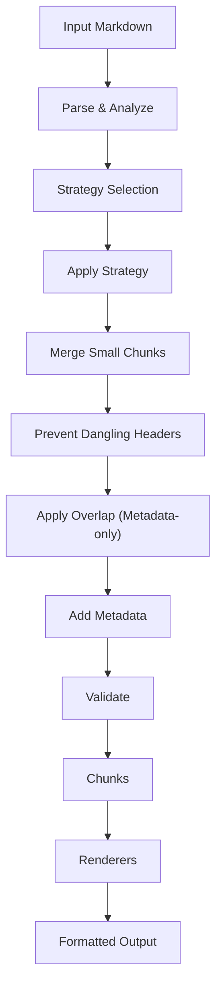

# Project Overview

<cite>
**Referenced Files in This Document**
- [README.md](file://README.md)
- [__init__.py](file://src/chunkana/__init__.py)
- [api.py](file://src/chunkana/api.py)
- [chunker.py](file://src/chunkana/chunker.py)
- [config.py](file://src/chunkana/config.py)
- [types.py](file://src/chunkana/types.py)
- [base.py](file://src/chunkana/strategies/base.py)
- [code_aware.py](file://src/chunkana/strategies/code_aware.py)
- [structural.py](file://src/chunkana/strategies/structural.py)
- [streaming_chunker.py](file://src/chunkana/streaming/streaming_chunker.py)
- [formatters.py](file://src/chunkana/renderers/formatters.py)
- [strategies.md](file://docs/strategies.md)
- [renderers.md](file://docs/renderers.md)
</cite>

## Table of Contents
1. [Introduction](#introduction)
2. [Project Structure](#project-structure)
3. [Core Components](#core-components)
4. [Architecture Overview](#architecture-overview)
5. [Detailed Component Analysis](#detailed-component-analysis)
6. [Dependency Analysis](#dependency-analysis)
7. [Performance Considerations](#performance-considerations)
8. [Troubleshooting Guide](#troubleshooting-guide)
9. [Conclusion](#conclusion)
10. [Appendices](#appendices)

## Introduction
Chunkana is an intelligent Markdown chunking library designed for Retrieval-Augmented Generation (RAG) systems. Its core value proposition is smart, context-aware text segmentation that preserves semantic structure in technical and code-heavy documents. It achieves this through:
- Strategy-based chunking that adapts to document characteristics
- Atomic block preservation (code, tables, LaTeX)
- Hierarchical navigation with robust validation
- Streaming support for large files
- Rich metadata and multiple output renderers
- Quality assurance mechanisms (dangling header prevention, micro-chunk minimization)

Real-world use cases include AI documentation processing, knowledge base ingestion, and large-scale content analysis. The library exposes a simple API for basic chunking and advanced controls for hierarchical chunking, overlap configuration, and streaming.

**Section sources**
- [README.md](file://README.md#L1-L179)

## Project Structure
The project follows a modular, layered design:
- Public API: high-level convenience functions and class entry points
- Core engine: MarkdownChunker orchestrating parsing, strategy selection, overlap, and validation
- Strategies: specialized chunking approaches for code-heavy, list-heavy, and structural documents
- Streaming: memory-efficient processing for large files
- Types: shared data models and metrics
- Renderers: output formatters for various integrations
- Docs: strategy and renderer usage guidance

**Diagram sources**
- [api.py](file://src/chunkana/api.py#L1-L305)
- [chunker.py](file://src/chunkana/chunker.py#L1-L300)
- [config.py](file://src/chunkana/config.py#L1-L200)
- [base.py](file://src/chunkana/strategies/base.py#L1-L120)
- [code_aware.py](file://src/chunkana/strategies/code_aware.py#L1-L120)
- [structural.py](file://src/chunkana/strategies/structural.py#L1-L120)
- [streaming_chunker.py](file://src/chunkana/streaming/streaming_chunker.py#L1-L99)
- [formatters.py](file://src/chunkana/renderers/formatters.py#L1-L146)

**Section sources**
- [__init__.py](file://src/chunkana/__init__.py#L1-L116)
- [api.py](file://src/chunkana/api.py#L1-L120)
- [chunker.py](file://src/chunkana/chunker.py#L1-L120)
- [config.py](file://src/chunkana/config.py#L1-L120)

## Core Components
- Public API: Provides convenience functions for chunking, analysis, metrics, iteration, and streaming. Also exposes the core class MarkdownChunker and configuration types.
- MarkdownChunker: Orchestrates the chunking pipeline: parse, analyze, select strategy, apply strategy, merge small chunks, prevent dangling headers, apply overlap, enrich metadata, validate, and return chunks.
- Strategies: BaseStrategy defines the interface and helpers; CodeAwareStrategy handles code and tables; StructuralStrategy handles hierarchical documents.
- StreamingChunker: Buffers and processes large files to limit memory usage while maintaining chunk boundaries.
- Types: Defines Chunk, ContentAnalysis, ChunkingMetrics, and related data structures used across the system.
- Renderers: Pure formatting functions to convert chunks into JSON, Dify-compatible, inline metadata, or overlap-embedded formats.

Key configuration options include chunk size bounds, overlap behavior, atomic block preservation, strategy thresholds, and adaptive sizing.

**Section sources**
- [__init__.py](file://src/chunkana/__init__.py#L24-L116)
- [api.py](file://src/chunkana/api.py#L1-L120)
- [chunker.py](file://src/chunkana/chunker.py#L85-L217)
- [base.py](file://src/chunkana/strategies/base.py#L1-L120)
- [code_aware.py](file://src/chunkana/strategies/code_aware.py#L1-L120)
- [structural.py](file://src/chunkana/strategies/structural.py#L1-L120)
- [streaming_chunker.py](file://src/chunkana/streaming/streaming_chunker.py#L1-L99)
- [types.py](file://src/chunkana/types.py#L240-L376)
- [config.py](file://src/chunkana/config.py#L17-L120)

## Architecture Overview
Chunkana’s architecture emphasizes modularity and adaptability:
- Modular design: Clear separation between parsing, strategy selection, overlap, and rendering
- Strategy-based chunking: Automatic selection based on content analysis
- Hierarchical navigation: Header-aware metadata and optional tree validation
- Streaming support: Buffered processing for large files
- Quality assurance: Built-in checks for content loss, size bounds, monotonic ordering, and dangling headers

**Diagram sources**
- [api.py](file://src/chunkana/api.py#L18-L120)
- [chunker.py](file://src/chunkana/chunker.py#L85-L217)
- [base.py](file://src/chunkana/strategies/base.py#L1-L120)
- [code_aware.py](file://src/chunkana/strategies/code_aware.py#L42-L120)
- [structural.py](file://src/chunkana/strategies/structural.py#L58-L150)
- [formatters.py](file://src/chunkana/renderers/formatters.py#L1-L85)

## Detailed Component Analysis

### Strategy Selection and Application
- Strategy selection order: CodeAware (priority 1), ListAware (priority 2), Structural (priority 3), Fallback (priority 4)
- CodeAwareStrategy: Preserves atomic blocks (code, tables, LaTeX), optionally binds code to explanations and groups related code blocks
- StructuralStrategy: Splits by headers, maintains header hierarchy in metadata, handles preamble, and preserves atomic blocks within sections

**Diagram sources**
- [strategies.md](file://docs/strategies.md#L1-L82)
- [code_aware.py](file://src/chunkana/strategies/code_aware.py#L32-L41)
- [structural.py](file://src/chunkana/strategies/structural.py#L52-L57)

**Section sources**
- [strategies.md](file://docs/strategies.md#L1-L82)
- [code_aware.py](file://src/chunkana/strategies/code_aware.py#L1-L120)
- [structural.py](file://src/chunkana/strategies/structural.py#L1-L120)

### Overlap and Metadata Enrichment
- Overlap model: Metadata-only overlap (no physical duplication) with adaptive caps based on chunk size
- Dangling header prevention: Ensures headers are not separated from their content
- Micro-chunk minimization: Merges small chunks when safe and flags structurally weak ones
- Metadata fields: strategy, header_path, header_level, section_tags, content_type, and overlap metadata

**Diagram sources**
- [chunker.py](file://src/chunkana/chunker.py#L146-L176)
- [chunker.py](file://src/chunkana/chunker.py#L301-L370)
- [chunker.py](file://src/chunkana/chunker.py#L431-L470)

**Section sources**
- [chunker.py](file://src/chunkana/chunker.py#L301-L370)
- [chunker.py](file://src/chunkana/chunker.py#L431-L470)

### Streaming Pipeline
- StreamingChunker reads files in buffer windows, combines overlap, and yields chunks from the base chunker
- Maintains streaming metadata (window index, chunk index, bytes processed)

**Diagram sources**
- [streaming_chunker.py](file://src/chunkana/streaming/streaming_chunker.py#L43-L99)
- [chunker.py](file://src/chunkana/chunker.py#L85-L117)

**Section sources**
- [streaming_chunker.py](file://src/chunkana/streaming/streaming_chunker.py#L1-L99)

### Output Renderers
- render_json: Converts chunks to dictionaries
- render_dify_style: Dify-compatible format with metadata block
- render_with_embedded_overlap: Bidirectional overlap embedded into content
- render_with_prev_overlap: Sliding window overlap
- render_inline_metadata: Inline JSON metadata comment

**Diagram sources**
- [formatters.py](file://src/chunkana/renderers/formatters.py#L1-L146)
- [renderers.md](file://docs/renderers.md#L1-L136)

**Section sources**
- [formatters.py](file://src/chunkana/renderers/formatters.py#L1-L146)
- [renderers.md](file://docs/renderers.md#L1-L136)

## Dependency Analysis
- Public API depends on MarkdownChunker and configuration
- MarkdownChunker depends on parser, strategy selector, header processor, metadata recalculator, and hierarchy builder
- Strategies depend on BaseStrategy and configuration
- StreamingChunker composes MarkdownChunker and buffer manager
- Renderers are independent and operate on Chunk objects

**Diagram sources**
- [api.py](file://src/chunkana/api.py#L1-L120)
- [chunker.py](file://src/chunkana/chunker.py#L1-L120)
- [base.py](file://src/chunkana/strategies/base.py#L1-L120)
- [code_aware.py](file://src/chunkana/strategies/code_aware.py#L1-L120)
- [structural.py](file://src/chunkana/strategies/structural.py#L1-L120)
- [streaming_chunker.py](file://src/chunkana/streaming/streaming_chunker.py#L1-L99)
- [formatters.py](file://src/chunkana/renderers/formatters.py#L1-L146)
- [types.py](file://src/chunkana/types.py#L240-L376)

**Section sources**
- [api.py](file://src/chunkana/api.py#L1-L120)
- [chunker.py](file://src/chunkana/chunker.py#L1-L120)
- [base.py](file://src/chunkana/strategies/base.py#L1-L120)

## Performance Considerations
- Single-pass parsing and linear pipeline reduce overhead
- Adaptive sizing adjusts chunk size based on content complexity
- Overlap is metadata-only to minimize memory and index bloat
- Streaming buffers and windowed processing for large files
- Optimizations in StructuralStrategy using header stack caching
- Minimal allocations by reusing line arrays from ContentAnalysis

[No sources needed since this section provides general guidance]

## Troubleshooting Guide
Common issues and resolutions:
- Oversized chunks: Intentionally oversized chunks are flagged with reasons (code/table/section/LaTeX integrity). Adjust max_chunk_size or enable adaptive sizing.
- Dangling headers: The system prevents headers from being separated; review header boundaries and content structure.
- Micro-chunks: Small chunks below min_chunk_size are merged when possible; otherwise flagged as small_chunk with a reason.
- Overlap configuration: Ensure overlap_size is less than max_chunk_size and overlap_cap_ratio is within valid bounds.
- Streaming mode: Verify file encoding and buffer sizes; streaming metadata includes window and chunk indices.

**Section sources**
- [chunker.py](file://src/chunkana/chunker.py#L431-L470)
- [config.py](file://src/chunkana/config.py#L138-L229)
- [streaming_chunker.py](file://src/chunkana/streaming/streaming_chunker.py#L43-L99)

## Conclusion
Chunkana delivers a robust, modular chunking solution tailored for RAG systems. Its strategy-based approach, atomic block preservation, hierarchical navigation, streaming support, and quality assurance mechanisms make it suitable for diverse technical documentation. The clean API and multiple renderers simplify integration across platforms and use cases.

[No sources needed since this section summarizes without analyzing specific files]

## Appendices

### High-Level Data Flow Diagram

**Diagram sources**
- [chunker.py](file://src/chunkana/chunker.py#L85-L217)
- [base.py](file://src/chunkana/strategies/base.py#L1-L120)
- [formatters.py](file://src/chunkana/renderers/formatters.py#L1-L146)

### Real-World Use Cases
- AI documentation processing: Preserve code blocks and tables while enabling hierarchical navigation
- Knowledge base ingestion: Normalize content with atomic blocks intact and rich metadata
- Large-scale content analysis: Stream processing for files >10MB with minimal memory footprint

**Section sources**
- [README.md](file://README.md#L1-L179)
- [renderers.md](file://docs/renderers.md#L1-L136)