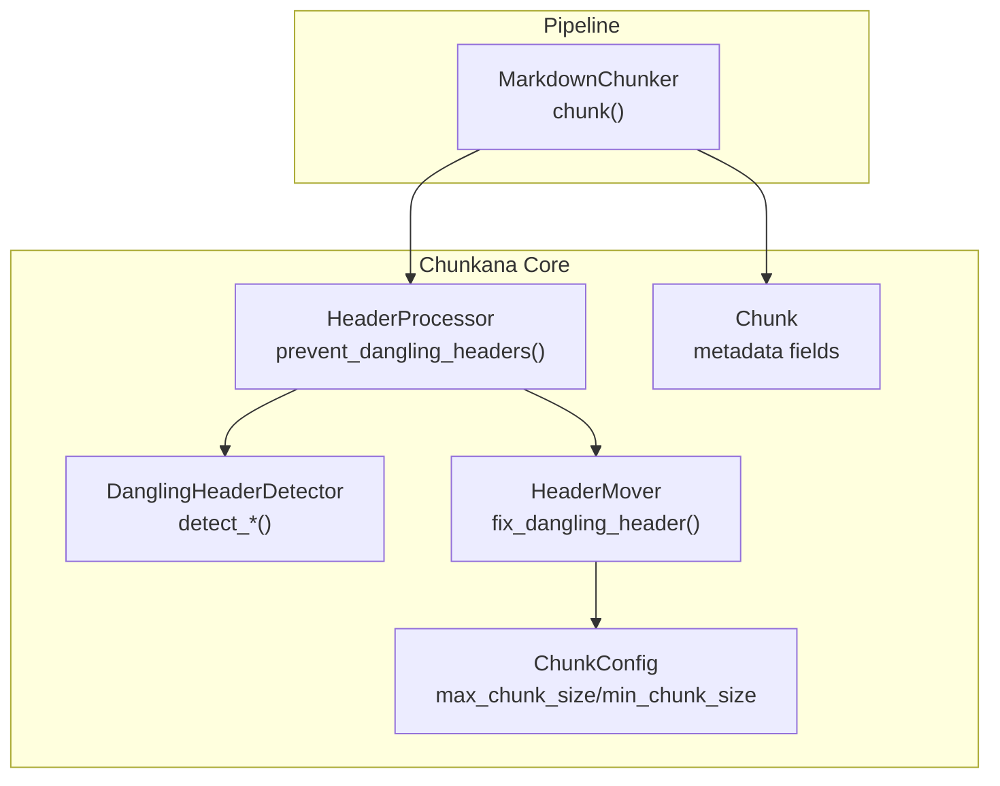
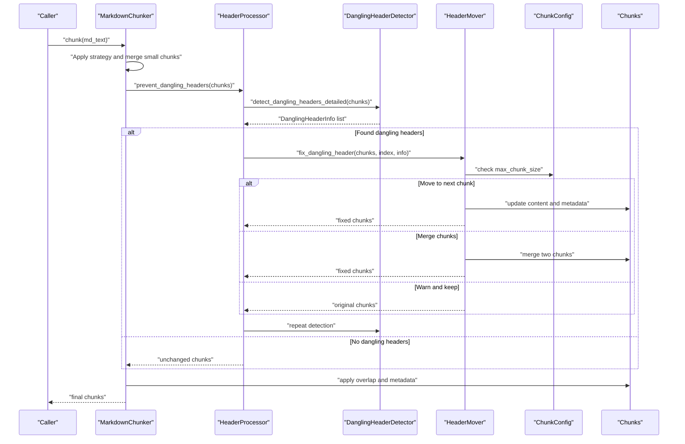
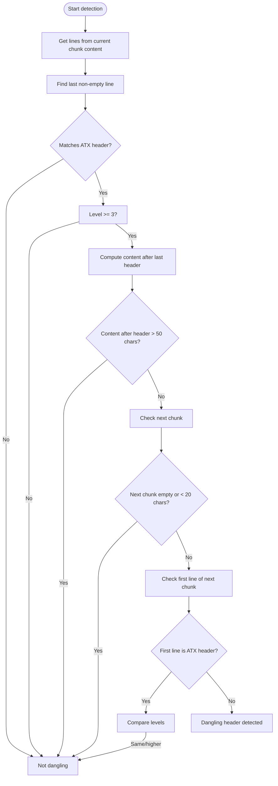
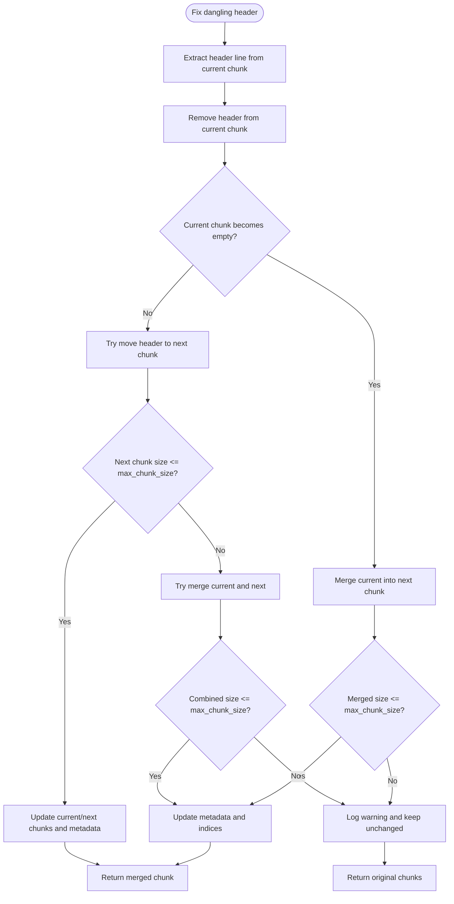
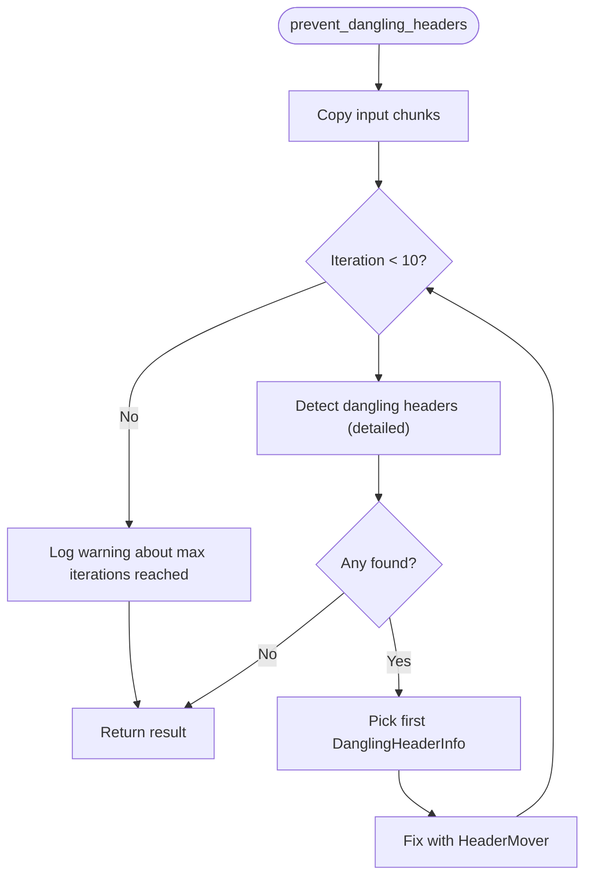
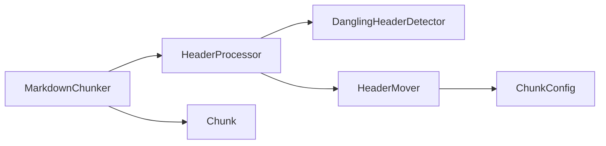

# Dangling Header Prevention

<cite>
**Referenced Files in This Document**
- [header_processor.py](file://src/chunkana/header_processor.py)
- [chunker.py](file://src/chunkana/chunker.py)
- [types.py](file://src/chunkana/types.py)
- [config.py](file://src/chunkana/config.py)
- [test_dangling_headers.py](file://test_dangling_headers.py)
</cite>

## Table of Contents
1. [Introduction](#introduction)
2. [Project Structure](#project-structure)
3. [Core Components](#core-components)
4. [Architecture Overview](#architecture-overview)
5. [Detailed Component Analysis](#detailed-component-analysis)
6. [Dependency Analysis](#dependency-analysis)
7. [Performance Considerations](#performance-considerations)
8. [Troubleshooting Guide](#troubleshooting-guide)
9. [Conclusion](#conclusion)
10. [Appendices](#appendices)

## Introduction
This document explains the dangling header prevention feature in Chunkana. It focuses on how the system detects headers that appear at the end of a chunk but whose content resides in the next chunk, and how it fixes them using a three-tiered strategy: moving headers to the next chunk, merging chunks, or logging warnings when size limits would be exceeded. It also details the provenance tracking mechanism that records the source chunk indices in metadata and describes the iterative processing approach used to handle cascading changes.

## Project Structure
The dangling header prevention feature spans several modules:
- Detection and fixing logic lives in the header processor module.
- The main chunker integrates the header processor into the chunking pipeline.
- Types define the Chunk data structure and metadata fields used by the feature.
- Configuration controls size limits and other behaviors that influence the fix strategy.
- Tests exercise detection, moving, merging, and integration scenarios.

**Diagram sources**
- [header_processor.py](file://src/chunkana/header_processor.py#L240-L473)
- [chunker.py](file://src/chunkana/chunker.py#L146-L176)
- [types.py](file://src/chunkana/types.py#L240-L320)
- [config.py](file://src/chunkana/config.py#L77-L81)

**Section sources**
- [header_processor.py](file://src/chunkana/header_processor.py#L240-L473)
- [chunker.py](file://src/chunkana/chunker.py#L146-L176)
- [types.py](file://src/chunkana/types.py#L240-L320)
- [config.py](file://src/chunkana/config.py#L77-L81)

## Core Components
- DanglingHeaderDetector: Identifies dangling headers by inspecting the last non-empty line of a chunk and the first line of the next chunk, focusing on header levels 3–6 and ensuring the next chunk contains content for the header.
- HeaderMover: Applies the three-tiered fix strategy—move header to next chunk, merge chunks, or warn when limits would be exceeded—and tracks provenance via metadata.
- HeaderProcessor: Orchestrates detection and fixing iteratively until no more dangling headers are found, up to a safety limit.

Key data structures and metadata:
- DanglingHeaderInfo: Captures the chunk index, header text, header level, and the line index within the chunk where the header occurs.
- Chunk: Carries metadata including provenance fields used by the fix strategy.

**Section sources**
- [header_processor.py](file://src/chunkana/header_processor.py#L19-L238)
- [header_processor.py](file://src/chunkana/header_processor.py#L240-L391)
- [header_processor.py](file://src/chunkana/header_processor.py#L393-L473)
- [types.py](file://src/chunkana/types.py#L240-L320)

## Architecture Overview
The dangling header prevention is integrated into the main chunking pipeline. After strategy application and small-chunk merging, the pipeline invokes the header processor to iteratively fix dangling headers before applying overlap and metadata recalculations.

**Diagram sources**
- [chunker.py](file://src/chunkana/chunker.py#L146-L176)
- [header_processor.py](file://src/chunkana/header_processor.py#L405-L473)
- [header_processor.py](file://src/chunkana/header_processor.py#L240-L391)

## Detailed Component Analysis

### DanglingHeaderDetector
Responsibilities:
- Detect dangling headers by scanning adjacent chunk pairs.
- Focus on header levels 3–6 to avoid treating major section headers (levels 1–2) as dangling.
- Ensure the next chunk contains content for the header and that the dangling header is not accompanied by substantial content after it in the current chunk.

Detection logic highlights:
- Inspects the last non-empty line of the current chunk.
- Validates it matches an ATX header pattern and falls within levels 3–6.
- Checks that the next chunk’s first line is not a header of the same or higher level.
- Confirms the next chunk contains a minimal amount of content to qualify as dangling.

**Diagram sources**
- [header_processor.py](file://src/chunkana/header_processor.py#L86-L150)
- [header_processor.py](file://src/chunkana/header_processor.py#L151-L214)

**Section sources**
- [header_processor.py](file://src/chunkana/header_processor.py#L86-L150)
- [header_processor.py](file://src/chunkana/header_processor.py#L151-L214)

### HeaderMover
Responsibilities:
- Implements the three-tiered fix strategy:
  1) Move header to the beginning of the next chunk if it fits within size limits.
  2) Merge the current and next chunks if moving would exceed limits but merging is allowed.
  3) Log a warning and keep chunks unchanged if both moves and merges would exceed limits.
- Tracks provenance by recording the source chunk index in metadata, supporting multiple moves by storing a list when needed.

Provenance tracking:
- Uses a metadata field to record the source chunk index.
- If multiple moves occur, stores a list of source indices.

**Diagram sources**
- [header_processor.py](file://src/chunkana/header_processor.py#L250-L391)

**Section sources**
- [header_processor.py](file://src/chunkana/header_processor.py#L250-L391)

### HeaderProcessor
Responsibilities:
- Coordinates detection and fixing iteratively.
- Iterative loop processes the first detected dangling header each iteration to avoid index shifts caused by modifications.
- Enforces a safety limit on iterations to prevent infinite loops in complex nested documents.
- Updates metadata to mark chunks affected by header movement and to signal header path updates downstream.

**Diagram sources**
- [header_processor.py](file://src/chunkana/header_processor.py#L405-L473)

**Section sources**
- [header_processor.py](file://src/chunkana/header_processor.py#L405-L473)

### Data Structures and Provenance Tracking
- DanglingHeaderInfo: Holds the chunk index, header text, header level, and the line index within the chunk where the header appears. These fields are used to locate and fix the header precisely.
- Chunk: Carries metadata that is updated during fixes, including:
  - A flag indicating a dangling header was fixed.
  - A field for provenance tracking of header movement.
  - A field signaling that header path metadata may need recalculation.

Concrete usage examples from the codebase:
- header_line_in_chunk and chunk_index are used by the detector to produce DanglingHeaderInfo entries, enabling precise targeting of fixes.
- _track_header_moved_from writes the source chunk index into the target chunk’s metadata, supporting multiple moves by storing a list when needed.

**Section sources**
- [header_processor.py](file://src/chunkana/header_processor.py#L19-L238)
- [header_processor.py](file://src/chunkana/header_processor.py#L372-L391)
- [types.py](file://src/chunkana/types.py#L240-L320)

## Dependency Analysis
- HeaderProcessor depends on DanglingHeaderDetector and HeaderMover.
- HeaderMover depends on ChunkConfig for size limits.
- MarkdownChunker integrates HeaderProcessor into the pipeline after strategy application and small-chunk merging.
- Tests validate detection, moving, merging, and integration with the chunker.

**Diagram sources**
- [chunker.py](file://src/chunkana/chunker.py#L146-L176)
- [header_processor.py](file://src/chunkana/header_processor.py#L240-L473)
- [config.py](file://src/chunkana/config.py#L77-L81)
- [types.py](file://src/chunkana/types.py#L240-L320)

**Section sources**
- [chunker.py](file://src/chunkana/chunker.py#L146-L176)
- [header_processor.py](file://src/chunkana/header_processor.py#L240-L473)
- [config.py](file://src/chunkana/config.py#L77-L81)
- [types.py](file://src/chunkana/types.py#L240-L320)

## Performance Considerations
- Iterative approach: The algorithm iterates up to a fixed limit to handle cascading effects. In practice, a few iterations are typical, but the limit prevents pathological cases.
- Complexity: Detection scans adjacent chunk pairs and performs simple text checks; fixing involves string operations and metadata updates. Overall, the cost is linear in the number of chunks.
- Size constraints: The fix strategy relies on max_chunk_size checks, which are constant-time comparisons. Tight configurations increase the likelihood of merging or warnings.
- Overlap and validation: These steps occur after dangling header prevention and do not materially impact the detection/fix cost.

[No sources needed since this section provides general guidance]

## Troubleshooting Guide
Common issues and guidance:
- Complex nested documents: Multiple fixes may be needed across iterations. If the maximum iteration count is reached, a warning is logged, and some dangling headers may remain. Consider adjusting configuration to reduce fragmentation.
- Warning messages: When a fix cannot be applied due to size limits, a warning is emitted. Review chunk sizes and consider increasing max_chunk_size or reducing overlap to allow moves or merges.
- Provenance tracking: If header movement metadata is missing, verify that the fix occurred and that the target chunk received the provenance field. The tracker supports multiple moves by storing a list.

Interpreting warning messages:
- “Cannot fix dangling header without exceeding size limits”: Indicates that moving or merging would violate max_chunk_size. Adjust configuration or content to fit within limits.
- “Reached maximum iterations for dangling header fixes”: Suggests deep nesting or cycles of dangling headers. Reduce overlap or adjust thresholds to minimize fragmentation.

**Section sources**
- [header_processor.py](file://src/chunkana/header_processor.py#L361-L371)
- [header_processor.py](file://src/chunkana/header_processor.py#L441-L449)

## Conclusion
The dangling header prevention feature in Chunkana provides robust detection and fixing of headers separated from their content. By focusing on levels 3–6, using a three-tiered fix strategy, and maintaining provenance through metadata, it preserves document coherence while respecting size constraints. The iterative processing approach ensures stability even in complex nested documents, with safeguards against infinite loops.

[No sources needed since this section summarizes without analyzing specific files]

## Appendices

### Configuration Considerations
- max_chunk_size and min_chunk_size: Control whether moves or merges are feasible. Larger max_chunk_size increases the chance of successful moves; smaller values may trigger merges or warnings.
- overlap_size: Influences the context windows but does not directly affect dangling header prevention; however, it affects downstream processing.
- validate_invariants and strict_mode: Validation occurs after fixes; ensure these are configured appropriately for your use case.

**Section sources**
- [config.py](file://src/chunkana/config.py#L77-L81)
- [chunker.py](file://src/chunkana/chunker.py#L146-L176)

### Integration with the Chunker Pipeline
- The header processor is invoked after strategy application and small-chunk merging, before overlap and metadata recalculations.
- Tests demonstrate integration with MarkdownChunker and validate that dangling headers are resolved.

**Section sources**
- [chunker.py](file://src/chunkana/chunker.py#L146-L176)
- [test_dangling_headers.py](file://test_dangling_headers.py#L186-L239)