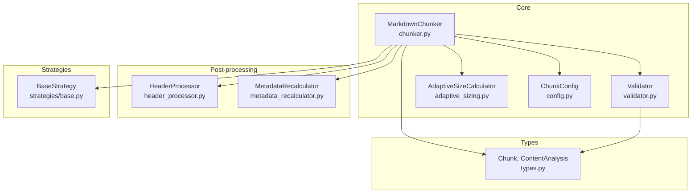
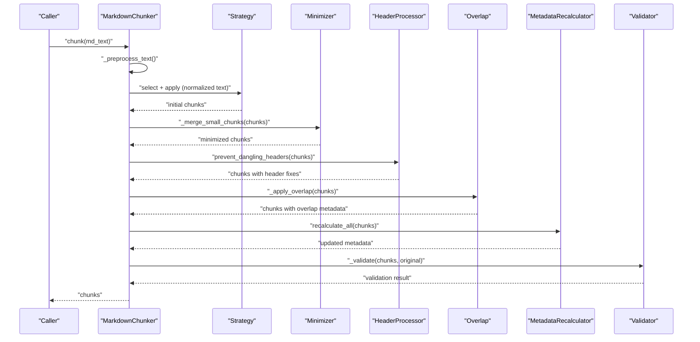
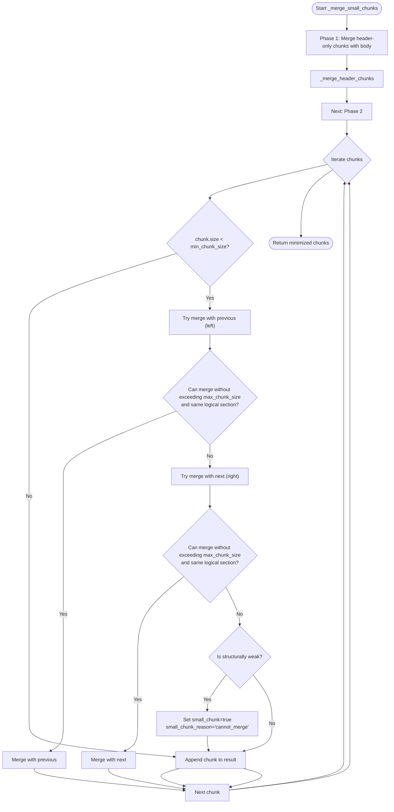
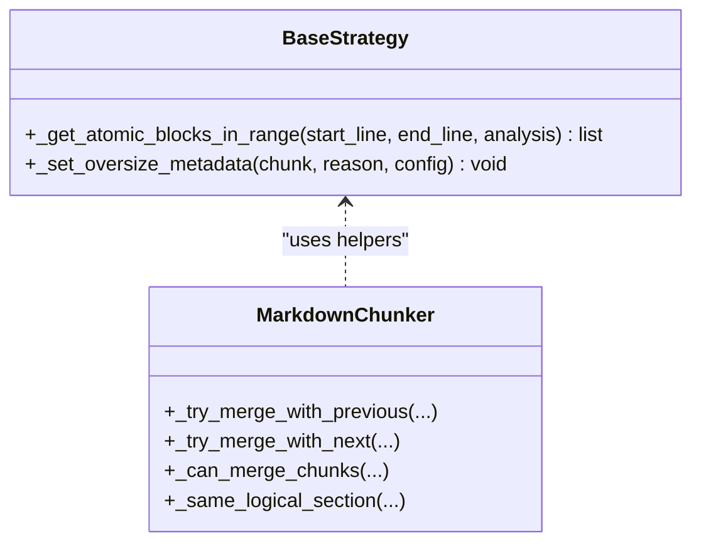
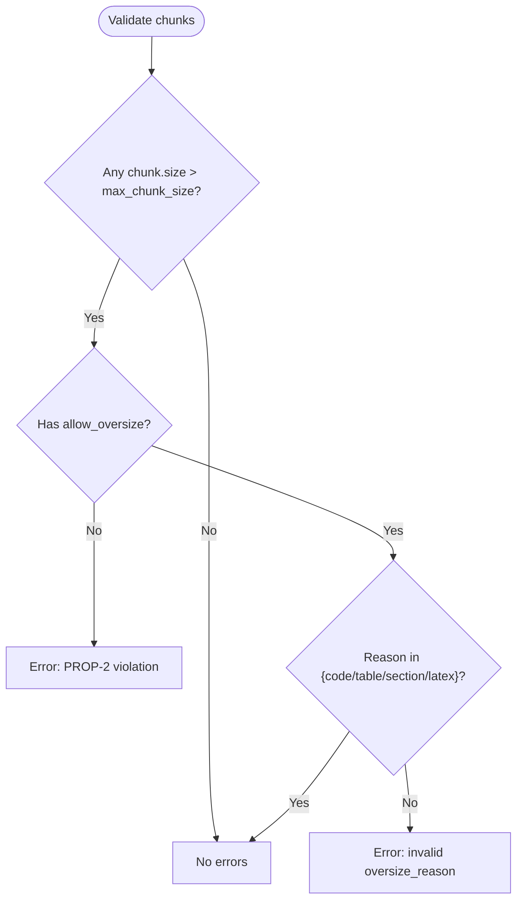
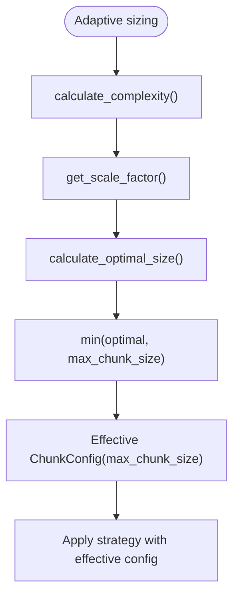
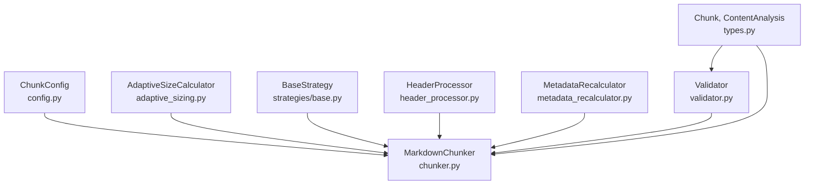

# Micro-Chunk Minimization

<cite>
**Referenced Files in This Document**
- [chunker.py](file://src/chunkana/chunker.py)
- [validator.py](file://src/chunkana/validator.py)
- [adaptive_sizing.py](file://src/chunkana/adaptive_sizing.py)
- [types.py](file://src/chunkana/types.py)
- [metadata_recalculator.py](file://src/chunkana/metadata_recalculator.py)
- [header_processor.py](file://src/chunkana/header_processor.py)
- [base.py](file://src/chunkana/strategies/base.py)
- [config.py](file://src/chunkana/config.py)
- [test_micro_chunks.py](file://test_micro_chunks.py)
</cite>

## Table of Contents
1. [Introduction](#introduction)
2. [Project Structure](#project-structure)
3. [Core Components](#core-components)
4. [Architecture Overview](#architecture-overview)
5. [Detailed Component Analysis](#detailed-component-analysis)
6. [Dependency Analysis](#dependency-analysis)
7. [Performance Considerations](#performance-considerations)
8. [Troubleshooting Guide](#troubleshooting-guide)
9. [Conclusion](#conclusion)

## Introduction
This document explains the micro-chunk minimization feature in Chunkana. It focuses on how the system identifies and merges insignificant small chunks while preserving atomic blocks such as code, tables, and LaTeX formulas. It also details the Validator’s role in detecting violations of size bounds (PROP-2), how the core chunker evaluates chunk size against min_chunk_size thresholds and safely merges without exceeding max_chunk_size, and how the adaptive_sizing module contributes to dynamic size optimization. Finally, it documents metadata flags like merge_reason and allow_oversize that track minimization actions and preserve context, and provides practical guidance for configuration and performance.

## Project Structure
The micro-chunk minimization feature spans several modules:
- Core chunking pipeline and minimization logic
- Validation of domain properties (including PROP-2)
- Adaptive sizing for dynamic chunk size optimization
- Metadata recalculations and header processing
- Strategy base helpers for atomic block preservation

**Diagram sources**
- [chunker.py](file://src/chunkana/chunker.py#L85-L176)
- [validator.py](file://src/chunkana/validator.py#L47-L92)
- [adaptive_sizing.py](file://src/chunkana/adaptive_sizing.py#L103-L168)
- [config.py](file://src/chunkana/config.py#L17-L126)
- [header_processor.py](file://src/chunkana/header_processor.py#L393-L451)
- [metadata_recalculator.py](file://src/chunkana/metadata_recalculator.py#L33-L72)
- [base.py](file://src/chunkana/strategies/base.py#L168-L209)
- [types.py](file://src/chunkana/types.py#L240-L376)

**Section sources**
- [chunker.py](file://src/chunkana/chunker.py#L85-L176)
- [config.py](file://src/chunkana/config.py#L17-L126)

## Core Components
- MarkdownChunker: orchestrates parsing, strategy selection, chunking, minimization, overlap, metadata enrichment, and validation.
- Validator: enforces domain properties including PROP-2 (size bounds).
- AdaptiveSizeCalculator: computes optimal chunk size based on content complexity.
- BaseStrategy: provides helpers for preserving atomic blocks and managing oversize reasons.
- Types: defines Chunk and ContentAnalysis, including metadata fields used by minimization.
- HeaderProcessor: prevents dangling headers and may merge chunks to respect size limits.
- MetadataRecalculator: recalculates derived metadata after post-processing.

**Section sources**
- [chunker.py](file://src/chunkana/chunker.py#L85-L176)
- [validator.py](file://src/chunkana/validator.py#L47-L92)
- [adaptive_sizing.py](file://src/chunkana/adaptive_sizing.py#L103-L168)
- [base.py](file://src/chunkana/strategies/base.py#L168-L209)
- [types.py](file://src/chunkana/types.py#L240-L376)
- [header_processor.py](file://src/chunkana/header_processor.py#L393-L451)
- [metadata_recalculator.py](file://src/chunkana/metadata_recalculator.py#L33-L72)

## Architecture Overview
The micro-chunk minimization pipeline integrates with the main chunking flow:

**Diagram sources**
- [chunker.py](file://src/chunkana/chunker.py#L85-L176)
- [chunker.py](file://src/chunkana/chunker.py#L431-L470)
- [chunker.py](file://src/chunkana/chunker.py#L470-L515)
- [chunker.py](file://src/chunkana/chunker.py#L301-L369)
- [metadata_recalculator.py](file://src/chunkana/metadata_recalculator.py#L33-L72)
- [validator.py](file://src/chunkana/validator.py#L47-L92)
- [header_processor.py](file://src/chunkana/header_processor.py#L405-L451)

## Detailed Component Analysis

### Micro-Chunk Minimization Algorithm
The minimizer runs after initial chunking and before overlap. It performs two phases:
1. Merge small header-only chunks with their section body.
2. For remaining small chunks, attempt to merge with adjacent chunks while respecting size bounds and section boundaries. If a small chunk cannot be merged without exceeding max_chunk_size and is structurally weak, it is flagged as small_chunk.

Key behaviors:
- Small chunk flagging requires the chunk to be below min_chunk_size, not mergeable with neighbors without exceeding max_chunk_size, and structurally weak (lacks strong headers, sufficient paragraphs, or meaningful content).
- Structural strength is evaluated heuristically: presence of header level 2 or 3, multiple paragraph breaks, sufficient non-header lines, or meaningful content after header extraction.
- Merge preferences:
  - Prefer merging with the previous chunk (left) over the next chunk (right).
  - Prefer merging within the same logical section (same header_path prefix up to two levels).
  - Preamble chunks are never merged with structural chunks.

**Diagram sources**
- [chunker.py](file://src/chunkana/chunker.py#L470-L515)
- [chunker.py](file://src/chunkana/chunker.py#L516-L634)
- [chunker.py](file://src/chunkana/chunker.py#L634-L776)
- [chunker.py](file://src/chunkana/chunker.py#L777-L800)

**Section sources**
- [chunker.py](file://src/chunkana/chunker.py#L470-L515)
- [chunker.py](file://src/chunkana/chunker.py#L516-L634)
- [chunker.py](file://src/chunkana/chunker.py#L634-L776)
- [chunker.py](file://src/chunkana/chunker.py#L777-L800)

### Atomic Block Preservation During Minimization
Atomic blocks (code, tables, LaTeX) must remain intact. The minimizer respects:
- Preamble vs structural chunk separation.
- Logical section boundaries when deciding whether to merge.
- Oversize reasons set by strategies when atomic blocks exceed max_chunk_size by design.

BaseStrategy provides helpers to:
- Detect atomic blocks in a given line range.
- Mark chunks as intentionally oversize with a valid reason (e.g., code_block_integrity, table_integrity, latex_integrity).

**Diagram sources**
- [base.py](file://src/chunkana/strategies/base.py#L168-L209)
- [base.py](file://src/chunkana/strategies/base.py#L90-L117)
- [chunker.py](file://src/chunkana/chunker.py#L708-L776)

**Section sources**
- [base.py](file://src/chunkana/strategies/base.py#L168-L209)
- [base.py](file://src/chunkana/strategies/base.py#L90-L117)
- [chunker.py](file://src/chunkana/chunker.py#L708-L776)

### Validator and PROP-2 Enforcement
The Validator enforces PROP-2: size bounds. It checks:
- All chunks respect max_chunk_size unless marked as allow_oversize.
- If allow_oversize is set, the oversize_reason must be one of the allowed values.

The chunker sets allow_oversize and oversize_reason for oversized chunks that preserve atomic integrity.

**Diagram sources**
- [validator.py](file://src/chunkana/validator.py#L115-L142)
- [chunker.py](file://src/chunkana/chunker.py#L431-L470)
- [base.py](file://src/chunkana/strategies/base.py#L90-L117)

**Section sources**
- [validator.py](file://src/chunkana/validator.py#L115-L142)
- [chunker.py](file://src/chunkana/chunker.py#L431-L470)
- [base.py](file://src/chunkana/strategies/base.py#L90-L117)

### Adaptive Sizing Contribution
Adaptive sizing dynamically adjusts max_chunk_size based on content complexity:
- Calculates a complexity score from code ratio, table ratio, list ratio, and average sentence length.
- Computes a scale factor and optimal size bounded by configured min/max scales.
- The chunker creates an effective config with the adaptive max size, capped by the user-configured max_chunk_size, and disables recursive adaptive sizing in that pass.

**Diagram sources**
- [adaptive_sizing.py](file://src/chunkana/adaptive_sizing.py#L120-L168)
- [adaptive_sizing.py](file://src/chunkana/adaptive_sizing.py#L169-L181)
- [chunker.py](file://src/chunkana/chunker.py#L117-L145)

**Section sources**
- [adaptive_sizing.py](file://src/chunkana/adaptive_sizing.py#L120-L168)
- [adaptive_sizing.py](file://src/chunkana/adaptive_sizing.py#L169-L181)
- [chunker.py](file://src/chunkana/chunker.py#L117-L145)

### Metadata Flags and Context Tracking
During minimization and related operations, the system tracks:
- small_chunk: set when a small chunk cannot be merged and is structurally weak.
- small_chunk_reason: currently "cannot_merge".
- allow_oversize and oversize_reason: set when a chunk exceeds max_chunk_size by design to preserve atomic integrity.
- merge_reason: set when a merge occurs (e.g., dangling header prevention).
- header_moved_from: tracks the source chunk index when a header is moved or merged.

These flags are used by validators and downstream consumers to interpret chunking decisions.

**Section sources**
- [types.py](file://src/chunkana/types.py#L240-L376)
- [chunker.py](file://src/chunkana/chunker.py#L470-L515)
- [header_processor.py](file://src/chunkana/header_processor.py#L240-L361)
- [base.py](file://src/chunkana/strategies/base.py#L90-L117)

### Examples from the Codebase
- Small chunk identification and flagging: see the small_chunk flagging logic and structural strength evaluation.
- Safe merging with concatenation and line range updates: see the merge helpers that construct new Chunk instances with updated start_line/end_line.
- Oversized atomic blocks: see the oversize metadata setting in strategies and the chunker’s PROP-2 handling.

Concrete references:
- Small chunk flagging and structural strength: [chunker.py](file://src/chunkana/chunker.py#L470-L515), [chunker.py](file://src/chunkana/chunker.py#L634-L707)
- Merge helpers and content concatenation: [chunker.py](file://src/chunkana/chunker.py#L708-L776)
- Oversize metadata and reasons: [base.py](file://src/chunkana/strategies/base.py#L90-L117), [chunker.py](file://src/chunkana/chunker.py#L431-L470)
- Tests demonstrating minimization behavior: [test_micro_chunks.py](file://test_micro_chunks.py#L1-L329)

**Section sources**
- [chunker.py](file://src/chunkana/chunker.py#L470-L515)
- [chunker.py](file://src/chunkana/chunker.py#L634-L707)
- [chunker.py](file://src/chunkana/chunker.py#L708-L776)
- [base.py](file://src/chunkana/strategies/base.py#L90-L117)
- [test_micro_chunks.py](file://test_micro_chunks.py#L1-L329)

## Dependency Analysis
The minimization feature depends on:
- Chunker pipeline stages: strategy application, minimization, header processing, overlap, metadata recalculation, validation.
- Config parameters controlling thresholds and behavior.
- Strategy helpers for atomic block awareness and oversize reasons.
- Validator for enforcing PROP-2.

**Diagram sources**
- [config.py](file://src/chunkana/config.py#L17-L126)
- [chunker.py](file://src/chunkana/chunker.py#L85-L176)
- [adaptive_sizing.py](file://src/chunkana/adaptive_sizing.py#L103-L168)
- [base.py](file://src/chunkana/strategies/base.py#L168-L209)
- [header_processor.py](file://src/chunkana/header_processor.py#L393-L451)
- [metadata_recalculator.py](file://src/chunkana/metadata_recalculator.py#L33-L72)
- [validator.py](file://src/chunkana/validator.py#L47-L92)
- [types.py](file://src/chunkana/types.py#L240-L376)

**Section sources**
- [config.py](file://src/chunkana/config.py#L17-L126)
- [chunker.py](file://src/chunkana/chunker.py#L85-L176)
- [adaptive_sizing.py](file://src/chunkana/adaptive_sizing.py#L103-L168)
- [base.py](file://src/chunkana/strategies/base.py#L168-L209)
- [header_processor.py](file://src/chunkana/header_processor.py#L393-L451)
- [metadata_recalculator.py](file://src/chunkana/metadata_recalculator.py#L33-L72)
- [validator.py](file://src/chunkana/validator.py#L47-L92)
- [types.py](file://src/chunkana/types.py#L240-L376)

## Performance Considerations
- Minimization runs in linear time relative to the number of chunks, with constant-time checks per pair of adjacent chunks.
- Structural strength checks involve simple heuristics (counts of paragraph breaks, non-header lines, and stripped content length) that are efficient.
- Adaptive sizing adds a constant-time overhead per document pass, dominated by complexity scoring and optimal size computation.
- Overlap computation is linear in the number of chunks and proportional to overlap window sizes.
- For very large documents with many small segments, consider:
  - Tuning min_chunk_size and max_chunk_size to reduce the number of micro-chunks.
  - Enabling adaptive sizing to increase max_chunk_size for complex content.
  - Using streaming chunking for memory efficiency when processing extremely large files.

[No sources needed since this section provides general guidance]

## Troubleshooting Guide
Common issues and resolutions:
- Small chunks remain after minimization:
  - Verify structural strength: chunks with strong headers, multiple paragraphs, or meaningful content are intentionally not flagged.
  - Adjust min_chunk_size to a lower threshold if acceptable for your workload.
- Merging prevented by size constraints:
  - The minimizer avoids merges that would exceed max_chunk_size. Consider increasing max_chunk_size or reducing overlap to improve merge feasibility.
- Merging prevented by atomic block boundaries:
  - Preamble chunks are isolated from structural chunks. If a small preamble chunk cannot be merged, it is expected.
  - For dangling headers, the system may merge chunks to respect size limits; otherwise, it logs a warning.
- Oversized chunks with allow_oversize:
  - Oversized chunks are permitted when preserving atomic integrity. Ensure oversize_reason is set appropriately by strategies.
- Metadata anomalies after merges:
  - Use MetadataRecalculator to recompute section_tags and ensure consistency.

**Section sources**
- [chunker.py](file://src/chunkana/chunker.py#L470-L515)
- [chunker.py](file://src/chunkana/chunker.py#L708-L776)
- [header_processor.py](file://src/chunkana/header_processor.py#L240-L361)
- [metadata_recalculator.py](file://src/chunkana/metadata_recalculator.py#L33-L72)
- [validator.py](file://src/chunkana/validator.py#L115-L142)

## Conclusion
Micro-chunk minimization in Chunkana balances compactness with readability by merging small, structurally weak chunks while preserving atomic blocks and respecting size bounds. The Validator enforces PROP-2 rigorously, the chunker’s minimizer applies careful merge heuristics, and adaptive sizing tailors chunk sizes to content complexity. Metadata flags provide traceability for downstream consumers. With thoughtful configuration of thresholds and optional adaptive sizing, the system delivers robust chunking for diverse document types.