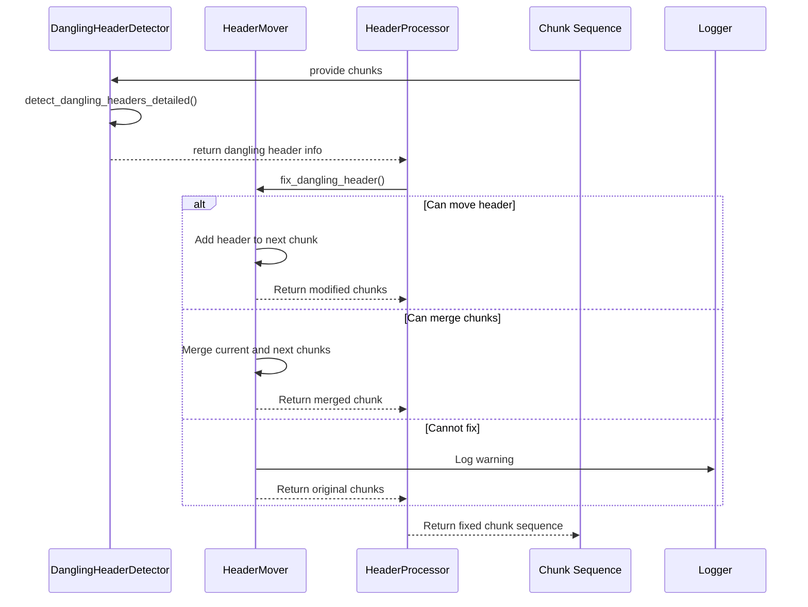
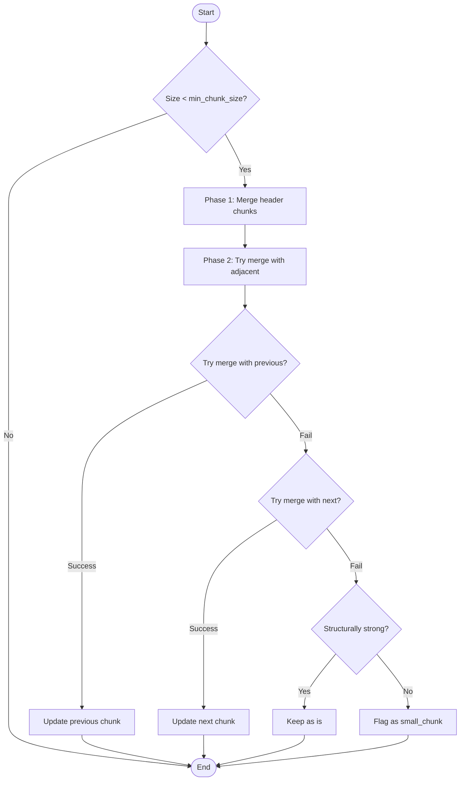
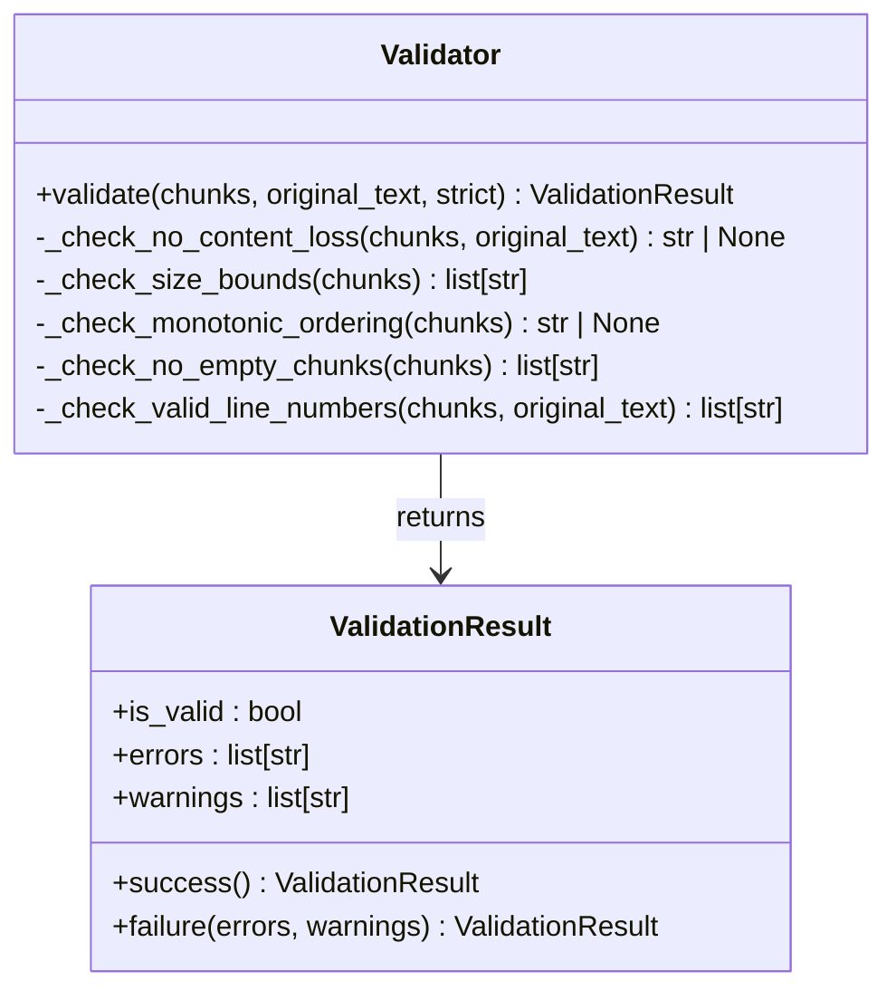
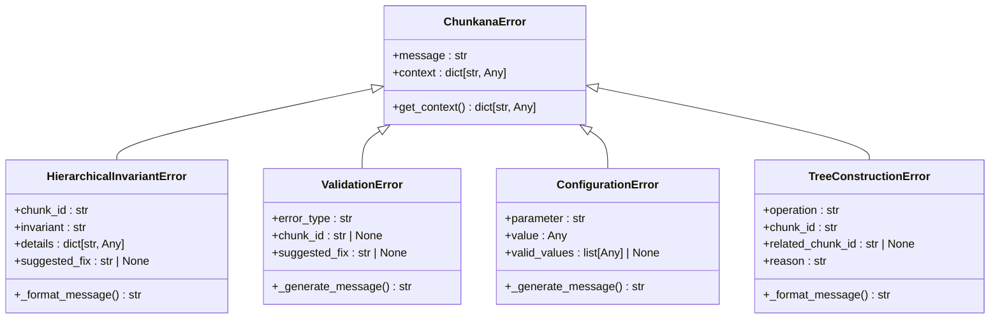

# Quality Assurance

<cite>
**Referenced Files in This Document**   
- [header_processor.py](file://src/chunkana/header_processor.py)
- [validator.py](file://src/chunkana/validator.py)
- [exceptions.py](file://src/chunkana/exceptions.py)
- [types.py](file://src/chunkana/types.py)
- [config.py](file://src/chunkana/config.py)
- [chunker.py](file://src/chunkana/chunker.py)
- [test_dangling_headers.py](file://test_dangling_headers.py)
- [test_micro_chunks.py](file://test_micro_chunks.py)
</cite>

## Table of Contents
1. [Introduction](#introduction)
2. [Dangling Header Prevention](#dangling-header-prevention)
3. [Micro-Chunk Minimization](#micro-chunk-minimization)
4. [Validation and Integrity Checking](#validation-and-integrity-checking)
5. [Exception Hierarchy and Error Handling](#exception-hierarchy-and-error-handling)
6. [Configuration Options](#configuration-options)
7. [Debugging and Testing Tools](#debugging-and-testing-tools)
8. [Examples of Problematic Inputs](#examples-of-problematic-inputs)
9. [Conclusion](#conclusion)

## Introduction
Chunkana provides robust quality assurance features to ensure high-quality document chunking. The system focuses on two primary mechanisms: dangling header prevention and micro-chunk minimization. These features work together with comprehensive validation, a structured exception hierarchy, and configurable behavior to produce reliable, semantically coherent chunks. This documentation details how these quality assurance mechanisms operate, their implementation, and how to configure and debug them effectively.

## Dangling Header Prevention

Chunkana's dangling header prevention system ensures that headers remain properly connected to their content, preventing situations where a header is separated from its associated text across chunk boundaries. The system uses a multi-step approach involving detection, analysis, and remediation.

The header processor detects dangling headers by analyzing chunk sequences and identifying headers at the end of chunks that should be connected to content in subsequent chunks. Specifically, it looks for headers of levels 3-6 (### and deeper) that appear at the end of a chunk while their content resides in the next chunk. The detection algorithm examines the last non-empty line of a chunk to determine if it's a header, checks if there's minimal content after the header in the current chunk, and verifies that the next chunk contains content that belongs to this header rather than starting with a header of the same or higher level.

When a dangling header is detected, Chunkana attempts to fix it through one of three strategies: moving the header to the beginning of the next chunk, merging the chunks if moving would exceed size limits, or leaving the chunks unchanged with a warning if merging would also exceed limits. This ensures that headers and their content remain together while respecting the configured size constraints.



**Diagram sources**
- [header_processor.py](file://src/chunkana/header_processor.py#L29-L450)

**Section sources**
- [header_processor.py](file://src/chunkana/header_processor.py#L1-L474)
- [test_dangling_headers.py](file://test_dangling_headers.py#L1-L271)

## Micro-Chunk Minimization

Micro-chunk minimization in Chunkana addresses the problem of excessively small chunks that lack sufficient context or meaningful content. The system employs a sophisticated algorithm that identifies insignificant small chunks and merges them with adjacent chunks while preserving important atomic blocks.

The algorithm operates in two phases. First, it merges small header-only chunks (typically level 1 or 2 headers under 150 characters) with their section body chunks when they belong to the same logical section. This prevents top-level headers from creating standalone chunks with minimal content. Second, it processes remaining small chunks by attempting to merge them with adjacent chunks, with a preference for merging with the previous chunk and within the same logical section.

Chunks that cannot be merged without exceeding the maximum chunk size are flagged as "small_chunk" only if they are structurally weak. Structural strength is determined by several criteria: presence of level 2-3 headers, multiple paragraphs, at least three lines of non-header content, or more than 100 characters of meaningful content after header extraction. This ensures that small chunks with significant structural elements are preserved rather than being merged or flagged.



**Diagram sources**
- [chunker.py](file://src/chunkana/chunker.py#L470-L803)
- [test_micro_chunks.py](file://test_micro_chunks.py#L1-L329)

**Section sources**
- [chunker.py](file://src/chunkana/chunker.py#L470-L803)
- [test_micro_chunks.py](file://test_micro_chunks.py#L1-L329)

## Validation and Integrity Checking

Chunkana's validator plays a crucial role in ensuring the structural integrity and content quality of chunked documents. It checks against five key domain properties (PROP-1 through PROP-5) to validate the chunking results.

The validator performs the following checks:
- **PROP-1: No Content Loss** - Ensures the total content in chunks approximately equals the original document, allowing for minor variance due to whitespace normalization
- **PROP-2: Size Bounds** - Verifies all chunks respect the maximum chunk size unless explicitly marked as oversize with a valid reason
- **PROP-3: Monotonic Ordering** - Confirms chunks are in order by their start line numbers
- **PROP-4: No Empty Chunks** - Ensures all chunks have non-empty content
- **PROP-5: Valid Line Numbers** - Validates that line numbers are correct (start line ≥ 1, end line ≥ start line, end line ≤ total lines)

The validator returns a ValidationResult object containing boolean validity status, error messages, and warnings. It can operate in strict mode where warnings are treated as errors. The validation process is integrated into the chunking pipeline and can be enabled or disabled via configuration.



**Diagram sources**
- [validator.py](file://src/chunkana/validator.py#L32-L221)
- [types.py](file://src/chunkana/types.py#L240-L243)

**Section sources**
- [validator.py](file://src/chunkana/validator.py#L1-L221)

## Exception Hierarchy and Error Handling

Chunkana implements a comprehensive exception hierarchy designed to provide actionable error messages and debugging context. All exceptions inherit from the base ChunkanaError class, which includes debugging context and common error reporting functionality.

The hierarchy includes specialized exception types for different error categories:
- **HierarchicalInvariantError** - Raised when hierarchical tree invariants are violated, providing specific information about which invariant failed and actionable suggestions for resolution
- **ValidationError** - Thrown during chunk validation, providing information about validation failures with context for debugging
- **ConfigurationError** - Indicates configuration-related issues, offering guidance on valid parameter combinations and values
- **TreeConstructionError** - Raised when tree construction fails, providing information about which relationships couldn't be established

Each exception type includes detailed context information and suggested fixes where applicable. The base ChunkanaError class stores debugging context in a dictionary that can be accessed via the get_context() method. This structured approach to error handling enables developers to quickly diagnose and resolve issues while providing end users with meaningful error messages.



**Diagram sources**
- [exceptions.py](file://src/chunkana/exceptions.py#L11-L248)

**Section sources**
- [exceptions.py](file://src/chunkana/exceptions.py#L1-L248)

## Configuration Options

Chunkana provides extensive configuration options to control quality assurance behavior. These options are managed through the ChunkConfig class, which consolidates parameters into a simplified interface with sensible defaults.

Key configuration options for quality assurance include:
- **max_chunk_size** and **min_chunk_size**: Define the size bounds for chunks (default: 4096 and 512 characters)
- **overlap_size**: Controls the size of overlap context between chunks (default: 200 characters)
- **validate_invariants**: Enables or disables invariant validation (default: True)
- **strict_mode**: When enabled, treats validation warnings as errors (default: False)
- **overlap_cap_ratio**: Limits overlap to a fraction of adjacent chunk size (default: 0.35)

The configuration system also includes convenience methods for common use cases, such as `for_code_heavy()`, `for_structured()`, and `minimal()`, which return pre-configured instances optimized for specific document types. Configuration can be created from dictionaries for serialization purposes, and legacy parameter names are supported with deprecation warnings to ensure backward compatibility.

**Section sources**
- [config.py](file://src/chunkana/config.py#L1-L507)

## Debugging and Testing Tools

Chunkana includes comprehensive debugging and testing tools to help developers understand and verify the quality assurance features. These tools include dedicated test scripts, configuration options for debugging, and metadata tracking.

The system provides two primary test scripts: `test_dangling_headers.py` for verifying the dangling header prevention system and `test_micro_chunks.py` for testing the micro-chunk minimization algorithm. These tests validate that headers remain connected to their content and that small chunks are properly handled according to the defined rules.

For debugging, Chunkana includes several metadata fields that track the processing history:
- **dangling_header_fixed**: Indicates when a dangling header has been fixed
- **merge_reason**: Specifies why chunks were merged
- **header_moved_from**: Tracks the source chunk index when a header is moved
- **small_chunk** and **small_chunk_reason**: Flag chunks that are considered insignificant small chunks

The configuration system also supports a debug mode through the `strict_mode` parameter, which treats validation warnings as errors, helping to identify potential issues during development.

**Section sources**
- [test_dangling_headers.py](file://test_dangling_headers.py#L1-L271)
- [test_micro_chunks.py](file://test_micro_chunks.py#L1-L329)
- [config.py](file://src/chunkana/config.py#L109-L110)

## Examples of Problematic Inputs

Chunkana's quality assurance features address several common problematic input patterns that can lead to poor chunking results. These include documents with deeply nested headers, documents with many small sections, and documents with complex content structures.

For example, consider a document with a level 4 header at the end of a chunk followed by its content in the next chunk:

```markdown
# Main Section

Some content here.

#### Important Details

This is the detailed content that should stay with the header.
It has multiple lines of information.
```

Without dangling header prevention, this would result in the "#### Important Details" header being separated from its content. Chunkana detects this situation and either moves the header to the next chunk or merges the chunks to keep them together.

Another common issue is micro-chunks created by short sections:

```markdown
## Short Section

X

## Another Section

This section has substantial content.
```

Here, the "X" content creates a micro-chunk that lacks meaningful content. Chunkana's micro-chunk minimization algorithm identifies this as a structurally weak small chunk and either merges it with adjacent chunks or flags it appropriately.

The system also handles complex cases like preamble content before the first header:

```markdown
This is introductory content before any headers.
It should be kept separate.

# First Section

This is section content.
```

Chunkana preserves the preamble as a separate chunk while ensuring it doesn't get merged with structural content, maintaining the document's intended structure.

**Section sources**
- [test_dangling_headers.py](file://test_dangling_headers.py#L1-L271)
- [test_micro_chunks.py](file://test_micro_chunks.py#L1-L329)

## Conclusion

Chunkana's quality assurance system provides a comprehensive approach to ensuring high-quality document chunking through its two primary mechanisms: dangling header prevention and micro-chunk minimization. These features work in concert with a robust validation system, structured exception hierarchy, and flexible configuration options to produce reliable, semantically coherent chunks.

The dangling header prevention system ensures that headers remain properly connected to their content by detecting and fixing separation issues through header movement or chunk merging. The micro-chunk minimization algorithm identifies and handles insignificant small chunks while preserving important atomic blocks with structural significance.

Together with comprehensive validation, detailed error handling, and extensive configuration options, these quality assurance features make Chunkana a reliable solution for document chunking. The system's design prioritizes content integrity, structural coherence, and developer usability, providing both automated quality improvements and transparent debugging information when issues arise.